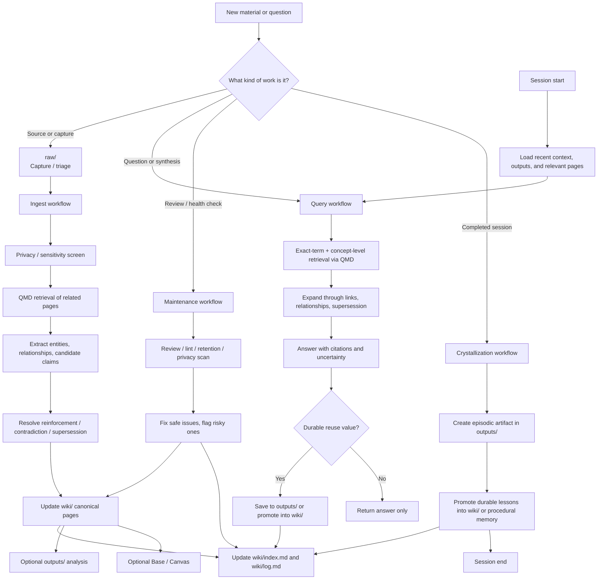

# LLM Wiki

A personal second-brain repository designed to be maintained by an LLM agent and browsed by a human in Obsidian.

This repo is not just a pile of notes. It is structured so an agent can:
- capture new material
- ingest sources into durable notes
- answer questions from the existing knowledge base
- crystallize completed research sessions into reusable memory
- review and maintain the vault over time
- create visual artifacts like Bases and Canvases when useful

The human provides direction. The agent does the repetitive knowledge work.

## What this repository is for

According to [`AGENTS.md`](./AGENTS.md), the mission is:

> Turn raw material into persistent, compounding memory.

That means the system should prefer:
- preserving source material
- updating existing knowledge instead of duplicating it
- keeping evidence and provenance
- promoting durable insights into `wiki/`
- saving reusable outputs in `outputs/`

## Repository structure

The core memory layers are:

- `raw/` → immutable capture layer
- `wiki/` → durable semantic knowledge layer
- `wiki/bases/` → operational dashboards
- `wiki/canvases/` → visual synthesis
- `outputs/` → derived analyses, briefings, answers, reports, crystallizations

Think of it as:
- `raw/` = inputs
- `wiki/` = canonical memory
- `outputs/` = useful deliverables and episodic artifacts

## Workflow overview

The current system is **manual-first, human-steered, and prompt-driven**. In practice, the agent uses prompts as thin entry points and skills as the durable workflow layer.

This diagram reflects the current implementation stance:
- markdown-first knowledge layer
- QMD-first retrieval
- prompts as entry points
- skills as workflow policy
- explicit privacy, contradiction, retention, and crystallization passes

## Prompt catalog

### Query and synthesis prompts

- [`query.md`](./.pi/prompts/query.md)
  - Use when you want the agent to answer a question from the existing knowledge base.
  - The agent should search the vault with QMD, use exact-term and concept-level retrieval, expand through relationships/supersession, synthesize an answer, cite pages, and persist the answer only if it has durable value.

- [`brief.md`](./.pi/prompts/brief.md)
  - Use for a short, decision-oriented brief using only existing knowledge.
  - Good for compact summaries: one-sentence summary, key points, and open questions or next steps.

- [`briefing.md`](./.pi/prompts/briefing.md)
  - Use for a fuller reusable briefing.
  - Good when you want current state, key tensions, open questions, and recommended next steps in a more durable format.

- [`connections.md`](./.pi/prompts/connections.md)
  - Use when you want the agent to identify meaningful connections between topics.
  - Good for analogies, causal links, shared mechanisms, and cross-topic synthesis.

- [`disagreements.md`](./.pi/prompts/disagreements.md)
  - Use when you want the agent to find conflicting claims across notes or sources.
  - Good for contradiction mapping and uncertainty handling.

- [`gaps.md`](./.pi/prompts/gaps.md)
  - Use when you want to know what is missing or underdeveloped in the knowledge base.

- [`explore.md`](./.pi/prompts/explore.md)
  - Use when you want the agent to look for unexplored but promising connections already latent in the vault.

- [`next-research.md`](./.pi/prompts/next-research.md)
  - Use when you want recommendations for what to research next based on current gaps and strong areas.

### Ingest prompts

- [`ingest.md`](./.pi/prompts/ingest.md)
  - Use when a source already exists in `raw/` and should be integrated into the wiki.
  - The workflow now includes privacy/sensitivity screening, claim extraction, contradiction handling, lifecycle refresh, and a quick quality check.

- [`ingest-batch.md`](./.pi/prompts/ingest-batch.md)
  - Use when you want to process a whole queue of unprocessed documents, typically in a `raw/` folder.
  - It applies the single-source ingest workflow repeatedly while preserving broad integration.

- [`ingest-url.md`](./.pi/prompts/ingest-url.md)
  - Use when starting from a web URL.
  - The intended flow is: clean the page, save it into `raw/web-clips/`, then run normal ingest with the same privacy/lifecycle/claim-aware checks.

### Maintenance and review prompts

- [`review.md`](./.pi/prompts/review.md)
  - Use for weekly or monthly review of the second brain.
  - Good for stale drafts, recent outputs, promotion opportunities, weakly integrated pages, and light privacy/retention review.

- [`lint.md`](./.pi/prompts/lint.md)
  - Use for a structured health check of the wiki.
  - Good for contradictions, orphan pages, weak links, stale knowledge, low-quality pages, visibility mismatches, and missing metadata.

- [`retention-pass.md`](./.pi/prompts/retention-pass.md)
  - Use when you want a focused stale-knowledge / decay review.
  - Good for checking `retention_class`, `last_confirmed`, and whether confidence should be lowered or pages should be marked stale.

- [`resolve-contradictions.md`](./.pi/prompts/resolve-contradictions.md)
  - Use for a targeted contradiction-resolution pass.
  - Good when a topic has conflicting claims and you want a recency/authority/support-based assessment.

- [`privacy-scan.md`](./.pi/prompts/privacy-scan.md)
  - Use to check recent or scoped downstream artifacts for secrets, credentials, PII, or other sensitive material.

### Session and crystallization prompts

- [`session-start.md`](./.pi/prompts/session-start.md)
  - Use at the beginning of a work session to load relevant recent context, outputs, and unresolved questions.

- [`crystallize.md`](./.pi/prompts/crystallize.md)
  - Use after a meaningful research, debugging, or exploration session.
  - The goal is to turn a completed thread into durable memory in `outputs/` and promote stable lessons into `wiki/`.

- [`session-end.md`](./.pi/prompts/session-end.md)
  - Use at the end of a session to distill what happened, preserve reusable lessons, and promote durable findings when justified.

## `llm-wiki-*` skills

These are the durable workflow skills that make the prompts work.

### [`llm-wiki-core`](./.pi/skills/llm-wiki-core/SKILL.md)
The shared operating system for the repo.

Use it before any meaningful work involving `raw/`, `wiki/`, or `outputs/`.
It defines:
- the memory architecture
- lifecycle rules
- naming rules
- metadata/frontmatter expectations
- citation and provenance rules
- index and log rules
- governance and decision hygiene

If you only read one skill first, read this one.

### [`llm-wiki-ingest`](./.pi/skills/llm-wiki-ingest/SKILL.md)
The workflow for processing new source material.

Use it for:
- captures arriving in `raw/inbox/` or `raw/captures/`
- ingesting a single source
- ingesting a batch of sources
- URL ingest workflows

It tells the agent to:
- preserve the raw source unless it is unsafe to retain
- read it fully
- run a privacy/sensitivity screen before downstream promotion
- find related existing pages
- extract entities, relationships, and candidate claims
- create/update source pages and canonical pages
- handle contradictions and supersession
- refresh lifecycle/visibility metadata when justified
- run a quick quality self-check
- update index and log

### [`llm-wiki-query`](./.pi/skills/llm-wiki-query/SKILL.md)
The workflow for answering questions from the vault.

Use it for:
- retrieval
- question answering
- briefings
- connections
- disagreements
- gap scans
- next-research recommendations

It tells the agent to:
- search with QMD using exact-term and concept-level retrieval
- expand from initial results via links, relationships, and supersession chains
- read the actual files before synthesizing
- answer with citations
- note confidence, staleness, dispute, or uncertainty when relevant
- persist valuable outputs only when reuse is likely and quality is sufficient

### [`llm-wiki-crystallize`](./.pi/skills/llm-wiki-crystallize/SKILL.md)
The workflow for turning a finished session into durable memory.

Use it when exploration itself became a useful source.
Typical outputs go into:
- `outputs/crystallizations/`
- `outputs/analyses/`

Then the durable lessons should be promoted into `wiki/`.

### [`llm-wiki-maintenance`](./.pi/skills/llm-wiki-maintenance/SKILL.md)
The workflow for ongoing health and quality work.

Use it for:
- weekly review
- monthly review
- linting
- retention review
- stale-page repair
- duplicate detection
- contradiction scans
- privacy scans
- cross-link improvement
- metadata refresh
- quality review

It also distinguishes between:
- safe automatic repairs
- risky structural changes that should require user approval

### [`llm-wiki-visualization`](./.pi/skills/llm-wiki-visualization/SKILL.md)
The workflow for visual and operational artifacts.

Use it when the task would benefit from:
- a Canvas for visual synthesis
- a Base for dashboards and queues
- live vault validation in Obsidian

This skill complements the markdown layer; it does not replace it.

## Companion skills you will also see

The `llm-wiki-*` skills often activate additional helper skills:

- `qmd`
  - Primary local search and retrieval tool for markdown in the vault.

- `obsidian-markdown`
  - Ensures notes are written in Obsidian-friendly markdown with proper wikilinks, frontmatter, and embeds.

- `defuddle`
  - Used for cleaning standard web pages before saving them into `raw/web-clips/`.

- `json-canvas`
  - Used for `.canvas` files.

- `obsidian-bases`
  - Used for `.base` dashboard files.

- `obsidian-cli`
  - Used when live interaction with the vault or running Obsidian is helpful.

- `ask-user`
  - Must be used before high-stakes, ambiguous, or irreversible structural decisions.

## Recommended usage patterns

### 1. Ingest a new source already in `raw/`
Use `ingest.md`.

What should happen:
- the source is read fully
- privacy/sensitivity is screened before downstream promotion
- related pages are found
- source and topic pages are updated
- contradictions or supersession are handled
- lifecycle/visibility metadata is refreshed when justified
- `wiki/index.md` and `wiki/log.md` are updated

### 2. Save a URL into the second brain
Use `ingest-url.md`.

What should happen:
- the page is cleaned
- saved into `raw/web-clips/`
- then integrated into the wiki like any other source

### 3. Ask what the vault already knows
Use `query.md`, `brief.md`, or `briefing.md`.

Choose based on output shape:
- `query` = direct answer
- `brief` = concise focused summary
- `briefing` = executive-style synthesis

### 4. Improve the vault without adding a new source
Use `review.md`, `lint.md`, `retention-pass.md`, `resolve-contradictions.md`, or `privacy-scan.md`.

Choose based on intent:
- `review` = operational maintenance pass
- `lint` = structured health audit
- `retention-pass` = stale-knowledge / decay review
- `resolve-contradictions` = focused conflict analysis and resolution
- `privacy-scan` = downstream sensitive-content audit

### 5. Start or end a session cleanly
Use `session-start.md` or `session-end.md`.

Choose based on intent:
- `session-start` = load relevant context and recent changes
- `session-end` = distill the session into durable episodic memory

### 6. Preserve lessons from a completed investigation
Use `crystallize.md`.

This is especially useful after:
- debugging work
- research sessions
- explorations that produced reusable insights

## Important repo rules for contributors

If you edit this repo manually or via an agent, keep these rules in mind:

- preserve raw sources
- prefer updating existing pages over creating near-duplicates
- cite factual claims
- preserve uncertainty explicitly
- keep notes Obsidian-friendly
- update `wiki/index.md` when important artifacts change
- append meaningful activity to `wiki/log.md`
- ask before bulk renames, deletions, taxonomy changes, or major schema changes

## Minimal setup

- Pi: `npm install -g @mariozechner/pi-coding-agent`
- Obsidian
- [qmd](https://github.com/tobi/qmd): `npm install -g @tobilu/qmd`

## References and origins

This repo is inspired by the LLM Wiki ideas and patterns:

- Author LLM Wiki: <https://gist.github.com/karpathy/442a6bf555914893e9891c11519de94f>
- LLM Wiki v2: <https://gist.github.com/rohitg00/2067ab416f7bbe447c1977edaaa681e2>
- Local reference copies in this repo: [`LLM-WIKI.md`](./LLM-WIKI.md) and [`LLM-WIKI-v2.md`](./LLM-WIKI-v2.md)

These references are especially relevant when changing the knowledge-system design, lifecycle rules, or overall operating model.

## If you want to extend the system

- Edit `AGENTS.md` if you want to change global rules.
- Edit `.pi/prompts/` if you want different user-facing entry points.
- Edit `.pi/skills/` if you want to change the actual workflows.
- Edit `.pi/extensions/` if you want to change local workflow routing, guardrails, reminders, or verification hooks.
- Read [`LLM-WIKI.md`](./LLM-WIKI.md) and [`LLM-WIKI-v2.md`](./LLM-WIKI-v2.md) before making system-level design changes.

## Local hook layer

This repo now includes project-local pi extensions in [`.pi/extensions/`](./.pi/extensions/).

The local hook layer is intentionally narrow. It helps with:
- deterministic workflow routing
- deterministic policy guardrails
- session reminders
- post-turn workflow verification
- structured session compaction memory
- notify-only capture watching
- explicit scheduled-maintenance trigger bridging

It does **not** replace the prompt-and-skill workflow layer. Semantic tasks like ingest reasoning, contradiction handling, and crystallization judgment still belong in prompts and skills.

Current local extensions:
- `workflow-router.ts` - routes bare URLs and raw file paths into the right prompts
- `vault-guardrails.ts` - enforces raw immutability, protects `wiki/log.md`, and screens downstream writes for sensitive content
- `workflow-auditor.ts` - reports likely incomplete workflow outcomes after a turn
- `session-reminders.ts` - reminds about pending captures and overdue review/lint work
- `compaction-memory.ts` - preserves structured episodic session state during compaction without writing durable files
- `inbox-watcher.ts` - watches `raw/inbox/` and `raw/captures/` while pi is running and suggests ingest commands for new files
- `scheduled-trigger.ts` - bridges external scheduled maintenance triggers into pi reminders or queued maintenance commands

For project-specific hook behavior and rollback notes, see [`docs/pi-hooks-local.md`](./docs/pi-hooks-local.md).
For scheduled maintenance setup, see [`docs/pi-scheduled-maintenance.md`](./docs/pi-scheduled-maintenance.md).

After editing hooks, use `/reload` inside pi to reload extensions, prompts, skills, and context files.

## Short version

If you are new here:
- start with `AGENTS.md`
- use `.pi/prompts/` to run tasks
- read `.pi/skills/llm-wiki-*` to understand the real workflows
- treat the repo as a compiled memory system, not a chat transcript
