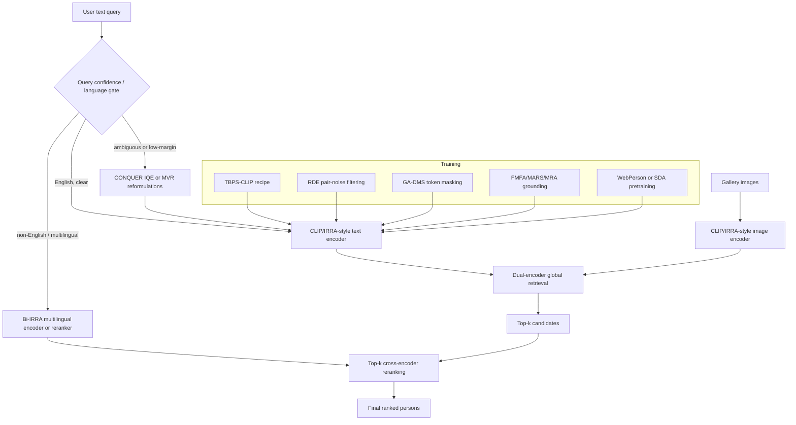

# TBPS Methods Synthesis and Hybrid Recommendation

## Short answer
The best current recommendation in this vault is **hybrid**, not a single-method winner: build a **CLIP/IRRA-style dual-encoder retrieval core**, train it with **TBPS-CLIP recipe discipline**, add **RDE/GA-DMS robustness**, add **FMFA/MARS/MRA fine-grained grounding and data pretraining where compute allows**, then deploy **CONQUER/MVR inference-time query compensation behind a confidence gate**. Add **Bi-IRRA** when multilingual retrieval is required.

This answer was refreshed after checking the log and the newly ingested `raw/codes/` companions. The code sources strengthen the recommendation because they show a recurring implementation pattern: most strong lines still orbit a CLIP/IRRA-style retrieval scaffold, while the newer gains are added as robustness, grounding, reranking, data, multilingual, or query-adaptation modules rather than as one clean replacement architecture. The new FMFA code companion further sharpens this view by confirming that FMFA keeps direct normalized global-similarity retrieval at inference, implements A-SDM and EFA explicitly in the loss path, and still fits the broader IRRA-family scaffold. Supported by [[text-to-image-person-retrieval]], [[synthesis-tbps-hybrid-design-space]], [[source-github-anosorae-irra]], [[source-github-flame-chasers-tbps-clip]], [[source-github-qinyang79-rde]], [[source-github-ergastialex-mars]], [[source-github-shuyu-xjtu-mra]], [[source-github-multimodal-representation-learning-mrl-ga-dms]], [[source-github-zqxie77-conquer]], [[source-github-flame-chasers-bi-irra]], and [[source-github-yinhao1102-fmfa]].

## Recommended best architecture: modular hybrid stack

### 1. Retrieval backbone: CLIP/IRRA-style dual encoder
Use a CLIP-initialized image/text encoder as the first-pass retrieval engine. IRRA's public implementation confirms the practical recipe: CLIP `ViT-B/16`, person-retrieval input geometry, SDM/MLM/ID objectives, and efficient normalized global-similarity inference rather than heavy matching at every gallery item. This makes it the most practical base layer for a hybrid system. Evidence: [[irra]], [[source-github-anosorae-irra]], [[text-to-image-person-retrieval]].

### 2. Recipe layer: TBPS-CLIP training discipline
Adopt the TBPS-CLIP lesson that a simple CLIP backbone can become strong through careful losses, augmentations, regularization, and training setup. The code confirms a modular system with image/text augmentation, optional MixGen, SimCLR, MLM, ID loss, N-ITC/R-ITC/C-ITC, and a simplified preset. Evidence: [[tbps-clip]], [[source-arxiv-2308-10045-tbps-clip]], [[source-github-flame-chasers-tbps-clip]].

### 3. Pair-level robustness: RDE-style clean/noisy modeling
Add explicit image-text pair noise handling. RDE's code shows a concrete implementation: BGE/TSE branches, per-sample losses, Gaussian-mixture clean/noisy splitting, consensus filtering, packaged synthetic-noise indices, and BGE+TSE score fusion. This is a strong module because noisy correspondence is a repeated failure mode in TBPS data. Evidence: [[rde]], [[noisy-correspondence]], [[source-github-qinyang79-rde]].

### 4. Token-level robustness: GA-DMS-style dual masking
Add token-level caption-noise suppression and informative-token reconstruction. The GA-DMS code confirms this is implemented as a CLIP/IRRA-derived scaffold with gradient-through-attention token maps, staged `FilterDataset` masking, SDM, and MLM. This complements RDE because it targets noisy tokens inside a caption rather than only noisy image-caption pairs. Evidence: [[ga-dms]], [[webperson]], [[source-github-multimodal-representation-learning-mrl-ga-dms]].

### 5. Fine-grained grounding: FMFA/MARS/MRA where compute and supervision allow
Use fine-grained grounding selectively:
- **FMFA route**: A-SDM adaptively emphasizes unmatched positive image-text pairs, while EFA adds explicit sparse token-patch alignment during training without requiring local matching at inference. The code companion confirms direct global-similarity evaluation, a concrete A-SDM weighting heuristic, and fixed-threshold EFA sparsification (`1 / num_patches`). This is useful when you want stronger grounding but still want global-feature retrieval, though the inspected snapshot also carries a pretraining-path reproduction caveat. Evidence: [[fmfa]], [[source-arxiv-2509-13754-fmfa]], [[source-github-yinhao1102-fmfa]].
- **MARS route**: attribute chunks, masked visual reconstruction, full-cross-attention top-k reranking. Strong when attribute-level precision matters, but heavier at training/evaluation time. Evidence: [[mars]], [[source-github-ergastialex-mars]].
- **MRA route**: Swin+BERT retrieval with SDA region-level supervision and ITC/ITM/MLM objectives; useful for domain-aligned synthetic pretraining and region-phrase alignment, but the code snapshot has reproduction caveats. Evidence: [[mra]], [[synthetic-domain-aligned-dataset]], [[domain-aware-diffusion]], [[source-github-shuyu-xjtu-mra]].

### 6. Data route: choose based on availability
Use one of two data strategies first, then test whether a curriculum helps:
- **Curated real-web pretraining** via WebPerson/GA-DMS when you can access and manage large curated image-text data. Evidence: [[webperson]], [[ga-dms]], [[source-github-multimodal-representation-learning-mrl-ga-dms]].
- **Domain-aligned synthetic pretraining** via MRA/SDA when real web scale is not available or when controlled region annotations matter. Evidence: [[mra]], [[synthetic-domain-aligned-dataset]], [[source-github-shuyu-xjtu-mra]].

### 7. Inference adaptation: CONQUER + MVR behind gates
Do not run expensive query compensation blindly for every query. Use it when the query is ambiguous, underspecified, long/noisy, or when top retrieval scores are low-margin.
- **CONQUER/IQE**: code confirms an external MLLM-assisted inference script that selects anchors, asks visual/attribute questions, aggregates new captions, re-embeds them, and interpolates refined scores. Evidence: [[conquer]], [[source-github-zqxie77-conquer]].
- **MVR**: training-free LLM multi-view reformulation and semantic compensation; useful when retraining is not possible. Evidence: [[mvr]], [[source-arxiv-2604-18376-mvr]].

### 8. Multilingual branch: Bi-IRRA when language matters
If deployment includes non-English text, use Bi-IRRA-style multilingual supervision or a separate multilingual reranking branch. The Bi-IRRA code confirms aligned source/target caption loading, X2-VLM/CCLM-style backbone with XLM-RoBERTa and BEiT v2, bi-lingual MLM/ITC/ITM, cross-lingual D-MIM, and top-k cross-encoder ITM reranking. This is powerful but heavier than a pure CLIP-style first pass. Evidence: [[bi-irra]], [[source-github-flame-chasers-bi-irra]].

## Practical architecture recommendation

### Minimal viable hybrid
If you need a buildable first version, start here:
1. IRRA/TBPS-CLIP backbone and recipe.
2. RDE-style clean/noisy pair filtering if training labels are noisy.
3. GA-DMS-style token masking if captions are noisy or generated.
4. FMFA-style A-SDM/EFA if you want training-time explicit alignment while preserving global inference.
5. MVR as training-free query augmentation for ambiguous text.
6. Add CONQUER IQE only when MLLM latency/cost is acceptable.
7. Add Bi-IRRA only for multilingual requirements.

### Stronger research-grade hybrid
For a paper-grade or benchmark-focused system:
1. Pretrain on either WebPerson or SDA; compare both if resources allow.
2. Fine-tune a CLIP/IRRA-style backbone with TBPS-CLIP recipe + RDE pair filtering + GA-DMS token masking.
3. Add FMFA-style explicit token-patch alignment, MARS-style attribute/chunk supervision, or MRA region-phrase alignment as ablation-controlled grounding modules.
4. Add top-k reranking: MARS/Bi-IRRA cross-encoder reranking for precision, CONQUER/MVR query compensation for ambiguous descriptions.
5. Report results by dataset and query regime, not only by one aggregate rank table.

## If forced to choose one existing method
- **Best deployable base:** [[tbps-clip]] or [[irra]] because the code paths are simpler and support efficient global retrieval.
- **Best noise-aware training module:** [[rde]] for pair noise; [[ga-dms]] for token noise.
- **Best fine-grained/reranking module:** [[fmfa]] if you want training-time explicit grounding while keeping global inference; [[mars]] if attribute precision and reranking cost are acceptable.
- **Best data-centric route:** [[ga-dms]]/[[webperson]] for large curated real data; [[mra]]/SDA for synthetic domain-aligned pretraining.
- **Best ambiguous-query add-on:** [[conquer]] or [[mvr]].
- **Best multilingual route:** [[bi-irra]].
- **Best overall recommendation:** a **hybrid built around CLIP/IRRA + TBPS-CLIP + RDE + GA-DMS + selective FMFA/MARS/MRA + gated CONQUER/MVR + optional Bi-IRRA**, not any single paper method.

## Supported facts vs inference

### Supported facts
- CLIP/IRRA-style dual encoders recur across the cluster and can keep inference efficient through global embedding similarity: [[source-github-anosorae-irra]], [[text-to-image-person-retrieval]].
- TBPS-CLIP is recipe-driven and modular in code: [[source-github-flame-chasers-tbps-clip]].
- RDE implements pair-level noisy-correspondence filtering and BGE/TSE score fusion: [[source-github-qinyang79-rde]].
- GA-DMS implements gradient-attention token maps and staged token masking in a CLIP/IRRA-like scaffold: [[source-github-multimodal-representation-learning-mrl-ga-dms]].
- MARS is a heavier ALBEF-style system with seven losses and top-k ITM reranking: [[source-github-ergastialex-mars]].
- MRA uses a Swin+BERT retrieval implementation with SDA region supervision and reproduction caveats in the inspected snapshot: [[source-github-shuyu-xjtu-mra]].
- FMFA is now paper-and-code ingested as an IRRA-family global matching method with A-SDM for unmatched positives and EFA for explicit sparse token-patch alignment while preserving global-feature inference: [[fmfa]], [[source-arxiv-2509-13754-fmfa]], [[source-github-yinhao1102-fmfa]].
- CONQUER separates CLIP/RDE-like training from external MLLM-assisted IQE reranking: [[source-github-zqxie77-conquer]].
- Bi-IRRA adds multilingual paired supervision and top-k cross-encoder reranking: [[source-github-flame-chasers-bi-irra]].
- MVR is represented in the vault as training-free semantic compensation at inference: [[mvr]], [[source-arxiv-2604-18376-mvr]].

### Inference / recommendation
- The full proposed hybrid has **not** been validated as one end-to-end architecture by a single source. The recommendation is an evidence-based synthesis that these modules target different bottlenecks and often attach around a shared retrieval scaffold. See [[synthesis-tbps-hybrid-design-space]].
- RDE pair-level robustness and GA-DMS token-level robustness are likely complementary, but this exact combination still needs ablation.
- MRA synthetic-domain alignment and GA-DMS/WebPerson real-web pretraining may be alternatives or a useful curriculum; the vault does not yet settle this.
- FMFA strengthens the case for training-time explicit grounding with efficient inference, and its public code is now ingested. Implementation-level confidence is higher than before, but the inspected snapshot still carries an apparent pretraining-path caveat in `processor/processor.py`, so reproduction confidence is not yet fully clean.
- CONQUER/MVR should be gated because their inference-time adaptation may add latency/cost and may be unnecessary for clear queries.

## Confidence and uncertainty
> [!warning] Dataset-dependent leadership
> The vault does **not** support a single global best TBPS method. Leadership is dataset- and regime-dependent: Bi-IRRA remains strong on CUHK-PEDES in current in-vault comparisons, while the MVR line reports stronger ICFG-PEDES/RSTPReid outcomes. IRRA, RDE, MRA, and GA-DMS contain historical benchmark claims that are later superseded or qualified by newer in-vault evidence.

> [!note] Code-source update
> The newly ingested code sources increase confidence in the **architecture shape** of the recommendation, especially the CLIP/IRRA scaffold plus modular add-ons. They do **not** create new benchmark results, so they should not be used to claim a new SOTA ranking.

### Evidence quality notes
- Strong / active for implementation shape: [[source-github-anosorae-irra]], [[source-github-flame-chasers-tbps-clip]], [[source-github-qinyang79-rde]], [[source-github-ergastialex-mars]], [[source-github-multimodal-representation-learning-mrl-ga-dms]], [[source-github-zqxie77-conquer]], [[source-github-flame-chasers-bi-irra]], [[source-github-yinhao1102-fmfa]], [[source-arxiv-2509-13754-fmfa]].
- Useful but with reproduction caveats: [[source-github-shuyu-xjtu-mra]], [[source-github-yinhao1102-fmfa]].
- Benchmark ranking remains mixed/disputed and should be read through [[text-to-image-person-retrieval]] and [[synthesis-tbps-hybrid-design-space]].
- Slightly lower confidence: [[mvr]] benchmark table readings remain conservative because the source table extraction had rendering noise; FMFA's architecture shape is now code-backed, but the pretraining path still merits validation before treating the repo as fully reproduction-clean.

## Informed by
[[text-to-image-person-retrieval]], [[synthesis-tbps-hybrid-design-space]], [[irra]], [[tbps-clip]], [[rde]], [[mars]], [[mra]], [[ga-dms]], [[conquer]], [[bi-irra]], [[mvr]], [[fmfa]], [[webperson]], [[noisy-correspondence]], [[source-github-anosorae-irra]], [[source-github-flame-chasers-tbps-clip]], [[source-github-qinyang79-rde]], [[source-github-ergastialex-mars]], [[source-github-shuyu-xjtu-mra]], [[source-github-multimodal-representation-learning-mrl-ga-dms]], [[source-github-zqxie77-conquer]], [[source-github-flame-chasers-bi-irra]], [[source-arxiv-2509-13754-fmfa]], [[source-github-yinhao1102-fmfa]].
