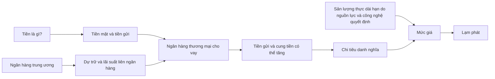

# Step 8 — Hệ thống tiền tệ, ngân hàng và lạm phát dài hạn

> [!abstract] Mục tiêu của bài
> Sau bài này, người học phải tách được **ba tầng cơ chế thường bị trộn lẫn**:
> 1. **Ngân hàng thương mại tạo tiền gửi** khi cho vay trong hệ thống dự trữ một phần.
> 2. **Ngân hàng trung ương điều hành chính sách tiền tệ** bằng cách tác động đến dự trữ, lãi suất và động cơ nắm giữ dự trữ của ngân hàng.
> 3. **Trong dài hạn**, tăng trưởng tiền nhanh hơn tăng trưởng sản lượng thực có xu hướng biểu hiện thành lạm phát, với điều kiện vận tốc tiền tương đối ổn định.
>
> Đây không phải ba cách nói về cùng một việc. Chúng là ba mắt xích khác nhau trong một chuỗi lập luận.

## 1. Bản đồ tư duy trước khi học

Hãy bắt đầu bằng chuỗi sau:

Sơ đồ này chứa hai ý quan trọng:

- Ngân hàng trung ương **không trực tiếp quyết định từng khoản vay** và cũng không kiểm soát hoàn hảo lượng tiền rộng như M1 hay M2.
- Trong dài hạn, in thêm đơn vị tiền không tự tạo thêm máy móc, kỹ năng lao động hay công nghệ. Nếu lượng chi tiêu danh nghĩa tăng nhanh hơn khả năng sản xuất thực, phần chênh lệch chủ yếu đi vào giá cả.

Bài học dựa trên Mankiw 8e Ch.16–17 và sáu khái niệm đã tổng hợp trong wiki: [các loại và cách đo tiền](../wiki/kinds-of-money-and-measurement-m1-m2.md), [Fed và chính sách tiền tệ](../wiki/federal-reserve-system-and-monetary-policy.md), [ngân hàng dự trữ một phần](../wiki/fractional-reserve-banking-and-money-multiplier.md), [công cụ kiểm soát cung tiền](../wiki/fed-tools-to-control-money-supply.md), [lãi suất quỹ liên bang](../wiki/federal-funds-rate-and-money-supply-target.md), và [lý thuyết số lượng tiền cùng chi phí lạm phát](../wiki/quantity-theory-of-money-inflation-and-costs.md).

---

## 2. Tiền là gì?

### 2.1. Ba chức năng

Một tài sản được xem là tiền khi nó thực hiện tốt ba chức năng:

1. **Phương tiện trao đổi:** dùng để mua hàng hóa và dịch vụ.
2. **Đơn vị tính toán:** dùng để niêm yết giá, ghi sổ và xác định nợ.
3. **Phương tiện cất giữ giá trị:** chuyển sức mua từ hiện tại sang tương lai.

Không phải mọi tài sản giữ giá trị đều là tiền. Một căn nhà có thể giữ giá trị nhưng không thuận tiện để mua bữa sáng. Trái phiếu có thể sinh lãi nhưng thường phải được bán hoặc chuyển đổi trước khi thanh toán. Tiền nổi bật vì có **tính thanh khoản cao**.

### 2.2. Tiền hàng hóa và tiền pháp định

- **Tiền hàng hóa** có giá trị nội tại ngoài công dụng làm tiền. Vàng và thuốc lá trong trại tù binh là các ví dụ kinh điển.
- **Tiền pháp định** không có giá trị nội tại tương xứng; nó được nhà nước công nhận và được xã hội chấp nhận vì mọi người tin người khác cũng sẽ nhận nó.

Tờ tiền giấy của Hoa Kỳ khác tiền trong trò Monopoly không chủ yếu vì chất liệu, mà vì thể chế, luật pháp và kỳ vọng xã hội đứng sau nó. Sắc lệnh của nhà nước rất quan trọng nhưng chưa đủ: một đồng tiền chính thức vẫn có thể bị từ chối nếu công chúng mất niềm tin vào khả năng giữ giá trị hoặc khả năng được người khác chấp nhận.

### 2.3. M1, M2 và ranh giới của tiền

Trong cách trình bày của giáo trình:

- **M1** gồm tiền mặt trong tay công chúng và các khoản tiền gửi có thể dùng trực tiếp để thanh toán.
- **M2** bao gồm M1 và các tài sản “gần tiền” như tiền gửi tiết kiệm, tiền gửi kỳ hạn nhỏ và một số quỹ thị trường tiền tệ.

Ranh giới không hoàn toàn tự nhiên. Công nghệ thanh toán có thể làm một tài sản trở nên dễ chuyển đổi hơn và do đó “giống tiền” hơn.

> [!warning] Thẻ tín dụng không phải là tiền
> Thẻ tín dụng cho phép **vay để hoãn thanh toán**. Khi trả hóa đơn thẻ, người dùng cuối cùng phải dùng tiền trong tài khoản hoặc một phương tiện thanh toán khác. Ngược lại, thẻ ghi nợ cho phép truy cập trực tiếp tiền gửi đã được tính trong thước đo tiền.

### 2.4. Bốn đại lượng rất dễ nhầm

| Đại lượng | Bản chất | Ví dụ |
|---|---|---|
| Tiền | Tài sản thanh khoản dùng để giao dịch | Tiền mặt, tiền gửi thanh toán |
| Thu nhập | Một **dòng** nhận được trong một khoảng thời gian | Lương 20 triệu đồng/tháng |
| Tiết kiệm | Phần thu nhập không tiêu dùng trong một khoảng thời gian | Tiết kiệm 4 triệu đồng/tháng |
| Của cải ròng | Một **tồn lượng** tài sản trừ nợ tại một thời điểm | Nhà + tiền gửi − khoản vay |

Một người “có nhiều tiền” trong ngôn ngữ đời thường có thể là người giàu, nhưng trong kinh tế học lượng tiền chỉ là một phần của danh mục tài sản.

---

## 3. Ngân hàng thương mại tạo tiền như thế nào?

### 3.1. Mốc đối chiếu: dự trữ 100%

Giả sử nền kinh tế ban đầu có 100 đơn vị tiền mặt. Một người gửi toàn bộ vào Ngân hàng A. Nếu ngân hàng giữ **100% dự trữ**, bảng cân đối đơn giản là:

| Tài sản của Ngân hàng A | Nợ phải trả của Ngân hàng A |
|---|---|
| Dự trữ: 100 | Tiền gửi: 100 |

Tiền mặt trong tay công chúng giảm 100, tiền gửi tăng 100. Tổng phương tiện thanh toán vẫn là 100. **Hành động gửi tiền tự nó chưa tạo thêm tiền.** Nó chỉ đổi hình thức từ tiền mặt sang tiền gửi.

### 3.2. Dự trữ một phần

Ngân hàng nhận thấy người gửi tiền thường không rút tất cả cùng lúc. Nếu tỷ lệ dự trữ là 10%, Ngân hàng A có thể giữ 10 và cho vay 90:

| Tài sản của Ngân hàng A | Nợ phải trả của Ngân hàng A |
|---|---|
| Dự trữ: 10 | Tiền gửi: 100 |
| Khoản cho vay: 90 | |

Người gửi ban đầu vẫn có số dư 100 để chi tiêu. Người vay có thêm sức mua 90. Nếu xét tiền mặt và tiền gửi có thể thanh toán, cung tiền lúc này là 190.

> [!important] Tiền tăng, của cải ròng không tự tăng
> Người vay nhận một tài sản có tính thanh khoản nhưng đồng thời phát sinh một khoản nợ cùng giá trị. Ngân hàng tạo thêm phương tiện trao đổi, không tạo ra nhà máy, lương thực hay của cải ròng chỉ bằng một bút toán.

### 3.3. Quá trình lặp lại và số nhân tiền đơn giản

Nếu 90 được chi rồi gửi vào Ngân hàng B, ngân hàng này giữ 9 và cho vay 81. Nếu 81 tiếp tục được gửi, ngân hàng kế tiếp giữ 8,1 và cho vay 72,9. Tổng tiền gửi là cấp số nhân:

$$
100 + 90 + 81 + 72{,}9 + \cdots = \frac{100}{0{,}1}=1.000
$$

Trong mô hình rất đơn giản:

$$
\text{Số nhân tiền}=\frac{1}{R}
$$

với $R$ là tỷ lệ dự trữ. Nếu $R=10\%$, số nhân là 10; nếu $R=20\%$, số nhân là 5.

### 3.4. Vì sao đây chỉ là mô hình nhập môn?

Kết quả $1/R$ cần các giả định mạnh:

- mọi khoản tiền cho vay đều quay lại hệ thống ngân hàng dưới dạng tiền gửi;
- ngân hàng không giữ dự trữ vượt mức;
- luôn có người vay đủ tin cậy và có nhu cầu vay;
- công chúng không tăng tỷ lệ nắm tiền mặt;
- khái niệm tiền đang xét gần với tiền gửi thanh toán.

Nếu người dân giữ tiền mặt, tiền rò khỏi vòng tái gửi. Nếu ngân hàng lo ngại rủi ro và giữ dự trữ vượt mức, vòng cho vay ngắn lại. Vì thế số nhân quan sát được có thể khác xa $1/R$.

> [!example] Ví dụ rò rỉ tiền mặt
> Với tỷ lệ dự trữ 20%, nếu sau mỗi khoản vay công chúng giữ lại một nửa dưới dạng tiền mặt, chỉ 40% khoản tiền ban đầu đi vào vòng gửi–cho vay kế tiếp: $0{,}8 \times 0{,}5=0{,}4$. Chuỗi tiền gửi co lại nhanh hơn nhiều so với trường hợp mọi khoản vay đều được tái gửi.

### 3.5. Tiền cơ sở không phải cung tiền rộng

- **Tiền cơ sở** gồm tiền mặt lưu hành cộng dự trữ của ngân hàng.
- **Cung tiền rộng** gồm tiền mặt của công chúng cộng các loại tiền gửi được tính vào M1/M2.

Dự trữ tại ngân hàng trung ương là tài sản thanh toán giữa ngân hàng với ngân hàng trung ương; nó không giống tiền gửi mà hộ gia đình dùng để mua hàng. Ngân hàng trung ương kiểm soát tiền cơ sở trực tiếp hơn, còn cung tiền rộng phụ thuộc thêm vào lựa chọn cho vay của ngân hàng và lựa chọn tiền mặt–tiền gửi của công chúng.

### 3.6. Vốn ngân hàng khác dự trữ

Đây là một nhầm lẫn quan trọng:

- **Dự trữ** là tài sản thanh khoản ngân hàng giữ để đáp ứng thanh toán và rút tiền.
- **Vốn ngân hàng** là phần tài sản thuộc về chủ sở hữu sau khi trừ nợ phải trả.

Một ngân hàng có tài sản 1.000, nợ 950 và vốn 50 có tỷ lệ đòn bẩy:

$$
\text{Đòn bẩy}=\frac{1.000}{50}=20
$$

Nếu giá trị tài sản giảm 5%, ngân hàng mất 50 — toàn bộ vốn. Đòn bẩy vì vậy khuếch đại cả lãi lẫn lỗ. Trong khủng hoảng 2008–2009, thua lỗ tài sản làm vốn ngân hàng suy giảm; để đáp ứng yêu cầu vốn, ngân hàng có thể thu hẹp cho vay, tạo ra **credit crunch**. Đây là vấn đề về khả năng hấp thụ lỗ, không đơn thuần là thiếu dự trữ thanh toán.

---

## 4. Ngân hàng trung ương làm gì?

Bài dùng Cục Dự trữ Liên bang Hoa Kỳ (**Fed**) theo Mankiw, nhưng khung tư duy có thể áp dụng cho các ngân hàng trung ương khác với thể chế cụ thể khác nhau.

### 4.1. Hai vai trò lớn

1. **Góp phần duy trì an toàn của hệ thống ngân hàng:** giám sát, cung cấp dịch vụ thanh toán và làm người cho vay cuối cùng khi hệ thống thiếu thanh khoản.
2. **Thực thi chính sách tiền tệ:** tác động đến điều kiện tiền tệ và tín dụng, trong trình bày của Mankiw là kiểm soát cung tiền và điều hành lãi suất.

Ở Hoa Kỳ, các quyết định thị trường mở thuộc FOMC. Fed gồm Hội đồng Thống đốc tại Washington và 12 ngân hàng khu vực; cấu trúc này vừa tạo trách nhiệm công vừa hạn chế áp lực chính trị ngắn hạn.

### 4.2. Công cụ số 1: nghiệp vụ thị trường mở

**Fed mua trái phiếu:**

1. Fed mua trái phiếu chính phủ từ khu vực tư nhân.
2. Fed ghi tăng dự trữ cho hệ thống ngân hàng.
3. Hệ thống có nhiều dự trữ/thanh khoản hơn.
4. Lãi suất vay dự trữ qua đêm chịu áp lực giảm.
5. Trong mô hình truyền thống, ngân hàng có thêm khả năng cho vay và tiền gửi có thể tăng.

**Fed bán trái phiếu:** chuỗi vận động theo chiều ngược lại — dự trữ bị hút bớt, lãi suất qua đêm chịu áp lực tăng và điều kiện tiền tệ thắt chặt hơn.

Giao dịch giữa hai cá nhân chỉ chuyển tiền từ người này sang người kia. Giao dịch với ngân hàng trung ương khác ở chỗ ngân hàng trung ương có thể tạo hoặc thu hồi nghĩa vụ tiền cơ sở của chính mình.

### 4.3. Cho ngân hàng vay

Ngân hàng thiếu dự trữ có thể vay trực tiếp từ Fed qua **cửa sổ chiết khấu**, trả **lãi suất chiết khấu**.

- Lãi suất chiết khấu thấp hơn hoặc điều kiện vay dễ hơn khuyến khích vay dự trữ.
- Lãi suất cao hơn hoặc điều kiện chặt hơn làm việc vay dự trữ kém hấp dẫn.

Trong khủng hoảng, chức năng này còn có ý nghĩa **người cho vay cuối cùng**: một tổ chức có thể vẫn có tài sản tốt về dài hạn nhưng thiếu tiền mặt tức thời do người gửi rút ồ ạt. Cho vay thanh khoản có thể tránh việc bán tháo tài sản. Tuy nhiên, cứu trợ không được thiết kế cẩn thận có thể làm tăng rủi ro đạo đức.

### 4.4. Yêu cầu dự trữ

Ngân hàng trung ương có thể quy định tỷ lệ dự trữ tối thiểu:

- tăng yêu cầu dự trữ → ngân hàng giữ nhiều hơn, cho vay ít hơn → số nhân đơn giản giảm;
- giảm yêu cầu → ngân hàng có thể cho vay nhiều hơn → số nhân đơn giản tăng.

Mankiw lưu ý công cụ này ít được thay đổi vì một điều chỉnh đột ngột có thể gây xáo trộn bảng cân đối và buộc ngân hàng thu hẹp tín dụng. Các mô tả về tỷ lệ cụ thể trong sách là mô tả theo thời kỳ nguồn, không nên tự động xem là quy định hiện hành.

### 4.5. Trả lãi trên dự trữ

Khi dự trữ được trả lãi, ngân hàng phải so sánh:

- lợi suất an toàn khi giữ dự trữ;
- lợi suất kỳ vọng sau rủi ro khi cho doanh nghiệp hoặc hộ gia đình vay.

Lãi trên dự trữ cao hơn làm việc giữ dự trữ hấp dẫn hơn, nên có thể hạn chế mở rộng cho vay và tiền gửi. Sau các chương trình mua tài sản quy mô lớn, hệ thống có thể dư thừa dự trữ; trong hoàn cảnh đó, lãi suất trả trên dự trữ trở thành công cụ điều hành quan trọng hơn cơ chế số nhân cố định của mô hình cũ.

---

## 5. Federal funds rate: mục tiêu, không phải “giá tiền” duy nhất

### 5.1. Định nghĩa

**Federal funds rate** là lãi suất các ngân hàng tính cho nhau khi vay dự trữ, thường qua đêm. Nó khác **discount rate**, là lãi suất ngân hàng trả khi vay trực tiếp từ Fed.

Chỉ ngân hàng giao dịch trực tiếp trên thị trường federal funds, nhưng lãi suất này có ảnh hưởng rộng vì các lãi suất tài chính liên kết với nhau. Nó tác động đến cấu trúc chi phí vốn và kỳ vọng, dù lãi suất thế chấp, trái phiếu doanh nghiệp hay thẻ tín dụng không nhất thiết thay đổi một-một.

### 5.2. Cơ chế truyền thống để đạt mục tiêu

Giả sử FOMC muốn hạ lãi suất federal funds:

- Fed mua trái phiếu;
- dự trữ hệ thống tăng;
- ít ngân hàng cần tranh nhau vay dự trữ;
- giá của khoản vay dự trữ — lãi suất federal funds — giảm.

Muốn tăng lãi suất, Fed bán trái phiếu và hút dự trữ theo logic ngược lại.

Vì thế trong cách trình bày của Mankiw 8e, công bố mục tiêu lãi suất và thay đổi cung tiền là “hai mặt của cùng một đồng xu”: để đạt mục tiêu lãi suất, Fed phải thực hiện các giao dịch làm thay đổi tiền cơ sở và cuối cùng ảnh hưởng cung tiền.

> [!warning] Không nên biến mô hình thời kỳ nguồn thành mô tả bất biến
> Wiki ghi rõ rằng sau khủng hoảng và nới lỏng định lượng, lượng dự trữ lớn khiến khuôn khổ điều hành dựa nhiều hơn vào lãi suất trả trên dự trữ. Vì vậy, phát biểu “mua trái phiếu → số nhân $1/R$ → cung tiền tăng đúng một lượng xác định” chỉ là mô hình nhập môn, không phải định luật vận hành cơ học của mọi giai đoạn.

### 5.3. Công cụ, mục tiêu trung gian và mục tiêu cuối cùng

| Tầng | Ví dụ | Câu hỏi |
|---|---|---|
| Công cụ | Mua/bán trái phiếu, cho vay, lãi trên dự trữ, yêu cầu dự trữ | Ngân hàng trung ương trực tiếp thay đổi cái gì? |
| Mục tiêu vận hành/trung gian | Lãi suất federal funds, điều kiện dự trữ | Thị trường tiền tệ cần phản ứng ra sao? |
| Mục tiêu cuối cùng | Ổn định giá, việc làm/sản lượng theo nhiệm vụ thể chế | Chính sách muốn đạt kết quả kinh tế nào? |

Nói “Fed giảm lãi suất” chưa đủ. Cần hỏi đó là lãi suất nào, bằng công cụ gì, trong khuôn khổ điều hành nào và nhằm mục tiêu cuối cùng gì.

---

## 6. Vì sao ngân hàng trung ương không kiểm soát hoàn hảo cung tiền?

Ngay cả khi kiểm soát tốt tiền cơ sở, ngân hàng trung ương vẫn gặp hai hành vi ngoài quyền quyết định trực tiếp:

### 6.1. Lựa chọn của công chúng

Nếu người dân chuyển từ tiền gửi sang tiền mặt:

- dự trữ của ngân hàng suy giảm;
- ngân hàng có ít cơ sở hơn để duy trì khoản vay;
- quá trình tạo tiền gửi bị đảo ngược một phần.

### 6.2. Lựa chọn của ngân hàng

Nếu ngân hàng trở nên thận trọng:

- giữ nhiều dự trữ vượt mức;
- siết tiêu chuẩn tín dụng;
- ít khoản vay và tiền gửi mới được tạo ra.

Do đó bơm dự trữ không bảo đảm tín dụng tăng theo một hệ số cố định. Cần có cả khả năng cho vay, người vay đáng tin cậy và mong muốn chấp nhận rủi ro.

### 6.3. Bank run và bảo hiểm tiền gửi

Ngân hàng dự trữ một phần không thể đáp ứng việc mọi người cùng rút tiền ngay lập tức, ngay cả khi tổng giá trị tài sản dài hạn lớn hơn nợ. Tin đồn có thể biến thành một cuộc chạy rút tiền tự củng cố.

Trong Đại Khủng hoảng, các đợt rút tiền và đóng cửa ngân hàng khiến công chúng chuyển sang tiền mặt, ngân hàng tăng dự trữ phòng thủ và giảm cho vay. Wiki dẫn Mankiw rằng cung tiền Hoa Kỳ giảm 28% trong giai đoạn 1929–1933 mà không phải do một chủ ý thắt chặt tương ứng của Fed.

Bảo hiểm tiền gửi làm người gửi ít có lý do chạy đua rút tiền, nhưng cũng có thể làm ngân hàng chấp nhận rủi ro quá mức nếu tin rằng tổn thất cuối cùng sẽ được xã hội gánh. Vì thế bảo hiểm thường đi cùng giám sát và yêu cầu vốn.

---

## 7. Từ tiền đến mức giá trong dài hạn

### 7.1. Mức giá và giá trị của tiền

Nếu $P$ là mức giá chung, thì $1/P$ là lượng hàng hóa–dịch vụ mà một đơn vị tiền mua được. Khi $P$ tăng, giá trị thực của tiền giảm.

Lạm phát không chỉ là “cà phê đắt lên”. Giá một mặt hàng có thể tăng do mất mùa trong khi mặt hàng khác giảm. **Lạm phát** là mức giá chung tăng liên tục, tức sức mua của đơn vị tiền giảm trên diện rộng.

### 7.2. Cung và cầu tiền trong cân bằng dài hạn

- Cung tiền do ngân hàng trung ương và hệ thống ngân hàng cùng định hình.
- Cầu tiền phản ánh lượng tài sản thanh khoản người dân muốn giữ để giao dịch; nó tăng khi mức giá cao hơn vì cùng một giỏ hàng cần nhiều đơn vị tiền hơn.

Trong mô hình dài hạn của Mankiw, mức giá điều chỉnh để lượng tiền được cung ứng bằng lượng tiền công chúng muốn nắm giữ. Nếu lượng tiền tăng mà năng lực sản xuất thực không đổi, công chúng cố chi bớt số dư tiền dư thừa; tổng cầu danh nghĩa tăng và mức giá bị đẩy lên cho đến khi số dư tiền thực trở lại mức mong muốn.

### 7.3. Phương trình số lượng tiền

$$
M \times V = P \times Y
$$

Trong đó:

- $M$: lượng tiền;
- $V$: vận tốc lưu thông tiền — một đơn vị tiền được dùng bao nhiêu lần để mua sản lượng cuối cùng trong kỳ;
- $P$: mức giá;
- $Y$: sản lượng thực;
- $PY$: GDP danh nghĩa.

Ví dụ nền kinh tế sản xuất 100 chiếc pizza, giá mỗi chiếc 10 đơn vị tiền, và có 50 đơn vị tiền:

$$
V=\frac{PY}{M}=\frac{10\times100}{50}=20
$$

Mỗi đơn vị tiền trung bình tài trợ 20 lượt chi tiêu cho sản lượng cuối cùng trong năm.

### 7.4. Từ phương trình mức sang phương trình tăng trưởng

Lấy tốc độ tăng trưởng xấp xỉ:

$$
\mu + v = \pi + g
$$

hay:

$$
\pi = \mu + v - g
$$

với:

- $\mu$: tăng trưởng lượng tiền;
- $v$: tăng trưởng vận tốc tiền;
- $\pi$: lạm phát;
- $g$: tăng trưởng sản lượng thực.

Nếu vận tốc tương đối ổn định ($v\approx0$):

$$
\pi \approx \mu-g
$$

> [!example] Ví dụ số
> Nếu tiền tăng 10%/năm, sản lượng thực tăng 3%/năm và vận tốc ổn định, lạm phát dài hạn xấp xỉ 7%/năm. Nếu tiền tăng 5% còn sản lượng thực tăng 3%, lạm phát xấp xỉ 2%.

Đây là cách diễn đạt chính xác hơn câu “in tiền gây lạm phát”: **tốc độ tăng tiền so với tốc độ tăng sản lượng**, cùng thay đổi trong cầu tiền/vận tốc, mới là điều liên quan đến lạm phát.

### 7.5. Lý thuyết số lượng tiền cần những giả định nào?

Chuỗi lập luận Mankiw là:

1. Vận tốc tiền tương đối ổn định trong dài hạn.
2. Vì vậy tăng $M$ làm $PY$ tăng gần tương ứng.
3. $Y$ dài hạn do lao động, vốn, tài nguyên, vốn nhân lực và công nghệ quyết định.
4. Tiền không làm $Y$ tăng vĩnh viễn.
5. Do đó tăng $M$ kéo dài chủ yếu làm $P$ tăng; tăng trưởng $M$ kéo dài tạo lạm phát.

Nếu vận tốc thay đổi mạnh, hệ thống tài chính đổi mới hoặc cầu giữ tiền biến động, quan hệ ngắn hạn có thể khác đáng kể. Lý thuyết số lượng là khung dài hạn, không phải công thức dự báo chính xác lạm phát tháng tới.

---

## 8. Phân đôi cổ điển và tính trung lập của tiền

### 8.1. Biến danh nghĩa và biến thực

- **Biến danh nghĩa** đo bằng đơn vị tiền: mức giá, lương danh nghĩa, GDP danh nghĩa.
- **Biến thực** đo bằng hàng hóa hoặc sức mua: GDP thực, lương thực, lãi suất thực, giá tương đối.

Nếu mọi giá và mọi thu nhập danh nghĩa cùng tăng gấp đôi, số hàng hóa nền kinh tế sản xuất không tự tăng gấp đôi. Việc đổi từ thước dài 36 inch sang một đơn vị ngắn bằng nửa không làm căn phòng lớn hơn; nó chỉ làm con số đo tăng.

### 8.2. Trung lập trong dài hạn, không nhất thiết trong ngắn hạn

**Tính trung lập của tiền** nói rằng thay đổi lượng tiền về dài hạn ảnh hưởng các biến danh nghĩa nhưng không ảnh hưởng bền vững các biến thực.

Phải giữ từ “dài hạn”. Trong một hoặc hai năm, giá và lương không điều chỉnh tức thời; kỳ vọng, hợp đồng và chi phí đổi giá làm chính sách tiền tệ ảnh hưởng sản lượng và việc làm. Vì vậy không có mâu thuẫn giữa hai mệnh đề:

- tiền có thể tác động mạnh đến kinh tế thực trong ngắn hạn;
- tiền không thể nâng vĩnh viễn mức sản lượng thực chỉ bằng tăng số đơn vị tiền.

### 8.3. Hiệu ứng Fisher

Lãi suất thực xấp xỉ:

$$
r=i-\pi
$$

hay:

$$
i=r+\pi^e
$$

Trong đó $i$ là lãi suất danh nghĩa, $r$ là lãi suất thực và $\pi^e$ là lạm phát kỳ vọng. Trong dài hạn, nếu tăng trưởng tiền cao hơn làm lạm phát kỳ vọng cao hơn mà các yếu tố thực không đổi, lãi suất danh nghĩa tăng gần một-một với lạm phát kỳ vọng. Đây là **hiệu ứng Fisher**.

Ví dụ: nếu lãi suất thực cân bằng là 3% và lạm phát kỳ vọng tăng từ 2% lên 6%, lãi suất danh nghĩa dài hạn có xu hướng tăng từ khoảng 5% lên 9%. Điều này không có nghĩa mọi lãi suất điều chỉnh ngay hoặc rủi ro tín dụng không đổi.

---

## 9. Tại sao lạm phát gây tốn kém?

Một sai lầm phổ biến là nói lạm phát luôn làm mọi người nghèo đi vì giá cao hơn. Nếu giá bán và thu nhập danh nghĩa cùng tăng, sức mua thực bình quân không nhất thiết giảm chỉ vì đơn vị tiền thay đổi. Tác hại nằm ở các méo mó cụ thể.

### 9.1. Chi phí “mòn giày”

Lạm phát đánh thuế người giữ tiền không sinh lãi. Họ dành thời gian và công sức để giữ ít tiền mặt hơn, chuyển tiền thường xuyên hơn sang tài sản sinh lãi. Trong lạm phát thấp chi phí này nhỏ; trong siêu lạm phát, người nhận lương phải đổi tiền thành hàng hóa hoặc ngoại tệ gần như ngay lập tức.

### 9.2. Chi phí thực đơn

Doanh nghiệp phải quyết định giá mới, in bảng giá, cập nhật hệ thống, thông báo khách hàng và xử lý phản ứng. Lạm phát cao làm việc này diễn ra thường xuyên hơn.

### 9.3. Giá tương đối nhiễu loạn

Nếu các doanh nghiệp đổi giá ở những thời điểm khác nhau, lạm phát làm giá tương đối dao động ngoài ý muốn. Người mua khó phân biệt thay đổi về khan hiếm thật với việc một doanh nghiệp chỉ chưa kịp cập nhật giá; nguồn lực có thể bị phân bổ sai.

### 9.4. Méo mó thuế

Nếu luật thuế đánh vào lãi vốn hoặc tiền lãi **danh nghĩa**, lạm phát có thể làm tăng gánh thuế trên thu nhập thực.

Ví dụ, lãi suất thực trước thuế là 4%:

| | Không lạm phát | Lạm phát 8% |
|---|---:|---:|
| Lãi suất danh nghĩa | 4% | 12% |
| Thuế 25% trên lãi danh nghĩa | 1% | 3% |
| Lãi suất thực sau thuế | 3% | 1% |

Cùng một lãi suất thực trước thuế và cùng thuế suất, nhưng người tiết kiệm giữ lại ít lợi tức thực hơn khi lạm phát cao.

### 9.5. Nhầm lẫn và bất tiện

Tiền là thước đo chung cho giá, lợi nhuận và hợp đồng. Khi độ dài thực của “thước” thay đổi liên tục, kế toán và nhà đầu tư khó so sánh các con số ở các thời điểm khác nhau.

### 9.6. Phân phối lại tùy tiện khi lạm phát bất ngờ

Một hợp đồng nợ cố định bằng tiền chuyển sức mua giữa người vay và người cho vay:

- lạm phát bất ngờ cao làm giá trị thực khoản nợ giảm, có lợi cho người vay;
- giảm phát bất ngờ làm giá trị thực khoản nợ tăng, có lợi cho chủ nợ.

Nếu lạm phát được dự báo chính xác, lãi suất danh nghĩa có thể phản ánh nó. Chính yếu tố bất ngờ tạo ra sự phân phối lại không được hai bên chủ ý.

### 9.7. Giảm phát không mặc nhiên tốt

Giảm phát có thể hạ chi phí giữ tiền trong một mô hình lý tưởng, nhưng trên thực tế thường đi cùng gánh nợ thực tăng, cầu yếu, thu nhập giảm và thất nghiệp cao. Vì vậy “lạm phát xấu” không suy ra “mức giảm phát càng sâu càng tốt”.

---

## 10. Ba cơ chế phải tách riêng — checkpoint trung tâm

| Cơ chế | Chủ thể chính | Biến trực tiếp | Cơ chế | Không nên nói |
|---|---|---|---|---|
| **Tạo tiền của ngân hàng thương mại** | Ngân hàng và người vay | Khoản vay, tiền gửi, dự trữ | Cho vay tạo sức mua/tiền gửi; tái gửi có thể khuếch đại | “Ngân hàng tạo của cải miễn phí” |
| **Công cụ của ngân hàng trung ương** | Fed/FOMC | Dự trữ, lãi trên dự trữ, cho vay NHTW, giao dịch tài sản | Thay đổi giá và lượng thanh khoản, từ đó ảnh hưởng lãi suất, tín dụng và tiền | “Fed trực tiếp ra lệnh từng ngân hàng phải cho vay bao nhiêu” |
| **Tiền và lạm phát dài hạn** | Toàn nền kinh tế | $M,V,P,Y$ | $MV=PY$; khi $V$ ổn định và $Y$ do yếu tố thực quyết định, tiền tăng nhanh đi vào giá | “Mọi lần tăng tiền đều làm giá tăng ngay và đúng cùng tỷ lệ” |

### 10.1. Chuỗi hoàn chỉnh bằng lời

Một cách diễn đạt đạt checkpoint:

> Ngân hàng thương mại tạo thêm tiền gửi khi cấp tín dụng, nhưng quy mô phụ thuộc vào dự trữ, vốn, rủi ro, nhu cầu vay và lựa chọn giữ tiền mặt. Ngân hàng trung ương không tạo mọi khoản tiền gửi trực tiếp; nó dùng nghiệp vụ thị trường mở, cho vay, yêu cầu dự trữ và lãi trên dự trữ để tác động đến thanh khoản và lãi suất của hệ thống. Trong dài hạn, nếu lượng tiền tăng bền vững nhanh hơn sản lượng thực và vận tốc tiền không giảm tương ứng, mức giá tăng bền vững — tức lạm phát. Trong ngắn hạn, giá cứng nhắc và nhiều ma sát khiến tiền còn ảnh hưởng sản lượng và việc làm.

### 10.2. Ba câu hỏi chẩn đoán khi đọc tin

Khi gặp tiêu đề “Ngân hàng trung ương bơm tiền”, hãy hỏi:

1. **“Tiền” nào?** Tiền cơ sở, dự trữ ngân hàng, M1, M2 hay tín dụng?
2. **Bằng công cụ nào?** Mua tài sản, cho vay, đổi lãi suất trả trên dự trữ hay chỉ phát tín hiệu?
3. **Ở chân trời nào?** Phản ứng thị trường vài ngày, sản lượng vài quý hay lạm phát nhiều năm?

Chỉ ba câu này đã loại bỏ phần lớn nhầm lẫn phổ biến.

---

## 11. Những phát biểu đúng một nửa

### “Ngân hàng cho vay tiền của người gửi.”

Đúng ở nghĩa ngân hàng huy động nguồn vốn và phải quản lý bảng cân đối; chưa đủ vì một khoản vay mới thường đi kèm một khoản tiền gửi mới, làm phương tiện thanh toán tăng. Ngân hàng vẫn bị giới hạn bởi vốn, thanh khoản, quy định, rủi ro và khả năng tìm người vay tốt.

### “Fed in tiền nên ngân hàng sẽ cho vay.”

Fed có thể tạo dự trữ, nhưng ngân hàng có thể giữ dự trữ nếu lợi suất cho vay không bù rủi ro hoặc nếu vốn quá mỏng. Dự trữ dồi dào là điều kiện thuận lợi, không phải mệnh lệnh cho vay.

### “Tăng cung tiền luôn gây lạm phát ngay.”

Sai về thời gian và độ chắc chắn. Ngắn hạn còn phụ thuộc cầu tiền, vận tốc, tình trạng suy thoái, kỳ vọng và giá cứng nhắc. Mệnh đề mạnh hơn của lý thuyết số lượng là về **tăng trưởng tiền kéo dài trong dài hạn**.

### “Lãi suất thấp nghĩa là tiền tệ đang nới lỏng.”

Chưa chắc. Lãi suất thị trường có thể thấp vì kinh tế yếu hoặc lạm phát kỳ vọng thấp. Cần xem lãi suất thực, điều kiện tín dụng, công cụ chính sách và phản ứng so với trạng thái kinh tế.

### “Lạm phát làm tất cả mọi người mất đúng cùng một tỷ lệ.”

Sai. Tác động khác nhau theo khả năng điều chỉnh thu nhập, cơ cấu tài sản, vị thế vay–cho vay, thuế và mức độ dự báo được lạm phát.

---

## 12. Bài tập tự kiểm tra

### Câu 1 — Phân loại

Hãy cho biết đại lượng nào thuộc M1/M2, tiền cơ sở hoặc không phải tiền:

1. Tiền mặt trong ví.
2. Dự trữ một ngân hàng giữ tại Fed.
3. Hạn mức thẻ tín dụng.
4. Tiền gửi thanh toán.
5. Một căn hộ.

Đáp án

1. Tiền mặt trong tay công chúng: thuộc cung tiền và tiền cơ sở.
2. Dự trữ tại Fed: thuộc tiền cơ sở, không phải tiền gửi công chúng trong M1/M2.
3. Hạn mức tín dụng: không phải tiền; là khả năng vay.
4. Tiền gửi thanh toán: thuộc cung tiền, không thuộc tiền cơ sở.
5. Căn hộ: tài sản/của cải, không phải tiền.

### Câu 2 — Số nhân đơn giản

Tỷ lệ dự trữ là 20%, không có tiền mặt rò rỉ và không có dự trữ vượt mức. 100 đơn vị dự trữ mới có thể hỗ trợ tối đa bao nhiêu tiền gửi?

Đáp án

Số nhân $1/0{,}2=5$, nên tổng tiền gửi là 500. Đây là kết quả của mô hình đơn giản, không phải dự báo chắc chắn.

### Câu 3 — Bảng cân đối

Một ngân hàng có tài sản 500, nợ phải trả 475 và vốn 25. Đòn bẩy là bao nhiêu? Tài sản giảm bao nhiêu phần trăm sẽ xóa hết vốn?

Đáp án

Đòn bẩy $500/25=20$. Tài sản giảm 25, tức 5%, sẽ xóa hết vốn nếu nợ không đổi.

### Câu 4 — Chính sách

Trong khuôn khổ truyền thống, Fed muốn tăng federal funds rate. Nghiệp vụ thị trường mở phù hợp là gì?

Đáp án

Bán trái phiếu để hút dự trữ, làm dự trữ khan hiếm hơn và đẩy lãi suất vay dự trữ lên. Trong khuôn khổ dư thừa dự trữ, cách triển khai có thể dựa nhiều hơn vào lãi suất quản lý.

### Câu 5 — Lạm phát dài hạn

Tiền tăng 12%, vận tốc giảm 2%, sản lượng thực tăng 4%. Lạm phát xấp xỉ bao nhiêu?

Đáp án

Từ $\pi=\mu+v-g$: $12\%-2\%-4\%=6\%$.

### Câu 6 — Giải thích checkpoint

Tại sao “ngân hàng tạo tiền” không đồng nghĩa “ngân hàng trung ương in tiền”, và cả hai cũng không đồng nghĩa “giá sẽ tăng ngay”?

Đáp án gợi ý

Ngân hàng thương mại tạo tiền gửi qua cho vay; ngân hàng trung ương tạo/thu hồi tiền cơ sở và điều chỉnh giá của dự trữ bằng các công cụ chính sách. Quan hệ đến giá cả còn đi qua hành vi cho vay, cầu tiền, chi tiêu, sản lượng và điều chỉnh giá. Kết luận lạm phát của lý thuyết số lượng là kết luận dài hạn có điều kiện, không phải phản ứng tức thời cơ học.

---

## 13. Cách học Step 8 trong 6 buổi

| Buổi | Trọng tâm | Sản phẩm phải làm |
|---|---|---|
| 1 | Chức năng tiền, fiat/commodity, M1/M2 | Tự phân loại 10 tài sản quanh mình |
| 2 | T-account, dự trữ một phần, số nhân | Vẽ ba vòng gửi–cho vay và tính tổng |
| 3 | Vốn, đòn bẩy, bank run | Giải thích khác biệt giữa thanh khoản và khả năng thanh toán |
| 4 | Bốn công cụ Fed, federal funds rate | Vẽ chuỗi mua trái phiếu → dự trữ → lãi suất |
| 5 | $MV=PY$, trung lập tiền, Fisher | Làm ba bài tập tốc độ tăng trưởng |
| 6 | Chi phí lạm phát và checkpoint | Viết lại đoạn checkpoint không nhìn tài liệu |

> [!tip] Tiêu chuẩn hoàn thành
> Đừng chỉ thuộc công thức $1/R$ và $MV=PY$. Bạn hoàn thành Step 8 khi có thể chỉ ra **chủ thể**, **bảng cân đối**, **biến bị tác động trực tiếp**, **mắt xích trung gian** và **chân trời thời gian** của từng lập luận.

---

## 14. Tóm tắt một trang

- Tiền thực hiện ba chức năng: trao đổi, tính toán và giữ giá trị.
- M1/M2 đo tiền mặt và các lớp tiền gửi có độ thanh khoản khác nhau; thẻ tín dụng là công cụ vay, không phải tiền.
- Gửi tiền mặt vào ngân hàng chỉ đổi hình thức của tiền; **cho vay từ dự trữ vượt mức mới mở rộng tiền gửi**.
- Số nhân $1/R$ hữu ích để học trực giác nhưng phụ thuộc các giả định nghiêm ngặt.
- Tiền cơ sở = tiền mặt + dự trữ; cung tiền rộng = tiền mặt của công chúng + tiền gửi được tính. Hai khái niệm không giống nhau.
- Dự trữ giúp thanh toán; vốn hấp thụ lỗ. Đòn bẩy cao làm một tổn thất tài sản nhỏ có thể xóa vốn.
- Fed sử dụng nghiệp vụ thị trường mở, cho vay, yêu cầu dự trữ và lãi trên dự trữ; tác động đến federal funds rate và điều kiện tài chính.
- Fed kiểm soát cung tiền không hoàn hảo vì công chúng quyết định giữ tiền mặt hay tiền gửi, còn ngân hàng quyết định cho vay hay giữ dự trữ.
- Phương trình số lượng là $MV=PY$; theo tốc độ tăng trưởng, $\pi=\mu+v-g$.
- Khi vận tốc ổn định và sản lượng dài hạn do yếu tố thực quyết định, tăng trưởng tiền vượt tăng trưởng sản lượng tạo lạm phát.
- Tiền có thể không trung lập trong ngắn hạn nhưng được xem là gần trung lập trong dài hạn.
- Lạm phát gây chi phí qua mòn giày, thực đơn, nhiễu giá tương đối, méo thuế, nhầm lẫn kế toán và phân phối lại khi bất ngờ.

## Tài liệu trong knowledge base

### Bài wiki chính

1. [Kinds of money and measurement — commodity vs fiat and M1/M2](../wiki/kinds-of-money-and-measurement-m1-m2.md)
2. [Federal Reserve System and monetary policy](../wiki/federal-reserve-system-and-monetary-policy.md)
3. [Fractional-reserve banking, the money multiplier, and bank capital](../wiki/fractional-reserve-banking-and-money-multiplier.md)
4. [How the Fed controls the money supply](../wiki/fed-tools-to-control-money-supply.md)
5. [Federal funds rate, discount rate, and the Fed's money-supply target](../wiki/federal-funds-rate-and-money-supply-target.md)
6. [Quantity theory of money, classical dichotomy, and the costs of inflation](../wiki/quantity-theory-of-money-inflation-and-costs.md)

### Nguồn gốc quan trọng đã được wiki dẫn

- Mankiw, *Principles of Macroeconomics*, 8th ed., Ch.16: [The Monetary System, phần 1](../raw/PrinciplesofMacroeconomics_8thEdition_GregoryMankiw/049-money-and-prices-in-the-long-run.md), [các công cụ của Fed](../raw/PrinciplesofMacroeconomics_8thEdition_GregoryMankiw/050-the-monetary-system-16-4a-how-the-fed-influences-the-quantity-of-reser.md), và [federal funds rate](../raw/PrinciplesofMacroeconomics_8thEdition_GregoryMankiw/051-in-the-news.md).
- Mankiw, 8th ed., Ch.17: [Money Growth and Inflation, phần 1](../raw/PrinciplesofMacroeconomics_8thEdition_GregoryMankiw/052-money-growth-and-inflation.md) và [chi phí lạm phát, phần 2](../raw/PrinciplesofMacroeconomics_8thEdition_GregoryMankiw/053-money-growth-and-inflation-17-2c-menu-costs.md).

> [!note] Giới hạn phạm vi
> Bài trình bày logic nhập môn của Mankiw 8e. Một số mô tả vận hành Fed và số liệu trong nguồn mang tính lịch sử theo thời điểm xuất bản. Bài không tuyên bố các tỷ lệ dự trữ, lãi suất, thành phần M1/M2 hay khuôn khổ điều hành cụ thể đó vẫn là chính sách hiện hành. Phần ngắn hạn về tổng cầu–tổng cung, đường Phillips và chính sách ổn định thuộc các bước học sau.
