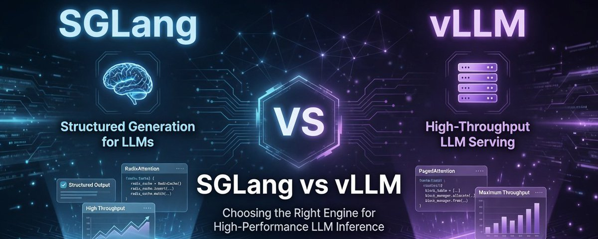
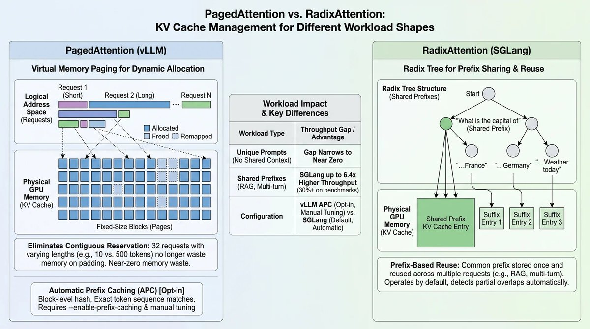
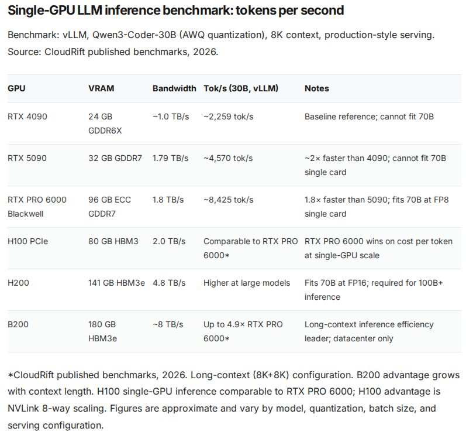
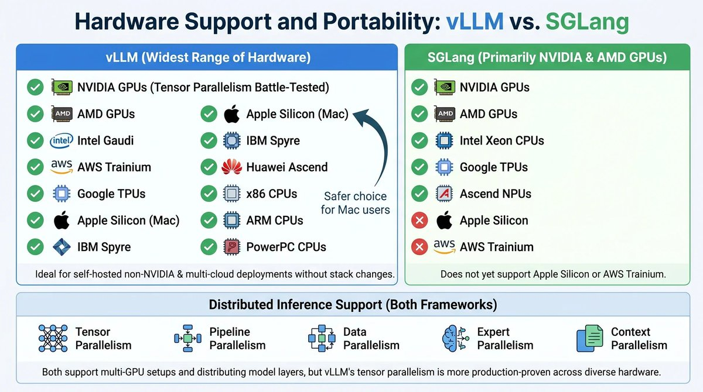
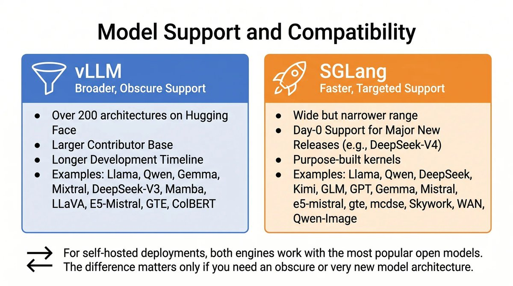
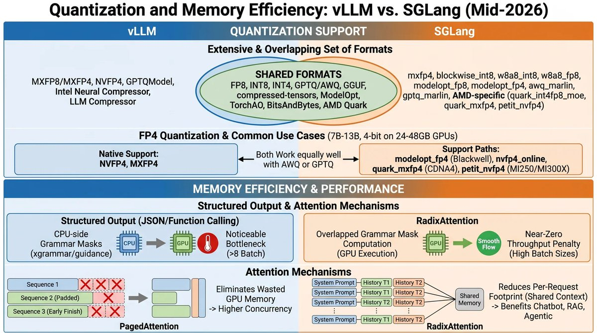
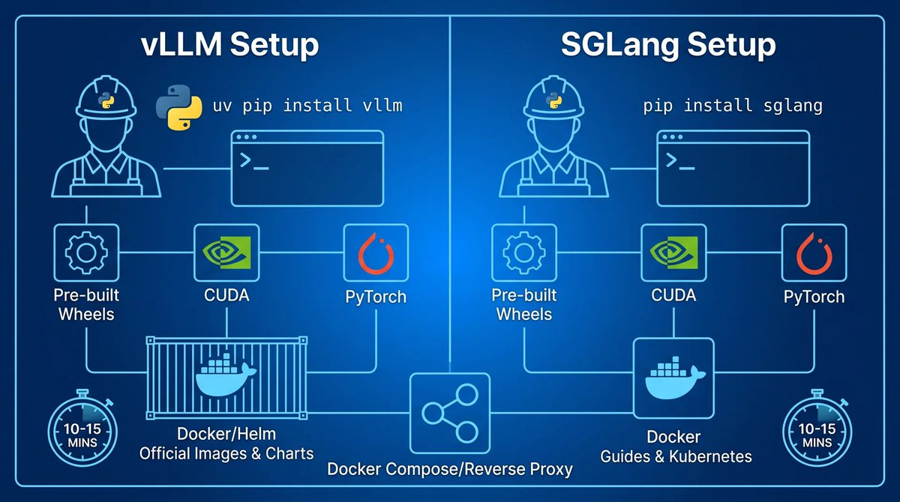
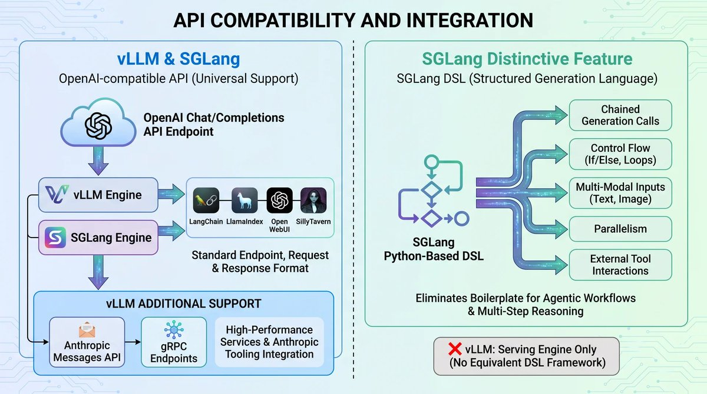
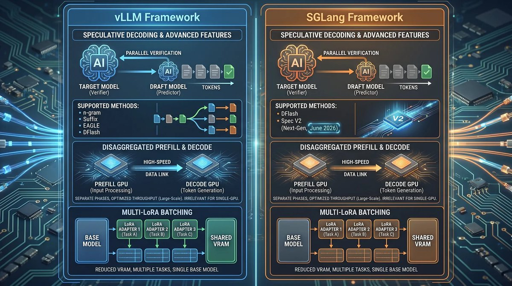
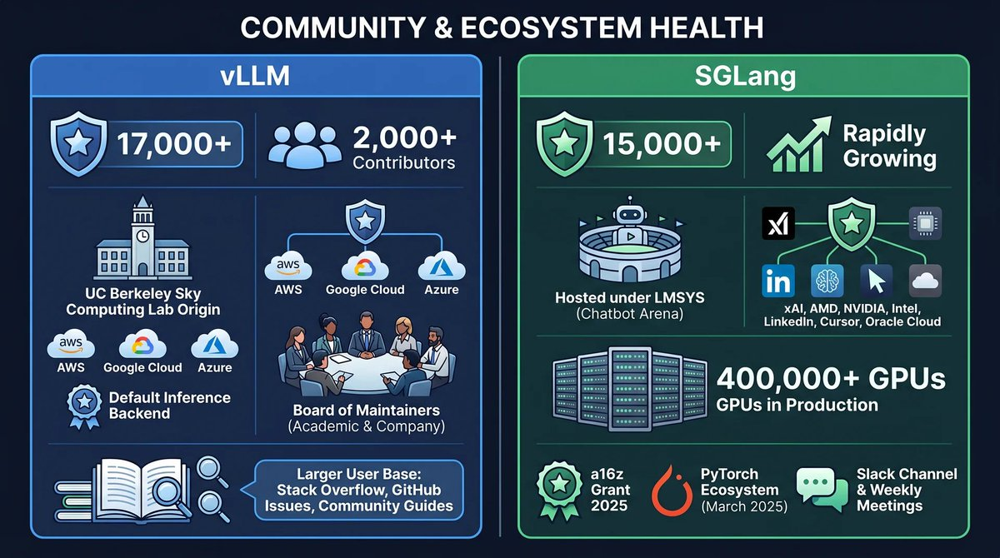

Two frameworks now dominate LLM serving: SGLang and vLLM. Both engines serve OpenAI-compatible APIs, support continuous batching, and run a variety of GPUs.

But they make fundamentally different trade-offs in how they manage GPU memory, handle shared context, and structure their codebases. The choice between them depends less on raw speed than on workload shape and hardware constraints.

For someone provisioning hardware with workstation or server-grade GPUs, the decision comes down to a few concrete questions:

- Do your prompts share large prefixes across turns, as they do in chatbots, coding assistants, and RAG pipelines? SGLang's RadixAttention handles this case substantially better than vLLM's PagedAttention.
- Do you need the widest possible model compatibility, quantization format support, and hardware portability? vLLM has the edge there.
- Do you want structured output with low overhead? SGLang wins.
- Do you need Kubernetes-native deployment or enterprise support? vLLM is more mature.

This article covers the architecture, performance, deployment, and community differences, with emphasis on self-hosting on single-GPU and multi-GPU workstation and server environments.

## PagedAttention and RadixAttention Serve Different Workload Shapes

The core architectural difference between vLLM and SGLang is how each engine manages the KV cache, the GPU memory structure that stores per-token attention computations during text generation. The KV cache grows linearly with sequence length and is the primary memory bottleneck in LLM serving.

vLLM's PagedAttention, introduced in a 2023 SOSP paper from UC Berkeley, borrows the concept of virtual memory paging from operating systems. The KV cache is divided into fixed-size blocks (pages) that can be allocated, freed, and remapped independently. This eliminates the need to reserve contiguous memory for each sequence's worst-case length. A batch of 32 requests where 30 finish in 10 tokens and 2 finish in 500 tokens no longer wastes memory on padded allocations. The published result is near-zero memory waste compared to naive static allocation.

SGLang's RadixAttention, introduced in a 2024 paper from LMSYS, organizes the KV cache as a radix tree (a compressed trie). When a new request arrives, SGLang finds the longest matching prefix in the tree and only computes attention for the diverging suffix. Three requests starting with “What is the capital of” but ending with “France,” “Germany,” and “Weather today” share the common prefix's KV cache entries. The shared prefix is stored once in GPU memory and reused across all three requests.

The practical difference is workload-dependent. On benchmarks with unique prompts and no shared context, the throughput gap between the two engines narrows to near zero. On workloads where prompts share prefixes, SGLang's RadixAttention delivers 30% higher throughput on standard benchmarks and up to 6.4x on prefix-heavy RAG pipelines and multi-turn conversations. A multi-turn chatbot migrated from vLLM to SGLang on identical hardware routinely sees throughput gains of 30% or more.

vLLM offers Automatic Prefix Caching (APC) as an opt-in feature. It uses block-level hash-based prefix matching, which requires exact token sequence matches to trigger cache hits. APC must be enabled with the --enable-prefix-caching flag and often requires manual tuning for optimal cache utilization. RadixAttention, by contrast, operates by default with no configuration and detects partial prefix overlaps automatically.

## Throughput, Latency, and Batch Performance

Published benchmarks from Q2 2026 show how the two engines perform on current hardware. The IoT Digital Twin Q2 benchmark tested Llama-3.3-70B at 4-bit on 8x H200 SXM (141GB HBM3e per GPU). At high concurrency, vLLM peaked around 5,300 tokens/second and SGLang around 5,450 tokens/second, with the two engines trading narrow leads depending on concurrency level and batch size.

On H100 80GB hardware with smaller models, SGLang shows a larger advantage. The Turion Q2 2026 benchmark found SGLang leading on models up to 30B parameters at 50 concurrent requests. On 70B and larger models, the gap narrowed to single-digit percentages. At high concurrency (100+ requests), vLLM's tail time-to-first-token (TTFT) began to lag, while SGLang's p95 TTFT stayed tighter under heavy load.

The SemiAnalysis InferenceXv2 benchmark, published in early 2026, tested SGLang on GB300 NVL72 hardware with DeepSeek R1. The results showed 25x performance gains compared to H200 baseline, driven by SGLang's piecewise CUDA graphs (default since v0.5.10) and HiSparse sparse attention integration for DeepSeek models.

On workstation-class hardware, VRLA Tech's 2026 benchmarks using Qwen3-Coder-30B (AWQ, 8K context) on vLLM show the hardware scaling curve: RTX 5090 delivers approximately 4,570 tokens/second, while the RTX PRO 6000 Blackwell reaches approximately 8,425 tokens/second on the same workload. The RTX PRO 6000 fits 70B models at FP8 on a single card, which the RTX 5090 cannot do.

Via VRLA Tech

For deployments on a single GPU, these high-end differences compress. The GPU becomes the bottleneck before the scheduler or cache manager on both engines. The architectural gap matters most at scale: multi-GPU configurations, high concurrency, and workloads with high prefix reuse where SGLang's RadixAttention can deliver 3-5x effective prefill latency improvements over vLLM on workloads with more than 60% prefix overlap.

## Hardware Support and Portability

vLLM runs on the widest range of hardware of any open-source inference engine. NVIDIA GPUs, AMD GPUs, Intel Gaudi, AWS Trainium, Google TPUs, Apple Silicon, IBM Spyre, Huawei Ascend, and x86/ARM/PowerPC CPUs are all supported. This breadth matters for self-hosted deployments on non-NVIDIA hardware or for teams that need to deploy across different cloud providers without changing their inference stack.

SGLang primarily supports NVIDIA and AMD GPUs, with additional support for Intel Xeon CPUs, Google TPUs, and Ascend NPUs. It does not yet support Apple Silicon or AWS Trainium. For users running models on an AMD GPU or a Mac, vLLM is the safer choice.

Both frameworks support tensor, pipeline, data, expert, and context parallelism for distributed inference. For multi-GPU setups, both engines can distribute model layers across devices. vLLM's tensor parallelism implementation is more battle-tested, having been in production longer across a larger variety of hardware configurations.

## Model Support and Compatibility

vLLM supports over 200 model architectures on Hugging Face, including decoder-only LLMs (Llama, Qwen, Gemma), mixture-of-experts models (MiniMax, Mixtral, DeepSeek, Qwen-MoE), hybrid attention and state-space models (Mamba, Qwen3.5+), multimodal models (LLaVA, Qwen-VL, Pixtral), embedding models (E5-Mistral, GTE, ColBERT), and reward models. This breadth is a direct result of vLLM's larger contributor base and longer development timeline.

SGLang supports a wide but narrower range. SGLang compensates with day-0 support for major new releases, particularly DeepSeek models. SGLang shipped DeepSeek-V4 inference on launch day in April 2026 with purpose-built kernels for the model's hybrid sparse-attention architecture and FP4 expert weights.

For self-hosted deployments, both engines work with the most popular open models. The difference matters only if you need an obscure or very new model architecture. In that case, vLLM is more likely to support it already.

## Quantization and Memory Efficiency

Both engines support an extensive and overlapping set of quantization formats as of mid-2026. vLLM supports FP8, MXFP8/MXFP4, NVFP4, INT8, INT4, GPTQ/AWQ, GGUF, compressed-tensors, ModelOpt, TorchAO, AutoAWQ, BitsAndBytes, GPTQModel, Intel Neural Compressor, LLM Compressor, and AMD Quark. SGLang supports fp8, mxfp4, blockwise\_int8, w8a8\_int8, w8a8\_fp8, awq, gptq, compressed-tensors, gguf, modelopt\_fp8, modelopt\_fp4, torchao, bitsandbytes, awq\_marlin, gptq\_marlin, and AMD-specific methods including quark\_int4fp8\_moe, quark\_mxfp4, and petit\_nvfp4. The practical difference in format breadth has narrowed considerably from previous years.

Both engines handle FP4 quantization. vLLM supports NVFP4 and MXFP4 natively. SGLang supports NVFP4 through modelopt\_fp4 on Blackwell GPUs and nvfp4\_online for online conversion, with additional FP4 paths for AMD hardware (quark\_mxfp4 on CDNA4, petit\_nvfp4 on MI250/MI300X). For the most common use cases (7B-13B models at 4-bit on 24-48GB GPUs), both engines work equally well with AWQ or GPTQ formats.

The meaningful difference lies not in which formats are supported but in how each engine handles structured output during constrained decoding. SGLang overlaps grammar mask computation with GPU execution, so the throughput penalty for JSON mode or function calling is near-zero even at high batch sizes. vLLM's xgrammar and guidance integrations apply grammar masks on the CPU side, creating a noticeable bottleneck at batch sizes above 8 concurrent requests.

On memory efficiency, the architectural difference between PagedAttention and RadixAttention targets different sources of waste. PagedAttention eliminates wasted GPU memory from padded sequences and early-finishing requests, allowing vLLM to serve more concurrent users on the same GPU than a naive implementation. RadixAttention reduces the effective per-request memory footprint when prompts share context, which benefits chatbot, RAG, and agentic workloads where system prompts and conversation history are reused across turns.

## Installation and Setup Complexity

Both engines install via pip and work with standard Python environments. vLLM recommends uv pip install vllm and provides pre-built wheels for most configurations. SGLang installs with pip install sglang and also distributes pre-built wheels. Both engines require CUDA and PyTorch, and both compile custom CUDA kernels on first use.

An engineer comfortable with Python virtual environments can get either engine running in 10-15 minutes. The primary installation difference is that vLLM's broader hardware support means fewer edge cases with unsupported GPU architectures.

vLLM has more mature Docker tooling with official images, Helm charts for Kubernetes, and extensive production deployment documentation. SGLang supports Docker deployment and can be deployed on Kubernetes, but the guides are less comprehensive. For a setup running behind a reverse proxy on a single machine, both engines work equally well with Docker Compose.

## API Compatibility and Integration

Both engines serve an OpenAI-compatible API, which means any tool that works with OpenAI's API (Factory Droid, OpenCode, Hermes Agent, LangChain, LlamaIndex, Open WebUI, SillyTavern) works with either engine without modification. The endpoint, request format, and response format match the OpenAI chat completions and completions specifications.

vLLM additionally supports the Anthropic Messages API and gRPC endpoints, which matter for teams integrating with Anthropic-compatible tooling or building high-performance gRPC-based services. For most self-hosted deployments, the OpenAI-compatible API is sufficient.

SGLang provides a Python-based frontend language called the SGLang DSL for defining structured generation logic. It supports chained generation calls, control flow, multi-modal inputs, parallelism, and external tool interactions. This DSL is SGLang's distinctive feature and the reason the project is named SGLang (Structured Generation Language).

For users building agentic workflows and multi-step reasoning chains, the DSL eliminates boilerplate that would otherwise require orchestrating multiple API calls manually. vLLM provides no equivalent; it is a serving engine, not a generation programming framework.

## Structured Output and Constrained Decoding

SGLang has a clear advantage in structured output generation. Its compressed finite state machine approach, combined with overlapped mask generation in the v0.4 release, delivers up to 10x faster JSON decoding compared to previous approaches. The structured output overhead is minimal even at high batch sizes because the mask computation overlaps with GPU execution.

vLLM supports structured output through xgrammar or guidance integrations, but the overhead is noticeable at high batch sizes. For deployments where structured output is a core requirement (function calling, JSON mode, tool use), SGLang is the better choice.

## Speculative Decoding and Advanced Features

Both frameworks support speculative decoding, the technique of using a smaller draft model to predict tokens that a larger target model then verifies in parallel. vLLM supports n-gram, suffix, EAGLE, and DFlash speculative decoding. SGLang supports DFlash and Spec V2, with the latter introduced in June 2026 as the next generation of speculative decoding.

Both support disaggregated prefill and decode, which separates the prefill phase (processing the input prompt) from the decode phase (generating tokens one by one). This allows different GPUs to specialize in each phase, improving throughput in large-scale deployments. For single-GPU setups, disaggregation is irrelevant because both phases run on the same device.

Both engines support multi-LoRA batching, which allows serving multiple fine-tuned versions of a base model simultaneously without loading separate copies. For users who maintain multiple LoRA adapters for different tasks, this feature reduces VRAM requirements proportionally to the number of adapters.

## SGLang as a Training Backend

SGLang has an additional role that vLLM does not serve. It operates as a rollout backend for reinforcement learning training, used by frameworks including AReaL, Miles, verl, and Tunix. During RL training, the policy model generates responses (rollouts) that are then scored by a reward model, and these rollouts require fast inference.

SGLang's inference speed and DeepSeek-specific optimizations make it the preferred backend for training frontier models, including DeepSeek-V4 itself. This dual use as both a serving engine and a training backend gives SGLang a development advantage: optimizations motivated by training requirements benefit the serving path and vice versa.

## Community and Ecosystem Health

vLLM has the larger community, with over 17,000 GitHub stars, more than 2,000 contributors, and a dedicated user forum. It originated at UC Berkeley's Sky Computing Lab and has been adopted by a wide range of companies including AWS, Google Cloud, and Azure as their default inference backend. The project maintains a board of maintainers from academic institutions and companies.

SGLang has over 15,000 GitHub stars and a rapidly growing community. It is hosted under LMSYS, the nonprofit organization behind Chatbot Arena. SGLang's adoption list includes xAI (Grok 3), AMD, NVIDIA, Intel, LinkedIn, Cursor, Oracle Cloud, and others, with over 400,000 GPUs running SGLang in production. The project received an a16z Open Source AI Grant in 2025 and joined the PyTorch ecosystem in March 2025.

For self-hosted deployments, community size matters for troubleshooting. vLLM's larger user base means more Stack Overflow answers, GitHub issue resolutions, and community guides. SGLang's community is smaller but active, with a dedicated Slack channel and weekly developer meetings.

## Choosing Between SGLang and vLLM for Self-Hosted Deployments

For anyone provisioning a GPU server or workstation for LLM inference, the decision framework is straightforward.

Choose SGLang when your workload involves multi-turn conversations, chatbots, coding assistants, or RAG pipelines where prompts share substantial prefixes. The RadixAttention advantage translates directly to lower latency and higher throughput on these workloads. The structured output advantage matters if you use JSON mode or function calling extensively. The day-0 DeepSeek support matters if you follow new model releases closely.

Choose vLLM when you need the broadest model compatibility, the widest hardware support (AMD GPUs, Apple Silicon, AWS Trainium), or the most quantization format options. The larger community means more resources for troubleshooting. The more mature Docker and Kubernetes tooling matters if you plan to scale beyond a single machine.

For a general-purpose deployment running a mix of workloads, either engine will serve well. The performance difference on mixed workloads is unlikely to be noticeable in single-user scenarios. The deciding factors are more likely to be hardware compatibility (vLLM for non-NVIDIA GPUs), model availability (vLLM for obscure architectures), and whether you value SGLang's structured output performance and DSL.

Both engines are free, open-source, and actively maintained. Neither is a wrong choice. The right choice depends on which matches best with your specific workload and hardware you are better positioned to tolerate.
