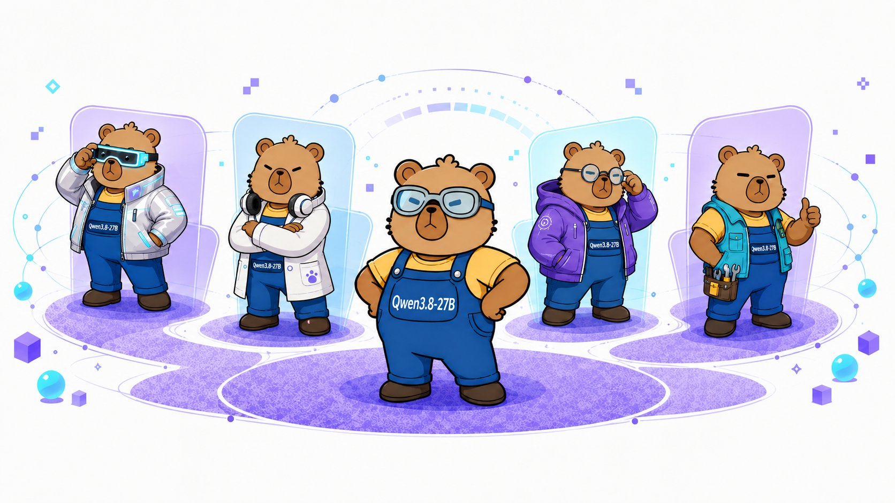

Two weeks after its release, the community has already built a lot around Qwen3.8-27B: GGUF, MLX, AWQ and NVFP4 quantizations, plus several approaches to faster inference. Picked by HF + ModelScope download heat, org footprint, and technical-route representativeness, these are the community variants worth watching:

💻For local use

1\. Unsloth AI — Dynamic 3.0 GGUFs plus NVFP4 & FP8, all with the MTP head intact, for running Qwen3.8-27B locally in llama.cpp, LM Studio and Unsloth Desktop.

2\. LM Studio community — GGUF plus MLX 4–8-bit builds from the LM Studio team, for local use on Mac and PC.

3\. cyankiwi — a 21GB AWQ-INT4 built on a custom STEM + agentic calibration set covering 10 languages.

4\. ggml-org — the GGUF conversion published by the llama.cpp team, generated with ggml-org/convert.

5\. AtomicChat — imatrix GGUFs built on fully public calibration corpora.

6\. bartowski — llama.cpp imatrix GGUF quants with multimodal (mmproj) and MTP support.

7\. mlx-community — MLX builds (4/8-bit, MTP variants) for Apple Silicon.

🚀For serving and faster inference

8\. RadixArk — an NVFP4 W4A4 quant produced with NVIDIA Model Optimizer, plus DSpark, a 1.36B speculative-decoding speculator with a reported ~3.4 mean acceptance length on SGLang.

9\. Inferact — an NVFP4 quant of Qwen3.8-27B.

10\. incoai × z-lab — DFlash2, a block-diffusion draft model that brings lossless speculative decoding to SGLang and vLLM.

Ports keep landing too, Qwen3.8-27B runs on just about everything.

