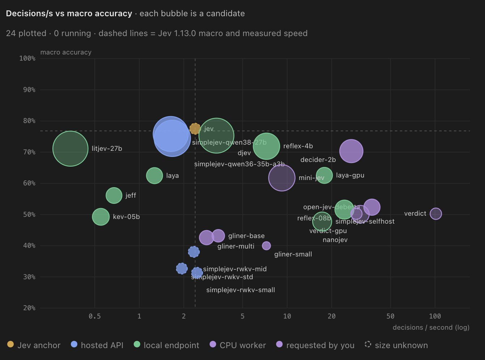

Top 5 Jev Alternatives:  
\_\_

I have been running a benchmark since this morning on every Jev alternative against Jev. So far, none have been it on accuracy but some have slightly less accuracy with better speed. So far, here are my rankings... And be mindful, there are 40 still in queue + I am automatically scraping for more on X which get placed in the queue by my agents.

1\. djev - Slightly lower accuracy and slightly faster speed than Jev. Worthy tradeoff. ([https://t.co/apmeMmakQd](https://t.co/apmeMmakQd))  
2\. Simplejev-qwen38-27b - Best open source model you can replace Jev with today but requires the ability to run a 27B model. You may need a DGX Spark or similar. ([https://t.co/gvLhTG1AG9](https://t.co/gvLhTG1AG9)). I have a feeling the Simplejev version of Qwen Flash Next will beat Jev on speed and accuracy. @MiaAI\_lab I would love if you can Simplejev your fantastic model and beat Jev with open source! (Simplejev-qwen36-35b-a3b is basically interchangeable and you should always choose the former). ([https://t.co/hqqAqdAv0c](https://t.co/hqqAqdAv0c))  
3\. Reflex-4b - This is actually one of my favorites. It is a great tradeoff between speed and accuracy. It is 2-3x faster than Jev but 5% or so less accurate. That said, I bet somebody can tune it or something. It is apache 2.0 for reference. ([https://t.co/5FVMfOYO1W](https://t.co/5FVMfOYO1W))  
4\. Decider-2b - I love this one because it did the whole test in like 4 minutes or something ridiculous. It is about 10x faster than Jev and completely local. It's accuracy is a 5% less... So it is up to you if that tradeoff is worth it. Considering the size, you can slap this thing on a work computer and get stuff done quickly. Love this one. ([https://t.co/iAVFpcPr8J](https://t.co/iAVFpcPr8J))  
5\. Lastly is Laya... It is the historical model that did not get enough love. It does not seem to be as good as Jev, but is is very fast on a GB10 GPU... It's accuracy is 62.5% which is not worth it to me. I would say anything less than 70% is a nogo. Definitely not worth the tradeoffs when we consider a faster and higher accuracy model like decider-2b.

Do not let people convince you that Jev is not special or is a tool we always have. It is the frontier of this paradigm... But it is losing ground quickly and I might find a better model by tomorrow.

The benchmarks are automatically updated here. If you want my agents to test one, please send the name below and they will pick it up!

[https://t.co/gN2XloYe2X](https://t.co/gN2XloYe2X)

