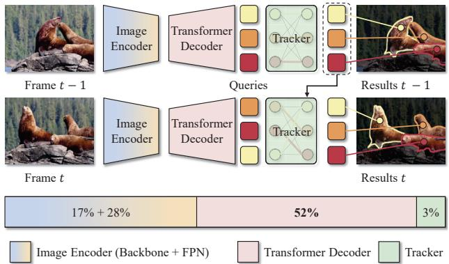
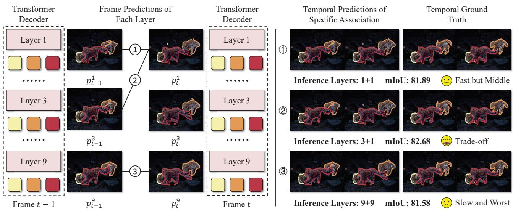
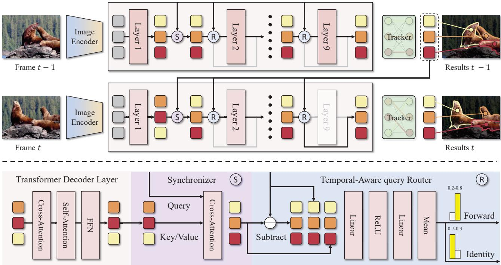
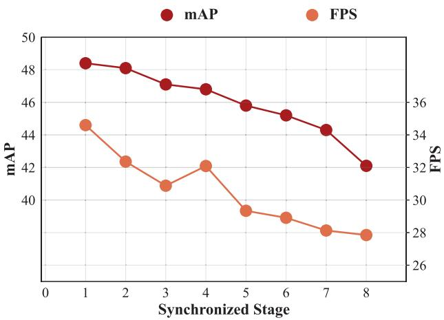
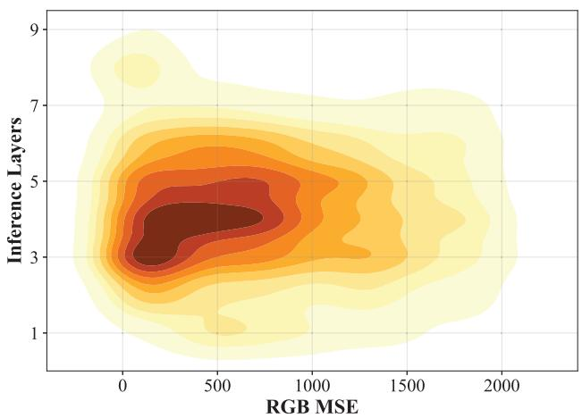

# Temporal-aware Query Routing for Real-time Video Instance Segmentation

Zesen Cheng1,3 Kehan Li4 Yian Zhao1,3 Hang Zhang4 Chang Liu5 Jie Chen1,2,3

1 School of Electronic and Computer Engineering, Peking University, Shenzhen, China 2 Pengcheng Laboratory, Shenzhen, China

3 AI for Science (AI4S)-Preferred Program, Peking University Shenzhen Graduate School, China

4 Alibaba Group, Hangzhou, China 5 Department of Automation and BNRist, Tsinghua University, Beijing, China cyanlaser@stu.pku.edu.cn jiechen2019@pku.edu.cn

## Abstract

With the rise of applications such as embodied intelligence, developing high real-time online video instance segmentation (VIS) has become increasingly important. However, through time profiling of the components in advanced online VIS architecture (i.e., transformer-based architecture), we find that the transformer decoder significantly hampers the inference speed. Further analysis ofthe similarities between the outputsfrom adjacentframes at each transformer decoder layer reveals significant redundant computations within the transformer decoder. To address this issue, we introduce Temporal Aware query Routing (TAR) mechanism. We embed it before each transformer decoder layer. By fusing the optimal queries from the previous frame, the queries output by the preceding decoder layer, and their differential information, TAR predicts a binary classification score and then uses an argmax operation to determine whether the current layer should be skipped. Experimental results demonstrate that integrating TAR into the baselines achieves significant efficiency gains (24.7 → 34.6 FPS for MinVIS, 22.4 → 32.8 FPSfor DVIS++) while also improving performance (e.g., on YoutubeVIS 2019, 47.4 → 48.4 AP for MinVIS, 55.5 → 55.7 AP for DVIS++). Furthermore, our analysis of the TAR mechanism shows that the number of skipped layers increases as the differences between adjacent video frames decrease, which suggests that our method effectively utilizes inter-frame differences to reduce redundant computations in the transformer decoder.

## 1. Introduction

Video Instance Segmentation (VIS) [45] is an advanced computer vision technology that aims to provide precise segmentation masks for each object instance in a video and to associate the same object across frames. This technology is widely utilized in fields such as medical surgery, embodied intelligence, and human-computer interaction. For instance, in the context of embodied intelligence, VIS can precisely locate various objects in real time within a scene, allowing agents to achieve better environmental understanding and perform corresponding actions based on the accurate positions of those objects. As these applications are further adopted, fast and accurate low-latency object localization becomes increasingly crucial to ensure the system’s safety and responsiveness while improving user experience.

  
Figure 1. Time profiling of components in the advanced online VIS method MinVIS shows: Image Encoder (Backbone + FPN) 45% (17%+28%), Transformer Decoder 52%, Tracker 3%. This distribution identifies the transformer decoder as the key computational bottleneck, whose optimization can greatly boost efficiency.

In general, VIS has three paradigms: offline, semionline/near-online, and online. Offline VIS [11, 17] methods require complete video data for segmentation, which clearly does not meet the demands for real-time response. Semi-online/near-online VIS methods [18, 31] focus on clip-level object segmentation and tracking. However, they fail to satisfy the stringent real-time requirements of streaming scenarios due to significant delays in segment acquisition. For example, in a 10 FPS video stream, obtaining 5 frames takes 0.5 seconds, resulting in a minimum reaction time of 0.5 seconds for semi-online methods operating at this granularity, which is unacceptable for real-time applications. Online VIS methods operate at the frame level for segmentation and tracking, providing timely feedback for each video frame. This capability meets the high real-time requirements of dynamic scenarios effectively.

  
Figure 2. Carefully selecting transformer decoder layer combinations across adjacent frames can optimize efficiency while main taining performance. We evaluate three different transformer decoder layer combinations between adjacent frames: “1+1", “3+1", and “9+9". The results show that the combination with the highest inference cost, “9+9" (81.58 mIoU), does not yield the best performance, while the combination with moderate inference cost, “3+1" (82.68 mIoU), achieves the best results.

However, time-consuming analysis of components in the advanced online VIS method MinVIS (a simple Transformer-based architecture) shows: Image Encoder (Backbone + FPN) 45% (17% + 28%), Transformer Decoder 52%, Tracker 3% (Figure 1). This identifies the image encoder and transformer decoder as computational bottlenecks. Given the encoder backbone’s need for large-scale pre-training and the FPN’s complex design, we focus on optimizing the transformer decoder.

We observe that the transformer decoder is composed of stacked transformer decoder layers, where each layer is capable of outputting a set of queries for tracking, segmentation and classification tasks. This naturally raises a question: Are all layers necessary, or is there redundant computation? To explore this, we evaluate three combinations of outputs from different transformer decoder layers across adjacent frames: "1+1", "3+1", and "9+9" (where "m+n" represents the output from the m-th layer of the previous frame and the n-th layer of the current frame) and assess their performance by matching these combinations with the Ground Truth and computing the IoU. In Figure 2, we observe that the "3+1" combination achieves the optimal balance between performance and inference speed, demonstrating that strategically selecting transformer decoder layer combinations across adjacentframes can enhance efficiency without compromising performance.

Next, we have to consider another question: What criterion should guide the selection of transformer decoder layers? The transformer decoder generates queries for getting segmentation and classification results, with each query essentially sampling specific regions (e.g., objects) in the image features. Since changes between adjacent video frames are typically minimal, the queries across these frames should also be highly similar. Assuming we have the optimal query from the previous frame, we can compare it with the queries generated at each layer. If a query from a particular layer shows high similarity to the current frame’s query, we can deem this layer’s query optimal and bypass computations in subsequent layers to eliminate redundancy.

To achieve this, we propose Temporal-Aware query Routing (TAR) and insert it before each transformer decoder layer to assess whether the layer is redundant and can be skipped. Specifically, TAR fuses the query from the previous frame, the query from the current frame, and the differential information between the two queries to predict a binary score. The argmax operation then determines whether to skip the layer. During training, we use the Straight-Through Gumbel-Softmax trick to ensure the differentiability of the argmax operation. Through experiments integrating TAR into two baseline models (MinVIS and DVIS++), we find that it not only significantly enhances overall inference efficiency (from 24.7 to 34.6 FPS for MinVIS and from 22.4 to 34.8 FPS for DVIS++) but also achieves comparable or even slightly better performance across multiple datasets. For example, TAR improves Min-VIS/DVIS++ by 1.0/0.2 AP on YouTubeVIS 2019, 0.1/0.8 AP on YouTubeVIS 2021, and 2.4/0.9 AP on OVIS. Additionally, through experiments in Figure 5, we observed that the smaller the changes between frames, the fewer layers TAR skips. This indicates that our method effectively leverages inter-frame differences to eliminate redundant layers.

## 2. Related Works

## 2.1. Video Instance Segmentation

Video instance segmentation (VIS) is a comprehensive task that requires simultaneous segmentation, tracking, and classification of all object instances across video frames [45]. Early approaches to VIS can be broadly categorized into one-stage (e.g., [2, 7, 27]) and two-stage methods (e.g., [6, 45]). However, with the advent of transformers [8, 14], VIS has increasingly adopted attention-based architectures due to their ability to model global dependencies and provide elegant query-centric instance representations. For example, VisTR [41] extends DETR [8] to VIS by introducing an end-to-end framework that tracks objects across videos using instance queries. Transformer-based VIS methods have since evolved into three main paradigms: offline, semionline, and online approaches.

Offline methods [10, 22, 47] process entire videos as spatiotemporal volumes, leveraging temporal coherence for improved accuracy. For instance, IFC [21] introduces memory tokens to propagate instance information across frames, while Seqformer [42] decomposes frame queries to enhance temporal modeling. Although offline methods achieve state-of-the-art performance, they are computationally expensive and memory-intensive, making them less practical for long videos. Semi-online methods [18, 31] segment video clips and perform tracking at the clip level, improving inference efficiency and performance in offline long video scenarios. However, they struggle in online settings due to the latency incurred while acquiring clips. For example, in a 10fps video stream, obtaining a 5-frame clip requires 0.5 seconds, making semi-online methods unsuitable for real-time applications. In contrast, online methods [19, 43, 51] process videos incrementally, either frameby-frame or in short clips, focusing on efficient instance association across adjacent frames. For instance, MinVIS [19] employs the Hungarian algorithm [25] to match instance queries between consecutive frames. While slightly less accurate than offline methods, online approaches are significantly more efficient and scalable, making them suitable for real-world applications such as autonomous driving [49] and video editing [33].

In many practical applications, such as embodied intelligence and surgical robotics, it is often crucial for video instance segmentation models to respond promptly and efficiently. Therefore, we primarily focus on optimizing the online video instance segmentation paradigm. Online methods align better with real-time processing requirements because they can avoid the memory bottlenecks inherent in offline approaches and the high latency associated with clip acquisition in semi-online methods.

## 2.2. Conditional Computation

Conditional Computation is a computational paradigm that dynamically activates a subset of model parameters or modules based on input data, rather than using the entire model for every computation [4, 5]. We primarily focus on earlyexit technology, an implementation of conditional computation that places classifiers at intermediate layers of a model, enabling it to output results early when predictions reach sufficient confidence, thereby avoiding computations in subsequent layers [40, 44]. Early-exit can dynamically adjust computation paths based on input complexity: for simple inputs, the model exits early, skipping subsequent layers and significantly reducing computational load; for complex inputs, it utilizes more layers, achieving a balance between efficiency and accuracy [12, 15, 29, 35, 36]. This makes it highly advantageous for resource-constrained, real-time scenarios. Additionally, early-exit can be seamlessly integrated into existing deep neural networks by simply adding classifiers to intermediate layers, requiring no extensive architectural modifications, thus offering high practical value.

Based on our observation in Figure 2 that the transformer decoder exhibits some redundant layers, we specifically explore in this paper how to adopt advanced early-exit techniques, particularly SkipLayer-based methods [1, 26, 50], to bypass these redundant layers in the transformer decoder for VIS. This aims to enhance the inference efficiency of VIS methods, enabling these VIS models to be more effectively deployed in real-time practical applications.

## 3. Methods

In this section, we first introduce the overall pipeline of our online VIS in Section 3.1. Then, in Section 3.2, we describe how TAR is integrated into the existing online VIS framework, followed by detailed implementation specifics, such as differentiable operations during training and how redundant layers are skipped during inference.

## 3.1. Overall Pipeline

We primarily select representative online VIS models, Min-VIS [19] and DVIS++ [52], as baselines to verify the effectiveness of our TAR. The architecture of two baselines consists of an image encoder, a transformer decoder, and a tracker, with our method primarily targeting the transformer decoder. To provide a concrete and vivid description of the classical architecture and how TAR enhances inference efficiency, we illustrate the overall pipeline in Figure 3.

Image Encoder. The image encoder primarily consists of a backbone and a pixel decoder. In an online scenario, assuming we have captured the t-th frame of a video stream, this frame is fed into the backbone to extract features: $\{ \mathcal { F } _ { t } ^ { b _ { 2 } } \in$ $\begin{array} { r l r l r } { \mathbb { R } ^ { \frac { H } { 8 } \times \frac { W } { 8 } \times d _ { 2 } } , \mathcal { F } _ { t } ^ { b _ { 3 } } } & { \in } & { \mathbb { R } ^ { \frac { H } { 1 6 } \times \frac { W } { 1 6 } \times d _ { 3 } } , \mathcal { F } _ { t } ^ { b _ { 4 } } } & { \in } & { \mathbb { R } ^ { \frac { H } { 3 2 } \times \frac { W } { 3 2 } \times d _ { 4 } } \} } \end{array}$ where H, W, and d denote height, width, and feature dimension, respectively. Subsequently, a Feature Pyramid Network (FPN) progressively integrates backbone features to generate high-quality multi-scale pixel features. Various FPN variants are available, such as Vanilla FPN [28], Semantic FPN [24], FaPN [20], and BiFPN [37]. Here, following Mask2Former [11], both MinVIS and DVIS++ adopt Multi-scale Deformable Attention from Deformable DETR [54]:

  
Figure 3. Overall pipeline of online VIS with TAR. We illustrate the architecture of online VIS and show how we integrate TAR to enhance overall efficiency. TAR is introduced before each transformer decoder layer for skipping redundant transformer decoder layers. To achieve this, the current frame’s queries are first synchronized with those queries from the previous frame to obtain inter-frame differential information. Subsequently, the synchronized queries of the current frame are fed into the TAR of each transformer decoder layer, and are concatenated with the previous queries along with the differential information between two group of queries. This combined information is then processed through a MLP and averaged to produce a binary score, which determines whether each layer should be skipped.

$$
(\mathcal {F} _ {t} ^ {o _ {2}}, \mathcal {F} _ {t} ^ {o _ {3}}, \mathcal {F} _ {t} ^ {o _ {4}}) = \text {MSDefAttn} (\mathcal {F} _ {t} ^ {b _ {2}}, \mathcal {F} _ {t} ^ {b _ {3}}, \mathcal {F} _ {t} ^ {b _ {4}}),\tag{1}
$$

where MSDefAttn denotes multi-scale deformable attention, $\mathcal { F } _ { t } ^ { o _ { i } }$ denotes the i-th stage multi-scale features of t-th frame. Moreover, the FPN generates mask features $\mathcal { F } _ { t } ^ { m a s k }$ for each frame, providing reference features to the transformer decoder for mask generation.

Transformer Decoder. The main computational flow of transformer decoder begins by initializing a set of random queries $\pmb { \mathcal { Q } } _ { t } ^ { 0 } \in \mathbb { R } ^ { N \times d }$ , where N denotes the number of queries. These queries are iteratively refined through M transformer decoder layers, producing instance queries $\pmb { \mathcal { Q } } _ { t } ^ { i } \in \mathbb { R } ^ { N \times d } , i = 1 , 2 , 3 , . . . , M$ . The transformer decoder layer refers to the masked attention transformer decoder from mask2former. These refined queries are then decoded into class logits $\boldsymbol { c } _ { t } ~ \in ~ \mathbb { R } ^ { N \times C }$ for classification and mask logits $\mathcal { M } _ { t } \ \in \ \{ 0 , 1 \} ^ { N \times H \times W }$ for segmentation. It is important to note that the queries at each layer are supervised, meaning the output of queries from any layer can effectively serve as the model’s final output.

Tracker. Trackers vary widely, and high-quality ones can greatly improve online VIS. However, these trackers often come with high computational costs. For example, CTVIS [48] employs mask non-maximum suppression (NMS) and a memory bank for instance tracking, but this introduces significant inference overhead. To mitigate this, we follow MinVIS and use the Hungarian algorithm [25] to match queries between adjacent frames, generating reordered video instance queries and masks. Note that, DVIS++ designs a referring tracker which is also based on Hungarian algorithm so that it is also efficient.

## 3.2. Temporal-aware Query Routing

To reduce redundancy in the transformer decoder, we propose TAR and an auxiliary Synchronizer module. During the t-th frame transformer decoder inference, after $M ^ { s }$ layers, the initial random queries $\pmb { \mathcal { Q } } _ { t } ^ { 0 }$ are refined into $\boldsymbol { \mathcal { Q } _ { t } ^ { M ^ { s } } }$ where $M ^ { s }$ denotes the warm-up transformer decoder layers before synchronizer. $\pmb { \mathcal { Q } } _ { t } ^ { M ^ { s } }$ are then fed into the Synchronizer to align with the final queries $\hat { \mathcal { Q } } _ { t - 1 } ^ { M }$ from the previous frame. Before each transformer decoder layer, the synchronized queries $\hat { \mathcal { Q } } _ { t } ^ { M ^ { s } }$ and $\hat { \mathcal { Q } } _ { t - } ^ { M }$ are fused in the TAR to determine whether to skip the current layer.

Synchronizer. To determine whether to skip layers by calculating the differences between queries across frames, we first need to align the current frame’s queries with those from previous frames to obtain meaningful differential information. However, since the initial queries are randomly initialized and lack semantic meaning, we allow them to pass through $M ^ { s }$ layers before alignment. To facilitate easier optimization of the Synchronizer, we design the following approach:

$$
\hat {\mathcal {Q}} _ {t} ^ {M ^ {s}} = \text {Attention} (\hat {\mathcal {Q}} _ {t - 1} ^ {M}, \mathcal {Q} _ {t} ^ {M ^ {s}}, \mathcal {Q} _ {t} ^ {M ^ {s}}),\tag{2}
$$

$$
\hat {\mathcal {Q}} _ {t} ^ {M ^ {s}} = \mathrm{Norm} (\hat {\mathcal {Q}} _ {t} ^ {M ^ {s}} + \hat {\mathcal {Q}} _ {t - 1} ^ {M}),\tag{3}
$$

where Attention is the scaled-dot production attention [39], Norm denotes the LayerNorm [3], $\hat { \mathcal { Q } } _ { t } ^ { M ^ { s } }$ is the synchronized queries of the current frame, $\hat { \mathcal { Q } } _ { t - 1 } ^ { M }$ is the final queries of the previous frame. I $t = 0 , \hat { \pmb { \mathscr { Q } } } _ { - 1 } ^ { M } = \pmb { \mathscr { Q } } _ { 0 } ^ { M }$

Router. After acquiring the synchronized queries $\hat { \varrho } _ { t } ^ { M ^ { s } }$ of current frame, we concatenate them with the final queries $\hat { \mathcal { Q } } _ { t - 1 } ^ { M }$ from the previous frame and their differential information. We then input the resulting combination into a multi-layer perceptron (MLP) for predicting a binary routing score:

$$
\boldsymbol {\mathcal {S}} _ {t} ^ {i} = \mathrm{MLP} \big (\operatorname{concat} \big (\hat {\boldsymbol {\mathcal {Q}}} _ {t} ^ {i}, \hat {\boldsymbol {\mathcal {Q}}} _ {t - 1} ^ {M}, \hat {\boldsymbol {\mathcal {Q}}} _ {t} ^ {i} - \hat {\boldsymbol {\mathcal {Q}}} _ {t - 1} ^ {M}) \big),\tag{4}
$$

$$
s _ {t} ^ {i} = \sum_ {j = 1} ^ {N} \boldsymbol {\mathcal {S}} _ {t} ^ {i, j},\tag{5}
$$

$$
i \in \{M ^ {s} + 1, M ^ {s} + 2,..., M \},\tag{6}
$$

where concat operates along the channel dimension, MLP( ) is comprised of Linear(ReLU(Linear( ))), $\pmb { S } _ { t } ^ { i } \in \mathbb { R } ^ { N \times 2 }$ denotes the fine-grained routing scores for the i-th transformer decoder layer of the t-th frame, and $s _ { t } ^ { i } \in \mathbb { R } ^ { 2 }$ denotes the global routing scores for the i-th transformer decoder layer of the t-th frame. The binary score $s _ { t } ^ { i }$ directly determines whether to skip the i-th transformer decoder layer at the t-th frame:

$$
\hat {\mathcal {Q}} _ {t} ^ {i} = \left\{ \begin{array}{c l} \hat {\mathcal {Q}} _ {t} ^ {i - 1}, & \operatorname{argmax} (s _ {t} ^ {i}) = 0, \\ \mathrm{TD} ^ {i} (\hat {\mathcal {Q}} _ {t} ^ {i - 1}), & \operatorname{argmax} (s _ {t} ^ {i}) = 1, \end{array} \right.\tag{7}
$$

where argmax denotes selecting the index of the maximum value in the routing score vector $s _ { t } ^ { i } , \mathsf { T D } ^ { i }$ denotes i-th transformer decoder layers. Furthermore, since argmax is nondifferentiable during training, we use the straight-through trick introduced in [38] as a replacement for argmax. The computation process is described below:

$$
g _ {t} ^ {i} = \mathrm{softmax} (s _ {t} ^ {i}),\tag{8}
$$

$$
\hat {g} _ {t} ^ {i} = \mathrm{argmax} (g _ {t} ^ {i}) + g _ {t} ^ {i} - \mathrm{sg} (g _ {t} ^ {i}),\tag{9}
$$

where softmax denotes the softmax function that converts the routing scores into a probability distribution, sg denotes the stop-gradient operation that prevents gradients from flowing through its argument, $\boldsymbol { g } _ { t } ^ { i } \in \mathbb { R } ^ { 2 }$ denotes the softmax-normalized routing scores for the i-th layer of the t-th frame, $\hat { g } _ { t } ^ { i } \in \{ 0 , 1 \} ^ { 2 }$ denotes the differentiable approximation of the one-hot encoded argmax output. In Equation 9, since $g _ { t } ^ { i }$ is differentiable and $\hat { g } _ { t } ^ { i }$ is constructed by adding two constants to $g _ { t } ^ { i } , \ \hat { g } _ { t } ^ { i }$ is also differentiable. This property allows for a differentiable routing operation during training:

$$
\hat {\mathcal {Q}} _ {t} ^ {i} = \hat {\mathcal {Q}} _ {t} ^ {i - 1} \cdot \hat {g} _ {t} ^ {i} [ 0 ] + \mathrm{TD} ^ {i} (\hat {\mathcal {Q}} _ {t} ^ {i - 1}) \cdot \hat {g} _ {t} ^ {i} [ 1 ].\tag{10}
$$

## 4. Experiments

## 4.1. Setup

Datasets. We evaluate our method on three challenging VIS datasets: YoutubeVIS 2019 [45], YoutubeVIS 2021 [46], and OVIS [34] YoutubeVIS 2019 is the most widely used VIS dataset, consisting of 2238/302/343 videos with 40 object categories for the training/validation/testing sets, respectively. YoutubeVIS 2021 builds upon Youtube-VIS 2019, offering more videos and richer annotations, with 2985/421/453 videos for the training/validation/testing sets. OVIS is a highly complex dataset designed to address scenarios with heavy occlusion and a large number of objects. Although it has 607/140/154 videos for training/validation/testing with 25 semantic categories, with an average of 5.8 instances per video much higher than YoutubeVIS 2019. OVIS also features long video sequences, with some videos exceeding 500 frames, which is 13.5 times longer than those in YouTubeVIS 2019.

Metrics. To assess efficiency, we adopt metrics including Speed and FPS. For performance evaluation, we employ metrics including AP (Average Precision), $\mathrm { A P _ { 7 5 } }$ (Average Precision with an IoU threshold 0.75), and $\mathrm { A R } _ { 1 0 }$ (Average Recall with 10 detections per frame). $\mathrm { A P _ { 7 5 } }$ measures the precision of predictions with high localization accuracy, while AP and $\mathrm { { A R } _ { 1 0 } }$ evaluate overall detection accuracy.

Implementation Details. We primarily selected two baselines for experiments: MinVIS and DVIS++. For MinVIS, we loaded its pre-trained model, froze the image encoder, and inserted the Synchronizer and TAR. We trained the model on pairs of adjacent video frames using the AdamW optimizer with a learning rate of 1e-4 for 5,000 iterations, followed by 1,000 iterations at a reduced learning rate of 1e-5. The batch size was set to 8, and the weight decay was 5e-2. The training progress of MinVIS didn’t use extra training data, e.g., COCO pseudo videos. For DVIS++, we initialized the segmenter with pre-trained weights from CTVIS. During the online training phase, we froze the segmenter and integrated the Synchronizer and router into it. The remaining training settings were consistent with DVIS++, including the frame sampling strategy (5 consecutive video frames), optimizer configuration (AdamW with a weight decay of 5e-2), and training schedule (20,000 iterations for OVIS and 40,000 iterations for YouTubeVIS), learning rate schedule (The learning rate was initially set to 1e-4 and decayed to 1e-5 at 14,000 iterations for OVIS and 28,000 iterations for YouTubeVIS). The training progress of DVIS++ used COCO extra data during YoutubeVIS training, but not used COCO extra data during OVIS training.

<table><tr><td rowspan="2">Method</td><td rowspan="2">↓Speed (ms)</td><td rowspan="2">↑FPS</td><td colspan="3">YoutubeVIS 2019</td><td colspan="3">YoutubeVIS 2021</td></tr><tr><td>AP</td><td> $AP_{75}$ </td><td> $AR_{10}$ </td><td>AP</td><td> $AP_{75}$ </td><td> $AR_{10}$ </td></tr><tr><td colspan="9">Small Backbone (Resnet50)</td></tr><tr><td>MinVIS [Neurips 2022] [19]</td><td>40.5</td><td>24.7</td><td>47.4</td><td>52.1</td><td>55.7</td><td>44.2</td><td>48.1</td><td>51.7</td></tr><tr><td>DVIS [ICCV 2023] [51]</td><td>41.7</td><td>23.9</td><td>51.2</td><td>57.1</td><td>59.3</td><td>46.4</td><td>49.6</td><td>53.5</td></tr><tr><td>CTVIS [ICCV 2023] [48]</td><td>386.4</td><td>2.6</td><td>55.1</td><td>59.1</td><td>63.2</td><td>50.1</td><td>54.7</td><td>59.5</td></tr><tr><td>DVIS++ [Arxiv 2312] [52]</td><td>44.7</td><td>22.4</td><td>55.5</td><td>60.1</td><td>62.6</td><td>50.0</td><td>54.5</td><td>58.4</td></tr><tr><td>DVIS-DAQ [ECCV 2024] [53]</td><td>854.6</td><td>1.2</td><td>55.2</td><td>61.9</td><td>63.7</td><td>50.4</td><td>55.0</td><td>57.6</td></tr><tr><td>MinVIS [Neurips 2022] [19]</td><td>40.5</td><td>24.7</td><td>47.4</td><td>52.1</td><td>55.7</td><td>44.2</td><td>48.1</td><td>51.7</td></tr><tr><td>TAR+MinVIS</td><td>28.9 ↓ 11.6</td><td>34.6 ↑ 9.9</td><td>48.4 ↑ 1.0</td><td>53.1 ↑ 1.0</td><td>58.5 ↑ 2.8</td><td>44.3 ↑ 0.1</td><td>48.2 ↑ 0.1</td><td>53.0 ↑ 1.3</td></tr><tr><td>DVIS++ [arxiv 2312] [52]</td><td>44.7</td><td>22.4</td><td>55.5</td><td>60.1</td><td>62.6</td><td>50.0</td><td>54.5</td><td>58.4</td></tr><tr><td>TAR+DVIS++</td><td>30.5 ↓ 14.2</td><td>32.8 ↑ 10.4</td><td>55.7 ↑ 0.2</td><td>59.4 ↓ 0.7</td><td>63.7 ↑ 1.1</td><td>50.8 ↑ 0.8</td><td>53.7 ↓ 0.8</td><td>59.4 ↑ 1.0</td></tr><tr><td colspan="9">Large Backbone (Swin-L / ViT-Adapter-L)</td></tr><tr><td>MinVIS [Neurips 2022] [19]</td><td>63.2</td><td>15.8</td><td>61.6</td><td>68.6</td><td>66.6</td><td>55.3</td><td>62.0</td><td>60.8</td></tr><tr><td>DVIS [ICCV 2023] [51]</td><td>75.1</td><td>13.3</td><td>63.9</td><td>70.4</td><td>69.0</td><td>58.7</td><td>66.6</td><td>64.6</td></tr><tr><td>CTVIS [ICCV 2023] [48]</td><td>397.6</td><td>2.5</td><td>65.6</td><td>72.2</td><td>70.4</td><td>61.2</td><td>68.8</td><td>65.8</td></tr><tr><td>*DVIS++ [Arxiv 2312] [52]</td><td>135.9</td><td>7.4</td><td>67.7</td><td>75.3</td><td>73.7</td><td>62.3</td><td>70.2</td><td>68.0</td></tr><tr><td>DVIS-DAQ [ECCV 2024] [53]</td><td>&gt;1000</td><td>&lt;1</td><td>65.7</td><td>73.6</td><td>70.7</td><td>61.1</td><td>68.2</td><td>66.6</td></tr><tr><td>*DVIS-DAQ [ECCV 2024] [53]</td><td>&gt;1000</td><td>&lt;1</td><td>68.3</td><td>76.1</td><td>73.5</td><td>62.4</td><td>70.8</td><td>68.0</td></tr><tr><td>MinVIS [Neurips 2022] [19]</td><td>63.2</td><td>15.8</td><td>61.6</td><td>68.6</td><td>66.6</td><td>55.3</td><td>62.0</td><td>60.8</td></tr><tr><td>TAR+MinVIS</td><td>54.1 ↓ 9.1</td><td>18.5 ↑ 2.7</td><td>62.5 ↑ 0.9</td><td>68.7 ↑ 0.1</td><td>68.1 ↑ 1.5</td><td>57.2 ↑ 1.9</td><td>64.2 ↑ 2.2</td><td>63.4 ↑ 2.6</td></tr><tr><td>*DVIS++ [Arxiv 2312] [52]</td><td>135.9</td><td>7.4</td><td>67.7</td><td>75.3</td><td>73.7</td><td>62.3</td><td>70.2</td><td>68.0</td></tr><tr><td>*TAR+DVIS++</td><td>124.7 ↓ 11.2</td><td>8.0 ↑ 0.6</td><td>68.1 ↑ 0.4</td><td>75.0 ↓ 0.3</td><td>73.5 ↓ 0.2</td><td>62.7 ↑ 0.4</td><td>69.5 ↓ 0.7</td><td>68.3 ↑ 0.3</td></tr></table>

Table 1. Main Results on YoutubeVIS 2019 [45] and YoutubeVIS 2021 [46] val split. For small backbones, all models utilize ResNet50 [16]. For large backbones, most models employ Swin-Large [30], except for those marked with ∗, which indicates the use of DINOv2 [32]-based ViT-Adapter-L [9]. Inference speed and FPS are measured at a 480p video resolution on an NVIDIA 3090 GPU using frame-by-frame online inference. Except for MinVIS and TAR+MinVIS, all other models utilize additional data (i.e., COCO pseudo videos). Moreover, all of the evaluation results are measured at 480p, except for MinVIS and TAR+MinVIS, which are evaluated at 360p.

## 4.2. Main Results

YoutubeVIS 2019/2021. Based on the Table 1, we can conclude that Our TAR can enhance the efficiency while maintaining comparable performance. For instance, with a small backbone configuration, TAR combined with the baseline MinVIS (i.e., TAR+MinVIS) reduces the inference time from 40.5 ms to 28.9 ms, increases the FPS from 24.7 to 34.6, and improved the AP from 47.4/44.2 to 48.4/44.3 on YoutubeVIS 2019 and YoutubeVIS 2021. Additionally, TAR with the baseline DVIS++ (i.e., TAR+DVIS++) also significantly enhances efficiency while maintaining comparable performance. For large backbone, our TAR achieves similar results. For example, when combined with the baseline MinVIS (i.e., TAR + MinVIS), it reduces the inference time from 63.2 ms to 54.1 ms and increases the FPS from 15.8 to 28.5, resulting in performance improvements on both the YouTubeVIS 2019 and YouTubeVIS 2021 datasets. Similarly, TAR+DVIS++ also enhances the efficiency of DVIS++ (reducing from 135.9 ms to 124.7 ms) while maintaining performance consistency.

<table><tr><td>Method</td><td>AP</td><td> $AP_{75}$ </td><td> $AR_{10}$ </td></tr><tr><td colspan="4">Small Backbone (Resnet50)</td></tr><tr><td>MinVIS [Neurips 2022] [19]</td><td>25.0</td><td>24.0</td><td>29.7</td></tr><tr><td>DVIS [ICCV 2023] [51]</td><td>30.2</td><td>30.5</td><td>37.3</td></tr><tr><td>CTVIS [ICCV 2023] [48]</td><td>35.5</td><td>34.9</td><td>41.9</td></tr><tr><td>DVIS++ [Arxiv2312] [52]</td><td>37.2</td><td>37.3</td><td>42.9</td></tr><tr><td>DVIS-DAQ [ECCV 2024] [53]</td><td>38.7</td><td>37.6</td><td>45.2</td></tr><tr><td>MinVIS [Neurips 2022] [19]</td><td>25.0</td><td>24.0</td><td>29.7</td></tr><tr><td>TAR+MinVIS</td><td>27.4 ↑ 2.4</td><td>27.1 ↑ 3.1</td><td>33.2 ↑ 3.5</td></tr><tr><td>DVIS++ [Arxiv2312] [52]</td><td>37.2</td><td>37.3</td><td>42.9</td></tr><tr><td>TAR+DVIS++</td><td>38.1 ↑ 0.9</td><td>36.2 ↓ 0.9</td><td>43.9 ↑ 1.0</td></tr><tr><td colspan="4">Large Backbone (Swin-L / ViT-Adapter-L)</td></tr><tr><td>MinVIS [Neurips2022] [19]</td><td>39.4</td><td>41.3</td><td>43.3</td></tr><tr><td>DVIS [ICCV 2023] [51]</td><td>45.9</td><td>48.3</td><td>51.5</td></tr><tr><td>CTVIS [ICCV 2023] [48]</td><td>46.9</td><td>47.5</td><td>52.1</td></tr><tr><td>*DVIS++ [Arxiv2312] [52]</td><td>49.6</td><td>55.0</td><td>54.6</td></tr><tr><td>DVIS-DAQ [ECCV 2024] [53]</td><td>49.5</td><td>51.7</td><td>54.9</td></tr><tr><td>MinVIS [Neurips 2022] [19]</td><td>39.4</td><td>41.3</td><td>43.3</td></tr><tr><td>TAR+MinVIS</td><td>40.6 ↑ 1.2</td><td>42.9 ↑ 1.6</td><td>45.3 ↑ 2.0</td></tr><tr><td>*DVIS++ [Arxiv2312] [52]</td><td>49.6</td><td>55.0</td><td>54.6</td></tr><tr><td>*TAR+DVIS++</td><td>50.2 ↑ 0.6</td><td>54.2 ↓ 0.8</td><td>55.4 ↑ 0.8</td></tr></table>

Table 2. Main Results on OVIS [34] val split. This set of experiments is aligned with the setup in Table 1.

OVIS. From the results in Table 2, we observe that our method remains effective under long video evaluation settings. With both small and large backbones, our approach achieves comparable or slightly better performance compared to the two baselines (i.e., MinVIS and DVIS++). Additionally, it is worth noting that the efficiency improvements of our method on OVIS are consistent with those on YoutubeVIS (i.e., Table 1).

## 4.3. Ablation Study

Design Choices Ablation. Based on the results in Table 3, we draw two main conclusions: (1) The Necessity of the Synchronizer for the Router. Without the Synchronizer aligning queries between the current and previous frames, the Router loses its intended functionality. It not only fails to deliver significant efficiency gains (only a 2.8 FPS improvement) but also causes a substantial drop in the original model’s performance (47.4 → 45.1 mAP). (2) Cross Attention is a more effective Synchronizer for the Router. For instance, when bipartite graph matching is used as the Synchronizer, efficiency improves $( 2 4 . 7  3 1 . 3 \mathrm { F P S } )$ , but performance declines $( 4 7 . 4 \to 4 6 . 4 \mathrm { ~ m A P } )$ . In contrast, Cross Attention, a learnable Synchronizer, inherently boosts performance and, when combined with the Router, further enhances both performance and efficiency.

<table><tr><td>Synchronizer</td><td>Router</td><td>FPS</td><td>mAP</td><td> $AR_{10}$ </td></tr><tr><td>MinVIS</td><td></td><td>24.7</td><td>47.4</td><td>55.7</td></tr><tr><td></td><td>✓</td><td>27.5 ↑ 2.8</td><td>45.1 ↓ 2.3</td><td>52.3 ↓ 3.4</td></tr><tr><td>Bipartite</td><td></td><td>23.3 ↓ 1.4</td><td>45.8 ↓ 1.6</td><td>54.5 ↓ 1.2</td></tr><tr><td>Bipartite</td><td>✓</td><td>31.3 ↑ 6.6</td><td>46.4 ↓ 1.0</td><td>55.5 ↓ 0.2</td></tr><tr><td>Cross Attn.</td><td></td><td>24.2 ↓ 0.5</td><td>47.9 ↑ 0.5</td><td>57.2 ↑ 1.5</td></tr><tr><td>Cross Attn.</td><td>✓</td><td>34.6 ↑ 9.9</td><td>48.4 ↑ 1.0</td><td>58.5 ↑ 2.8</td></tr></table>

Table 3. Ablation Study of our designs (Synchronizer and Router) for TAR. The results is evaluated on YoutubeVIS 2019 val split. “Bipartite" refers to the use of bipartite graph matching to synchronize queries across adjacent frames.

<table><tr><td>Model</td><td>FPS</td><td>mAP</td><td> $AR_{10}$ </td></tr><tr><td>MinVIS</td><td>24.7</td><td>47.4</td><td>55.7</td></tr><tr><td>+ flash attention 2 [13]</td><td>27.8 ↑3.1</td><td>47.9 ↑0.5</td><td>55.3 ↓0.4</td></tr><tr><td>+ operation fusion</td><td>27.2 ↑2.5</td><td>47.4</td><td>55.6 ↓0.1</td></tr><tr><td>+ TAR</td><td>31.7 ↑7.0</td><td>48.5 ↑1.1</td><td>58.9 ↑3.2</td></tr><tr><td>+ all 3 operations</td><td>34.6 ↑9.9</td><td>48.4 ↑1.0</td><td>58.5 ↑2.8</td></tr></table>

Table 4. Ablation Study of TAR and other auxiliary operations on speed and performance.

Implementation Ablation. Building on the standalone introduction of TAR, we identify further optimization opportunities in existing online VIS implementations. As shown in Table 4, integrating Flash Attention 2 [13] and optimizing PyTorch operations also improve inference speed (e.g., 24.7 → 27.8 and 24.7 → 27.2, respectively) with minimal performance impact. When combined with TAR, these optimizations further enhance efficiency (31.7 FPS → 34.6 FPS).

Hyperparameters Ablation. We ablate $M ^ { s }$ (i.e., the number of warm-up transformer decoder layers) in Figure 4. The parameter $M ^ { s }$ also determines the routing search space between skipping and non-skipping layers, which amounts $_ { \mathrm { t o } } ~ 2 ^ { M - M ^ { s } }$ . From the results in the figure, we observe a trend: as $M ^ { s }$ increases, the search space $\mathsf { \bar { 2 } } ^ { M - M ^ { s } }$ decreases, leading to a decline in both performance and efficiency. Setting $M ^ { s } = 1$ maximizes the search space, achieving the best balance of performance and efficiency.

## 4.4. Discussion

Does the transformer decoder really have redundant layers? In Table 5, we provide a detailed analysis of the speed and performance of the trained MinVIS model with varying numbers of layers. A key insight emerges: selecting an proper number of inference layers can achieve higher efficiency and performance compared to using all layers. For instance, using 6 layers improves both inference efficiency (24.7 → 29.7 FPS) and overall performance (47.4 $ 4 7 . 6$ mAP). Furthermore, TAR enables searching across the $2 ^ { M - M ^ { s } }$ possible layer combinations, learning the optimal number of layers for different samples during training to maximize redundancy reduction. By combining insights from Figure 2 and Table 5, we conclude that redundancy exists within the transformer decoder layers.

  
Figure 4. Effect of $M ^ { s }$ (i.e., the number of warm-up transformer decoder layers before Synchronizer) on FPS and mAP.

<table><tr><td>Model</td><td>Layers</td><td>FPS</td><td>mAP</td><td> $AR_{10}$ </td></tr><tr><td>MinVIS</td><td>9</td><td>24.7</td><td>47.4</td><td>55.7</td></tr><tr><td>MinVIS</td><td>1</td><td>41.4 ↑ 16.7</td><td>37.9 ↓ 9.5</td><td>48.2 ↓ 7.5</td></tr><tr><td>MinVIS</td><td>2</td><td>38.5 ↑ 13.8</td><td>43.2 ↓ 4.2</td><td>53.6 ↓ 2.1</td></tr><tr><td>MinVIS</td><td>3</td><td>36.5 ↑ 11.8</td><td>44.9 ↓ 2.5</td><td>53.7 ↓ 2.0</td></tr><tr><td>MinVIS</td><td>6</td><td>29.7 ↑ 5.0</td><td>47.6 ↑ 0.2</td><td>55.2 ↓ 0.5</td></tr><tr><td>TAR+MinVIS</td><td>adaptive</td><td>34.6 ↑ 9.8</td><td>48.4 ↑ 1.0</td><td>58.5 ↑ 2.8</td></tr></table>

Table 5. Inference speed and performance of MinVIS with varying numbers of layers, and MinVIS after integrating TAR.

What determines the number of layers skipped by the transformer decoder? In Figure 5, we train the model using hqytvis [23] and analyze the correlation distribution of adjacent frame RGB MSE along with the number of skipped transformer decoder layers on the val split of hqytvis. This reveals a key insight: the smaller the inter-frame RGB MSE, the lower the redundancy in the transformer decoder, and the fewer layers need to be skipped. This aligns with our discussion in the penultimate paragraph of Section 1. Figure 5 demonstrates that TAR can determine whether to skip transformer decoder layers based on interframe differences. Smaller inter-frame differences indicate that TAR considers fewer layers necessary to achieve results comparable to the previous frame.

  
Figure 5. Correlation between inter-frame RGB MSE and the number of non-skipped transformer decoder layers during inference, measured on hqytvis val.

## 5. Conclusion

In this work, we identify redundant computations in transformer decoders for online VIS, which hinder inference efficiency. Analyzing output similarities between adjacent frames across decoder layers reveals substantial redundancy, leading us to propose TAR that dynamically skips redundant layers using inter-frame information. Experimental results show integrating TAR into online VIS baselines (MinVIS, DVIS++) boosts inference speed (24.7 → 34.6 FPS, 22.4 → 34.8 FPS) while maintaining or enhancing performance (e.g., 1.0/0.2 mAP on YouTubeVIS 2019, 0.1/0.8 mAP on YoutubeVIS 2021, 2.4/0.9 mAP on OVIS). Furthermore, our analysis reveals that the number of skipped layers increases as the differences between adjacent frames decrease, validating that TAR effectively utilizes inter-frame differences to reduce redundant computations. In summary, TAR provides a practical and efficient solution for online VIS, enabling faster inference without compromising accuracy. This work introduces a new techinical route, i.e., using conditional computation for optimizing the efficiency of transformer-based online VIS methods.

Acknowledgements. This work was supported in part by the Shenzhen Medical Research Funds in China (No. B2302037), National Natural Science Foundation of China (NSFC) under Grant No. 61972217, 32071459, 62176249, 62006133, 62271465, 62406167, U24B6012 and AI for Science (AI4S)-Preferred Program, Peking University Shenzhen Graduate School, China.
