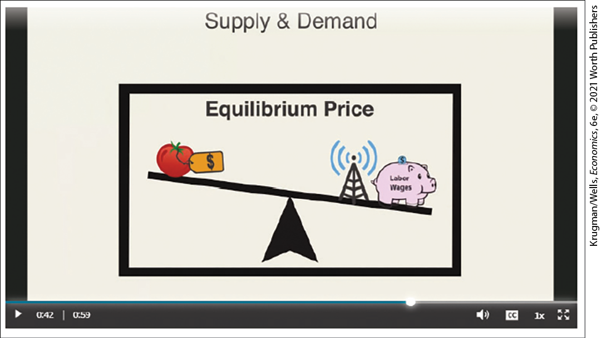
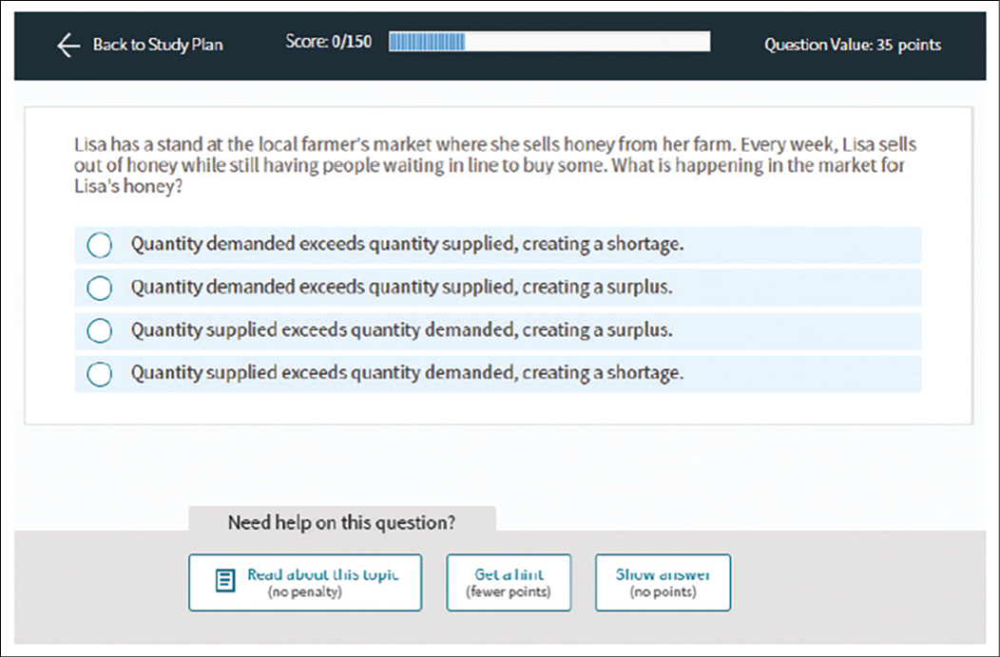
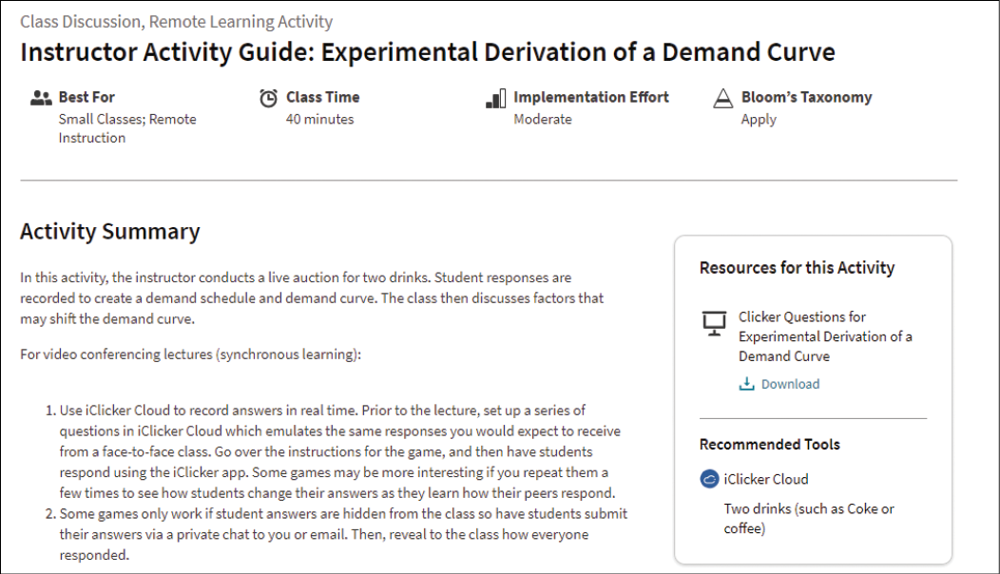
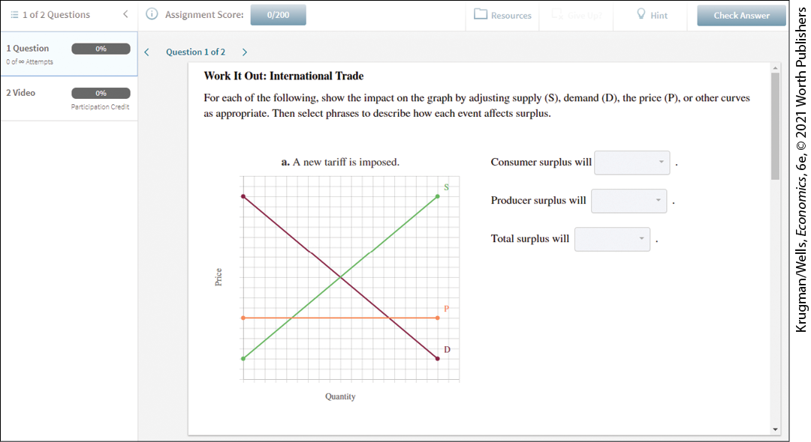
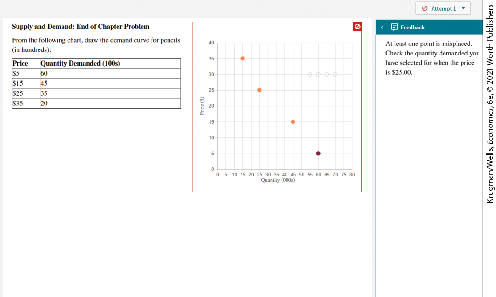

# Brief Contents

#  for *Macroeconomics*

## Engage Every Student

Achieve is a comprehensive set of interconnected teaching and assessment tools. It incorporates the most effective elements from Macmillan’s market-leading solutions in a single, easy-to-use platform. Our resources were co-designed with instructors and students, using a foundation of learning research and rigorous testing.

## Everything You Need in a Single Learning Path

Achieve is an online learning system that supports students and instructors at every step, from the first point of contact with new content to demonstrating mastery of concepts and skills. Powerful resources including an integrated e-book, robust homework, and a wealth of interactives create an extraordinary learning resource for students.

## Learning Objectives Provide Powerful Insights

Every asset you can assign in Achieve is tagged to a learning objective. Insights and reporting help instructors and students understand how they are performing against objectives, enabling more efficient and effective interventions.

## PRE-CLASS

### Pre-Class Tutorials with Bridge Questions

Developed by two pioneers in active-learning methods — Eric Chiang, Florida Atlantic University, and José Vazquez, University of Illinois at Urbana-Champaign — pre-class tutorials foster basic understanding of core economic concepts before students ever set foot in class. Students watch pre-lecture videos and complete bridge questions that prepare them to engage in class. Instructors receive data about student comprehension that can inform the lecture preparation.

<figure id="pau_9781319320164_zvCd03InYI" class="figure lm_img_lightbox unnum c3 main-flow">

</figure>

<aside class="hidden" id="pau_9781319320164_ZzNPaXFBFM" title="hidden">

The video shows a frame titled “Equilibrium Price,” which depicts a lever supported by a fulcrum at the middle. The left side of the lever has a tomato with a price tag on it. The right side of the lever has a pig labeled “Labor Wages” and a radio tower. The lever is slightly lower on the right side.

</aside>

### LearningCurve Adaptive Quizzing

With a game-like interface, this popular and effective quizzing engine offers students a low-stakes way to brush up on concepts and help identify knowledge gaps. Questions are linked to relevant e-book sections, providing both the incentive to read and a framework for an efficient reading experience.

<figure id="pau_9781319320164_32fLipXkBR" class="figure lm_img_lightbox unnum c3 main-flow">

</figure>

<aside class="hidden" id="pau_9781319320164_wbFPKM1xQg" title="hidden">

The screenshot contains a question with four options. The panel at the top of the screen shows “Back to study plan,” “Score: 0 out of 100,” and “question value: 35 points” from left to right. The panel at the bottom of the screen shows “Need help on this question” with three text boxes as follows, “read about this topic,” “Get a hint,” and “show answers.”

</aside>

## IN-CLASS

### Instructor Activity Guides

The guides provide instructors with a structured plan to facilitate an activity that encourages student engagement in both face-to-face and remote learning courses. Each guide is based on a single topic and allows students to participate through questions, group work, presentations, and/or simulations. The guide displays the activity type, estimated prep and class time, implementation instructions, suggestions for remote implementation where applicable, and Learning Objectives and Bloom’s level for ease of use. Our Instructor Activity Guides encourage engagement from a Pre-Class Reflection question to prime student interest and offer follow-up iClicker questions to measure comprehension.

<figure id="pau_9781319320164_78nXVAVcDI" class="figure lm_img_lightbox unnum c3 main-flow">

</figure>

<aside class="hidden" id="pau_9781319320164_NXOvOfkG01" title="hidden">

The top left of the screenshot titled “Instructor Activity Guide: Experimental Derivation of a Demand Curve,” reads “Classroom Discussion, Remote Learning Activity.” Four icons below the title read, “Best For,” “Class Time,” “Implementation Effort,” and “Bloom’s Taxonomy.” Activity Summary with text is displayed on the left of the screen. On the right of the screen, “Resources for this activity” is mentioned. On the bottom right of the screen, “Recommended tools” is mentioned.

</aside>

## POST-CLASS

### Interactive E-Book

The Achieve e-book allows students to highlight and take notes; instructors can choose to assign sections of the e-book as part of their course assignments. The e-book includes step-by-step graphs for complex figures.

### Step-by-Step Graphs

Available in the e-book, step-by-step graphs mirror how an instructor constructs graphs in the classroom. By breaking down the process into its components, these graphs create more manageable “chunks” for students to understand each step of the process.

### Discovering Data

These exercises require students to use the Federal Reserve Economic Database (FRED) related to the concepts discussed in the chapter. Students will get practical experience manipulating data by being asked, for example, to track the impact of a sales tax on tobacco sales. In working these problems, students will gain a greater understanding of core concepts while also working with an impressive data resource.

<figure id="pau_9781319320164_lxleJ9hDur" class="figure lm_img_lightbox unnum c3 main-flow">

</figure>

<aside class="hidden" id="pau_9781319320164_6P1tOWgyHR" title="hidden">

The heading of the screenshot reads, “Taxes, Discovering Data: Question 1 of 3,” followed by a list and a graph. The graph titled “Alfred” has a horizontal axis labeled “years” and a vertical axis labeled “Billions of Dollars.” The graph is followed by a multiple-choice question with three options at the bottom left and two questions with the drop down menu at the bottom right.

</aside>

### Work It Out

These skill-building activities pair sample end-of-chapter problems with targeted feedback and video explanations to help students solve problems step by step. This approach allows students to work independently, tests their comprehension of concepts, and prepares them for class and exams.

<figure id="pau_9781319320164_ZUwOkN7hdf" class="figure lm_img_lightbox unnum c3 main-flow">

</figure>

<aside class="hidden" id="pau_9781319320164_Z9B90MoLdh" title="hidden">

The top panel of the screenshot reads, “1 of 2 questions,” “Assignment score,” “Resources,” “Hint,” and “Check Answer,” from left to right. The top left panel reads, “1 Question” and “2 Video,” from top to bottom. Question 1 of 2 titled “Work It Out: International Trade” is followed by text and a graph. The graph titled “A new tariff is imposed” has the vertical axis labeled “Price” and the horizontal axis labeled “Quantity.” The graph plots 3 lines, labeled D, S, and P. At the right of the graph, three drop down menus with a text are present.

</aside>

### End-of-Chapter Questions

Developed by economists active in the classroom, these multistep questions are adapted from problems found in the text. Each problem is paired with rich feedback for incorrect and correct responses that guide students through the process of problem solving. These questions also feature our user-friendly graphing tool, designed so students focus entirely on economics and not on how to use the application.

<figure id="pau_9781319320164_yNjznD5ME7" class="figure lm_img_lightbox unnum c3 main-flow">

</figure>

<aside class="hidden" id="pau_9781319320164_ggxy6ljnMU" title="hidden">

At the top right, “Attempt 1” is mentioned. The screenshot has a heading that reads, “Supply and Demand: End of Chapter Problem.” Below the heading, a table is provided with column headings, “Price” and “Quantity Demanded.” The graph is at the right of the table and has the vertical axis labeled “Price” and the horizontal axis labeled “Quantity.” The graph plots four dots. On the right panel of the screenshot, “Feedback” is mentioned with text.

</aside>

### Homework

Curated homework problems feature algorithmically generated variables and our user-friendly graphing tool. These problems are multistep with a variety of answer inputs — each with detailed and targeted feedback specific to that answer.

### EconoFact Analysis

Macmillan Learning has partnered with EconoFact to bring incisive and accessible analysis of current economic and policy trends into the economics classroom. The EconoFact Network provides even-handed and timely analysis of economic issues drawing on relevant data, historical experience, and well-regarded economic frameworks presented in the form of a short memo. In Achieve, instructors can access in-class activity guides to help integrate the memos into their own lectures. Instructors can also access and assign assessment on each memo that starts with basic reading comprehension and builds up to applying the analytical tools students have learned in their course to the economic or policy issue covered in the memo.

### Practice Quizzes

Designed to be used as a study tool, these quizzes feature questions from the Test Bank and allow for multiple attempts as students familiarize themselves with content.

<aside class="case-study c3 main-flow v1" epub:type="case-study" id="pau_9781319320164_RqvAC9FMM0">

#### Powerful Support for Instructors

<aside class="subdiv1" id="pau_9781319320164_ekarSfy6ge">

##### Test Bank

This comprehensive Test Bank contains multiple-choice and short-answer questions to help instructors assess students’ comprehension, interpretation, and ability to synthesize.

</aside>
<aside class="subdiv1" id="pau_9781319320164_zH5d2drqZb">

##### Lecture Slides

These brief, interactive, and visually interesting slides are designed to hold students’ attention in class with graphics and animations demonstrating key concepts and real-world examples.

</aside>
<aside class="subdiv1" id="pau_9781319320164_oAGtKmCmLY">

##### Clicker Slides

These slides contain questions to incorporate active learning in the classroom. Students can participate by using the iClicker app on their smartphone or laptop.

</aside>
<aside class="subdiv1" id="pau_9781319320164_lYbzq5JGd7">

##### iClicker Integration

With Achieve’s seamless integration with iClicker, you can help any student participate — in the classroom or virtually. iClicker’s attendance feature gets students in class, then instructors can choose from flexible polling and quizzing options to engage, check understanding, and get feedback from students in real time. iClicker also allows students to participate using laptops, mobile devices, or iClicker remotes — whichever each student prefers. Additionally, we offer Instructor Activity Guides and book-specific iClicker question slides within Achieve to make the most out of your class time. It’s no surprise that over a decade after being founded by educators, iClicker still leads the market. And thousands of instructors continue to give every student a voice with our simple, award-winning student engagement solutions.

</aside>
<aside class="subdiv1" id="pau_9781319320164_o4gCziIIWC">

##### Instructor’s Resource Manual

The Instructor’s Resource Manual offers instructors teaching materials and tips to enhance the classroom experience, along with chapter objectives, outlines, and a breakdown of the large library of MRU videos.

</aside>
<aside class="subdiv1" id="pau_9781319320164_0viFaJZJeq">

##### Solutions Manual

The Solutions Manual contains detailed solutions to all end-of-chapter problems from the textbook.

</aside>
<aside class="subdiv1" id="pau_9781319320164_uU2mWalgUd">

##### Gradebook

Assignment scores are collected into a comprehensive gradebook providing instructors reporting on individuals and overall course performance.

</aside>
<aside class="subdiv1" id="pau_9781319320164_2z6O2y7eT0">

##### LMS Integration

LMS Integration is included so that all students’ scores in Achieve can easily integrate into a school’s learning management system and that an instructor’s gradebook and roster are always in sync.

</aside>
<aside class="subdiv1" id="pau_9781319320164_TMpZj9CujY">

##### Customer Support

Our Achieve Client Success Specialist Team — dedicated platform experts — provides collaboration, software expertise, and consulting to tailor each course to fit your instructional goals and student needs. Start with a demo at a time that works for you to learn more about how to set up your customized course. Talk to your sales representative or visit <a href="https://www.macmillanlearning.com/college/us/contact-us/training-and-demos" id="kru_9781319245269_FM-1.xhtml#pau_9781319320164_73RDGjucpG" class="external">https://www.macmillanlearning.com/college/us/contact-us/training-and-demos</a> for more information.

</aside>
</aside>

**Pricing and bundling options are available at the Macmillan student store: <a href="http://store.macmillanlearning.com/" id="kru_9781319245269_FM-1.xhtml#pau_9781319320164_BgUPVHOIPp" class="external">store.macmillanlearning.com/</a>**
