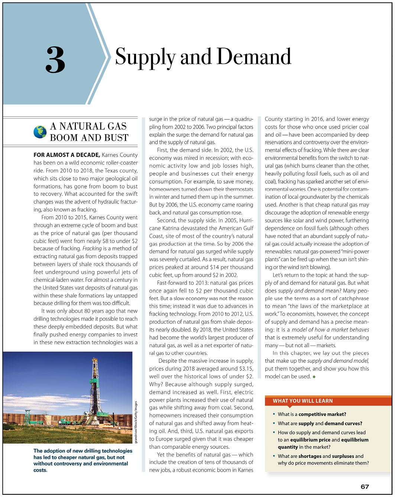
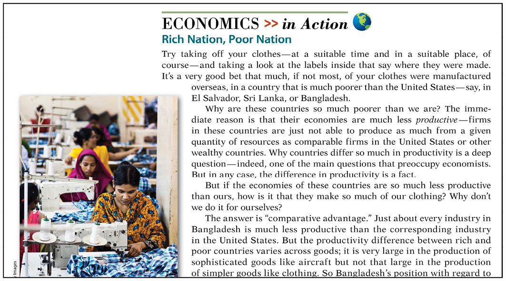
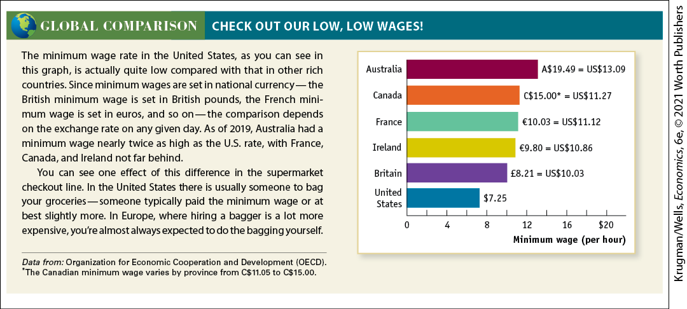
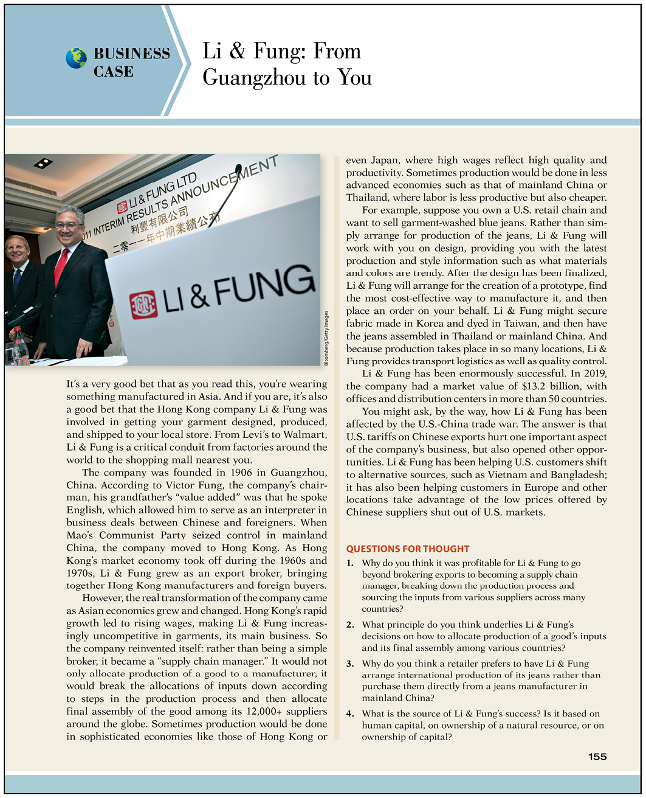

# Engaging Students with a Narrative Approach

- To engage students, every chapter begins with a compelling story. **What You Will Learn** questions help students focus on key concepts in the chapter.

  <figure id="pau_9781319320164_9BNuPpiK1L" class="figure lm_img_lightbox unnum c5 center">
  
  </figure>

  <aside class="hidden" id="pau_9781319320164_BZkPwQPnbJ" title="hidden">

  The page depicts <a href="#kru_9781319245269_ch03_01.xhtml#pau_9781319320164_ECGi4IZqUE" id="kru_9781319245269_FM_preface3.xhtml#pau_9781319320164_lEeigCkcfV" class="crossref">Chapter 3</a> of Supply and Demand with a subheading, “A natural gas boom and bust.” The page has 10 paragraphs arranged in 3 columns. A photo at the bottom of the first column shows a Natural gas plant. At the bottom of the third column, four questions are provided under a heading, “What you will learn.”

  </aside>

- So students can immediately see economic concepts applied in the real world, **Economics in Action** applications appear throughout chapters.

  <figure id="pau_9781319320164_TgTq8wkC9t" class="figure lm_img_lightbox unnum c5 center">
  
  </figure>

  <aside class="hidden" id="pau_9781319320164_5Cdrcq5WoQ" title="hidden">

  The page is titled “Economics in Action” with a globe icon. A subheading reads, “Rich Nation, Poor Nation,” followed by four paragraphs. On the left, a photo shows women working with sewing ma-chines.

  </aside>

- To provide students with an international perspective, the **Global Comparison** feature uses data and graphs to illustrate why countries reach different economic outcomes.

  <figure id="pau_9781319320164_1YNSaJdQOe" class="figure lm_img_lightbox unnum c5 center">
  
  </figure>

  <aside class="hidden" id="pau_9781319320164_CLJBOJ247j" title="hidden">

  The page is titled “Global Comparison, Check out our low, low wages exclamation mark.” There are two paragraphs on the left. In the horizontal bar graph on the right, the horizontal axis is labeled “Minimum wage” and the vertical axis is labeled with 6 countries.

  </aside>

- So students can see key economic principles applied to real-life business situations, each chapter concludes with a **Business Case.**

  <figure id="pau_9781319320164_hIj4SuG2pg" class="figure lm_img_lightbox unnum c5 center">
  
  </figure>

  <aside class="hidden" id="pau_9781319320164_Kyh4FsUyBV" title="hidden">

  The page titled “Business Case” has a heading, “Li and Fung: From Guangzhou to You.” The six paragraphs are arranged in two columns. A photo on the top of the left column shows that men are making announcement with a sign for Li and Fung at their back. At the bottom of the right column, four questions are provided under the heading, “Questions for thought.”

  </aside>
