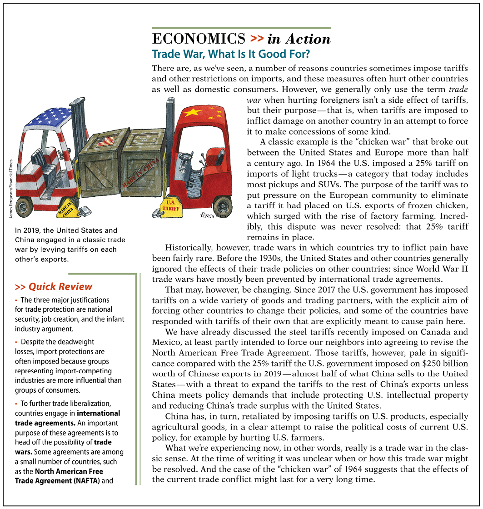
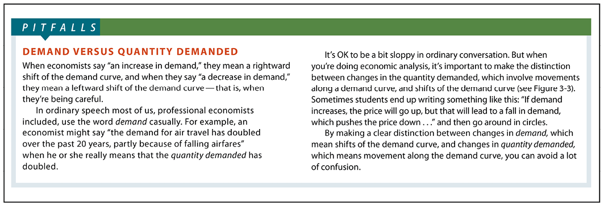
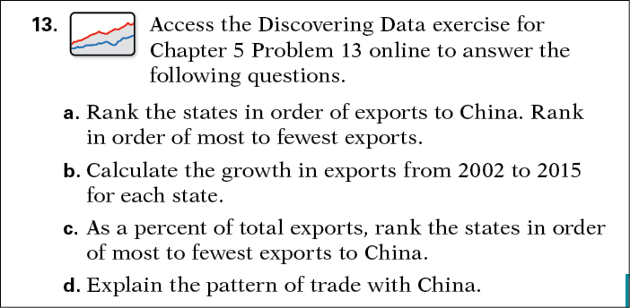

# Engaging Students with Effective Tools for Learning

- To reinforce learning, sections within chapters conclude with three tools: an application of key concepts in the **Economics in Action;** a **Quick Review** of key concepts; and a comprehension check with **Check Your Understanding** questions. Solutions for these questions appear at the back of the text.

  <figure id="pau_9781319320164_RhVa1IV4yT" class="figure lm_img_lightbox unnum c5 center">
  
  </figure>

  <aside class="hidden" id="pau_9781319320164_m0BI4rBiul" title="hidden">

  The page is titled, “Economics, in Action.” A subheading reads, “Trade war, what is it good for question mark.” At the top left, a photo shows two pick up vehicles carrying goods. One vehicle is painted with U.S. flag, and the other vehicle is painted with the flag of China. At the bottom left, texts are provided under the heading, “Quick review.”

  </aside>

- **Pitfalls** teach students to identify and avoid common misconceptions about economic concepts.
  <figure id="pau_9781319320164_HcaM4HStNW" class="figure lm_img_lightbox unnum c5 center">
  
  </figure>

- **Discovering Data** exercises offer students the opportunity to use interactive graphs to analyze interesting economic questions.

  <figure id="pau_9781319320164_vdBmXWZO4D" class="figure lm_img_lightbox unnum c5 center">
  
  </figure>

  <aside class="hidden" id="pau_9781319320164_uK0xGbKKla" title="hidden">

  The page shows a question numbered 20, with a table and a list of three questions, labeled a, b, and c. The table has three columns. The column headings are, “Price of truck,” “Quantity of trucks demanded,” and “Quantity of trucks supplied.”

  </aside>

- End-of-chapter **Work It Out** skill-building problems provide interactive step-by-step help with solving select problems from the text.
  <figure id="pau_9781319320164_MP2uWA4s35" class="figure lm_img_lightbox unnum c5 center">
  
  </figure>

## Acknowledgments

Our deep appreciation and heartfelt thanks go out to **Ryan Herzog**, Gonzaga University, for his hard work and extensive contributions during every stage of this revision. Ryan’s creativity and insights helped us make this Sixth Edition possible. And special thanks to our accuracy checker of page proofs, Thomas Dunn, for his careful attention to detail.

We must also thank the many people at Worth Publishers for their work on this edition: Chuck Linsmeier, Shani Fisher, Simon Glick, Sharon Balbos, Lukia Kliossis, Ann Kirby-Payne, Stephany Harrington, Amanda Gaglione, and Joshua Hill in editorial. We thank Clay Bolton and Travis Long for their enthusiastic and tireless advocacy of this book. Many thanks to the incredible production, design, photo, and media production teams: Tracey Kuehn, Lisa Kinne, Susan Wein, Paul Rohloff, Martha Emry, Diana Blume, Natasha Wolfe, Deb Heimann, Cecilia Varas, Richard Fox, and Andrew Vaccaro.

Our deep appreciation and heartfelt thanks to the following reviewers, whose input helped us shape this Sixth Edition.

- Brandon Addison, *Providence Christian College*
- Gabriel Azarlian, *California State University, Northridge*
- Nestor Azcona, *Providence College*
- Christopher Blake, *Oxford College of Emory University*
- Bruce Brown, *Santa Monica College*
- Terry Brownschidle, *Rider University, Lawrenceville*
- Don Carlson, *Williams College*
- Humza Chohan, *Coastline Community College*
- Brandyn Churchill, *Vanderbilt University*
- Charlie Cowell, *Western Iowa Tech Community College*
- Meredith Crane, *Cincinnati State Technical & Community College*
- Finley Edwards, *Baylor University*
- Wayne Edwards, *University of Vermont*
- Cynthia Foreman, *Clark College*
- Julie Gonzalez, *University of California, Santa Cruz*
- Robert Gordon, *Northwestern University, Evanston*
- Timothy Haase, *Ramapo College of New Jersey*
- Niree Kodaverdian, *Pomona College*
- Janet Koscianski, *Shippensburg University of Pennsylvania*
- Zhen Li, *Albion College*
- Lok Man Lo, *San Francisco State University*
- Mark Miller, *Ramapo College of New Jersey*
- Margaret Morgan-Davie, *Hamilton College, Clinton*
- Michael Nichols, *Baker College of Jackson*
- Sanjay Paul, *Elizabethtown College*
- Michael Polcen, *Northern Virginia Community College, Loudon*
- Collin Rabe, *University of Richmond*
- Edward Raupp, *Great Bay Community College*
- Jack Reardon, *University of Wisconsin, Eau Claire*
- Jeff Sarbaum, *University of North Carolina, Greensboro*
- Angela Seidel, *St. Francis College, Loretto*
- Ali Shahnawaz, *California State University, Chico*
- Jeffrey Stewart, *University of Dayton*
- John Tarchick, *Wayne State University*
- John Vahaly, *University of Louisville*
- Yongqing Wang, *University of Wisconsin, Milwaukee at Waukesha*
- Anne M. Wenzel, *San Francisco State University*
- Deborah Wright, *Southeastern Community College*
- Luo Yilan, *Cerritos College*

We are indebted to the following reviewers, class testers, focus group participants, and other consultants for their suggestions and advice on previous editions.

- Carlos Aguilar, *El Paso Community College*
- Seemi Ahmad, *Dutchess Community College*
- Barbara Alexander, *Babson College*
- Terence Alexander, *Iowa State University*
- Innocentus Alhamis, *Southern New Hampshire University*
- Osbourne Allen, *Miami Dade College*
- Morris Altman, *University of Saskatchewan*
- Farhad Ameen, *State University of New York, Westchester Community College*
- Giuliana Campanelli Andreopoulos, *William Patterson University*
- Becca Arnold, *San Diego Mesa College*
- Dean Baim, *Pepperdine University*
- Jeremy Baker, *Owens Community College*
- Christopher P. Ball, *Quinnipiac University*
- David Barber, *Quinnipiac University*
- Jim Barbour, *Elon University*
- Sandra Barone, *Gonzaga University*
- Janis Barry-Figuero, *Fordham University at Lincoln Center*
- Sue Bartlett, *University of South Florida*
- Hamid Bastin, *Shippensburg University*
- Scott Beaulier, *Mercer University*
- Klaus Becker, *Texas Tech University*
- Richard Beil, *Auburn University*
- Doris Bennett, *Jacksonville State University*
- David Bernotas, *University of Georgia*
- Syon Bhanot, *Swarthmore College*
- Joydeep Bhattacharya, *Iowa State University*
- Marc Bilodeau, *Indiana University and Purdue University, Indianapolis*
- Kelly Blanchard, *Purdue University*
- Joanne Blankenship, *State Fair Community College*
- Emma Bojinova, *Canisius College*
- Michael Bonnal, *University of Tennessee, Chattanooga*
- Milicia Bookman, *Saint Joseph’s University*
- Ralph Bradburd, *Williams College*
- Mark Brandly, *Ferris State University*
- Anne Bresnock, *California State Polytechnic University, Pomona*
- Stacey Brook, *University of Iowa*
- Kevin Brown, *Asbury University*
- Douglas M. Brown, *Georgetown University*
- Joseph Calhoun, *Florida State University*
- Colleen Callahan, *American University*
- Charles Campbell, *Mississippi State University*
- Douglas Campbell, *University of Memphis*
- Randall Campbell, *Mississippi State University*
- Kevin Carlson, *University of Massachusetts, Boston*
- Joel Carton, *Florida International University*
- Andrew Cassey, *Washington State University*
- Shirley Cassing, *University of Pittsburgh*
- Semih Cekin, *Texas Tech University*
- Sewin Chan, *New York University*
- Mitchell M. Charkiewicz, *Central Connecticut State University*
- Joni S. Charles, *Texas State University, San Marcos*
- Adhip Chaudhuri, *Georgetown University*
- Basanta Chaudhuri, *Rutgers University*
- Sanjukta Chaudhuri, *University of Wisconsin, Eau Claire*
- Eric Chiang, *Florida Atlantic University*
- Hayley H. Chouinard, *Washington State University*
- Abdur Chowdhury, *Marquette University*
- Kenny Christianson, *Binghamton University*
- Lisa Citron, *Cascadia Community College*
- Timothy Classen, *Loyola University Chicago*
- Maryanne Clifford, *Eastern Connecticut State University*
- Steven L. Cobb, *University of North Texas*
- Greg Colson, *University of Georgia*
- Barbara Z. Connolly, *Westchester Community College*
- Stephen Conroy, *University of San Diego*
- Thomas E. Cooper, *Georgetown University*
- Cesar Corredor, *Texas A&M University and University of Texas, Tyler*
- Chad Cotti, *University of Wisconsin, Oshkosh*
- Jim F. Couch, *University of Northern Alabama*
- Patrick Crowley, *Texas A&M University, Corpus Christi*
- Attila Cseh, *Valdosta State University*
- Maria DaCosta, *University of Wisconsin, Eau Claire*
- Daniel Daly, *Regis University*
- Dixie Dalton, *Southside Virginia Community College*
- H. Evren Damar, *Pacific Lutheran University*
- James P. D’Angelo, *University of Cincinnati*
- Antony Davies, *Duquesne University*
- Greg Delemeester, *Marietta College*
- Sean D’Evelyn, *Loyola Marymount University*
- Ronald Dieter, *Iowa State University*
- Joseph Dipoli, *Salem State University*
- Patrick Dolenc, *Keene State College*
- Christine Doyle-Burke, *Framingham State College*
- Ding Du, *South Dakota State University*
- Jerry Dunn, *Southwestern Oklahoma State University*
- Thomas Dunn
- Robert R. Dunn, *Washington and Jefferson College*
- Christina Edmundson, *North Idaho College*
- Hossein Eftekari, *University of Wisconsin, River Falls*
- Ann Eike, *University of Kentucky*
- Harold Elder, *University of Alabama*
- Tisha L. N. Emerson, *Baylor University*
- Hadi Salehi Esfahani, *University of Illinois*
- Mark Evans, *California State University, Bakersfield*
- Mohammadmahdi Farsiabi, *Wayne State University*
- William Feipel, *Illinois Central College*
- Rudy Fichtenbaum, *Wright State University*
- David W. Findlay, *Colby College*
- Mary Flannery, *University of California, Santa Cruz*
- Sherman Folland, *Oakland University*
- Cynthia Foreman, *Clark College*
- Irene Foster, *George Washington University*
- Robert Francis, *Shoreline Community College*
- Amanda Freeman, *Kansas State University*
- Shelby Frost, *Georgia State University*
- John Gahagan, *Shoreline Community College*
- Frank Gallant, *George Fox University*
- Robert Gazzale, *Williams College*
- Bruce Gervais, *California State University, Sacramento*
- Satyajit Ghosh, *University of Scranton*
- Stuart Glosser, *University of Wisconsin, Whitewater*
- Robert Godby, *University of Wyoming*
- Fidel Gonzalez, *Sam Houston State University*
- Julie Gonzalez, *University of California, Santa Cruz*
- Michael G. Goode, *Central Piedmont Community College*
- Douglas E. Goodman, *University of Puget Sound*
- Marvin Gordon, *University of Illinois at Chicago*
- Kathryn Graddy, *Brandeis University*
- Alan Gummerson, *Florida International University*
- Jason Gurtovoy, *Cerritos College*
- Eran Guse, *West Virginia University*
- Ian Haberman, *Hunter College*
- Alan Day Haight, *State University of New York, Cortland*
- Mehdi Haririan, *Bloomsburg University*
- Robert Harris, *Indiana University and Purdue University, Indianapolis*
- Hadley Hartman, *Santa Fe College*
- Clyde A. Haulman, *College of William and Mary*
- Richard R. Hawkins, *University of West Florida*
- Mickey A. Hepner, *University of Central Oklahoma*
- Ryan Herzog, *Gonzaga University*
- Michael Hilmer, *San Diego State University*
- Tia Hilmer, *San Diego State University*
- Jane Himarios, *University of Texas, Arlington*
- Jim Holcomb, *University of Texas, El Paso*
- Don Holley, *Boise State University*
- Alexander Holmes, *University of Oklahoma*
- Julie Holzner, *Los Angeles City College*
- Robert N. Horn, *James Madison University*
- Scott Houser, *Colorado School of Mines*
- Grover Howard, *Shoreline Community College*
- Steven Husted, *University of Pittsburgh*
- Hiro Ito, *Portland State University*
- Ali Jalili, *New England College*
- Mike Javanmard, *Rio Hondo Community College*
- Mervin Jebaraj, *University of Arkansas*
- Jonatan Jelen, *The City College of New York*
- Carl Jensen, *Seton Hall University*
- Robert T. Jerome, *James Madison University*
- Donn Johnson, *Quinnipiac University*
- Shirley Johnson-Lans, *Vassar College*
- David Kalist, *Shippensburg University*
- Lillian Kamal, *Northwestern University*
- Roger T. Kaufman, *Smith College*
- Dennis Kaufman, *University of Wisconsin, Parkside*
- Elizabeth Sawyer Kelly, *University of Wisconsin, Madison*
- Herb Kessel, *St. Michael’s College*
- Farida Khan, *University of Wisconsin, Parkside*
- Ara Khanjian, *Ventura College*
- Rehim Kilic, *Georgia Institute of Technology*
- Grace Kim, *University of Michigan, Dearborn*
- Miles Kimball, *University of Michigan*
- Michael Kimmitt, *University of Hawaii, Manoa*
- Robert Kling, *Colorado State University*
- Colin Knapp, *University of Florida*
- Janet Koscianski, *Shippensburg University*
- Sherrie Kossoudji, *University of Michigan*
- Stephan Kroll, *Colorado State University*
- Charles Kroncke, *College of Mount Saint Joseph*
- Reuben Kyle, *Middle Tennessee State University (retired)*
- Katherine Lande-Schmeiser, *University of Minnesota, Twin Cities*
- Vicky Langston, *Columbus State University*
- Richard B. Le, *Cosumnes River College*
- Yu-Feng Lee, *New Mexico State University*
- David Lehr, *Longwood College*
- Mary Jane Lenon, *Providence College*
- Noreen Lephardt, *Marquette University*
- Mary H. Lesser, *Iona College*
- An Li, *Keene State College*
- Liaoliao Li, *Kutztown University*
- Solina Lindahl, *California Polytechnic Institute, San Luis Obispo*
- Haiyong Liu, *East Carolina University*
- Jane S. Lopus, *California State University, East Bay*
- Fernando Lozano, *Claremont McKenna College*
- María José Luengo-Prado, *Northeastern University*
- Volodymyr Lugovskyy, *Indiana University*
- Rotua Lumbantobing, *North Carolina State University*
- Ed Lyell, *Adams State College*
- Martin Ma, *Washington State University*
- John Marangos, *Colorado State University*
- Stephen Marks, *Claremont McKenna College*
- Ralph D. May, *Southwestern Oklahoma State University*
- Mark E. McBride, *Miami University (Ohio)*
- Wayne McCaffery, *University of Wisconsin, Madison*
- Larry McRae, *Appalachian State University*
- Mary Ruth J. McRae, *Appalachian State University*
- Ellen E. Meade, *American University*
- Meghan Millea, *Mississippi State University*
- Ashley Miller, *Mount Holyoke College*
- Norman C. Miller, *Miami University (Ohio)*
- Michael Mogavero, *University of Notre Dame*
- Khan A. Mohabbat, *Northern Illinois University*
- Ross Mohr, *Chapman University*
- Myra L. Moore, *University of Georgia*
- Jay Morris, *Champlain College in Burlington*
- Akira Motomura, *Stonehill College*
- Gary Murphy, *Case Western Reserve University*
- Kevin J. Murphy, *Oakland University*
- Robert Murphy, *Boston College*
- Ranganath Murthy, *Bucknell University*
- Anna Musatti, *Columbia University*
- Christopher Mushrush, *Illinois State University*
- Anthony Myatt, *University of New Brunswick, Canada*
- Steven Nafziger, *Williams College*
- Soloman Namala, *Cerritos College*
- Kathryn Nantz, *Fairfield University*
- ABM Nasir, *North Carolina Central University*
- Gerardo Nebbia, *El Camino College*
- Pattabiraman Neelakantan, *East Stroudsburg University*
- Randy A. Nelson, *Colby College*
- Charles Newton, *Houston Community College*
- Daniel X. Nguyen, *Purdue University*
- Pamela Nickless, *University of North Carolina, Asheville*
- Dmitri Nizovtsev, *Washburn University*
- Nick Noble, *Miami University (Ohio)*
- Gerald Nyambane, *Davenport University*
- Fola Odebunmi, *Cypress College*
- Thomas A. Odegaard, *Baylor University*
- Constantin Oglobin, *Georgia Southern University*
- Charles C. Okeke, *College of Southern Nevada*
- Alexandre Olbrecht, *Ramapo College of New Jersey*
- Terry Olson, *Truman State University*
- Una Okonkwo Osili, *Indiana University and Purdue University, Indianapolis*
- Ram Orzach, *Oakland University*
- Maxwell Oteng, *University of California, Davis*
- Tomi Ovaska, *Youngstown State University*
- P. Marcelo Oviedo, *Iowa State University*
- Jeff Owen, *Gustavus Adolphus College*
- Orgul Demet Ozturk, *University of South Carolina*
- Jennifer Pakula, *Cerritos College*
- James Palmieri, *Simpson College*
- Walter G. Park, *American University*
- Elliott Parker, *University of Nevada, Reno*
- Tim Payne, *Shoreline College*
- Sonia Pereira, *Barnard College, Columbia University*
- Michael Perelman, *California State University, Chico*
- Nathan Perry, *Utah State University*
- Brian Peterson, *Central College*
- Dean Peterson, *Seattle University*
- Ken Peterson, *Furman University*
- David Pieper, *City College of San Francisco*
- Paul Pieper, *University of Illinois at Chicago*
- Dennis L. Placone, *Clemson University*
- Michael Polcen, *Northern Virginia Community College*
- Linnea Polgreen, *University of Iowa*
- Raymond A. Polchow, *Zane State College*
- Eileen Rabach, *Santa Monica College*
- Matthew Rafferty, *Quinnipiac University*
- Jaishankar Raman, *Valparaiso University*
- Tove Rasmussen, *Southern Maine Community College*
- Margaret Ray, *Mary Washington College*
- Arthur Raymond, *Muhlenberg College*
- Jason Reed, *Wayne State University*
- Jack Reynolds, *Navarro College*
- Tim Reynolds, *Alvin Community College*
- Helen Roberts, *University of Illinois at Chicago*
- Greg Rose, *Sacramento City College*
- Luis Rosero, *Framingham State*
- Jeffrey Rubin, *Rutgers University, New Brunswick*
- Rose M. Rubin, *University of Memphis*
- Lynda Rush, *California State Polytechnic University, Pomona*
- Matt Rutledge, *Boston College*
- Michael Ryan, *Western Michigan University*
- Martin Sabo, *Community College of Denver*
- Sara Saderion, *Houston Community College*
- Djavad Salehi-Isfahani, *Virginia Tech*
- Mikael Sandberg, *University of Florida*
- Michael Sattinger, *University at Albany*
- Duncan Sattler, *Wilbur Wright College*
- Elizabeth Sawyer-Kelly, *University of Wisconsin, Madison*
- Jake Schild, *Indiana University*
- Lucie Schmidt, *Williams College*
- Jesse A. Schwartz, *Kennesaw State University*
- Chad Settle, *University of Tulsa*
- Steve Shapiro, *University of North Florida*
- Robert L. Shoffner III, *Central Piedmont Community College*
- Joseph Sicilian, *University of Kansas*
- Zamira Simkins, *University of Wisconsin, Superior*
- Aschale Siyoum, *Catholic University of America*
- Judy Smrha, *Baker University*
- Mark Sniderman, *Case Western Reserve University*
- John Solow, *University of Iowa*
- John Somers, *Portland Community College*
- Ralph Sonenshine, *American University*
- Stephen Stageberg, *University of Mary Washington*
- Monty Stanford, *DeVry University*
- Rebecca Stein, *University of Pennsylvania*
- James Sterns, *Oregon State University*
- William K. Tabb, *Queens College, City University of New York (retired)*
- Sarinda Taengnoi, *University of Wisconsin, Oshkosh*
- Daniel Talley, *Dakota State University*
- Kerry Tan, *Loyola University, Maryland*
- Henry Terrell, *George Washington University*
- Henry Terrell, *University of Maryland*
- Rebecca Achée Thornton, *University of Houston*
- Michael Toma, *Armstrong Atlantic State University*
- Jill Trask, *Tarrant County College — Southeast*
- Julianne Treme, *University of North Carolina at Wilmington*
- Brian Trinque, *University of Texas, Austin*
- Magda Tsaneva, *Clark University*
- Boone A. Turchi, *University of North Carolina, Chapel Hill*
- Phillip Tussing, *Alvin Community College*
- Nathaniel Udall, *Alvin Community College*
- Nora Underwood, *University of Central Florida*
- J. S. Uppal, *State University of New York, Albany*
- John Vahaly, *University of Louisville*
- Lee Van Scyoc, *University of Wisconsin, Oshkosh*
- Jose J. Vazquez-Cognet, *University of Illinois, Urbana–Champaign*
- Daniel Vazzana, *Georgetown College*
- Sujata Verma, *Notre Dame de Namur University*
- Aimee Vlachos-Bullard, *Southern Maine Community College*
- Roger H. von Haefen, *North Carolina State University*
- Andreas Waldkirch, *Colby College*
- Christopher Waller, *University of Notre Dame*
- Xiao Wang, *University of North Dakota*
- Gregory Wassall, *Northeastern University*
- Robert Whaples, *Wake Forest University*
- Thomas White, *Assumption College*
- Michael Williams, *Prairie View A&M University*
- Jennifer P. Wissink, *Cornell University*
- Mark Witte, *Northwestern University*
- Kristen M. Wolfe, *St. Johns River Community College*
- Larry Wolfenbarger, *Macon State College*
- Louise B. Wolitz, *University of Texas, Austin*
- Kelvin Wont, *University of Minnesota*
- Hyun Woong Park, *Allegheny College*
- Jadrian Wooten, *Pennsylvania State University*
- Gavin Wright, *Stanford University*
- Bill Yang, *Georgia Southern University*
- Kristen Zaborski, *The State College of Florida*
- Jason Zimmerman, *South Dakota State University*
