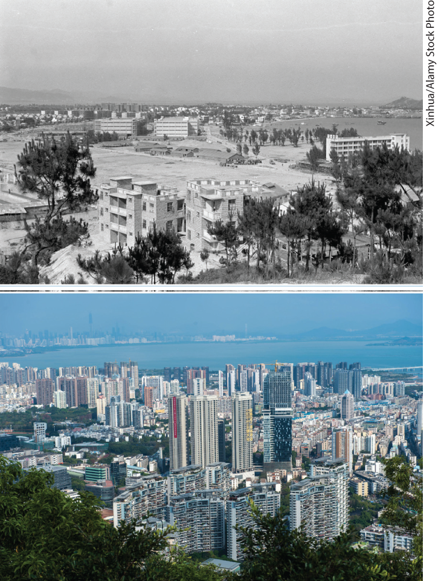
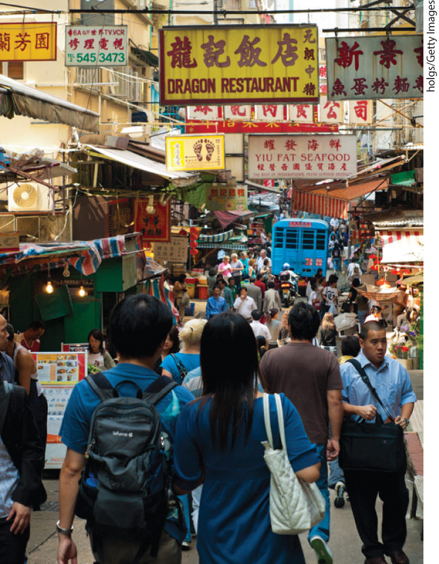
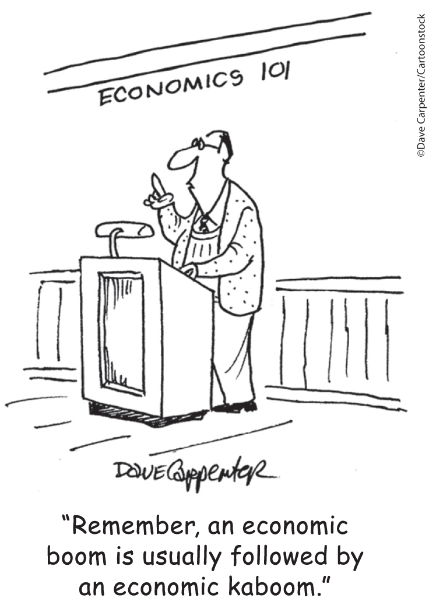

# Introduction: An Engine for Growth and Discovery

## A day in the megacity

**LONDON, NEW YORK, AND TOKYO** have something in common: they are megacities — huge metropolitan complexes that contain tens of millions of people and are spread over immense tracts of land. While most people are familiar with these megacities, not everyone knows about the biggest of them all: the vast urban complex known as China’s Pearl River Delta (the PRD). Roughly the same size as the state of Delaware, the PRD is home to more than 65 million people. Driving across the PRD (as one of the authors has done), with its endless succession of factories, office buildings, and apartment towers, is an unforgettable — and very long — experience.

<figure id="pau_9781319320164_ex7fooc2kK" class="figure lm_img_lightbox unnum c2 right">

<figcaption>
<strong>Thirty years ago China was very poor with a backward economy. Now it produces sophisticated goods for the world, allowing it to deliver relatively comfortable incomes to many of its people.</strong>
</figcaption>
</figure>

<aside class="hidden" id="pau_9781319320164_uiGkPBK1hH" title="hidden">

The first photo shows the sparse development of China thirty years ago, along the Pearl River Delta. The second photo shows the same region packed with high-rise buildings.

</aside>

What are all those people doing? A significant percentage of them are engaged in producing goods for world markets, especially, but by no means only, electronic components: just about every smartphone, tablet, and computer contains components produced in the PRD. But the megacity’s residents are consumers as well as producers. While the wage of an average worker in the PRD is relatively low by U.S. standards, overall wages and income are high enough to support a vast retail sector, ranging from mom-and-pop local stores to shops selling expensive luxury goods.

But not so long ago, neither the PRD nor the economic dynamism it embodies was visible. As recently as 1980, 800 million people in China subsisted on less than \$1.50 a day. The average Chinese citizen more or less had enough to eat and a roof over his or her head, but not much more than that. In fact, the standard of living wasn’t much higher than it had been centuries earlier. And from 1959 to 1961, in what is now known as “The Great Leap Backward,” the Chinese government got the economy so wrong that millions of Chinese died from man-made famine.

However, in the years since 1980, Chinese incomes have soared more than twentyfold in real terms as the poverty rate (percentage of the population subsisting on less than \$1.90 a day) has fallen from 88% in 1981 to 0.2% in 2015. The rise of the PRD is one chapter of an incredible success story in which hundreds of millions of Chinese have been lifted out of abject poverty over the past few decades. Never in human history have so many seen so much progress.

Although this is a remarkable story, it is not entirely unprecedented. From 1840 to 1910, British workers also experienced a marked rise in their standard of living. And this success was repeated soon afterward in the United States, setting the stage for the high levels of prosperity we now enjoy. Commenting on how English workers were lifted out of poverty, the great economist Alfred Marshall made an observation that is equally relevant for Chinese workers today: “The hope that poverty and ignorance may gradually be extinguished, derives indeed much support from the steady progress of the working classes during the nineteenth century.”

These unprecedented sets of events have touched our lives today in a dizzying number of ways. You are using smartphones, tablets, and laptops that are manufactured in the PRD as you pursue a first-rate education in the United States, one of the richest countries in the world.

What can economics say about all of this? Quite a lot, it turns out. What you will learn from this book is how these momentous changes, which lifted hundreds of millions of people out of poverty, are related to a simple, but very important, set of questions involving economics. Among these questions are:

- How does our economic system work? That is, how does it manage to deliver the goods?
- When and why does our economic system sometimes go astray, leading people into counterproductive behavior?
- Why are there ups and downs in the economy? That is, why does the economy sometimes have a bad year?
- Why is the long run mainly a story of ups rather than downs? That is, why has China, like Great Britain and the United States, become much richer over time?

Let’s take a look at these questions and offer a brief preview of what you will learn in this book. 

## The Invisible Hand

The massive industrial and consumer complex that is today’s Pearl River Delta is quite a new creation. As recently as 1980 much of the region was an economic backwater; the nucleus, Shenzhen, was then a small and very poor fishing village. How did this backwater turn into the electronics workshop of the world, making it a dynamic creator of wealth?

To achieve the level of prosperity we have in America, a level the average resident of the PRD can only now begin to aspire to, you need a well-functioning system for coordinating productive activities — the activities that create the goods and services people want and get them to the people who want them. That kind of system is what we mean when we talk about the <a href="#kru_9781319245269_EM_glossary.xhtml#pau_9781319320164_lbKqyzXLJY" id="kru_9781319245269_ch00_02.xhtml#pau_9781319320164_L2419GitjF" class="glossref" role="doc-glossref">economy</a>. And <a href="#kru_9781319245269_EM_glossary.xhtml#pau_9781319320164_RoVO0uUrTc" id="kru_9781319245269_ch00_02.xhtml#pau_9781319320164_qVqBc8QXef" class="glossref" role="doc-glossref">economics</a> is the social science that studies the production, distribution, and consumption of goods and services.

<aside aria-label="title1" class="glossary c3 main-flow v1" epub:type="glossary" id="pau_9781319320164_Ep1FIDpnjQ">

**economy**  
An **economy** is a system for coordinating society’s productive activities.

</aside>
<aside aria-label="title2" class="glossary c3 main-flow v1" epub:type="glossary" id="pau_9781319320164_fxPQWgz6BO">

**economics**  
**Economics** is the social science that studies the production, distribution, and consumption of goods and services.

</aside>

An economy succeeds to the extent that it, literally, delivers the goods. And as we’ve discussed, over the past 30 years the Chinese economy has achieved a spectacular increase in the amount of goods it delivers both to its own citizens and to the rest of the world.

So China’s economy must be doing something right, and we might want to compliment the people in charge. But guess what? There isn’t anyone in charge — not anymore.

<figure id="pau_9781319320164_YMINeYqVVi" class="figure lm_img_lightbox unnum c2 right">

<figcaption>
A booming marketplace in today’s China.
</figcaption>
</figure>

In the 1970s, before the PRD began its incredible rise, China was a *command economy* in which decisions about what factories would produce and what goods would be delivered to households were made by government officials. But experience shows that command economies don’t work very well. Producers in command economies like China before 1980 or the Soviet Union before 1991 routinely found themselves unable to produce because they did not have crucial raw materials, or if they succeeded in producing, they found nobody wanted their products. Consumers were often unable to find necessities like toilet paper or milk. Command economies are infamous for long lines at shops. And as we mentioned, from 1959 to 1961, the Chinese government got its command economy terribly wrong, inflicting enormous hardship and causing millions of unnecessary deaths.

In 1978 the Chinese government finally admitted that its economic model wasn’t working, and began a remarkable transformation into a <a href="#kru_9781319245269_EM_glossary.xhtml#pau_9781319320164_8KcxTAaq52" id="kru_9781319245269_ch00_02.xhtml#pau_9781319320164_wB5rhI5Fi9" class="glossref" role="doc-glossref">market economy</a>, one in which production and consumption are the result of decentralized decisions by many firms and individuals. The United States has a market economy. And in today’s China there is no central authority telling people what to produce or where to ship it. Each individual producer makes what they think will be most profitable; each consumer buys what they choose. It’s important to realize, however, that the Chinese government intervenes in markets much more than the U.S. government does; in particular, while China’s government rarely tells producers what to produce, it often tells banks how much to lend and to whom.

<aside aria-label="title3" class="glossary c3 main-flow v1" epub:type="glossary" id="pau_9781319320164_VigC5o9RoL">

**market economy**  
A **market economy** is an economy in which decisions about production and consumption are made by individual producers and consumers.

</aside>

<figure id="pau_9781319320164_wTt4ciYQcz" class="figure lm_img_lightbox unnum c2 right">

<figcaption>
According to Adam Smith, a market economy manages to harness the power of self-interest for the common good.
</figcaption>
</figure>

If you had never seen a market economy in action, you might imagine that it would be chaotic. After all, nobody is in charge. But market economies are able to coordinate even highly complex activities and reliably provide consumers with the goods and services they want. Indeed, people quite casually trust their lives to the market system: residents of any major city would starve in days if the unplanned yet somehow orderly actions of thousands of businesses did not deliver a steady supply of food. Surprisingly, the unplanned “chaos” of a market economy turns out to be far more orderly than the planning of a command economy. And that’s why almost every country in the world — North Korea and Cuba are the only exceptions — has become a market economy.

In 1776, in a famous passage in his book *The Wealth of Nations,* the pioneering Scottish economist Adam Smith wrote about how individuals, in pursuing their own interests, often end up serving the interests of society as a whole. Of a businessman whose pursuit of profit makes the nation wealthier, Smith wrote: “\[H\]e intends only his own gain, and he is in this, as in many other cases, led by an invisible hand to promote an end which was no part of his intention.” Ever since, economists have used the term <a href="#kru_9781319245269_EM_glossary.xhtml#pau_9781319320164_r4djIyweYh" id="kru_9781319245269_ch00_02.xhtml#pau_9781319320164_yAoFQcbNbK" class="glossref" role="doc-glossref">invisible hand</a> to refer to the way a market economy manages to harness the power of self-interest for the good of society.

<aside aria-label="title4" class="glossary c3 main-flow v1" epub:type="glossary" id="pau_9781319320164_fIJnj7DSlM">

**invisible hand**  
The **invisible hand** refers to the way in which the individual pursuit of self-interest can lead to good results for society as a whole.

</aside>

The study of how individuals make decisions and how these decisions interact is called <a href="#kru_9781319245269_EM_glossary.xhtml#pau_9781319320164_btIWkxbIc7" id="kru_9781319245269_ch00_02.xhtml#pau_9781319320164_FlST5165me" class="glossref" role="doc-glossref">microeconomics</a>. One of the key themes in microeconomics is the validity of Adam Smith’s insight: individuals pursuing their own interests often do promote the interests of society as a whole.

<aside aria-label="title5" class="glossary c3 main-flow v1" epub:type="glossary" id="pau_9781319320164_RHumsIZ7hG">

**microeconomics**  
**Microeconomics** is the branch of economics that studies how people make decisions and how these decisions interact.

</aside>

So the answer to our first question — “How does our economic system manage to deliver the goods?” — is that we rely on the virtues of a market economy and the power of the invisible hand.

But the invisible hand isn’t always our friend. It’s also important to understand when and why the individual pursuit of self-interest can lead to counterproductive behavior.

## My Benefit, Your Cost

In most ways, life in the PRD is immensely better than it was in 1980. Two things have, however, gotten much worse: traffic congestion and air quality. At rush hour, the average speed on the PRD’s roads is only around 12 miles an hour and the air is seriously unhealthy much of the year.

Why do these problems represent failures of the invisible hand? Consider the case of traffic congestion.

When traffic is congested, each driver is imposing a cost on all the other drivers on the road — she is literally getting in their way (and they are getting in her way). This cost can be substantial: one estimate found that someone driving a car into lower Manhattan on a weekday causes more than three hours of delays to other drivers, and around \$160 in monetary losses. Yet when deciding whether or not to drive, commuters have no incentive to take the costs they impose on others into account.

Traffic congestion is a familiar example of a much broader problem: <a href="#kru_9781319245269_EM_glossary.xhtml#pau_9781319320164_nLKUJbFWst" id="kru_9781319245269_ch00_03.xhtml#pau_9781319320164_xjW5yFNJjU" class="glossref" role="doc-glossref">market failure</a>, which happens when the individual pursuit of one’s own interest, instead of promoting the interests of society as a whole, actually makes society worse off. Another important example of market failure is air pollution, which is all too visible, literally, in the PRD. Water pollution and the overexploitation of natural resources such as fish and forests reflect the same problem.

<aside aria-label="title" class="glossary c3 main-flow v1" epub:type="glossary" id="pau_9781319320164_PpS4nscrr8">

**market failure**  
When the individual pursuit of self-interest leads to bad results for society as a whole, there is **market failure.**

</aside>

The environmental costs of self-interested behavior can sometimes be huge. And as the world becomes more crowded and the environmental footprint of human activity continues to grow, issues like climate change and ocean acidification will become increasingly important.

The good news, as you will learn if you study microeconomics, is that economic analysis can be used to diagnose cases of market failure. And often, economic analysis can also be used to devise solutions for the problem.

## Good Times, Bad Times

<figure id="pau_9781319320164_UUrlWhBBfy" class="figure lm_img_lightbox unnum c2 right">

</figure>

China has become an enormous economic powerhouse in the last 30 years. (And, depending upon the data source used, China and the United States vie for top place among the world’s economies.) One somewhat ironic consequence of China’s rise is that people around the world get nervous at any signs of trouble in Chinese industry, because it’s such a big source of demand for raw materials. And in 2019, there was a lot to be nervous about. Many economic indicators pointed to a sharp slowdown in the economy.

Such troubled periods are a regular feature of modern economies. The fact is that the economy does not always run smoothly: it experiences fluctuations, a series of ups and downs. By middle age, a typical American will have experienced three or four downs, known as <a href="#kru_9781319245269_EM_glossary.xhtml#pau_9781319320164_IYJxsxSf0C" id="kru_9781319245269_ch00_04.xhtml#pau_9781319320164_O97ad8TFhH" class="glossref" role="doc-glossref">recessions</a>. The U.S. economy experienced serious recessions beginning in 1973, 1981, 1990, 2001, and 2007. During a severe recession, millions of workers may be laid off.

<aside aria-label="title1" class="glossary c3 main-flow v1" epub:type="glossary" id="pau_9781319320164_Eh9RLAM6RA">

**recession**  
A **recession** is a downturn in the economy.

</aside>

Like market failure, recessions are a fact of life; but also like market failure, they are a problem for which economic analysis offers some solutions. Recessions are one of the main concerns of the branch of economics known as <a href="#kru_9781319245269_EM_glossary.xhtml#pau_9781319320164_uaJcb3a7GV" id="kru_9781319245269_ch00_04.xhtml#pau_9781319320164_4H7RsJpNpG" class="glossref" role="doc-glossref">macroeconomics</a>, which is concerned with the overall ups and downs of the economy. If you study macroeconomics, you will learn how economists explain recessions and how government policies can be used to minimize the damage from economic fluctuations.

<aside aria-label="title2" class="glossary c3 main-flow v1" epub:type="glossary" id="pau_9781319320164_qCbnr7SPpD">

**macroeconomics**  
**Macroeconomics** is the branch of economics that is concerned with overall ups and downs in the economy.

</aside>

Despite the occasional recession, however, over the long run the stories of all major economies contain many more ups than downs. And that long-run ascent is the subject of our final question.

## Onward and Upward

The overall standard of living of the average resident of the PRD, while immensely higher than it was in 1980, is still pretty low by American standards. But then, America wasn’t always as rich as it is today. Indeed, at the beginning of the twentieth century, most Americans lived under conditions that we would now think of as extreme poverty. Only 10% of homes had flush toilets, only 8% had central heating, only 2% had electricity, and almost nobody had a car, let alone a washing machine or air conditioning. But over the course of the following century America achieved a remarkable rise in living standards that ultimately led to the great wealth that we see around us today.

Such comparisons are a stark reminder of how much lives around the world have been changed by <a href="#kru_9781319245269_EM_glossary.xhtml#pau_9781319320164_Mg6PNHbyvG" id="kru_9781319245269_ch00_05.xhtml#pau_9781319320164_QUOrouzrDV" class="glossref" role="doc-glossref">economic growth</a>, the increasing ability of the economy to produce goods and services, leading to higher living standards. Why does the economy grow over time? And why does economic growth occur faster in some places and times than in others? These are key questions for economics, because economic growth is a good thing, for many, as residents of the PRD can attest, and most of us want more of it. But economic growth does come with some costs.

<aside aria-label="title" class="glossary c3 main-flow v1" epub:type="glossary" id="pau_9781319320164_hxFa9H9gwg">

**economic growth**  
**Economic growth** is the growing ability of the economy to produce goods and services, leading to higher living standards.

</aside>

Specifically, despite benefiting the vast majority of people, economic growth has always created losers as well as winners as fast-growing, emerging sectors of the economy eclipse those of the past. For example, the gleaming towers built in the PRD, along with newly constructed dams, displaced many Chinese, a number of them farmers who lost their land and livelihoods.

The environment is another potential loser, unless attention is paid to the question of how to achieve *sustainable long-run economic growth,* which is economic growth over the long term that balances protection of the environment with improved living standards for current and future generations. Today, the goal of balancing the production of goods and services with the health of the environment is a hotly debated policy topic. Economic analysis has a key role to play here because environmental degradation is often a result of market failure.

## An Engine for Discovery

We hope we have convinced you that what the great economist Alfred Marshall called the “ordinary business of life,” the economic actions and transactions that go on every day not just in the PRD but around the world, is really quite extraordinary, if you stop to think about it, and that it can lead us to ask some very interesting and important questions.

In this book, we will describe the answers economists have given to these questions. But this book, like economics as a whole, isn’t a list of answers: it’s an introduction to a discipline, a way to address questions like those we asked earlier. Or as Alfred Marshall put it: “Economics . . . is not a body of concrete truth, but an engine for the discovery of concrete truth.”

So let’s turn the key and start the ignition.

### Key terms

- <a href="#kru_9781319245269_ch00_02.xhtml#pau_9781319320164_L2419GitjF" id="kru_9781319245269_ch00_07.xhtml#pau_9781319320164_Rv6O5EaP1N" class="crossref">Economy</a>
- <a href="#kru_9781319245269_ch00_02.xhtml#pau_9781319320164_qVqBc8QXef" id="kru_9781319245269_ch00_07.xhtml#pau_9781319320164_sALuGYHAMX" class="crossref">Economics</a>
- <a href="#kru_9781319245269_ch00_02.xhtml#pau_9781319320164_wB5rhI5Fi9" id="kru_9781319245269_ch00_07.xhtml#pau_9781319320164_XnIvJeesjK" class="crossref">Market economy</a>
- <a href="#kru_9781319245269_ch00_02.xhtml#pau_9781319320164_yAoFQcbNbK" id="kru_9781319245269_ch00_07.xhtml#pau_9781319320164_w9CEnHJdg6" class="crossref">Invisible hand</a>
- <a href="#kru_9781319245269_ch00_02.xhtml#pau_9781319320164_FlST5165me" id="kru_9781319245269_ch00_07.xhtml#pau_9781319320164_jPRBWlZgAJ" class="crossref">Microeconomics</a>
- <a href="#kru_9781319245269_ch00_03.xhtml#pau_9781319320164_xjW5yFNJjU" id="kru_9781319245269_ch00_07.xhtml#pau_9781319320164_4BLMRc8wI2" class="crossref">Market failure</a>
- <a href="#kru_9781319245269_ch00_04.xhtml#pau_9781319320164_O97ad8TFhH" id="kru_9781319245269_ch00_07.xhtml#pau_9781319320164_i3d7KK0Vwd" class="crossref">Recession</a>
- <a href="#kru_9781319245269_ch00_04.xhtml#pau_9781319320164_4H7RsJpNpG" id="kru_9781319245269_ch00_07.xhtml#pau_9781319320164_M278krrRXA" class="crossref">Macroeconomics</a>
- <a href="#kru_9781319245269_ch00_05.xhtml#pau_9781319320164_QUOrouzrDV" id="kru_9781319245269_ch00_07.xhtml#pau_9781319320164_MNA4H9VIie" class="crossref">Economic growth</a>
