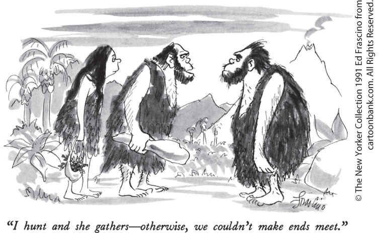

# Chapter 1 First Principles

## Common ground

**THERE WAS A TIME** when most of the world’s college students were located in wealthy Western nations. Today, however, the number of college students in developing countries like China and India is rapidly overtaking the number in the United States and Western Europe. In fact, China already has more students enrolled in college than the United States does.

And what are these students studying? A variety of subjects, of course. But regardless of the region of the world, a lot of students will be studying economics.

You might wonder, however, whether the economics being taught at, say, Shanghai University or the University of Mumbai bears much resemblance to the economics being taught in U.S. colleges. After all, there are big differences between nations in levels of income, political institutions, and the problems they face. Doesn’t this mean that the economics in these countries is different, too?

The answer is, yes and no. “Yes,” because different circumstances and history affect what both students and practitioners need to know. That’s why there are international editions of this textbook. Canada, for example, is different enough from the United States to warrant its own edition with explanations about Canadian economic issues and institutions.

The answer is also “no” because much of the material covered in basic economics is the same wherever you are around the world. The reason for this is that all economics is based on a set of common principles that apply to many different issues, regardless of the particular setting.

<figure id="pau_9781319320164_bDL0vCyonY" class="figure lm_img_lightbox unnum c2 right">

<figcaption>
<strong>Regardless of where in the world you study, the basic principles of economics are the same.</strong>
</figcaption>
</figure>

Some of these principles involve *individual choice* — for economics is, first of all, about the choices that individuals make. Do you save your money and take the bus or do you buy a car? Do you keep your old phone or upgrade to a new one? These decisions involve *making a choice* from among a limited number of alternatives — limited because no one can have everything that he or she wants. Every question in economics at its most basic level involves individuals making choices.

But to understand how an economy works, you need to understand more than how individuals make choices. None of us are like Robinson Crusoe, living alone on an island. Every person must make decisions in an environment that is shaped by the decisions of others. So in this chapter we will learn about four principles of economics that guide the choices made by individuals.

Indeed, in a modern economy even the simplest decisions you make — say, what to have for breakfast — are shaped by the decisions of thousands of other people, from the banana grower in Costa Rica who decided to grow the fruit you eat to the farmer in Iowa who provided the corn in your cornflakes.

Because each of us in a market economy depends on so many others — and they, in turn, depend on us — our choices interact. So although all economics at a basic level is about individual choice, in order to understand how market economies behave we must also understand *economic interaction* — how my choices affect your choices, and vice versa. To that end, in this chapter you will study the four principles that govern how individual choices interact in the economy.

Although many important economic interactions can be understood by looking at the markets for individual goods (like the market for corn), when we consider the economy as a whole, we see that it is composed of an enormous number of markets for individual goods, and these many markets interact. As a result, the larger economy experiences ups and downs. In order to understand economy-wide interactions, in this chapter we will study the three principles that underlie their behavior.

These 11 principles are the basis of all economic analysis. They form the common ground of economics. And they apply just as much in Shanghai or Mumbai as they do in Omaha or Atlanta. 

<aside class="learning-objectives c3 main-flow v3" epub:type="learning-objectives" id="pau_9781319320164_tZbjEkvWRM">

### What you will learn

- What four principles guide the choices made by individuals?
- What four principles govern how individual choices interact?
- What three principles illustrate economy-wide interactions?

</aside>

## Principles That Underlie Individual Choice: The Core of Economics

Every economic issue involves, at its most basic level, <a href="#kru_9781319245269_EM_glossary.xhtml#pau_9781319320164_UHlj3jNeNQ" id="kru_9781319245269_ch01_02.xhtml#pau_9781319320164_KVLQcjfaWp" class="glossref" role="doc-glossref">individual choice</a> — decisions by an individual about what to do and what not to do. In fact, you might say that it isn’t economics if it isn’t about choice.

<aside aria-label="title1" class="glossary c3 main-flow v1" epub:type="glossary" id="pau_9781319320164_l3yLrpkFf0">

**individual choice**  
**Individual choice** is the decision by an individual of what to do, which necessarily involves a decision of what not to do.

</aside>

Take Walmart or Amazon. There are thousands of different products available, and it is extremely unlikely that you — or anyone else — could afford to buy everything you might want to have. And anyway, there’s only so much space in your dorm room or apartment. So will you buy another bookcase or a mini-refrigerator? Given limitations on your budget and your living space, you must choose which products to buy and which to leave on the shelf.

The fact that those products are on the shelf in the first place involves choice — the store manager chose to put them there, and the manufacturers of the products chose to produce them. All economic activities involve individual choice.

Four economic principles underlie the economics of individual choice, as shown in <a href="#kru_9781319245269_ch01_02.xhtml#pau_9781319320164_eS21JQ6SbE" id="kru_9781319245269_ch01_02.xhtml#pau_9781319320164_aRxAssFscv" class="crossref">Table 1-1</a>. We’ll now examine each of these principles.

|                                                                                                                                                                              |
|------------------------------------------------------------------------------------------------------------------------------------------------------------------------------|
| 1\. People must make choices because resources are scarce.                                                                                                                   |
| 2\. The opportunity cost of an item — what you must give up in order to get it — is its true cost.                                                                           |
| 3\. “How much” decisions require making trade-offs at the margin: comparing the costs and benefits of doing a little bit more of an activity versus doing a little bit less. |
| 4\. People respond to incentives, exploiting opportunities to make themselves better off.                                                                                    |

TABLE 1-1 Principles of Individual Choice

### Principle \#1: Choices Are Necessary Because Resources Are Scarce

You can’t always get what you want. Many of us would like to have a big beautiful house or apartment in a great location, a new car or two, and vacations in exotic locations each year. But even in a rich country like the United States, not many families can afford all that. So they must make choices — like whether to go to Disney World this year or buy a better car, or whether to move to the city where housing is expensive, or accept a longer commute in order to live where housing prices are cheaper.

<figure id="pau_9781319320164_6OmPpoPKde" class="figure lm_img_lightbox unnum c2 right">

<figcaption>
Resources are scarce.
</figcaption>
</figure>

Limited income isn’t the only thing that keeps us from having everything we want. Time is also in limited supply: there are only 24 hours in a day. Choosing to spend time on one activity means choosing not to spend time on something else — studying for an exam means forgoing a night spent watching a movie. Indeed, many people faced with the limited number of hours in the day are willing to trade money for time. For example, local convenience stores typically charge higher prices than a regular supermarket. But they fulfill a valuable role by catering to time-pressed customers who would rather pay more than travel farther to the supermarket.

This leads us to our first principle of individual choice:

***People must make choices because resources are scarce.***

A <a href="#kru_9781319245269_EM_glossary.xhtml#pau_9781319320164_lhhxMWwhag" id="kru_9781319245269_ch01_02.xhtml#pau_9781319320164_Zm01ZLhI2U" class="glossref" role="doc-glossref">resource</a> is anything that can be used to produce something else. Lists of the economy’s resources usually begin with land, labor (the time of workers), capital (machinery, buildings, and other man-made productive assets), and human capital (the educational achievements and skills of workers). A resource is <a href="#kru_9781319245269_EM_glossary.xhtml#pau_9781319320164_2C5t1CXm7P" id="kru_9781319245269_ch01_02.xhtml#pau_9781319320164_LMG7wGQju7" class="glossref" role="doc-glossref">scarce</a> when there’s not enough of the resource available to satisfy all the ways a society wants to use it.

<aside aria-label="title2" class="glossary c3 main-flow v1" epub:type="glossary" id="pau_9781319320164_XPBjgAMpyS">

**resource**  
A **resource** is anything that can be used to produce something else.

</aside>
<aside aria-label="title3" class="glossary c3 main-flow v1" epub:type="glossary" id="pau_9781319320164_a1tfJFmuNX">

**scarce**  
Resources are **scarce** — not enough of the resources are available to satisfy all the various ways a society wants to use them.

</aside>

There are many scarce resources. These include natural resources that come from the physical environment, such as minerals, lumber, and petroleum. There is also a limited quantity of human resources, such as labor, skill, and intelligence. And in a growing world economy with a rapidly increasing human population, even clean air and water have become scarce resources.

Just as individuals must make choices, the scarcity of resources means that society as a whole must make choices. One way a society with a market economy makes choices is by allowing them to emerge from many individual choices. For example, Americans as a group have only so many hours in a week. How many of those hours will be spent traveling to supermarkets to get lower prices, rather than saving time by shopping at local convenience stores? The answer is the sum of individual decisions: each of the millions of individuals in the economy makes a choice about where to shop, and the overall choice is simply the sum of those individual decisions.

### Principle \#2: The True Cost of Something Is Its Opportunity Cost

It is the last term before you graduate, and your class schedule allows you to take only one elective. There are two, however, that you really want to take: Data Visualization Basics and Introduction to Chinese.

Suppose you decide to take the Intro to Chinese course. What’s the cost of that decision? It is, primarily, the fact that you can’t take the Data Visualization class, your next best alternative choice. Economists call that kind of cost — what you must give up in order to get an item you want — the <a href="#kru_9781319245269_EM_glossary.xhtml#pau_9781319320164_qBUrgAxQMq" id="kru_9781319245269_ch01_02.xhtml#pau_9781319320164_k5EpmsawvF" class="glossref" role="doc-glossref">opportunity cost</a> of that item. This leads us to our second principle of individual choice:

<aside aria-label="title4" class="glossary c3 main-flow v1" epub:type="glossary" id="pau_9781319320164_5dAc1h67rE">

**opportunity cost**  
The real cost of an item is its **opportunity cost:** what you must give up in order to get it.

</aside>

***The opportunity cost of an item — what you must give up in order to get it — is its true cost.***

So the opportunity cost of taking the Intro to Chinese class includes the benefit you would have derived from the Data Visualization class.

The concept of opportunity cost is crucial to understanding individual choice because, in the end, all costs are opportunity costs. That’s because every choice you make means forgoing some other alternative.

Sometimes critics claim that economists are concerned only with costs and benefits that can be measured in dollars and cents. But that is not true. Much economic analysis involves cases like our electives example, where it costs no extra tuition to take one elective course instead of another — that is, there is no direct monetary cost. Nonetheless, the elective you choose has an opportunity cost — the other desirable elective course that you must forgo because time limits permit you to take only one. More specifically, the opportunity cost of a choice is what you forgo by not choosing your next best alternative.

You might think that opportunity cost is an add-on — that is, something *additional* to the monetary cost of an item. But it isn’t. Suppose that an elective class costs an additional \$750. Now there is a monetary cost to taking Intro to Chinese. Is the opportunity cost of taking that course something separate from that monetary cost?

<figure id="pau_9781319320164_7LRcXHAQCS" class="figure lm_img_lightbox unnum c2 right">

<figcaption>
Mark Zuckerberg, founder of Facebook, understood the concept of opportunity cost.
</figcaption>
</figure>

Yes, it is. Consider that you will have to spend that \$750 no matter which class you take. So what you give up to take Intro to Chinese is still the Data Visualization class — you have to spend that \$750 either way. But what if the Data Visualization class is free? In that case, what you give up to take the Intro to Chinese class is the benefit from the data visualization class *plus* the benefit you could have gained from spending the \$750 on other things.

Either way, the real cost of taking your preferred class is what you must give up to get it. As you expand the set of decisions that underlie each choice — whether to take an elective or not, whether to finish this term or not, whether to drop out or not — you’ll realize that all costs are ultimately opportunity costs.

Sometimes the money you have to pay for something is a good indication of its opportunity cost. But many times it is not.

One very important example of how poorly monetary cost can indicate opportunity cost is the cost of attending college. Tuition and housing are major monetary expenses for most students; but even if they were free, attending college would still be an expensive proposition because most college students, if they were not in college, would have a job. By going to college, then, students *forgo* the income they could have earned if they had worked instead. This means that the opportunity cost of attending college is what you pay for tuition and housing plus the forgone income you would have earned in a job.

It’s easy to see that the opportunity cost of going to college is especially high for people who could be earning a lot during what would otherwise have been their college years. That is why star athletes and successful entrepreneurs often skip or drop out of college.

### Principle \#3: “How Much” Is a Decision at the Margin

Some of the decisions we make involve an “either–or” choice — for example, you decide either to go to college or to begin working; you decide either to take economics or something else. But other important decisions involve “how much” choices — for example, if you are taking both economics and chemistry this semester, you must decide how much time to spend studying for each. When it comes to understanding “how much” decisions, economics has an important insight to offer: “how much” is a decision made at the margin.

Suppose you are taking both economics and chemistry. And suppose you are a pre-med student, so your grade in chemistry matters more to you than your grade in economics. Should you spend *all* your study time on chemistry and wing it on the economics exam? Probably not; even if you think your chemistry grade is more important, you should put some effort into studying economics.

Spending more time studying chemistry involves a benefit (a higher expected grade in that course) and a cost (you could have spent that time doing something else, such as studying to get a higher grade in economics). That is, your decision involves a <a href="#kru_9781319245269_EM_glossary.xhtml#pau_9781319320164_NUKf0Sad6M" id="kru_9781319245269_ch01_02.xhtml#pau_9781319320164_R0FoNpwTky" class="glossref" role="doc-glossref">trade-off</a> — a comparison of costs and benefits.

<aside aria-label="title5" class="glossary c3 main-flow v1" epub:type="glossary" id="pau_9781319320164_TZPeXOtw8Y">

**trade-off**  
You make a **trade-off** when you compare the costs with the benefits of doing something.

</aside>

How do you decide this kind of “how much” question? The typical answer is that you make the decision a bit at a time, by asking how you should spend the next hour. If both exams are the next day, you will spend the night reviewing your notes for both courses. At 6:00 p.m., you decide that it’s a good idea to spend at least an hour on each course. At 8:00 p.m., you decide you need to spend another hour on each course. At 10:00 p.m., you are getting tired and figure you have one more hour to study before bed. Do you study chemistry or economics? If you are pre-med, it’s likely to be chemistry; if you are a business major, it’s likely to be economics.

Note how you’ve made the decision to allocate your time: at each point the question is whether or not to spend *one more hour* on either course. In deciding whether to spend that hour studying chemistry, you weigh the costs (an hour forgone of studying economics or an hour forgone of sleeping) versus the benefits (a likely increase in your chemistry grade). As long as the benefit of studying chemistry for one more hour outweighs the cost, you should choose to study for that additional hour.

Decisions of this type — whether to do a bit more or a bit less of an activity, like what to do with your next hour, your next dollar, and so on — are <a href="#kru_9781319245269_EM_glossary.xhtml#pau_9781319320164_3KpZkwfPNe" id="kru_9781319245269_ch01_02.xhtml#pau_9781319320164_VkPbjPjFv1" class="glossref" role="doc-glossref">marginal decisions</a>. This brings us to our third principle of individual choice:

<aside aria-label="title6" class="glossary c3 main-flow v1" epub:type="glossary" id="pau_9781319320164_aa9fLlYy4o">

**marginal decisions**  
Decisions about whether to do a bit more or a bit less of an activity are **marginal decisions.**

</aside>

***“How much” decisions require making trade-offs at the margin: comparing the costs and benefits of doing a little bit more of an activity versus doing a little bit less.***

The study of such decisions is known as <a href="#kru_9781319245269_EM_glossary.xhtml#pau_9781319320164_tVOLImyRrb" id="kru_9781319245269_ch01_02.xhtml#pau_9781319320164_uUtoKOLudW" class="glossref" role="doc-glossref">marginal analysis</a>. Many of the questions that we face in real life involve marginal analysis: How many minutes should I exercise? How many hours should I work? What is an acceptable rate of negative side effects from a new medicine? Marginal analysis plays a central role in economics because it is the key to deciding “how much” of an activity to do.

<aside aria-label="title7" class="glossary c3 main-flow v1" epub:type="glossary" id="pau_9781319320164_OPMaO0GX1q">

**marginal analysis**  
The study of such decisions is known as **marginal analysis.**

</aside>

### Principle \#4: People Respond to Incentives, Exploiting Opportunities to Make Themselves Better Off

<figure id="pau_9781319320164_WnxYYCJK7e" class="figure lm_img_lightbox unnum c2 right">

<figcaption>
An incentive that cuts waste: Shoppers switch to reusable shopping bags when charged a fee for disposable bags at checkout.
</figcaption>
</figure>

While listening to the news one day, the authors heard a great tip about cheap parking in Manhattan. At the time, garages in the Wall Street area charged as much as \$30 per day. But according to this news report, some people had found a better way: instead of parking in a garage, they had their oil changed at the Manhattan Jiffy Lube for \$19.95 — and they keep your car all day!

It’s a great story, but unfortunately it turned out not to be true — in fact, there is no Jiffy Lube in Manhattan. But if there were, you can be sure there would be a lot of oil changes there. Why? Because when people are offered opportunities to make themselves better off, they take them — and if they could find a way to park their car all day for \$19.95 rather than \$30, they would.

In this example economists say that people are responding to an <a href="#kru_9781319245269_EM_glossary.xhtml#pau_9781319320164_oFA8RUNySF" id="kru_9781319245269_ch01_02.xhtml#pau_9781319320164_s209hnX76c" class="glossref" role="doc-glossref">incentive</a> — an opportunity to make themselves better off, which leads to our fourth principle of individual choice:

<aside aria-label="title8" class="glossary c3 main-flow v1" epub:type="glossary" id="pau_9781319320164_Z0GMqLZkA0">

**incentive**  
An **incentive** is anything that offers rewards to people to change their behavior.

</aside>

***People respond to incentives, exploiting opportunities to make themselves better off.***

When you try to predict how individuals will behave in an economic situation, it is a very good bet that they will respond to incentives — that is, exploit opportunities to make themselves better off. Furthermore, individuals will *continue* to exploit these opportunities until they have been fully exhausted. If there really were a Manhattan Jiffy Lube and an oil change really were a cheap way to park your car, we can safely predict that before long the waiting list for oil changes would be weeks, if not months.

In fact, the principle that people will exploit opportunities to make themselves better off is the basis of *all* predictions by economists about individual behavior.

In fact, economists tend to be skeptical of any attempt to change behavior that *doesn’t* change incentives. For example, a plan aimed at reducing traffic in Manhattan that doesn’t offer Manhattan-bound drivers an incentive, like a financial reward, for not driving, or that isn’t accompanied by a penalty for driving, is unlikely to succeed. Likewise, a plan that calls on manufacturers to reduce pollution voluntarily probably won’t be effective. In contrast, a plan that gives them a financial reward to reduce pollution is a lot more likely to succeed because it has changed their incentives.

So are we ready to do economics? Not yet — because most of the interesting things that happen in the economy are the result not merely of individual choices but of the way in which individual choices interact.

### ECONOMICS \>\> *in Action*

The Cost of Marriage: China’s One-Child Policy Creates Millions of Lonely Bachelors

China is the most populous country on Earth, with over 1,420,000,000 people, as of 2019. That’s over *one billion four hundred twenty million* people. And trends in Chinese demographics have shifted the cost of marriage over time — specifically, the cost of finding a bride for Chinese bachelors.

In the 1970s, China was very poor and had an already large and growing population. Concerned that it would be unable to adequately provide care for so many people, the Chinese government introduced a one-child policy that restricted most couples to only one child and imposed penalties on those who defied the mandate. By 2016, the average number of children per Chinese woman had fallen to 1.6, from more than 5 before the policy was introduced in 1978.

But the one-child policy has led to an unfortunate unintended consequence on the balance between the sexes in the population. Until recently China was overwhelmingly rural. Because of the physical demands of farming, sons were strongly preferred over daughters. In addition, tradition dictated that sons, not daughters, took care of elderly parents. The effect of the one-child policy was to greatly increase the perceived cost to a Chinese family of a female child. As a result, while some female infants were given up for adoption abroad, many simply “disappeared” during the first year of life, victims of neglect and mistreatment as Chinese families were determined that their only child be a son. The Nobel-prize winning economist Amartya Sen calculated that there were milions of “missing women” in Asia due to the perceived higher cost of female children, with estimates running from 45 million to 100 million missing women.

<figure id="pau_9781319320164_vTCN9QJp8W" class="figure lm_img_lightbox unnum c2 right">

<figcaption>
The cost of finding a bride is quite high for millions of men in China.
</figcaption>
</figure>

The number of boys in China has outpaced the number of girls for 20 years. Today, there are nearly 34 million *excess* males in the population compared to females. That’s the equivalent of the entire population of California — men who will never find wives from among their fellow Chinese.

As of 2018, within the age group of 15- to 29-year-olds, there are 112 men for every 100 women, with projections that there will be as many as 190 young men per 100 young women by 2050. So, although the Chinese government officially ended the one-child policy in 2015, the consequences will endure for decades.

Not surprisingly, some Chinese bachelors are eager to meet eligible women from abroad — particularly from nearby countries such as Vietnam, Laos, and Cambodia that don’t have a problem with gender imbalance. And enterprising eligible women from those countries are coming to China to find husbands. Marriage brokers have sprung up in these countries to address the situation in China. For example, one Chinese bachelor, Liu Hua, found happiness with Lili, a Cambodian woman who came to China to find a husband. Before meeting Lili, Liu lived in a village with 60 bachelors and only 2 single women. He ended up paying deposits ranging from \$5,000 to \$40,000 to three families in nearby villages for the opportunity to date their daughters (not all of which was refunded when the matches didn’t work out). He eventually paid a \$15,000 broker’s fee to marry Lili. Happily married, they now have two children — a boy *and* a girl.

### *\>\> Quick Review*

- All economic activities involve **individual choice.**
- People must make choices because **resources** are **scarce.**
- The real cost of something is its **opportunity cost** — what you must give up to get it. All costs are opportunity costs. Monetary costs are sometimes a good indicator of opportunity costs, but not always.
- Many choices involve not *whether* to do something but *how much* of it to do. “How much” choices call for making a **trade-off** at the margin. The study of **marginal decisions** is known as **marginal analysis.**
- Because people exploit opportunities to make themselves better off, **incentives** can change people’s behavior.

### *\>\> Check Your Understanding* 1-1

1.  Explain how each of the following illustrates one of the four principles of individual choice.
    1.  You are on your third trip to a restaurant’s all-you-can-eat dessert buffet and are feeling very full. Although it would cost you no additional money, you forgo a slice of coconut cream pie but have a slice of chocolate cake.
    2.  Even if there were more resources in the world, there would still be scarcity.
    3.  Different teaching assistants teach several Economics 101 tutorials. Those taught by the teaching assistants with the best reputations fill up quickly, with spaces left unfilled in the ones taught by assistants with poor reputations.
    4.  To decide how many hours per week to exercise, you compare the health benefits of one more hour of exercise to the effect on your grades of one less hour spent studying.
2.  You make \$45,000 per year at your current job with Whiz Kids Consultants. You are considering a job offer from Brainiacs, Inc., that will pay you \$50,000 per year. Which of the following are elements of the opportunity cost of accepting the new job at Brainiacs, Inc.?
    1.  The increased time spent commuting to your new job
    2.  The \$45,000 salary from your old job
    3.  The more spacious office at your new job

## Interaction: How Economies Work

An economy is a system for coordinating the productive activities of many people. In a market economy like we live in, coordination takes place without any coordinator: each individual makes his or her own choices.

Yet those choices are by no means independent of one another: each individual’s opportunities, and hence choices, depend to a large extent on the choices made by other people. So to understand how a market economy behaves, we have to examine this <a href="#kru_9781319245269_EM_glossary.xhtml#pau_9781319320164_on8QQP5Nwu" id="kru_9781319245269_ch01_03.xhtml#pau_9781319320164_bkM5czRMnR" class="glossref" role="doc-glossref">interaction</a> in which my choices affect your choices, and vice versa.

<aside aria-label="title1" class="glossary c3 main-flow v1" epub:type="glossary" id="pau_9781319320164_evM9Z6rq14">

**interaction**  
**Interaction** of choices — my choices affect your choices, and vice versa — is a feature of most economic situations. The results of this interaction are often quite different from what the individuals intend.

</aside>

When studying economic interaction, we quickly learn that the end result of individual choices may be quite different from what any one individual intends. Consider the case of American farmers, who, over the past century have adopted new farming techniques and crop strains that have reduced their costs and increased their yields. The end result of each farmer trying to increase his or her own income has actually been to drive many farmers out of business. Because American farmers have been so successful at producing larger yields, agricultural prices have steadily fallen, reducing the incomes of many farmers, and as a result fewer people find farming worth doing. That is, an individual farmer who plants a better variety of corn is better off, but when many farmers plant a better variety of corn, the result may be to make farmers as a group worse off.

There are four principles underlying the economics of interaction. These principles are summarized in <a href="#kru_9781319245269_ch01_03.xhtml#pau_9781319320164_YW9GFbMigU" id="kru_9781319245269_ch01_03.xhtml#pau_9781319320164_KxAgG3AFal" class="crossref">Table 1-2</a> and we will now examine each one.

|                                                                                                                     |
|---------------------------------------------------------------------------------------------------------------------|
| 5\. There are gains from trade.                                                                                     |
| 6\. Markets move toward equilibrium.                                                                                |
| 7\. Resources should be used efficiently to achieve society’s goals.                                                |
| 8\. Markets usually lead to efficiency, but when they don’t, government intervention can improve society’s welfare. |

TABLE 1-2 Principles of Interaction of Individual Choices

### Principle \#5: There Are Gains from Trade

<figure id="pau_9781319320164_WxKuoQXgs6" class="figure lm_img_lightbox unnum c2 right">

</figure>

<aside class="hidden" id="pau_9781319320164_KKPJaAjApq">

Standing before the mountains, the caveman holding a club says to the other man, ‘I hunt and she gathers––otherwise, we couldn’t make ends meet.’ The woman stands next to the caveman with a club, holding a basket of plants.

</aside>

Why do the choices I make interact with the choices you make? A family could try to take care of all its own needs — growing its own food, sewing its own clothing, providing itself with entertainment. But trying to live that way would be very hard.

The key to a much better standard of living for everyone is <a href="#kru_9781319245269_EM_glossary.xhtml#pau_9781319320164_OxXvtZKnTl" id="kru_9781319245269_ch01_03.xhtml#pau_9781319320164_9hIuadGQEc" class="glossref" role="doc-glossref">trade</a>, in which people divide tasks among themselves and each person provides a good or service that other people want in return for different goods and services that he or she wants.

<aside aria-label="title2" class="glossary c3 main-flow v1" epub:type="glossary" id="pau_9781319320164_GdvrvufRiz">

**trade**  
In a market economy, individuals engage in **trade:** they provide goods and services to others and receive goods and services in return.

</aside>

The reason we have an economy, not many self-sufficient individuals, is that there are <a href="#kru_9781319245269_EM_glossary.xhtml#pau_9781319320164_COqFZeu0AL" id="kru_9781319245269_ch01_03.xhtml#pau_9781319320164_Xu7Ye83UEF" class="glossref" role="doc-glossref">gains from trade</a>: by dividing tasks and trading, two people (or 6 billion people) can each get more of what they want than they could get by being self-sufficient. This leads us to our fifth principle:

<aside aria-label="title3" class="glossary c3 main-flow v1" epub:type="glossary" id="pau_9781319320164_ITxvFSIlAk">

**gains from trade**  
There are **gains from trade:** people can get more of what they want through trade than they could if they tried to be self-sufficient.

</aside>

***There are gains from trade.***

Gains from trade arise from this division of tasks, which economists call <a href="#kru_9781319245269_EM_glossary.xhtml#pau_9781319320164_QHd8gLPlyX" id="kru_9781319245269_ch01_03.xhtml#pau_9781319320164_B1dLNYD0Bk" class="glossref" role="doc-glossref">specialization</a> — a situation in which different people each engage in a different task, specializing in those tasks that they are good at performing. The advantages of specialization, and the resulting gains from trade, were the starting point for Adam Smith’s 1776 book *The Wealth of Nations,* which many regard as the beginning of economics as a discipline.

<aside aria-label="title4" class="glossary c3 main-flow v1" epub:type="glossary" id="pau_9781319320164_N6kRby6s06">

**specialization**  
An increase in output is due to **specialization:** each person specializes in the task that they are good at performing.

</aside>

Smith’s book begins with a description of an eighteenth-century pin factory where, rather than each of the 10 workers making a pin from start to finish, each worker specialized in one of the many steps in pin-making:

> One man draws out the wire, another straights it, a third cuts it, a fourth points it, a fifth grinds it at the top for receiving the head; to make the head requires two or three distinct operations; to put it on, is a particular business, to whiten the pins is another; it is even a trade by itself to put them into the paper; and the important business of making a pin is, in this manner, divided into about eighteen distinct operations. . . . Those ten persons, therefore, could make among them upwards of forty-eight thousand pins in a day. But if they had all wrought separately and independently, and without any of them having been educated to this particular business, they certainly could not each of them have made twenty, perhaps not one pin a day. . . .

The same principle applies when we look at how people divide tasks among themselves and trade in an economy. *The economy, as a whole, can produce more when each person specializes in a task and trades with others.*

The benefits of specialization are the reason a person typically chooses only one career. It takes many years of study and experience to become a physician or a commercial pilot. Many physicians might well have had the potential to become excellent pilots, and vice versa. But it is very unlikely that anyone who decided to pursue both careers would be as good at both as someone who decided at the beginning to specialize in a single field. So it is to everyone’s advantage that individuals specialize in their careers.

Markets allow a physician and a pilot to specialize in their own fields. Because markets for commercial flights and for medical care exist, a physician is assured that she can find a flight and a pilot is assured that he can find a physician. As long as individuals know that they can find the goods and services they want in the market, they are willing to forgo self-sufficiency and to specialize. But what assures people that markets will deliver what they want? The answer to that question leads us to our next principle of how individual choices interact.
