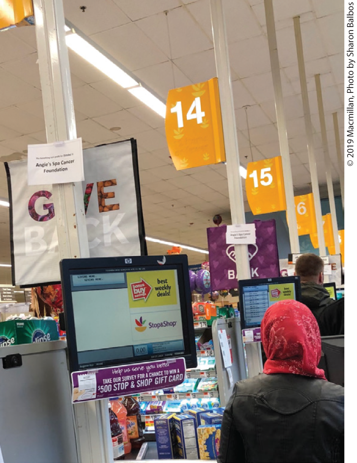
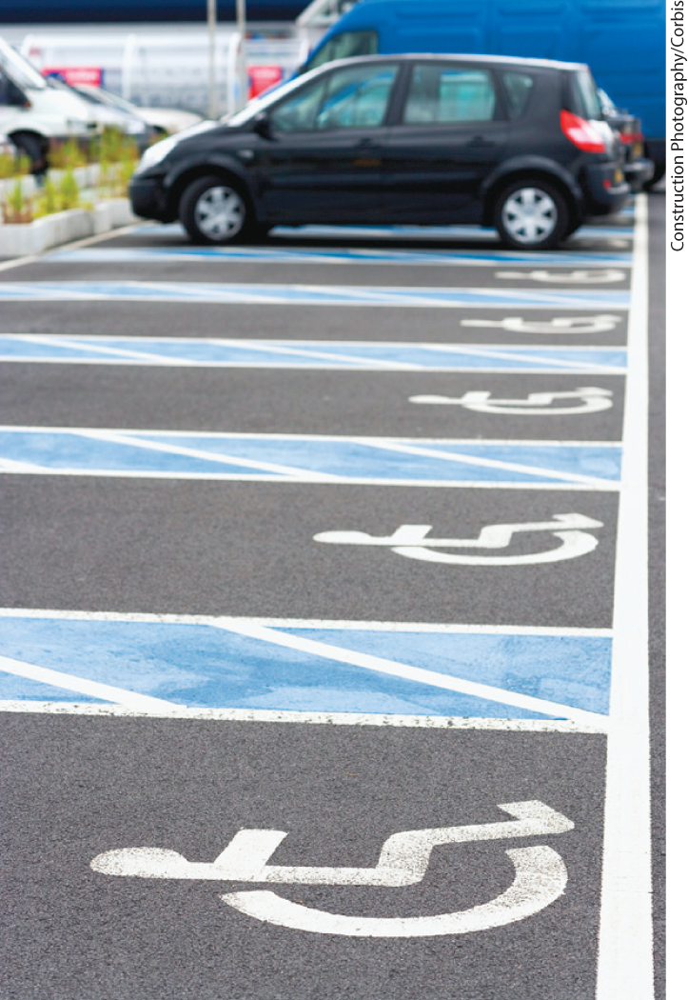
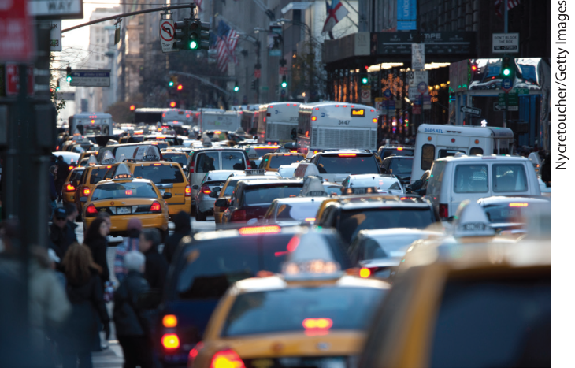
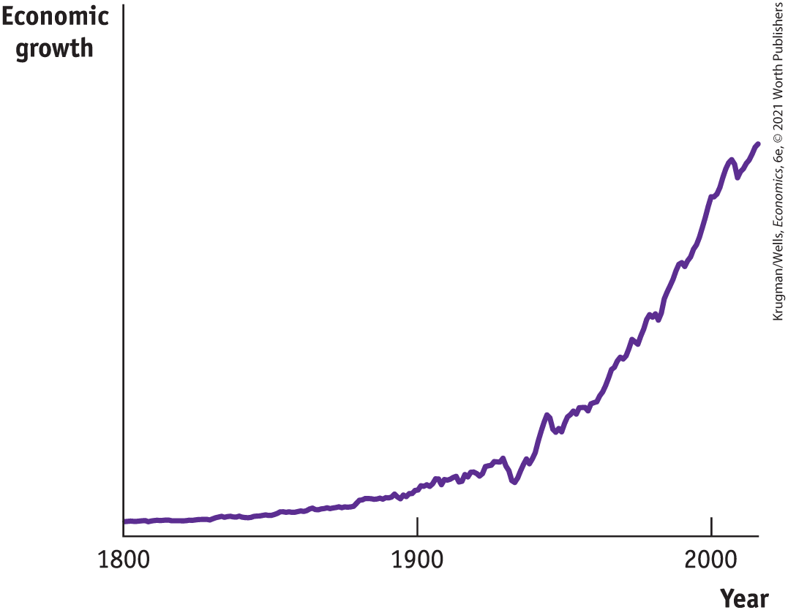
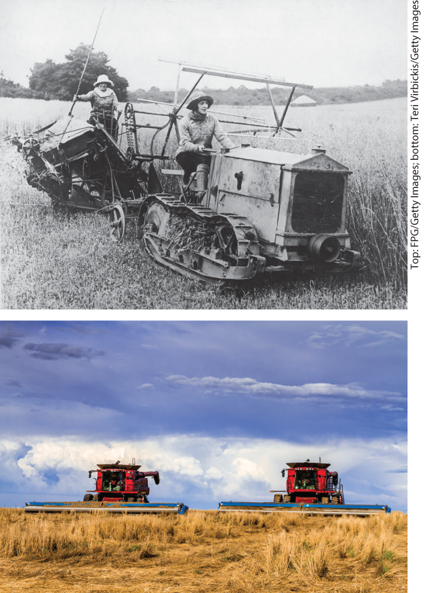

### Principle \#6: Markets Move Toward Equilibrium

It’s a busy afternoon at the supermarket; there are long lines at the checkout counters. Then one of the previously closed cash registers opens. What happens right away, of course, is a rush to that register. After a couple of minutes, however, things will have settled down. Shoppers will have rearranged themselves so that the line at the newly opened register is about the same length as the lines at all the other registers.

<figure id="pau_9781319320164_j14lMtmTvy" class="figure lm_img_lightbox unnum c2 right">

<figcaption>
Witness equilibrium in action on the checkout line.
</figcaption>
</figure>

How do we know this? We know from our fourth principle that people will exploit opportunities to make themselves better off. People will rush to the newly opened register to save time standing in line. The rushing around will stop when shoppers can no longer improve their position by switching lines — that is, when the opportunities to make themselves better off have all been exploited.

A story about supermarket checkout lines may seem to have little to do with how individual choices interact, but in fact it illustrates an important principle. A situation in which individuals cannot make themselves better off by doing something different — the situation in which all the checkout lines are the same length — is what economists call an <a href="#kru_9781319245269_EM_glossary.xhtml#pau_9781319320164_kH5xF0fn5w" id="kru_9781319245269_ch01_03.xhtml#pau_9781319320164_9R9vK1i43X" class="glossref" role="doc-glossref">equilibrium</a>. An economic situation is in equilibrium when no individual would be better off doing something different.

<aside aria-label="title5" class="glossary c3 main-flow v1" epub:type="glossary" id="pau_9781319320164_Xqne78g5xe">

**equilibrium**  
An economic situation is in **equilibrium** when no individual would be better off doing something different.

</aside>

Recall the story about the mythical Jiffy Lube, where it was supposedly cheaper to leave your car for an oil change than to pay for parking. If the opportunity had really existed and people were still paying \$30 to park in garages, the situation would *not* have been an equilibrium. And that should have been a giveaway that the story couldn’t be true. In reality, people would have seized an opportunity to park cheaply, just as they seize opportunities to save time at the checkout line. And in so doing they would have eliminated the opportunity! Either it would have become very hard to get an appointment for an oil change or the price of a lube job would have increased to the point that it was no longer an attractive option (unless you really needed an oil change). This brings us to our sixth principle:

***Because people respond to incentives, markets move toward equilibrium.***

As we will see, markets usually reach equilibrium through changes in prices, which rise or fall until no opportunities for individuals to make themselves better off remain.

The concept of equilibrium is extremely helpful in understanding economic interactions because it provides a way to cut through the sometimes complex details of those interactions. To understand what happens when a new line opens at a supermarket, you don’t need to worry about exactly how shoppers rearrange themselves, which register just opened, and so on. What you need to know is that any time there is a change, the situation will move to an equilibrium.

The fact that markets move toward equilibrium is why we can depend on them to work in a predictable way. In fact, we can trust markets to supply us with the essentials of life. For example, people who live in cities can be sure that the supermarket shelves will always be fully stocked. Why? Because if some merchants who distribute food *didn’t* make deliveries, a big profit opportunity would be created for any merchant who did — and there would be a rush to supply food, just like the rush to a newly opened cash register.

So the market ensures that food will always be available for city dwellers. And, returning to our fifth principle, this allows city dwellers to be city dwellers — to specialize in doing city jobs rather than living on farms and growing their own food.

A market economy, as we have seen, allows people to achieve gains from trade. But how do we know how well such an economy is doing? The next principle gives us a standard to use in evaluating an economy’s performance.

### Principle \#7: Resources Should Be Used Efficiently to Achieve Society’s Goals

You are attending a lecture in a classroom that is too small for the number of students — many of your fellow classmates are standing or sitting on the floor — despite the fact that large, empty classrooms are available nearby. You would be correct to say that this is no way to run a college. Economists would call this an *inefficient* use of resources. But if an inefficient use of resources is undesirable, just what does it mean to use resources *efficiently?*

You might imagine that the efficient use of resources has something to do with money, maybe that it is measured in dollars-and-cents terms. But in economics, as in life, money is only a means to other ends. The measure that economists really care about is not money but people’s happiness or welfare. Economists say that *an economy’s resources are used efficiently when they are used in a way that has fully exploited all opportunities to make everyone better off*. Put another way: an economy is <a href="#kru_9781319245269_EM_glossary.xhtml#pau_9781319320164_jqQ9D4sdT9" id="kru_9781319245269_ch01_03.xhtml#pau_9781319320164_hG8bXnX78j" class="glossref" role="doc-glossref">efficient</a> if it takes all opportunities to make some people better off without making other people worse off.

<aside aria-label="title6" class="glossary c3 main-flow v1" epub:type="glossary" id="pau_9781319320164_8IGnliVPPt">

**efficient**  
An economy is **efficient** if it takes all opportunities to make some people better off without making other people worse off.

</aside>

<figure id="pau_9781319320164_b4dedJyp2X" class="figure lm_img_lightbox unnum c2 right">

<figcaption>
Sometimes equity trumps efficiency.
</figcaption>
</figure>

In our classroom example, there clearly was a way to make everyone better off — move the lecture to a larger room. Students attending the lecture would be made better off without hurting anyone else at the college. This result would be an efficient use of the college’s resources. Assigning the course to the smaller classroom was an inefficient use of those resources.

When an economy is efficient, it is producing the maximum gains from trade possible given the resources available. Why? Because there is no way to rearrange how resources are used so that everyone can be made better off. When an economy is efficient, one person can be made better off by rearranging how resources are used *only* by making someone else worse off.

In our example, if all larger classrooms were already occupied, the college would actually have been run efficiently: to make your class better off by moving it to a larger classroom would displace other students already in a larger room. Those students would be made worse off by a move.

We can now state our seventh principle:

***Resources should be used as efficiently as possible to achieve society’s goals.***

Should policy makers always strive to achieve economic efficiency? Well, not quite, because efficiency is only a means to achieving society’s goals. Sometimes efficiency may conflict with a goal that society has deemed worthwhile to achieve. For example, in most societies, people also care about issues of fairness, or <a href="#kru_9781319245269_EM_glossary.xhtml#pau_9781319320164_MFesEpAqJj" id="kru_9781319245269_ch01_03.xhtml#pau_9781319320164_2scPpMoSnh" class="glossref" role="doc-glossref">equity</a>. And there is typically a trade-off between equity and efficiency: policies that promote equity often come at a cost of decreased efficiency in the economy, and vice versa.

<aside aria-label="title7" class="glossary c3 main-flow v1" epub:type="glossary" id="pau_9781319320164_uUweMJr9Y9">

**equity**  
**Equity** means that everyone gets his or her fair share. Since people can disagree about what’s “fair,” equity isn’t as well defined a concept as efficiency.

</aside>

To see this, consider the case of disabled-designated parking spaces in public parking lots. Many people have difficulty walking due to age or disability, so it seems only fair to assign closer parking spaces specifically for their use. You may have noticed, however, that a certain amount of inefficiency is involved. To ensure that a parking space is always available should a disabled person want one, there are typically more such spaces available than there are disabled people who want one. As a result, desirable parking spaces are unused. (And the temptation for nondisabled people to use them is so great that drivers must be dissuaded by fear of getting a ticket.)

So, short of hiring parking valets to allocate spaces, there is a conflict between *equity,* making life “fairer” for disabled people, and *efficiency,* making sure that all opportunities to make people better off have been fully exploited by never letting close-in parking spaces go unused.

Exactly how far policy makers should go in promoting equity over efficiency is a difficult question that goes to the heart of the political process. As such, it is not a question that economists can answer. What is important for economists, however, is always to seek to use the economy’s resources as efficiently as possible in the pursuit of society’s goals, whatever those goals may be.

### Principle \#8: Markets Usually Lead to Efficiency, But When They Don’t, Government Intervention Can Improve Society’s Welfare

There is no branch of the U.S. government entrusted with ensuring the general economic efficiency of our market economy — we don’t have agents tasked with checking that brain surgeons aren’t plowing fields or that Minnesota farmers aren’t trying to grow oranges. The government doesn’t need to enforce the efficient use of resources, because in most cases the invisible hand does the job. As explained in the Introduction, the *invisible hand* refers to how a market economy harnesses the power of self-interest for the good of society.

The incentives built into a market economy ensure that resources are usually put to good use and that opportunities to make people better off are not wasted. If a college were known for its habit of crowding students into small classrooms while large classrooms went unused, its enrollment would soon drop, putting the jobs of its administrators at risk. The “market” for college students would respond in a way that induces administrators to run the college efficiently.

A detailed explanation of why markets are usually very good at making sure that resources are used efficiently will have to wait until we have studied how markets actually work. But the most basic reason is that in a market economy, in which individuals are free to choose what to consume and what to produce, people normally take opportunities for mutual gain — that is, gains from trade.

If people encounter an opportunity to make themselves better off, they will take advantage of it. And that is exactly what defines efficiency: all the opportunities to make some people better off without making other people worse off have been exploited. We have now arrived at the first half of our eighth principle:

***Because people exploit gains from trade, markets usually lead to efficiency.***

However, there are exceptions to this principle that markets are generally efficient. In cases of *market failure,* the individual pursuit of self-interest found in markets makes society worse off — that is, the market outcome is inefficient.

Consider the nature of the market failure caused by traffic congestion — commuters driving to work have no incentive to take into account the cost that their actions inflict on other drivers in the form of increased traffic congestion.

Possible remedies to this situation include charging tolls, subsidizing the cost of public transportation, and taxing gasoline sales to individual drivers. These remedies would change the incentives of would-be drivers, motivating them to drive less. But they also share another feature: each relies on government intervention in the market, which leads to the second half of this principle:

***When markets don’t achieve efficiency, government can intervene to improve society’s welfare.***

An appropriately designed government policy can sometimes move society closer to an efficient outcome by changing how society’s resources are used. And, as we will see next, short of instances of market failure, the general rule is that markets are a remarkably good way of organizing an economy.

### ECONOMICS \>\> *in Action*

Wait, Then Hurry Up, and Wait Again

In a densely populated city like New York, very few people own cars. New Yorkers have typically relied on subways and buses, local taxis, or walking to get where they needed to go. Yet each of these forms of transportation has drawbacks: the subway is often plagued with delays, buses can be slow, taxis are expensive and hard to find during peak travel times, and walking long distances takes time and isn’t optimal in bad weather.

Unsurprisingly, the market for transportation changed dramatically with the arrival of ride-hailing services like Uber and Lyft, which have become wildly popular in cities like New York. Hopping into an Uber has been seen as a way to get where you need to go more quickly. In 2018 there were more than 65,000 Uber-affiliated vehicles in New York City, providing an average of 400,000 rides per day. Correspondingly, the number of New Yorkers taking public transportation has declined.

Yet the popularity of ride-hailing services has created one significant drawback. With so many more vehicles on the street, traffic congestion has increased dramatically. A study released in 2018 found that in nine large densely populated metropolitan areas (Boston, Chicago, Los Angeles, Miami, New York, Philadelphia, San Francisco, Seattle, and Washington, DC), there was an overall increase of 160% in driving on city streets. New York City transportation officials describe the city as “crippled” by traffic congestion, and they point to a 40% reduction in travel speeds in Manhattan.

<figure id="pau_9781319320164_uiTMWlqKY9" class="figure lm_img_lightbox unnum c2 right">

<figcaption>
The fundamental law of traffic congestion is an example of equilibrium in action.
</figcaption>
</figure>

It’s an outcome that traffic planners find predictable. Thanks to the new ride-hailing apps that induce more driving and have led to an influx of new cars on city streets, commuters looking for a quick trip in a cab are finding their travel time has increased, making the bus, subway, or walking appealing travel options once again. With commuting times more or less back where they started before ride-hailing services appeared, a new equilibrium has been reached in which travel times across all modes of available transport are unchanged. This predictable outcome resembles what traffic planners call the *fundamental law of traffic congestion:* if a city builds more roads, this induces more driving, and this increase in traffic continues until a new equilibrium is reached, with commuting times more or less back where they started. Whether it’s a new ride-hailing app or newly built roads that induces more driving, the ultimate result is that a new equilibrium is reached in which travel times across all modes of transportation are unchanged.

For those who hoped that ride-hailing services would make commuting faster and easier, this result is discouraging. It is, however, a good illustration of the importance of thinking about equilibrium.

### *\>\> Quick Review*

- Most economic situations involve the **interaction** of choices, sometimes with unintended results. In a market economy, interaction occurs via **trade** between individuals.
- Individuals trade because there are **gains from trade**, which arise from **specialization.** Markets usually move toward **equilibrium** because people exploit gains from trade.
- To achieve society’s goals, the use of resources should be **efficient.** But **equity**, as well as efficiency, may be desirable in an economy. There is often a trade-off between equity and efficiency.
- Except for certain well-defined exceptions, markets are normally efficient. When markets fail to achieve efficiency, government intervention can improve society’s welfare.

### *\>\> Check Your Understanding* 1-2

1.  Explain how each of the following illustrates one of the four principles of interaction.
    1.  At a college tutoring co-op, students can arrange to provide tutoring in subjects they are good in (like economics) in return for receiving tutoring in subjects they struggle with (like philosophy).
    2.  The local municipality imposes a law that requires bars and nightclubs near residential areas to keep their noise levels below a certain threshold.
    3.  To provide better care for low-income patients, the local municipality has decided to close some underutilized neighborhood clinics and shift funds to the main hospital.
    4.  On Amazon, books of a given title with approximately the same level of wear and tear sell for about the same price.
2.  Which of the following describes an equilibrium situation? Which does not? Explain your answer.
    1.  The restaurants across the street from the university dining hall serve better-tasting and cheaper meals than those served at the university dining hall. The vast majority of students continue to eat at the dining hall.
    2.  You currently take the subway to work. Although taking the bus is cheaper, the ride takes longer. So you are willing to pay the higher subway fare in order to save time.

## Economy-Wide Interactions

The economy as a whole — the macroeconomy — has its ups and downs. For example, in 2007 the U.S. economy entered a severe recession in which millions of people lost their jobs, while those who remained employed saw their wages stagnate. It took seven years — until May 2014 — for the number of Americans employed to return to its pre-recession level, but wages didn’t recover until 2016.

Over time, the behavior of the macroeconomy is a lot like a drive through a mountain range. The trip isn’t one continuous upward climb to a destination at high altitude. Instead, you will drive over hills and valleys, with short-term ups and downs during your journey, as you slowly, but inevitably, ascend to your destination.

In the short run, the overall economy experiences ups and downs: good economic times (recoveries) alternate with bad economic times (recessions), with a cycle lasting an average of seven to 10 years. However, over the long run, a period of at least 10 years, the economy grows larger and larger. A graph of the total amount of goods and services the economy produces over time would show a line that looks a lot like our car ride: lots of squiggles up and down, but, over time, the line reaches upward.

To understand why the macroeconomy cycles between recessions and recoveries, but also achieves economic growth over time, we need to look at economy-wide interactions. And understanding the big picture of the economy requires three more economic principles, which are summarized in <a href="#kru_9781319245269_ch01_04.xhtml#pau_9781319320164_tDSDsVfgh5" id="kru_9781319245269_ch01_04.xhtml#pau_9781319320164_WtLFG5lbEs" class="crossref">Table 1-3</a>.

|                                                                                                                                               |
|-----------------------------------------------------------------------------------------------------------------------------------------------|
| 9\. One person’s spending is another person’s income.                                                                                         |
| 10\. Overall spending sometimes gets out of line with the economy’s productive capacity; when it does, government policy can change spending. |
| 11\. Increases in the economy’s potential lead to economic growth over time.                                                                  |

TABLE 1-3 Principles of Economy-Wide Interactions

### Principle \#9: One Person’s Spending Is Another Person’s Income

Between 2005 and 2011, including a deep recession, U.S. home construction plunged more than 60% because builders found it increasingly hard to make sales. At first the damage was limited to the construction industry. But over time the slump spread throughout the economy, with consumer spending falling across the board.

But why should a fall in home construction mean empty stores in the shopping malls? After all, malls are where families, not builders, do their shopping.

The answer is that lower spending on construction led to lower incomes throughout the economy. People who had been employed either directly in construction, producing goods and services builders need (like roofing shingles), or in producing goods and services new homeowners need (like new furniture), either lost their jobs or were forced to take pay cuts. And as incomes fell, so did spending by consumers. This example illustrates our ninth principle:

***One person’s spending is another person’s income.***

In a market economy, people make a living selling things — including their labor — to other people. If some group in the economy decides, for whatever reason, to spend more, the incomes of other groups will rise. If some group decides to spend less, the incomes of other groups will fall.

And a chain reaction of changes in spending behavior tends to have repercussions that spread economy-wide. For example, a fall in consumer spending at shopping malls leads to reduced family incomes; families respond by reducing their own spending, which leads to another round of income cuts; and so on. These repercussions play an important role in our understanding of recessions and recoveries.

### Principle \#10: Overall Spending Sometimes Gets Out of Line with the Economy’s Productive Capacity; When It Does, Government Policy Can Change Spending

The coronavirus pandemic of 2020 harkened back to a period in the 1930s, known as the Great Depression. Then, as now, a collapse in spending by consumers and businesses led to a plunge in overall spending. In both periods, the plunge in spending led to very high unemployment.

What economists learned from the Great Depression is that overall spending — the amount of goods and services that consumers and businesses want to buy — sometimes doesn’t match the amount of goods and services the economy is capable of producing. In the 1930s as in 2020, spending fell far short of what was needed to keep American workers employed, and the result was a severe economic slump.

It’s also possible for overall spending to be too high. In that case, the economy experiences *inflation,* a rise in prices throughout the economy. This rise in prices occurs when the amount that people want to buy outstrips the supply, leading producers to raise their prices and still find willing buyers.

When the economy experiences either shortfalls in spending or excesses in spending, government policies can be used to address the imbalances, which leads to our tenth principle:

***Overall spending sometimes gets out of line with the economy’s productive capacity; when it does, government policy can change spending.***

The U.S. government spends a lot, on everything from military equipment to health care. Moreover, it can choose to spend more or less, depending upon the state of the economy. Likewise, the government can vary how much it collects in taxes, which in turn affects how much income consumers and businesses have to spend. And the government’s control of the quantity of money in circulation gives it another powerful tool with which to affect total spending. Government spending, taxes, and control of money are the tools of *macroeconomic policy.*

Modern governments deploy macroeconomic policy tools in an effort to balance overall spending in the economy, trying to steer it between the perils of recession and inflation. These efforts aren’t always successful — recessions still happen, as do periods of inflation. But it’s widely believed that aggressive efforts to sustain spending in 2008 and 2009 helped prevent the financial crisis of 2008 from turning into a full-blown depression. And in 2020, Congress passed a \$4 trillion relief package for American workers and businesses to cushion the blow from the coronavirus pandemic.

### Principle \#11: Increases in the Economy’s Potential Lead to Economic Growth Over Time

Today’s economy is different from the economy of 20 years ago, and drastically different from the economy of a century ago. These changes are due to *economic growth,* the increase in living standards over time. Economic growth has made the United States and other countries far richer over time. Like a car climbing up a mountain range, despite the valleys and hills along the way, the overall path of the economy has been upward in the long run, as <a href="#kru_9781319245269_ch01_04.xhtml#pau_9781319320164_YOXdX4weDJ" id="kru_9781319245269_ch01_04.xhtml#pau_9781319320164_mQ3skR5XQ3" class="crossref">Figure 1-1</a> illustrates.

<figure id="pau_9781319320164_YOXdX4weDJ" class="figure lm_img_lightbox num c3 main-flow">

<figcaption>
FIGURE 1-1 Growth in the U.S. Economy Over Time

The overall path of the U.S. economy for the last 200 years, from 1800 to 2000, has been upward, with the inevitable short-term ups and downs along the way.

<em>Data from:</em> Maddison Project Database, version 2018. Jutta Bolt, Robert Inklaar, Herman de Jong, and Jan Luiten van Zanden (2018).
</figcaption>
</figure>

<aside class="hidden" id="pau_9781319320164_Zz7leK6pQ8">

The curve for economic growth plateaus between 1800 and 1900 and steadily increases between 1900 and 2000 with intermittent, short peaks and troughs.

</aside>

What accounts for this growth? It is due to the emergence of new technologies and increases in the resources available for production — resources like land, labor, and machinery. As a result, the economy’s *potential,* the total amount of goods and services it can produce, rises and leads to higher living standards. For example, in 1820, 80% of American workers were engaged in farming; now, that figure is 2%. Yet there is a far greater quantity and variety of food available now than 200 years ago. The increased mechanization and technological sophistication of agriculture — humongous tractors and satellite imaging — are changes to the resources available for production. As a result, the economy’s potential has risen: American farmers can now produce vastly more than before and American consumers can now consume vastly more than before.

<figure id="pau_9781319320164_9TCxXXlKnD" class="figure lm_img_lightbox unnum c2 right">

<figcaption>
With advances in technology and greater resources, American farmers today produce far more than they did 100 years ago.
</figcaption>
</figure>

<aside class="hidden" id="pau_9781319320164_ulg0A5uJWp">

The first photo shows two women helming an earlier model of the farm tractor. The second photo captures two heavy modern-day farm machines combing through a field.

</aside>

We have now arrived at our eleventh and final principle:

***Increases in the economy’s potential lead to economic growth over time.***

While economic growth has benefitted a vast number of people, the increase in living standards are usually unequally distributed among a country’s residents in the short term. In fact, at any given time, an increase in the economy’s potential typically creates *winners and losers.*

For example, over the past 20 years, technological advancements have revolutionized the way we produce energy in the United States. New drilling techniques have made natural gas abundant, and alternative energy sources such as solar and wind power have emerged. These new sources of energy, which pollute less than older sources such as coal, benefit both the economy and the environment — they are the winners in our example. But at the same time, the reduced demand for coal has hurt communities where mining has been a primary source of employment, creating losers.

Yet, in a dynamic market economy, losers won’t always stay losers. Remember Principle \#4: People usually respond to incentives. It implies that unemployed coal miners will eventually migrate to other sectors of the economy where they can find work. They may, for example, become solar panel installers. However, because it takes time for workers to make such a transition (and it may be impossible for older workers), we can also see why Principle \#9 applies: Government intervention can improve society’s welfare. Government assistance programs can provide a cushion for dislocated workers.

In the end, just as increases in an economy’s potential lead to economic growth over time, economic growth inevitably leads to fundamental economic and social change. With these changes come questions (and debates) that are as relevant today as they were back in the eighteenth century when Adam Smith penned *The Wealth of Nations* — questions about equity, the role of government, and appropriate macroeconomic policy remedies.

### *\>\> Quick Review*

- In a market economy, one person’s spending is another person’s income. As a result, changes in spending behavior have repercussions that spread through the economy.
- Overall spending sometimes gets out of line with the economy’s capacity to produce goods and services. When spending is too low, the result is a recession. When spending is too high, it causes inflation.
- When spending is out of line, governments can use macroeconomic policy tools to affect the overall level of spending in an effort to steer the economy between recession and inflation.
- Despite the economy’s ups and downs, increases in the economy’s potential lead to economic growth in the long term, while creating winners and losers in the short term.

### *\>\> Check Your Understanding* 1-3

1.  Explain how each of the following illustrates one of the three principles of economy-wide interactions.
    1.  The price of solar panels has fallen by nearly 99% over the past 40 years. Prices are projected to continue falling over the next 30 years.
    2.  The financial crisis of 2008 caused unemployment to soar. In response, the White House urged Congress to pass a package of temporary spending increases and tax cuts early in 2009.
    3.  With oil prices plummeting, Canadian and U.S. oil companies have been forced to shut down their productive wells. In cities throughout North Dakota, Wyoming, Texas, and Alaska, restaurants and other consumer businesses are failing.

## Business Case 

How Priceline Revolutionized the Travel Industry

<figure id="pau_9781319320164_GikVP8NMtp" class="figure lm_img_lightbox unnum c2 right">

</figure>

If you bought and held shares of the Priceline Group, the online provider of travel-related reservations and search services, from 2014 to 2019, you would have been one happy camper. During that time, the share price appreciated by 50%, beating the performance of the S&P 500, a widely used overall measure of stock prices, resulting in a company valuation of nearly \$80 billion for the company’s stock.

Even more remarkable is the fact that in 2002, the company was in such deep trouble that many doubted it would survive. From 1999 to 2002, Priceline lost 95% of its value, going from a company valuation of \$9 billion to a paltry \$425 million. What went so terribly wrong and then so incredibly right at Priceline?

When the company (originally known as <a href="http://Priceline.com" id="kru_9781319245269_ch01_05.xhtml#pau_9781319320164_V4IRAmi5W8" class="external">Priceline.com</a>) was formed in 1998, investors were immediately impressed by how it used the internet to revolutionize the travel industry. Before the internet, travelers relied on travel agents and airline staff to book flights and hotels. Information was fragmented and it was difficult to compare prices when shopping for tickets. Because prices were high, far fewer people traveled long distances, for example for the holidays. Priceline’s success lay in its ability to spot exploitable opportunities for itself and its customers. The company understood that when a plane departs with empty seats or a hotel has empty beds, there is a cost — the revenue that would have been earned if the seat or bed were filled. Priceline’s innovation was to bring airlines and hotels with unsold capacity together with travelers.

It works this way: customers specify the price they are willing to pay for a given trip or hotel, and then Priceline presents them with a list of options from airlines or hotels that are willing to accept that price. Typically, price declines as the trip date nears. Although some travelers like the security of booking their trips well in advance and are willing to pay for that, others are quite happy to wait until the last minute, and risk not getting their first choice flight or hotel in order to benefit from a lower price.

Priceline, then, found a way to make everyone better off — including itself, since it charged a small fee for each trade it facilitated.

Yet, in 2002 the company was at risk of going under. After the terrorist attacks of September 11, 2001, many Americans simply stopped flying. As the economy went into a deep slump, airplanes sat empty on the tarmac and the airlines lost billions of dollars. Several major airlines spiraled toward bankruptcy, and Priceline was losing several million dollars a year.

In order to avert a meltdown of the airline industry, Congress passed a \$15 billion aid package that was critical in stabilizing the industry. It was the seed of Priceline’s turnaround. The company managed to survive and eventually thrive.

Quick on its feet when it saw its market challenged by newcomers, Expedia and Orbitz, it responded aggressively by moving more of its business toward hotel bookings and into Europe, where the online travel industry was still quite small. Its network was particularly valuable in the European hotel market, composed of many more small hotels compared to the U.S. market, which is dominated by nationwide chains. The efforts paid off, and by 2003 Priceline was turning a profit. Over the years Priceline expanded by acquiring the travel websites <a href="http://Booking.com" id="kru_9781319245269_ch01_05.xhtml#pau_9781319320164_7WAJsD1L6k" class="external">Booking.com</a>, KAYAK, <a href="http://agoda.com" id="kru_9781319245269_ch01_05.xhtml#pau_9781319320164_U3gWnPm21P" class="external">agoda.com</a>, <a href="http://rentalcars.com" id="kru_9781319245269_ch01_05.xhtml#pau_9781319320164_wMOItyCapO" class="external">rentalcars.com</a>, and OpenTable, transforming itself into the Priceline Group, with revenue of \$14.5 billion in 2018.

<aside class="assessments c3 main-flow v1" epub:type="assessments" id="pau_9781319320164_22GyU1mHoD">

### Question for thought

1.  Explain how each of the 11 principles of economics is illustrated in this case.

</aside>

### Summary

1.  All economic analysis is based on a set of basic principles that apply to three levels of economic activity. First, we study how individuals make choices; second, we study how these choices interact; and third, we study how the economy functions overall.
2.  Everyone has to make choices about what to do and what *not* to do. **Individual choice** is the basis of economics — if it doesn’t involve choice, it isn’t economics.
3.  The reason choices must be made is that **resources** — anything that can be used to produce something else — are **scarce.** Individuals are limited in their choices by money and time; economies are limited by their supplies of human and natural resources.
4.  Because you must choose among limited alternatives, the true cost of anything is what you must give up to get it — all costs are **opportunity costs.**
5.  Many economic decisions involve questions not of “whether” but of “how much” — how much to spend on some good, how much to produce, and so on. Such decisions must be made by performing a **trade-off** *at the margin* — by comparing the costs and benefits of doing a bit more or a bit less. Decisions of this type are called **marginal decisions**, and the study of them, **marginal analysis**, plays a central role in economics.
6.  The study of how people *should* make decisions is also a good way to understand actual behavior. Individuals usually respond to **incentives** — exploiting opportunities to make themselves better off.
7.  The next level of economic analysis is the study of **interaction** — how my choices depend on your choices, and vice versa. When individuals interact, the end result may be different from what anyone intends.
8.  Individuals interact because there are **gains from trade**: by engaging in the **trade** of goods and services with one another, the members of an economy can all be made better off. **Specialization** — each person specializes in the task they are good at — is the source of gains from trade.
9.  Because individuals usually respond to incentives, markets normally move toward **equilibrium** — a situation in which no individual can make himself or herself better off by taking a different action.
10. An economy is **efficient** if all opportunities to make some people better off without making other people worse off are taken. Resources should be used as efficiently as possible to achieve society’s goals. But efficiency is not the sole way to evaluate an economy: **equity**, or fairness, is also desirable, and there is often a trade-off between equity and efficiency.
11. Markets usually lead to efficiency, with some well-defined exceptions. But when markets fail and do not achieve efficiency, government intervention can improve society’s welfare.
12. Because people in a market economy earn income by selling things, including their own labor, one person’s spending is another person’s income. As a result, changes in spending behavior can spread throughout the economy.
13. Overall spending in the economy can get out of line with the economy’s productive capacity. Spending below the economy’s productive capacity leads to a recession; spending in excess of the economy’s productive capacity leads to inflation. When overall spending gets out of line, governments can use macroeconomic policy tools to steer the economy between recession and inflation.
14. Increases in the economy’s potential lead to economic growth over time. Although economic growth leads to higher living standards for everyone over time, in the short run, increases in the economy’s potential lead to both winners and losers.
