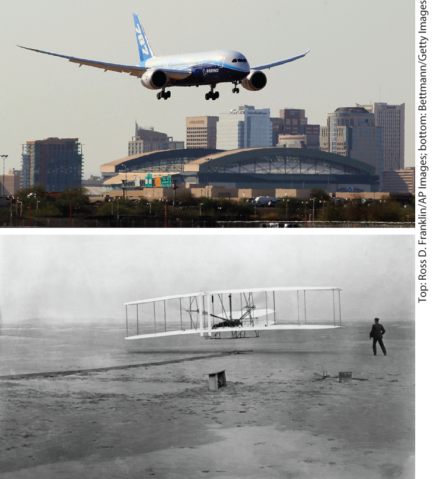
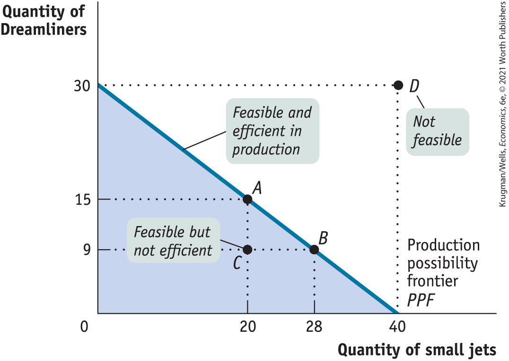
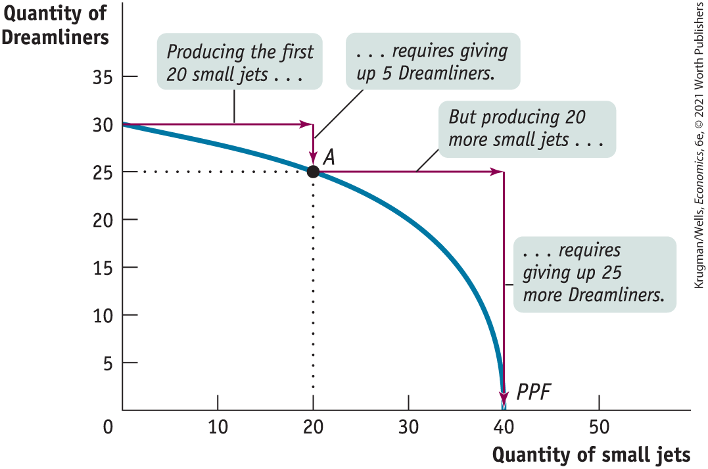
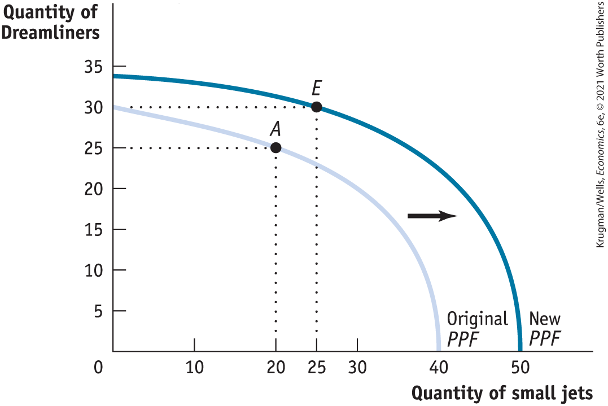

# Chapter 2 Economic Models: Trade-offs and Trade

## From kitty hawk to dreamliner

**BOEING’S 787 DREAMLINER** was the result of an aerodynamic revolution — a super-efficient airplane designed to cut airline operating costs and the first to use superlight composite materials.

<figure id="pau_9781319320164_Twq8BgQcjO" class="figure lm_img_lightbox unnum c2 right">

<figcaption>
<strong>The Wright brothers’ model made modern airplanes, including the Dreamliner, possible.</strong>
</figcaption>
</figure>

To ensure that the Dreamliner was sufficiently lightweight and aerodynamic, it underwent over 15,000 hours of wind tunnel tests, resulting in subtle design changes that improved its performance, making it more fuel efficient and less pollutant emitting than existing passenger jets. In fact, some budget airlines such as Norwegian Air (Europe’s third-largest budget airline) have been offering transatlantic flights at half the price of their rivals, expecting that the super-fuel-efficient Dreamliner will shrink fuel costs enough to make their discount strategy profitable.

The first flight of the Dreamliner was a spectacular advance from the 1903 maiden voyage of the Wright Flyer, the first successful powered airplane, in Kitty Hawk, North Carolina. Yet the Boeing engineers — and all aeronautical engineers — owe an enormous debt to the Wright Flyer’s inventors, Wilbur and Orville Wright.

What made the Wrights truly visionary was their invention of the wind tunnel, an apparatus that let them experiment with many different designs for wings and control surfaces. Doing experiments with a miniature airplane, inside a wind tunnel the size of a shipping crate, gave the Wright Brothers the knowledge that would make heavier-than-air flight possible.

Neither a miniature airplane inside a packing crate nor a miniature model of the Dreamliner inside Boeing’s state-of-the-art Transonic Wind Tunnel is the same thing as an actual aircraft in flight. But each is a very useful *model* of a flying plane — a simplified representation of the real thing that can be used to answer crucial questions, such as how much lift a given wing shape will generate at a given airspeed.

Needless to say, testing an airplane design in a wind tunnel is cheaper and safer than building a full-scale version and hoping it will fly. More generally, models play a crucial role in almost all scientific research — economics very much included.

In fact, you could say that economic theory consists mainly of a collection of models, a series of simplified representations of economic reality that allow us to understand a variety of economic issues.

In this chapter, we’ll look at three economic models that are crucially important in their own right and illustrate why such models are so useful. We’ll conclude with a look at how economists actually use models in their work. 

<aside class="learning-objectives c3 main-flow v3" epub:type="learning-objectives" id="pau_9781319320164_oKBGS34j50">

### What you will learn

- What are economic **models** and why are they so important to economists?
- How do three simple models — the **production possibility frontier, comparative advantage**, and the **circular-flow diagram** — help us understand how modern economies work?
- Why is an understanding of the difference between **positive economics** and **normative economics** important for the real-world application of economic principles?
- Why do economists sometimes disagree?

</aside>

## Models in Economics: Some Important Examples

A <a href="#kru_9781319245269_EM_glossary.xhtml#pau_9781319320164_zqGZ9TvlqC" id="kru_9781319245269_ch02_02.xhtml#pau_9781319320164_CAcpipu2Td" class="glossref" role="doc-glossref">model</a> is any simplified representation of reality that is used to better understand real-life situations. But how do we create a simplified representation of an economic situation?

<aside aria-label="title1" class="glossary c3 main-flow v1" epub:type="glossary" id="pau_9781319320164_FDgQIyqgGW">

**model**  
A **model** is a simplified representation of a real situation that is used to better understand real-life situations.

</aside>

One possibility — an economist’s equivalent of a wind tunnel — is to find or create a real but simplified economy. Take, for example, an economist who wants to know how an increase in the government-mandated minimum wage would affect the U.S. economy. It would be impossible to do an experiment that involved raising the minimum wage across the country and seeing what happens. Instead, the economist will observe the effects of a smaller economy that is raising its minimum wage (like New York City did in 2019) and then extrapolate those results to the larger U.S. economy.

Another possibility is to simulate the workings of the economy on a computer. For example, when changes in tax law are proposed, government officials use *tax models —* large mathematical computer programs — to assess how the proposed changes would affect different types of people.

Models are important because their simplicity allows economists to focus on the effects of only one change at a time. That is, they allow us to hold everything else constant and study how one change affects the overall economic outcome.

So an important assumption when building economic models is the <a href="#kru_9781319245269_EM_glossary.xhtml#pau_9781319320164_q6HSUiSPl0" id="kru_9781319245269_ch02_02.xhtml#pau_9781319320164_QC7W4MvQeS" class="glossref" role="doc-glossref">other things equal assumption</a>, which means that all other relevant factors remain unchanged.

<aside aria-label="title2" class="glossary c3 main-flow v1" epub:type="glossary" id="pau_9781319320164_ZPbCYtCdtj">

**other things equal assumption**  
The **other things equal assumption** means that all other relevant factors remain unchanged.

</aside>

But you can’t always find or create a small-scale version of the whole economy, and a computer program is only as good as the data it uses. (Programmers have a saying: “garbage in, garbage out.”) For many purposes, the most effective form of economic modeling is the construction of “thought experiments”: simplified, hypothetical versions of real-life situations.

We used the example of how customers checking out at a supermarket rearrange themselves when a new cash register opens to illustrate the concept of equilibrium in <a href="#kru_9781319245269_ch01_01.xhtml#pau_9781319320164_cMQypPwEmS" id="kru_9781319245269_ch02_02.xhtml#pau_9781319320164_XOVuPl6JkO" class="crossref">Chapter 1</a>. Although we didn’t say it, this is an example of a simple model — an imaginary supermarket, in which many details, like what customers were buying, are ignored. This simple model can be used to answer a “what if” question: for example, what if another cash register were to open?

As this checkout story shows, it is possible to describe and analyze a useful economic model in plain English. However, because much of economics involves changes in quantities — in the price of a product, the number of units produced, or the number of workers employed in its production — economists often find that using some mathematics helps clarify an issue. In particular, a numerical example, a simple equation, or — especially — a graph can be key to understanding an economic concept.

Whatever form it takes, a good economic model can be a tremendous aid to understanding. We’ll now look at three simple but important economic models and what they tell us.

- First, we will look at the *production possibility frontier,* a model that helps economists think about the trade-offs every economy faces.
- We then turn to *comparative advantage,* a model that clarifies the principle of gains from trade — trade both between individuals and between countries.
- We will also examine the *circular-flow diagram,* a schematic representation that helps us understand how flows of money, goods, and services are channeled through the economy.

Throughout this chapter, and the entire book, we will make considerable use of graphs to represent mathematical relationships. If you are already familiar with how graphs are used, you can skip the appendix to this chapter, which provides a brief introduction to the use of graphs in economics. If not, this would be a good time to read the appendix on graphing.

### Trade-offs: The Production Possibility Frontier

The first principle of economics we introduced in <a href="#kru_9781319245269_ch01_01.xhtml#pau_9781319320164_cMQypPwEmS" id="kru_9781319245269_ch02_02.xhtml#pau_9781319320164_xtSzKWIFAZ" class="crossref">Chapter 1</a> is that resources are scarce and, as a result, any economy faces trade-offs — whether it’s an isolated group of a few dozen hunter-gatherers or the nearly 7.8 billion people making up the twenty-first-century global economy. No matter how lightweight the Boeing Dreamliner is, no matter how efficient Boeing’s assembly line, producing Dreamliners means using resources that therefore can’t be used to produce something else.

To think about the trade-offs that face any economy, economists often use the model known as the <a href="#kru_9781319245269_EM_glossary.xhtml#pau_9781319320164_WKBkcJVQv4" id="kru_9781319245269_ch02_02.xhtml#pau_9781319320164_ZdntxLr09c" class="glossref" role="doc-glossref">production possibility frontier</a>. The idea behind this model is to improve our understanding of trade-offs by considering a simplified economy that produces only two goods. This simplification enables us to show the trade-off graphically.

<aside aria-label="title3" class="glossary c3 main-flow v1" epub:type="glossary" id="pau_9781319320164_YoMovn9Mtu">

**production possibility frontier**  
The **production possibility frontier** illustrates the trade-offs facing an economy that produces only two goods. It shows the maximum quantity of one good that can be produced for any given quantity produced of the other.

</aside>

Suppose, for a moment, that the United States was a one-company economy, with Boeing its sole employer and aircraft its only product. But there would still be a choice of what kinds of aircraft to produce — say, Dreamliners versus small commuter jets. <a href="#kru_9781319245269_ch02_02.xhtml#pau_9781319320164_bS823lxuHv" id="kru_9781319245269_ch02_02.xhtml#pau_9781319320164_j9eL4joG53" class="crossref">Figure 2-1</a> shows a hypothetical production possibility frontier representing the trade-off this one-company economy would face. The frontier — the line in the diagram — shows the maximum quantity of small jets that Boeing can produce per year *given* the quantity of Dreamliners it produces per year, and vice versa. That is, it answers questions of the form, “What is the maximum quantity of small jets that Boeing can produce in a year if it also produces 9 (or 15, or 30) Dreamliners that year?”

<figure id="pau_9781319320164_bS823lxuHv" class="figure lm_img_lightbox num c3 main-flow">

<figcaption>
FIGURE 2-1 The Production Possibility Frontier

The production possibility frontier illustrates the trade-offs Boeing faces in producing Dreamliners and small jets. It shows the maximum quantity of one good that can be produced given the quantity of the other good produced. Here, the maximum quantity of Dreamliners manufactured per year depends on the quantity of small jets manufactured that year, and vice versa. Boeing’s feasible production is shown by the area <em>inside</em> or <em>on</em> the curve. Production at point <em>C</em> is feasible but not efficient. Points <em>A</em> and <em>B</em> are feasible and efficient in production, but point <em>D</em> is not feasible.
</figcaption>
</figure>

<aside class="hidden" id="pau_9781319320164_U3zCiAIWX1" title="hidden">

The Quantity of Dreamliners ranges from 0 to 30, and the Quantity of small jets ranges from 0 to 40. The negatively sloping curve denoting the P P F or the production possibility frontier extends between (0, 30) and (40, 0). Points A (20, 15) and B (28, 9) are marked on the P P F. A callout at point C (20, 9) reads, Feasible but not efficient. A callout at point D (40, 30) reads, Not feasible.

</aside>

There is a crucial distinction between points *inside* or *on* the production possibility frontier (the shaded area) and *outside* the frontier. If a production point lies inside or on the frontier — like point *C,* at which Boeing produces 20 small jets and 9 Dreamliners in a year — it is feasible. After all, the frontier tells us that if Boeing produces 20 small jets, it could also produce a maximum of 15 Dreamliners that year, so it could certainly make 9 Dreamliners.

However, a production point that lies outside the frontier — such as the hypothetical production point *D,* where Boeing produces 40 small jets and 30 Dreamliners — isn’t feasible. Boeing can produce 40 small jets and no Dreamliners, *or* it can produce 30 Dreamliners and no small jets, but it can’t do both.

In <a href="#kru_9781319245269_ch02_02.xhtml#pau_9781319320164_bS823lxuHv" id="kru_9781319245269_ch02_02.xhtml#pau_9781319320164_EybbYfjZk7" class="crossref">Figure 2-1</a> the production possibility frontier intersects the horizontal axis at 40 small jets. This means that if Boeing dedicated all its production capacity to making small jets, it could produce 40 small jets per year but could produce no Dreamliners. The production possibility frontier intersects the vertical axis at 30 Dreamliners. This means that if Boeing dedicated all its production capacity to making Dreamliners, it could produce 30 Dreamliners per year but no small jets.

The figure also shows less extreme trade-offs. For example, if Boeing’s managers decide to make 20 small jets this year, they can produce at most 15 Dreamliners; this production choice is illustrated by point *A.* And if Boeing’s managers decide to produce 28 small jets, they can make at most 9 Dreamliners, as shown by point *B.*

Thinking in terms of a production possibility frontier simplifies the complexities of reality. The real-world U.S. economy produces millions of different goods. Even Boeing can produce more than two different types of planes. Yet it’s important to realize that even in its simplicity, this stripped-down model gives us important insights about the real world.

By simplifying reality, the production possibility frontier helps us understand some aspects of the real economy better than we could without the model: efficiency, opportunity cost, and economic growth.

#### Efficiency

First of all, the production possibility frontier is a good way to illustrate the general economic concept of *efficiency.* Recall from <a href="#kru_9781319245269_ch01_01.xhtml#pau_9781319320164_cMQypPwEmS" id="kru_9781319245269_ch02_02.xhtml#pau_9781319320164_iTdPN29Est" class="crossref">Chapter 1</a> that an economy is efficient if there are no missed opportunities — there is no way to make some people better off without making other people worse off.

One key element of efficiency is that there are no missed opportunities in production — there is no way to produce more of one good without producing less of other goods. As long as Boeing operates on its production possibility frontier, its production is efficient. At point *A,* 15 Dreamliners are the maximum quantity feasible given that Boeing has also committed to producing 20 small jets; at point *B,* 9 Dreamliners are the maximum number that can be made given the choice to produce 28 small jets; and so on.

But suppose for some reason that Boeing was operating at point *C,* making 20 small jets and 9 Dreamliners. In this case, it would not be operating efficiently and would therefore be *inefficient:* it could be producing more of both planes.

Although we have used an example of the production choices of a one-firm, two-good economy to illustrate efficiency and inefficiency, these concepts also carry over to the real economy, which contains many firms and produces many goods. If the economy as a whole could not produce more of any one good without producing less of something else — that is, if it is on its production possibility frontier — then we say that the economy is *efficient in production.*

If, however, the economy could produce more of some things without producing less of others — which typically means that it could produce more of everything — then it is inefficient in production. For example, an economy in which large numbers of workers are involuntarily unemployed is clearly inefficient in production. And that’s a bad thing because these workers could be employed in the production of more useful goods and services.

Although the production possibility frontier helps clarify what it means for an economy to be efficient in production, it’s important to understand that efficiency in production is only *part* of what’s required for the economy as a whole to be efficient. Efficiency also requires that the economy allocate its resources so that consumers are as well off as possible. If an economy does this, we say that it is *efficient in allocation.*

To see why efficiency in allocation is as important as efficiency in production, notice that points *A* and *B* in <a href="#kru_9781319245269_ch02_02.xhtml#pau_9781319320164_bS823lxuHv" id="kru_9781319245269_ch02_02.xhtml#pau_9781319320164_C6o0Rp6oJV" class="crossref">Figure 2-1</a> both represent situations in which the economy is efficient in production, because in each case it can’t produce more of one good without producing less of the other. But these two situations may not be equally desirable from society’s point of view. Suppose that society prefers to have more small jets and fewer Dreamliners than at point *A;* say, it prefers to have 28 small jets and 9 Dreamliners, corresponding to point *B.* In this case, point *A* is inefficient in allocation from the point of view of the economy as a whole because it would rather have Boeing produce at point *B* instead of point *A.*

This example shows that efficiency for the economy as a whole requires *both* efficiency in production and efficiency in allocation: to be efficient, an economy must produce as much of each good as it can given the production of other goods. It must also produce the mix of goods that people want to consume and deliver those goods to the right people. An economy that gives small jets to international airlines and Dreamliners to commuter airlines serving small rural airports is inefficient, too.

In the real world, command economies, such as the former Soviet Union, are notorious for inefficiency in allocation. For example, it was common for consumers to find stores well stocked with items few people wanted but lacking basics such as soap and toilet paper.

#### Opportunity Cost

The production possibility frontier is also useful as a reminder of the fundamental point that the true cost of any good isn’t the money it costs to buy it, but what must be given up in order to get that good — the *opportunity cost.* If, for example, Boeing decides to change its production from point *A* to point *B,* it will produce 8 more small jets but 6 fewer Dreamliners. So the opportunity cost of 8 small jets is 6 Dreamliners — the 6 Dreamliners that must be forgone in order to produce 8 more small jets. This means that each small jet has an opportunity cost of $\frac{6}{8} = \frac{3}{4}$ of a Dreamliner.

Is the opportunity cost of an extra small jet in terms of Dreamliners always the same, no matter how many small jets and Dreamliners are currently produced? In the example illustrated by <a href="#kru_9781319245269_ch02_02.xhtml#pau_9781319320164_bS823lxuHv" id="kru_9781319245269_ch02_02.xhtml#pau_9781319320164_G8eYIgv3yS" class="crossref">Figure 2-1</a>, the answer is yes. If Boeing increases its production of small jets from 28 to 40, the number of Dreamliners it produces falls from 9 to zero. So Boeing’s opportunity cost per additional small jet is $\frac{9}{12} = \frac{3}{4}$ of a Dreamliner, the same as it was when Boeing went from 20 small jets produced to 28.

However, the fact that in this example the opportunity cost of a small jet in terms of a Dreamliner is always the same is a result of an assumption we’ve made, an assumption that’s reflected in how <a href="#kru_9781319245269_ch02_02.xhtml#pau_9781319320164_bS823lxuHv" id="kru_9781319245269_ch02_02.xhtml#pau_9781319320164_SSm7GKRRPg" class="crossref">Figure 2-1</a> is drawn. Specifically, whenever we assume that the opportunity cost of an additional unit of a good doesn’t change regardless of the output mix, the production possibility frontier is a straight line.

Moreover, as you might have already guessed, the slope of a straight-line production possibility frontier is equal to the opportunity cost — specifically, the opportunity cost for the good measured on the horizontal axis in terms of the good measured on the vertical axis. In <a href="#kru_9781319245269_ch02_02.xhtml#pau_9781319320164_bS823lxuHv" id="kru_9781319245269_ch02_02.xhtml#pau_9781319320164_F2vMuJViNd" class="crossref">Figure 2-1</a>, the production possibility frontier has a *constant slope* of $- \frac{3}{4}$, implying that Boeing faces a *constant opportunity cost* for 1 small jet equal to $\frac{3}{4}$ of a Dreamliner. (A review of how to calculate the slope of a straight line is found in this chapter’s appendix.) This is the simplest case, but the production possibility frontier model can also be used to examine situations in which opportunity costs change as the mix of output changes.

<a href="#kru_9781319245269_ch02_02.xhtml#pau_9781319320164_moYRS2zebm" id="kru_9781319245269_ch02_02.xhtml#pau_9781319320164_dW9ZAAkLTK" class="crossref">Figure 2-2</a> illustrates a different assumption, a case in which Boeing faces *increasing opportunity cost.* Here, the more small jets it produces, the more costly it is to produce yet another small jet in terms of forgone production of a Dreamliner. And the same holds true in reverse: the more Dreamliners Boeing produces, the more costly it is to produce yet another Dreamliner in terms of forgone production of small jets. For example, to go from producing zero small jets to producing 20, Boeing has to forgo producing 5 Dreamliners. That is, the opportunity cost of those 20 small jets is 5 Dreamliners. But to increase its production of small jets to 40 — that is, to produce an additional 20 small jets — it must forgo producing 25 more Dreamliners, a much higher opportunity cost. As you can see in <a href="#kru_9781319245269_ch02_02.xhtml#pau_9781319320164_moYRS2zebm" id="kru_9781319245269_ch02_02.xhtml#pau_9781319320164_WLmjMICTNr" class="crossref">Figure 2-2</a>, when opportunity costs are increasing rather than constant, the production possibility frontier is a bowed-out curve rather than a straight line.

<figure id="pau_9781319320164_moYRS2zebm" class="figure lm_img_lightbox num c3 main-flow">

<figcaption>
FIGURE 2-2 Increasing Opportunity Cost

The bowed-out shape of the production possibility frontier reflects increasing opportunity cost. In this example, to produce the first 20 small jets, Boeing must forgo producing 5 Dreamliners. But to produce an additional 20 small jets, Boeing must forgo manufacturing 25 more Dreamliners.
</figcaption>
</figure>

<aside class="hidden" id="pau_9781319320164_So311eInXp" title="hidden">

The Quantity of Dreamliners ranges from 0 to 35 in increments of 5, and the Quantity of small jets ranges from 0 to 50 in increments of 10. The P P F or the production possibility frontier curve extends between (0, 30) and (40, 0). The point (20, 25) is labeled A. Arrows with callouts read as follows. Producing the first 20 small jets requires giving up five Dreamliners. But producing 20 more small jets requires giving up 25 more Dreamliners.

</aside>

Although it’s often useful to work with the simple assumption that the production possibility frontier is a straight line, economists believe that in reality opportunity costs are typically increasing. When only a small amount of a good is produced, the opportunity cost of producing that good is relatively low because the economy needs to use only those resources that are especially well suited for its production.

For example, if an economy grows only a small amount of corn, that corn can be grown in places where the soil and climate are perfect for corn-growing but less suitable for growing anything else, like wheat. So growing that corn involves giving up only a small amount of potential wheat output. Once the economy grows a lot of corn, however, land that is well suited for wheat but isn’t so great for corn must be used to produce corn anyway. As a result, the additional corn production involves sacrificing considerably more wheat production. In other words, as more of a good is produced, its opportunity cost typically rises because well-suited inputs are used up and less adaptable inputs must be used instead.

#### Economic Growth

Finally, the production possibility frontier helps us understand what it means to talk about *economic growth*. In the Introduction, we defined the concept of economic growth as *the growing ability of the economy to produce goods and services.* As we saw, economic growth is one of the fundamental features of the real economy. But are we really justified in saying that the economy has grown over time? After all, although the U.S. economy produces more of many things than it did a century ago, it produces less of other things — for example, horse-drawn carriages. Production of many goods, in other words, is actually down. So how can we say for sure that the economy as a whole has grown?

The answer is illustrated in <a href="#kru_9781319245269_ch02_02.xhtml#pau_9781319320164_vLaw13kNr2" id="kru_9781319245269_ch02_02.xhtml#pau_9781319320164_U4iVHladRY" class="crossref">Figure 2-3</a>, where we have drawn two hypothetical production possibility frontiers for the economy. In them we have assumed once again that everyone in the economy works for Boeing and, consequently, the economy produces only two goods, Dreamliners and small jets. Notice how the two curves are nested, with the one labeled “Original *PPF*” lying completely inside the one labeled “New *PPF.*” Now we can see graphically what we mean by economic growth of the economy: economic growth means an *expansion of the economy’s production possibilities;* that is, the economy *can* produce more of everything.

<figure id="pau_9781319320164_vLaw13kNr2" class="figure lm_img_lightbox num c3 main-flow">

<figcaption>
FIGURE 2-3 Economic Growth

Economic growth results in an <em>outward shift</em> of the production possibility frontier because production possibilities are expanded. The economy can now produce more of everything. For example, if production is initially at point <em>A</em> (25 Dreamliners and 20 small jets), economic growth means that the economy could move to point <em>E</em> (30 Dreamliners and 25 small jets).
</figcaption>
</figure>

<aside class="hidden" id="pau_9781319320164_QCbL0SfHuT" title="hidden">

The original P P F is a concave down, decreasing curve that runs from 34 Dreamliners on the vertical axis to 50 small jets on the horizontal axis. The new P P F is a concave down, decreasing curve to the right of the original P P F and extends between 30 Dreamliners on the vertical axis and 40 small jets on the horizontal axis. Point A (20, 25) lies on the original P P F, and point E (25, 34) lies on the new P P F.

</aside>

For example, if the economy initially produces at point *A* (25 Dreamliners and 20 small jets), economic growth means that the economy could move to point *E* (30 Dreamliners and 25 small jets). *E* lies outside the original frontier; so in the production possibility frontier model, growth is shown as an outward shift of the frontier.

What can lead the production possibility frontier to shift outward? There are basically two sources of economic growth. One is an increase in the economy’s <a href="#kru_9781319245269_EM_glossary.xhtml#pau_9781319320164_wMgIYxai3t" id="kru_9781319245269_ch02_02.xhtml#pau_9781319320164_NVp0PUY7Mb" class="glossref" role="doc-glossref">factors of production</a>, the resources used to produce goods and services. Economists usually use the term *factor of production* to refer to a resource that is not used up in production. For example, in traditional airplane manufacture workers used riveting machines to connect metal sheets when constructing a plane’s fuselage; the workers and the riveters are factors of production, but the rivets and the sheet metal are not. Once a fuselage is made, a worker and riveter can be used to make another fuselage, but the sheet metal and rivets used to make one fuselage cannot be used to make another.

<aside aria-label="title4" class="glossary c3 main-flow v1" epub:type="glossary" id="pau_9781319320164_A64NqLGuk5">

**factors of production**  
**Factors of production** are resources used to produce goods and services.

</aside>

<figure id="pau_9781319320164_6cZmy3ubzU" class="figure lm_img_lightbox unnum c2 right">

<figcaption>
The four factors of production: land, labor, physical capital, and human capital.
</figcaption>
</figure>

<aside class="hidden" id="pau_9781319320164_YcWGY9HAKs" title="hidden">

The first photo shows a field tilled and ready for cultivation. The second photo shows three workers picking up boxes from a conveyor belt. The third photo shows a robot operating at an automobile manufacturing unit. The fourth photo shows five students grouped around a computer and looking at the screen.

</aside>

Broadly speaking, the main factors of production are the resources: land, labor, physical capital, and human capital. Land is a resource supplied by nature; labor is the economy’s pool of workers; physical capital refers to created resources such as machines and buildings; and human capital refers to the educational achievements and skills of the labor force, which enhance its productivity. Of course, each of these is actually a broad category rather than a single factor: land in North Dakota is very different from land in Florida.

To see how adding to an economy’s factors of production leads to economic growth, suppose that Boeing builds another construction hangar that allows it to increase the number of planes — small jets or Dreamliners or both — it can produce in a year. The new construction hangar is a factor of production, a resource Boeing can use to increase its yearly output. How many more planes of each type Boeing will produce is a management decision that will depend on, among other things, customer demand. But we can say that Boeing’s production possibility frontier has shifted outward because it can now produce more small jets without reducing the number of Dreamliners it makes, or it can make more Dreamliners without reducing the number of small jets produced.

The other source of economic growth is progress in <a href="#kru_9781319245269_EM_glossary.xhtml#pau_9781319320164_5HiFBMI5mO" id="kru_9781319245269_ch02_02.xhtml#pau_9781319320164_aPNWtrZnqx" class="glossref" role="doc-glossref">technology</a>, the technical means for the production of goods and services. Composite materials had been used in some parts of aircraft before the Boeing Dreamliner was developed. But Boeing engineers realized that there were large additional advantages to building a whole plane out of composites. The plane would be lighter, stronger, and have better aerodynamics than a plane built in the traditional way. It would therefore have longer range, be able to carry more people, and use less fuel, in addition to being able to maintain higher cabin pressure. So in a real sense Boeing’s innovation — a whole plane built out of composites — was a way to do more with any given amount of resources, pushing out the production possibility frontier.

<aside aria-label="title5" class="glossary c3 main-flow v1" epub:type="glossary" id="pau_9781319320164_vXeeveWxNB">

**technology**  
**Technology** is the technical means for producing goods and services.

</aside>

Because improved jet technology has pushed out the production possibility frontier, it has made it possible for the economy to produce more of everything, not just jets and air travel. Over the past 30 years, the biggest technological advances have taken place in information technology, not in construction or food services. Yet some Americans have chosen to buy bigger houses and eat out more than they used to because the economy’s growth has made it possible to do so. As we learned in <a href="#kru_9781319245269_ch01_01.xhtml#pau_9781319320164_cMQypPwEmS" id="kru_9781319245269_ch02_02.xhtml#pau_9781319320164_w8OTF7VPzO" class="crossref">Chapter 1</a>, increases in the economy’s potential, like the development of new technologies, lead to economic growth over time.

The production possibility frontier is a very simplified model of an economy. Yet it teaches us important lessons about real-life economies. It gives us our first clear sense of what constitutes economic efficiency, it illustrates the concept of opportunity cost, and it makes clear what economic growth is all about.
