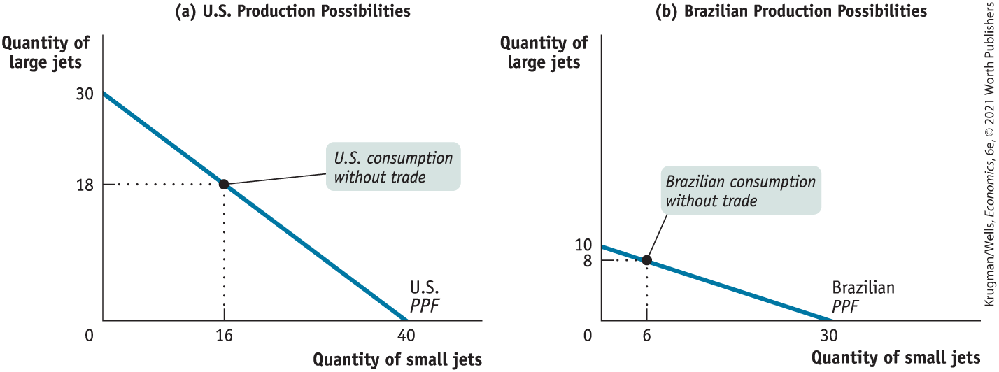
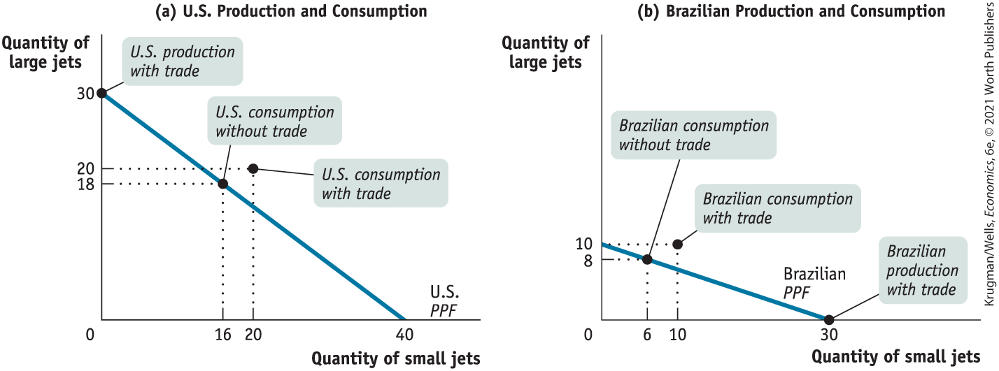
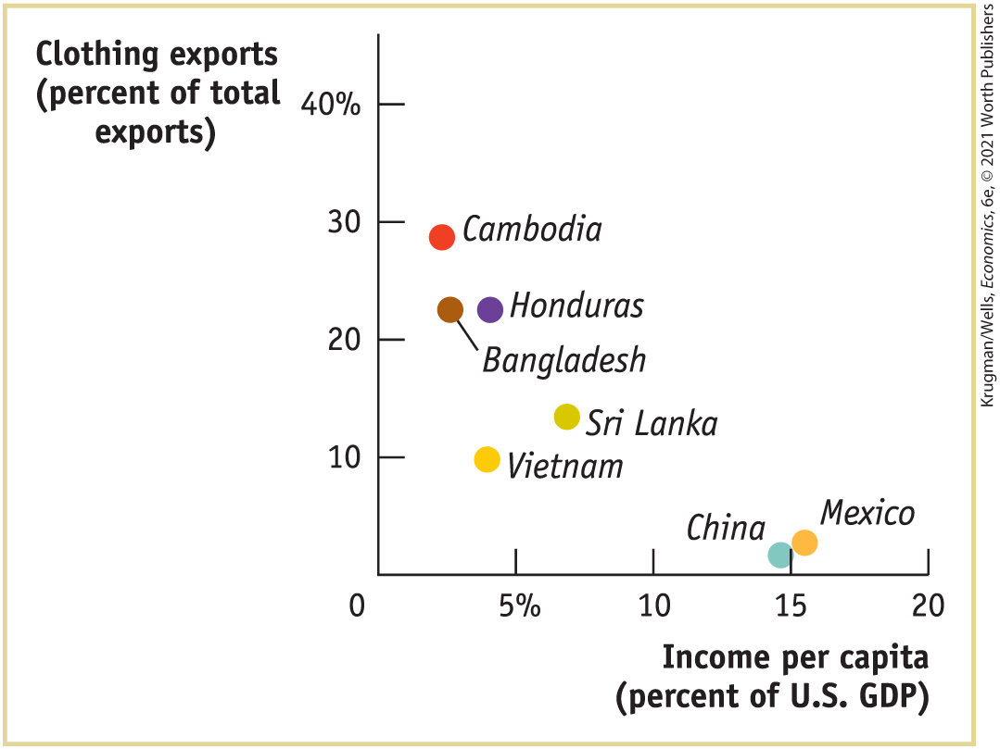
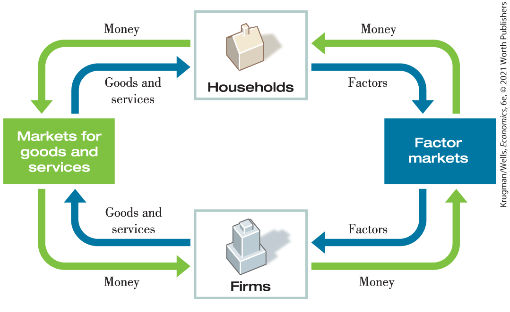
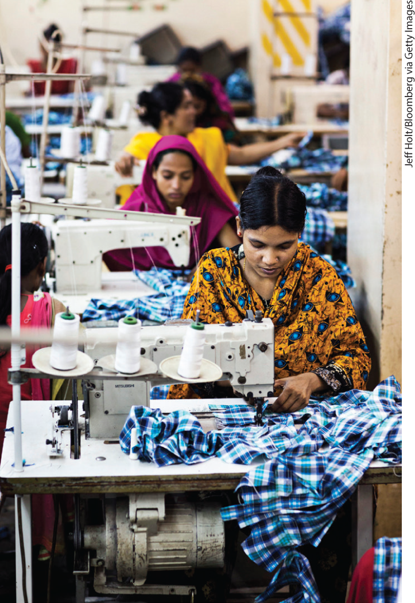

### Comparative Advantage and Gains from Trade

Another of the eleven principles of economics described in <a href="#kru_9781319245269_ch01_01.xhtml#pau_9781319320164_cMQypPwEmS" id="kru_9781319245269_ch02_02.xhtml#pau_9781319320164_niiTzhnfdA" class="crossref">Chapter 1</a> is the principle of *gains from trade* — the mutual gains that individuals can achieve by specializing in doing different things and trading with one another. Our second illustration of an economic model is a particularly useful model of gains from trade — trade based on *comparative advantage.*

One of the most important insights in all of economics is that there are gains from trade: it makes sense to produce the things you’re especially good at producing and to buy from other people the things you aren’t as good at producing. This would be true even if you could produce everything for yourself: even if a brilliant brain surgeon *could* repair her own dripping faucet, it’s probably a better idea for her to call in a professional plumber.

How can we model the gains from trade? Let’s stay with our aircraft example and once again imagine that the United States is a one-company economy where everyone works for Boeing, producing airplanes. Let’s now assume, however, that the United States has the ability to trade with Brazil — another one-company economy where everyone works for the Brazilian aircraft company Embraer, which is, in the real world, a successful producer of small commuter jets. (If you fly from one major U.S. city to another, your plane is likely to be a Boeing, but if you fly into a small city, the odds are good that your plane will be an Embraer.)

In our example, the only two goods produced are large jets and small jets. Both countries could produce both kinds of jets. But as we’ll see in a moment, they can gain by producing different things and trading with each other. For the purposes of this example, let’s return to the simpler case of straight-line production possibility frontiers. America’s production possibilities are represented by the production possibility frontier in panel (a) of <a href="#kru_9781319245269_ch02_02.xhtml#pau_9781319320164_st6wgP6fWW" id="kru_9781319245269_ch02_02.xhtml#pau_9781319320164_iTUNKnafJF" class="crossref">Figure 2-4</a>, which is similar to the production possibility frontier in <a href="#kru_9781319245269_ch02_02.xhtml#pau_9781319320164_bS823lxuHv" id="kru_9781319245269_ch02_02.xhtml#pau_9781319320164_CheLSub5CI" class="crossref">Figure 2-1</a>. According to this diagram, the United States can produce 40 small jets if it makes no large jets and can manufacture 30 large jets if it produces no small jets. Recall that this means that the slope of the U.S. production possibility frontier is $- \frac{3}{4}$: its opportunity cost of 1 small jet is $\frac{3}{4}$ of a large jet.

<figure id="pau_9781319320164_st6wgP6fWW" class="figure lm_img_lightbox num c4 main-flow">

<figcaption>
FIGURE 2-4 Production Possibilities for Two Countries

Here, both the United States and Brazil have a constant opportunity cost of small jets, illustrated by a straight-line production possibility frontier. For the United States, each small jet has an opportunity cost of $\frac{3}{4}$ of a large jet. Brazil has an opportunity cost of a small jet equal to $\frac{1}{3}$ of a large jet.
</figcaption>
</figure>

<aside class="hidden" id="pau_9781319320164_bMd5MDCU9N" title="hidden">

The production possibility frontier curve or the P P F for the United States is a negative sloping curve extending between (0, 30) and (40, 0). Point (16, 18) denotes U. S. consumption without trade. The production possibility frontier curve or the P P F for Brazil is a negative sloping curve extending between (0, 10) and (30, 0). Point (6, 8) denotes Brazilian consumption without trade.

</aside>

Panel (b) of <a href="#kru_9781319245269_ch02_02.xhtml#pau_9781319320164_st6wgP6fWW" id="kru_9781319245269_ch02_02.xhtml#pau_9781319320164_r1h96hmDkC" class="crossref">Figure 2-4</a> shows Brazil’s production possibilities. Like the United States, Brazil’s production possibility frontier is a straight line, implying a constant opportunity cost of a small jet in terms of large jets. Brazil’s production possibility frontier has a constant slope of $- \frac{1}{3}$. Brazil can’t produce as much of anything as the United States can: at most it can produce 30 small jets or 10 large jets. But it is relatively better at manufacturing small jets than the United States; whereas the United States sacrifices $\frac{3}{4}$ of a large jet per small jet produced, for Brazil the opportunity cost of a small jet is only $\frac{1}{3}$ of a large jet. <a href="#kru_9781319245269_ch02_02.xhtml#pau_9781319320164_IS8NVL5lnJ" id="kru_9781319245269_ch02_02.xhtml#pau_9781319320164_jNiTC19BOp" class="crossref">Table 2-1</a> summarizes the two countries’ opportunity costs of small jets and large jets.

|                                                                                                             |                                                                                                                                                   |     |                                                                                                                                                  |
|-------------------------------------------------------------------------------------------------------------|---------------------------------------------------------------------------------------------------------------------------------------------------|-----|--------------------------------------------------------------------------------------------------------------------------------------------------|
|                                                                                                             | U.S. opportunity cost                                                                                                                             |     | Brazilian opportunity cost                                                                                                                       |
| **1 small jet** | $\frac{3}{4}\ \text{large jet}$  | \>  | $\frac{1}{3}\ \text{large jet}$ |
| **1 large jet** | $\frac{4}{3}\ \text{small jets}$ | \<  | $3\ \text{small jets}$          |

TABLE 2-1 U.S. and Brazilian Opportunity Costs of Small Jets and Large Jets

Now, the United States and Brazil could each choose to make their own large and small jets, not trading any of them and consuming only what each produced within its own country. (A country “consumes” an airplane when it is owned by a domestic resident.) Let’s suppose that the two countries start out this way and make the consumption choices shown in <a href="#kru_9781319245269_ch02_02.xhtml#pau_9781319320164_st6wgP6fWW" id="kru_9781319245269_ch02_02.xhtml#pau_9781319320164_4iHr7gicu9" class="crossref">Figure 2-4</a>: in the absence of trade, the United States produces and consumes 16 small jets and 18 large jets per year, while Brazil produces and consumes 6 small jets and 8 large jets per year.

But is this the best the two countries can do? No, it isn’t. Given that the two producers — and therefore the two countries — have different opportunity costs, the United States and Brazil can strike a deal that makes both of them better off.

<a href="#kru_9781319245269_ch02_02.xhtml#pau_9781319320164_J895zlVtU5" id="kru_9781319245269_ch02_02.xhtml#pau_9781319320164_46hRWYEIGW" class="crossref">Table 2-2</a> shows how such a deal works: the United States specializes in the production of large jets, manufacturing 30 per year, and sells 10 to Brazil. Meanwhile, Brazil specializes in the production of small jets, producing 30 per year, and sells 20 to the United States. The result is shown in <a href="#kru_9781319245269_ch02_02.xhtml#pau_9781319320164_nfUNjkqb1B" id="kru_9781319245269_ch02_02.xhtml#pau_9781319320164_FZKZAOiWEj" class="crossref">Figure 2-5</a>. The United States now consumes more of both small jets and large jets than before: instead of 16 small jets and 18 large jets, it now consumes 20 small jets and 20 large jets. Brazil also consumes more, going from 6 small jets and 8 large jets to 10 small jets and 10 large jets. As <a href="#kru_9781319245269_ch02_02.xhtml#pau_9781319320164_J895zlVtU5" id="kru_9781319245269_ch02_02.xhtml#pau_9781319320164_Y0ihKyZnGs" class="crossref">Table 2-2</a> also shows, both the United States and Brazil reap gains from trade, consuming more of both types of planes than they would have without trade.

|                   |                |                                                                                                                |             |                                                                                                             |             |                                                                                                                        |
|-------------------|----------------|----------------------------------------------------------------------------------------------------------------|-------------|-------------------------------------------------------------------------------------------------------------|-------------|------------------------------------------------------------------------------------------------------------------------|
|                   |                | Without trade |             | With trade |             |                                                                                                                        |
|                   |                | Production                                                                                                     | Consumption | Production                                                                                                  | Consumption | Gains from trade           |
| **United States** | **Large jets** | 18                                                                                                             | 18          | 30                                                                                                          | 20          | $+ 2$ |
|                   | **Small jets** | 16                                                                                                             | 16          | 0                                                                                                           | 20          | $+ 4$ |
| **Brazil**        | **Large jets** | 8                                                                                                              | 8           | 0                                                                                                           | 10          | $+ 2$ |
|                   | **Small jets** | 6                                                                                                              | 6           | 30                                                                                                          | 10          | $+ 4$ |

TABLE 2-2 How the United States and Brazil Gain from Trade

<figure id="pau_9781319320164_nfUNjkqb1B" class="figure lm_img_lightbox num c4 main-flow">

<figcaption>
FIGURE 2-5 Comparative Advantage and Gains from Trade

By specializing and trading, the United States and Brazil can produce and consume more of both large jets and small jets. The United States specializes in manufacturing large jets, its comparative advantage, and Brazil — which has an <em>absolute</em> disadvantage in both goods but a <em>comparative</em> advantage in small jets — specializes in manufacturing small jets. With trade, both countries can consume more of both goods than either could without trade.
</figcaption>
</figure>

<aside class="hidden" id="pau_9781319320164_JUg0ju073v" title="hidden">

The production possibility frontier curve or the P P F for the United States is a negative sloping curve extending between (0, 30) and (40, 0). Point (16, 18) denotes U. S. consumption without trade. Point (0, 30) denotes U. S. production with trade. Point (20, 20) denotes U. S. consumption with trade. The production possibility frontier curve or the P P F for Brazil is a negative sloping curve extending between (0, 10) and (30, 0). Point (6, 8) denotes Brazilian consumption without trade. Point (30, 0) denotes Brazilian production with trade. Point (10, 10) denotes Brazilian consumption with trade.

</aside>

Both countries are better off when they each specialize in what they are good at and trade. It’s a good idea for the United States to specialize in the production of large jets because its opportunity cost of a large jet is smaller than Brazil’s: $\frac{4}{3} < 3$. Correspondingly, Brazil should specialize in the production of small jets because its opportunity cost of a small jet is smaller than the United States: $\frac{1}{3} < \frac{3}{4}$.

What we would say in this case is that the United States has a comparative advantage in the production of large jets and Brazil has a comparative advantage in the production of small jets. A country has a <a href="#kru_9781319245269_EM_glossary.xhtml#pau_9781319320164_9CZF1g5tWs" id="kru_9781319245269_ch02_02.xhtml#pau_9781319320164_onztvU3SxD" class="glossref" role="doc-glossref">comparative advantage</a> in producing something if the opportunity cost of that production is lower for that country than for other countries. The same concept applies to firms and people: a firm or an individual has a comparative advantage in producing something if its, his, or her opportunity cost of production is lower than for others.

<aside aria-label="title6" class="glossary c3 main-flow v1" epub:type="glossary" id="pau_9781319320164_jT7YT4cdNH">

**comparative advantage**  
A country has a **comparative advantage** in producing a good or service if its opportunity cost of producing the good or service is lower than other countries’ cost. Likewise, an individual has a comparative advantage in producing a good or service if his or her opportunity cost of producing the good or service is lower than it is for other people.

</aside>

One point of clarification before we proceed further. You may have wondered why the United States traded 10 large jets to Brazil in return for 20 small jets. Why not some other deal, like trading 10 large jets for 12 small jets? The answer to that question has two parts. First, there may indeed be other trades that the United States and Brazil might agree to. Second, there are some deals that we can safely rule out — one like 10 large jets for 10 small jets.

To understand why, reexamine <a href="#kru_9781319245269_ch02_02.xhtml#pau_9781319320164_IS8NVL5lnJ" id="kru_9781319245269_ch02_02.xhtml#pau_9781319320164_6f7h1N7aXH" class="crossref">Table 2-1</a> and consider the United States first. Without trading with Brazil, the U.S. opportunity cost of a small jet is $\frac{3}{4}$ of a large jet. So it’s clear that the United States will not accept any trade that requires it to give up more than $\frac{3}{4}$ of a large jet for a small jet. Trading 10 large jets in return for 12 small jets would require the United States to pay an opportunity cost of $\frac{10}{12} = \frac{5}{6}$ of a large jet for a small jet. Because $\frac{5}{6}$ is greater than $\frac{3}{4}$, this is a deal that the United States would reject. Similarly, Brazil won’t accept a trade that gives it less than $\frac{1}{3}$ of a large jet for a small jet.

The point to remember is that the United States and Brazil will be willing to trade only if the “price” of the good each country obtains in the trade is less than its own opportunity cost of producing the good domestically. Moreover, this is a general statement that is true whenever two parties — countries, firms, or individuals — trade voluntarily.

While our story clearly simplifies reality, it teaches us some very important lessons that apply to the real economy, too.

First, the model provides a clear illustration of the gains from trade: through specialization and trade, both countries produce more and consume more than if they were self-sufficient.

Second, the model demonstrates a very important point that is often overlooked in real-world arguments: each country has a comparative advantage in producing something. This applies to firms and people as well: ***everyone has a comparative advantage in something, and everyone has a comparative disadvantage in something.***

Crucially, in our example it doesn’t matter if, as is probably the case in real life, American workers are just as good as or even better than Brazilian workers at producing small jets. Suppose that the United States is actually better than Brazil at all kinds of aircraft production. In that case, we would say that the United States has an <a href="#kru_9781319245269_EM_glossary.xhtml#pau_9781319320164_oydnucHKal" id="kru_9781319245269_ch02_02.xhtml#pau_9781319320164_5rj31FPc7j" class="glossref" role="doc-glossref">absolute advantage</a> in both large-jet and small-jet production: in an hour, an American worker can produce more of either a large jet or a small jet than a Brazilian worker. You might be tempted to think that in that case the United States has nothing to gain from trading with the less productive Brazil.

<aside aria-label="title7" class="glossary c3 main-flow v1" epub:type="glossary" id="pau_9781319320164_4iCyCzTkt4">

**absolute advantage**  
A country has an **absolute advantage** in producing a good or service if the country can produce more output per worker than other countries. Likewise, an individual has an absolute advantage in producing a good or service if he or she is better at producing it than other people. Having an absolute advantage is not the same thing as having a comparative advantage.

</aside>

But we’ve just seen that the United States can indeed benefit from trading with Brazil because ***comparative, not absolute, advantage is the basis for mutual gain.*** It doesn’t matter whether it takes Brazil more resources than the United States to make a small jet; what matters for trade is that for Brazil the opportunity cost of a small jet is lower than the U.S. opportunity cost. So Brazil, despite its absolute disadvantage, even in small jets, has a comparative advantage in the manufacture of small jets. Meanwhile the United States, which can use its resources most productively by manufacturing large jets, has a comparative *dis*advantage in manufacturing small jets.

## Comparative Advantage and International Trade, in Reality

Look at the label on a manufactured good sold in the United States, and there’s a good chance you will find that it was produced in some other country — in China, or Japan, or even in Canada. On the other side, many U.S. industries sell a large fraction of their output overseas. This is particularly true of agriculture, high technology, and entertainment.

<aside class="case-study c3 main-flow v5" epub:type="case-study" id="pau_9781319320164_5e87XSlE3w" title="Pitfalls">

### *Pitfalls*

MISUNDERSTANDING COMPARATIVE ADVANTAGE

Students do it, pundits do it, and politicians do it all the time: they confuse *comparative advantage* with *absolute advantage.* For example, back in the 1980s, when the U.S. economy seemed to be lagging behind that of Japan, news commentators could be heard warning that if we didn’t improve our productivity, we would soon have no comparative advantage in anything.

What those commentators meant was that we would have no *absolute advantage* in anything — that there might come a time when the Japanese were better at everything than we were. (It didn’t turn out that way, but that’s another story.) And they had the idea that in that case we would no longer be able to benefit from trade with Japan.

But just as Brazil, in our example, was able to benefit from trade with the United States (and vice versa) despite the fact that the United States was better at manufacturing both large and small jets, in real life nations can still gain from trade even if they are less productive in all industries than the countries they trade with.

</aside>

Should all this international exchange of goods and services be celebrated, or is it cause for concern? Politicians and the public often question the desirability of international trade, arguing that the nation should produce goods for itself rather than buying them from foreigners. Industries around the world demand protection from foreign competition: Japanese farmers want to keep out American rice, American steelworkers want to keep out European steel. And these demands are often supported by public opinion.

Economists, however, have a very positive view of international trade. Why? Because they view it in terms of comparative advantage. As we learned from our example of American large jets and Brazilian small jets, international trade benefits both countries. Each country can consume more than if it doesn’t trade and remains self-sufficient. Moreover, these mutual gains don’t depend on each country being better than other countries at producing one kind of good. Even if one country has, say, higher output per worker in both industries — that is, even if one country has an absolute advantage in both industries — there are still gains from trade. The following Global Comparison illustrates just this point.

<aside class="case-study c3 main-flow v5" epub:type="case-study" id="pau_9781319320164_B7XTCqLWP2" title="GLOBAL COMPARISON PAJAMA REPUBLICS">

### \>\> Global comparison

PAJAMA REPUBLICS

A terrible industrial disaster made headlines when a building that housed five clothing factories collapsed in Bangladesh in 2013, killing more than a thousand garment workers trapped inside. Attention soon focused on the substandard working conditions in those factories, as well as the many violations of building codes and safety procedures — including those required by Bangladeshi law — that set the stage for the tragedy.

While this disaster provoked a justified outcry, it also highlighted the remarkable rise of Bangladesh’s clothing industry, which has become a major player in world markets — second only to China in total exports — and a desperately needed source of income and employment in a very poor country.

It’s not that Bangladesh has especially high productivity in clothing manufacturing. In fact, estimates by the consulting firm McKinsey and Company suggest that it’s about a quarter less productive than China. Rather, it has even lower productivity in other industries, giving it a comparative advantage in clothing manufacturing. This is typical in poor countries, which often rely heavily on clothing exports during the early phases of their economic development. An official from one such country once joked, “We are not a banana republic — we are a pajama republic.”

The figure plots the per capita income of several such “pajama republics” (the total income of the country divided by the size of the population) against the share of total exports accounted for by clothing; per capita income is measured as a percentage of the U.S. level in order to give you a sense of just how poor these countries are. As you can see, they are very poor indeed — and the poorer they are, the more they depend on clothing exports.

It’s worth pointing out, by the way, that relying on clothing exports is not necessarily a bad thing, despite tragedies like the one in Bangladesh. Indeed, Bangladesh, although still desperately poor, is more than four and a half times as rich as it was two decades ago, when it began its dramatic rise as a clothing exporter. (Also see the upcoming Economics in Action on Bangladesh.)

<figure id="pau_9781319320164_4h5ZWkPe47" class="figure lm_img_lightbox unnum c5 center">

</figure>

<aside class="hidden" id="pau_9781319320164_DVVK3NQUFn" title="hidden">

The approximate data from the graph are as follows. Bangladesh: 3.5 percent of U. S. G D P and 22 percent of its exports are clothing.Cambodia: 3 percent of U. S. G D P and 28 percent clothing exports; Vietnam: 4.5 percent of U. S. G D P and 10 percent clothing exports; Honduras: 4.5 percent of U. S. G D P and 22 percent clothing exports; Sri Lanka: 6 percent of U. S. G D P and 12 percent clothing exports; China: 15 percent of U. S. G D P and 2 percent clothing exports; and Mexico: 15.5 percent of U. S. G D P and 2.5 percent clothing exports.

</aside>

*Data from:* The World Bank.

</aside>

## Transactions: The Circular-Flow Diagram

The model economies that we’ve studied so far — each containing only one firm — are huge simplifications. We’ve also greatly simplified trade between the United States and Brazil, assuming that they engage only in the simplest of economic transactions, <a href="#kru_9781319245269_EM_glossary.xhtml#pau_9781319320164_AKG96ZqRDR" id="kru_9781319245269_ch02_04.xhtml#pau_9781319320164_L0LqmaQgrj" class="glossref" role="doc-glossref">barter</a>, in which one party directly trades a good or service for another good or service without using money. In a modern economy, simple barter is rare: usually people trade goods or services for money — pieces of colored paper with no inherent value — and then trade those pieces of colored paper for the goods or services they want. That is, they sell goods or services and buy other goods or services.

<aside aria-label="title 1" class="glossary c3 main-flow v1" epub:type="glossary" id="pau_9781319320164_1GoKO3pPfY">

**barter**  
Trade takes the form of **barter** when people directly exchange goods or services that they have for goods or services that they want.

</aside>

And they both sell and buy a lot of different things. The U.S. economy is a vastly complex entity, with more than a hundred million workers employed by millions of companies, producing millions of different goods and services. Yet you can learn some very important things about the economy by considering the simple graphic shown in <a href="#kru_9781319245269_ch02_04.xhtml#pau_9781319320164_ln2EnDdDio" id="kru_9781319245269_ch02_04.xhtml#pau_9781319320164_0pAgBWizob" class="crossref">Figure 2-6</a>, the <a href="#kru_9781319245269_EM_glossary.xhtml#pau_9781319320164_RTRxlou7os" id="kru_9781319245269_ch02_04.xhtml#pau_9781319320164_ziHsrzLXaG" class="glossref" role="doc-glossref">circular-flow diagram</a>. This diagram represents the transactions that take place in an economy by two kinds of flows around a circle: flows of physical things such as goods, services, labor, or raw materials in one direction, and flows of money that pay for these physical things in the opposite direction. In this case the physical flows are shown in blue, the money flows in green.

<aside aria-label="title 2" class="glossary c3 main-flow v1" epub:type="glossary" id="pau_9781319320164_NCAVJ0BBpd">

**circular-flow diagram**  
The **circular-flow diagram** represents the transactions in an economy by flows around a circle.

</aside>

<figure id="pau_9781319320164_ln2EnDdDio" class="figure lm_img_lightbox num c3 main-flow">

<figcaption>
FIGURE 2-6 The Circular-Flow Diagram

This diagram represents the flows of money and of goods and services in the economy. In the markets for goods and services, households purchase goods and services from firms, generating a flow of money to the firms and a flow of goods and services to the households. The money flows back to households as firms purchase factors of production from the households in factor markets.
</figcaption>
</figure>

<aside class="hidden" id="pau_9781319320164_TQglWKGtxo" title="hidden">

This diagram represents the flows of money and of goods and services in the economy. In the markets for goods and services, households purchase goods and services from firms, generating a flow of money to the firms and a flow of goods and services to the households. The money flows back to households as firms purchase factors of production from the households in factor markets.

</aside>

The simplest circular-flow diagram illustrates an economy that contains only two kinds of inhabitants: <a href="#kru_9781319245269_EM_glossary.xhtml#pau_9781319320164_9BKIg1WBBD" id="kru_9781319245269_ch02_04.xhtml#pau_9781319320164_8IVnpDd5fb" class="glossref" role="doc-glossref">households</a> and <a href="#kru_9781319245269_EM_glossary.xhtml#pau_9781319320164_0fV4Wz9d1L" id="kru_9781319245269_ch02_04.xhtml#pau_9781319320164_U7hmhxaeEE" class="glossref" role="doc-glossref">firms</a>. A household consists of either an individual or a group of people (usually, but not necessarily, a family) that share their income. A firm is an organization that produces goods and services for sale — and that employs members of households.

<aside aria-label="title 3" class="glossary c3 main-flow v1" epub:type="glossary" id="pau_9781319320164_tPif7UR2ht">

**household**  
A **household** is a person or a group of people that share their income.

</aside>
<aside aria-label="title 4" class="glossary c3 main-flow v1" epub:type="glossary" id="pau_9781319320164_ewaMJHzW14">

**firm**  
A **firm** is an organization that produces goods and services for sale.

</aside>

As you can see in <a href="#kru_9781319245269_ch02_04.xhtml#pau_9781319320164_ln2EnDdDio" id="kru_9781319245269_ch02_04.xhtml#pau_9781319320164_nMzXJIOdVa" class="crossref">Figure 2-6</a>, there are two kinds of markets in this simple economy. On the left side, there are <a href="#kru_9781319245269_EM_glossary.xhtml#pau_9781319320164_2EqNfkvfR0" id="kru_9781319245269_ch02_04.xhtml#pau_9781319320164_4d9KZHYMmr" class="glossref" role="doc-glossref">markets for goods and services</a> in which households buy the goods and services they want from firms. This produces a flow of goods and services to households and a return flow of money to firms.

<aside aria-label="title 5" class="glossary c3 main-flow v1" epub:type="glossary" id="pau_9781319320164_xQHUekX24Q">

**markets for goods and services**  
Firms sell goods and services that they produce to households in **markets for goods and services.**

</aside>

On the right side, there are <a href="#kru_9781319245269_EM_glossary.xhtml#pau_9781319320164_gduSFawMiN" id="kru_9781319245269_ch02_04.xhtml#pau_9781319320164_gFek1JoH49" class="glossref" role="doc-glossref">factor markets</a> in which firms buy the resources they need to produce goods and services. Recall from earlier that the main factors of production are land, labor, physical capital, and human capital.

<aside aria-label="title 6" class="glossary c3 main-flow v1" epub:type="glossary" id="pau_9781319320164_2VbqiKTcyu">

**factor markets**  
Firms buy the resources they need to produce goods and services in **factor markets.**

</aside>

The factor market most of us know best is the labor market, in which workers sell their services. In addition, we can think of households as owning and selling the other factors of production to firms. For example, when a firm buys physical capital in the form of machines, the payment ultimately goes to the households that own the machine-making firm. In this case, the transactions occur in the *capital market,* the market in which capital is bought and sold. As we’ll examine in detail later, factor markets ultimately determine an economy’s <a href="#kru_9781319245269_EM_glossary.xhtml#pau_9781319320164_PmEZVPvz5b" id="kru_9781319245269_ch02_04.xhtml#pau_9781319320164_q1JgIkHqFb" class="glossref" role="doc-glossref">income distribution</a>, how the total income created in an economy is allocated between less skilled workers, highly skilled workers, and the owners of capital and land.

<aside aria-label="title 7" class="glossary c3 main-flow v1" epub:type="glossary" id="pau_9781319320164_mXk3CvgczO">

**income distribution**  
An economy’s **income distribution** is the way in which total income is divided among the owners of the various factors of production.

</aside>

The circular-flow diagram ignores a number of real-world complications in the interests of simplicity. A few examples:

- In the real world, the distinction between firms and households isn’t always that clear-cut. Consider a small, family-run business — a farm, a shop, a small hotel. Is this a firm or a household? A more complete picture would include a separate box for family businesses.
- Many of the sales that firms make are not to households but to other firms; for example, steel companies sell mainly to other companies such as auto manufacturers, not to households. A more complete picture would include these flows of goods, services, and money within the business sector.
- The figure doesn’t show the government, which in the real world diverts quite a lot of money out of the circular flow in the form of taxes but also injects a lot of money back into the flow in the form of spending.

<a href="#kru_9781319245269_ch02_04.xhtml#pau_9781319320164_ln2EnDdDio" id="kru_9781319245269_ch02_04.xhtml#pau_9781319320164_wNeAjlHntv" class="crossref">Figure 2-6</a>, in other words, is by no means a complete picture either of all the types of inhabitants of the real economy or of all the flows of money and physical items that take place among these inhabitants.

Despite its simplicity, however, the circular-flow diagram is a very useful aid to thinking about the economy.

### ECONOMICS \>\> *in Action*

Rich Nation, Poor Nation

Try taking off your clothes — at a suitable time and in a suitable place, of course — and taking a look at the labels inside that say where they were made. It’s a very good bet that much, if not most, of your clothes were manufactured overseas, in a country that is much poorer than the United States — say, in El Salvador, Sri Lanka, or Bangladesh.

<figure id="pau_9781319320164_Rw9SxMKLWj" class="figure lm_img_lightbox unnum c2 right">

<figcaption>
Although less productive than the American economy, Bangladesh’s economy has a comparative advantage in clothing production.
</figcaption>
</figure>

Why are these countries so much poorer than we are? The immediate reason is that their economies are much less *productive* — firms in these countries are just not able to produce as much from a given quantity of resources as comparable firms in the United States or other wealthy countries. Why countries differ so much in productivity is a deep question — indeed, one of the main questions that preoccupy economists. But in any case, the difference in productivity is a fact.

But if the economies of these countries are so much less productive than ours, how is it that they make so much of our clothing? Why don’t we do it for ourselves?

The answer is “comparative advantage.” Just about every industry in Bangladesh is much less productive than the corresponding industry in the United States. But the productivity difference between rich and poor countries varies across goods; it is very large in the production of sophisticated goods like aircraft but not that large in the production of simpler goods like clothing. So Bangladesh’s position with regard to clothing production is like Embraer’s position with respect to producing small jets: it’s not as good at it as Boeing, but it’s the thing Embraer does comparatively well.

Although Bangladesh is at an absolute disadvantage compared with the United States in almost everything, it has a comparative advantage in clothing production. This means that both the United States and Bangladesh are able to consume more because they specialize in producing different things, with Bangladesh supplying our clothes and the United States supplying Bangladesh with more sophisticated goods.

### *\>\> Quick Review*

- Most economic **models** are “thought experiments” or simplified representations of reality that rely on the **other things equal assumption.**
- The **production possibility frontier** model illustrates the concepts of efficiency, opportunity cost, and economic growth.
- Two sources of economic growth are an increase in **factors of production** and improved **technology.**
- Every person and every country has a **comparative advantage** in something, giving rise to gains from trade. Comparative advantage is often confused with **absolute advantage.**
- In the simplest economies people **barter** rather than transact with money. The **circular-flow diagram** illustrates transactions within the economy as flows of goods and services, factors of production, and money between **households** and **firms.** These transactions occur in **markets for goods and services** and **factor markets.** Ultimately, factor markets determine the economy’s **income distribution.**

### *\>\> Check Your Understanding* 2-1

1.  True or false? Explain your answer.
    1.  An increase in the amount of resources available to Boeing for use in producing Dreamliners and small jets does not change its production possibility frontier.
    2.  A technological change that allows Boeing to build more small jets for any amount of Dreamliners built results in a change in its production possibility frontier.
    3.  The production possibility frontier is useful because it illustrates how much of one good an economy must give up to get more of another good regardless of whether resources are being used efficiently.
2.  In Italy, an automobile can be produced by 8 workers in one day and a washing machine by 3 workers in one day. In the United States, an automobile can be produced by 6 workers in one day and a washing machine by 2 workers in one day.
    1.  Which country has an absolute advantage in the production of automobiles? In washing machines?
    2.  Which country has a comparative advantage in the production of washing machines? In automobiles?
    3.  What pattern of specialization results in the greatest gains from trade between the two countries?
3.  Using <a href="#kru_9781319245269_ch02_02.xhtml#pau_9781319320164_IS8NVL5lnJ" id="kru_9781319245269_ch02_04.xhtml#pau_9781319320164_nSeF0LIQGh" class="crossref">Table 2-1</a>, explain why the United States and Brazil are willing to engage in a trade of 10 large jets for 15 small jets.
4.  Use the circular-flow diagram to explain how an increase in the amount of money spent by households results in an increase in the number of jobs in the economy. Describe in words what the circular-flow diagram predicts.

## Using Models

We have now seen how economic analysis is mainly a matter of creating models that draw on a set of basic principles but add some more specific assumptions that allow the modeler to apply those principles to a particular situation. But what do economists actually *do* with their models?
