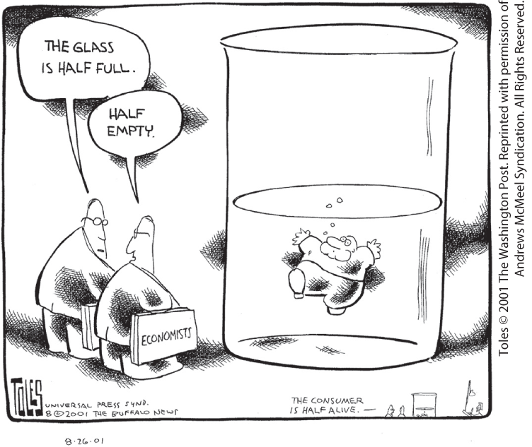

### Positive versus Normative Economics

Imagine that you are an economic adviser to the governor of your state. What kinds of questions might the governor ask you to answer?

Well, here are three possible questions:

1.  How much revenue will the tolls on the state turnpike yield next year?
2.  How much would that revenue increase if the toll were raised from \$1 to \$1.50?
3.  Should the toll be raised, bearing in mind that a toll increase will reduce traffic and air pollution near the road but will impose some financial hardship on frequent commuters?

There is a big difference between the first two questions and the third one. The first two are questions about facts. Your forecast of next year’s toll collection will be proved right or wrong when the numbers actually come in. Your estimate of the impact of a change in the toll is a little harder to check — revenue depends on other factors besides the toll, and it may be hard to disentangle the causes of any change in revenue. Still, in principle there is only one right answer.

But the question of whether tolls should be raised may not have a “right” answer — two people who agree on the effects of a higher toll could still disagree about whether raising the toll is a good idea. For example, someone who lives near the turnpike but doesn’t commute on it will care a lot about noise and air pollution but not so much about commuting costs. A regular commuter who doesn’t live near the turnpike will have the opposite priorities.

This example highlights a key distinction between two roles of economic analysis. Analysis that tries to answer questions about the way the world works, which have definite right and wrong answers, is known as <a href="#kru_9781319245269_EM_glossary.xhtml#pau_9781319320164_ApZR5Gy5AF" id="kru_9781319245269_ch02_05.xhtml#pau_9781319320164_qa2k3hPnu9" class="glossref" role="doc-glossref">positive economics</a>. In contrast, analysis that involves saying how the world *should* work is known as <a href="#kru_9781319245269_EM_glossary.xhtml#pau_9781319320164_oB2OgAhFiv" id="kru_9781319245269_ch02_05.xhtml#pau_9781319320164_ec1cv8wRY1" class="glossref" role="doc-glossref">normative economics</a>. To put it another way, positive economics is about description; normative economics is about prescription.

<aside aria-label="title1" class="glossary c3 main-flow v1" epub:type="glossary" id="pau_9781319320164_DrIFxD8vbD">

**positive economics**  
**Positive economics** is the branch of economic analysis that describes the way the economy actually works.

</aside>
<aside aria-label="title2" class="glossary c3 main-flow v1" epub:type="glossary" id="pau_9781319320164_qlm7HxbcU1">

**normative economics**  
**Normative economics** makes prescriptions about the way the economy should work.

</aside>

Positive economics occupies most of the time and effort of the economics profession. And models play a crucial role in almost all positive economics. As we mentioned earlier, the U.S. government uses a computer model to assess proposed changes in national tax policy, and many state governments have similar models to assess the effects of their own tax policy.

It’s worth noting that there is a subtle but important difference between the first and second questions we imagined the governor asking. <a href="#kru_9781319245269_ch02_05.xhtml#pau_9781319320164_k2zkqhqKiE" id="kru_9781319245269_ch02_05.xhtml#pau_9781319320164_GIIS19nVss" class="crossref">Question 1</a> asked for a simple prediction about next year’s revenue — a <a href="#kru_9781319245269_EM_glossary.xhtml#pau_9781319320164_pkELEcXpOE" id="kru_9781319245269_ch02_05.xhtml#pau_9781319320164_jFyHdYc9cK" class="glossref" role="doc-glossref">forecast</a>. <a href="#kru_9781319245269_ch02_05.xhtml#pau_9781319320164_G05A92NXvw" id="kru_9781319245269_ch02_05.xhtml#pau_9781319320164_5qoRjrxXTb" class="crossref">Question 2</a> was a “what if” question, asking how revenue would change if the tax law were changed. Economists are often called upon to answer both types of questions, but models are especially useful for answering “what if” questions.

<aside aria-label="title3" class="glossary c3 main-flow v1" epub:type="glossary" id="pau_9781319320164_khG7dccR79">

**forecast**  
A **forecast** is a simple prediction of the future.

</aside>

The answers to such questions often serve as a guide to policy, but they are still predictions, not prescriptions. That is, they tell you what will happen if a policy were changed; they don’t tell you whether or not that result is good.

Suppose your economic model tells you that the governor’s proposed increase in highway tolls will raise property values in communities near the road but will hurt people who must use the turnpike to get to work. Does that make this proposed toll increase a good idea or a bad one? It depends on whom you ask. As we’ve just seen, someone who is very concerned with the communities near the road will support the increase, but someone who is very concerned with the welfare of drivers will feel differently. That’s a value judgment — it’s not a question of economic analysis.

Still, economists often do engage in normative economics and give policy advice. How can they do this when there may be no “right” answer?

One answer is that economists are also citizens, and we all have our opinions. But economic analysis can often be used to show that some policies are clearly better than others, regardless of anyone’s opinions.

Suppose that policies A and B achieve the same goal, but policy A makes everyone better off than policy B — or at least makes some people better off without making other people worse off. Then A is clearly more efficient than B. That’s not a value judgment: we’re talking about how best to achieve a goal, not about the goal itself.

For example, two different policies have been used to help low-income families obtain housing: rent control, which limits the rents landlords are allowed to charge, and rent subsidies, which provide families with additional money to pay rent. Almost all economists agree that subsidies are the more efficient policy. And so the great majority of economists, whatever their personal politics, favor subsidies over rent control.

When policies can be clearly ranked in this way, then economists generally agree. But it is no secret that economists sometimes disagree.

## When and Why Economists Disagree

Economists have a reputation for arguing with each other. Where does this reputation come from, and is it justified?

<figure id="pau_9781319320164_VwlKIwUGuk" class="figure lm_img_lightbox unnum c2 right">

</figure>

<aside class="hidden" id="pau_9781319320164_DZLX853BS7" title="hidden">

Two economists are watching a man who appears to be drowning in a large glass of water. One says, ‘The glass is half full,’ while the other says, ‘Half empty.’ The bottom right corner shows the same sketch in a less magnified version, and the text reads, The consumer is half alive.

</aside>

One important answer is that media coverage tends to exaggerate the real differences in views among economists. If nearly all economists agree on an issue — for example, the proposition that rent controls lead to housing shortages — reporters and editors are likely to conclude that it’s not a story worth covering, leaving the professional consensus unreported. But an issue on which prominent economists take opposing sides — for example, whether cutting taxes right now would help the economy — makes a news story worth reporting. So you hear much more about the areas of disagreement within economics than you do about the large areas of agreement.

It is also worth remembering that economics is, unavoidably, often tied up in politics. On a number of issues powerful interest groups know what opinions they want to hear; they therefore have an incentive to find and promote economists who profess those opinions, giving these economists a prominence and visibility out of proportion to their support among their colleagues.

While the appearance of disagreement among economists exceeds the reality, it remains true that economists often *do* disagree about important things. For example, some well-respected economists argue vehemently that the U.S. government should replace the income tax with a *value-added tax* (a national sales tax, which is the main source of government revenue in many European countries). Other equally respected economists disagree. Why this difference of opinion?

One important source of differences lies in values: as in any diverse group of individuals, reasonable people can differ. In comparison to an income tax, a value-added tax typically falls more heavily on people of modest means. So an economist who values a society with more social and income equality for its own sake will tend to oppose a value-added tax. An economist with different values will be less likely to oppose it.

A second important source of differences arises from economic modeling. Because economists base their conclusions on models, which are simplified representations of reality, two economists can legitimately disagree about which simplifications are appropriate — and therefore arrive at different conclusions.

Suppose that the U.S. government were considering introducing a value-added tax. Economist A may rely on a model that focuses on the administrative costs of tax systems — that is, the costs of monitoring, processing papers, collecting the tax, and so on. This economist might then point to the well-known high costs of administering a value-added tax and argue against the change. But economist B may think that the right way to approach the question is to ignore the administrative costs and focus on how the proposed law would change savings behavior. This economist might point to studies suggesting that value-added taxes promote higher consumer saving, a desirable result.

Because the economists have used different models — that is, made different simplifying assumptions — they arrive at different conclusions. And so the two economists may find themselves on different sides of the issue.

### ECONOMICS \>\> *in Action*

When Economists Agree

“If all the economists in the world were laid end to end, they still couldn’t reach a conclusion,” goes an economist joke. But do economists really disagree that much? Not according to an ongoing survey. The Booth School of Business at the University of Chicago has assembled a panel of 51 economists, all with exemplary professional reputations, representing a mix of regions, schools, and political affiliations. They are regularly polled on questions of policy or political interest, often ones on which there are bitter divides among politicians or the general public.

<figure id="pau_9781319320164_V1EBhYmi86" class="figure lm_img_lightbox unnum c2 right">

<figcaption>
These four economists are on the panel (clockwise from top left): Cecilia Rouse of Princeton, David Cutler of Harvard, Hilary Hoynes of UC Berkeley, and Raj Chetty of Harvard.
</figcaption>
</figure>

<aside class="hidden" id="pau_9781319320164_shyqh84Vpy" title="hidden">

The photos, clockwise from top left, are as follows: Cecilia Rouse of Princeton, David Cutler of Harvard, Hilary Hoynes of U C Berkeley, and Raj Chetty of Harvard.

</aside>

Yet the survey shows much more agreement among economists than rumor would have it, even on supposedly controversial topics. For example, 85% of the panel agreed that trade with China makes most Americans better off and nearly the same percentage agreed that Americans who work in the production of competing goods, like clothing, are made worse off by trade with China. Roughly the same percentage (82%) disagreed with the proposition that rent control increases the supply of quality, affordable housing.

In the first case, the panel overwhelmingly agreed with a position widely considered liberal in American politics, while in the second case they agreed with one widely considered politically conservative.

Disagreements tended to involve untested economic policies. There was, for example, an almost even split over whether new policies adopted by the Federal Reserve aimed at boosting the economy during the deep recession of 2007 to 2009 would work. Ideology played a limited role in these disagreements: Economists known to be liberals did have slightly different positions, on average, from those known to be conservatives, but the differences weren’t nearly as large as those among the general public.

So economists do disagree quite a lot on some issues, especially in macroeconomics. But there is a large area of common ground.

### *\>\> Quick Review*

- **Positive economics** — the focus of most economic research — is the analysis of the way the world works, in which there are definite right and wrong answers. It often involves making **forecasts. Normative economics**, which makes prescriptions about how things *ought to be,* inevitably involves value judgments.
- Economists do disagree — though not as much as legend has it — for two main reasons. One, they may disagree about which simplifications to make in a model. Two, economists may disagree — like everyone else — about values.

### *\>\> Check Your Understanding* 2-2

1.  Which of the following is a positive statement? Which is a normative statement?
    1.  Society should take measures to prevent people from engaging in dangerous personal behavior.
    2.  People who engage in dangerous personal behavior impose higher costs on society through higher medical costs.
2.  True or false? Explain your answer.
    1.  Policy choice A and policy choice B attempt to achieve the same social goal. Policy choice A, however, results in a much less efficient use of resources than policy choice B. Therefore, economists are more likely to agree on choosing policy choice B.
    2.  When two economists disagree on the desirability of a policy, it’s typically because one of them has made a mistake.

## Business case 

Efficiency, Opportunity Cost, and the Logic of Lean Production

<figure id="pau_9781319320164_15ynDAe5AZ" class="figure lm_img_lightbox unnum c2 right">

</figure>

In January 2020, the Boeing 777X, an update to the widely popular 777, took its maiden flight. The 777X was the product of what Boeing calls its *advanced manufacturing* process. With it, Boeing extended its extremely successful process known as *lean production* to newer production methods, such as robotics.

Lean manufacturing, pioneered by Toyota Motors of Japan, is based on the practice of having parts arrive on the factory floor just as they are needed for production. This reduces the amount of parts Boeing holds in inventory as well as the amount of the factory floor needed for production. To help move from lean production to advanced manufacturing Boeing has turned to Toyota, hiring some of their top engineers.

Boeing first adopted lean manufacturing in 1999 in the manufacture of the 737, the most popular commercial airplane. By 2005, after constant refinement, it achieved a 50% reduction in the time it takes to produce a plane and a nearly 60% reduction in parts inventory. An important feature is a continuously moving assembly line, moving products from one assembly team to the next at a steady pace and eliminating the need for workers to wander across the factory floor from task to task or in search of tools and parts.

Toyota’s lean production techniques have been the most widely adopted, revolutionizing manufacturing worldwide. In simple terms, lean production is focused on organization and communication. Workers and parts are organized so as to ensure a smooth and consistent workflow that minimizes wasted effort and materials. Lean production is also designed to be highly responsive to changes in the desired mix of output — for example, quickly producing more SUVs and fewer sedans according to changes in customer demand.

Toyota’s methods were so successful that they transformed the global auto industry and severely threatened once-dominant American automakers. Until the 1980s, the “Big Three” — Chrysler, Ford, and General Motors — dominated the American auto industry, with virtually no foreign-made cars sold in the United States. In the 1980s, however, Toyotas became increasingly popular due to their high quality and relatively low price — so popular that the Big Three eventually prevailed upon the U.S. government to protect them by restricting the sale of Japanese autos in the United States. Over time, Toyota responded by building assembly plants in the United States, bringing along its lean production techniques, which then spread throughout American manufacturing.

<aside class="assessments c3 main-flow v1" epub:type="assessments" id="pau_9781319320164_uCcH00CQIr">

### Questions for thought

1.  What is the opportunity cost associated with having a worker wander across the factory floor from task to task or in search of tools and parts?
2.  Explain how lean manufacturing improves the economy’s efficiency in allocation.
3.  Before lean manufacturing innovations, Japan mostly sold consumer electronics to the United States. How did lean manufacturing innovations alter Japan’s comparative advantage vis-à-vis the United States?
4.  How do you think the shift in the location of Toyota’s production from Japan to the United States has altered the pattern of comparative advantage in automaking between the two countries?

</aside>

### Summary

1.  Almost all economics is based on **models**, “thought experiments” or simplified versions of reality, many of which use mathematical tools such as graphs. An important assumption in economic models is the **other things equal assumption**, which allows analysis of the effect of a change in one factor by holding all other relevant factors unchanged.
2.  One important economic model is the **production possibility frontier.** It illustrates *opportunity cost* (showing how much less of one good can be produced if more of the other good is produced); *efficiency* (an economy is efficient in production if it produces on the production possibility frontier and efficient in allocation if it produces the mix of goods and services that people want to consume); and *economic growth* (an outward shift of the production possibility frontier). There are two basic sources of growth: an increase in **factors of production** — resources such as land, labor, capital, and human capital, inputs that are not used up in production — and improved **technology.**
3.  Another important model is **comparative advantage**, which explains the source of gains from trade between individuals and countries. Everyone has a comparative advantage in something — some good or service in which that person has a lower opportunity cost than everyone else. But it is often confused with **absolute advantage**, an ability to produce a particular good or service better than anyone else. This confusion leads some to erroneously conclude that there are no gains from trade between people or countries.
4.  In the simplest economies people **barter** — trade goods and services for one another — rather than trade them for money, as in a modern economy. The **circular-flow diagram** represents transactions within the economy as flows of goods, services, and money between **households** and **firms.** These transactions occur in **markets for goods and services** and **factor markets**, markets for factors of production — land, labor, physical capital, and human capital. The circular-flow diagram is useful in understanding how spending, production, employment, income, and growth are related in the economy. Ultimately, factor markets determine the economy’s **income distribution**, how an economy’s total income is allocated to the owners of the factors of production.
5.  Economists use economic models for both **positive economics**, which describes how the economy works, and for **normative economics**, which prescribes how the economy *should* work. Positive economics often involves making **forecasts.** Economists can determine correct answers for positive questions but typically not for normative questions, which involve value judgments. The exceptions are when policies designed to achieve a certain objective can be clearly ranked in terms of efficiency.
6.  There are two main reasons economists disagree. One, they may disagree about which simplifications to make in a model. Two, economists may disagree — like everyone else — about values.

### Key Terms

- <a href="#kru_9781319245269_ch02_02.xhtml#pau_9781319320164_CAcpipu2Td" id="kru_9781319245269_ch02_08.xhtml#pau_9781319320164_3ScPZ4L6T9" class="crossref">Model</a>
- <a href="#kru_9781319245269_ch02_02.xhtml#pau_9781319320164_QC7W4MvQeS" id="kru_9781319245269_ch02_08.xhtml#pau_9781319320164_gC887c4yAx" class="crossref">Other things equal assumption</a>
- <a href="#kru_9781319245269_ch02_02.xhtml#pau_9781319320164_ZdntxLr09c" id="kru_9781319245269_ch02_08.xhtml#pau_9781319320164_hOg9qFKoKH" class="crossref">Production possibility frontier</a>
- <a href="#kru_9781319245269_ch02_02.xhtml#pau_9781319320164_NVp0PUY7Mb" id="kru_9781319245269_ch02_08.xhtml#pau_9781319320164_zM5W5S8nlm" class="crossref">Factors of production</a>
- <a href="#kru_9781319245269_ch02_02.xhtml#pau_9781319320164_aPNWtrZnqx" id="kru_9781319245269_ch02_08.xhtml#pau_9781319320164_2gntjKSv8n" class="crossref">Technology</a>
- <a href="#kru_9781319245269_ch02_02.xhtml#pau_9781319320164_onztvU3SxD" id="kru_9781319245269_ch02_08.xhtml#pau_9781319320164_7XDXAO53Uh" class="crossref">Comparative advantage</a>
- <a href="#kru_9781319245269_ch02_02.xhtml#pau_9781319320164_5rj31FPc7j" id="kru_9781319245269_ch02_08.xhtml#pau_9781319320164_AcOyuaH9pf" class="crossref">Absolute advantage</a>
- <a href="#kru_9781319245269_ch02_04.xhtml#pau_9781319320164_L0LqmaQgrj" id="kru_9781319245269_ch02_08.xhtml#pau_9781319320164_eobqhIKa4a" class="crossref">Barter</a>
- <a href="#kru_9781319245269_ch02_04.xhtml#pau_9781319320164_ziHsrzLXaG" id="kru_9781319245269_ch02_08.xhtml#pau_9781319320164_GwdfxEpKWO" class="crossref">Circular-flow diagram</a>
- <a href="#kru_9781319245269_ch02_04.xhtml#pau_9781319320164_8IVnpDd5fb" id="kru_9781319245269_ch02_08.xhtml#pau_9781319320164_07EPadTLdA" class="crossref">Household</a>
- <a href="#kru_9781319245269_ch02_04.xhtml#pau_9781319320164_U7hmhxaeEE" id="kru_9781319245269_ch02_08.xhtml#pau_9781319320164_SAOPtFYaDU" class="crossref">Firm</a>
- <a href="#kru_9781319245269_ch02_04.xhtml#pau_9781319320164_4d9KZHYMmr" id="kru_9781319245269_ch02_08.xhtml#pau_9781319320164_le6VRIEPhx" class="crossref">Markets for goods and services</a>
- <a href="#kru_9781319245269_ch02_04.xhtml#pau_9781319320164_gFek1JoH49" id="kru_9781319245269_ch02_08.xhtml#pau_9781319320164_PiHSHLjN3q" class="crossref">Factor markets</a>
- <a href="#kru_9781319245269_ch02_04.xhtml#pau_9781319320164_q1JgIkHqFb" id="kru_9781319245269_ch02_08.xhtml#pau_9781319320164_AJtGTnRMO9" class="crossref">Income distribution</a>
- <a href="#kru_9781319245269_ch02_05.xhtml#pau_9781319320164_qa2k3hPnu9" id="kru_9781319245269_ch02_08.xhtml#pau_9781319320164_ZqlrGPOukp" class="crossref">Positive economics</a>
- <a href="#kru_9781319245269_ch02_05.xhtml#pau_9781319320164_ec1cv8wRY1" id="kru_9781319245269_ch02_08.xhtml#pau_9781319320164_u6zu9pjS4o" class="crossref">Normative economics</a>
- <a href="#kru_9781319245269_ch02_05.xhtml#pau_9781319320164_jFyHdYc9cK" id="kru_9781319245269_ch02_08.xhtml#pau_9781319320164_8W1YdrL0Ey" class="crossref">Forecast</a>

### Practice questions

1.  Penelope Pundit, an economics reporter, states that the European Union (EU) is increasing its productivity very rapidly in all industries. She claims that this productivity advance is so rapid that output from the EU in these industries will soon exceed that of the United States and, as a result, the United States will no longer benefit from trade with the EU.
    1.  Do you think Penelope Pundit is correct or not? If not, what do you think is the source of her mistake?
    2.  If the EU and the United States continue to trade, what do you think will characterize the goods that the EU sells to the United States and the goods that the United States sells to the EU?
2.  The inhabitants of the fictional economy of Atlantis use money in the form of cowry shells. Draw a circular-flow diagram showing households and firms. Firms produce potatoes and fish, and households buy potatoes and fish. Households also provide the land and labor to firms. Identify where in the flows of cowry shells or physical things (goods and services, or resources) each of the following impacts would occur. Describe how this impact spreads around the circle.
    1.  A devastating hurricane floods many of the potato fields.
    2.  A very productive fishing season yields a very large number of fish caught.
    3.  The inhabitants of Atlantis discover Shakira and spend several days a month at dancing festivals.
3.  An economist might say that colleges and universities “produce” education, using faculty members and students as inputs. According to this line of reasoning, education is then “consumed” by households. Construct a circular-flow diagram to represent the sector of the economy devoted to college education: colleges and universities represent firms, and households both consume education and provide faculty and students to universities. What are the relevant markets in this diagram? What is being bought and sold in each direction? What would happen in the diagram if the government decided to subsidize 50% of all college students’ tuition?
4.  A representative of the American clothing industry made the following statement: “Workers in Asia often work in sweatshop conditions earning only pennies an hour. American workers are more productive and as a result earn higher wages. In order to preserve the dignity of the American workplace, the government should enact legislation banning imports of low-wage Asian clothing.”
    1.  Which parts of this quote are positive statements? Which parts are normative statements?
    2.  Is the policy that is being advocated consistent with the preceding statements about the wages and productivities of American and Asian workers?
    3.  Would such a policy make some Americans better off without making any other Americans worse off? That is, would this policy be efficient from the viewpoint of all Americans?
    4.  Would Asian workers earning low wages benefit from or be hurt by such a policy?
5.  Evaluate the following statement: “It is easier to build an economic model that accurately reflects events that have already occurred than to build an economic model to forecast future events.” Do you think this is true or not? Why? What does this imply about the difficulties of building good economic models?
6.  Economists who work for the government are often called on to make policy recommendations. Why do you think it is important for the public to be able to differentiate normative statements from positive statements in these recommendations?

### Problems

1.  Two important industries on the island of Bermuda are fishing and tourism. According to data from the Food and Agriculture Organization of the United Nations and the Bermuda Department of Statistics, in 2014 the 315 registered fishermen in Bermuda caught 497 metric tons of marine fish. And the 2,446 people employed by hotels produced 580,209 hotel stays (measured by the number of visitor arrivals). Suppose that this production point is efficient in production. Assume also that the opportunity cost of 1 additional metric ton of fish is 2,000 hotel stays and that this opportunity cost is constant (the opportunity cost does not change).
    1.  If all 315 registered fishermen were to be employed by hotels (in addition to the 2,446 people already working in hotels), how many hotel stays could Bermuda produce?
    2.  If all 2,446 hotel employees were to become fishermen (in addition to the 315 fishermen already working in the fishing industry), how many metric tons of fish could Bermuda produce?
    3.  Draw a production possibility frontier for Bermuda, with fish on the horizontal axis and hotel stays on the vertical axis, and label Bermuda’s actual production point for 2014.
2.  According to data from the U.S. Department of Agriculture’s National Agricultural Statistics Service, 124 million acres of land in the United States were used for wheat or corn farming in a recent year. Of those 124 million acres, farmers used 50 million acres to grow 2.158 billion bushels of wheat and 74 million acres to grow 11.807 billion bushels of corn. Suppose that U.S. wheat and corn farming is efficient in production. At that production point, the opportunity cost of producing 1 additional bushel of wheat is 1.7 fewer bushels of corn. However, because farmers have increasing opportunity costs, additional bushels of wheat have an opportunity cost greater than 1.7 bushels of corn. For each of the following production points, decide whether that production point is (i) feasible and efficient in production, (ii) feasible but not efficient in production, (iii) not feasible, or (iv) unclear as to whether or not it is feasible.
    1.  Farmers use 40 million acres of land to produce 1.8 billion bushels of wheat, and they use 60 million acres of land to produce 9 billion bushels of corn. The remaining 24 million acres are left unused.
    2.  From their original production point, farmers transfer 40 million acres of land from corn to wheat production. They now produce 3.158 billion bushels of wheat and 10.107 bushels of corn.
    3.  Farmers reduce their production of wheat to 2 billion bushels and increase their production of corn to 12.044 billion bushels. Along the production possibility frontier, the opportunity cost of going from 11.807 billion bushels of corn to 12.044 billion bushels of corn is 0.666 bushel of wheat per bushel of corn.
3.  In the ancient country of Roma, only two goods, spaghetti and meatballs, are produced. There are two tribes in Roma, the Tivoli and the Frivoli. By themselves, the Tivoli each month can produce either 30 pounds of spaghetti and no meatballs, or 50 pounds of meatballs and no spaghetti, or any combination in between. The Frivoli, by themselves, each month can produce 40 pounds of spaghetti and no meatballs, or 30 pounds of meatballs and no spaghetti, or any combination in between.
    1.  Assume that all production possibility frontiers are straight lines. Draw one diagram showing the monthly production possibility frontier for the Tivoli and another showing the monthly production possibility frontier for the Frivoli. Show how you calculated them.

    2.  Which tribe has the comparative advantage in spaghetti production? In meatball production?

        In a.d. 100 the Frivoli discover a new technique for making meatballs that doubles the quantity of meatballs they can produce each month.

    3.  Draw the new monthly production possibility frontier for the Frivoli.

    4.  After the innovation, which tribe now has an absolute advantage in producing meatballs? In producing spaghetti? Which has the comparative advantage in meatball production? In spaghetti production?
4.  One July, the United States sold aircraft worth \$1 billion to China and bought aircraft worth only \$19,000 from China. During the same month, however, the United States bought \$83 million worth of men’s pants, shorts, and jeans from China but sold only \$8,000 worth of pants, shorts, and jeans to China. Using what you have learned about how trade is determined by comparative advantage, answer the following questions.
    1.  Which country has the comparative advantage in aircraft production? In production of pants, shorts, and jeans?
    2.  Can you determine which country has the absolute advantage in aircraft production? In production of pants, shorts, and jeans?
5.  You are in charge of allocating residents to your dormitory’s baseball and basketball teams. You are down to the last four people, two of whom must be allocated to baseball and two to basketball. The accompanying table gives each person’s batting average and free-throw average.
    |          |                     |                        |
    |----------|---------------------|------------------------|
    | **Name** | **Batting average** | **Free-throw average** |
    | Taylor   | 70%                 | 60%                    |
    | Nico     | 50%                 | 50%                    |
    | Annie    | 10%                 | 30%                    |
    | Ryan     | 80%                 | 70%                    |

    1.  Explain how you would use the concept of comparative advantage to allocate the players. Begin by establishing each player’s opportunity cost of free throws in terms of batting average.
    2.  Why is it likely that the other basketball players will be unhappy about this arrangement but the other baseball players will be satisfied? Nonetheless, why would an economist say that this is an efficient way to allocate players for your dorm’s sports teams?
6.  Your roommate plays loud music most of the time; you, however, would prefer more peace and quiet. You suggest that she buy some headphones. She responds that although she would be happy to use headphones, she has many other things that she would prefer to spend her money on right now. You discuss this situation with a friend who is an economics major. The following exchange takes place:
    - *Friend: How much would it cost to buy headphones?*
    - *You: \$15.*
    - *Friend: How much do you value having some peace and quiet for the rest of the semester?*
    - *You: \$30.*
    - *Friend: It is efficient for you to buy the headphones and give them to your roommate. You gain more than you lose; the benefit exceeds the cost. You should do that.*
    - *You: It just isn’t fair that I have to pay for the headphones when I’m not the one making the noise.*

    1.  Which parts of this conversation contain positive statements and which parts contain normative statements?
    2.  Construct an argument supporting your viewpoint that your roommate should be the one to change her behavior. Similarly, construct an argument from the viewpoint of your roommate that you should be the one to buy the headphones. If your dormitory has a policy that gives residents the unlimited right to play music, whose argument is likely to win? If your dormitory has a rule that a person must stop playing music whenever a roommate complains, whose argument is likely to win?
7.  Are the following statements true or false? Explain your answers.
    1.  “When people must pay higher taxes on their wage earnings, it reduces their incentive to work” is a positive statement.
    2.  “We should lower taxes to encourage more work” is a positive statement.
    3.  Economics cannot always be used to completely decide what society ought to do.
    4.  “The system of public education in this country generates greater benefits to society than the cost of running the system” is a normative statement.
    5.  All disagreements among economists are generated by the media.
8.  The mayor of Gotham City, worried about a potential epidemic of deadly influenza this winter, asks an economic adviser the following series of questions. Determine whether a question requires the economic adviser to make a positive assessment or a normative assessment.
    1.  How much vaccine will be in stock in the city by the end of November?
    2.  If we offer to pay 10% more per dose to the pharmaceutical companies providing the vaccines, will they provide additional doses?
    3.  If there is a shortage of vaccine in the city, whom should we vaccinate first — the elderly or the very young? (Assume that a person from one group has an equal likelihood of dying from influenza as a person from the other group.)
    4.  If the city charges \$25 per shot, how many people will pay?
    5.  If the city charges \$25 per shot, it will make a profit of \$10 per shot, money that can go to pay for inoculating poor people. Should the city engage in such a scheme?

 **Work It Out**

9.  Atlantis is a small, isolated island in the South Atlantic. The inhabitants grow potatoes and catch fish. The accompanying table shows the maximum annual output combinations of potatoes and fish that can be produced. Obviously, given their limited resources and available technology, as they use more of their resources for potato production, there are fewer resources available for catching fish.
    | Maximum annual output options | Quantity of potatoes (pounds) | Quantity of fish (pounds) |
    |-------------------------------|-------------------------------|---------------------------|
    | *A*                           | 1,000                         | 0                         |
    | *B*                           | 800                           | 300                       |
    | *C*                           | 600                           | 500                       |
    | *D*                           | 400                           | 600                       |
    | *E*                           | 200                           | 650                       |
    | *F*                           | 0                             | 675                       |

    1.  Draw a production possibility frontier with potatoes on the horizontal axis and fish on the vertical axis illustrating these options, showing points *A–F.*
    2.  Can Atlantis produce 500 pounds of fish and 800 pounds of potatoes? Explain. Where would this point lie relative to the production possibility frontier?
    3.  What is the opportunity cost of increasing the annual output of potatoes from 600 to 800 pounds?
    4.  What is the opportunity cost of increasing the annual output of potatoes from 200 to 400 pounds?
    5.  Can you explain why the answers to parts c and d are not the same? What does this imply about the slope of the production possibility frontier? 

## Chapter 2 Appendix Graphs in Economics

### Getting the Picture

When reading about economics in the *Wall Street Journal* or in your economics textbook, you will see many graphs. Visual images can make it much easier to understand verbal descriptions, numerical information, or ideas. In economics, graphs are the type of visual image used to facilitate understanding. So, you need to be familiar with how to interpret and construct these visual aids. This appendix explains how to do this.

### Graphs, Variables, and Economic Models

One reason to attend college is that a bachelor’s degree provides access to higher paying jobs. Additional degrees, such as MBAs or law degrees, increase earnings even more. If you were to read an article about the relationship between educational attainment and income, you would probably see a graph showing the income levels for workers with different amounts of education. And this graph would depict the idea that, in general, more education increases income.

This graph, like most of those in economics, would depict the relationship between two economic variables. A <a href="#kru_9781319245269_EM_glossary.xhtml#pau_9781319320164_olXmX4jcDg" id="kru_9781319245269_ch02_app.xhtml#pau_9781319320164_WpvTUDpVPy" class="glossref" role="doc-glossref">variable</a> is a quantity that can take on more than one value, such as the number of years of education a person has, the price of a can of soda, or a household’s income.

<aside aria-label="title1" class="glossary c3 main-flow v1" epub:type="glossary" id="pau_9781319320164_GgLT0J80Kp">

**variable**  
A quantity that can take on more than one value is called a **variable.**

</aside>

As you learned in <a href="#kru_9781319245269_ch02_01.xhtml#pau_9781319320164_uuuTxO7RlK" id="kru_9781319245269_ch02_app.xhtml#pau_9781319320164_co7KhwOcrK" class="crossref">Chapter 2</a>, economic analysis relies heavily on *models,* simplified descriptions of real situations. Most economic models describe the relationship between two variables, simplified by holding constant other variables that may affect the relationship.

For example, an economic model might describe the relationship between the price of a can of soda and the number of cans of soda that consumers will buy, assuming that everything else affecting consumers’ purchases of soda stays constant. This type of model can be described mathematically or verbally, but illustrating the relationship in a graph makes it easier to understand, as you’ll see next.

### How Graphs Work

Most graphs in economics are based on a grid built around two perpendicular lines that show the values of two variables, helping you visualize the relationship between them. Let’s see how this works.
