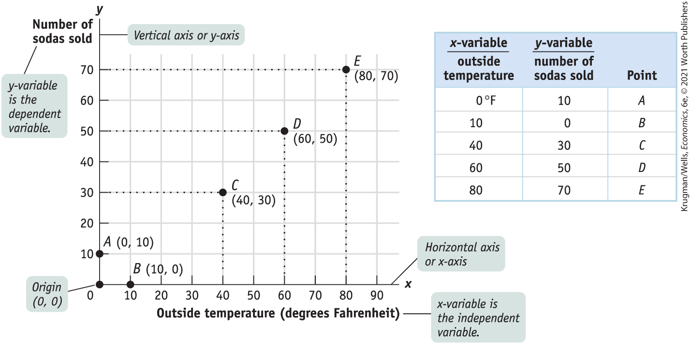
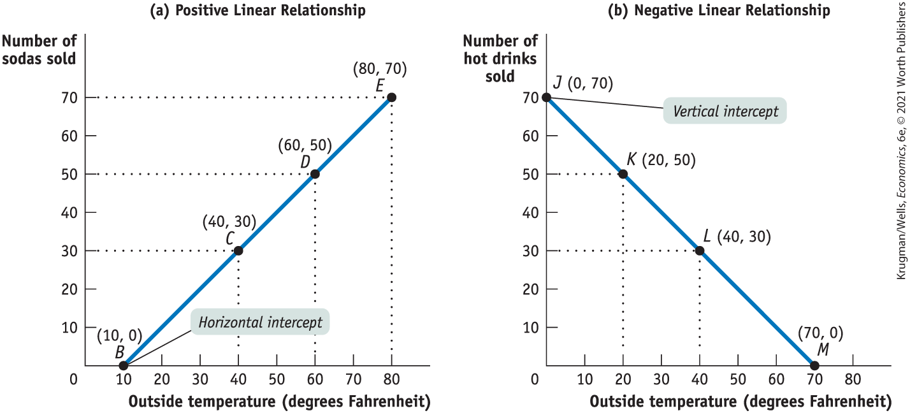
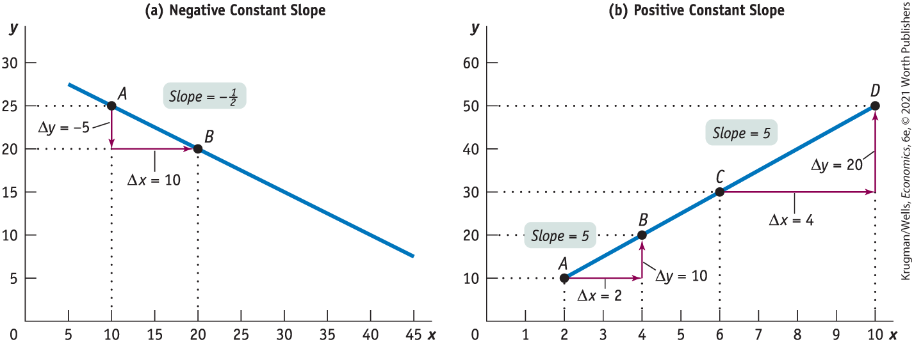
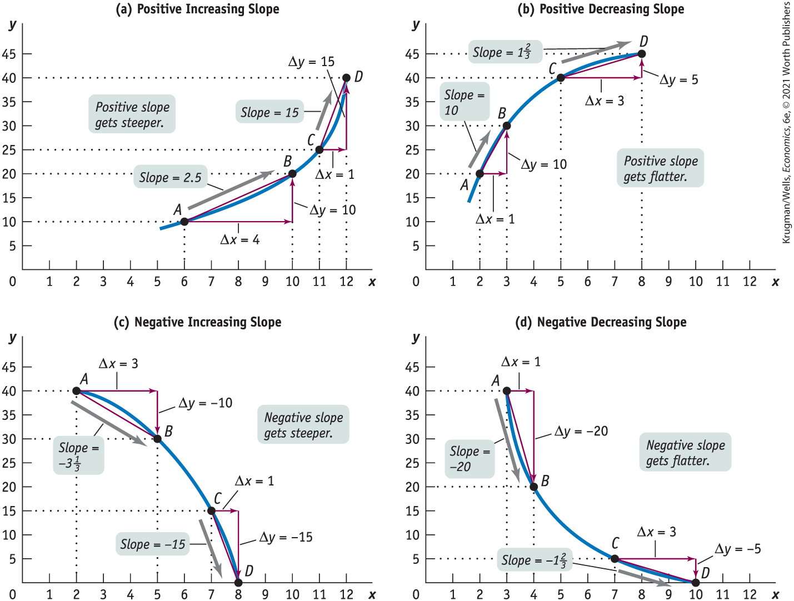

#### Two-Variable Graphs

<a href="#kru_9781319245269_ch02_app.xhtml#pau_9781319320164_H3NWwnxBus" id="kru_9781319245269_ch02_app.xhtml#pau_9781319320164_VAwTgyATJk" class="crossref">Figure 2A-1</a> shows a typical two-variable graph. It illustrates the data in the accompanying table on outside temperature and the number of sodas a typical vendor can expect to sell at a baseball stadium during one game. The first column shows the values of outside temperature (the first variable) and the second column shows the values of the number of sodas sold (the second variable). Five combinations or pairs of the two variables are shown, each denoted by *A* through *E* in the third column.

<figure id="pau_9781319320164_H3NWwnxBus" class="figure lm_img_lightbox num c4 main-flow">

<figcaption>
FIGURE 2A-1 Plotting Points on a Two-Variable Graph

The data from the table are plotted where outside temperature (the independent variable) is measured along the horizontal axis and number of sodas sold (the dependent variable) is measured along the vertical axis. Each of the five combinations of temperature and sodas sold is represented by a point: <em>A, B, C, D,</em> and <em>E.</em> Each point in the graph is identified by a pair of values. For example, point <em>C</em> corresponds to the pair (40, 30)—an outside temperature of 40°F (the value of the <em>x</em>-variable) and 30 sodas sold (the value of the <em>y</em>-variable).
</figcaption>
</figure>

<aside class="hidden" id="pau_9781319320164_2ty1f8t49z" title="hidden">

The table lists the points, x-variable (outside temperature), and y-variable (number of sodas sold), respectively, as follows.Point A: 0 degrees Fahrenheit; 10 sodas.Point B: 10 degrees Fahrenheit; 0 sodas.Point C: 40 degrees Fahrenheit; 30 sodas.Point D: 60 degree Fahrenheit; 50 sodas.Point E: 80 degree Fahrenheit; 70 sodas.A label on the graph, pointing to Outside temperature (degrees Fahrenheit) along the horizontal axis reads, x-variable is independent variable. Another label on the graph, pointing to Number of sodas sold along the vertical axis reads, y-variable is the dependent variable.

</aside>

Now let’s turn to graphing the data in this table. In any two-variable graph, one variable is called the *x*-variable and the other is called the *y*-variable. Here we have made outside temperature the *x*-variable and number of sodas sold the *y*-variable. The solid horizontal line in the graph is called the <a href="#kru_9781319245269_EM_glossary.xhtml#pau_9781319320164_FOqYfatWjV" id="kru_9781319245269_ch02_app.xhtml#pau_9781319320164_iqZ7J0huBw" class="glossref" role="doc-glossref">horizontal axis</a> or <a href="#kru_9781319245269_EM_glossary.xhtml#pau_9781319320164_FOqYfatWjV" id="kru_9781319245269_ch02_app.xhtml#pau_9781319320164_fAZe2bkgbE" class="glossref" role="doc-glossref"><em>x</em>-axis</a>, and values of the *x*-variable — outside temperature — are measured along it. Similarly, the solid vertical line in the graph is called the <a href="#kru_9781319245269_EM_glossary.xhtml#pau_9781319320164_Dso0acmGsH" id="kru_9781319245269_ch02_app.xhtml#pau_9781319320164_fASw0Pgb9t" class="glossref" role="doc-glossref">vertical axis</a> or <a href="#kru_9781319245269_EM_glossary.xhtml#pau_9781319320164_Dso0acmGsH" id="kru_9781319245269_ch02_app.xhtml#pau_9781319320164_lujFpXrYK1" class="glossref" role="doc-glossref"><em>y</em>-axis</a>, and values of the *y*-variable — number of sodas sold — are measured along it.

<aside aria-label="title2" class="glossary c3 main-flow v1" epub:type="glossary" id="pau_9781319320164_jfTpmlQNHD">

**horizontal axis, *x*-axis, vertical axis, *y*-axis, origin**  
The line along which values of the *x*-variable are measured is called the **horizontal axis** or ***x*-axis:** The line along which values of the *y*-variable are measured is called the **vertical axis** or ***y*-axis:** The point where the axes of a two-variable graph meet is the **origin.**

</aside>

At the <a href="#kru_9781319245269_EM_glossary.xhtml#pau_9781319320164_nwh8ROn05n" id="kru_9781319245269_ch02_app.xhtml#pau_9781319320164_1mClEM2tQd" class="glossref" role="doc-glossref">origin</a>, the point where the two axes meet, each variable is equal to zero. As you move rightward from the origin along the *x*-axis, values of the *x*-variable are positive and increasing. As you move up from the origin along the *y*-axis, values of the *y*-variable are positive and increasing.

You can plot each of the five points *A* through *E* on this graph by using a pair of numbers — the values that the *x*-variable and the *y*-variable take on for a given point. In <a href="#kru_9781319245269_ch02_app.xhtml#pau_9781319320164_H3NWwnxBus" id="kru_9781319245269_ch02_app.xhtml#pau_9781319320164_tb7efiZL25" class="crossref">Figure 2A-1</a>, at point *C,* the *x*-variable takes on the value 40 and the *y*-variable takes on the value 30. You plot point *C* by drawing a line straight up from 40 on the *x*-axis and a horizontal line across from 30 on the *y*-axis. We write point *C* as (40, 30). We write the origin as (0, 0).

Looking at point *A* and point *B* in <a href="#kru_9781319245269_ch02_app.xhtml#pau_9781319320164_H3NWwnxBus" id="kru_9781319245269_ch02_app.xhtml#pau_9781319320164_DCoAo2qik9" class="crossref">Figure 2A-1</a>, you can see that when one of the variables for a point has a value of zero, it will lie on one of the axes. If the value of the *x*-variable is zero, the point will lie on the vertical axis, like point *A.* If the value of the *y*-variable is zero, the point will lie on the horizontal axis, like point *B.*

Most graphs that depict relationships between two economic variables represent a <a href="#kru_9781319245269_EM_glossary.xhtml#pau_9781319320164_IVLIYE7s2K" id="kru_9781319245269_ch02_app.xhtml#pau_9781319320164_uoAr16YBYm" class="glossref" role="doc-glossref">causal relationship</a>, a relationship in which the value taken by one variable directly influences or determines the value taken by the other variable. In a causal relationship, the determining variable is called the <a href="#kru_9781319245269_EM_glossary.xhtml#pau_9781319320164_EYXdJKTkVZ" id="kru_9781319245269_ch02_app.xhtml#pau_9781319320164_sn7wXRudWQ" class="glossref" role="doc-glossref">independent variable</a>; the variable it determines is called the <a href="#kru_9781319245269_EM_glossary.xhtml#pau_9781319320164_afPkAjMg2f" id="kru_9781319245269_ch02_app.xhtml#pau_9781319320164_ThDTy6t2WQ" class="glossref" role="doc-glossref">dependent variable</a>. In our example of soda sales, the outside temperature is the independent variable. It directly influences the number of sodas that are sold, the dependent variable in this case.

<aside aria-label="title3" class="glossary c3 main-flow v1" epub:type="glossary" id="pau_9781319320164_Kvl92HQD3J">

**causal relationship, independent variable, dependent variable**  
A **causal relationship** exists between two variables when the value taken by one variable directly influences or determines the value taken by the other variable. In a causal relationship, the determining variable is called the **independent variable;** the variable it determines is called the **dependent variable.**

</aside>

By convention, we put the independent variable on the horizontal axis and the dependent variable on the vertical axis. <a href="#kru_9781319245269_ch02_app.xhtml#pau_9781319320164_H3NWwnxBus" id="kru_9781319245269_ch02_app.xhtml#pau_9781319320164_E1rTaskqIu" class="crossref">Figure 2A-1</a> is constructed consistent with this convention; the independent variable (outside temperature) is on the horizontal axis and the dependent variable (number of sodas sold) is on the vertical axis.

An important exception to this convention is in graphs showing the economic relationship between the price of a product and quantity of the product: although price is generally the independent variable that determines quantity, it is always measured on the vertical axis.

#### Curves on a Graph

Panel (a) of <a href="#kru_9781319245269_ch02_app.xhtml#pau_9781319320164_ZoPfsNcQAV" id="kru_9781319245269_ch02_app.xhtml#pau_9781319320164_ZM79BjDFBZ" class="crossref">Figure 2A-2</a> contains some of the same information as <a href="#kru_9781319245269_ch02_app.xhtml#pau_9781319320164_H3NWwnxBus" id="kru_9781319245269_ch02_app.xhtml#pau_9781319320164_cy54tpM9Sb" class="crossref">Figure 2A-1</a>, with a line drawn through the points *B, C, D,* and *E.* Such a line on a graph is called a <a href="#kru_9781319245269_EM_glossary.xhtml#pau_9781319320164_ePCMvt3z7q" id="kru_9781319245269_ch02_app.xhtml#pau_9781319320164_akQFjelq52" class="glossref" role="doc-glossref">curve</a>, regardless of whether it is a straight line or a curved line. If the curve that shows the relationship between two variables is a straight line, or linear, the variables have a <a href="#kru_9781319245269_EM_glossary.xhtml#pau_9781319320164_qpgfDNZ3aM" id="kru_9781319245269_ch02_app.xhtml#pau_9781319320164_IiDBdBEif8" class="glossref" role="doc-glossref">linear relationship</a>. When the curve is not a straight line, or nonlinear, the variables have a <a href="#kru_9781319245269_EM_glossary.xhtml#pau_9781319320164_DHzvOoso3Y" id="kru_9781319245269_ch02_app.xhtml#pau_9781319320164_GqzDCaqJgm" class="glossref" role="doc-glossref">nonlinear relationship</a>.

<aside aria-label="title4" class="glossary c3 main-flow v1" epub:type="glossary" id="pau_9781319320164_kSi1DshO1i">

**curve, linear relationship, nonlinear relationship**  
A **curve** is a line on a graph that depicts a relationship between two variables. It may be either a straight line or a curved line. If the curve is a straight line, the variables have a **linear relationship.** If the curve is not a straight line, the variables have a **nonlinear relationship.**

</aside>

<figure id="pau_9781319320164_ZoPfsNcQAV" class="figure lm_img_lightbox num c4 main-flow">

<figcaption>
FIGURE 2A-2 Drawing Curves

The curve in panel (a) illustrates the relationship between the two variables, outside temperature and number of sodas sold. The two variables have a positive linear relationship: positive because the curve has an upward tilt, and linear because it is a straight line. It implies that an increase in the <em>x</em>-variable (outside temperature) leads to an increase in the <em>y</em>-variable (number of sodas sold). The curve in panel (b) is also a straight line, but it tilts downward. The two variables here, outside temperature and number of hot drinks sold, have a negative linear relationship: an increase in the <em>x</em>-variable (outside temperature) leads to a decrease in the <em>y</em>-variable (number of hot drinks sold). The curve in panel (a) has a horizontal intercept at point <em>B,</em> where it hits the horizontal axis. The curve in panel (b) has a vertical intercept at point <em>J,</em> where it hits the vertical axis, and a horizontal intercept at point <em>M,</em> where it hits the horizontal axis.
</figcaption>
</figure>

<aside class="hidden" id="pau_9781319320164_tzCyVE9cOO" title="hidden">

Graph (a) is a two-variable graph of Number of sodas sold versus Outside temperature (degrees Fahrenheit), titled ‘Positive Linear Relationship.’ A positive sloping line connects points B (10, 0), C (40, 30), D (60, 50), and E (80, 70). Graph (b) is a two-variable graph of Number of hot drinks sold versus Outside temperature (degrees Fahrenheit), titled ‘Negative Linear Relationship.’ A negative sloping line connects points J (0, 70), K (20, 50), L (40, 30), and M (70, 0).

</aside>

A point on a curve indicates the value of the *y*-variable for a specific value of the *x*-variable. For example, point *D* indicates that at a temperature of $60{^\circ}\text{F}$, a vendor can expect to sell 50 sodas. The shape and orientation of a curve reveal the general nature of the relationship between the two variables. The upward tilt of the curve in panel (a) of <a href="#kru_9781319245269_ch02_app.xhtml#pau_9781319320164_ZoPfsNcQAV" id="kru_9781319245269_ch02_app.xhtml#pau_9781319320164_qZwqaIFR88" class="crossref">Figure 2A-2</a> means that vendors can expect to sell more sodas at higher outside temperatures.

When variables are related this way — that is, when an increase in one variable is associated with an increase in the other variable — the variables are said to have a <a href="#kru_9781319245269_EM_glossary.xhtml#pau_9781319320164_O0XjNXEK1l" id="kru_9781319245269_ch02_app.xhtml#pau_9781319320164_QwzxH4VE85" class="glossref" role="doc-glossref">positive relationship</a> It is illustrated by a curve that slopes upward from left to right. Because this curve is also linear, the relationship between outside temperature and number of sodas sold illustrated by the curve in panel (a) of <a href="#kru_9781319245269_ch02_app.xhtml#pau_9781319320164_ZoPfsNcQAV" id="kru_9781319245269_ch02_app.xhtml#pau_9781319320164_7DXfJ1Ba7b" class="crossref">Figure 2A-2</a> is a positive linear relationship.

<aside aria-label="title5" class="glossary c3 main-flow v1" epub:type="glossary" id="pau_9781319320164_UivR0GAAiB">

**positive relationship**  
Two variables have a **positive relationship** when an increase in the value of one variable is associated with an increase in the value of the other variable. It is illustrated by a curve that slopes upward from left to right.

</aside>

When an increase in one variable is associated with a decrease in the other variable, the two variables are said to have a <a href="#kru_9781319245269_EM_glossary.xhtml#pau_9781319320164_A043Ili1wH" id="kru_9781319245269_ch02_app.xhtml#pau_9781319320164_4lflRNGTEY" class="glossref" role="doc-glossref">negative relationship</a>. It is illustrated by a curve that slopes downward from left to right, like the curve in panel (b) of <a href="#kru_9781319245269_ch02_app.xhtml#pau_9781319320164_ZoPfsNcQAV" id="kru_9781319245269_ch02_app.xhtml#pau_9781319320164_Aj2cs9CoMS" class="crossref">Figure 2A-2</a>. Because this curve is also linear, the relationship it depicts is a negative linear relationship. Two variables that might have such a relationship are the outside temperature and the number of hot drinks a vendor can expect to sell at a baseball stadium.

<aside aria-label="title6" class="glossary c3 main-flow v1" epub:type="glossary" id="pau_9781319320164_kuMy2Xtw6g">

**negative relationship**  
Two variables have a **negative relationship** when an increase in the value of one variable is associated with a decrease in the value of the other variable. It is illustrated by a curve that slopes downward from left to right.

</aside>

Return for a moment to the curve in panel (a) of <a href="#kru_9781319245269_ch02_app.xhtml#pau_9781319320164_ZoPfsNcQAV" id="kru_9781319245269_ch02_app.xhtml#pau_9781319320164_S3XYSfwVzR" class="crossref">Figure 2A-2</a> and you can see that it hits the horizontal axis at point *B.* This point, known as the <a href="#kru_9781319245269_EM_glossary.xhtml#pau_9781319320164_Lm9x3dSMG1" id="kru_9781319245269_ch02_app.xhtml#pau_9781319320164_wJBkbAkJQR" class="glossref" role="doc-glossref">horizontal intercept</a> shows the value of the *x*-variable when the value of the *y*-variable is zero. In panel (b) of <a href="#kru_9781319245269_ch02_app.xhtml#pau_9781319320164_ZoPfsNcQAV" id="kru_9781319245269_ch02_app.xhtml#pau_9781319320164_O0OSU9zCo0" class="crossref">Figure 2A-2</a>, the curve hits the vertical axis at point *J.* This point, called the <a href="#kru_9781319245269_EM_glossary.xhtml#pau_9781319320164_5oI03iyh7k" id="kru_9781319245269_ch02_app.xhtml#pau_9781319320164_cE1ZDjiPhW" class="glossref" role="doc-glossref">vertical intercept</a>, indicates the value of the *y*-variable when the value of the *x*-variable is zero.

<aside aria-label="title7" class="glossary c3 main-flow v1" epub:type="glossary" id="pau_9781319320164_f2rnnWA7FH">

**horizontal intercept**  
The **horizontal intercept** of a curve is the point at which it hits the horizontal axis; it indicates the value of the *x*-variable when the value of the *y*-variable is zero.

</aside>
<aside aria-label="title8" class="glossary c3 main-flow v1" epub:type="glossary" id="pau_9781319320164_Ps08MSqxw2">

**vertical intercept**  
The **vertical intercept** of a curve is the point at which it hits the vertical axis; it shows the value of the *y*-variable when the value of the *x*-variable is zero.

</aside>

### A Key Concept: The Slope of a Curve

The <a href="#kru_9781319245269_EM_glossary.xhtml#pau_9781319320164_4ZdnccPEmB" id="kru_9781319245269_ch02_app.xhtml#pau_9781319320164_pIEtmy8VA4" class="glossref" role="doc-glossref">slope</a> of a curve is a measure of how steep it is and indicates how sensitive the *y*-variable is to a change in the *x*-variable. In our example of outside temperature and the number of cans of soda a vendor can expect to sell, the slope of the curve would indicate how many more cans of soda the vendor could expect to sell with each 1 degree increase in temperature. Interpreted this way, the slope gives meaningful information. Even without numbers for *x* and *y,* it is possible to arrive at important conclusions about the relationship between the two variables by examining the slope of a curve at various points.

<aside aria-label="title9" class="glossary c3 main-flow v1" epub:type="glossary" id="pau_9781319320164_adcMxGQFnD">

**slope**  
The **slope** of a line or curve is a measure of how steep it is. The slope of a line is measured by “rise over run”—the change in the *y*-variable between two points on the line divided by the change in the *x*-variable between those same two points.

</aside>

#### The Slope of a Linear Curve

Along a linear curve the slope, or steepness, is measured by dividing the *rise* between two points on the curve by the *run* between those same two points. The rise is the amount that *y* changes, and the run is the amount that *x* changes. Here is the formula:

$$\frac{\text{Change in~}y}{\text{Change in~}x} = \frac{\Delta y}{\Delta x} = \text{Slope}$$

In the formula, the symbol Δ (the Greek uppercase delta) stands for *change in.* When a variable increases, the change in that variable is positive; when a variable decreases, the change in that variable is negative.

The slope of a curve is positive when the rise (the change in the *y*-variable) has the same sign as the run (the change in the *x*-variable). That’s because when two numbers have the same sign, the ratio of those two numbers is positive. The curve in panel (a) of <a href="#kru_9781319245269_ch02_app.xhtml#pau_9781319320164_ZoPfsNcQAV" id="kru_9781319245269_ch02_app.xhtml#pau_9781319320164_jMG9D5SAep" class="crossref">Figure 2A-2</a> has a positive slope: along the curve, both the *y*-variable and the *x*-variable increase.

The slope of a curve is negative when the rise and the run have different signs. That’s because when two numbers have different signs, the ratio of those two numbers is negative. The curve in panel (b) of <a href="#kru_9781319245269_ch02_app.xhtml#pau_9781319320164_ZoPfsNcQAV" id="kru_9781319245269_ch02_app.xhtml#pau_9781319320164_RWYywo4NVo" class="crossref">Figure 2A-2</a> has a negative slope: along the curve, an increase in the *x*-variable is associated with a decrease in the *y*-variable.

<a href="#kru_9781319245269_ch02_app.xhtml#pau_9781319320164_d7X1xsehhh" id="kru_9781319245269_ch02_app.xhtml#pau_9781319320164_GKM5dCEFmg" class="crossref">Figure 2A-3</a> illustrates how to calculate the slope of a linear curve. Let’s focus first on panel (a). From point *A* to point *B* the value of the *y*-variable changes from 25 to 20 and the value of the *x*-variable changes from 10 to 20. So the slope of the line between these two points is:

$$\frac{\text{Change in~}y}{\text{Change in~}x} = \frac{\Delta y}{\Delta x} = \frac{- 5}{10} = - \frac{1}{2} = - 0.5$$

<figure id="pau_9781319320164_d7X1xsehhh" class="figure lm_img_lightbox num c4 main-flow">

<figcaption>
FIGURE 2A-3 Calculating the Slope

Panels (a) and (b) show two linear curves. Between points <em>A</em> and <em>B</em> on the curve in panel (a), the change in <em>y</em> (the rise) is −5 and the change in <em>x</em> (the run) is 10. So the slope from <em>A</em> to <em>B</em> is $\frac{\Delta y}{\Delta x} = \frac{- 5}{10} = - \frac{1}{2} = - 0.5$, where the negative sign indicates that the curve is downward sloping. In panel (b), the curve has a slope from <em>A</em> to <em>B</em> of $\frac{\Delta y}{\Delta x} = \frac{10}{2} = 5$. The slope from <em>C</em> to <em>D</em> is $\frac{\Delta y}{\Delta x} = \frac{20}{4} = 5$. The slope is positive, indicating that the curve is upward sloping. Furthermore, the slope between <em>A</em> and <em>B</em> is the same as the slope between <em>C</em> and <em>D,</em> making this a linear curve. The slope of a linear curve is constant: it is the same regardless of where it is measured along the curve.
</figcaption>
</figure>

<aside class="hidden" id="pau_9781319320164_CXXR7SFv57" title="hidden">

Graph (a), titled ‘Negative Constant Slope,’ plots x ranging from 0 to 45 in increments of 5 along the horizontal axis and y ranging from 0 to 30 in increments of 5 along the vertical axis. A negative sloping line extends from approximately (5, 27) to (45, 8). Point A corresponds to (10, 25), and the equation indicating the shift from A to point (10, 20) is delta y equals negative 5. Point B corresponds to (20, 20), and the shift from point (10, 20) to point B is delta x equals 10.Graph (b), titled ‘Positive Constant Slope,’ plots x ranging from 0 to 10 in increments of 1 along the horizontal axis and y ranging from 0 to 60 in increments of 10 along the vertical axis. A positive sloping line extends from point A (2, 10) to point D (10, 50). The shift from point A to point (4, 10) is delta x equals 2. Point B corresponds to (4, 20), and the shift from point (4, 10) to point B is delta y equals 10. Point C corresponds to (6, 30), and the equation indicating the shift from point C to point (10, 30) is delta x equals 4. The shift from point (10, 30) to point D is delta y equals 20.

</aside>

Because a straight line is equally steep at all points, the slope of a straight line is the same at all points. In other words, a straight line has a constant slope. You can check this by calculating the slope of the linear curve between points *A* and *B* and between points *C* and *D* in panel (b) of <a href="#kru_9781319245269_ch02_app.xhtml#pau_9781319320164_d7X1xsehhh" id="kru_9781319245269_ch02_app.xhtml#pau_9781319320164_4ylB1vAnGM" class="crossref">Figure 2A-3</a>.

Between *A* and *B*: $\frac{\Delta y}{\Delta x} = \frac{10}{2} = 5$

Between *C* and *D*: $\frac{\Delta y}{\Delta x} = \frac{20}{4} = 5$

#### Horizontal and Vertical Curves and Their Slopes

When a curve is horizontal, the value of the *y*-variable along that curve never changes — it is constant. Everywhere along the curve, the change in *y* is zero. Now, zero divided by any number is zero. So, regardless of the value of the change in *x*, the slope of a horizontal curve is always zero.

If a curve is vertical, the value of the *x*-variable along the curve never changes — it is constant. Everywhere along the curve, the change in *x* is zero. This means that the slope of a vertical curve is a ratio with zero in the denominator. A ratio with zero in the denominator is equal to infinity — that is, an infinitely large number. So the slope of a vertical curve is equal to infinity.

A vertical or a horizontal curve has a special implication: it means that the *x*-variable and the *y*-variable are unrelated. Two variables are unrelated when a change in one variable (the independent variable) has no effect on the other variable (the dependent variable). Or to put it a slightly different way, two variables are unrelated when the dependent variable is constant regardless of the value of the independent variable. If, as is usual, the *y*-variable is the dependent variable, the curve is horizontal. If the dependent variable is the *x*-variable, the curve is vertical.

#### The Slope of a Nonlinear Curve

A <a href="#kru_9781319245269_EM_glossary.xhtml#pau_9781319320164_TOuvAPUeMQ" id="kru_9781319245269_ch02_app.xhtml#pau_9781319320164_PU8GPQ0YZ5" class="glossref" role="doc-glossref">nonlinear curve</a> is one in which the slope changes as you move along it. Panels (a), (b), (c), and (d) of <a href="#kru_9781319245269_ch02_app.xhtml#pau_9781319320164_lpjhbzC7hy" id="kru_9781319245269_ch02_app.xhtml#pau_9781319320164_B6IfpTwmsg" class="crossref">Figure 2A-4</a> show various nonlinear curves. Panels (a) and (b) show nonlinear curves whose slopes change as you move along them, but the slopes always remain positive. Although both curves tilt upward, the curve in panel (a) gets steeper as you move from left to right in contrast to the curve in panel (b), which gets flatter.

<aside aria-label="title10" class="glossary c3 main-flow v1" epub:type="glossary" id="pau_9781319320164_wmYFUDedcJ">

**nonlinear curve**  
A **nonlinear curve** is one in which the slope is not the same between every pair of points.

</aside>

<figure id="pau_9781319320164_lpjhbzC7hy" class="figure lm_img_lightbox num c4 main-flow">

<figcaption>
FIGURE 2A-4 Nonlinear Curves

In panel (a) the slope of the curve from <em>A</em> to <em>B</em> is $\frac{y}{x} = \frac{10}{4} = 2.5$, and from <em>C</em> to <em>D</em> it is $\frac{\Delta y}{\Delta x} = \frac{15}{1} = 15$. The slope is positive and increasing; the curve gets steeper as you move to the right. In panel (b) the slope of the curve from <em>A</em> to <em>B</em> is $\frac{\Delta y}{\Delta x} = \frac{10}{1} = 10$, and from <em>C</em> to <em>D</em> it is $\frac{\Delta y}{\Delta x} = \frac{5}{3} = 1\frac{2}{3}$. The slope is positive and decreasing; the curve gets flatter as you move to the right. In panel (c) the slope from <em>A</em> to <em>B</em> is $\frac{\Delta y}{\Delta x} = \frac{- 10}{3} = - 3\frac{1}{3}$, and from <em>C</em> to <em>D</em> it is $\frac{\Delta y}{\Delta x} = \frac{- 15}{1} = - 15$. The slope is negative and increasing; the curve gets steeper as you move to the right. And in panel (d) the slope from <em>A</em> to <em>B</em> is $\frac{\Delta y}{\Delta x} = \frac{- 20}{1} = - 20$, and from <em>C</em> to <em>D</em> it is $\frac{\Delta y}{\Delta x} = \frac{- 5}{3} = - 1\frac{2}{3}$. The slope is negative and decreasing; the curve gets flatter as you move to the right. The slope in each case has been calculated by using the arc method—that is, by drawing a straight line connecting two points along a curve. The average slope between those two points is equal to the slope of the straight line between those two points.
</figcaption>
</figure>

<aside class="hidden" id="pau_9781319320164_afhPSOIAkF" title="hidden">

The graphs have x ranging from Graph (a) is of an upward-concave curve and is titled ‘Positive Increasing Slope.’ Point A corresponds to (6, 10), and the shift from point A to point (10, 10) is delta x equals 4. Point B corresponds to (10, 20), and the shift from point (10, 10) to point B is delta y equals 10. The slope between points A and B is 2.5. Point C corresponds to (11, 25), and the shift from point C to point (12, 25) is delta x equals 1. Point D corresponds to (12, 40), and the shift from point (12, 25) to point D is delta y equals 15. The slope between points C and D is 15. A note reads, positive slope gets steeper.Graph (b) is of a downward-concave curve and is titled ‘Positive Decreasing Slope.’ Point A corresponds to (2, 20), and the shift from point A to point (3, 20) is delta x equals 1. Point B corresponds to (3, 30), and the shift from point (3, 20) to point B is delta y equals 10. The slope between points A and B is 10. Point C corresponds to (5, 40), and the shift from point C to point (8, 40) is delta x equals 3. Point D corresponds to (8, 45), and the shift from point (8, 40) to point D is delta y equals 5. The slope between points C and D is one and two thirds. A note reads, positive slope gets flatter.Graph (c) is of a downward-concave curve and is titled ‘Negative Increasing Slope.’ Point A corresponds to (2, 40), and the shift from point A to point (5, 40) is delta x equals 3. Point B corresponds to (5, 30), and the shift from point (5, 40) to point B is delta y equals negative 10. The slope between points A and B is negative three and one third. Point C corresponds to (7, 15), and the shift from point C to point (8, 15) is delta x equals 1. Point D corresponds to (8, 0), and the shift from point (8, 15) to point D is delta y equals negative 15. The slope between points C and D is negative 15. A note reads, negative slope gets steeper.Graph (d) is of an upward-concave curve and is titled ‘Negative Decreasing Slope.’ Point A corresponds to (3, 40), and the shift from point A to point (4, 40) is delta x equals 1. Point B corresponds to (4, 20), and the shift from point (4, 40) to point B is delta y equals negative 20. The slope between points A and B is negative 20. Point C corresponds to (7, 5), and the shift from point C to point (10, 5) is delta x equals 3. Point D corresponds to (10, 0), and the shift from point (10, 5) to point D is delta y equals negative 5. The slope between points C and D is negative 5. A note reads, negative slope gets flatter.

</aside>

A curve that is upward sloping and gets steeper, as in panel (a), is said to have *positive increasing* slope. A curve that is upward sloping but gets flatter, as in panel (b), is said to have *positive decreasing* slope.

When we calculate the slope along these nonlinear curves, we obtain different values for the slope at different points. How the slope changes along the curve determines the curve’s shape. For example, in panel (a) of <a href="#kru_9781319245269_ch02_app.xhtml#pau_9781319320164_lpjhbzC7hy" id="kru_9781319245269_ch02_app.xhtml#pau_9781319320164_HB7WEG73x0" class="crossref">Figure 2A-4</a>, the slope of the curve is a positive number that steadily increases as you move from left to right, whereas in panel (b), the slope is a positive number that steadily decreases.

The slopes of the curves in panels (c) and (d) are negative numbers. Economists often prefer to express a negative number as its <a href="#kru_9781319245269_EM_glossary.xhtml#pau_9781319320164_xf4e4PXIAe" id="kru_9781319245269_ch02_app.xhtml#pau_9781319320164_J4KUDCzCBj" class="glossref" role="doc-glossref">absolute value</a>, which is the value of the negative number without the minus sign. In general, we denote the absolute value of a number by two parallel bars around the number; for example, the absolute value of −4 is written as $\left| {- 4} \right| = 4$.

<aside aria-label="title11" class="glossary c3 main-flow v1" epub:type="glossary" id="pau_9781319320164_B5AndfgCM0">

**absolute value**  
The **absolute value** of a negative number is the value of the negative number without the minus sign.

</aside>

In panel (c), the absolute value of the slope steadily increases as you move from left to right. The curve therefore has *negative increasing* slope. And in panel (d), the absolute value of the slope of the curve steadily decreases along the curve. This curve therefore has *negative decreasing* slope.

#### Calculating the Slope Along a Nonlinear Curve

We’ve just seen that along a nonlinear curve, the value of the slope depends on where you are on that curve. So how do you calculate the slope of a nonlinear curve? We will focus on two methods: the *arc method* and the *point method.*
