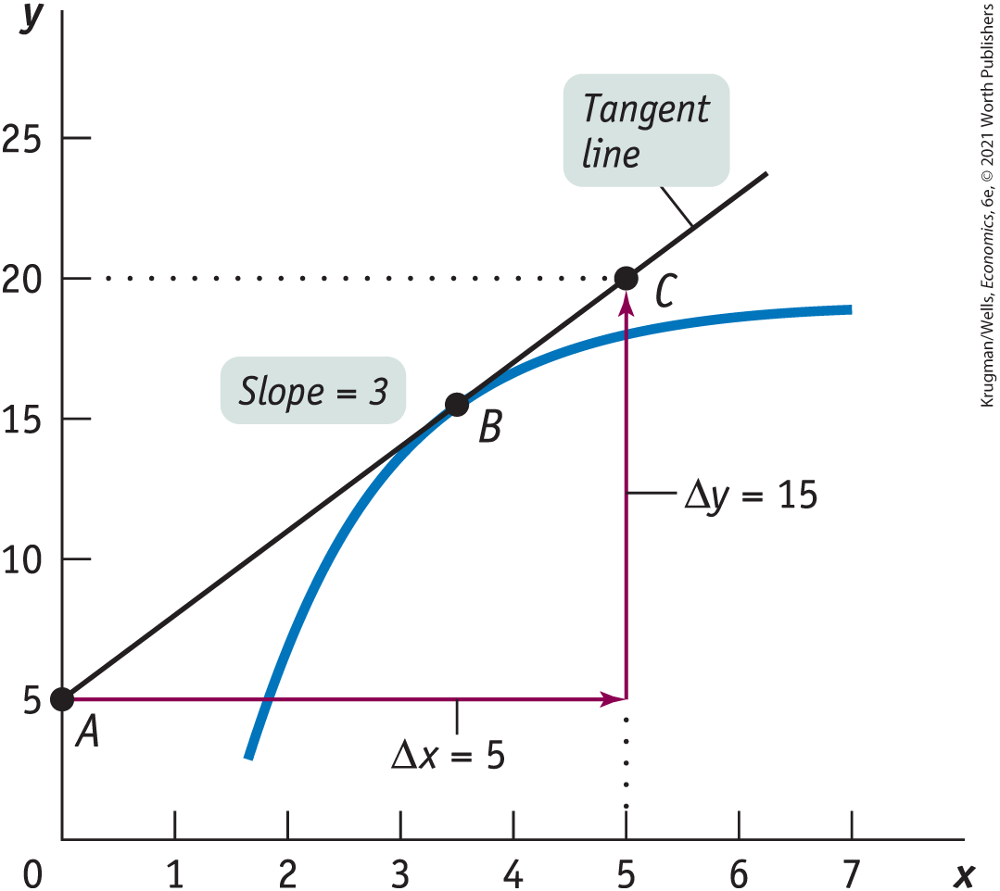
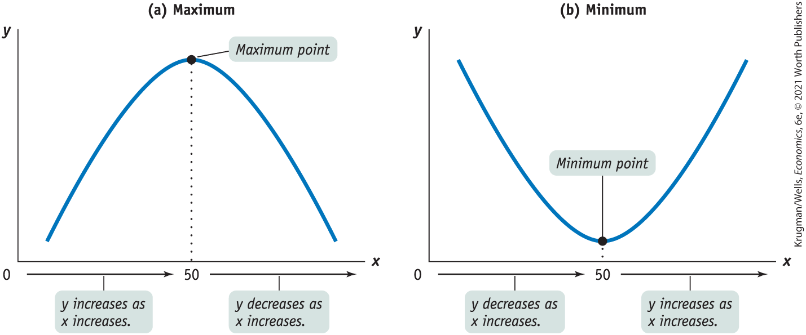
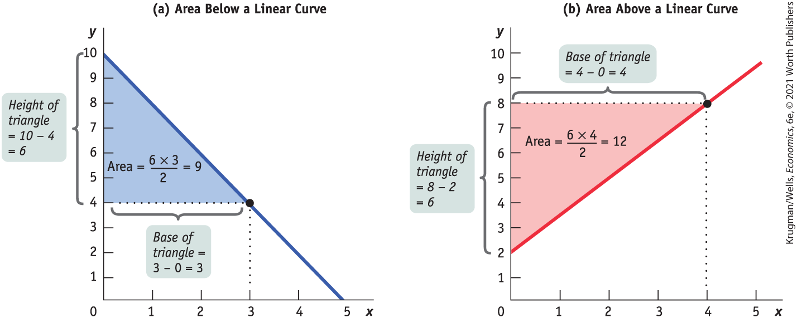
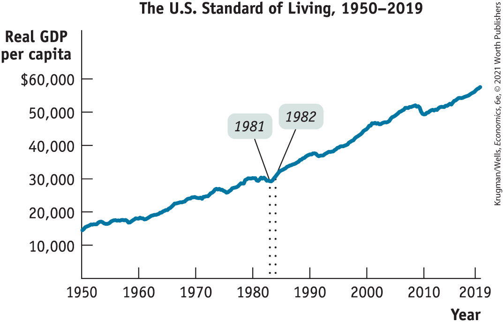
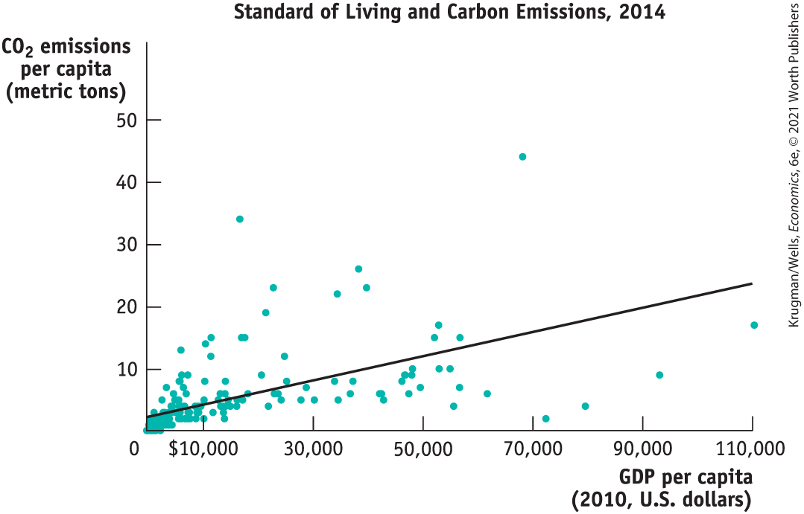
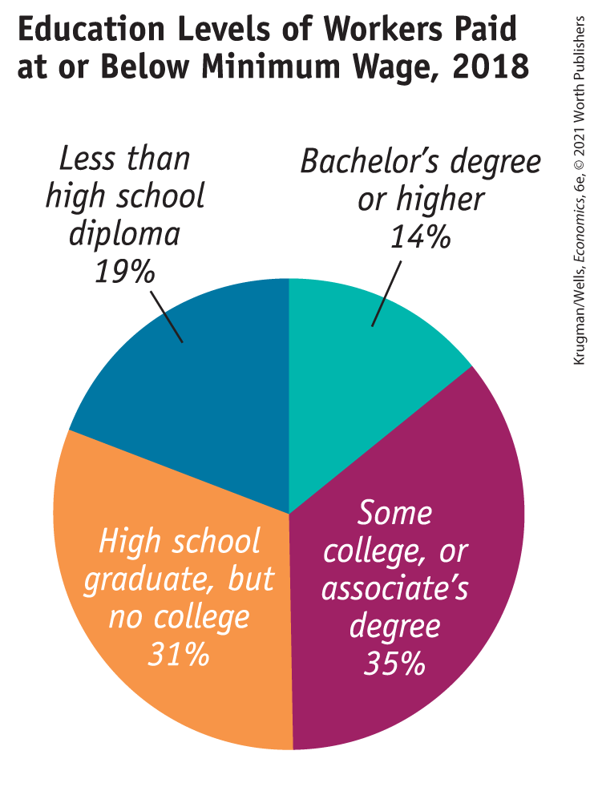
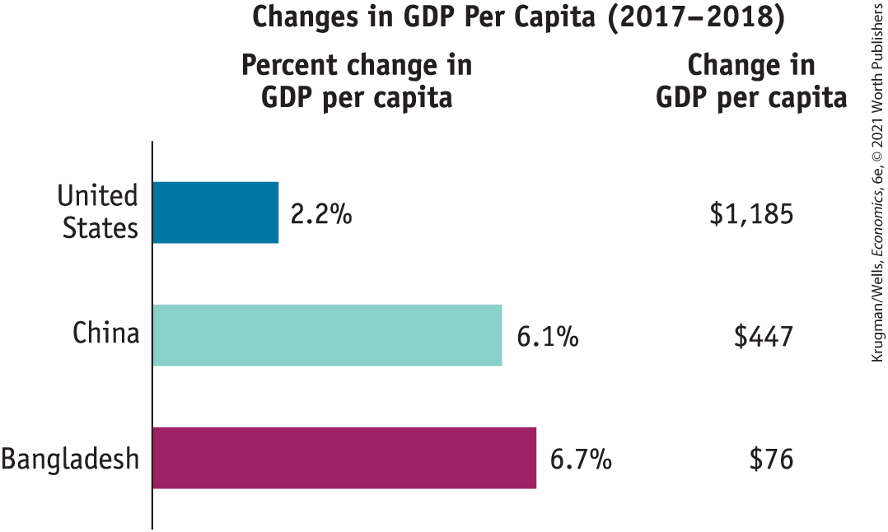
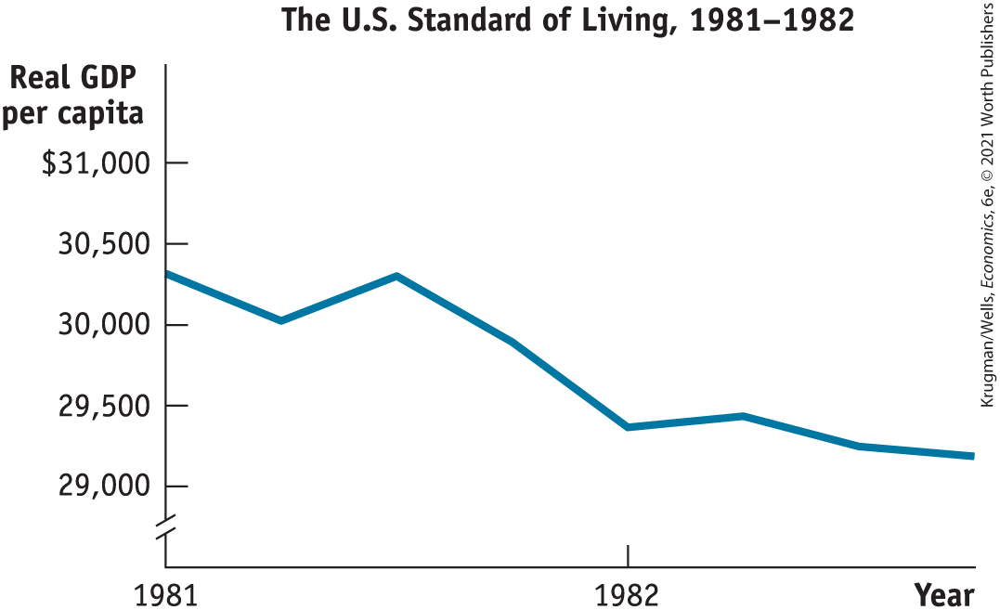

##### The Arc Method of Calculating the Slope

An arc of a curve is some piece or segment of that curve. For example, panel (a) of <a href="#kru_9781319245269_ch02_app.xhtml#pau_9781319320164_lpjhbzC7hy" id="kru_9781319245269_ch02_app.xhtml#pau_9781319320164_ZWrcd47YE8" class="crossref">Figure 2A-4</a> shows an arc consisting of the segment of the curve between points *A* and *B.* To calculate the slope along a nonlinear curve using the arc method, you draw a straight line between the two end-points of the arc. The slope of that straight line is a measure of the average slope of the curve between those two endpoints.

You can see from panel (a) of <a href="#kru_9781319245269_ch02_app.xhtml#pau_9781319320164_lpjhbzC7hy" id="kru_9781319245269_ch02_app.xhtml#pau_9781319320164_f6Rv23iucX" class="crossref">Figure 2A-4</a> that the straight line drawn between points *A* and *B* increases along the *x*-axis from 6 to 10 (so that $\Delta x = 4$) as it increases along the *y*-axis from 10 to 20 (so that $\Delta y = \ 10$). Therefore the slope of the straight line connecting points *A* and *B* is:

$$\frac{\Delta y}{\Delta x} = \frac{10}{4} = 2.5$$

This means that the average slope of the curve between points *A* and *B* is 2.5.

Now consider the arc on the same curve between points *C* and *D.* A straight line drawn through these two points increases along the *x*-axis from 11 to 12 ($\Delta x = 1$) as it increases along the *y*-axis from 25 to 40 ($\Delta y = 15$). So the average slope between points *C* and *D* is:

$$\frac{\Delta y}{\Delta x} = \frac{15}{1} = 15$$

Therefore the average slope between points *C* and *D* is larger than the average slope between points *A* and *B.* These calculations verify what we have already observed — that this upward-tilted curve gets steeper as you move from left to right and therefore has positive increasing slope.

##### The Point Method of Calculating the Slope

The point method calculates the slope of a nonlinear curve at a specific point on that curve. <a href="#kru_9781319245269_ch02_app.xhtml#pau_9781319320164_c6rGal33w9" id="kru_9781319245269_ch02_app.xhtml#pau_9781319320164_CqdCPanhrp" class="crossref">Figure 2A-5</a> illustrates how to calculate the slope at point *B* on the curve. First, we draw a straight line that just touches the curve at point *B.* Such a line is called a <a href="#kru_9781319245269_EM_glossary.xhtml#pau_9781319320164_7PYRgAs5Uc" id="kru_9781319245269_ch02_app.xhtml#pau_9781319320164_nCYF39mRGw" class="glossref" role="doc-glossref">tangent line</a>: the fact that it just touches the curve at point *B* and does not touch the curve at any other point on the curve means that the straight line is *tangent* to the curve at point *B.* The slope of this tangent line is equal to the slope of the nonlinear curve at point *B.*

<aside aria-label="title12" class="glossary c3 main-flow v1" epub:type="glossary" id="pau_9781319320164_aJqPZ6M15x">

**tangent line**  
A **tangent line** is a straight line that just touches, or is tangent to, a nonlinear curve at a particular point. The slope of the tangent line is equal to the slope of the nonlinear curve at that point.

</aside>

<figure id="pau_9781319320164_c6rGal33w9" class="figure lm_img_lightbox num c3 main-flow">

<figcaption>
FIGURE 2A-5 Calculating the Slope Using the Point Method

Here a tangent line has been drawn, a line that just touches the curve at point <em>B.</em> The slope of this line is equal to the slope of the curve at point <em>B.</em> The slope of the tangent line, measuring from <em>A</em> to <em>C,</em> is $\frac{\Delta y}{\Delta x} = \frac{15}{5} = 3.$
</figcaption>
</figure>

<aside class="hidden" id="pau_9781319320164_XC33KUZvL9" title="hidden">

The vertical axis ranges from 0 to 25 in increments of 5, and the horizontal axis ranges from 0 to 7 in increments of 1. The concave down curve passes through B (3, 15). The tangent line extends from point A (0, 5) through C (5, 20), touching the curve at point B (3, 15). The gap between A and C along the horizontal axis is given by delta x equals 5, the gap along the vertical axis is given by delta y equals 15, and slope equals 3.

</aside>

You can see from <a href="#kru_9781319245269_ch02_app.xhtml#pau_9781319320164_c6rGal33w9" id="kru_9781319245269_ch02_app.xhtml#pau_9781319320164_OazUR0Z2KK" class="crossref">Figure 2A-5</a> how the slope of the tangent line is calculated. From point *A* to point *C,* the change in *y* is 15 and the change in *x* is 5, generating a slope of

$$\frac{\Delta y}{\Delta x} = \frac{15}{5} = 3$$

By the point method, the slope of the curve at point *B* is equal to 3.

A natural question to ask at this point is which method should I use — the arc method or the point method — in calculating the slope of a nonlinear curve? The answer depends on the curve itself and the data used to construct it.

Use the arc method when you don’t have enough information to be able to draw a smooth curve. For example, suppose that in panel (a) of <a href="#kru_9781319245269_ch02_app.xhtml#pau_9781319320164_lpjhbzC7hy" id="kru_9781319245269_ch02_app.xhtml#pau_9781319320164_I8F0LiEj2e" class="crossref">Figure 2A-4</a> you have only the data represented by points *A, C,* and *D* and don’t have the data represented by point *B* or any of the rest of the curve. Clearly, then, you can’t use the point method to calculate the slope at point *B;* you would have to use the arc method to approximate the slope of the curve in this area by drawing a straight line between points *A* and *C.*

But if you have sufficient data to draw the smooth curve shown in panel (a) of <a href="#kru_9781319245269_ch02_app.xhtml#pau_9781319320164_lpjhbzC7hy" id="kru_9781319245269_ch02_app.xhtml#pau_9781319320164_415Z1lwNWZ" class="crossref">Figure 2A-4</a>, then you could use the point method to calculate the slope at point *B* — and at every other point along the curve as well.

#### Maximum and Minimum Points

The slope of a nonlinear curve can change from positive to negative or vice versa. When the slope of a curve changes from positive to negative, it creates what is called a *maximum* point of the curve. When the slope of a curve changes from negative to positive, it creates a *minimum* point.

Panel (a) of <a href="#kru_9781319245269_ch02_app.xhtml#pau_9781319320164_JifBHfxvx3" id="kru_9781319245269_ch02_app.xhtml#pau_9781319320164_f93HKSljIC" class="crossref">Figure 2A-6</a> illustrates a curve in which the slope changes from positive to negative as you move from left to right. When *x* is between 0 and 50, the slope of the curve is positive. At *x* equal to 50, the curve attains its highest point — the largest value of *y* along the curve. This point is called the <a href="#kru_9781319245269_EM_glossary.xhtml#pau_9781319320164_NcLZeQLsM2" id="kru_9781319245269_ch02_app.xhtml#pau_9781319320164_wycZSHZkyO" class="glossref" role="doc-glossref">maximum</a> of the curve. When *x* exceeds 50, the slope becomes negative as the curve turns downward. Many important curves in economics, such as the curve that represents how the profit of a firm changes as it produces more output, are hill-shaped like this.

<aside aria-label="title13" class="glossary c3 main-flow v1" epub:type="glossary" id="pau_9781319320164_mwdG0CrJgH">

**maximum**  
A nonlinear curve may have a **maximum** point, the highest point along the curve. At the maximum, the slope of the curve changes from positive to negative.

</aside>

<figure id="pau_9781319320164_JifBHfxvx3" class="figure lm_img_lightbox num c4 main-flow">

<figcaption>
FIGURE 2A-6 Maximum and Minimum Points

Panel (a) shows a curve with a maximum point, the point at which the slope changes from positive to negative. Panel (b) shows a curve with a minimum point, the point at which the slope changes from negative to positive.
</figcaption>
</figure>

<aside class="hidden" id="pau_9781319320164_7TRN5pQAsQ" title="hidden">

Graph (a) is of a parabola on x- and y-axes. The parabola is concave downward, and its peak (maximum point) is at an x-value of 50. The portion of the x-axis to the left of 50 is labeled ‘y increases as x increases.’ The portion of the x-axis to the right of 50 is labeled ‘y decreases as x increases.’Graph (b) is of a parabola on x- and y-axes. The parabola is concave downward, and its trough (minimum point) is at an x-value of 50. The portion of the x-axis to the left of 50 is labeled ‘y decreases as x increases.’ The portion of the x-axis to the right of 50 is labeled ‘y increases as x increases.’

</aside>

In contrast, the curve shown in panel (b) of <a href="#kru_9781319245269_ch02_app.xhtml#pau_9781319320164_JifBHfxvx3" id="kru_9781319245269_ch02_app.xhtml#pau_9781319320164_vNA0Jm0OBU" class="crossref">Figure 2A-6</a> is U-shaped: it has a slope that changes from negative to positive. At *x* equal to 50, the curve reaches its lowest point — the smallest value of *y* along the curve. This point is called the <a href="#kru_9781319245269_EM_glossary.xhtml#pau_9781319320164_aoaXREGN72" id="kru_9781319245269_ch02_app.xhtml#pau_9781319320164_c8SA3TCZlP" class="glossref" role="doc-glossref">minimum</a> of the curve. Various important curves in economics are U-shaped like this.

<aside aria-label="title14" class="glossary c3 main-flow v1" epub:type="glossary" id="pau_9781319320164_2mZAQ8a9TI">

**minimum**  
A nonlinear curve may have a **minimum** point, the lowest point along the curve. At the minimum, the slope of the curve changes from negative to positive.

</aside>

### Calculating the Area Below or Above a Curve

It is useful to know how to measure the size of the area below or above a curve. For the sake of simplicity, we’ll only calculate the area below or above a linear curve.

How large is the shaded area below the linear curve in panel (a) of <a href="#kru_9781319245269_ch02_app.xhtml#pau_9781319320164_xz4L7dGmYC" id="kru_9781319245269_ch02_app.xhtml#pau_9781319320164_OLDREemfpO" class="crossref">Figure 2A-7</a>? First note that this area has the shape of a right triangle. A right triangle is a triangle that has two sides that make a right angle with each other. We will refer to one of these sides as the *height* of the triangle and the other side as the *base* of the triangle. For our purposes, it doesn’t matter which of these two sides we refer to as the base and which as the height.

<figure id="pau_9781319320164_xz4L7dGmYC" class="figure lm_img_lightbox num c4 main-flow">

<figcaption>
FIGURE 2A-7 Calculating the Area Below and Above a Linear Curve

The area above or below a linear curve forms a right triangle. The area of a right triangle is calculated by multiplying the height of the triangle by the base of the triangle, and dividing the result by 2. In panel (a) the area of the shaded triangle is $6 \times \frac{3}{2} = 9$. In panel (b) the area of the shaded triangle is $6 \times \frac{4}{2} = 12$.
</figcaption>
</figure>

<aside class="hidden" id="pau_9781319320164_oYT5KbJwzO" title="hidden">

Graph a shows the area below a linear curve. The x-axis ranges from 0 to 5, and the y-axis ranges from 0 to 10. A downward-sloping line extends between (0, 10) and (0, 5) forming a triangle such that the base of the triangle (along the horizontal axis) equals 3 minus 0 equals 3 and the height of the triangle (along the vertical axis) equals 10 minus 4 equals 6. Area of the shaded region is given by the equation Area equals 6 times 3 over 2 equals 9.Graph b shows the area above a linear curve. The x-axis ranges from 0 to 5, and the y-axis ranges from 0 to 10. An upward-sloping line extends between (0, 10) and (0, 5) forming a triangle such that the base of the triangle (along the horizontal axis) equals 4 minus 0 equals 4 and the height of the triangle (along the vertical axis) equals 8 minus 2 equals 6. Area of the shaded region is given by the equation Area equals 6 times 4 over 2 equals 12.

</aside>

Calculating the area of a right triangle is straightforward: multiply the height of the triangle by the base of the triangle, and divide the result by 2. The height of the triangle in panel (a) of <a href="#kru_9781319245269_ch02_app.xhtml#pau_9781319320164_xz4L7dGmYC" id="kru_9781319245269_ch02_app.xhtml#pau_9781319320164_LCU1O3u6mV" class="crossref">Figure 2A-7</a> is $10 - 4 = 6$. And the base of the triangle is $3 - 0 = 3$. So the area of that triangle is:

$$\frac{6 \times 3}{2} = 9$$

How about the shaded area above the linear curve in panel (b) of <a href="#kru_9781319245269_ch02_app.xhtml#pau_9781319320164_xz4L7dGmYC" id="kru_9781319245269_ch02_app.xhtml#pau_9781319320164_nxJKOXSiKM" class="crossref">Figure 2A-7</a>? We can use the same formula to calculate the area of this right triangle. The height of the triangle is $8 - 2 = 6$. And the base of the triangle is $4 - 0 = 4$. So the area of that triangle is:

$$\frac{6 \times 4}{2} = 12$$

### Graphs That Depict Numerical Information

Graphs are also a convenient way to summarize and display data without assuming some underlying causal relationship. Graphs that simply display numerical information are called *numerical graphs.*

Here we will consider four types of numerical graphs: *time-series graphs, scatter diagrams, pie charts,* and *bar graphs.* These are widely used to display real, empirical data about different economic variables because they often help economists and policy makers identify patterns or trends in the economy. But it’s important to be aware of both the usefulness and the limitations of numerical graphs to avoid misinterpreting them or drawing unwarranted conclusions from them.

#### Types of Numerical Graphs

You have probably seen graphs that show what has happened over time to economic variables such as the unemployment rate or stock prices. A <a href="#kru_9781319245269_EM_glossary.xhtml#pau_9781319320164_9JG4P2MP1h" id="kru_9781319245269_ch02_app.xhtml#pau_9781319320164_oCkm8UKhpf" class="glossref" role="doc-glossref">time-series graph</a> has successive dates on the horizontal axis and the values of a variable that occurred on those dates on the vertical axis.

<aside aria-label="title15" class="glossary c3 main-flow v1" epub:type="glossary" id="pau_9781319320164_ifcSg7oEnT">

**time-series graph**  
A **time-series graph** has dates on the horizontal axis and values of a variable that occurred on those dates on the vertical axis.

</aside>

For example, <a href="#kru_9781319245269_ch02_app.xhtml#pau_9781319320164_JN3kOoQZ5Q" id="kru_9781319245269_ch02_app.xhtml#pau_9781319320164_Ib84JOiy6o" class="crossref">Figure 2A-8</a> shows real gross domestic product (GDP) per capita — a rough measure of a country’s standard of living — in the United States from 1950 to 2019. A line connecting the points that correspond to real GDP per capita for each calendar quarter during those years gives a clear idea of the overall trend in the standard of living over these years.

<figure id="pau_9781319320164_JN3kOoQZ5Q" class="figure lm_img_lightbox num c3 main-flow">

<figcaption>
FIGURE 2A-8 Time-Series Graph

Time-series graphs show successive dates on the <em>x</em>-axis and values for a variable on the <em>y</em>-axis. This time-series graph shows real gross domestic product per capita, a measure of a country’s standard of living, in the United States from 1950 to early 2019.

<em>Data from:</em> The Federal Reserve Bank of St. Louis.
</figcaption>
</figure>

<aside class="hidden" id="pau_9781319320164_mkoOmiifIf" title="hidden">

The graph plots real G D P per capita on a range of 10,000 to 60,000 dollars in increments of 10,000 dollars against years ranging from 1950 to 2019 in increments of 10. The graph shows a gradually increasing curve with minor fluctuations. Starting at about 15, 000 dollars in 1950, the real G D P showed a continuous increase with very brief falls and stood at approximately 30,000 dollars in 1981 and 1982. It then increased to 50,000 by 2010 and further to 60,000 dollars by 2019.

</aside>

<a href="#kru_9781319245269_ch02_app.xhtml#pau_9781319320164_RIhTxWOQls" id="kru_9781319245269_ch02_app.xhtml#pau_9781319320164_koBgXPOVqF" class="crossref">Figure 2A-9</a> is an example of a different kind of numerical graph. It represents information from a sample of 180 countries on the standard of living, again measured by GDP per capita, and the amount of carbon emissions per capita, a measure of environmental pollution. Each point here indicates an average resident’s standard of living and his or her annual carbon emissions for a given country.

<figure id="pau_9781319320164_RIhTxWOQls" class="figure lm_img_lightbox num c3 main-flow">

<figcaption>
FIGURE 2A-9 Scatter Diagram

In a scatter diagram, each point represents the corresponding values of the <em>x</em>- and <em>y</em>-variables for a given observation. Here, each point indicates the GDP per capita and the amount of carbon dioxide emissions per capita for a given country for a sample of 180 countries. The upward-sloping fitted line here is the best approximation of the general relationship between the two variables.

<em>Data from:</em> World Development Indicators.
</figcaption>
</figure>

<aside class="hidden" id="pau_9781319320164_djr9qk6dl2" title="hidden">

The graph plots carbon dioxide emissions per capita (metric tons) on a range of 0 to 50 against G D P per capita in 2010, U. S. dollars. A large number of countries with 10,000 dollars G D P per capita or below have about 10 metric tons of carbon dioxide emissions per capita. Countries with a G D P of 70,000 dollars per capita or above have their carbon dioxide emissions between 8 metric tons and 15 metric tons per capita. The best fit line has a positive slope and extends from approximately 0 dollars G D P per capita and 3 metric tons carbon dioxide emissions per capita to 110,000 dollars G D P per capita and 25 metric tons carbon dioxide emissions.

</aside>

The points lying in the upper right of the graph, which show combinations of a high standard of living and high carbon emissions, represent economically advanced countries such as the United States. (The country with the highest carbon emissions, at the top of the graph, is Qatar.) Points lying in the bottom left of the graph, which show combinations of a low standard of living and low carbon emissions, represent economically less advanced countries such as Afghanistan and Sierra Leone.

The pattern of points indicates that there is a positive relationship between living standard and carbon emissions per capita: on the whole, people create more pollution in countries with a higher standard of living.

This type of graph is called a <a href="#kru_9781319245269_EM_glossary.xhtml#pau_9781319320164_ArVYqWCjA9" id="kru_9781319245269_ch02_app.xhtml#pau_9781319320164_AzjkqbK993" class="glossref" role="doc-glossref">scatter diagram</a>, in which each point corresponds to an actual observation of the *x*-variable and the *y*-variable. In scatter diagrams, a curve is typically fitted to the scatter of points; that is, a curve is drawn that approximates as closely as possible the general relationship between the variables. As you can see, the fitted line in <a href="#kru_9781319245269_ch02_app.xhtml#pau_9781319320164_RIhTxWOQls" id="kru_9781319245269_ch02_app.xhtml#pau_9781319320164_h2cDpjtAub" class="crossref">Figure 2A-9</a> is upward sloping, indicating the underlying positive relationship between the two variables. Scatter diagrams are often used to show how a general relationship can be inferred from a set of data.

<aside aria-label="title16" class="glossary c3 main-flow v1" epub:type="glossary" id="pau_9781319320164_2Bi1UjbejV">

**scatter diagram**  
A **scatter diagram** shows points that correspond to actual observations of the *x-* and *y*-variables. A curve is usually fitted to the scatter of points.

</aside>

A <a href="#kru_9781319245269_EM_glossary.xhtml#pau_9781319320164_dvOyV5wyyN" id="kru_9781319245269_ch02_app.xhtml#pau_9781319320164_zKBCoarn2e" class="glossref" role="doc-glossref">pie chart</a> shows the share of a total amount that is accounted for by various components, usually expressed in percentages. For example, <a href="#kru_9781319245269_ch02_app.xhtml#pau_9781319320164_yzgL0nxwoq" id="kru_9781319245269_ch02_app.xhtml#pau_9781319320164_E5iA7dgD2j" class="crossref">Figure 2A-10</a> is a pie chart that depicts the education levels of workers who in 2018 were paid the federal minimum wage or less. As you can see, the majority of workers paid at or below the minimum wage had no college degree. Only 14% of workers who were paid at or below the minimum wage had a bachelor’s degree or higher.

<aside aria-label="title17" class="glossary c3 main-flow v1" epub:type="glossary" id="pau_9781319320164_A2JsPXZnSn">

**pie chart**  
A **pie chart** shows how some total is divided among its components, usually expressed in percentages.

</aside>

<figure id="pau_9781319320164_yzgL0nxwoq" class="figure lm_img_lightbox num c2 center">

<figcaption>
FIGURE 2A-10 Pie Chart

A pie chart shows the percentages of a total amount that can be attributed to various components. This pie chart shows the percentages of workers with given education levels who were paid at or below the federal minimum wage in 2018. (Numbers may not add to 100 due to rounding.)

<em>Data from:</em> Bureau of Labor Statistics.
</figcaption>
</figure>

<aside class="hidden" id="pau_9781319320164_7gdTzsAZaq" title="hidden">

The percent of workers earning the minimum wage or below are as follows: Some college, or associate’s degree, 35 percent; High school graduate, but no college, 31 percent; Less than high school diploma, 19 percent; and Bachelor’s degree or higher, 14 percent.

</aside>

<a href="#kru_9781319245269_EM_glossary.xhtml#pau_9781319320164_tpg0EPSFQ5" id="kru_9781319245269_ch02_app.xhtml#pau_9781319320164_drFPhr60ty" class="glossref" role="doc-glossref">Bar graphs</a> use bars of various heights or lengths to indicate values of a variable. In the bar graph in <a href="#kru_9781319245269_ch02_app.xhtml#pau_9781319320164_T81Vzu44ge" id="kru_9781319245269_ch02_app.xhtml#pau_9781319320164_qIzFtfUj4n" class="crossref">Figure 2A-11</a>, the bars show the percent change in GDP per capita from 2017 to 2018 for the United States, China, and Bangladesh. Exact values of the variable that is being measured may be written at the end of the bar, as in this figure. For instance, GDP per capita for China increased by 6.1% between 2017 and 2018. But even without the precise values, comparing the heights or lengths of the bars can give useful insight into the relative magnitudes of the different values of the variable.

<aside aria-label="title18" class="glossary c3 main-flow v1" epub:type="glossary" id="pau_9781319320164_r09sartkTh">

**bar graph**  
A **bar graph** uses bars of varying heights or lengths to show the comparative sizes of different observations of a variable.

</aside>

<figure id="pau_9781319320164_T81Vzu44ge" class="figure lm_img_lightbox num c3 main-flow">

<figcaption>
FIGURE 2A-11 Bar Graph

A bar graph measures a variable by using bars of various heights or lengths. This bar graph shows the percent change in GDP per capita (measured in 2010 dollars) for the United States, China, and Bangladesh.

<em>Data from:</em> World Bank, World Development Indicators.
</figcaption>
</figure>

<aside class="hidden" id="pau_9781319320164_I4HRxbzx9z" title="hidden">

The change in G D P per capita in percent and dollars are, respectively, as follows.United States: 2.2 percent; 1,185 dollars.China: 6.1 percent; 447 dollars.Bangladesh: 6.7 percent; 76 dollars.

</aside>

#### Challenges with Interpreting Numerical Graphs

Although graphs are visual images that make ideas or information easier to understand, they can be constructed (intentionally or unintentionally) in ways that are misleading and can lead to inaccurate conclusions. This section addresses some difficulties you may have when you are analyzing graphs.

##### Features of Construction

When evaluating a numerical graph, pay close attention to the scale, or size of increments, shown on the axes. Small increments tend to visually exaggerate changes in the variables, whereas large increments tend to visually diminish them. So the scale used in construction of a graph can influence your interpretation of the significance of the changes it illustrates — perhaps in an unwarranted way.

Take, for example, <a href="#kru_9781319245269_ch02_app.xhtml#pau_9781319320164_An6pZEk6oi" id="kru_9781319245269_ch02_app.xhtml#pau_9781319320164_WwqLdliLoM" class="crossref">Figure 2A-12</a>, which shows real GDP per capita in the United States from 1981 to 1982 using increments of \$500. You can see that real GDP per capita fell from \$30,316 to \$29,186. A decrease, sure, but is it as enormous as the scale chosen for the vertical axis makes it seem? It is not.

<figure id="pau_9781319320164_An6pZEk6oi" class="figure lm_img_lightbox num c3 main-flow">

<figcaption>
FIGURE 2A-12 Interpreting Graphs: The Effect of Scale

Some of the same data for the years 1981 and 1982 used in <a href="#kru_9781319245269_ch02_app.xhtml#pau_9781319320164_JN3kOoQZ5Q" id="kru_9781319245269_ch02_app.xhtml#pau_9781319320164_WeKzzP4Df9" class="crossref">Figure 2A-8</a> are represented here, except that here they are shown using increments of $500 rather than increments of $10,000. As a result of this change in scale, changes in the standard of living look much larger in this figure compared to <a href="#kru_9781319245269_ch02_app.xhtml#pau_9781319320164_JN3kOoQZ5Q" id="kru_9781319245269_ch02_app.xhtml#pau_9781319320164_BUbTuhKuU9" class="crossref">Figure 2A-8</a>.

<em>Data from:</em> Bureau of Economic Analysis.
</figcaption>
</figure>

<aside class="hidden" id="pau_9781319320164_eEqWS4dZpN" title="hidden">

The graph shows a truncated y-axis and plots real G D P per capita on a range of 29,000 to 31,000 dollars in increments of 500 dollars against years, 1981 onward. The curve starts from about 30,400 dollars and ends at about 29,452 dollars with intermittent peaks.

</aside>

If you reexamine <a href="#kru_9781319245269_ch02_app.xhtml#pau_9781319320164_JN3kOoQZ5Q" id="kru_9781319245269_ch02_app.xhtml#pau_9781319320164_oiHHx9FbwV" class="crossref">Figure 2A-8</a>, which shows real GDP per capita in the United States from 1950 to 2019, you will see that it includes the same data shown in <a href="#kru_9781319245269_ch02_app.xhtml#pau_9781319320164_An6pZEk6oi" id="kru_9781319245269_ch02_app.xhtml#pau_9781319320164_R9vRBJtPS7" class="crossref">Figure 2A-12</a>. But, <a href="#kru_9781319245269_ch02_app.xhtml#pau_9781319320164_JN3kOoQZ5Q" id="kru_9781319245269_ch02_app.xhtml#pau_9781319320164_vaIv1Og2YN" class="crossref">Figure 2A-8</a> is constructed with a scale having increments of \$10,000 rather than \$500. From it you can see that the fall in real GDP per capita from 1981 to 1982 was, in fact, relatively insignificant.

In fact, the story of real GDP per capita — a measure of the standard of living — in the United States is mostly a story of ups, not downs. This comparison shows that if you are not careful to factor in the choice of scale in interpreting graphs, you can arrive at very different, and possibly incorrect, conclusions.

Related to the choice of scale is the use of *truncation* in constructing a graph. An axis is <a href="#kru_9781319245269_EM_glossary.xhtml#pau_9781319320164_mleOwDjle0" id="kru_9781319245269_ch02_app.xhtml#pau_9781319320164_oNKw8KKBOS" class="glossref" role="doc-glossref">truncated</a> when part of the range is omitted. This is indicated by two slashes (//) in the axis near the origin. You can see that the vertical axis of <a href="#kru_9781319245269_ch02_app.xhtml#pau_9781319320164_An6pZEk6oi" id="kru_9781319245269_ch02_app.xhtml#pau_9781319320164_j9GaCbXgyK" class="crossref">Figure 2A-12</a> has been truncated — some of the range of values from 0 to \$29,000 have been omitted and a // appears in the axis. Truncation saves space in the presentation of a graph and allows smaller increments to be used in constructing it. As a result, changes in the variable depicted on a graph that has been truncated appear larger compared to a graph that has not been truncated and that uses larger increments.

<aside aria-label="title19" class="glossary c3 main-flow v1" epub:type="glossary" id="pau_9781319320164_cIzW3W7hgQ">

**truncated**  
An axis is **truncated** when some of the values on the axis are omitted, usually to save space.

</aside>

You must also consider exactly what a graph is illustrating. For example, in <a href="#kru_9781319245269_ch02_app.xhtml#pau_9781319320164_T81Vzu44ge" id="kru_9781319245269_ch02_app.xhtml#pau_9781319320164_xvBcXOwqbK" class="crossref">Figure 2A-11</a>, you should recognize that what is being shown are *percent* changes in GDP per capita, not *numerical* changes. The growth rate for Bangladesh increased by the highest percentage, 6.7% in this example. If you were to confuse numerical changes with percent changes, you would erroneously conclude the country with the greatest change in GDP per capita was Bangladesh.

In fact, a correct interpretation of <a href="#kru_9781319245269_ch02_app.xhtml#pau_9781319320164_T81Vzu44ge" id="kru_9781319245269_ch02_app.xhtml#pau_9781319320164_SfuHmJul24" class="crossref">Figure 2A-11</a> shows that the greatest dollar change in GDP per capita was for the United States: GDP per capita increased by \$1,185 for the United States, which is greater than the increase in GDP per capita for China, which is \$447 in this example. Although there was a higher percentage increase in GDP per capita for China, the dollar increase for China from 2017 to 2018 was smaller than the change for the United States, leading to a smaller change in GDP per capita for China than the United States. The same can be said for Bangladesh, where GDP per capita grew by 6.7%, but that only resulted in a \$76 increase in actual GDP per capita.

##### Omitted Variables

From a scatter diagram that shows two variables moving either positively or negatively in relation to each other, it is easy to conclude that there is a causal relationship. But relationships between two variables are not always due to direct cause and effect. Quite possibly an observed relationship between two variables is due to the *unobserved* effect of a third variable on each of the other two variables.

An unobserved variable that, through its influence on other variables, creates the erroneous appearance of a direct causal relationship among those variables is called an <a href="#kru_9781319245269_EM_glossary.xhtml#pau_9781319320164_vWUTy8dQfG" id="kru_9781319245269_ch02_app.xhtml#pau_9781319320164_0tYBKbykSj" class="glossref" role="doc-glossref">omitted variable</a>. For example, in New England, a greater amount of snowfall during a given week will typically cause people to buy more snow shovels. It will also cause people to buy more de-icer fluid. But if you omitted the influence of the snowfall and simply plotted the number of snow shovels sold versus the number of bottles of de-icer fluid sold, you would produce a scatter diagram that showed an upward tilt in the pattern of points, indicating a positive relationship between snow shovels sold and de-icer fluid sold.

<aside aria-label="title20" class="glossary c3 main-flow v1" epub:type="glossary" id="pau_9781319320164_NGZFvLWWoS">

**omitted variable**  
An **omitted variable** is an unobserved variable that, through its influence on other variables, creates the erroneous appearance of a direct causal relationship among those variables.

</aside>

To attribute a causal relationship between these two variables, however, is misguided. More snow shovels sold do not cause more de-icer fluid to be sold, or vice versa. They move together because they are both influenced by a third, determining, variable — the weekly snowfall, which is the omitted variable in this case.

So before assuming that a pattern in a scatter diagram implies a cause-and-effect relationship, it is important to consider whether the pattern is instead the result of an omitted variable. Or to put it another way: correlation is not causation.
