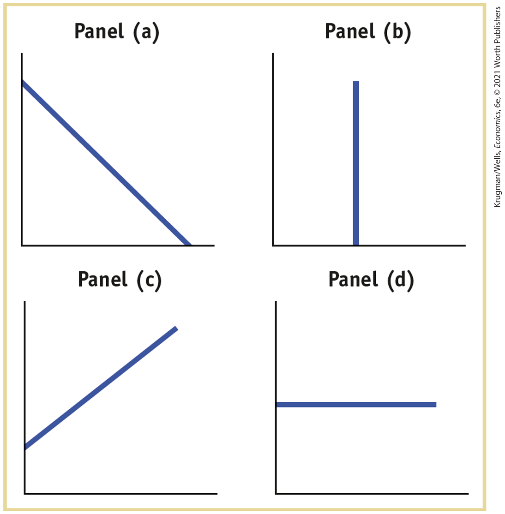
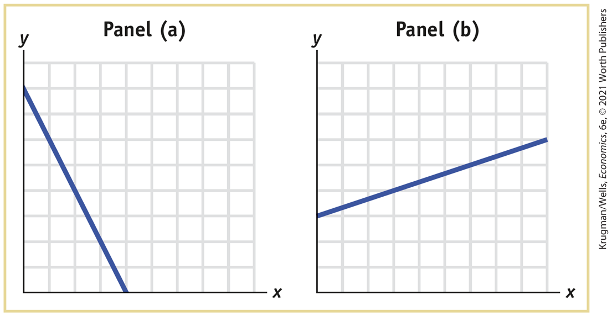
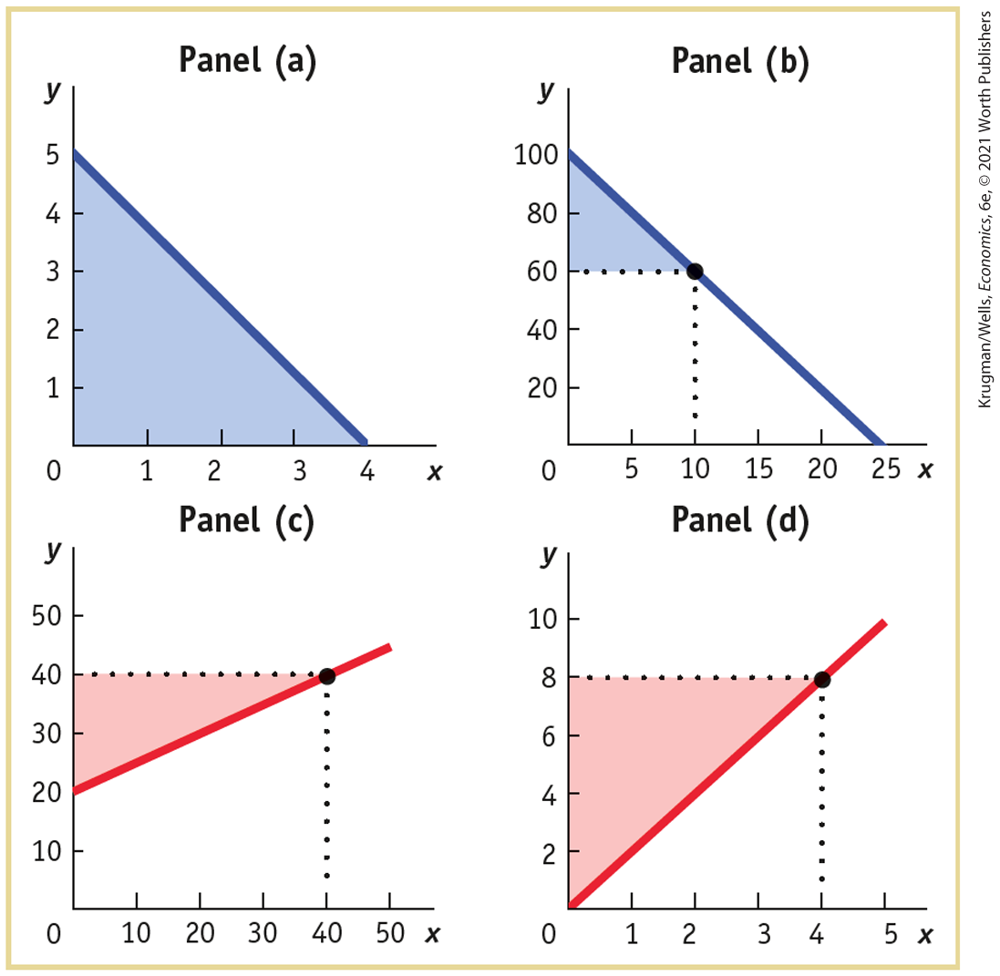

##### Reverse Causality

Even when you are confident that there is no omitted variable and that there is a causal relationship between two variables shown in a numerical graph, you must also be sure to avoid making the mistake of <a href="#kru_9781319245269_EM_glossary.xhtml#pau_9781319320164_2WuzdHbLQF" id="kru_9781319245269_ch02_app.xhtml#pau_9781319320164_gN9dTt5ymZ" class="glossref" role="doc-glossref">reverse causality</a> — coming to an erroneous conclusion about which is the dependent and which is the independent variable by reversing the true direction of causality between the two variables.

<aside aria-label="title21" class="glossary c3 main-flow v1" epub:type="glossary" id="pau_9781319320164_GobCNKyA2p">

**reverse causality**  
The error of **reverse causality** is committed when the true direction of causality between two variables is reversed.

</aside>

For example, imagine a scatter diagram that depicts the grade point averages (GPAs) of 20 of your classmates on one axis and the number of hours that each classmate spends studying on the other. A line fitted between the points will probably have a positive slope, showing a positive relationship between GPA and hours of studying. We could reasonably infer that hours spent studying is the independent variable and that GPA is the dependent variable. But you could make the error of reverse causality: you could infer that a high GPA causes a student to study more, whereas a low GPA causes a student to study less.

As you’ve just seen, it is important to understand how graphs can mislead or be interpreted incorrectly. Policy decisions, business decisions, and political arguments are often based on interpretation of the types of numerical graphs we’ve just discussed. Problems of misleading features of construction, omitted variables, and reverse causality can lead to important and undesirable consequences.

### Problems

1.  Study the four accompanying diagrams. Consider the following statements and indicate which diagram matches each statement. Which variable would appear on the horizontal and which on the vertical axis? In each of these statements, is the slope positive, negative, zero, or infinity?

    <figure id="pau_9781319320164_Q4LjYqu5Sg" class="figure lm_img_lightbox unnum c4 center">
    
    </figure>

    <aside class="hidden" id="pau_9781319320164_KNcjsy3ifs" title="hidden">

    Panel a shows a downward-sloping line extending from the y-axis to the x-axis. Panel b shows a straight line parallel to the vertical axis and extending from the horizontal axis. Panel c shows an upward-sloping line, extending from the y-axis close to the origin. Panel d shows a straight line parallel to the horizontal axis and extending from the vertical axis.

    </aside>

    1.  If the price of movies increases, fewer consumers go to see movies.
    2.  More experienced workers typically have higher incomes than less experienced workers.
    3.  Whatever the temperature outside, Americans consume the same number of tacos per day.
    4.  Consumers buy more frozen yogurt when the price of ice cream goes up.
    5.  Research finds no relationship between the number of diet books purchased and the number of pounds lost by the average dieter.
    6.  Regardless of its price, Americans buy the same quantity of salt.

2.  During the Reagan administration, economist Arthur Laffer argued in favor of lowering income tax rates in order to increase tax revenues. Like most economists, he believed that at tax rates above a certain level, tax revenue would fall because high taxes would discourage some people from working and that people would refuse to work at all if they received no income after paying taxes. This relationship between tax rates and tax revenue is graphically summarized in what is widely known as the Laffer curve. Plot the Laffer curve relationship assuming that it has the shape of a nonlinear curve. The following questions will help you construct the graph.
    1.  Which is the independent variable? Which is the dependent variable? On which axis do you therefore measure the income tax rate? On which axis do you measure income tax revenue?
    2.  What would tax revenue be at a 0% income tax rate?
    3.  The maximum possible income tax rate is 100%. What would tax revenue be at a 100% income tax rate?
    4.  Estimates now show that the maximum point on the Laffer curve is (approximately) at a tax rate of 80%. For tax rates less than 80%, how would you describe the relationship between the tax rate and tax revenue, and how is this relationship reflected in the slope? For tax rates higher than 80%, how would you describe the relationship between the tax rate and tax revenue, and how is this relationship reflected in the slope?

3.  In the accompanying figures, the numbers on the axes have been lost. All you know is that the units shown on the vertical axis are the same as the units on the horizontal axis.

    <figure id="pau_9781319320164_cDAbQp745X" class="figure lm_img_lightbox unnum c4 center">
    
    </figure>

    <aside class="hidden" id="pau_9781319320164_YgLfePZgaH" title="hidden">

    Panel a shows a downward-sloping line extending from (8, 0) and (4, 0). Panel b shows an upward-sloping curve extending through (3, 0) and (9, 6).

    </aside>

    1.  In panel (a), what is the slope of the line? Show that the slope is constant along the line.
    2.  In panel (b), what is the slope of the line? Show that the slope is constant along the line.

4.  Answer each of the following questions by drawing a schematic diagram.
    1.  Taking measurements of the slope of a curve at three points farther and farther to the right along the horizontal axis, the slope of the curve changes from −0.3, to −0.8, to −2.5, measured by the point method. Draw a schematic diagram of this curve. How would you describe the relationship illustrated in your diagram?
    2.  Taking measurements of the slope of a curve at five points farther and farther to the right along the horizontal axis, the slope of the curve changes from 1.5, to 0.5, to 0, to −0.5, to −1.5, measured by the point method. Draw a schematic diagram of this curve. Does it have a maximum or a minimum?

5.  For each of the accompanying diagrams, calculate the area of the shaded right triangle.

    <figure id="pau_9781319320164_Dmy1naNCxm" class="figure lm_img_lightbox unnum c4 center">
    
    </figure>

    <aside class="hidden" id="pau_9781319320164_BDBXqoVA8y" title="hidden">

    Panel a shows y-axis on a range of 0 to 5 and x-axis on a range of 0 to 4 both in increments of 1. The downward-sloping line extends from (0, 5) to (4, 0) and forms a right triangle with the x-axis as its base. The area enclosed within points (4, 0), (5, 0), and (0, 0) is shaded. Panel b shows y-axis on a range of 0 to 100 in increments of 20 and x-axis on a range of 0 to 25 in increments of 5. The downward-sloping line extends from (0, 100) to (25, 0) and forms a right triangle with the x-axis as its base. The area of the triangle enclosed within points (10, 60), (60, 0), and (100, 0) is shaded.Panel c shows y-axis on a range of 0 to 50 in increments of 20 and x-axis on a range of 0 to 50 in increments of 5. The upward-sloping line extends from (0, 20) to (40, 40) and forms a right triangle with the y-axis as its base. The area of the triangle enclosed within points (40, 40), (40, 0), and (20, 0) is shaded.Panel d shows y-axis on a range of 0 to 50 in increments of 20 and x-axis on a range of 0 to 50 in increments of 5. The upward-sloping line extends from (0, 20) to (40, 40) and forms a right triangle with the y-axis as its base. The area of the triangle enclosed within points (4, 8), (8, 0), and (0, 0) is shaded.

    </aside>

6.  The base of a right triangle is 10, and its area is 20. What is the height of this right triangle?

7.  The accompanying table shows the relationship between workers’ hours of work per week and their hourly wage rate. Apart from the fact that they receive a different hourly wage rate and work different hours, these five workers are otherwise identical.
    |          |                                        |                          |
    |----------|----------------------------------------|--------------------------|
    | **Name** | **Quantity of labor (hours per week)** | **Wage rate (per hour)** |
    | Akiko    | 30                                     | \$15                     |
    | Ben      | 35                                     | 30                       |
    | Cameron  | 37                                     | 45                       |
    | Diego    | 36                                     | 60                       |
    | Emily    | 32                                     | 75                       |

    1.  Which variable is the independent variable? Which is the dependent variable?
    2.  Draw a scatter diagram illustrating this relationship. Draw a (nonlinear) curve that connects the points. Put the hourly wage rate on the vertical axis.
    3.  As the wage rate increases from \$15 to \$30, how does the number of hours worked respond according to the relationship depicted here? What is the average slope of the curve between Akiko’s and Ben’s data points using the arc method?
    4.  As the wage rate increases from \$60 to \$75, how does the number of hours worked respond according to the relationship depicted here? What is the average slope of the curve between Diego’s and Emily’s data points using the arc method?

8.  An insurance company has found that the severity of property damage in a fire is positively related to the number of firefighters arriving at the scene.
    1.  Draw a diagram that depicts this finding with number of firefighters on the horizontal axis and amount of property damage on the vertical axis. What is the argument made by this diagram? Suppose you reverse what is measured on the two axes. What is the argument made then?
    2.  Should the insurance company ask the city to send fewer firefighters to any fire in order to reduce its payouts to policy holders?

9.  This table illustrates annual salaries and income tax owed by five individuals. Despite receiving different annual salaries and owing different amounts of income tax, these five individuals are otherwise identical.
    |          |                   |                            |
    |----------|-------------------|----------------------------|
    | **Name** | **Annual salary** | **Annual income tax owed** |
    | Mila     | \$22,000          | \$3,304                    |
    | Jayden   | 63,000            | 14,317                     |
    | Aria     | 3,000             | 454                        |
    | Logan    | 94,000            | 23,927                     |
    | Saeed    | 37,000            | 7,020                      |

    1.  If you were to plot these points on a graph, what would be the average slope of the curve between the points for Jayden’s and Logan’s salaries and taxes using the arc method? How would you interpret this value for slope?
    2.  What is the average slope of the curve between the points for Aria’s and Mila’s salaries and taxes using the arc method? How would you interpret that value for slope?
    3.  What happens to the slope as salary increases? What does this relationship imply about how the level of income taxes affects a person’s incentive to earn a higher salary?

 **Work It Out**

10. Studies have found a relationship between a country’s yearly rate of economic growth and the yearly rate of increase in airborne pollutants. It is believed that a higher rate of economic growth allows a country’s residents to have more cars and travel more, thereby releasing more airborne pollutants.
    1.  Which variable is the independent variable? Which is the dependent variable?
    2.  Suppose that in the country of Sudland, when the yearly rate of economic growth fell from 3.0% to 1.5%, the yearly rate of increase in airborne pollutants fell from 6% to 5%. What is the average slope of a nonlinear curve between these points using the arc method?
    3.  Assume that when the yearly rate of economic growth rose from 3.5% to 4.5%, the yearly rate of increase in airborne pollutants rose from 5.5% to 7.5%. What is the average slope of a nonlinear curve between these two points using the arc method?
    4.  How would you describe the relationship between the two variables here? 
