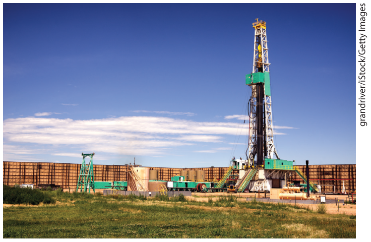
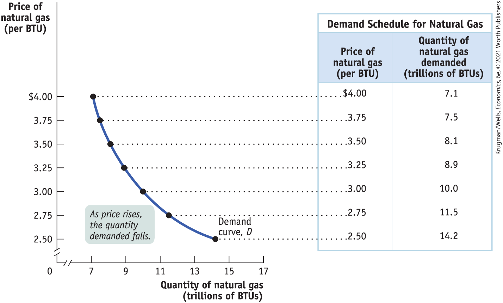
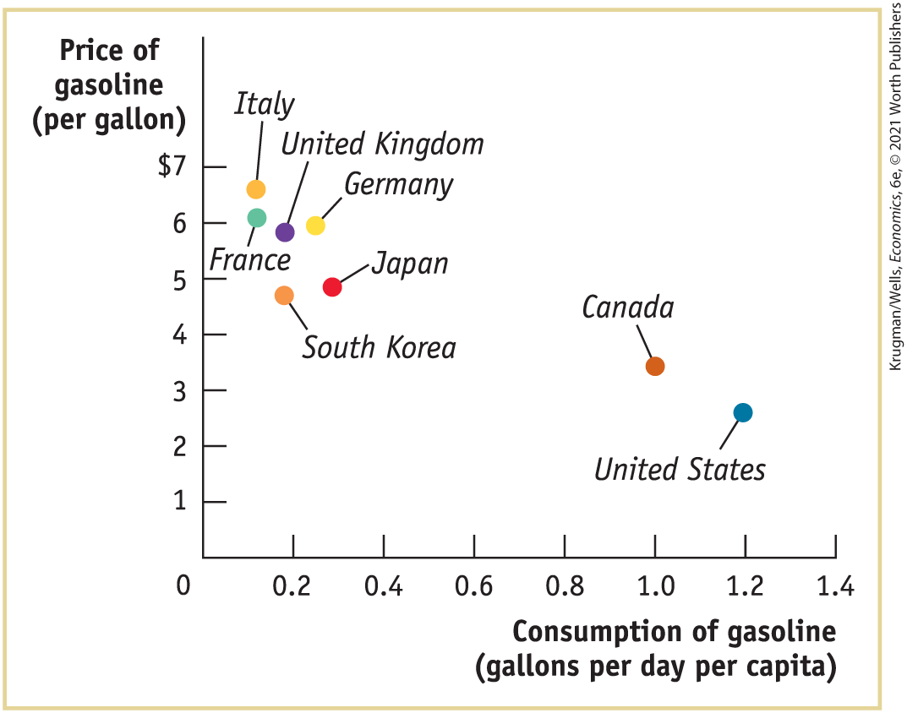
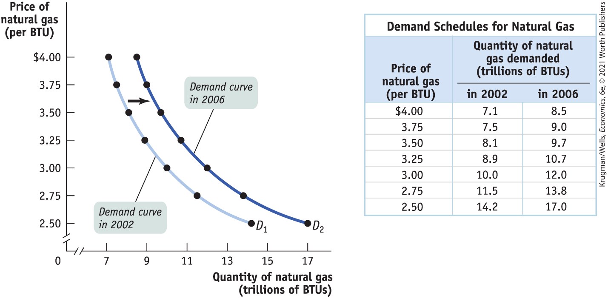
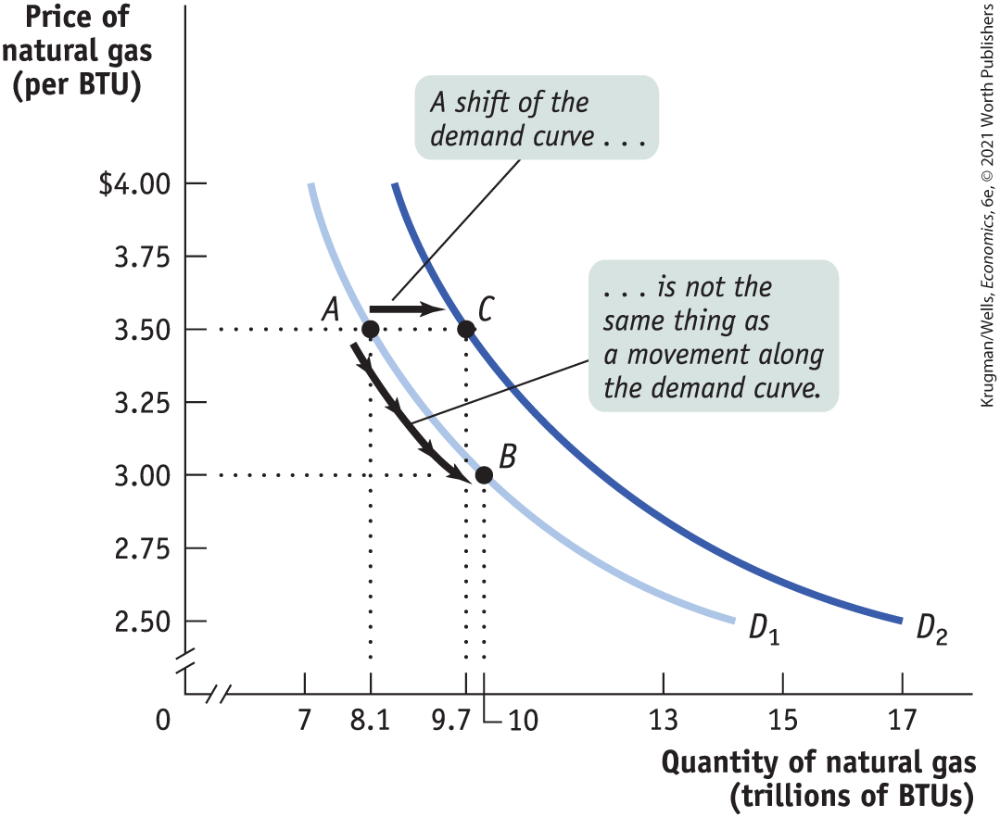
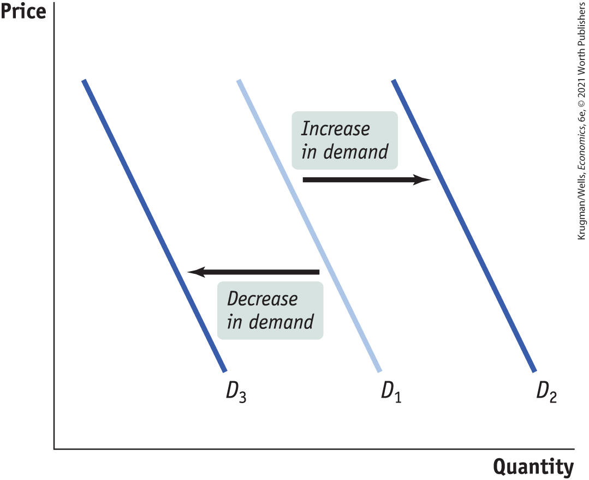

# Chapter 3 Supply and Demand

## a natural gas boom and bust

**FOR ALMOST A DECADE,** Karnes County has been on a wild economic roller-coaster ride. From 2010 to 2018, the Texas county, which sits close to two major geological oil formations, has gone from boom to bust to recovery. What accounted for the swift changes was the advent of hydraulic fracturing, also known as fracking.

<figure id="pau_9781319320164_4tO3opQ29E" class="figure lm_img_lightbox unnum c2 right">

<figcaption>
<strong>The adoption of new drilling technologies has led to cheaper natural gas, but not without controversy and environmental costs.</strong>
</figcaption>
</figure>

From 2010 to 2015, Karnes County went through an extreme cycle of boom and bust as the price of natural gas (per thousand cubic feet) went from nearly \$8 to under \$2 because of fracking. *Fracking* is a method of extracting natural gas from deposits trapped between layers of shale rock thousands of feet underground using powerful jets of chemical-laden water. For almost a century in the United States vast deposits of natural gas within these shale formations lay untapped because drilling for them was too difficult.

It was only about 80 years ago that new drilling technologies made it possible to reach these deeply embedded deposits. But what finally pushed energy companies to invest in these new extraction technologies was a surge in the price of natural gas — a quadrupling from 2002 to 2006. Two principal factors explain the surge: the demand for natural gas and the supply of natural gas.

First, the demand side. In 2002, the U.S. economy was mired in recession; with economic activity low and job losses high, people and businesses cut their energy consumption. For example, to save money, homeowners turned down their thermostats in winter and turned them up in the summer. But by 2006, the U.S. economy came roaring back, and natural gas consumption rose.

Second, the supply side. In 2005, Hurricane Katrina devastated the American Gulf Coast, site of most of the country’s natural gas production at the time. So by 2006 the demand for natural gas surged while supply was severely curtailed. As a result, natural gas prices peaked at around \$14 per thousand cubic feet, up from around \$2 in 2002.

Fast-forward to 2013: natural gas prices once again fell to \$2 per thousand cubic feet. But a slow economy was not the reason this time; instead it was due to advances in fracking technology. From 2010 to 2012, U.S. production of natural gas from shale deposits nearly doubled. By 2018, the United States had become the world’s largest producer of natural gas, as well as a net exporter of natural gas to other countries.

Despite the massive increase in supply, prices during 2018 averaged around \$3.15, well over the historical lows of under \$2. Why? Because although supply surged, demand increased as well. First, electric power plants increased their use of natural gas while shifting away from coal. Second, homeowners increased their consumption of natural gas and shifted away from heating oil. And, third, U.S. natural gas exports to Europe surged given that it was cheaper than comparable energy sources.

Yet the benefits of natural gas — which include the creation of tens of thousands of new jobs, a robust economic boom in Karnes County starting in 2016, and lower energy costs for those who once used pricier coal and oil — have been accompanied by deep reservations and controversy over the environmental effects of fracking. While there are clear environmental benefits from the switch to natural gas (which burns cleaner than the other, heavily polluting fossil fuels, such as oil and coal), fracking has sparked another set of environmental worries. One is potential for contamination of local groundwater by the chemicals used. Another is that cheap natural gas may discourage the adoption of renewable energy sources like solar and wind power, furthering dependence on fossil fuels (although others have noted that an abundant supply of natural gas could actually increase the adoption of renewables: natural gas-powered “mini-power plants” can be fired up when the sun isn’t shining or the wind isn’t blowing).

Let’s return to the topic at hand: the supply of and demand for natural gas. But what does *supply and demand* mean? Many people use the terms as a sort of catchphrase to mean “the laws of the marketplace at work.” To economists, however, the concept of supply and demand has a precise meaning: it is a *model of how a market behaves* that is extremely useful for understanding many — but not all — markets.

In this chapter, we lay out the pieces that make up the *supply and demand model,* put them together, and show you how this model can be used. 

<aside class="learning-objectives c3 main-flow v3" epub:type="learning-objectives" id="pau_9781319320164_nqUhy5y6i4">

### What you will learn

- What is a **competitive market?**
- What are **supply** and **demand curves?**
- How do supply and demand curves lead to an **equilibrium price** and **equilibrium quantity** in the market?
- What are **shortages** and **surpluses** and why do price movements eliminate them?

</aside>

## Supply and Demand: A Model of a Competitive Market

Natural gas sellers and natural gas buyers constitute a market — a group of producers and consumers who exchange a good or service for payment. In this chapter, we’ll focus on a particular type of market known as a *competitive market.* A <a href="#kru_9781319245269_EM_glossary.xhtml#pau_9781319320164_UJDuBXxCkd" id="kru_9781319245269_ch03_02.xhtml#pau_9781319320164_iSWOHQ0y8h" class="glossref" role="doc-glossref">competitive market</a> is a market in which there are many buyers and sellers of the same good or service. More precisely, the key feature of a competitive market is that no individual’s actions have a noticeable effect on the price at which the good or service is sold. It’s important to understand, however, that this is not an accurate description of every market.

<aside aria-label="title1" class="glossary c3 main-flow v1" epub:type="glossary" id="pau_9781319320164_W30YpVzhyS">

**competitive market**  
A **competitive market** is a market in which there are many buyers and sellers of the same good or service, none of whom can influence the price at which the good or service is sold.

</aside>

For example, it’s not an accurate description of the market for carbonated soft drinks. That’s because in this market, Coca-Cola and Pepsi account for such a large proportion of total sales that they are able to influence the price at which their beverages are bought and sold. But it is an accurate description of the market for natural gas. The global marketplace for natural gas is so huge that even the biggest U.S. driller for natural gas — Exxon Mobil — accounts for such a small share of total global transactions that it is unable to influence the price at which natural gas is bought and sold.

It’s a little hard to explain why competitive markets are different from other markets until we’ve seen how a competitive market works. So let’s take a rain check — we’ll return to that issue at the end of this chapter. For now, let’s just say that it’s easier to model competitive markets than other markets. When taking an exam, it’s always a good strategy to begin by answering the easier questions. In this book, we’re going to do the same thing. So we will start with competitive markets.

When a market is competitive, its behavior is well described by the <a href="#kru_9781319245269_EM_glossary.xhtml#pau_9781319320164_vQHk1pCf9W" id="kru_9781319245269_ch03_02.xhtml#pau_9781319320164_fBWL3PfjiN" class="glossref" role="doc-glossref">supply and demand model</a>. And because many markets are competitive, the supply and demand model is a very useful one indeed.

<aside aria-label="title2" class="glossary c3 main-flow v1" epub:type="glossary" id="pau_9781319320164_G38gqXE5ms">

**supply and demand model**  
The **supply and demand model** is a model of how a competitive market behaves.

</aside>

There are five key elements in this model:

- The *demand curve*
- The *supply curve*
- The set of factors that cause the demand curve to shift and the set of factors that cause the supply curve to shift
- The *market equilibrium,* which includes the *equilibrium price* and *equilibrium quantity*
- The way the market equilibrium changes when the supply curve or demand curve shifts

To understand the supply and demand model, we will examine each of these elements.

## The Demand Curve

How much natural gas will American consumers want to buy in a given year? You might at first think that we can answer this question by simply adding up the amounts each American household and business consumes in that year. But that’s not enough to answer the question, because how much natural gas Americans want to buy depends on the price of natural gas.

When the price of natural gas falls, as it did from 2006 to 2015, consumers will generally respond to the lower price by using more natural gas — for example, by turning up their thermostats to keep their houses warmer in the winter or switching to vehicles powered by natural gas. In general, the amount of natural gas, or of any good or service that people want to buy, depends upon the price. The higher the price, the less of the good or service people want to purchase; alternatively, the lower the price, the more they want to purchase.

So the answer to the question “How many units of natural gas do consumers want to buy?” depends on the price of a unit of natural gas. If you don’t yet know what the price will be, you can start by making a table of how many units of natural gas people would want to buy at a number of different prices. Such a table is known as a *demand schedule.* This, in turn, can be used to draw a *demand curve,* which is one of the key elements of the supply and demand model.

### The Demand Schedule and the Demand Curve

A <a href="#kru_9781319245269_EM_glossary.xhtml#pau_9781319320164_NG53kQLawS" id="kru_9781319245269_ch03_03.xhtml#pau_9781319320164_kkn71ftvWi" class="glossref" role="doc-glossref">demand schedule</a> is a table showing how much of a good or service consumers will want to buy at different prices. At the right of <a href="#kru_9781319245269_ch03_03.xhtml#pau_9781319320164_0qRhqgIUp6" id="kru_9781319245269_ch03_03.xhtml#pau_9781319320164_mZAQHsXqqL" class="crossref">Figure 3-1</a>, we show a hypothetical demand schedule for natural gas. It’s expressed in BTUs (British thermal units), a commonly used measure of quantity of natural gas. It’s a hypothetical demand schedule — it doesn’t use actual data on American demand for natural gas.

<aside aria-label="title1" class="glossary c3 main-flow v1" epub:type="glossary" id="pau_9781319320164_i4H7m5SITE">

**demand schedule**  
A **demand schedule** shows how much of a good or service consumers will want to buy at different prices.

</aside>

<figure id="pau_9781319320164_0qRhqgIUp6" class="figure lm_img_lightbox num c4 main-flow">

<figcaption>
FIGURE 3-1 The Demand Schedule and the Demand Curve

The demand schedule for natural gas yields the corresponding demand curve, which shows how much of a good or service consumers want to buy at any given price. The demand curve and the demand schedule reflect the law of demand: as price rises, the quantity demanded falls. Similarly, a fall in price raises the quantity demanded. As a result, the demand curve is downward sloping.
</figcaption>
</figure>

<aside class="hidden" id="pau_9781319320164_x2SnxiHRtB" title="hidden">

The curve is the Demand curve, D, and the slope shows that as price rises, the quantity demanded falls.The price of natural gas (per B T U) and the quantity of natural gas demanded (trillions of B T Us) as per the seven points plotted on the curve are tabulated as follows. Price: 4 dollars; Quantity: 7.1 trillion.Price: 3.75 dollars; Quantity: 7.5 trillion.Price: 3.50 dollars; Quantity: 8.1 trillion.Price: 3.25 dollars; Quantity: 8.9 trillion.Price: 3 dollars; Quantity: 10 trillion.Price: 2.75 dollars; Quantity: 11.5 trillion.Price: 2.50 dollars; Quantity: 14.2 trillion.

</aside>

According to the table, if a BTU of natural gas costs \$3, consumers will want to purchase 10 trillion BTUs of natural gas over the course of a year. If the price is \$3.25 per BTU, they will want to buy only 8.9 trillion BTUs; if the price is only \$2.75 per BTU, they will want to buy 11.5 trillion BTUs. The higher the price, the fewer BTUs of natural gas consumers will want to purchase. So, as the price rises, the <a href="#kru_9781319245269_EM_glossary.xhtml#pau_9781319320164_W3c4RANd4k" id="kru_9781319245269_ch03_03.xhtml#pau_9781319320164_bLKPYg3Yw0" class="glossref" role="doc-glossref">quantity demanded</a> of natural gas — the actual amount consumers are willing to buy at some specific price — falls.

<aside aria-label="title2" class="glossary c3 main-flow v1" epub:type="glossary" id="pau_9781319320164_FdoE7W8czx">

**quantity demanded**  
The **quantity demanded** is the actual amount of a good or service consumers are willing to buy at some specific price.

</aside>

The graph in <a href="#kru_9781319245269_ch03_03.xhtml#pau_9781319320164_0qRhqgIUp6" id="kru_9781319245269_ch03_03.xhtml#pau_9781319320164_Bv7op4d0qq" class="crossref">Figure 3-1</a> is a visual representation of the information in the table. (You might want to review the discussion of graphs in economics in the appendix to <a href="#kru_9781319245269_ch02_01.xhtml#pau_9781319320164_uuuTxO7RlK" id="kru_9781319245269_ch03_03.xhtml#pau_9781319320164_q7xMwG8I58" class="crossref">Chapter 2</a>.) The vertical axis shows the price of a BTU of natural gas and the horizontal axis shows the quantity of natural gas in trillions of BTUs. Each point on the graph corresponds to one of the entries in the table. The curve that connects these points is a <a href="#kru_9781319245269_EM_glossary.xhtml#pau_9781319320164_5pMg3PZGq7" id="kru_9781319245269_ch03_03.xhtml#pau_9781319320164_1GwxUAW6Ax" class="glossref" role="doc-glossref">demand curve</a>. A demand curve is a graphical representation of the demand schedule, another way of showing the relationship between the quantity demanded and price.

<aside aria-label="title3" class="glossary c3 main-flow v1" epub:type="glossary" id="pau_9781319320164_NrYgELbe4T">

**demand curve**  
A **demand curve** is a graphical representation of the demand schedule. It shows the relationship between quantity demanded and price.

</aside>

Note that the demand curve shown in <a href="#kru_9781319245269_ch03_03.xhtml#pau_9781319320164_0qRhqgIUp6" id="kru_9781319245269_ch03_03.xhtml#pau_9781319320164_0oqgtk7OtG" class="crossref">Figure 3-1</a> slopes downward. This reflects the inverse relationship between price and the quantity demanded: a higher price reduces the quantity demanded, and a lower price increases the quantity demanded. We can see this from the demand curve in <a href="#kru_9781319245269_ch03_03.xhtml#pau_9781319320164_0qRhqgIUp6" id="kru_9781319245269_ch03_03.xhtml#pau_9781319320164_gaAny6kcLQ" class="crossref">Figure 3-1</a>. As price falls, we move down the demand curve and quantity demanded increases. And as price increases, we move up the demand curve and quantity demanded falls.

In the real world, demand curves almost always *do* slope downward. (The exceptions are so rare that for practical purposes we can ignore them.) Generally, the proposition that a higher price for a good, *other things equal,* leads people to demand a smaller quantity of that good is so reliable that economists are willing to call it a “law” — the <a href="#kru_9781319245269_EM_glossary.xhtml#pau_9781319320164_KLN3lkHd6I" id="kru_9781319245269_ch03_03.xhtml#pau_9781319320164_x8SAhlu0tM" class="glossref" role="doc-glossref">law of demand</a>.

<aside aria-label="title4" class="glossary c3 main-flow v1" epub:type="glossary" id="pau_9781319320164_mezWmnhMbZ">

**law of demand**  
The **law of demand** says that a higher price for a good or service, other things equal, leads people to demand a smaller quantity of that good or service.

</aside>
<aside class="case-study c3 main-flow v5" epub:type="case-study" id="pau_9781319320164_z17TrMhJRQ" title="GLOBAL COMPARISON PAY MORE, PUMP LESS">

#### \>\> Global comparison

PAY MORE, PUMP LESS

For a real-world illustration of the law of demand, consider how gasoline consumption varies according to the prices consumers pay at the pump. Because of high taxes, gasoline and diesel fuel are more than twice as expensive in most European countries and in many East Asian countries than in the United States. According to the law of demand, this should lead Europeans to buy less gasoline than Americans — and they do. As you can see from the figure, per person, Europeans consume less than half as much fuel as Americans, mainly because they drive smaller cars with better mileage.

Prices aren’t the only factor affecting fuel consumption, but they’re probably the main cause of the difference between European and American fuel consumption per person.

<figure id="pau_9781319320164_VqerfCiTT1" class="figure lm_img_lightbox unnum c5 center">

</figure>

<aside class="hidden" id="pau_9781319320164_vZhw0NyhkB" title="hidden">

Points for eight countries show a decline in gasoline consumption with an increase in price. The estimated values are as follows. Italy: 0.1 gallons, 6.5 dollars; The United Kingdom: 0.2 gallons, 5.8 dollars; Germany: 0.25 gallons, 5.9 dollars; Japan: 0.3 gallons, 5 dollars; France: 0.1 gallons, 6 dollars; Korea: 0.2 gallons, 4.9 dollars; Canada: 1 gallon, 3 dollars; and the United States: 1.2 gallons, 2.8 dollars.

</aside>

*Data from:* Bloomberg and U.S. Energy Information Administration, 2018.

</aside>

### Shifts of the Demand Curve

Although natural gas prices in 2006 were higher than they had been in 2002, U.S. consumption of natural gas was higher in 2006. How can we reconcile this fact with the law of demand, which says that a higher price reduces the quantity demanded, other things equal?

The answer lies in the crucial phrase *other things equal.* In this case, other things weren’t equal: the U.S. economy had changed between 2002 and 2006 in ways that increased the amount of natural gas demanded at any given price. For one thing, the U.S. economy was much stronger in 2006 than in 2002. <a href="#kru_9781319245269_ch03_03.xhtml#pau_9781319320164_kLH96RHF2X" id="kru_9781319245269_ch03_03.xhtml#pau_9781319320164_8su23lZUMy" class="crossref">Figure 3-2</a> illustrates this phenomenon using the demand schedule and demand curve for natural gas. (As before, the numbers in <a href="#kru_9781319245269_ch03_03.xhtml#pau_9781319320164_kLH96RHF2X" id="kru_9781319245269_ch03_03.xhtml#pau_9781319320164_UtC8FGk9Ej" class="crossref">Figure 3-2</a> are hypothetical.)

<figure id="pau_9781319320164_kLH96RHF2X" class="figure lm_img_lightbox num c4 main-flow">

<figcaption>
FIGURE 3-2 An Increase in Demand

A strong economy is one factor that increases the demand for natural gas — a rise in the quantity demanded at any given price. This is represented by the two demand schedules — one showing the demand in 2002 when the economy was weak, the other showing the demand in 2006, when the economy was strong — and their corresponding demand curves. The increase in demand shifts the demand curve to the right.
</figcaption>
</figure>

<aside class="hidden" id="pau_9781319320164_eb5QPVo8f7" title="hidden">

The decreasing, concave upward demand curve in 2002, D 1, extends through (7.1, 4), (7.5, 3.75), (8.1, 3.50), (8.9, 3.25), (10, 3), (11.5, 2.75), and (14.2, 2.50). The decreasing, concave upward demand curve in 2006, D 2, extends through (8.5, 4), (9, 3.75), (9.7, 3.50), (10.7, 3.25), (12, 3), (13.8, 2.75), and (17, 2.50).An inset table tabulates the demand schedules for natural gas as per the graph. The column headers are Price of natural gas (per B T U) and Quantity of natural gas demanded (trillions of B T Us) in 2002 and 2006.

</aside>

The table in <a href="#kru_9781319245269_ch03_03.xhtml#pau_9781319320164_kLH96RHF2X" id="kru_9781319245269_ch03_03.xhtml#pau_9781319320164_YvyKUZxGXX" class="crossref">Figure 3-2</a> shows two demand schedules. The first is the demand schedule for 2002, the same as shown in <a href="#kru_9781319245269_ch03_03.xhtml#pau_9781319320164_0qRhqgIUp6" id="kru_9781319245269_ch03_03.xhtml#pau_9781319320164_pK6JUwy8Jh" class="crossref">Figure 3-1</a>. The second is the demand schedule for 2006. It differs from the 2002 schedule because of the stronger U.S. economy, leading to an increase in the quantity of natural gas demanded at any given price. So at each price the 2006 schedule shows a larger quantity demanded than the 2002 schedule. For example, the quantity of natural gas consumers wanted to buy at a price of \$3 per BTU increased from 10 trillion to 12 trillion BTUs per year; the quantity demanded at \$3.25 per BTU went from 8.9 trillion to 10.7 trillion, and so on.

What is clear from this example is that the changes that occurred between 2002 and 2006 generated a *new* demand schedule, one in which the quantity demanded was greater at any given price than in the original demand schedule. The two curves in <a href="#kru_9781319245269_ch03_03.xhtml#pau_9781319320164_kLH96RHF2X" id="kru_9781319245269_ch03_03.xhtml#pau_9781319320164_NqrhzaKolc" class="crossref">Figure 3-2</a> show the same information graphically. As you can see, the demand schedule for 2006 corresponds to a new demand curve, *D*2, that is to the right of the demand schedule for 2002, *D*1. This <a href="#kru_9781319245269_EM_glossary.xhtml#pau_9781319320164_CCn1hHE2Za" id="kru_9781319245269_ch03_03.xhtml#pau_9781319320164_TYnOd4QI3K" class="glossref" role="doc-glossref">shift of the demand curve</a> shows the change in the quantity demanded at any given price, represented by the change in position of the original demand curve *D*1 to its new location at *D*2.

<aside aria-label="title5" class="glossary c3 main-flow v1" epub:type="glossary" id="pau_9781319320164_jKP0LymBJe">

**shift of the demand curve**  
A **shift of the demand curve** is a change in the quantity demanded at any given price, represented by the shift of the original demand curve to a new position, denoted by a new demand curve.

</aside>

It’s crucial to make the distinction between such shifts of the demand curve and <a href="#kru_9781319245269_EM_glossary.xhtml#pau_9781319320164_wsigoPKa7c" id="kru_9781319245269_ch03_03.xhtml#pau_9781319320164_4x7yO3lHDh" class="glossref" role="doc-glossref">movements along the demand curve</a>, changes in the quantity demanded of a good arising from a change in that good’s price. <a href="#kru_9781319245269_ch03_03.xhtml#pau_9781319320164_PrXNrpndfT" id="kru_9781319245269_ch03_03.xhtml#pau_9781319320164_t0O1CrOAEG" class="crossref">Figure 3-3</a> illustrates the difference.

<aside aria-label="title6" class="glossary c3 main-flow v1" epub:type="glossary" id="pau_9781319320164_vRNJhATZlh">

**movement along the demand curve**  
A **movement along the demand curve** is a change in the quantity demanded of a good arising from a change in the good’s price.

</aside>

<figure id="pau_9781319320164_PrXNrpndfT" class="figure lm_img_lightbox num c3 main-flow">

<figcaption>
FIGURE 3-3 Movement Along the Demand Curve versus Shift of the Demand Curve

The rise in quantity demanded when going from point <em>A</em> to point <em>B</em> reflects a movement along the demand curve: it is the result of a fall in the price of the good. The rise in quantity demanded when going from point <em>A</em> to point <em>C</em> reflects a shift of the demand curve: it is the result of a rise in the quantity demanded at any given price.
</figcaption>
</figure>

<aside class="hidden" id="pau_9781319320164_DHleEKR9Ox" title="hidden">

The decreasing, concave upward demand curve D 1 extends from (7.1, 4) to (14.2, 2.50). The decreasing, concave upward demand curve D 2 extends from (8.5, 4) to (17, 2.50). Points A (8.1, 3.50) and B (10, 3) are labeled on curve D 1 and point C (9.7, 3.50) on curve D 2. A horizontal arrow points from point A to point C, representing A shift in the demand curve. A downward arrow, along the slope of curve D 1, points from point A to point B, indicating the shift is not the same thing as a movement along the demand curve.

</aside>

The movement from point *A* to point *B* is a movement along the demand curve: the quantity demanded rises due to a fall in price as you move down *D*1. Here, a fall in the price of natural gas from \$3.50 to \$3 per BTU generates a rise in the quantity demanded from 8.1 trillion to 10 trillion BTUs per year. But the quantity demanded can also rise when the price is unchanged if there is an *increase in demand* — a rightward shift of the demand curve. This is illustrated in <a href="#kru_9781319245269_ch03_03.xhtml#pau_9781319320164_PrXNrpndfT" id="kru_9781319245269_ch03_03.xhtml#pau_9781319320164_iLV8GhgvQr" class="crossref">Figure 3-3</a> by the shift of the demand curve from *D*1 to *D*2. Holding the price constant at \$3.50 per BTU, the quantity demanded rises from 8.1 trillion BTUs at point *A* on *D*1 to 9.7 trillion BTUs at point *C* on *D*2.

When economists say “the demand for *X* increased” or “the demand for *Y* decreased,” they mean that the demand curve for *X* or *Y* shifted — not that the quantity demanded rose or fell because of a change in the price.

<aside class="case-study c3 main-flow v5" epub:type="case-study" id="pau_9781319320164_qGXKxB8vPQ" title="Pitfalls">

#### *Pitfalls*

DEMAND VERSUS QUANTITY DEMANDED

When economists say “an increase in demand,” they mean a rightward shift of the demand curve, and when they say “a decrease in demand,” they mean a leftward shift of the demand curve — that is, when they’re being careful.

In ordinary speech most of us, professional economists included, use the word *demand* casually. For example, an economist might say “the demand for air travel has doubled over the past 20 years, partly because of falling airfares” when he or she really means that the *quantity demanded* has doubled.

It’s OK to be a bit sloppy in ordinary conversation. But when you’re doing economic analysis, it’s important to make the distinction between changes in the quantity demanded, which involve movements along a demand curve, and shifts of the demand curve (see <a href="#kru_9781319245269_ch03_03.xhtml#pau_9781319320164_PrXNrpndfT" id="kru_9781319245269_ch03_03.xhtml#pau_9781319320164_cLLtTGA6tE" class="crossref">Figure 3-3</a>). Sometimes students end up writing something like this: “If demand increases, the price will go up, but that will lead to a fall in demand, which pushes the price down . . .” and then go around in circles.

By making a clear distinction between changes in *demand,* which mean shifts of the demand curve, and changes in *quantity demanded,* which means movement along the demand curve, you can avoid a lot of confusion.

</aside>

### Understanding Shifts of the Demand Curve

<a href="#kru_9781319245269_ch03_03.xhtml#pau_9781319320164_IbCesmwqDE" id="kru_9781319245269_ch03_03.xhtml#pau_9781319320164_zTZVM4M47w" class="crossref">Figure 3-4</a> illustrates the two basic ways in which demand curves can shift.

<figure id="pau_9781319320164_IbCesmwqDE" class="figure lm_img_lightbox num c3 main-flow">

<figcaption>
FIGURE 3-4 Shifts of the Demand Curve

Any event that increases demand shifts the demand curve to the right, reflecting a rise in the quantity demanded at any given price. Any event that decreases demand shifts the demand curve to the left, reflecting a fall in the quantity demanded at any given price.
</figcaption>
</figure>

<aside class="hidden" id="pau_9781319320164_vMdFMV9N4T" title="hidden">

The line in the middle is D 1. A horizontal arrow shows the line D 2 shifted to the right, representing an increase in demand. Another arrow shows line D 3 shifted to the left, representing a decrease in demand.

</aside>

1.  When economists talk about an increase in demand, they mean a *rightward* shift of the demand curve: at any given price, consumers demand a larger quantity of the good or service than before. This is shown by the rightward shift of the original demand curve *D*1 to curve *D*2.
2.  When economists talk about a decrease in demand, they mean a *leftward* shift of the demand curve: at any given price, consumers demand a smaller quantity of the good or service than before. This is shown by the leftward shift of the original demand curve *D*1 to curve *D*3.

What caused the demand curve for natural gas to shift? As we mentioned earlier, the reason was the stronger U.S. economy in 2006 compared to 2002. If you think about it, you can come up with other factors that would be likely to shift the demand curve for natural gas. For example, suppose that the price of heating oil rises. This will induce some consumers, who heat their homes and businesses in winter with heating oil, to switch to natural gas instead, increasing the demand for natural gas.

Economists believe that there are five principal factors that shift the demand curve for a good or service:

- Changes in the prices of related goods or services
- Changes in income
- Changes in tastes
- Changes in expectations
- Changes in the number of consumers

Although this list is not exhaustive, it contains the five most important factors that can shift demand curves. When we say that the quantity of a good or service demanded falls as its price rises, *other things equal,* we are in fact stating that the factors that shift demand are remaining unchanged. Let’s now explore how those factors shift the demand curve.

#### Changes in the Prices of Related Goods or Services

Heating oil is what economists call a *substitute* for natural gas. A pair of goods are <a href="#kru_9781319245269_EM_glossary.xhtml#pau_9781319320164_Olk0473TnL" id="kru_9781319245269_ch03_03.xhtml#pau_9781319320164_2Bu1lQDGl8" class="glossref" role="doc-glossref">substitutes</a> if a rise in the price of one good (heating oil) makes consumers more likely to buy the other good (natural gas). Substitutes are usually goods that in some way serve a similar function: coffee and tea, muffins and doughnuts, train rides and air flights. A rise in the price of the alternative good induces some consumers to purchase the original good *instead* of the substitute, shifting demand for the original good to the right.

<aside aria-label="title7" class="glossary c3 main-flow v1" epub:type="glossary" id="pau_9781319320164_Gll4eewrVG">

**substitutes**  
Two goods are **substitutes** if a rise in the price of one of the goods leads to an increase in the demand for the other good.

</aside>

But sometimes a rise in the price of one good makes consumers *less* willing to buy another good. Such pairs of goods are known as <a href="#kru_9781319245269_EM_glossary.xhtml#pau_9781319320164_bfeopcx5W7" id="kru_9781319245269_ch03_03.xhtml#pau_9781319320164_SFmvBESu7H" class="glossref" role="doc-glossref">complements</a>. Complements are usually goods that in some sense are consumed together: smartphones and apps, coffee and a breakfast burrito, cars and gasoline. Because consumers like to consume a good and its complement together, a change in the price of one of the goods will affect the demand for its complement. In particular, when the price of one good rises, the demand for its complement decreases, shifting the demand curve for the complement to the left. So, for example, when the price of gasoline began to rise in 2009 from under \$3 per gallon to close to \$4 per gallon in 2011, the demand for gas-guzzling cars fell.

<aside aria-label="title8" class="glossary c3 main-flow v1" epub:type="glossary" id="pau_9781319320164_o5kcuYnIZ5">

**complements**  
Two goods are **complements** if a rise in the price of one good leads to a decrease in the demand for the other good.

</aside>
