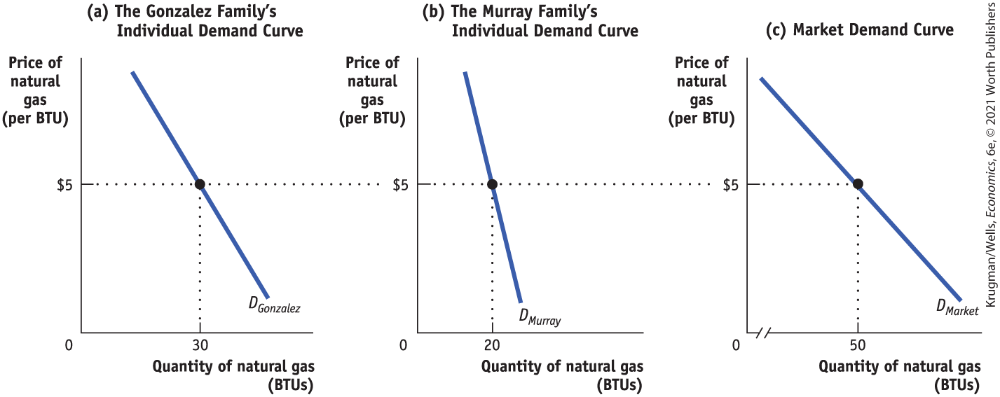
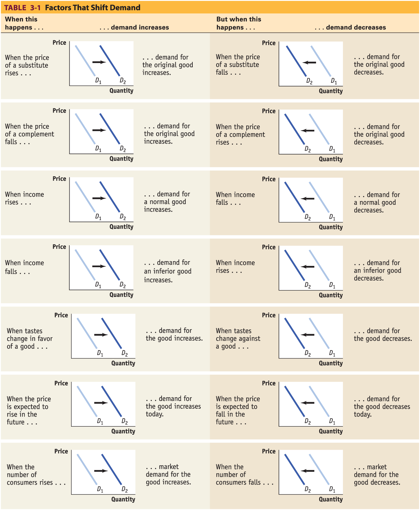
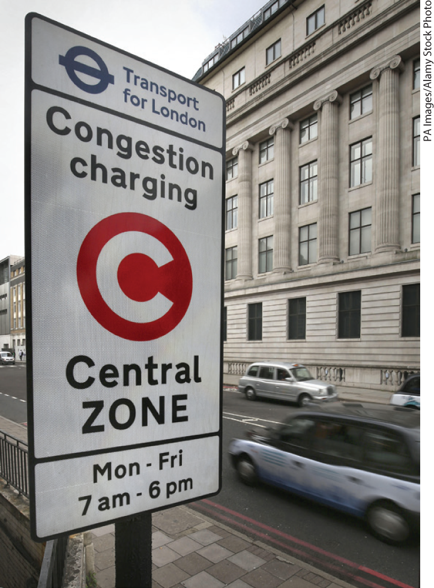
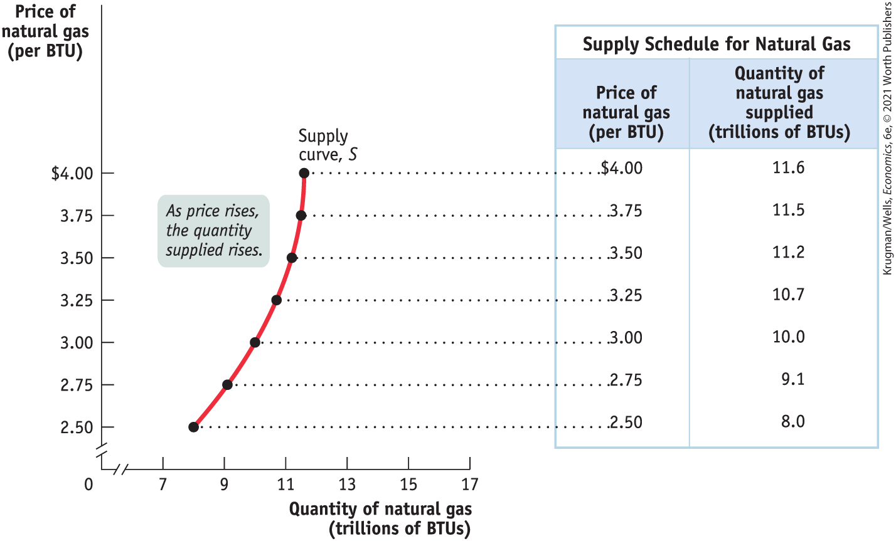
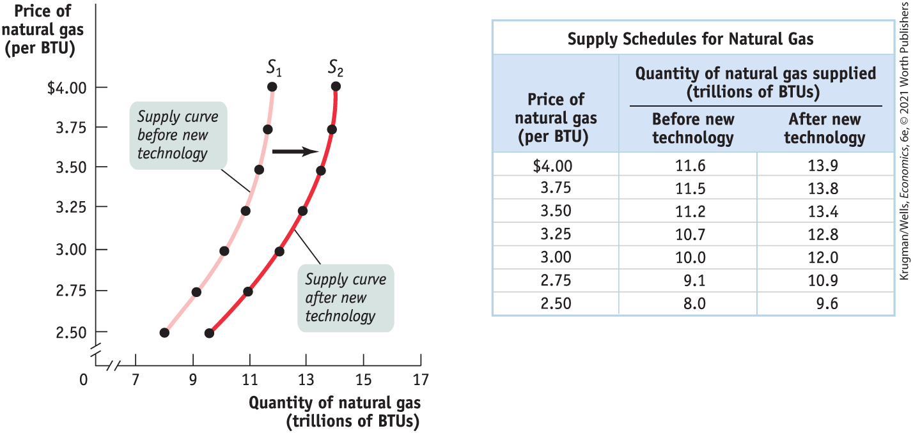
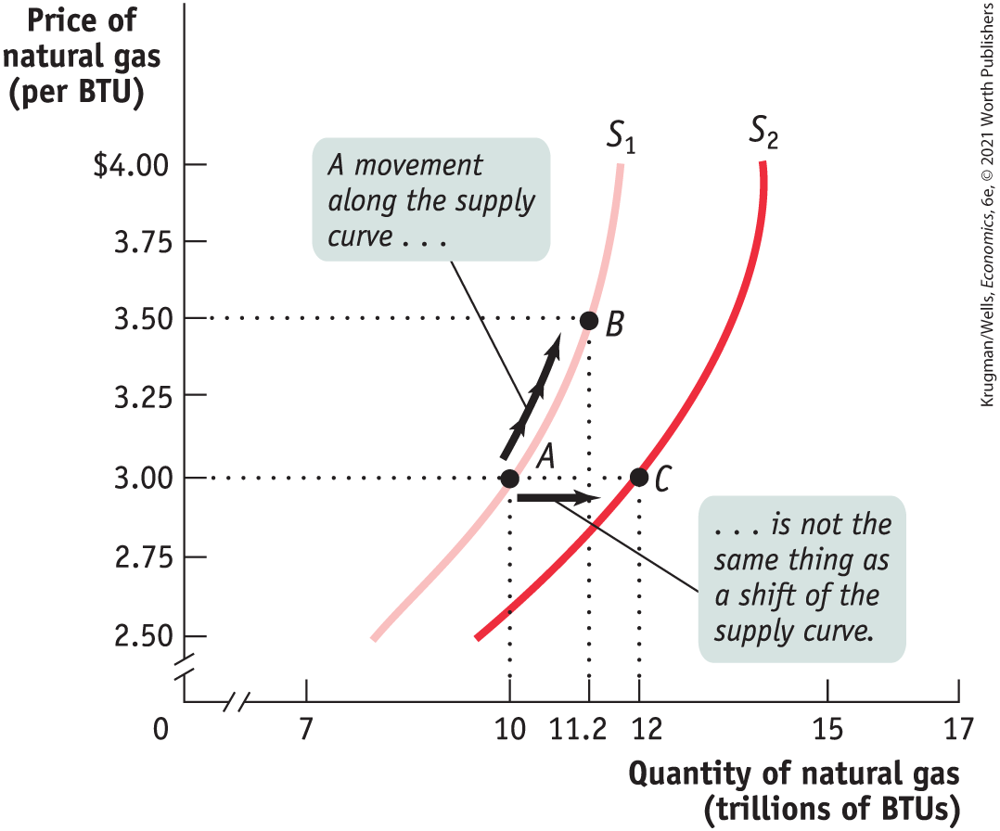
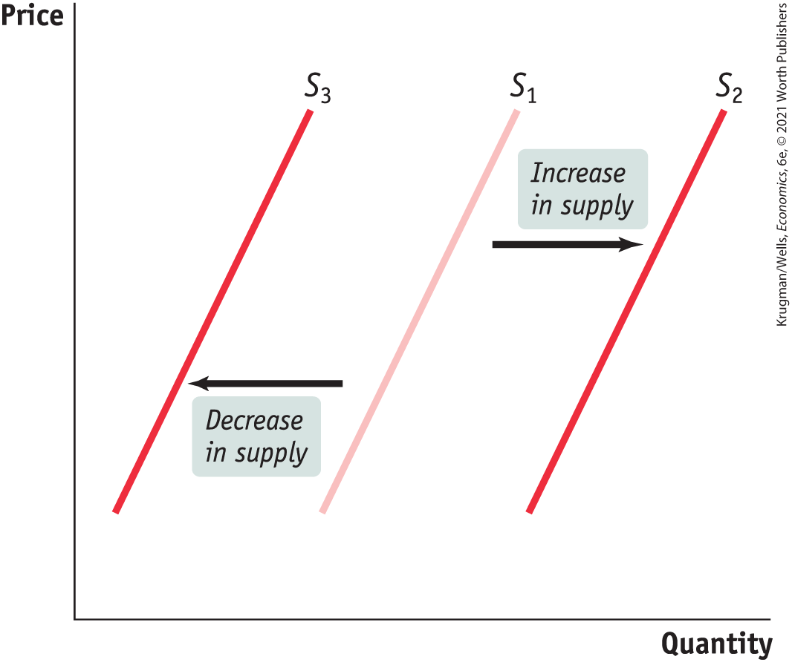

#### Changes in Income

Why did the stronger economy in 2006 lead to an increase in the demand for natural gas compared to the demand during the weak economy of 2002? It was because the economy was stronger and Americans had more income, making them more likely to purchase more of *most* goods and services at any given price. For example, with a higher income you are likely to keep your house warmer in the winter than if your income is low.

<figure id="pau_9781319320164_1Ay6f9tIVj" class="figure lm_img_lightbox unnum c2 right">

<figcaption>
Consumption of normal goods increases when incomes increase, benefiting businesses like casual-dining restaurants, but at the expense of fast-food outlets.
</figcaption>
</figure>

And, the demand for natural gas, a major source of fuel for electricity-generating power plants, is tied to the demand for other goods and services. For example, businesses must consume power in order to provide goods and services to households. So when the economy is strong and household incomes are high, businesses will consume more electricity and, indirectly, more natural gas.

Why do we say that people are likely to purchase more of “*most* goods,” rather than purchase more of “*all* goods”? Most goods are <a href="#kru_9781319245269_EM_glossary.xhtml#pau_9781319320164_HEpCS66rP7" id="kru_9781319245269_ch03_03.xhtml#pau_9781319320164_jz8Vs6MjLg" class="glossref" role="doc-glossref">normal goods</a> — the demand for them increases when consumer income rises. However, the demand for some products falls when income rises. Goods for which demand decreases when income rises are known as <a href="#kru_9781319245269_EM_glossary.xhtml#pau_9781319320164_5QubevTlYT" id="kru_9781319245269_ch03_03.xhtml#pau_9781319320164_CnKzTcFOFS" class="glossref" role="doc-glossref">inferior goods</a>. Usually an inferior good is considered less desirable than more expensive alternatives — such as a bus ride versus a taxi ride. When they can afford to, people stop buying an inferior good and switch their consumption to the preferred, more expensive alternative. So when a good is inferior, a rise in income shifts the demand curve to the left. And, not surprisingly, a fall in income shifts the demand curve to the right.

<aside aria-label="title9" class="glossary c3 main-flow v1" epub:type="glossary" id="pau_9781319320164_BcncRxZ8Sc">

**normal good**  
When a rise in income increases the demand for a good — the normal case — it is a **normal good.**

</aside>
<aside aria-label="title10" class="glossary c3 main-flow v1" epub:type="glossary" id="pau_9781319320164_Dc3dOg0RF5">

**inferior good**  
When a rise in income decreases the demand for a good, it is an **inferior good.**

</aside>

One example of the distinction between normal and inferior goods that has drawn attention in the business press is the difference between so-called casual-dining restaurants such as Buffalo Wild Wings or Olive Garden and fast-food chains such as Burger King or McDonald’s. When their incomes rise, Americans tend to eat out more at casual-dining restaurants. However, some of that increased dining out comes at the expense of fast-food venues — to some extent, people visit McDonald’s less often once they can afford to move upscale. So casual dining is a normal good, whereas fast-food consumption appears to be an inferior good.

#### Changes in Tastes

Why do people want what they want? Fortunately, we don’t need to answer that question — we just need to acknowledge that people have certain preferences, or tastes, that determine what they choose to consume and that these tastes can change. Economists usually lump together changes in demand due to trends, beliefs, cultural shifts, and so on under the heading of changes in tastes or preferences.

For example, once upon a time men wore hats. Up until around World War II, a respectable man wasn’t fully dressed unless he wore a dignified hat along with his suit. But the returning troops adopted a more informal style. And President Eisenhower, who had been supreme commander of Allied Forces before becoming president, often went hatless. After World War II, it was clear that the demand curve for hats had shifted leftward, reflecting a decrease in the demand for hats.

Economists have relatively little to say about the forces that influence consumers’ tastes. (Although marketers and advertisers have plenty to say about them!) However, a change in tastes does have a predictable impact on demand. When tastes change in favor of a good, more people want to buy it at any given price, so the demand curve shifts to the right. When tastes change against a good, fewer people want to buy it at any given price, so the demand curve shifts to the left.

#### Changes in Expectations

When consumers have some choice about when to make a purchase, current demand for a good is often affected by expectations about its future price. For example, savvy shoppers often wait for seasonal sales — say, buying next year’s holiday decorations during the post-holiday markdowns. In this case, expectations of a future drop in price lead to a decrease in demand today. Alternatively, expectations of a future rise in price are likely to cause an increase in demand today.

In addition, the fall in gas prices in recent years to around \$2 per BTU has spurred more consumers to switch to natural gas from other fuel types than when natural gas fell to \$2 per BTU in 2002. But why are consumers more willing to switch now? Because in 2002, consumers didn’t expect the fall in the price of natural gas to last — and they were right.

In 2002, natural gas prices fell because of the weak economy. That situation changed in 2006 when the economy came roaring back and the price of natural gas rose dramatically. In contrast, consumers have come to expect that the more recent fall in the price of natural gas will not be temporary because it is based on a permanent change: the ability to tap much larger deposits of natural gas.

Expected changes in future income can also lead to changes in demand: if you expect your income to rise in the future, you will typically borrow today and increase your demand for certain goods; if you expect your income to fall in the future, you are likely to save today and reduce your demand for some goods.

#### Changes in the Number of Consumers

Another factor that can cause a change in demand is a change in the number of consumers of a good or service. For example, population growth in the United States eventually leads to higher demand for natural gas as more homes and businesses need to be heated in the winter and cooled in the summer.

Let’s introduce a new concept: the <a href="#kru_9781319245269_EM_glossary.xhtml#pau_9781319320164_1v3Z0FgD8j" id="kru_9781319245269_ch03_03.xhtml#pau_9781319320164_EAaKiPKaoU" class="glossref" role="doc-glossref">individual demand curve</a>, which shows the relationship between quantity demanded and price for an individual consumer. For example, suppose that the Gonzalez family is a consumer of natural gas for heating and cooling their home. Panel (a) of <a href="#kru_9781319245269_ch03_03.xhtml#pau_9781319320164_tZdctlMnlJ" id="kru_9781319245269_ch03_03.xhtml#pau_9781319320164_om3iKqytfj" class="crossref">Figure 3-5</a> shows how many BTUs of natural gas they will buy per year at any given price. The Gonzalez family’s individual demand curve is *DGonzalez*.

<aside aria-label="title11" class="glossary c3 main-flow v1" epub:type="glossary" id="pau_9781319320164_mkn83ITWRq">

**individual demand curve**  
An **individual demand curve** illustrates the relationship between quantity demanded and price for an individual consumer.

</aside>

<figure id="pau_9781319320164_tZdctlMnlJ" class="figure lm_img_lightbox num c4 main-flow">

<figcaption>
FIGURE 3-5 Individual Demand Curves and the Market Demand Curve

The Gonzalez family and the Murray family are the only two consumers of natural gas in the market. Panel (a) shows the Gonzalez family’s individual demand curve: the number of BTUs they will buy per year at any given price. Panel (b) shows the Murray family’s individual demand curve. Given that the Gonzalez family and the Murray family are the only two consumers, the <em>market demand curve,</em> which shows the quantity of BTUs demanded by all consumers at any given price, is shown in the panel (c). The market demand curve is the <em>horizontal sum</em> of the individual demand curves of all consumers. In this case, at any given price, the quantity demanded by the market is the sum of the quantities demanded by the Gonzalez family and the Murray family.
</figcaption>
</figure>

<aside class="hidden" id="pau_9781319320164_pdRYZUv1H1" title="hidden">

The line D Gonzalez on graph a, titled ‘The Gonzalez Family’s Individual Demand Curve,’ has a moderate slope, and it passes through the point representing 30 B T Us and 5 dollars. The line D Murray on graph b, titled ‘The Murray Family’s Individual Demand Curve,’ has a steeper slope, and it passes through the point representing 20 B T Us and 5 dollars. The line D Market on graph c, titled ‘Market Demand Curve,’ has a less steep slope than the other two, and it passes through the point representing 50 B T Us and 5 dollars.

</aside>

The *market demand curve* shows how the combined quantity demanded by all consumers depends on the market price of the good. (Most of the time when economists refer to the demand curve they mean the market demand curve.) The market demand curve is the *horizontal sum* of the individual demand curves of all consumers in that market.

To see what we mean by the term *horizontal sum,* assume for a moment that there are only two consumers of natural gas, the Gonzalez family and the Murray family. The Murray family consumes natural gas to fuel their natural gas–powered car. The Murray family’s individual demand curve, *DMurray*, is shown in panel (b). Panel (c) shows the market demand curve. At any given price, the quantity demanded by the market is the sum of the quantities demanded by the Gonzalez family and the Murray family. For example, at a price of \$5 per BTU, the Gonzalez family demands 30 BTUs of natural gas per year and the Murray family demands 20 BTUs per year. So the quantity demanded by the market is 50 BTUs per year, as seen on the market demand curve, *D**Market*.

Clearly, the quantity demanded by the market at any given price is larger with the Murray family present than it would be if the Gonzalez family were the only consumer. The quantity demanded at any given price would be even larger if we added a third consumer, then a fourth, and so on. So an increase in the number of consumers leads to an increase in demand.

For a review of the factors that shift demand, see <a href="#kru_9781319245269_ch03_03.xhtml#pau_9781319320164_j4EhZAnYs6" id="kru_9781319245269_ch03_03.xhtml#pau_9781319320164_wQfF0UxFw3" class="crossref">Table 3-1</a>.

<figure id="pau_9781319320164_j4EhZAnYs6" class="figure lm_img_lightbox unnum c4 main-flow">

</figure>

<aside class="hidden" id="pau_9781319320164_KjO1Cd52A1" title="hidden">

The table head reads: Table 3-1 Factors That Shift Demand. For the seven cases of increasing demand, D 2 is to the right of D 1. For the seven cases of decreasing demand, D 2 is to the left of D 1. Factors that contribute to an increase in demand are as follows. When the price of a substitute rises, demand for the original good increases. When the price of a complement falls, demand for the original good increases. When income rises, demand for a normal good increases. When income falls, demand for an inferior good increases. When tastes change in favor of a good, demand for the good increases. When the price is expected to rise in the future, demand for the good increases today. When the number of consumers rises, market demand for the good increases. Factors that contribute to a decrease in demand are as follows. When the price of a substitute falls, demand for the original good decreases. When the price of a complement rises, demand for the original good decreases. When income falls, demand for a normal good decreases. When income rises, demand for an inferior good decreases. When tastes change against a good, demand for the good decreases. When the price is expected to fall in the future, demand for the good decreases today. When the number of consumers falls, market demand for the good decreases.

</aside>

### ECONOMICS \>\> *in Action*

Beating the Traffic

All big cities have traffic problems, and many local authorities try to discourage driving in the crowded city center. If we think of an auto trip to the city center as a good that people consume, we can use the economics of demand to analyze anti-traffic policies.

<figure id="pau_9781319320164_GtwA7HNcWy" class="figure lm_img_lightbox unnum c2 right">

<figcaption>
Cities can reduce traffic congestion by raising the price of driving.
</figcaption>
</figure>

One common strategy is to reduce the demand for auto trips by lowering the prices of substitutes. Many metropolitan areas subsidize bus and rail service, hoping to lure commuters out of their cars. An alternative is to raise the price of complements: several major U.S. cities impose high taxes on commercial parking garages and impose short time limits on parking meters, both to raise revenue and to discourage people from driving into the city.

A few major cities — including Singapore, London, Oslo, Stockholm, and Milan — have been willing to adopt a direct and politically controversial approach: reducing congestion by raising the price of driving. Under *congestion pricing,* a charge is imposed on cars entering the city center during business hours. Drivers buy passes, which are then debited electronically as they drive by monitoring stations. Compliance is monitored with cameras that photograph license plates.

The standard cost of driving into London is currently £11.50 (about \$15). Drivers who don’t pay and are caught pay a fine of £130 (about \$171) for each transgression.

Not surprisingly, studies have shown that after the implementation of congestion pricing, traffic does decrease. In the 1990s, London had some of the worst traffic in Europe. The introduction of its congestion charge in 2003 immediately reduced traffic in the city center by about 15%. Fifteen years later, by 2018, the policy was still working, as traffic volumes are still 25% lower than they were in the late 1990s. And there has been increased use of substitutes, such as public transportation, bicycles, and ride-hailing. From 2001 to 2011, bike trips in London increased by 79%, and bus usage was up by 30%.

And less congestion led not just to fewer accidents, but to a lower *rate* of accidents as fewer cars jostled for space. One study found that from 2000 to 2010 the number of accidents per mile driven in London fell by 40%. Stockholm experienced effects similar to those in London: traffic fell by 22% in 2013 compared to pre-congestion charge levels, transit times fell by one-third to one-half, and air quality measurably improved. A 2018 article found that serious childhood asthma attacks declined significantly in Stockholm after the congestion charge was imposed.

Congestion pricing is now getting the attention of city planners in the United States. New York City will become the first American city to implement congestion pricing as of 2020, with Los Angeles, Seattle, and Portland, Oregon, currently considering plans to do the same.

### *\>\> Quick Review*

- The **supply and demand model** is a model of a **competitive market** — one in which there are many buyers and sellers of the same good or service.
- The **demand schedule** shows how the **quantity demanded** changes as the price changes. A **demand curve** illustrates this relationship.
- The **law of demand** asserts that a higher price reduces the quantity demanded. Thus, demand curves normally slope downward.
- An increase in demand leads to a rightward **shift of the demand curve:** the quantity demanded rises for any given price. A decrease in demand leads to a leftward shift: the quantity demanded falls for any given price. A change in price results in a change in the quantity demanded and a **movement along the demand curve.**
- The five main factors that can shift the demand curve are changes in (1) the price of a related good, such as a **substitute** or a **complement**, (2) income, (3) tastes, (4) expectations, and (5) the number of consumers.
- The market demand curve is the horizontal sum of the **individual demand curves** of all consumers in the market.

### *\>\> Check Your Understanding* 3-1

1.  Explain whether each of the following events represents (i) a *shift of* the demand curve or (ii) a *movement along* the demand curve.
    1.  A store owner finds that customers are willing to pay more for umbrellas on rainy days.
    2.  When Circus Cruise Lines offered reduced prices for summer cruises in the Caribbean, their number of bookings increased sharply.
    3.  People buy more long-stem roses the week of Valentine’s Day, even though the prices are higher than at other times during the year.
    4.  A sharp rise in the price of gasoline leads many commuters to join carpools in order to reduce their gasoline purchases.

## The Supply Curve

Some deposits of natural gas are easier to tap than others. Before the widespread use of fracking, drillers would limit their natural gas wells to deposits that lay in easily reached pools beneath the earth. How much natural gas they would tap from existing wells, and how extensively they searched for new deposits and drilled new wells, depended on the price they expected to get for the natural gas. The higher the price, the more they would tap existing wells as well as drill and tap new wells.

So just as the quantity of natural gas that consumers want to buy depends upon the price they have to pay, the quantity that producers of natural gas, or of any good or service, are willing to produce and sell — the <a href="#kru_9781319245269_EM_glossary.xhtml#pau_9781319320164_3Ij2KRSjDL" id="kru_9781319245269_ch03_04.xhtml#pau_9781319320164_bINLvc0yL8" class="glossref" role="doc-glossref">quantity supplied</a> — depends upon the price they are offered.

<aside aria-label="title1" class="glossary c3 main-flow v1" epub:type="glossary" id="pau_9781319320164_G4a25lYRfx">

**quantity supplied**  
The **quantity supplied** is the actual amount of a good or service people are willing to sell at some specific price.

</aside>

### The Supply Schedule and the Supply Curve

The table in <a href="#kru_9781319245269_ch03_04.xhtml#pau_9781319320164_NWHknC6xwB" id="kru_9781319245269_ch03_04.xhtml#pau_9781319320164_z8dRqrPsPD" class="crossref">Figure 3-6</a> shows how the quantity of natural gas made available varies with the price — that is, it shows a hypothetical <a href="#kru_9781319245269_EM_glossary.xhtml#pau_9781319320164_J55lhfwYcy" id="kru_9781319245269_ch03_04.xhtml#pau_9781319320164_6TJeKTbqt6" class="glossref" role="doc-glossref">supply schedule</a> for natural gas.

<aside aria-label="title2" class="glossary c3 main-flow v1" epub:type="glossary" id="pau_9781319320164_jx4QTz8Kwo">

**supply schedule**  
A **supply schedule** shows how much of a good or service would be supplied at different prices.

</aside>

<figure id="pau_9781319320164_NWHknC6xwB" class="figure lm_img_lightbox num c4 main-flow">

<figcaption>
FIGURE 3-6 The Supply Schedule and the Supply Curve

The supply schedule for natural gas is plotted to yield the corresponding supply curve, which shows how much of a good producers are willing to sell at any given price. The supply curve and the supply schedule reflect the fact that supply curves are usually upward sloping: the quantity supplied rises when the price rises.
</figcaption>
</figure>

<aside class="hidden" id="pau_9781319320164_cA7w6oLQoA" title="hidden">

The curve is the Supply curve, S, and the slope shows that as price rises, the quantity supplied rises. The price of natural gas (per B T U) and the quantity of natural gas supplied (trillions of B T Us) as per the seven points plotted on the curve are tabulated as follows. Price: 4 dollars; Quantity: 11.6 trillion.Price: 3.75 dollars; Quantity: 11.5 trillion.Price: 3.50 dollars; Quantity: 11.2 trillion.Price: 3.25 dollars; Quantity: 10.7 trillion.Price: 3 dollars; Quantity: 10 trillion.Price: 2.75 dollars; Quantity: 9.1 trillion.Price: 2.50 dollars; Quantity: 8 trillion.

</aside>

A supply schedule works the same way as the demand schedule shown in <a href="#kru_9781319245269_ch03_03.xhtml#pau_9781319320164_0qRhqgIUp6" id="kru_9781319245269_ch03_04.xhtml#pau_9781319320164_6IbU5nMFEu" class="crossref">Figure 3-1</a>: in this case, the table shows the number of BTUs of natural gas producers are willing to sell at different prices. At a price of \$2.50 per BTU, producers are willing to sell only 8 trillion BTUs of natural gas per year. At \$2.75 per BTU, they’re willing to sell 9.1 trillion BTUs. At \$3, they’re willing to sell 10 trillion BTUs, and so on.

In the same way that a demand schedule can be represented graphically by a demand curve, a supply schedule can be represented by a <a href="#kru_9781319245269_EM_glossary.xhtml#pau_9781319320164_frDHNkum85" id="kru_9781319245269_ch03_04.xhtml#pau_9781319320164_05jR3lCe07" class="glossref" role="doc-glossref">supply curve</a>, as shown in <a href="#kru_9781319245269_ch03_04.xhtml#pau_9781319320164_NWHknC6xwB" id="kru_9781319245269_ch03_04.xhtml#pau_9781319320164_8ZvgK3Olk8" class="crossref">Figure 3-6</a>. Each point on the curve represents an entry from the table.

<aside aria-label="title3" class="glossary c3 main-flow v1" epub:type="glossary" id="pau_9781319320164_oOb4gyljeH">

**supply curve**  
A **supply curve** shows the relationship between quantity supplied and price.

</aside>

Suppose that the price of natural gas rises from \$3 to \$3.25; we can see that the quantity of natural gas that producers are willing to sell rises from 10 trillion to 10.7 trillion BTUs. This is the normal situation for a supply curve, that a higher price leads to a higher quantity supplied. So just as demand curves normally slope downward, supply curves normally slope upward: the higher the price being offered, the more of any good or service producers will be willing to sell.

### Shifts of the Supply Curve

As we discussed in the introduction to this chapter, innovations in the technology of drilling natural gas deposits have led to a huge increase in U.S. production of natural gas. <a href="#kru_9781319245269_ch03_04.xhtml#pau_9781319320164_VbIH1QzKjj" id="kru_9781319245269_ch03_04.xhtml#pau_9781319320164_VYZHcAJlba" class="crossref">Figure 3-7</a> illustrates these events in terms of the supply schedule and the supply curve for natural gas. The table in <a href="#kru_9781319245269_ch03_04.xhtml#pau_9781319320164_VbIH1QzKjj" id="kru_9781319245269_ch03_04.xhtml#pau_9781319320164_jpGbfZD9kp" class="crossref">Figure 3-7</a> shows two supply schedules. The schedule before improved natural gas–drilling technology was adopted is the same one as in <a href="#kru_9781319245269_ch03_04.xhtml#pau_9781319320164_NWHknC6xwB" id="kru_9781319245269_ch03_04.xhtml#pau_9781319320164_P2pCSaFpMs" class="crossref">Figure 3-6</a>. The second schedule shows the supply of natural gas *after* the improved technology was adopted.

<figure id="pau_9781319320164_VbIH1QzKjj" class="figure lm_img_lightbox num c4 main-flow">

<figcaption>
FIGURE 3-7 An Increase in Supply

The adoption of an improved natural gas–drilling technology generated an increase in supply—a rise in the quantity supplied at any given price. This event is represented by the two supply schedules—one showing supply before the new technology was adopted, the other showing supply after the new technology was adopted—and their corresponding supply curves. The increase in supply shifts the supply curve to the right.
</figcaption>
</figure>

<aside class="hidden" id="pau_9781319320164_9WPnHOCBb3" title="hidden">

The positive sloping supply curve before new technology, S 1, extends through (8, 2.50), (9.1, 2.75), (10, 3), (10.7, 3.25), (11.2, 3.50), (11.5, 3.75), and (11.6, 4). The positive sloping supply curve after new technology, S 2, extends through (9.6, 2.50), (10.9, 2.75), (12, 3), (12.8, 3.25), (13.4, 3.50), (13.8, 3.75), and (13.9, 4). An arrow from curve S 1 to curve S 2 indicates the rightward shift.An inset table tabulates the supply schedules for natural gas as per the graph. The column headers are Price of natural gas (per B T U) and Quantity of natural gas supplied (trillions of B T Us) before new technology and after new technology.

</aside>

Just as a change in demand schedules leads to a shift of the demand curve, a change in supply schedules leads to a <a href="#kru_9781319245269_EM_glossary.xhtml#pau_9781319320164_8QxDqEIVcw" id="kru_9781319245269_ch03_04.xhtml#pau_9781319320164_CiKVsdy0af" class="glossref" role="doc-glossref">shift of the supply curve</a> — a change in the quantity supplied at any given price. This is shown in <a href="#kru_9781319245269_ch03_04.xhtml#pau_9781319320164_VbIH1QzKjj" id="kru_9781319245269_ch03_04.xhtml#pau_9781319320164_zjO22jGqsy" class="crossref">Figure 3-7</a> by the shift of the supply curve before the adoption of new natural gas–drilling technology, *S*1, to its new position after the adoption of new natural gas–drilling technology, *S*2. Notice that *S*2 lies to the right of *S*1, a reflection of the fact that quantity supplied rises at any given price.

<aside aria-label="title4" class="glossary c3 main-flow v1" epub:type="glossary" id="pau_9781319320164_UAyktL2eht">

**shift of the supply curve**  
A **shift of the supply curve** is a change in the quantity supplied of a good or service at any given price. It is represented by the change of the original supply curve to a new position, denoted by a new supply curve.

</aside>

As in the analysis of demand, it’s crucial to draw a distinction between such shifts of the supply curve and <a href="#kru_9781319245269_EM_glossary.xhtml#pau_9781319320164_80uyQ04fzC" id="kru_9781319245269_ch03_04.xhtml#pau_9781319320164_YX50s0iiup" class="glossref" role="doc-glossref">movements along the supply curve</a> — changes in the quantity supplied arising from a change in price. We can see this difference in <a href="#kru_9781319245269_ch03_04.xhtml#pau_9781319320164_qv7CKKJE41" id="kru_9781319245269_ch03_04.xhtml#pau_9781319320164_7i7eJ00qGj" class="crossref">Figure 3-8</a>. The movement from point *A* to point *B* is a movement along the supply curve: the quantity supplied rises along *S*1 due to a rise in price. Here, a rise in price from \$3 to \$3.50 leads to a rise in the quantity supplied from 10 trillion to 11.2 trillion BTUs of natural gas. But the quantity supplied can also rise when the price is unchanged if there is an increase in supply — a rightward shift of the supply curve. This is shown by the rightward shift of the supply curve from *S*1 to *S*2. Holding the price constant at \$3, the quantity supplied rises from 10 trillion BTUs at point *A* on *S*1 to 12 billion BTUs at point *C* on *S*2.

<aside aria-label="title5" class="glossary c3 main-flow v1" epub:type="glossary" id="pau_9781319320164_NgVajef5Jd">

**movement along the supply curve**  
A **movement along the supply curve** is a change in the quantity supplied of a good arising from a change in the good’s price.

</aside>

<figure id="pau_9781319320164_qv7CKKJE41" class="figure lm_img_lightbox num c3 main-flow">

<figcaption>
FIGURE 3-8 Movement Along the Supply Curve versus Shift of the Supply Curve

The increase in quantity supplied when going from point <em>A</em> to point <em>B</em> reflects a movement along the supply curve: it is the result of a rise in the price of a good. The increase in quantity supplied when going from point <em>A</em> to point <em>C</em> reflects a shift of the supply curve: it is the result of an increase in the quantity supplied at any given price.
</figcaption>
</figure>

<aside class="hidden" id="pau_9781319320164_5RlZpvGulP" title="hidden">

The positive sloping supply curve S 1 extends from (8, 2.50) to (11.6, 4). The positive sloping supply curve S 2 extends from (9.6, 250) to (13.9, 4). Points A (10, 3) and B (11.2, 3.50) are labeled on curve S 1 and point C (12, 3) on curve S 2. An upward arrow, along the slope of curve S 1, points from point A to point B, representing A movement along the supply curve. A horizontal arrow points from point A to point C, indicating the shift is not the same thing as a shift of the supply curve.

</aside>

### Understanding Shifts of the Supply Curve

<a href="#kru_9781319245269_ch03_04.xhtml#pau_9781319320164_Nxdskg9mWr" id="kru_9781319245269_ch03_04.xhtml#pau_9781319320164_bFPXLbaMZq" class="crossref">Figure 3-9</a> illustrates the two basic ways in which supply curves can shift. When economists talk about an “increase in supply,” they mean a *rightward* shift of the supply curve: at any given price, producers supply a larger quantity of the good than before. This is shown in <a href="#kru_9781319245269_ch03_04.xhtml#pau_9781319320164_Nxdskg9mWr" id="kru_9781319245269_ch03_04.xhtml#pau_9781319320164_Rjo8MUxb9K" class="crossref">Figure 3-9</a> by the rightward shift of the original supply curve *S*1 to *S*2. And when economists talk about a “decrease in supply,” they mean a *leftward* shift of the supply curve: at any given price, producers supply a smaller quantity of the good than before. This is represented by the leftward shift of *S*1 to *S*3.

<figure id="pau_9781319320164_Nxdskg9mWr" class="figure lm_img_lightbox num c3 main-flow">

<figcaption>
FIGURE 3-9 Shifts of the Supply Curve

Any event that increases supply shifts the supply curve to the right, reflecting a rise in the quantity supplied at any given price. Any event that decreases supply shifts the supply curve to the left, reflecting a fall in the quantity supplied at any given price.
</figcaption>
</figure>

<aside class="hidden" id="pau_9781319320164_ZT1bIaY4Av" title="hidden">

The line in the middle is S 1. An arrow shows the line S 2 shifted to the right, representing an increase in supply. Another arrow shows line S 3 shifted to the left, representing a decrease in supply.

</aside>

Economists believe that shifts of the supply curve for a good or service are mainly the result of five factors (though, as with demand, there are other possible causes):

- Changes in input prices
- Changes in the prices of related goods or services
- Changes in technology
- Changes in expectations
- Changes in the number of producers

#### Changes in Input Prices

To produce output, you need inputs. For example, to make vanilla ice cream, you need vanilla beans, cream, sugar, and so on. An <a href="#kru_9781319245269_EM_glossary.xhtml#pau_9781319320164_9NsfvxmSQZ" id="kru_9781319245269_ch03_04.xhtml#pau_9781319320164_f1vG6UQUDx" class="glossref" role="doc-glossref">input</a> is any good or service that is used to produce another good or service. Inputs, like outputs, have prices. And an increase in the price of an input makes the production of the final good more costly for those who produce and sell it. So producers are less willing to supply the final good at any given price, and the supply curve shifts to the left. That is, supply decreases. For example, fuel is a major cost for airlines. When oil prices surged in 2007–2008, airlines began cutting back on their flight schedules and some went out of business or merged with larger airlines.

<aside aria-label="title6" class="glossary c3 main-flow v1" epub:type="glossary" id="pau_9781319320164_qFbj88VHgk">

**input**  
An **input** is a good or service that is used to produce another good or service.

</aside>

Similarly, a fall in the price of an input makes the production of the final good less costly for sellers. They are more willing to supply the good at any given price, and the supply curve shifts to the right. That is, supply increases.

#### Changes in the Prices of Related Goods or Services

A single producer often produces a mix of goods rather than a single product. For example, an oil refinery produces gasoline from crude oil, but it also produces heating oil and other products from the same raw material. When a producer sells several products, the quantity of any one good it is willing to supply at any given price depends on the prices of its other co-produced goods.

This effect can run in either direction. An oil refiner will supply less gasoline at any given price when the price of heating oil rises, shifting the supply curve for gasoline to the left. But it will supply more gasoline at any given price when the price of heating oil falls, shifting the supply curve for gasoline to the right. This means that gasoline and other co-produced oil products are *substitutes in production* for refiners.

In contrast, due to the nature of the production process, other goods can be *complements in production.* Producers of natural gas often find that natural gas wells also produce oil as a by-product of extraction. The higher the price at which a driller can sell its oil, the more willing it will be to drill natural gas wells and the more natural gas it will supply at any given price. Higher oil prices then lead to more natural gas supplied at any given price because oil and natural gas can be tapped simultaneously. As a result, oil is a complement in the production of natural gas. The reverse is also true: natural gas is a complement in the production of oil.

#### Changes in Technology

As the opening story illustrates, changes in technology affect the supply curve. Technology improvements enable producers to spend less on inputs (in this case, drilling equipment, labor, land purchases, and so on), yet still produce the same amount of output. When a better technology becomes available, reducing the cost of production, supply increases and the supply curve shifts to the right.

Improved technology enabled natural gas producers to more than double output in less than two years. Technology is also the main reason that natural gas has remained relatively cheap, even as demand has grown.

#### Changes in Expectations

Just as changes in expectations can shift the demand curve, they can also shift the supply curve. When suppliers have some choice about when they put their good up for sale, changes in the expected future price of the good can lead a supplier to supply less or more of the good today.

Consider the fact that gasoline and other oil products are often stored for significant periods of time at oil refineries before being sold to consumers. In fact, storage is normally part of producers’ business strategy. Knowing that the demand for gasoline peaks in the summer, oil refiners normally store some of their gasoline produced during the spring for summer sale. Similarly, knowing that the demand for heating oil peaks in the winter, they normally store some of their heating oil produced during the fall for winter sale.

In each case, there’s a decision to be made between selling the product now versus storing it for later sale. The choice a producer makes depends on a comparison of the current price and the expected future price. This example illustrates how changes in expectations can alter supply: an increase in the anticipated future price of a good or service reduces supply today, a leftward shift of the supply curve. But a fall in the anticipated future price increases supply today, a rightward shift of the supply curve.
