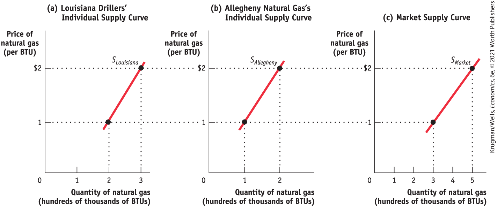
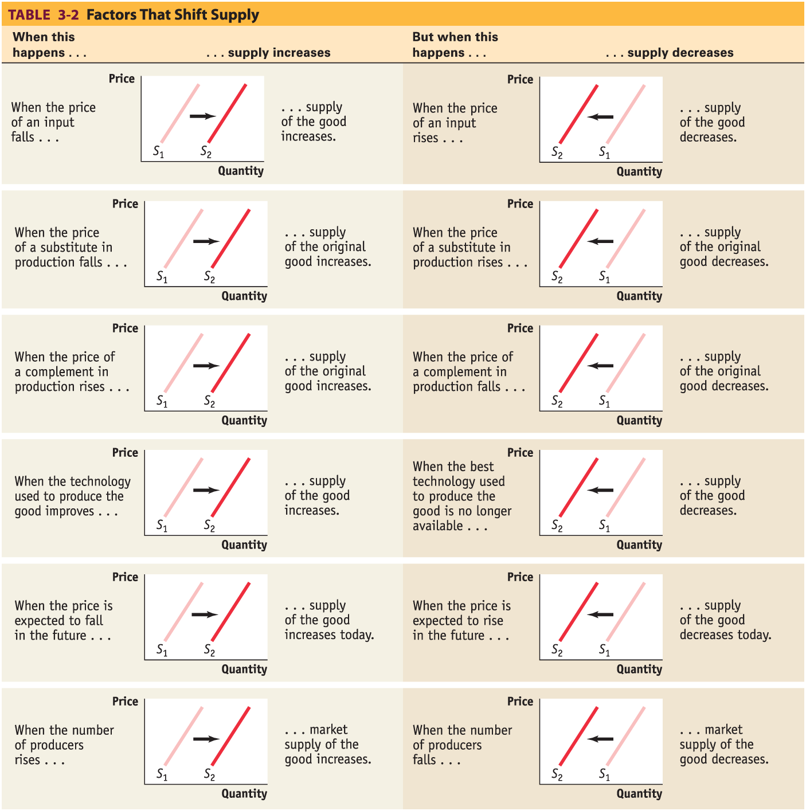
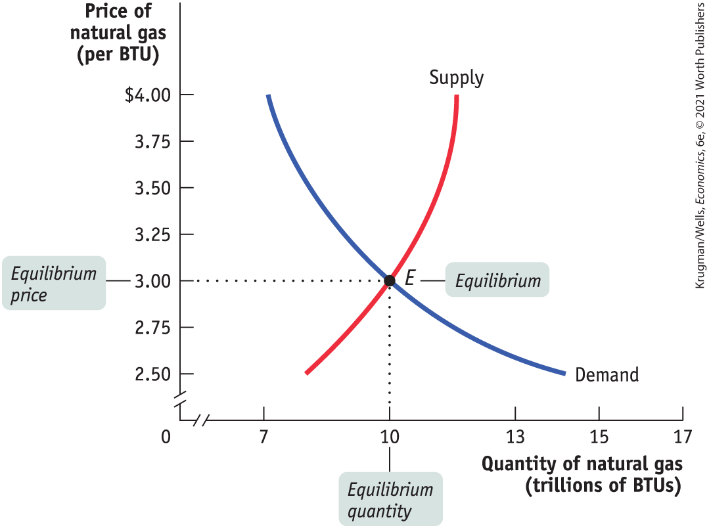
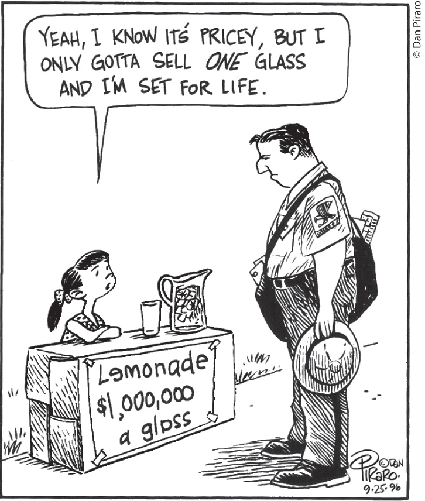
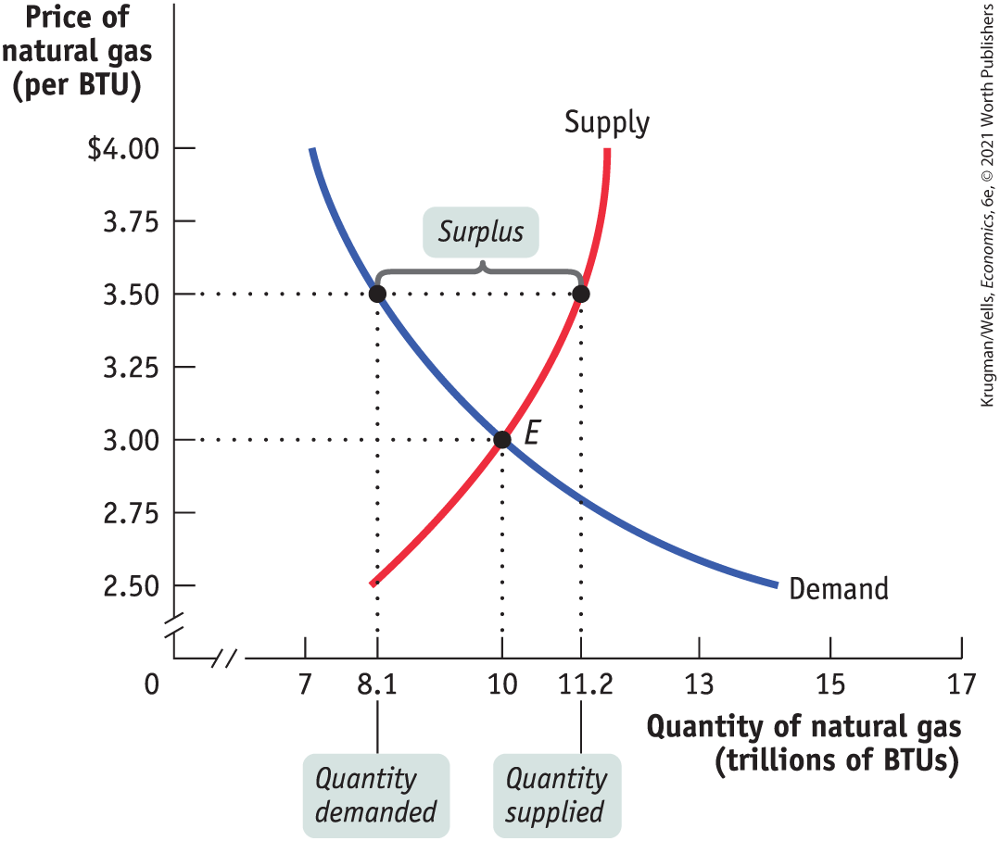
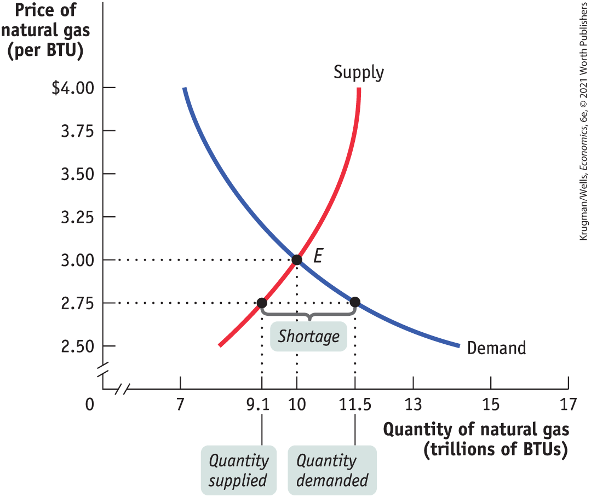
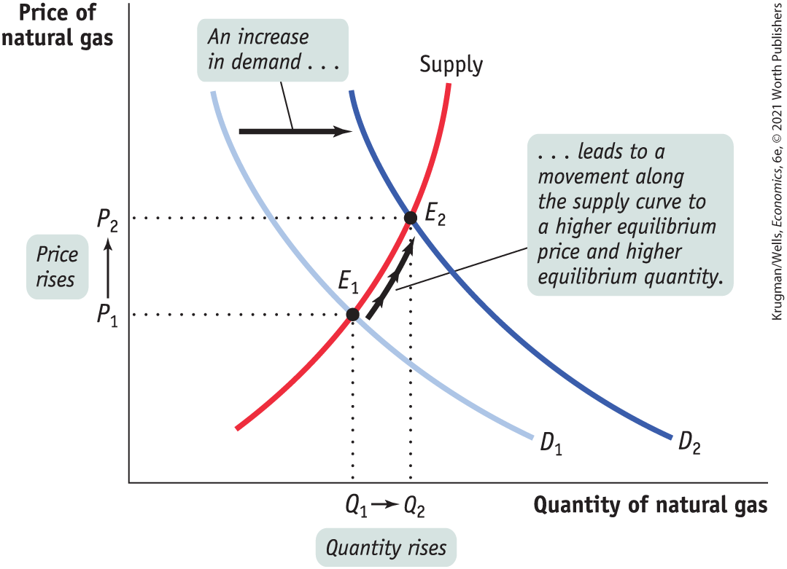

#### Changes in the Number of Producers

Just as changes in the number of consumers affect the demand curve, changes in the number of producers affect the supply curve. Let’s examine the <a href="#kru_9781319245269_EM_glossary.xhtml#pau_9781319320164_KUHy3tjd7u" id="kru_9781319245269_ch03_04.xhtml#pau_9781319320164_Sw9NWy5etI" class="glossref" role="doc-glossref">individual supply curve</a>, by looking at panel (a) in <a href="#kru_9781319245269_ch03_04.xhtml#pau_9781319320164_8ar7Np0NOp" id="kru_9781319245269_ch03_04.xhtml#pau_9781319320164_2sZAtWnedh" class="crossref">Figure 3-10</a>. The individual supply curve shows the relationship between quantity supplied and price for an individual producer. For example, suppose that Louisiana Drillers is a natural gas producer and that panel (a) of <a href="#kru_9781319245269_ch03_04.xhtml#pau_9781319320164_8ar7Np0NOp" id="kru_9781319245269_ch03_04.xhtml#pau_9781319320164_0PucwgSL6a" class="crossref">Figure 3-10</a> shows the quantity of BTUs it will supply per year at any given price. Then *SLouisiana* is its individual supply curve.

<aside aria-label="title7" class="glossary c3 main-flow v1" epub:type="glossary" id="pau_9781319320164_n8aZc0C6l7">

**individual supply curve**  
An **individual supply curve** illustrates the relationship between quantity supplied and price for an individual producer.

</aside>

<figure id="pau_9781319320164_8ar7Np0NOp" class="figure lm_img_lightbox num c4 main-flow">

<figcaption>
FIGURE 3-10 The Individual Supply Curve and the Market Supply Curve

Panel (a) shows the individual supply curve for Louisiana Drillers, <em>S</em><em>Louisiana</em><em>,</em> the quantity it will sell at any given price. Panel (b) shows the individual supply curve for Allegheny Natural Gas, <em>S</em><em>Allegheny</em>. The market supply curve, which shows the quantity of natural gas supplied by all producers at any given price is shown in panel (c). The market supply curve is the horizontal sum of the individual supply curves of all producers.
</figcaption>
</figure>

<aside class="hidden" id="pau_9781319320164_D08Pg5I0Te" title="hidden">

The line S Louisiana on graph a, titled ‘Louisiana Driller’s Individual Supply Curve,’ passes through the points representing 2 hundred thousand B T Us, 1 dollar and 3 hundred thousand B T Us, 2 dollars. The line S Allegheny on graph b, titled ‘Allegheny Natural Gas’s Individual Supply Curve,’ passes through the points representing 1 hundred thousand B T Us, 1 dollar and 2 hundred thousand B T Us, 2 dollars. The line S Market on graph c, titled ‘Market Supply Curve,’ passes through the points representing 3 hundred thousand B T Us, 1 dollar and 5 hundred thousand B T Us, 2 dollars.

</aside>

The *market supply curve* shows how the combined total quantity supplied by all individual producers in the market depends on the market price of that good. Just as the market demand curve is the horizontal sum of the individual demand curves of all consumers, the market supply curve is the horizontal sum of the individual supply curves of all producers. Assume for a moment that there are only two natural gas producers, Louisiana Drillers and Allegheny Natural Gas. Allegheny’s individual supply curve is shown in panel (b). Panel (c) shows the market supply curve. At any given price, the quantity supplied to the market is the sum of the quantities supplied by Louisiana Drillers and Allegheny Natural Gas. For example, at a price of \$1 per BTU, Louisiana Drillers supplies 200,000 BTUs and Allegheny Natural Gas supplies 100,000 BTUs per year, making the quantity supplied to the market 300,000 BTUs.

Clearly, the quantity supplied to the market at any given price is larger when Allegheny Natural Gas is also a producer than it would be if Louisiana Drillers were the only supplier. The quantity supplied at a given price would be even larger if we added a third producer, then a fourth, and so on. So an increase in the number of producers leads to an increase in supply and a rightward shift of the supply curve.

For a review of the factors that shift supply, see <a href="#kru_9781319245269_ch03_04.xhtml#pau_9781319320164_wz1fJaT5cH" id="kru_9781319245269_ch03_04.xhtml#pau_9781319320164_OJmxfbpgdl" class="crossref">Table 3-2</a>.

<figure id="pau_9781319320164_wz1fJaT5cH" class="figure lm_img_lightbox unnum c4 main-flow">

</figure>

<aside class="hidden" id="pau_9781319320164_VrNj4nMbSs" title="hidden">

The table head reads: Table 3-2 Factors That Shift Supply. For the six cases of increasing supply, S 2 is to the right of S 1. For the six cases of decreasing supply, S 2 is to the left of S 1. Factors that contribute to an increase in supply are as follows. When the price of an input falls, supply of the good increases. When the price of a substitute in production falls, supply of the original good increases. When the price of a complement in production rises, supply of the original good increases. When the technology used to produce the good improves, supply of the good increases. When the price is expected to fall in the future, supply of the good increases today. When the number of producers rises, market supply of the good increases. Factors that contribute to a decrease in supply are as follows. When the price of an input rises, supply of the good decreases. When the price of a substitute in production rises, supply of the original good decreases. When the price of a complement in production falls, supply of the original good decreases. When the best technology used to produce the good is no longer available, supply of the good decreases. When the price is expected to rise in the future, supply of the good decreases today. When the number of producers falls, market supply of the good decreases. 

</aside>

### ECONOMICS \>\> *in Action*

The Plunging Cost of Solar Panels

The cost of solar panels has fallen by a stunning 99% over the last 40 years, making large-scale generation of solar energy an even more economical choice than more conventional forms of energy, such as coal-generated power. The lower cost of solar panels accounts for the proliferation of skyward-facing blue rectangles visible all across the United States. And, the cost of solar panels is projected to keep falling. Costs are projected to decline by 60% from 2019 to 2050 under the current state of technology, according to the National Renewable Energy Laboratory. Technological breakthroughs could result in an even greater decline.

<figure id="pau_9781319320164_kwYpUW7oUK" class="figure lm_img_lightbox unnum c2 right">

<figcaption>
Advances in technology and a change in the number of producers of polysilicon, a key input, contributed to the plunging cost of solar panels.
</figcaption>
</figure>

What accounts for the enormous reductions in the cost of solar energy? There are two explanations. First, advances in technology played a major part. Over time, engineers discovered new, more efficient ways to convert solar rays into usable energy. These new technologies allowed solar panel producers to reduce the cost of production, increasing supply, which shifted the supply curve to the right.

The second driver of the plunge in solar panel prices began with an event that actually caused the price to increase: a change in the cost of a key input — polysilicon — that then led to a change in the number of producers.

Until 2008, solar panels were still relatively expensive and the market for them, while growing, was still small. That same year, polysilicon, the main input in solar panels (as well as semiconductor chips), surged to \$475 per kilogram, up from around \$30 four years earlier. The reason for this price surge—an increase of 1,500%—was that demand for both solar panels and semiconductor chips was growing. As a result, the demand for polysilicon was growing as well. But at the time, the market supply curve for polysilicon remained unchanged, ultimately contributing to the high price of polysilicon and a leftward shift in the supply curve for solar panels.

Although the high price of polysilicon in 2008 initially contributed to higher solar panel prices, it also prompted new polysilicon producers to enter the market, leading to a massive increase in supply. As a result, by 2014, the price of polysilicon had dropped from \$475 to under \$16 as the market supply curve shifted outward. Solar panel prices then dropped further and sales increased.

The U.S. Energy Information Administration estimates that in 2019 nearly 20% of new power plant capacity will be powered by solar energy. The amount of solar energy generated increased nearly 100-fold in the 10 years from 2008 to 2018.

### *\>\> Quick Review*

- The **supply schedule** shows how the **quantity supplied** depends on the price. The **supply curve** illustrates this relationship.
- Supply curves are normally upward sloping: at a higher price, producers are willing to supply more of a good or service.
- A change in price results in a **movement along the supply curve** and a change in the quantity supplied.
- Increases or decreases in supply lead to **shifts of the supply curve.** An increase in supply is a rightward shift: the quantity supplied rises for any given price. A decrease in supply is a leftward shift: the quantity supplied falls for any given price.
- The five main factors that can shift the supply curve are changes in (1) **input** prices, (2) prices of related goods or services, (3) technology, (4) expectations, and (5) number of producers.
- The market supply curve is the horizontal sum of the **individual supply curves** of all producers in the market.

### *\>\> Check Your Understanding* 3-2

1.  Explain whether each of the following events represents (i) a *shift of* the supply curve or (ii) a *movement along* the supply curve.
    1.  More homeowners put their houses up for sale during a real estate boom that causes house prices to rise.
    2.  Many strawberry farmers open temporary roadside stands during harvest season, even though prices are usually low at that time.
    3.  Immediately after the school year begins, fast-food chains must raise wages, which represent the price of labor, to attract workers.
    4.  Many construction workers temporarily move to areas that have suffered hurricane damage, lured by higher wages.
    5.  Since new technologies have made it possible to build larger cruise ships (which are cheaper to run per passenger), Caribbean cruise lines offer more cabins, at lower prices, than before.

## Supply, Demand, and Equilibrium

We have now covered the first three key elements in the supply and demand model: the demand curve, the supply curve, and the set of factors that shift each curve. The next step is to put these elements together to show how they can be used to predict the actual price at which the good is bought and sold, as well as the actual quantity transacted.

What determines the price at which a good or service is bought and sold? What determines the quantity transacted of the good or service? In <a href="#kru_9781319245269_ch02_01.xhtml#pau_9781319320164_uuuTxO7RlK" id="kru_9781319245269_ch03_05.xhtml#pau_9781319320164_xfy2sxrbmI" class="crossref">Chapter 2</a> we learned the general principle that *markets move toward equilibrium,* a situation in which no individual would be better off taking a different action. In the case of a competitive market, we can be more specific: a competitive market is in equilibrium when the price has moved to a level at which the quantity of a good demanded equals the quantity of that good supplied. At that price, no individual seller could make herself better off by offering to sell either more or less of the good and no individual buyer could make himself better off by offering to buy more or less of the good. In other words, at the market equilibrium, price has moved to a level that exactly matches the quantity demanded by consumers to the quantity supplied by sellers.

The price that matches the quantity supplied and the quantity demanded is the <a href="#kru_9781319245269_EM_glossary.xhtml#pau_9781319320164_ozi0cVMa3v" id="kru_9781319245269_ch03_05.xhtml#pau_9781319320164_IdNAt7HfsO" class="glossref" role="doc-glossref">equilibrium price</a>; the quantity bought and sold at that price is the <a href="#kru_9781319245269_EM_glossary.xhtml#pau_9781319320164_CvKYifwqLr" id="kru_9781319245269_ch03_05.xhtml#pau_9781319320164_vBV1scYKMR" class="glossref" role="doc-glossref">equilibrium quantity</a>. The equilibrium price is also known as the <a href="#kru_9781319245269_EM_glossary.xhtml#pau_9781319320164_rsdtSyZc1x" id="kru_9781319245269_ch03_05.xhtml#pau_9781319320164_LWxBVSvErv" class="glossref" role="doc-glossref">market-clearing price</a>: it is the price that “clears the market” by ensuring that every buyer willing to pay that price finds a seller willing to sell at that price, and vice versa. So how do we find the equilibrium price and quantity?

<aside aria-label="title1" class="glossary c3 main-flow v1" epub:type="glossary" id="pau_9781319320164_qP15yHRmIR">

**equilibrium price, market-clearing price, equilibrium quantity**  
A competitive market is in equilibrium when price has moved to a level at which the quantity of a good or service demanded equals the quantity of that good or service supplied. The price at which this takes place is the **equilibrium price**, also referred to as the **market-clearing price.** The quantity of the good or service bought and sold at that price is the **equilibrium quantity.**

</aside>

### Finding the Equilibrium Price and Quantity

The easiest way to determine the equilibrium price and quantity in a market is by putting the supply curve and the demand curve on the same diagram. Since the supply curve shows the quantity supplied at any given price and the demand curve shows the quantity demanded at any given price, the price at which the two curves cross is the equilibrium price: the price at which quantity supplied equals quantity demanded.

<a href="#kru_9781319245269_ch03_05.xhtml#pau_9781319320164_k7ACJZgH2n" id="kru_9781319245269_ch03_05.xhtml#pau_9781319320164_spxzuZ3VTz" class="crossref">Figure 3-11</a> combines the demand curve from <a href="#kru_9781319245269_ch03_03.xhtml#pau_9781319320164_0qRhqgIUp6" id="kru_9781319245269_ch03_05.xhtml#pau_9781319320164_qEL42mMy8t" class="crossref">Figure 3-1</a> and the supply curve from <a href="#kru_9781319245269_ch03_04.xhtml#pau_9781319320164_NWHknC6xwB" id="kru_9781319245269_ch03_05.xhtml#pau_9781319320164_02Jp7HiOZo" class="crossref">Figure 3-6</a>. They *intersect* at point *E,* which is the equilibrium of this market; \$3 is the equilibrium price and 10 trillion BTUs is the equilibrium quantity.

<figure id="pau_9781319320164_k7ACJZgH2n" class="figure lm_img_lightbox num c3 main-flow">

<figcaption>
FIGURE 3-11 Market Equilibrium

Market equilibrium occurs at point <em>E,</em> where the supply curve and the demand curve intersect. In equilibrium, the quantity demanded is equal to the quantity supplied. In this market, the equilibrium price is $3 per BTU and the equilibrium quantity is 10 trillion BTUs per year.
</figcaption>
</figure>

<aside class="hidden" id="pau_9781319320164_1Mpt1NUCEv" title="hidden">

The supply curve increases from the point representing about 8 trillion B T Us, 2.5 dollars to the point 11 trillion B T Us, 4 dollars. The demand curve decreases from 7 trillion B T Us, 4 dollars to 14 trillion B T Us, 2.5 dollars. The equilibrium point, E, is where the curves intersect. It represents the equilibrium quantity of 10 trillion B T Us and the equilibrium price of 3 dollars.

</aside>

<figure id="pau_9781319320164_1cAJKsEUVQ" class="figure lm_img_lightbox unnum c2 right">

</figure>

<aside class="hidden" id="pau_9781319320164_naIHtlA6s6" title="hidden">

A sign on the stand reads, ‘Lemonade: one million dollars a glass.’ A scowling postman stands in front of the girl, who says, ‘Yeah, I know it’s pricey, but I only gotta sell one glass and I’m set for life.’

</aside>

Let’s confirm that point *E* fits our definition of equilibrium. At a price of \$3 per BTU, natural gas producers are willing to sell 10 trillion BTUs a year and natural gas consumers want to buy 10 trillion BTUs a year. So at the price of \$3 per BTU, the quantity of natural gas supplied equals the quantity demanded. Notice that at any other price the market would not clear: every willing buyer would not be able to find a willing seller, or vice versa. More specifically, if the price were more than \$3, the quantity supplied would exceed the quantity demanded; if the price were less than \$3, the quantity demanded would exceed the quantity supplied.

The model of supply and demand, then, predicts that given the demand and supply curves shown in <a href="#kru_9781319245269_ch03_05.xhtml#pau_9781319320164_k7ACJZgH2n" id="kru_9781319245269_ch03_05.xhtml#pau_9781319320164_vGWBTntVZF" class="crossref">Figure 3-11</a>, 10 trillion BTUs would change hands at a price of \$3 per BTU. But how can we be sure that the market will arrive at the equilibrium price? We begin by answering three simple questions:

1.  Why do all sales and purchases in a market take place at the same price?
2.  Why does the market price fall if it is above the equilibrium price?
3.  Why does the market price rise if it is below the equilibrium price?

#### 1. Why Do All Sales and Purchases in a Market Take Place at the Same Price?

There are some markets in which the same good can sell for many different prices, depending on who is selling or who is buying. For example, have you ever bought a souvenir in a tourist trap and then seen the same item on sale somewhere else for a lower price? Because tourists don’t know which shops offer the best deals and don’t have time for comparison shopping, sellers in tourist areas can charge different prices for the same good.

But in any market in which both buyers and sellers have been around for some time, sales and purchases tend to converge at a generally uniform price, so we can safely talk about *the* market price. It’s easy to see why. Suppose a seller offered a potential buyer a price noticeably above what the buyer knew other people to be paying. The buyer would clearly be better off shopping elsewhere — unless the seller were prepared to offer a better deal.

Conversely, a seller would not be willing to sell for significantly less than the amount she knew most buyers were paying; she would be better off waiting to get a more reasonable customer. So in any well-established, ongoing market, all sellers receive and all buyers pay approximately the same price. This is what we call the *market price.*

#### 2. Why Does the Market Price Fall If It Is Above the Equilibrium Price?

Suppose the supply and demand curves are as shown in <a href="#kru_9781319245269_ch03_05.xhtml#pau_9781319320164_k7ACJZgH2n" id="kru_9781319245269_ch03_05.xhtml#pau_9781319320164_29HIfIxF79" class="crossref">Figure 3-11</a> but the market price is above the equilibrium level of \$3 — say, \$3.50. This situation is illustrated in <a href="#kru_9781319245269_ch03_05.xhtml#pau_9781319320164_OBCEtPpStD" id="kru_9781319245269_ch03_05.xhtml#pau_9781319320164_8KRevh9RjX" class="crossref">Figure 3-12</a>. Why can’t the price stay there?

<figure id="pau_9781319320164_OBCEtPpStD" class="figure lm_img_lightbox num c3 main-flow">

<figcaption>
FIGURE 3-12 Price Above Its Equilibrium Level Creates a Surplus

The market price of $3.50 is above the equilibrium price of $3. This creates a surplus: at a price of $3.50, producers would like to sell 11.2 trillion BTUs but consumers want to buy only 8.1 trillion BTUs, so there is a surplus of 3.1 trillion BTUs. This surplus will push the price down until it reaches the equilibrium price of $3.
</figcaption>
</figure>

<aside class="hidden" id="pau_9781319320164_2QA9bLw9Zz" title="hidden">

The supply curve increases from the point representing about 8 trillion B T Us, 2.5 dollars to the point 11.5 trillion B T Us, 4 dollars. The demand curve decreases from 7 trillion B T Us, 4 dollars to 14 trillion B T Us, 2.5 dollars. The equilibrium point, E, is where the curves intersect. It represents the equilibrium quantity of 10 trillion B T Us and the equilibrium price of 3 dollars. Points are marked above the equilibrium point on the two curves. On the demand curve, the point represents a quantity demanded of 8.1 trillion and a price of 3.50 dollars. On the supply curve, the point represents a quantity supplied of 11.2 trillion and a price of 3.50 dollars. The horizontal distance between the two points is the surplus.

</aside>

As the figure shows, at a price of \$3.50 there would be more BTUs of natural gas available than consumers wanted to buy: 11.2 trillion BTUs versus 8.1 trillion BTUs. The difference of 3.1 trillion BTUs is the <a href="#kru_9781319245269_EM_glossary.xhtml#pau_9781319320164_jyc42TsRx5" id="kru_9781319245269_ch03_05.xhtml#pau_9781319320164_YZnuM35yaM" class="glossref" role="doc-glossref">surplus</a> — also known as the *excess supply* — of natural gas at \$3.50.

<aside aria-label="title2" class="glossary c3 main-flow v1" epub:type="glossary" id="pau_9781319320164_rDV0LyJsRf">

**surplus**  
There is a **surplus** of a good or service when the quantity supplied exceeds the quantity demanded. Surpluses occur when the price is above its equilibrium level.

</aside>

This surplus means that some natural gas producers are frustrated: at the current price, they cannot find consumers who want to buy their natural gas. The surplus offers an incentive for those frustrated would-be sellers to offer a lower price in order to poach business from other producers and entice more consumers to buy. The result of this price cutting will be to push the prevailing price down until it reaches the equilibrium price. So the price of a good will fall whenever there is a surplus — that is, whenever the market price is above its equilibrium level.

#### 3. Why Does the Market Price Rise If It Is Below the Equilibrium Price?

Now suppose the price is below its equilibrium level — say, at \$2.75 per BTU, as shown in <a href="#kru_9781319245269_ch03_05.xhtml#pau_9781319320164_ZUlKvDqPyG" id="kru_9781319245269_ch03_05.xhtml#pau_9781319320164_tv79ur7Asi" class="crossref">Figure 3-13</a>. In this case, the quantity demanded, 11.5 trillion BTUs, exceeds the quantity supplied, 9.1 trillion BTUs, implying that there are would-be buyers who cannot find natural gas: there is a <a href="#kru_9781319245269_EM_glossary.xhtml#pau_9781319320164_8GcCqJzxdp" id="kru_9781319245269_ch03_05.xhtml#pau_9781319320164_f8pVLi57hB" class="glossref" role="doc-glossref">shortage</a>, also known as an *excess demand,* of 2.4 trillion BTUs.

<figure id="pau_9781319320164_ZUlKvDqPyG" class="figure lm_img_lightbox num c3 main-flow">

<figcaption>
FIGURE 3-13 Price Below Its Equilibrium Level Creates a Shortage

The market price of $2.75 is below the equilibrium price of $3. This creates a shortage: consumers want to buy 11.5 trillion BTUs, but only 9.1 trillion BTUs are for sale, so there is a shortage of 2.4 trillion BTUs. This shortage will push the price up until it reaches the equilibrium price of $3.
</figcaption>
</figure>

<aside class="hidden" id="pau_9781319320164_Bc2lVfSdIT" title="hidden">

The supply curve increases from the point representing about 8 trillion B T Us, 2.5 dollars to the point 11.5 trillion B T Us, 4 dollars. The demand curve decreases from 7 trillion B T Us, 4 dollars to 14 trillion B T Us, 2.5 dollars. The equilibrium point, E, is where the curves intersect. It represents the equilibrium quantity of 10 trillion B T Us and the equilibrium price of 3 dollars. Points are labeled below the equilibrium point on the two curves. On the supply curve, the point represents a quantity supplied of 9.1 trillion, and a price of 2.45 dollars. On the demand curve, a point represents a quantity demanded of 11.5 trillion, and a price of 2.75 dollars. The horizontal distance between the two points is the shortage.

</aside>
<aside aria-label="title3" class="glossary c3 main-flow v1" epub:type="glossary" id="pau_9781319320164_2CoikZtmI7">

**shortage**  
There is a **shortage** of a good or service when the quantity demanded exceeds the quantity supplied. Shortages occur when the price is below its equilibrium level.

</aside>

When there is a shortage, there are frustrated would-be buyers — people who want to purchase natural gas but cannot find willing sellers at the current price. In this situation, either buyers will offer more than the prevailing price or sellers will realize that they can charge higher prices. Either way, the result is to drive up the prevailing price.

This bidding up of prices happens whenever there are shortages — and there will be shortages whenever the price is below its equilibrium level. So the market price will always rise if it is below the equilibrium level.

### Using Equilibrium to Describe Markets

We have now seen that a market tends to have a single price, the equilibrium price. If the market price is above the equilibrium level, the ensuing surplus leads buyers and sellers to take actions that lower the price. And if the market price is below the equilibrium level, the ensuing shortage leads buyers and sellers to take actions that raise the price. So the market price always *moves toward* the equilibrium price, the price at which there is neither surplus nor shortage.

### ECONOMICS \>\> *in Action*

The Price of Admission

The market equilibrium, so the theory goes, is pretty egalitarian because the equilibrium price applies to everyone. That is, all buyers pay the same price — the equilibrium price — and all sellers receive that same price. But is this realistic?

<figure id="pau_9781319320164_4h33DBi83d" class="figure lm_img_lightbox unnum c2 right">

<figcaption>
The competitive market model determines the price you pay for concert tickets.
</figcaption>
</figure>

The market for concert tickets is an example that seems to contradict the theory — there’s one price at the box office, and there’s another price (typically much higher) for the same event online where people who already have tickets resell them. For example, compare the box office price for a Billie Eilish concert in Philadelphia, Pennsylvania, in March 2020 to the <a href="http://StubHub.com" id="kru_9781319245269_ch03_05.xhtml#pau_9781319320164_1yuTQYXcym" class="external">StubHub.com</a> price for seats in the same location: \$149.50 versus \$348.00.

Puzzling as this may seem, there is no contradiction once we take opportunity costs and tastes into account. For major events, buying tickets from the box office can mean waiting in very long “digital” lines. Ticket buyers who use online resellers have decided that the opportunity cost of their time is too high to spend waiting in line. And tickets for major events being sold at face value by online box offices often sell out within minutes. In this case, some people who want to go to the concert badly but have missed out on the opportunity to buy cheaper tickets from the online box office are willing to pay the higher online reseller price.

Not only that, but by comparing prices across sellers for seats close to one another, you can see that markets really do move to equilibrium. For example, for a seat in Section 105, Row 12, StubHub’s price was \$278.80 while SeatGeek’s price for a nearby seat was \$278.00. As the competitive market model predicts, units of the same good will end up selling for approximately the same price.

In fact, e-commerce has made markets move to equilibrium more quickly by doing the price comparisons for you. The website SeatGeek compares ticket prices across more than 100 ticket resellers, allowing customers to instantly choose the best deal. Tickets that are priced lower than those of competitors will be snapped up, while higher priced tickets will languish unsold.

And tickets on StubHub can sell for less than the face value for events with little appeal, while they can skyrocket for events in high demand. For example, in 2019, the average ticket price on StubHub for Game 6 of the NBA Finals was over \$3,300, with one fan paying nearly \$70,000 for a pair of courtside seats to watch the Toronto Raptors win their first NBA championship. Even StubHub’s chief executive said the site is “the embodiment of supply-and-demand economics.”

So the theory of competitive markets isn’t just speculation. If you want to experience it for yourself, try buying tickets to a concert or an NBA championship.

### *\>\> Quick Review*

- Price in a competitive market moves to the **equilibrium price**, or **market-clearing price**, where the quantity supplied is equal to the quantity demanded. This quantity is the **equilibrium quantity.**
- All sales and purchases in a market take place at the same price. If the price is above its equilibrium level, there is a **surplus** that drives the price down to the equilibrium level. If the price is below its equilibrium level, there is a **shortage** that drives the price up to the equilibrium level.

### *\>\> Check Your Understanding* 3-3

1.  In the following three situations, the market is initially in equilibrium. Explain the changes in either supply or demand that result from each event. After each event described below, does a surplus or shortage exist at the original equilibrium price? What will happen to the equilibrium price as a result?
    1.  2018 was a very good year for California wine-grape growers, who produced a bumper crop.
    2.  After a hurricane, Florida hoteliers often find that many people cancel their upcoming vacations, leaving them with empty hotel rooms.
    3.  After a heavy snowfall, many people want to buy second-hand snowblowers at the local home improvement store.

## Changes in Supply and Demand

The huge fall in the price of natural gas from \$14 to \$2 per BTU from 2006 to 2013 may have come as a surprise to consumers, but to suppliers it was no surprise at all. Suppliers knew that advances in drilling technology had opened up vast reserves of natural gas that had been too costly to tap in the past. And, predictably, an increase in supply reduces the equilibrium price.

The adoption of improved drilling technology is an example of an event that shifted the supply curve for a good without having an effect on the demand curve. There are many such events. There are also events that shift the demand curve without shifting the supply curve. For example, a medical report that chocolate is good for you increases the demand for chocolate but does not affect the supply. Events often shift either the supply curve or the demand curve, but not both; it is therefore useful to ask what happens in each case.

We have seen that when a curve shifts, the equilibrium price and quantity change. We will now concentrate on exactly how the shift of a curve alters the equilibrium price and quantity.

### What Happens When the Demand Curve Shifts

Heating oil and natural gas are substitutes: if the price of heating oil rises, the demand for natural gas will increase, and if the price of heating oil falls, the demand for natural gas will decrease. But how does the price of heating oil affect the *market equilibrium* for natural gas?

<a href="#kru_9781319245269_ch03_06.xhtml#pau_9781319320164_aAHQJXqMY3" id="kru_9781319245269_ch03_06.xhtml#pau_9781319320164_RKaCSyDXlY" class="crossref">Figure 3-14</a> shows the effect of a rise in the price of heating oil on the market for natural gas. The rise in the price of heating oil increases the demand for natural gas. Point *E*1 shows the equilibrium corresponding to the original demand curve, with *P*1 the equilibrium price and *Q*1 the equilibrium quantity bought and sold.

<figure id="pau_9781319320164_aAHQJXqMY3" class="figure lm_img_lightbox num c3 main-flow">

<figcaption>
FIGURE 3-14 Equilibrium and Shifts of the Demand Curve

The original equilibrium in the market for natural gas is at <em>E</em>1, at the intersection of the supply curve and the original demand curve, <em>D</em>1. A rise in the price of heating oil, a substitute, shifts the demand curve rightward to <em>D</em>2. A shortage exists at the original price, <em>P</em>1, causing both the price and quantity supplied to rise, a movement along the supply curve. A new equilibrium is reached at <em>E</em>2, with a higher equilibrium price, <em>P</em>2, and a higher equilibrium quantity, <em>Q</em>2. When demand for a good or service increases, the equilibrium price and the equilibrium quantity of the good or service both rise.
</figcaption>
</figure>

<aside class="hidden" id="pau_9781319320164_48Lf4xtSwC" title="hidden">

The supply curve intersects the demand curve D 1 at equilibrium point E 1. A second demand curve, D 2, is to the right of D 1, and the supply curve intersects D 2 at equilibrium point E 2. The difference between E 1 and E 2 represents an increase in price as well as an increase in quantity. The rightward shift of demand curve D 2 is labeled ‘An increase in the demand ellipsis,’ and the upward movement of the equilibrium point along the supply curve is labeled ‘ellipsis leads to a movement along the supply curve to a higher equilibrium price and higher equilibrium quantity.’

</aside>

An increase in demand is indicated by a *rightward* shift of the demand curve from *D*1 to *D*2. At the original market price *P*1, this market is no longer in equilibrium: a shortage occurs because the quantity demanded exceeds the quantity supplied. So the price of natural gas rises and generates an increase in the quantity supplied, an upward *movement along the supply curve.* A new equilibrium is established at point *E*2, with a higher equilibrium price, *P*2, and higher equilibrium quantity, *Q*2. This sequence of events reflects a general principle: *When demand for a good or service increases, the equilibrium price and the equilibrium quantity of the good or service both rise.*

What would happen in the reverse case, a fall in the price of heating oil? A fall in the price of heating oil reduces the demand for natural gas, shifting the demand curve to the *left.* At the original price, a surplus occurs as quantity supplied exceeds quantity demanded. The price falls and leads to a decrease in the quantity supplied, resulting in a lower equilibrium price and a lower equilibrium quantity. This illustrates another general principle: *When demand for a good or service decreases, the equilibrium price and the equilibrium quantity of the good or service both fall.*

To summarize how a market responds to a change in demand: *An increase in demand leads to a rise in both the equilibrium price and the equilibrium quantity. A decrease in demand leads to a fall in both the equilibrium price and the equilibrium quantity.*
