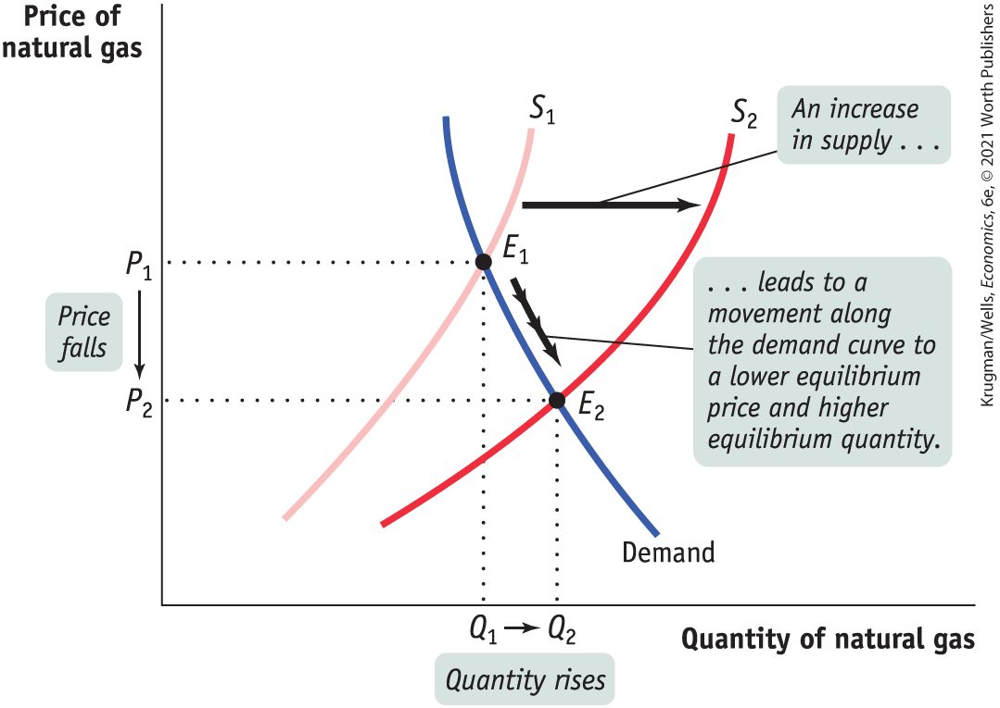
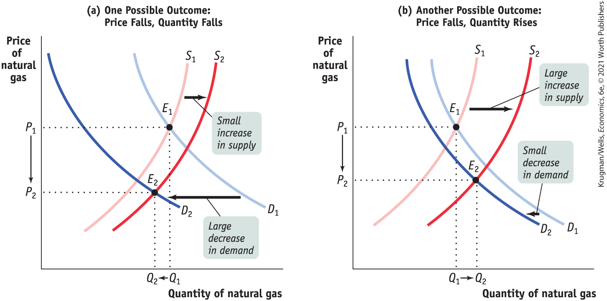
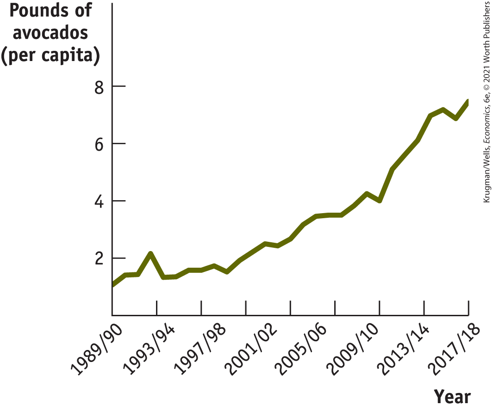

### What Happens When the Supply Curve Shifts

For most goods and services, it is a bit easier to predict changes in supply than changes in demand. Physical factors that affect supply, like weather or the availability of inputs, are easier to get a handle on than the fickle tastes that affect demand. Still, with supply as with demand, what we can best predict are the *effects* of shifts of the supply curve.

As we mentioned in the opening story, improved drilling technology significantly increased the supply of natural gas from 2006 onward. <a href="#kru_9781319245269_ch03_06.xhtml#pau_9781319320164_J5gDzQ4rHF" id="kru_9781319245269_ch03_06.xhtml#pau_9781319320164_IBgGjpvBbH" class="crossref">Figure 3-15</a> shows how this shift affected the market equilibrium. The original equilibrium is at *E*1, the point of intersection of the original supply curve, *S*1, with an equilibrium price *P*1 and equilibrium quantity *Q*1. As a result of the improved technology, supply increases and *S*1 shifts *rightward* to *S*2. At the original price *P*1, a surplus of natural gas now exists and the market is no longer in equilibrium. The surplus causes a fall in price and an increase in the quantity demanded, a *downward movement along the demand curve.* The new equilibrium is at *E*2, with an equilibrium price *P*2 and an equilibrium quantity *Q*2. In the new equilibrium *E*2, the price is lower and the equilibrium quantity is higher than before. This can be stated as a general principle: *When supply of a good or service increases, the equilibrium price of the good or service falls and the equilibrium quantity of the good or service rises.*

<figure id="pau_9781319320164_J5gDzQ4rHF" class="figure lm_img_lightbox num c3 main-flow">

<figcaption>
FIGURE 3-15 Equilibrium and Shifts of the Supply Curve

The original equilibrium in the market is at <em>E</em>1. Improved technology causes an increase in the supply of natural gas and shifts the supply curve rightward from <em>S</em>1 to <em>S</em>2. A new equilibrium is established at <em>E</em>2, with a lower equilibrium price, <em>P</em>2, and a higher equilibrium quantity, <em>Q</em>2.
</figcaption>
</figure>

<aside class="hidden" id="pau_9781319320164_C9XTGaaBGZ" title="hidden">

The demand curve intersects the supply curve S 1 at equilibrium point E 1. A second supply curve, S 2, is to the left of S 1, and the demand curve intersects S 2 at equilibrium point E 2. The difference between E 1 and E 2 represents an increase in price as well as a decrease in quantity. The leftward shift of demand curve S 2 is labeled ‘A decrease in supply ellipsis,’ and the upward movement of the equilibrium point along the supply curve is labeled ‘ellipsis leads to a movement along the demand curve to a lower equilibrium price and higher equilibrium quantity.’

</aside>

What happens to the market when supply falls? A fall in supply leads to a *leftward* shift of the supply curve. At the original price a shortage now exists. As a result, the equilibrium price rises and the quantity demanded falls. This describes what happened to the market for natural gas after Hurricane Katrina damaged natural gas production in the Gulf of Mexico in 2005. We can formulate a general principle: *When supply of a good or service decreases, the equilibrium price of the good or service rises and the equilibrium quantity of the good or service falls.*

To summarize how a market responds to a change in supply: *An increase in supply leads to a fall in the equilibrium price and a rise in the equilibrium quantity. A decrease in supply leads to a rise in the equilibrium price and a fall in the equilibrium quantity.*

<aside class="case-study c3 main-flow v5" epub:type="case-study" id="pau_9781319320164_0aPvhFv60k" title="Pitfalls">

#### *Pitfalls*

WHICH CURVE IS IT?

When the price of a good or service changes, in general, we can say that this reflects a change in either supply or demand. But which one is it? A helpful clue is the direction of change in the quantity. If the quantity sold changes in the *same* direction as the price — for example, if both the price and the quantity rise — it is likely that the demand curve has shifted. If the price and the quantity move in *opposite* directions, the likely cause is a shift of the supply curve.

</aside>

### Simultaneous Shifts of Supply and Demand Curves

Finally, it sometimes happens that events shift *both* the demand and supply curves at the same time. This is not unusual; in real life, supply curves and demand curves for many goods and services shift quite often because the economic environment continually changes.

<a href="#kru_9781319245269_ch03_06.xhtml#pau_9781319320164_RdTqYeRniF" id="kru_9781319245269_ch03_06.xhtml#pau_9781319320164_uGalpS3zRO" class="crossref">Figure 3-16</a> illustrates two examples of simultaneous shifts. In both panels there is an increase in supply — that is, a rightward shift of the supply curve from *S*1 to *S*2 — representing, for example, adoption of an improved drilling technology. Notice that the rightward shift in panel (a) is smaller than the one in panel (b): we can suppose that panel (a) represents a small, incremental change in technology while panel (b) represents a big advance in technology.

<figure id="pau_9781319320164_RdTqYeRniF" class="figure lm_img_lightbox num c4 main-flow">

<figcaption>
FIGURE 3-16 Simultaneous Shifts of the Demand and Supply Curves

In panel (a) there is a simultaneous leftward shift of the demand curve and a rightward shift of the supply curve. Here the decrease in demand is relatively larger than the increase in supply, so the equilibrium quantity falls as the equilibrium price also falls. In panel (b) there is also a simultaneous leftward shift of the demand curve and rightward shift of the supply curve. Here the increase in supply is large relative to the decrease in demand, so the equilibrium quantity rises as the equilibrium price falls.
</figcaption>
</figure>

<aside class="hidden" id="pau_9781319320164_pKPEwEHJJW" title="hidden">

Both graphs illustrate an increase in demand along with a decrease in supply, with the result that the equilibrium point E 2 has a higher price than E 1. In graph a, titled ‘One Possible Outcome: Price Rises, Quantity Falls,’ point E 2 is to the left of E 1. In graph b, titled ‘One Possible Outcome: Price Rises, Quantity Rises,’ E 2 is to the right of E 1. Graph a shows small increase in supply and large decrease in demand, while graph b shows large increase in supply and small decrease in demand.

</aside>

Both panels show a decrease in demand — that is, a leftward shift from *D*1 to *D*2. Also notice that the leftward shift in panel (a) is relatively larger than the one in panel (b): we can suppose that panel (a) reflects the effect on demand of a deep recession in the overall economy, while panel (b) reflects the effect of a mild winter.

In both cases the equilibrium price falls from *P*1 to *P*2 as the equilibrium moves from *E*1 to *E*2. But what happens to the equilibrium quantity, the quantity of natural gas bought and sold? In panel (a) the decrease in demand is large relative to the increase in supply, and the equilibrium quantity falls as a result. In panel (b) the increase in supply is large relative to the decrease in demand, and the equilibrium quantity rises as a result. That is, when demand decreases and supply increases, the actual quantity bought and sold can go either way depending on *how much* the demand and supply curves have shifted.

In general, when supply and demand shift in opposite directions, we can’t predict what the ultimate effect will be on the quantity bought and sold. What we can say is that a curve that shifts a disproportionately greater distance than the other curve will have a disproportionately greater effect on the quantity bought and sold. That said, we can make the following prediction about the outcome when the supply and demand curves shift in opposite directions:

- When demand decreases and supply increases, the equilibrium price falls but the change in the equilibrium quantity is ambiguous.
- When demand increases and supply decreases, the equilibrium price rises but the change in the equilibrium quantity is ambiguous.

But suppose that the demand and supply curves shift in the same direction. This is what has happened in the United States, as the economy made a gradual recovery from the recession in 2008, resulting in an increase in both demand and supply. Can we safely make any predictions about the changes in price and quantity? In this situation, the change in quantity bought and sold can be predicted, but the change in price is ambiguous. The two possible outcomes when the supply and demand curves shift in the same direction are as follows:

- When both demand and supply increase, the equilibrium quantity rises but the change in equilibrium price is ambiguous.
- When both demand and supply decrease, the equilibrium quantity falls but the change in equilibrium price is ambiguous.

### ECONOMICS \>\> *in Action*

Holy Guacamole!

Liz Garrison was shocked when the price of the bag of avocados that she frequently buys at Trader Joe’s skyrocketed from \$2.50 to \$6.50. “I eat an avocado a day. That’s a lot to spend on something I’m eating so frequently,” Garrison said. Commenting on the wholesale price of avocados, David Magaña, an industry observer, said “This is the highest price in at least a decade, probably more.” Yet, however shocking the price rise, it was just the result of the avocado market responding to the forces of supply and demand.

First, you can thank Americans’ fast-growing appetite (demand) for all things avocado: guacamole, avocado toast, and avocado smoothies. In 2018 the average American ate nearly 7.5 pounds of the fruit per year, compared to 1.1 pounds per year in 1989. In addition, demand for avocados is growing in other places such as Europe and China. Both of these events shifted the demand curve rightward.

Second, there’s supply. In 2019 the California avocado harvest was the smallest in a decade following a severe heatwave, coming in nearly 50% lower than in 2018. In addition, two other major avocado growing areas — Peru and South Africa — experienced year-on-year declines in output. These events shifted the supply curve leftward.

Inevitably, an increase in demand coupled with a sharp fall in supply leads to sharply rising prices for avocados. It’s economic logic, after all. Until demand falls, or supply rises, or both, the price of satisfying America’s avocado cravings will remain high, as shown in <a href="#kru_9781319245269_ch03_06.xhtml#pau_9781319320164_vP0hMUbXpJ" id="kru_9781319245269_ch03_06.xhtml#pau_9781319320164_iuFcqJ3Nk7" class="crossref">Figure 3-17</a>.

<figure id="pau_9781319320164_vP0hMUbXpJ" class="figure lm_img_lightbox num c3 main-flow">

<figcaption>
FIGURE 3-17 The Soaring Price of Avocados

<em>Data from:</em> USDA, Economic Research Service.
</figcaption>
</figure>

<aside class="hidden" id="pau_9781319320164_2AvlSWb5sn" title="hidden">

The graph plots price of avocados per capita ranging from 1 to 8 along the vertical axis and the years from 1989- 90 to 2017- 18 along the horizontal axis. The price of avocados increased slowly from 1 dollar in 1989- 90 to 3 dollars in 2001- 02. It then increased rapidly to 7 dollars by 2017- 18.

</aside>

However, there’s a bright spot on the horizon for avocado lovers. Heavy winter rainfall in California early in 2019 gave growers (and their crops) a boost, according to market analysts. So keep your tortilla chips on hand and ready for dipping.

### *\>\> Quick Review*

- Changes in the equilibrium price and quantity in a market result from shifts of the supply curve, the demand curve, or both.
- An increase in demand increases both the equilibrium price and the equilibrium quantity. A decrease in demand decreases both the equilibrium price and the equilibrium quantity.
- An increase in supply drives the equilibrium price down but increases the equilibrium quantity. A decrease in supply raises the equilibrium price but reduces the equilibrium quantity.
- Often fluctuations in markets involve shifts of both the supply and demand curves. When they shift in the same direction, the change in equilibrium quantity is predictable but the change in equilibrium price is not. When they shift in opposite directions, the change in equilibrium price is predictable but the change in equilibrium quantity is not. When there are simultaneous shifts of the demand and supply curves, the curve that shifts the greater distance has a greater effect on the change in equilibrium price and quantity.

### *\>\> Check Your Understanding* 3-4

1.  For each of the following, determine (i) the market in question; (ii) whether a shift in demand or supply occurred, the direction of the shift, and what induced the shift; and (iii) the effect of the shift on the equilibrium price and the equilibrium quantity.
    1.  As U.S. gasoline prices fall, more people buy large cars.
    2.  As technological innovation has lowered the cost of recycling used paper, fresh paper made from recycled stock is used more frequently.
    3.  When a local cable company offers cheaper on-demand films, local movie theaters have more unfilled seats.
2.  When a new, faster computer chip is introduced, demand for computers using the older, slower chips decreases. Simultaneously, computer makers increase their production of computers containing the old chips in order to clear out their stocks of old chips.
    1.  Draw two diagrams of the market for computers containing the old chips: one in which the equilibrium quantity falls in response to these events and one in which the equilibrium quantity rises.
    2.  What happens to the equilibrium price in each diagram?

## Competitive Markets — and Others

Earlier in this chapter we defined a competitive market and explained that the supply and demand framework is a model of competitive markets. But why does it matter whether or not a market is competitive? Now that we’ve seen how the supply and demand model works, we can offer some explanation.

To understand why competitive markets are different from other markets, compare the problems facing two individuals: a wheat farmer who must decide whether to grow more wheat and the president of a giant aluminum company — say, Alcoa — who must decide whether to produce more aluminum.

For the wheat farmer, the question is simply whether the extra wheat can be sold at a price high enough to justify the extra production cost. The farmer need not worry about whether producing more wheat will affect the price of the wheat he or she was already planning to grow. That’s because the wheat market is competitive. There are thousands of wheat farmers, and one farmer’s decision will not impact the market price.

But for the Alcoa executive, the aluminum market is *not* competitive. There are only a few big producers, including Alcoa, and each of them is well aware that its actions *do* have a noticeable impact on the market price. This adds a whole new level of complexity to the decisions producers have to make. Alcoa can’t decide whether or not to produce more aluminum just by asking whether the additional product will sell for more than it costs to make. The company also has to ask whether producing more aluminum will drive down the market price and reduce its *profit,* its net gain from producing and selling its output.

When a market is competitive, individuals can base decisions on less complicated analyses than those used in a noncompetitive market. This in turn means that it’s easier for economists to build a model of a competitive market than of a noncompetitive market.

This doesn’t mean that economic analysis has nothing to say about noncompetitive markets. On the contrary, economists can offer some very important insights into how other kinds of markets work. But those insights require other models.

## Business Case 

Uber Gives Riders a Lesson in Supply and Demand

<figure id="pau_9781319320164_MIWG1WEK5v" class="figure lm_img_lightbox unnum c2 right">

</figure>

Two young entrepreneurs, Garrett Camp and Travis Kalanick, created Uber in 2009 to alleviate a common frustration: how to find a taxi when you need to get somewhere and there aren’t any taxis available. In densely populated cities like New York City, finding a taxi is relatively easy on most days — stand on a corner, stick out your arm, and before long a taxi will stop to pick you up. And you know exactly what taxi fare rates will be before you step into the car, because they are set by city regulators.

But at other times, it can be difficult to find a taxi, and you can wait a very long time for one — for example, on rainy days or during rush hour. As you wait, you will probably notice empty taxis passing you by — drivers who have quit working for the day and are headed home. Moreover, there are times when it is simply impossible to hail a taxi — such as during a snowstorm or on New Year’s Eve.

Uber was created to address this problem. Using an app, Uber connects people who want a ride to drivers with cars. It also registers drivers, sets fares, and automatically collects payment from a registered rider’s credit card. Uber then keeps 25% of the fare, with the rest going to the driver. As of 2019, Uber was operating in 65 countries and in more than 600 cities, and booked \$11.3 billion in rides.

Studies have shown that Uber fares are either roughly equal to or less than regular taxi fares during normal driving hours. The qualification *during normal driving hours* is important because at other times Uber’s rates fluctuate. When there are more people looking for a ride than cars available, Uber uses what it calls *surge pricing:* setting the rate higher until everyone who wants a car at the going price can get one. For example, during a snowstorm or on New Year’s Eve, Uber rides cost around 9 to 10 times the standard price. Enraged, some Uber customers have accused it of price gouging.

But according to their founders, Uber’s surge pricing is simply a method of keeping customers happy because the surge price is calculated to leave as few people as possible without a ride. As Kalanick explains, “We do not own cars nor do we employ drivers. Higher prices are required to get cars on the road and keep them on the road during the busiest times.” However, with more drivers joining Uber’s fleet, drivers are finding that it takes longer hours to make sufficient income. So in cities like San Diego where passengers have limited access to taxi services, Uber drivers have banded together to take “synchronized breaks” during peak hours, such as Saturday nights. These breaks cause prices to surge, which prompts the drivers to jump into their cars. Clearly these Uber drivers know how supply and demand works.

<aside class="assessments c3 main-flow v1" epub:type="assessments" id="pau_9781319320164_Kf8LITKImJ">

### Questions for thought

1.  What accounts for the fact that before Uber’s arrival, there were typically enough taxis available for everyone who wanted one on good weather days, but not enough available on bad weather days?
2.  How does Uber’s surge pricing solve the problem? Assess Kalanick’s claim that the price is set to leave as few people possible without a ride.
3.  Use a supply and demand diagram to illustrate how Uber drivers can cause prices to surge by taking coordinated breaks. Why is this strategy unlikely to work in New York, a large city with an established fleet of taxis?

</aside>

### Summary

1.  The **supply and demand model** illustrates how a **competitive market**, one with many buyers and sellers, none of whom can influence the market price, works.
2.  The **demand schedule** shows the **quantity demanded** at each price and is represented graphically by a **demand curve.** The **law of demand** says that demand curves slope downward; that is, a higher price for a good or service leads people to demand a smaller quantity, other things equal.
3.  A **movement along the demand curve** occurs when a price change leads to a change in the quantity demanded. When economists talk of increasing or decreasing demand, they mean **shifts of the demand curve** — a change in the quantity demanded at any given price. An increase in demand causes a rightward shift of the demand curve. A decrease in demand causes a leftward shift.
4.  There are five main factors that shift the demand curve:
    - A change in the prices of related goods or services, such as **substitutes** or **complements**
    - A change in income: when income rises, the demand for **normal goods** increases and the demand for **inferior goods** decreases
    - A change in tastes
    - A change in expectations
    - A change in the number of consumers
5.  The market demand curve for a good or service is the horizontal sum of the **individual demand curves** of all consumers in the market.
6.  The **supply schedule** shows the **quantity supplied** at each price and is represented graphically by a **supply curve.** Supply curves usually slope upward.
7.  A **movement along the supply curve** occurs when a price change leads to a change in the quantity supplied. When economists talk of increasing or decreasing supply, they mean **shifts of the supply curve** — a change in the quantity supplied at any given price. An increase in supply causes a rightward shift of the supply curve. A decrease in supply causes a leftward shift.
8.  There are five main factors that shift the supply curve:
    - A change in **input** prices
    - A change in the prices of related goods and services
    - A change in technology
    - A change in expectations
    - A change in the number of producers
9.  The market supply curve for a good or service is the horizontal sum of the **individual supply curves** of all producers in the market.
10. The supply and demand model is based on the principle that the price in a market moves to its **equilibrium price**, or **market-clearing price**, the price at which the quantity demanded is equal to the quantity supplied. This quantity is the **equilibrium quantity.** When the price is above its market-clearing level, there is a **surplus** that pushes the price down. When the price is below its market-clearing level, there is a **shortage** that pushes the price up.
11. An increase in demand increases both the equilibrium price and the equilibrium quantity; a decrease in demand has the opposite effect. An increase in supply reduces the equilibrium price and increases the equilibrium quantity; a decrease in supply has the opposite effect.
12. Shifts of the demand curve and the supply curve can happen simultaneously. When they shift in opposite directions, the change in equilibrium price is predictable but the change in equilibrium quantity is not. When they shift in the same direction, the change in equilibrium quantity is predictable but the change in equilibrium price is not. In general, the curve that shifts the greater distance has a greater effect on the changes in equilibrium price and quantity.

### Key Terms

- <a href="#kru_9781319245269_ch03_02.xhtml#pau_9781319320164_iSWOHQ0y8h" id="kru_9781319245269_ch03_09.xhtml#pau_9781319320164_UtWuHN6wQn" class="crossref">Competitive market</a>
- <a href="#kru_9781319245269_ch03_02.xhtml#pau_9781319320164_fBWL3PfjiN" id="kru_9781319245269_ch03_09.xhtml#pau_9781319320164_wRDM3GiHRv" class="crossref">Supply and demand model</a>
- <a href="#kru_9781319245269_ch03_03.xhtml#pau_9781319320164_kkn71ftvWi" id="kru_9781319245269_ch03_09.xhtml#pau_9781319320164_Gw4eSV0dG4" class="crossref">Demand schedule</a>
- <a href="#kru_9781319245269_ch03_03.xhtml#pau_9781319320164_bLKPYg3Yw0" id="kru_9781319245269_ch03_09.xhtml#pau_9781319320164_4ZeUBkn8kn" class="crossref">Quantity demanded</a>
- <a href="#kru_9781319245269_ch03_03.xhtml#pau_9781319320164_1GwxUAW6Ax" id="kru_9781319245269_ch03_09.xhtml#pau_9781319320164_gFBmihnkKZ" class="crossref">Demand curve</a>
- <a href="#kru_9781319245269_ch03_03.xhtml#pau_9781319320164_x8SAhlu0tM" id="kru_9781319245269_ch03_09.xhtml#pau_9781319320164_8rsTMrWk83" class="crossref">Law of demand</a>
- <a href="#kru_9781319245269_ch03_03.xhtml#pau_9781319320164_TYnOd4QI3K" id="kru_9781319245269_ch03_09.xhtml#pau_9781319320164_wDYU1G3z0x" class="crossref">Shift of the demand curve</a>
- <a href="#kru_9781319245269_ch03_03.xhtml#pau_9781319320164_4x7yO3lHDh" id="kru_9781319245269_ch03_09.xhtml#pau_9781319320164_VDLhIuuaWt" class="crossref">Movement along the demand curve</a>
- <a href="#kru_9781319245269_ch03_03.xhtml#pau_9781319320164_2Bu1lQDGl8" id="kru_9781319245269_ch03_09.xhtml#pau_9781319320164_XXUbleewi6" class="crossref">Substitutes</a>
- <a href="#kru_9781319245269_ch03_03.xhtml#pau_9781319320164_SFmvBESu7H" id="kru_9781319245269_ch03_09.xhtml#pau_9781319320164_Mtc6dQF3iF" class="crossref">Complements</a>
- <a href="#kru_9781319245269_ch03_03.xhtml#pau_9781319320164_jz8Vs6MjLg" id="kru_9781319245269_ch03_09.xhtml#pau_9781319320164_PysqhdKlUk" class="crossref">Normal good</a>
- <a href="#kru_9781319245269_ch03_03.xhtml#pau_9781319320164_CnKzTcFOFS" id="kru_9781319245269_ch03_09.xhtml#pau_9781319320164_9LOcK7pmSA" class="crossref">Inferior good</a>
- <a href="#kru_9781319245269_ch03_03.xhtml#pau_9781319320164_EAaKiPKaoU" id="kru_9781319245269_ch03_09.xhtml#pau_9781319320164_GTIy18T6by" class="crossref">Individual demand curve</a>
- <a href="#kru_9781319245269_ch03_04.xhtml#pau_9781319320164_bINLvc0yL8" id="kru_9781319245269_ch03_09.xhtml#pau_9781319320164_oX2TaXBeBf" class="crossref">Quantity supplied</a>
- <a href="#kru_9781319245269_ch03_04.xhtml#pau_9781319320164_6TJeKTbqt6" id="kru_9781319245269_ch03_09.xhtml#pau_9781319320164_NSLTmOcTmO" class="crossref">Supply schedule</a>
- <a href="#kru_9781319245269_ch03_04.xhtml#pau_9781319320164_05jR3lCe07" id="kru_9781319245269_ch03_09.xhtml#pau_9781319320164_7f4v5PvfCf" class="crossref">Supply curve</a>
- <a href="#kru_9781319245269_ch03_04.xhtml#pau_9781319320164_CiKVsdy0af" id="kru_9781319245269_ch03_09.xhtml#pau_9781319320164_khrnMisWmg" class="crossref">Shift of the supply curve</a>
- <a href="#kru_9781319245269_ch03_04.xhtml#pau_9781319320164_YX50s0iiup" id="kru_9781319245269_ch03_09.xhtml#pau_9781319320164_SxRHNyhBgf" class="crossref">Movement along the supply curve</a>
- <a href="#kru_9781319245269_ch03_04.xhtml#pau_9781319320164_f1vG6UQUDx" id="kru_9781319245269_ch03_09.xhtml#pau_9781319320164_W9sVRmcwzX" class="crossref">Input</a>
- <a href="#kru_9781319245269_ch03_04.xhtml#pau_9781319320164_Sw9NWy5etI" id="kru_9781319245269_ch03_09.xhtml#pau_9781319320164_BqfHKfwroO" class="crossref">Individual supply curve</a>
- <a href="#kru_9781319245269_ch03_05.xhtml#pau_9781319320164_IdNAt7HfsO" id="kru_9781319245269_ch03_09.xhtml#pau_9781319320164_WlBSw8YRx5" class="crossref">Equilibrium price</a>
- <a href="#kru_9781319245269_ch03_05.xhtml#pau_9781319320164_IdNAt7HfsO" id="kru_9781319245269_ch03_09.xhtml#pau_9781319320164_pkHkccZToU" class="crossref">Equilibrium quantity</a>
- <a href="#kru_9781319245269_ch03_05.xhtml#pau_9781319320164_LWxBVSvErv" id="kru_9781319245269_ch03_09.xhtml#pau_9781319320164_QeuSphyCPf" class="crossref">Market-clearing price</a>
- <a href="#kru_9781319245269_ch03_05.xhtml#pau_9781319320164_YZnuM35yaM" id="kru_9781319245269_ch03_09.xhtml#pau_9781319320164_IE3cnvIAd6" class="crossref">Surplus</a>
- <a href="#kru_9781319245269_ch03_05.xhtml#pau_9781319320164_f8pVLi57hB" id="kru_9781319245269_ch03_09.xhtml#pau_9781319320164_eXDI3Zjh4P" class="crossref">Shortage</a>

### Practice questions

1.  In the market for automobiles explain how demand responds to (i) an increase in the price of automobiles today and (ii) an expected increase in the future price of automobiles.
2.  Explain why the following statement is misleading: “Apple increases supply of watches following an unexpected increase in demand.”
3.  In each of the following, what is the mistake that underlies the statement? Explain the mistake in terms of supply and demand and the factors that influence them.
    1.  Consumers are illogical because they are buying more Starbucks beverages in 2019 despite the fact that Starbucks has raised prices 10 to 30 cents per drink.
    2.  Consumers are illogical because they buy less at Cost-U-Less Warehouse Superstore when their incomes go up.
    3.  Consumers are illogical for buying an iPhone 11 when an iPhone X costs less.
4.  Two students are debating the effects of an expected decline in future home prices. One student claims that a decline in home prices will increase the total quantity of homes while the other student claims that the quantity of homes will decline. Which student is correct? Explain. Be sure to discuss how expected price changes shift demand and/or supply.
