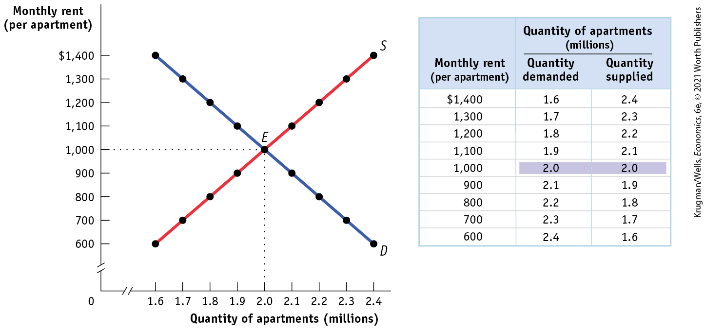
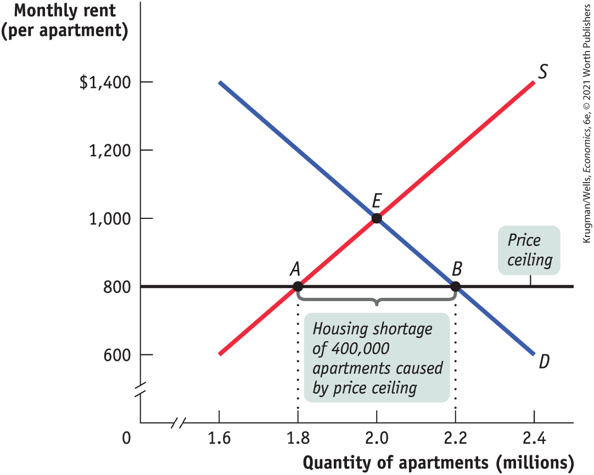
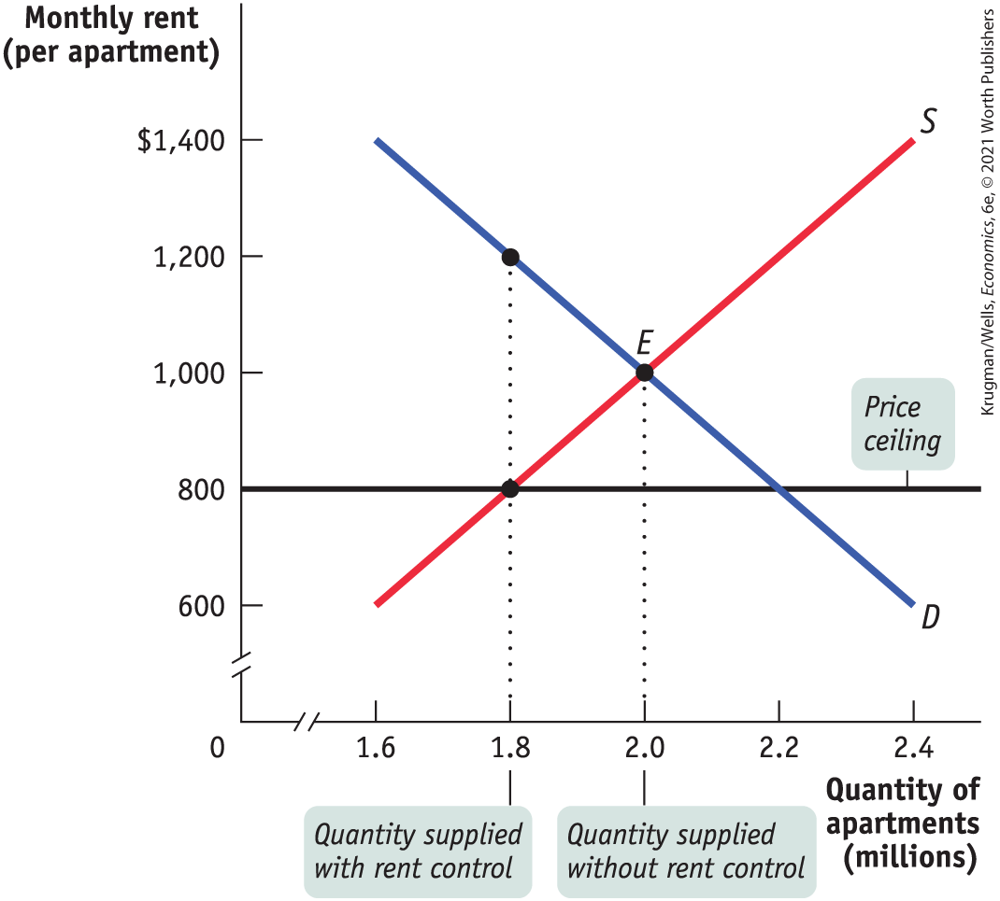
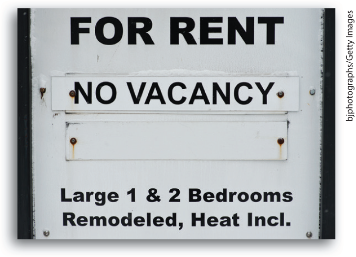
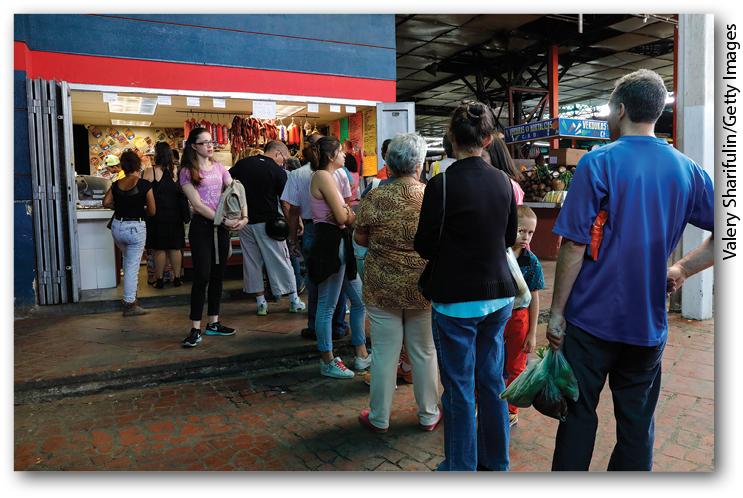

# Chapter 4 Price Controls and Quotas: Meddling with Markets

## A Bronx Tale

**STEPHANIE KIRNON WAS WORRIED.** How would she, a landlord, afford the \$29,000 needed to repair the leaky roof of the 26-unit apartment building she owns in the Bronx, a borough of New York City? In contrast, Gloribel Castillo, a tenant in a nearby apartment building, was relieved, knowing that she would no longer have to worry about affording her monthly rent.

<figure id="pau_9781319320164_1OuOxigrHH" class="figure lm_img_lightbox unnum c2 right">

<figcaption>
<strong>While tenant Gloribel Castillo (left) cheered the tightening of New York rent-control laws, landlord Stephanie Kirnon (right) worried she would now be unable to afford necessary building repairs.</strong>
</figcaption>
</figure>

The source of this contrast was a tightening of rent-control regulations. These laws prevent landlords from raising rents or evicting tenants in rent-controlled apartments without permission from a city agency. In 2019, New York State made it much more difficult for landlords to obtain that permission. The revised regulations also prohibit landlords from switching apartments from rent-controlled to unregulated status. Once apartments are unregulated, landlords can charge much higher market rents.

Tenant groups, who had lobbied hard for these regulatory changes, cheered. Many of their members were working class, like Gloribel Castillo, a hotel cleaner who worked two shifts in order to pay the rent on her rent-controlled apartment. For decades, the Bronx has been home to working-class and lower-income New Yorkers. But by 2019, the Bronx was undergoing a *gentrification* process — less desirable locations became more desirable as people with higher incomes moved in, and lower income residents were forced out. As a result, rents were beginning to increase. Until the tighter restrictions were adopted, tenants in rent-controlled apartments faced the very real possibility that landlords would find a loophole in the law to raise their rents or evict them.

Another group also benefited from the new tighter regulations: owners of unregulated apartments. Now that it was illegal to shift rent-controlled apartments to unregulated status, there would be fewer unregulated apartments available. As a result, the rents for unregulated apartments would rise. But landlords of rent-controlled buildings, like Stephanie Kirnon, were facing a real bind. The tightened regulations made it harder to afford the necessary renovations and maintenance. Stephanie also knew that less rental income made it harder for her to afford her mortgage payments.

What will the future hold for Bronx residents? In the 1970s, when rent-control laws had been applied very strictly, many buildings were abandoned as landlords were unable to charge rents high enough to cover their costs. The Bronx declined dramatically during these years: there was a shortage of inhabitable apartments and crime soared as empty buildings were used for nefarious purposes. Only time will tell whether the Bronx will become a tenant’s paradise or revert to being a tenant’s nightmare.

Rent control is a type of *market intervention,* a policy imposed by government to prevail over the market forces of supply and demand — in this case, over the market forces of the supply and demand for rental apartments in the Bronx. Although rent-control laws were introduced during World War II in many major American cities to protect the interests of tenants, the problems they created led most cities to discard them. New York City and San Francisco are notable exceptions, although rent control covers only a small and diminishing proportion of rental apartments in both cities.

As we will learn in this chapter, when a government tries to dictate either a market price or a market quantity that’s different from the equilibrium price or quantity, the market will strike back in predictable ways. A shortage of apartments is one example of what happens when the logic of the market is defied: a market intervention like rent control keeps the price of apartment rentals below market equilibrium level, creating the shortage and other serious problems. And, as we’ll see, those problems inevitably create winners and losers.

Although there are specific winners and losers from market intervention, we will learn how and why society as a whole loses — a result that has led economists to be generally skeptical of market interventions except in certain well-defined situations. 

<aside class="learning-objectives c3 main-flow v3" epub:type="learning-objectives" id="pau_9781319320164_Zc4i0Q2T8G">

### What you will learn

- What is a market intervention and why are **price controls** and **quantity controls** the two main forms it takes?
- Who benefits and who loses from market interventions?
- Why are economists often skeptical of market interventions? And why do governments undertake market interventions even though they create losses to society?

</aside>

## Why Governments Control Prices

As we know from <a href="#kru_9781319245269_ch03_01.xhtml#pau_9781319320164_ECGi4IZqUE" id="kru_9781319245269_ch04_02.xhtml#pau_9781319320164_xQGbJ63NGb" class="crossref">Chapter 3</a>, a market moves to equilibrium — the market price moves to the level at which the quantity supplied equals the quantity demanded. But this equilibrium price does not necessarily please either buyers or sellers.

After all, buyers would always like to pay less if they could. Sometimes they can make a strong moral or political case for this, such as when the equilibrium rental rates are not affordable for an average working person. In that case, a government might well be under pressure to impose limits on the rents landlords can charge.

Similarly, sellers would always like to get higher prices. Sometimes they can make a strong moral or political case for this, such as when the equilibrium wage rate for a worker who sells their labor in the labor market results in an income below the poverty level. In that case, a government might well be pressured to require employers to pay a rate no lower than some specified minimum wage.

So there are often strong political demands for governments to intervene in markets with powerful interests often making a compelling case that a market intervention in their favor is “fair.” When a government intervenes to regulate prices, we say that it imposes <a href="#kru_9781319245269_EM_glossary.xhtml#pau_9781319320164_4Sce3puryK" id="kru_9781319245269_ch04_02.xhtml#pau_9781319320164_1l0GMdHZui" class="glossref" role="doc-glossref">price controls</a>. These controls typically take the form either of an upper limit, a <a href="#kru_9781319245269_EM_glossary.xhtml#pau_9781319320164_c0ekFiaZ7A" id="kru_9781319245269_ch04_02.xhtml#pau_9781319320164_OmLG4Jirjl" class="glossref" role="doc-glossref">price ceiling</a>, or a lower limit, a <a href="#kru_9781319245269_EM_glossary.xhtml#pau_9781319320164_u8escpi5gM" id="kru_9781319245269_ch04_02.xhtml#pau_9781319320164_QrcTepo4XV" class="glossref" role="doc-glossref">price floor</a>.

<aside aria-label="title 1" class="glossary c3 main-flow v1" epub:type="glossary" id="pau_9781319320164_roGYzfaTcC">

**price controls**, **price ceiling**, **price floor**  
**Price controls** are legal restrictions on how high or low a market price may go. They can take two forms: a **price ceiling**, a maximum price sellers are allowed to charge for a good or service, or a **price floor**, a minimum price buyers are required to pay for a good or service.

</aside>

However, it’s not that easy to tell a market what to do. When a government tries to legislate prices — whether it legislates them down by imposing a price ceiling or up by imposing a price floor — there are certain predictable and unpleasant side effects.

Yet, there are two important caveats to consider. First, we assume in this chapter that the markets in question are efficient before price controls are imposed. But markets can sometimes be inefficient — for example, a market dominated by a monopolist, a single seller that has the power to influence the market price. When markets are inefficient, price controls don’t necessarily cause problems and can potentially move markets closer to efficiency. Second, short-term price controls in response to shortages caused by natural disasters can be justified on the basis of equity and social welfare. For example, during the coronavirus pandemic of 2020, a shortage of ventilators necessary to keep people alive would have led to skyrocketing prices in a free market, thereby making them only available to the well-off. So the government on state and federal levels acted to allocate ventilators according to need, making for a far more equitable allocation of life and death.

## Price Ceilings

Aside from rent control, there are not many price ceilings in the United States today. But at times they have been widespread. Price ceilings are typically imposed during crises — wars, harvest failures, natural disasters — because these events often lead to sudden price increases that hurt many people but produce big gains for a lucky few.

The U.S. government imposed ceilings on many prices during World War II: the war sharply increased demand for raw materials, such as aluminum and steel, and price controls prevented those with access to these raw materials from earning huge profits. Price controls on oil were imposed in 1973, when an embargo by Arab oil-exporting countries seemed likely to generate huge profits for U.S. oil companies. Price controls were instituted again in 2012 by New York and New Jersey authorities in the aftermath of Hurricane Sandy, as gas shortages led to rampant price-gouging.

Rent control in New York is, as we mention in the opening story, a legacy of World War II: it was imposed because wartime production led to an economic boom that increased demand for apartments at a time when the labor and raw materials that might have been used to build them were being used to win the war instead. Although most price controls were removed soon after the war ended, New York’s rent limits were retained and gradually extended to buildings not previously covered, leading to some very strange situations.

You can rent a one-bedroom apartment in Manhattan on fairly short notice — if you are able and willing to pay several thousand dollars a month and live in a less desirable area. Yet some people pay only a small fraction of this for comparable apartments, and others pay hardly more for bigger apartments in the most desirable locations.

Aside from producing great deals for some renters, however, what are the broader consequences of New York’s rent-control system? To answer this question, we turn to the model we developed in <a href="#kru_9781319245269_ch03_01.xhtml#pau_9781319320164_ECGi4IZqUE" id="kru_9781319245269_ch04_03.xhtml#pau_9781319320164_G0q7Zdmpxe" class="crossref">Chapter 3</a>: the supply and demand model.

### Modeling a Price Ceiling

To see what can go wrong when a government imposes a price ceiling on an efficient market, consider <a href="#kru_9781319245269_ch04_03.xhtml#pau_9781319320164_GYxB9rgjVF" id="kru_9781319245269_ch04_03.xhtml#pau_9781319320164_Mx8TbKi7la" class="crossref">Figure 4-1</a>, which shows a simplified model of the market for apartments in New York. For the sake of simplicity, we imagine that all apartments are exactly the same and would rent for the same price in an unregulated market.

<figure id="pau_9781319320164_GYxB9rgjVF" class="figure lm_img_lightbox num c4 center">

<figcaption>
FIGURE 4-1 The Market for Apartments in the Absence of Price Controls

Without government intervention, the market for apartments reaches equilibrium at point <em>E</em> with a market rent of $1,000 per month and 2 million apartments rented.
</figcaption>
</figure>

<aside class="hidden" id="pau_9781319320164_vgMlnwZpH0" title="hidden">

The graph plots Monthly rent per apartment versus Quantity of apartments in millions. The horizontal axis labeled quantity of apartments (millions) is truncated and ranges from 1.6 to 2.4 million dollars, in increments of 0.1 million dollars. The vertical axis labeled monthly rent per apartment is truncated and ranges from 600 to 1400 dollars, in increments of 100 dollars. The graph shows two lines labeled S (Supply) and D (Demand). The supply curve has a positive slope as it passes through the points (1.6, 600), (1.7, 700), (1.8, 800), (1.9, 900), (2.0, 1000), (2.1, 1100), (2.2, 1200), (2.3, 1300), and (2.4, 1400). The demand curve has a negative slope as it passes through the points (1.6, 1400), (1.7, 1300), (1.8, 1200), (1.9, 1100), (2.0, 1000), (2.1, 900), (2.2, 800), (2.3, 700), and (2.4, 600). Both the curves intersect at E (2.0, 1000). The table has 9 rows and 10 three columns. The column headers, from left to right, are as follows, Monthly rent (per apartment), Quantity of apartments demanded (millions), and Quantity of apartments supplied (millions). The data from the table are as follows, Row 1. Monthly rent, 1,400 dollars; Quantity demanded, 1.6 million; Quantity Supplied, 2.4 million. Row 2. Monthly rent, 1,300 dollars; Quantity demanded, 1.7 million; Quantity Supplied 2.3 million. Row 3. Monthly rent, 1,200 dollars; Quantity demanded, 1.8 million; Quantity Supplied, 2.2 million. Row 4. Monthly rent, 1,100 dollars; Quantity demanded, 1.9 million; Quantity Supplied, 2.1 million. Row 5. Monthly rent, 1,000 dollars; Quantity demanded, 2.0 million; Quantity Supplied, 2.0 million. In this row, the quantity demanded and supplied values, 2.0 million, are highlighted. Row 6. Monthly rent, 900 dollars; Quantity demanded, 2.1 million; Quantity Supplied, 1.9 million. Row 7. Monthly rent, 800 dollars; Quantity demanded, 2.2 million; Quantity Supplied, 1.8 million. Row 8. Monthly rent, 700 dollars; Quantity demanded, 2.3 million; Quantity Supplied, 1.7 million. Row 9. Monthly rent, 600 dollars; Quantity demanded, 2.4 million; Quantity Supplied, 1.6 million.

</aside>

The table in <a href="#kru_9781319245269_ch04_03.xhtml#pau_9781319320164_GYxB9rgjVF" id="kru_9781319245269_ch04_03.xhtml#pau_9781319320164_st9UJjjylk" class="crossref">Figure 4-1</a> shows the demand and supply schedules; the demand and supply curves are shown on the left. We show the quantity of apartments on the horizontal axis and the monthly rent per apartment on the vertical axis. You can see that in an unregulated market the equilibrium would be at point *E:* 2 million apartments would be rented for \$1,000 each per month.

Now suppose that the government imposes a price ceiling, limiting rents to a price below the equilibrium price — say, no more than \$800.

<a href="#kru_9781319245269_ch04_03.xhtml#pau_9781319320164_NfDQQMP5p6" id="kru_9781319245269_ch04_03.xhtml#pau_9781319320164_FEj1AagnQU" class="crossref">Figure 4-2</a> shows the effect of the price ceiling, represented by the line at \$800. At the enforced rental rate of \$800, landlords have less incentive to offer apartments, so they won’t be willing to supply as many as they would at the equilibrium rate of \$1,000. They will choose point *A* on the supply curve, offering only 1.8 million apartments for rent, 200,000 fewer than in the unregulated market.

<figure id="pau_9781319320164_NfDQQMP5p6" class="figure lm_img_lightbox num c3 main-flow">

<figcaption>
FIGURE 4-2 The Effects of a Price Ceiling

The black horizontal line represents the government-imposed price ceiling on rents of $800 per month. This price ceiling reduces the quantity of apartments supplied to 1.8 million, point <em>A,</em> and increases the quantity demanded to 2.2 million, point <em>B.</em> This creates a persistent shortage of 400,000 units: 400,000 people who want apartments at the legal rent of $800 but cannot get them.
</figcaption>
</figure>

<aside class="hidden" id="pau_9781319320164_ii8f8eRuqo" title="hidden">

The vertical axis is truncated and labeled monthly rent per apartment ranging of 600 to 1400 (in dollars), in increments of 200 dollars while the horizontal axis is truncated and labeled quantity of apartment (millions) ranging of 1.6 to 2.4, in increments of 0.2 million dollars. The curve labeled S is a positive sloping line that rises from (1.6, 600) to (2.4, 1400). The curve labeled D is a negative sloping line that falls from (1.6, 1400) to (2.4, 600). Both the curves intersect at E (2.0, 1000). A horizontal line labeled price ceiling is drawn from (0, 800) to the right, intersects the supply curve at A (1.8, 800), and intersects the demand curve at B (2.2, 800). The gap between points A and B along the horizontal line is labeled housing shortage of 400,000 apartments caused by price ceiling.

</aside>

At the same time, more people will want to rent apartments at a price of \$800 than at the equilibrium price of \$1,000; as shown at point *B* on the demand curve, at a monthly rent of \$800 the quantity of apartments demanded rises to 2.2 million, 200,000 more than in the unregulated market and 400,000 more than are actually available at the price of \$800. So there is now a persistent shortage of rental housing: at that price, 400,000 more people want to rent than are able to find apartments.

Do price ceilings always cause shortages? No. If a price ceiling is set above the equilibrium price, it won’t have any effect. Suppose that the equilibrium rental rate on apartments is \$1,000 per month and the city government sets a ceiling of \$1,200. Who cares? In this case, the price ceiling won’t be *binding* — it won’t actually constrain market behavior — and it will have no effect.

### How a Price Ceiling Causes Inefficiency

The housing shortage shown in <a href="#kru_9781319245269_ch04_03.xhtml#pau_9781319320164_NfDQQMP5p6" id="kru_9781319245269_ch04_03.xhtml#pau_9781319320164_C9fM6b56XG" class="crossref">Figure 4-2</a> is not merely annoying: like any shortage induced by price controls, it can be seriously harmful because it leads to inefficiency. In other words, there are gains from trade that go unrealized.

Rent control, like all price ceilings, creates inefficiency in at least four distinct ways.

1.  It reduces the quantity of apartments rented below the efficient level.
2.  It typically leads to inefficient allocation of apartments among would-be renters.
3.  It leads to wasted time and effort as people search for apartments.
4.  It leads landlords to maintain apartments in inefficiently low quality or condition.

In addition to inefficiency, price ceilings give rise to illegal behavior as people try to circumvent them. We’ll now look at each of these inefficiencies caused by price ceilings.

#### Inefficiently Low Quantity

Because a price ceiling reduces the price of a good, it reduces the quantity that sellers are willing to supply. In addition, buyers can’t buy more units of a good than sellers are willing to sell. So a price ceiling reduces the quantity of a good bought and sold below the market equilibrium quantity.

Because rent controls reduce the number of apartments supplied, they reduce the number of apartments rented, too. The low quantity sold is an inefficiency due to missed opportunities: price ceilings prevent mutually beneficial transactions from occurring, transactions that would benefit both buyers and sellers. <a href="#kru_9781319245269_ch04_03.xhtml#pau_9781319320164_oPQut0ABAD" id="kru_9781319245269_ch04_03.xhtml#pau_9781319320164_uAyxcwIcT7" class="crossref">Figure 4-3</a> shows the inefficiently low quantity of apartments supplied with rent control.

<figure id="pau_9781319320164_oPQut0ABAD" class="figure lm_img_lightbox num c3 main-flow">

<figcaption>
FIGURE 4-3 A Price Ceiling Causes Inefficiently Low Quantity

A price ceiling reduces the quantity supplied below the market equilibrium quantity. Because buyers can’t buy more units of a good than sellers are willing to sell, a price ceiling reduces the quantity of a good bought and sold.
</figcaption>
</figure>

<aside class="hidden" id="pau_9781319320164_fCfDaL7gH4" title="hidden">

The vertical axis is truncated and labeled monthly rent per apartment ranging of 600 to 1400 dollars in increments of 200 dollars while the horizontal axis is truncated and labeled quantity of apartment (millions) ranging of 1.6 to 2.4, in increments of 0.2 million dollars. The curve labeled S is a positive sloping line that rises from (1.6, 600) to (2.4, 1400). The curve labeled D is a negative sloping line that falls from (1.6, 1400) to (2.4, 600). Both the curves intersect at E (2.0, 1000). A horizontal line labeled price ceiling is drawn from (0, 800) to the right, intersects the supply curve at (1.8, 800), and intersects the demand curve at (2.2, 800). A point is marked at (1.8, 2000). A vertical dotted line from 1.8 labeled quantity supplied with rent control cuts supply curve at (1.8, 800) and cuts demand curve at (1.8, 1200).A vertical dotted line from 2.0 labeled quantity supplied without rent control meets the supply and demand curves at E (2.0, 1000).

</aside>

#### Inefficient Allocation to Consumers

Rent control doesn’t just lead to too few apartments being available. It can also lead to misallocation of the apartments that are available: people who badly need a place to live may not be able to find an apartment, but some apartments may be occupied by people with much less urgent needs.

In the case shown in <a href="#kru_9781319245269_ch04_03.xhtml#pau_9781319320164_NfDQQMP5p6" id="kru_9781319245269_ch04_03.xhtml#pau_9781319320164_bywH2qgA8S" class="crossref">Figure 4-2</a>, 2.2 million people would like to rent an apartment at \$800 per month, but only 1.8 million apartments are available. Of those 2.2 million who are seeking an apartment, some want one badly and are willing to pay a high price to get it. Others have a less urgent need and are only willing to pay a low price, perhaps because they have alternative housing.

An efficient allocation of apartments would reflect these differences: people who really want an apartment will get one and people who aren’t all that eager to find an apartment won’t. In an inefficient distribution of apartments, the opposite will happen: some people who are not especially interested in finding an apartment will get one and others who are very eager to find an apartment won’t.

Because people usually get apartments through luck or personal connections under rent control, it generally results in an <a href="#kru_9781319245269_EM_glossary.xhtml#pau_9781319320164_L3rGYYZuNL" id="kru_9781319245269_ch04_03.xhtml#pau_9781319320164_16E6s4dgHz" class="glossref" role="doc-glossref">inefficient allocation to consumers</a> of the few apartments available.

<aside aria-label="title 1" class="glossary c3 main-flow v1" epub:type="glossary" id="pau_9781319320164_aITusYxZTY">

**inefficient allocation to consumers**  
Price ceilings often lead to inefficiency in the form of **inefficient allocation to consumers:** some people who want the good badly and are willing to pay a high price don’t get it, and some who care relatively little about the good and are only willing to pay a low price do get it.

</aside>

<figure id="pau_9781319320164_aGoMh7XnkG" class="figure lm_img_lightbox unnum c2 right">

<figcaption>
A price ceiling like rent control leads to inefficiency in the market for rental apartments.
</figcaption>
</figure>

To see the inefficiency involved, consider the plight of the Lees, a family with young children who have no alternative housing and would be willing to pay up to \$1,500 for an apartment — but are unable to find one. Also consider George, a retiree who lives most of the year in Florida but still has a lease on the New York apartment he moved into 40 years ago. George pays \$800 per month for this apartment, but if the rent were even slightly more — say, \$850 — he would give it up and stay with his children when he visits New York.

This allocation of apartments — George has one and the Lees do not — is a missed opportunity: there is a way to make the Lees and George both better off at no additional cost. The Lees would be happy to pay George, say, \$1,200 a month to sublease his apartment, which he would happily accept since the apartment is worth no more than \$849 a month to him. George would prefer the money he gets from the Lees to keeping his apartment; the Lees would prefer to have the apartment rather than the money. So both would be made better off by this transaction — and nobody else would be made worse off.

Generally, if people who really want apartments could sublease them from people who are less eager to live there, both those who gain apartments and those who trade their occupancy for money would be better off. However, subletting is illegal under rent control because it would occur at prices above the price ceiling.

The fact that subletting is illegal doesn’t mean it never happens. In fact, chasing down illegal subletting is a major business for New York private investigators who are hired to prove that the legal tenants in rent-controlled apartments actually live somewhere else, and have sublet their apartments at two or three times the controlled rent.

This subletting leads to the emergence of a black market, which we will discuss shortly. For now, just note that landlords and legal agencies actively discourage the practice. As a result, the problem of inefficient allocation of apartments remains.

#### Wasted Resources

Another reason a price ceiling causes inefficiency is that it leads to <a href="#kru_9781319245269_EM_glossary.xhtml#pau_9781319320164_9aoc2WZw3S" id="kru_9781319245269_ch04_03.xhtml#pau_9781319320164_nOweYiwB3i" class="glossref" role="doc-glossref">wasted resources</a>: people expend money, effort, and time to cope with the shortages caused by the price ceiling. Back in 1979, U.S. price controls on gasoline led to shortages that forced millions of Americans to wait in lines at gas stations for hours each week. The opportunity cost of the time spent in gas lines — the wages not earned, the leisure time not enjoyed — constituted wasted resources from the point of view of consumers and of the economy as a whole.

<aside aria-label="title 2" class="glossary c3 main-flow v1" epub:type="glossary" id="pau_9781319320164_8Kc0wNDI8r">

**wasted resources**  
Price ceilings typically lead to inefficiency in the form of **wasted resources:** people expend money, effort, and time to cope with the shortages caused by the price ceiling.

</aside>

Because of rent control, the Lees will spend all their spare time for several months searching for an apartment, time they would rather have spent working or in family activities. That is, there is an opportunity cost to the Lees’ prolonged search for an apartment — the leisure or income they had to forgo.

If the market for apartments worked freely, the Lees would quickly find an apartment at the equilibrium rent of \$1,000, leaving them time to earn more or to enjoy themselves — an outcome that would make them better off without making anyone else worse off. Again, rent control creates missed opportunities.

<aside class="case-study c3 main-flow v1" epub:type="case-study" id="pau_9781319320164_8bRxt3ktiY" title="For Inquiring Minds">

##### For inquiring minds 

Mumbai’s Rent-Control Millionaires

Mumbai, India, like New York City, has rent-controlled apartments. Currently, about 60% of apartments in Mumbai’s city center are rent-controlled. Although Mumbai is half a world away from New York City, the economics of rent control works just the same: rent control leads to shortages, low quality, inefficient allocation to consumers, wasted resources, and black markets.

Mumbai landlords, who often pay more in taxes and maintenance than what they receive in rent, sometimes simply abandon their properties to decay. And a black market in rent-controlled apartments thrives in Mumbai as old tenants sell the right to occupy apartments to new tenants.

And, like many major cities, New York included, Mumbai has its “rent-control millionaires.” One renter lived in a 2,600 square foot apartment paying just \$20 per month in an area where apartments not under rent control often go for \$2,000 a month. He refused to leave when his roof collapsed, and after three years of negotiations was paid \$2.5 million by a developer to vacate the apartment so that a luxury building could be constructed. Similarly, in recent years, three New York City tenants were paid \$25 *million* by a property developer to move from their rent-controlled apartments.

With its shortage of land for development, and its desirability as a place to live for the rapidly expanding number of high-income Indians, Mumbai has thousands of rent-controlled tenants who have become millionaires upon vacating their apartments.

</aside>

#### Inefficiently Low Quality

Yet another way a price ceiling creates inefficiency is by causing goods to be of inefficiently low quality. <a href="#kru_9781319245269_EM_glossary.xhtml#pau_9781319320164_3p6U20nmFV" id="kru_9781319245269_ch04_03.xhtml#pau_9781319320164_1itXZqm2pr" class="glossref" role="doc-glossref">Inefficiently low quality</a> means that sellers offer low-quality goods at a low price even though buyers would rather have higher quality and would be willing to pay a higher price for it.

<aside aria-label="title 3" class="glossary c3 main-flow v1" epub:type="glossary" id="pau_9781319320164_MGxwD7ljlk">

**inefficiently low quality**  
Price ceilings often lead to inefficiency in that the goods being offered are of **inefficiently low quality:** sellers offer low-quality goods at a low price even though buyers would prefer a higher quality at a higher price.

</aside>

Again, consider rent control. Landlords have no incentive to provide better conditions because they cannot raise rents to cover their repair costs but are able to find tenants easily. In many cases, tenants would be willing to pay much more for improved conditions than it would cost for the landlord to provide them — for example, upgrading an outdated electrical system that cannot safely run air conditioners or computers. But any additional payment for such improvements would be legally considered a rent increase, which is prohibited.

Indeed, rent-controlled apartments are notoriously badly maintained, rarely painted, subject to frequent electrical and plumbing problems, sometimes even hazardous to inhabit. As one manager of a Manhattan building described: “At unregulated apartments we’d do most things that the tenants requested. But on the rent-regulated units, we did absolutely only what the law required. … We had a perverse incentive to make those tenants unhappy.” This whole situation is a missed opportunity — some tenants would be happy to pay for better conditions, and landlords would be happy to provide them for payment. But such an exchange would occur only if the market were allowed to operate freely.

#### Black Markets

In addition to these four inefficiencies there is a final aspect of price ceilings: the incentive they provide for illegal activities, specifically the emergence of <a href="#kru_9781319245269_EM_glossary.xhtml#pau_9781319320164_biYq0opZdy" id="kru_9781319245269_ch04_03.xhtml#pau_9781319320164_D30DzmhvXh" class="glossref" role="doc-glossref">black markets</a>. We have already described one kind of black market activity — illegal subletting by tenants. But it does not stop there. Clearly, there is a temptation for a landlord to say to a potential tenant, “Look, you can have the place if you slip me an extra few hundred in cash each month” — and for the tenant to agree if they are one of those people who would be willing to pay much more than the maximum legal rent.

<aside aria-label="title 4" class="glossary c3 main-flow v1" epub:type="glossary" id="pau_9781319320164_nR7liITBoW">

**black market**  
A **black market** is a market in which goods or services are bought and sold illegally — either because it is illegal to sell them at all or because the prices charged are legally prohibited by a price ceiling.

</aside>

So, what’s wrong with black markets? In general, it’s a bad thing if people break any law, because it encourages disrespect for the law in general. Worse yet, in this case illegal activity worsens the position of those who are honest. If the Lees are scrupulous about upholding the rent-control law but other people — who may need an apartment less than the Lees — are willing to bribe landlords or grab illegal sublets, the Lees may never find an apartment.

Yet black markets can diminish *some* of the inefficiency of rent control. For example, if George allows the Lees to sublet his rent-controlled apartment (a black market deal since it is illegal), society is better off (as are the Lees) than if there were no deal. But in the end, society as a whole is made worse off by the presence of a black market relative to a market that is completely free of rent control.

### So Why Are There Price Ceilings?

We have seen three common results of price ceilings:

- A persistent shortage of the good
- Inefficiency arising from this persistent shortage in the form of inefficiently low quantities transacted, inefficient allocation of the good to consumers, resources wasted in searching for the good, and the inefficiently low quality of the good offered for sale
- The emergence of illegal, black market activity

Given these unpleasant consequences of price ceilings, why do governments still sometimes impose them? Why does rent control, in particular, persist in New York?

One answer is that although price ceilings may have adverse effects, they do benefit some people. In practice, New York’s rent-control rules — which are more complex than our simple model — hurt most residents but give a small minority of renters much cheaper housing than they would get in an unregulated market. And those who benefit from the controls are typically better organized and more vocal than those who are harmed by them.

Also, when price ceilings have been in effect for a long time, buyers may not have a realistic idea of what would happen without them. In our earlier example, the rental rate in an unregulated market (<a href="#kru_9781319245269_ch04_03.xhtml#pau_9781319320164_GYxB9rgjVF" id="kru_9781319245269_ch04_03.xhtml#pau_9781319320164_Xc1tcwQdzY" class="crossref">Figure 4-1</a>) would be only 25% higher than in the regulated market (<a href="#kru_9781319245269_ch04_03.xhtml#pau_9781319320164_NfDQQMP5p6" id="kru_9781319245269_ch04_03.xhtml#pau_9781319320164_JRSyjVcCGC" class="crossref">Figure 4-2</a>): \$1,000 instead of \$800. But how would renters know that? Indeed, they might have heard about black market transactions at much higher prices — the Lees or some other family paying George \$1,200 or more — and would not realize that these black market prices are much higher than the price that would prevail in a fully unregulated market.

A last answer is that government officials often do not understand supply and demand analysis! It is a great mistake to suppose that economic policies in the real world are always sensible or well informed.

### ECONOMICS \>\> *in Action*

How Price Controls in Venezuela Proved Disastrous

By all accounts, Venezuela is a rich country as one of the world’s top producers of oil. But despite its wealth, price controls have so distorted its economy that the country is struggling to feed its citizens and provide health care. Necessities like toilet paper, rice, coffee, corn, flour, milk, and meat are chronically lacking. Hospitals operate without basic supplies and with broken equipment.

<figure id="pau_9781319320164_HFHrWZCTt7" class="figure lm_img_lightbox unnum c2 right">

<figcaption>
Venezuela’s food shortages show how price controls disproportionately hurt the people they were designed to benefit.
</figcaption>
</figure>

Today, Venezuelans line up for hours to purchase price-controlled goods at state-run stores, but often came away empty handed. “Empty shelves and no one to explain why a rich country has no food. It’s unacceptable,” said Jesús López, a 90-year-old farmer.

The origins of the shortages can be traced to policies espoused by Venezuela’s former president, Hugo Chávez. First elected in 1998 on a platform that promised to favor the poor and working classes over the country’s economic elite, Chávez implemented price controls on basic foodstuffs. Prices were set so low that farmers reduced production, so that by 2006 shortages were severe. As a result, Venezuela went from being self-sufficient in food in 1998 to importing more than 70% of its food. By 2019, researchers had documented widespread weight loss and increasing malnutrition among the Venezuelan population.

At the same time, generous government programs for the poor and working class created higher demand. The reduced supply of goods due to price controls combined with higher demand led to sharply rising prices for black market goods that, in turn, generated even greater demand for goods sold at the controlled prices. Smuggling became rampant, as a bottle of milk sold across the border in Colombia for seven or eight times the controlled price in Venezuela. Not surprisingly, fresh milk was rarely seen in Venezuelan markets.

The irony of the situation is that the policies put in place to help the poor and working classes have disproportionately hurt them. In 2019, the minimum monthly wage allowed Venezuelan’s to afford only 24 eggs, three-quarters of a pizza, or half a burger on the black market. People were spending up to 12 hours at a time in line to purchase basic foodstuffs. As one shopper in a low-income area said, “It fills me with rage to have to spend the one free day I have wasting my time for a bag of rice. I end up paying more at the resellers \[the black market\]. In the end, all these price controls proved useless.”

The lack of basic necessities — food and medicine — coupled with soaring crime led to a mass exodus of more than 3 million people from Venezuela to neighboring countries in 2019. As one woman said, “I’m leaving with nothing. But I have to do this. Otherwise, we will just die hungry here.”

### *\>\> Quick Review*

- **Price controls** take the form of either legal maximum prices — **price ceilings** — or legal minimum prices — **price floors.**
- A price ceiling below the equilibrium price benefits successful buyers but causes predictable adverse effects such as persistent shortages, which lead to four types of inefficiencies: **inefficiently low quantity transacted, inefficient allocation to consumers, wasted resources**, and **inefficiently low quality.**
- Price ceilings also lead to **black markets**, as buyers and sellers attempt to evade the price controls.
- Price ceilings can be justified when the market is inefficient or when a natural disaster leads to shortages that, if left to a free market, would greatly diminish equity and social welfare.
