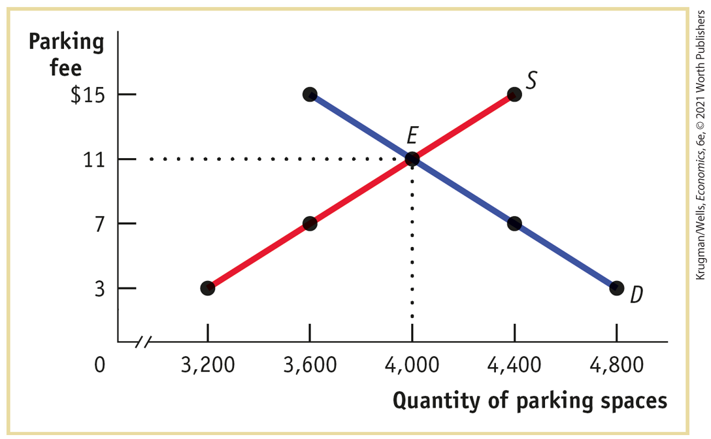
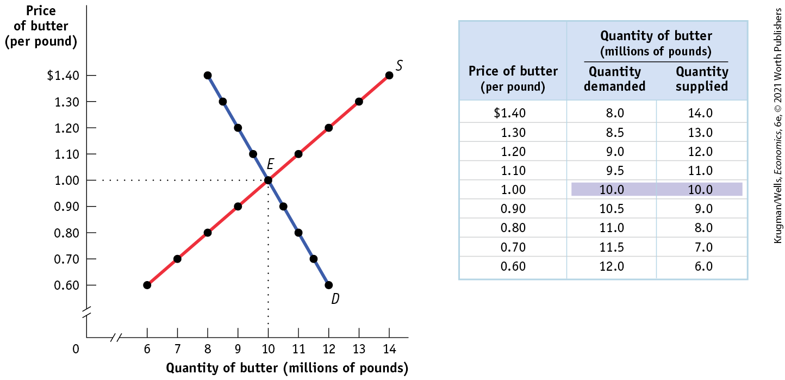
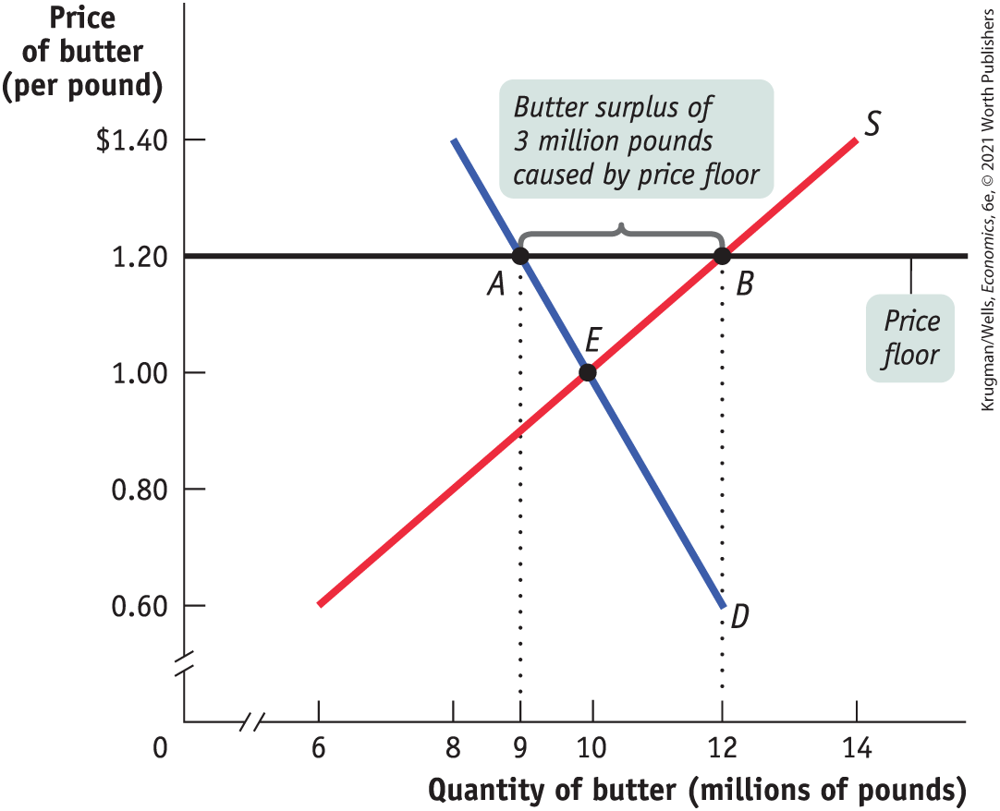
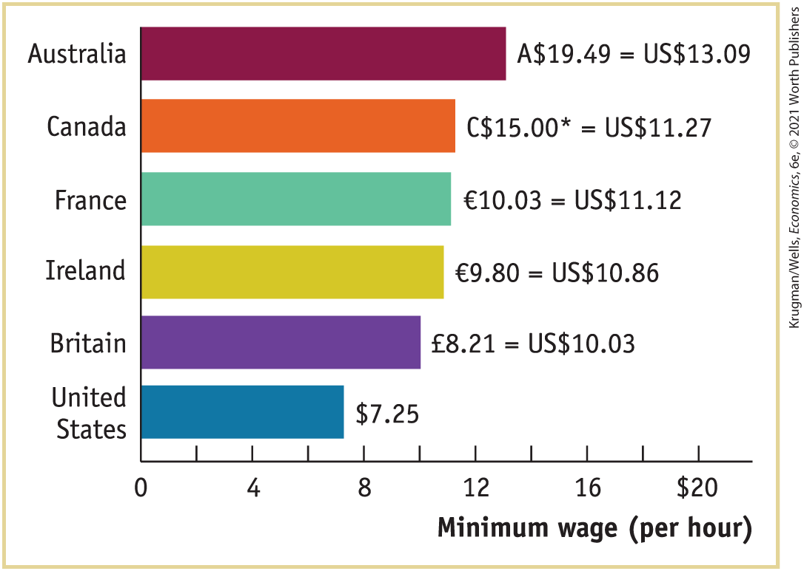
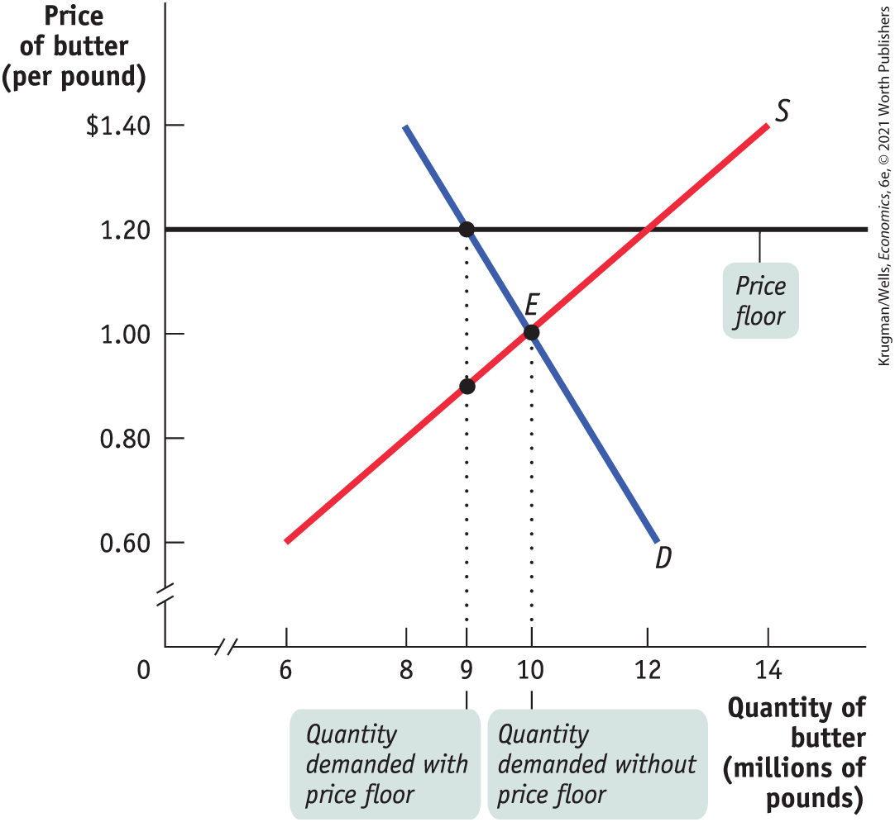
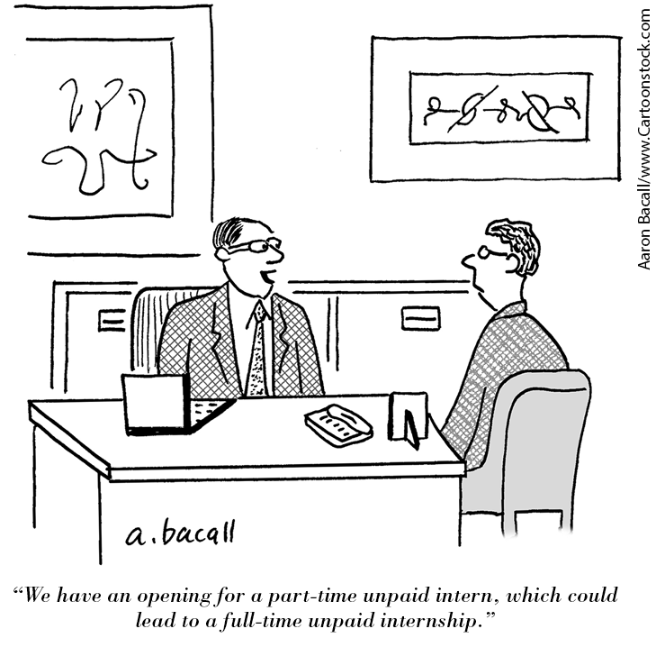
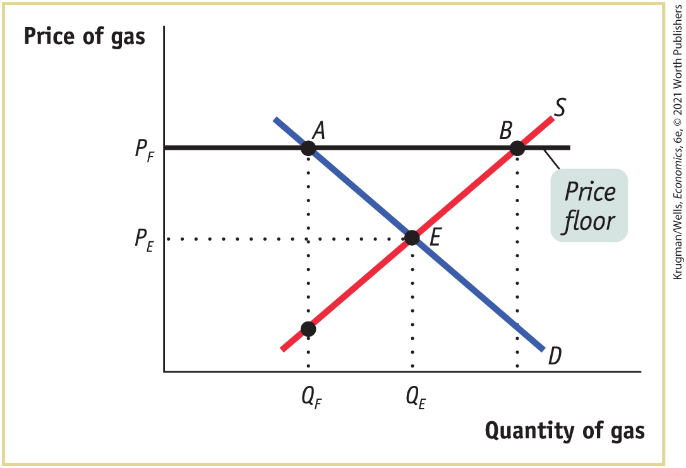

### *\>\> Check Your Understanding* 4-1

1.  On game days, homeowners near Middletown University’s stadium used to rent parking spaces in their driveways to fans at a going rate of \$11. A new town ordinance now sets a maximum parking fee of \$7. Use the accompanying supply and demand diagram to explain how each of the following corresponds to a price-ceiling concept.

    <figure id="pau_9781319320164_u3O69s7XvT" class="figure lm_img_lightbox unnum c5 center">
    
    </figure>

    <aside class="hidden" id="pau_9781319320164_WHYduAhPdf" title="hidden">

    The horizontal axis is truncated and labeled quantity of parking spaces ranging from 3200 to 4800 in increments of 400. The vertical axis is labeled parking fee and ranges from 0 to 15 with tick marks at 3 dollars, 7 dollars, 11 dollars, and 15 dollars. The graph shows two curves labeled S (supply) and D (Demand). The supply curve has a positive slope as it passes through points (3200, 3), (3600, 7), (4000, 11), and (4400, 15). The demand curve has a negative slope as it extends through points (3600, 15), (4000, 11), (4400, 7), and (4800, 3). The curves intersect at point E (4000, 11).

    </aside>

    1.  Some homeowners now think it’s not worth the hassle to rent out spaces.

    2.  Some fans who used to carpool to the game now drive alone.

    3.  Some fans can’t find parking and leave without seeing the game.

        Explain how each of the following adverse effects arises from the price ceiling.

    4.  Some fans now arrive several hours early to find parking.

    5.  Friends of homeowners near the stadium regularly attend games, even if they aren’t big fans. But some serious fans have given up because of the parking situation.

    6.  Some homeowners rent spaces for more than \$7 but pretend that the buyers are nonpaying friends or family.

2.  True or false? Explain your answer. A price ceiling below the equilibrium price of an otherwise efficient market does the following:
    1.  Increases quantity supplied
    2.  Makes some people who want to consume the good worse off
    3.  Makes all producers worse off

## Price Floors

Sometimes governments intervene to push market prices up instead of down. *Price floors* have been widely legislated for agricultural products, such as wheat and milk, as a way to support the incomes of farmers. Historically, there were also price floors — legally mandated minimum prices — on such services as trucking and air travel, although these were phased out by the U.S. government in the 1970s.

If you have ever worked in a fast-food restaurant, you are likely to have encountered a price floor: governments in the United States and many other countries maintain a lower limit on the hourly wage rate of a worker’s labor; that is, a floor on the price of labor called the <a href="#kru_9781319245269_EM_glossary.xhtml#pau_9781319320164_t3niezc4vW" id="kru_9781319245269_ch04_04.xhtml#pau_9781319320164_GckkiStiqf" class="glossref" role="doc-glossref">minimum wage</a>.

<aside aria-label="title 1" class="glossary c3 main-flow v1" epub:type="glossary" id="pau_9781319320164_BmHCvhtb34">

**minimum wage**  
The **minimum wage** is a legal floor on the wage rate, which is the market price of labor.

</aside>

Just like price ceilings, price floors are intended to help some people but generate predictable and undesirable side effects. <a href="#kru_9781319245269_ch04_04.xhtml#pau_9781319320164_jBFizGxW00" id="kru_9781319245269_ch04_04.xhtml#pau_9781319320164_aSa6hzhaGC" class="crossref">Figure 4-4</a> shows hypothetical supply and demand curves for butter. Left to itself, the market would move to equilibrium at point *E,* with 10 million pounds of butter bought and sold at a price of \$1 per pound.

<figure id="pau_9781319320164_jBFizGxW00" class="figure lm_img_lightbox num c4 center">

<figcaption>
FIGURE 4-4 The Market for Butter in the Absence of Government Controls

Without government intervention, the market for butter reaches equilibrium at a price of $1 per pound with 10 million pounds of butter bought and sold.
</figcaption>
</figure>

<aside class="hidden" id="pau_9781319320164_W9rYFgRw0P" title="hidden">

The horizontal axis is truncated and labeled quantity of butter (millions of pounds) ranging from 6 to 14 million pounds, in increments of 1 million pounds. The vertical axis is truncated and labeled price of butter (per pound) ranging from 0.6 to 1.40 dollars, in increments of 0.10 dollars. The graph shows two curves labeled S (supply) and D (Demand), each passing through nine coordinate points. The supply curve has a positive slope as it passes through points (6, 0.60), (7, 0.70), (8, 0.80), (9, 0.90), (10, 1.00), (11, 1.10), (12, 1.20), (13, 1.30), (14, 1.40). The demand curve has a negative slope as it passes through points (8, 1.40), (8.5, 1.30), (9, 1.20), (9.5, 1.10), (10, 1.00), (10.5, 0.90), (11, 0.80), and (12, 0.60). Both curves intersect at (10, 1.00) labeled E (equilibrium). The table has 9 rows and 10 three columns. The column headers, from left to right, are as follows, Price of butter (per pound), Quantity of butter demanded (millions of pounds), and Quantity of butter supplied (millions). The data from the table are as follows, Row 1. Price of butter, 1.40 dollars; Quantity demanded, 8.0 millions; Quantity Supplied, 14.0 million. Row 2. Price of butter, 1.30 dollars; Quantity demanded, 8.5 million; Quantity Supplied, 13.0 million. Row 3. Price of butter, 1.20 dollars; Quantity demanded, 9.0 million; Quantity Supplied, 12.0 million. Row 4. Price of butter, 1.10 dollars; Quantity demanded, 9.5 million; Quantity Supplied, 11.0 million. Row 5. Price of butter, 1.00 dollars; Quantity demanded, 10.0 million; Quantity Supplied, 10.0 million. In this row, the quantity demanded and supplied values, 10.0 million, are highlighted. Row 6. Price of butter, 0.90 dollars; Quantity demanded, 10.5 million; Quantity Supplied, 0.90 million. Row 7. Price of butter, 0.80 dollars; Quantity demanded, 11.0 million; Quantity Supplied, 0.80 million. Row 8. Price of butter, 0.70 dollars; Quantity demanded, 11.5 million; Quantity Supplied, 0.70 million. Row 9. Price of butter, 0.60 dollars; Quantity demanded, 12.0 million; Quantity Supplied, 0.60 million.

</aside>

Now suppose that the government, in order to help dairy farmers, imposes a price floor on butter of \$1.20 per pound. Its effects are shown in <a href="#kru_9781319245269_ch04_04.xhtml#pau_9781319320164_E87yhuwE9z" id="kru_9781319245269_ch04_04.xhtml#pau_9781319320164_7zRloBioI8" class="crossref">Figure 4-5</a>, where the line at \$1.20 represents the price floor. At a price of \$1.20 per pound, producers would want to supply 12 million pounds (point *B* on the supply curve) but consumers would want to buy only 9 million pounds (point *A* on the demand curve). So the price floor leads to a persistent surplus of 3 million pounds of butter.

<figure id="pau_9781319320164_E87yhuwE9z" class="figure lm_img_lightbox num c3 main-flow">

<figcaption>
FIGURE 4-5 The Effects of a Price Floor

The black horizontal line represents the government-imposed price floor of $1.20 per pound of butter. The quantity of butter demanded falls to 9 million pounds, and the quantity supplied rises to 12 million pounds, generating a persistent surplus of 3 million pounds of butter.
</figcaption>
</figure>

<aside class="hidden" id="pau_9781319320164_IWeFw5at74" title="hidden">

The vertical axis is truncated and labeled, Price of butter (per pound) ranging from 0.60 to 1.40 dollars, in increments of 0.20 dollars. The horizontal axis is truncated and labeled, Quantity of butter (millions of pounds) ranging from 6 to 14 million pounds, in increments of 2 million pounds. A curve labeled S is a positive sloping line that rises from (6, 600) to (14, 1.40). A curve labeled D is a negative sloping line that falls from (8, 1.40) to (12, 0.60). Both the curves intersect at E (10, 1.0). A horizontal line at a price of 1.20 dollar is labeled price floor. It intersects the demand curve at Point A, which represents a demand of 9 million pounds of butter at 1.20 dollars. It intersects the supply curve at point B, which represents a supply of 12 million pounds at 1.20 dollars. The distance between points A and B is labeled butter surplus of 3 million pounds caused by price floor.

</aside>

Does a price floor always lead to an unwanted surplus? No. Just as in the case of a price ceiling, the floor may not be binding — that is, it may be irrelevant. If the equilibrium price of butter is \$1 per pound but the floor is set at only \$0.80, the floor has no effect.

But suppose that a price floor is binding: what happens to the unwanted surplus? The answer depends on government policy. In the case of agricultural price floors, governments buy up unwanted surplus. As a result, the U.S. government, for example, has at times found itself warehousing thousands of tons of butter, cheese, and other farm products. The government then has to find a way to dispose of these unwanted goods.

Some countries pay exporters to sell products at a loss overseas; this is standard procedure for the European Union. The United States gives surplus food away to citizens in need as well as to schools, which use the products in school lunches. In some cases, governments have actually destroyed the surplus production.

When the government is not prepared to purchase the unwanted surplus, a price floor means that would-be sellers cannot find buyers. This is what happens when there is a price floor on the wage rate paid for an hour of labor, the minimum wage: when the minimum wage is above the equilibrium wage rate, some people who are willing to work — that is, sell labor — cannot find buyers — that is, employers — willing to give them jobs.

<aside class="case-study c3 main-flow v5" epub:type="case-study" id="pau_9781319320164_7f12cdSeTs" title="GLOBAL COMPARISON CHECK OUT OUR LOW, LOW WAGES">

### \>\> Global comparison

CHECK OUT OUR LOW, LOW WAGES!

The minimum wage rate in the United States, as you can see in this graph, is actually quite low compared with that in other rich countries. Since minimum wages are set in national currency — the British minimum wage is set in British pounds, the French minimum wage is set in euros, and so on — the comparison depends on the exchange rate on any given day. As of 2019, Australia had a minimum wage nearly twice as high as the U.S. rate, with France, Canada, and Ireland not far behind.

You can see one effect of this difference in the supermarket checkout line. In the United States there is usually someone to bag your groceries — someone typically paid the minimum wage or at best slightly more. In Europe, where hiring a bagger is a lot more expensive, you’re almost always expected to do the bagging yourself.

<figure id="pau_9781319320164_dClAbz7vea" class="figure lm_img_lightbox unnum c5 center">

</figure>

<aside class="hidden" id="pau_9781319320164_dcxy2w9QHG" title="hidden">

The horizontal axis, labeled minimum wage per hour, ranges from 0 to 20 (in dollars) in increment of 2 dollars while the vertical axis plots the country names. Data from the graph are as follows. Australia, 19.49 Australian dollars equals 13.09 U S dollars; Canada, 15.00 Canadian dollars superscript asterisk equals 11.27 U S dollars; France, 10.03 Euros equals 11.12 U S dollars; Ireland, 9.80 Euros equals 10.86 U S dollars; Britain, 8.21 equals 10.03 U S dollars; and United States equals 7.25 dollars.

</aside>

*Data from:* Organization for Economic Cooperation and Development (OECD).

\*The Canadian minimum wage varies by province from C\$11.05 to C\$15.00.

</aside>

### How a Price Floor Causes Inefficiency

The persistent surplus that results from a price floor creates missed opportunities — inefficiencies — that resemble those created by the shortage that results from a price ceiling. Like a price ceiling, a price floor creates inefficiency in at least four ways:

1.  It causes inefficiently low quantity.
2.  It leads to an inefficient allocation of sales among sellers.
3.  It leads to a waste of resources.
4.  It leads to sellers providing an inefficiently high-quality level.

In addition to inefficiency, like a price ceiling, a price floor leads to illegal behavior as people break the law to sell below the legal price.

#### Inefficiently Low Quantity

Because a price floor raises the price of a good to consumers, it reduces the quantity of that good demanded; because sellers can’t sell more units of a good than buyers are willing to buy, a price floor reduces the quantity of a good bought and sold below the market equilibrium quantity. Notice that this is the *same* effect as a price ceiling. You might be tempted to think that a price floor and a price ceiling have opposite effects, but both have the effect of reducing the quantity of a good bought and sold (see <a href="#kru_9781319245269_ch04_04.xhtml#pau_9781319320164_nQqRhcqvFH" id="kru_9781319245269_ch04_04.xhtml#pau_9781319320164_F2XiWICPUJ" class="crossref">the accompanying Pitfalls</a>).

As in the case of a price ceiling, the low quantity sold is an inefficiency due to missed opportunities: price floors prevent mutually beneficial transactions from occurring, transactions that would benefit both buyers and sellers. <a href="#kru_9781319245269_ch04_04.xhtml#pau_9781319320164_bEd7KbZDKV" id="kru_9781319245269_ch04_04.xhtml#pau_9781319320164_g53AEyKJgV" class="crossref">Figure 4-6</a> shows the inefficiently low quantity of butter sold with a price floor on the price of butter.

<figure id="pau_9781319320164_bEd7KbZDKV" class="figure lm_img_lightbox num c3 main-flow">

<figcaption>
FIGURE 4-6 A Price Floor Causes Inefficiently Low Quantity

A price floor reduces the quantity demanded below the market equilibrium quantity. Because sellers can’t sell more units of a good than buyers are willing to buy, a price floor reduces the quantity of a good bought and sold.
</figcaption>
</figure>

<aside class="hidden" id="pau_9781319320164_gF1J8lmaoq" title="hidden">

The vertical axis is truncated and labeled, price of butter (per pound) ranging from 0.60 to 1.40 dollars, in increments of 0.20 dollars. A horizontal line labeled Price floor corresponds to 1.20 dollars. The horizontal axis is truncated and labeled, Quantity of butter (millions of pounds) ranging from 6 to 14 million pounds, in increments of 2 million pounds. A curve labeled S is a positive sloping line that rises from (6, 600) to (14, 1.40). A curve labeled D is a negative sloping line that falls from (8, 1.40) to (12, 0.60). Both the curves intersect at E (10, 1.0) labeled quantity demanded without price floor. A vertical dotted line from Quantity 9 (labeled quantity demanded with price floor) cuts the supply curve at (9, 0.90) and cuts the demand curve at (9, 1.20).

</aside>
<aside class="case-study c3 main-flow v5" epub:type="case-study" id="pau_9781319320164_nQqRhcqvFH" title="Pitfalls">

##### *Pitfalls*

CEILINGS, FLOORS, AND QUANTITIES

A price ceiling pushes the price of a good *down.* A price floor pushes the price of a good *up.* So it’s easy to assume that the effects of a price floor are the opposite of the effects of a price ceiling. In particular, if a price ceiling reduces the quantity of a good bought and sold, doesn’t a price floor increase the quantity?

No, it doesn’t. In fact, both floors and ceilings reduce the quantity bought and sold. Why? When the quantity of a good supplied isn’t equal to the quantity demanded, the actual quantity sold is determined by the “short side” of the market — whichever quantity is less. If sellers don’t want to sell as much as buyers want to buy, it’s the sellers who determine the actual quantity sold, because buyers can’t force unwilling sellers to sell. If buyers don’t want to buy as much as sellers want to sell, it’s the buyers who determine the actual quantity sold, because sellers can’t force unwilling buyers to buy.

</aside>

#### Inefficient Allocation of Sales Among Sellers

Like a price ceiling, a price floor can lead to *inefficient allocation* — in this case, an <a href="#kru_9781319245269_EM_glossary.xhtml#pau_9781319320164_36X318mhy6" id="kru_9781319245269_ch04_04.xhtml#pau_9781319320164_zPTBMatgHd" class="glossref" role="doc-glossref">inefficient allocation of sales among sellers</a>: sellers who are willing to sell at the lowest price are unable to make sales, while sales go to sellers who are only willing to sell at a higher price.

<aside aria-label="title 2" class="glossary c3 main-flow v1" epub:type="glossary" id="pau_9781319320164_B6Fd4EMVs2">

**inefficient allocation of sales among sellers**  
Price floors can lead to **inefficient allocation of sales among sellers:** sellers who are willing to sell at the lowest price are unable to make sales while sales go to sellers who are only willing to sell at a higher price.

</aside>

One example of the inefficient allocation of selling opportunities caused by a price floor is the “two-tier” labor market found in many European countries that emerged in the 1980s and persists to this day. A high minimum wage led to a two-tier labor system, composed of the fortunate who had good jobs in the formal labor market, and the rest who were locked out without any prospect of ever finding a good job.

Either unemployed or underemployed in dead-end jobs in the black market for labor, the unlucky ones are disproportionately young, from the ages of 18 to early 30s. Although eager for good jobs in the formal sector and willing to accept less than the minimum wage — that is, willing to sell their labor for a lower price — it is illegal for employers to pay them less than the minimum wage. For example, in 2019, unemployment for young Italian workers stood at nearly 20%.

The inefficiency of unemployment and underemployment is compounded as generations of young people are unable to get adequate job training, develop careers, and save for their future. These young people are also more likely to engage in crime. The worst hit countries — such as Greece, Spain, Italy, and France — have seen many of their best and brightest young people emigrate, leading to a permanent reduction in the future performance of their economies.

#### Wasted Resources

Also like a price ceiling, a price floor generates inefficiency by *wasting resources.* The most graphic examples involve government purchases of the unwanted surpluses of agricultural products caused by price floors. The surplus production is sometimes destroyed, which is pure waste; in other cases, the stored produce goes, as officials euphemistically put it, “out of condition” and must be thrown away.

Price floors also lead to wasted time and effort. Consider the minimum wage. Would-be workers who spend many hours searching for jobs, or waiting in line in the hope of getting jobs, play the same role in the case of price floors as hapless families searching for apartments in the case of price ceilings.

#### Inefficiently High Quality

Again like price ceilings, price floors lead to inefficiency in the quality of goods produced.

We saw that when there is a price ceiling, suppliers produce products that are of inefficiently low quality: buyers prefer higher-quality products and are willing to pay for them, but sellers refuse to improve the quality of their products because the price ceiling prevents their being compensated for doing so. This same logic applies to price floors, but in reverse: suppliers offer goods of <a href="#kru_9781319245269_EM_glossary.xhtml#pau_9781319320164_JrFTZjbZHM" id="kru_9781319245269_ch04_04.xhtml#pau_9781319320164_d0IQWVXWHu" class="glossref" role="doc-glossref">inefficiently high quality</a>.

<aside aria-label="title 3" class="glossary c3 main-flow v1" epub:type="glossary" id="pau_9781319320164_sSHhRd1Zyo">

**inefficiently high quality**  
Price floors often lead to inefficiency in that goods of **inefficiently high quality** are offered: sellers offer high-quality goods at a high price, even though buyers would prefer a lower quality at a lower price.

</aside>

How can this be? Isn’t high quality a good thing? Yes, but only if it is worth the cost. Suppose that suppliers spend a lot to make goods of very high quality but that this quality isn’t worth much to consumers, who would rather receive the money spent on that quality in the form of a lower price. This represents a missed opportunity: suppliers and buyers could make a mutually beneficial deal in which buyers got goods of lower quality for a much lower price.

A good example of the inefficiency of excessive quality comes from the days when transatlantic airfares were set artificially high by international treaty. Forbidden to compete for customers by offering lower ticket prices, airlines instead offered expensive services, like lavish in-flight meals that went largely uneaten — an especially wasteful practice, considering that what passengers really wanted was less food and lower airfares.

Since the deregulation of U.S. airlines in the 1970s, American passengers have experienced a large decrease in ticket prices accompanied by a decrease in the quality of in-flight service — smaller seats, lower-quality food, and so on. Everyone complains about the service — but thanks to lower fares, the number of people flying on U.S. carriers has grown from 130 billion passenger miles when deregulation began to approximately 1,016 billion in 2019.

#### Illegal Activity

In addition to the four inefficiencies we analyzed, like price ceilings, price floors provide incentives for illegal activity. For example, in countries where the minimum wage is far above the equilibrium wage rate, workers desperate for jobs sometimes agree to work off the books for employers who conceal their employment from the government — or bribe the government inspectors. This practice, known in Europe as *black labor,* is especially common in Southern European countries such as Italy and Spain.

### So Why Are There Price Floors?

To sum up, a price floor creates various negative side effects:

- A persistent surplus of the good
- Inefficiency arising from the persistent surplus in the form of inefficiently low quantity transacted, inefficient allocation of sales among sellers, wasted resources, and an inefficiently high level of quality offered by suppliers
- The temptation to engage in illegal activity, particularly bribery and corruption of government officials

So why do governments impose price floors when they have so many negative side effects? The reasons are similar to those for imposing price ceilings. Government officials often disregard warnings about the consequences of price floors either because they believe that the relevant market is poorly described by the supply and demand model or, more often, because they do not understand the model. Above all, just as price ceilings are often imposed because they benefit some influential buyers of a good, price floors are often imposed because they benefit some influential sellers.

### ECONOMICS \>\> *in Action*

The Rise and Fall of the Unpaid Intern

The best-known example of a price floor is the minimum wage. Most economists believe, however, that the minimum wage has relatively little effect on the overall job market in the United States, mainly because the floor is set so low. In 1964, the U.S. minimum wage was 53% of the average wage of blue-collar production workers; by 2019, it had fallen to about 30%. However, there is one sector of the U.S. job market where it appears that the minimum wage can indeed be binding: the market for interns.

<figure id="pau_9781319320164_SBHwgA2sGg" class="figure lm_img_lightbox unnum c2 right">

</figure>

Starting in 2011, a spate of lawsuits brought by former unpaid interns claiming they were cheated out of wages brought the matter to public attention. A common thread in these complaints was that interns were assigned grunt work with no educational value, such as tracking lost cell phones. In other cases, unpaid interns complained that they were given the work of full-salaried employees. And by 2015, many of those lawsuits proved successful: Condé Nast Publications settled for \$5.8 million, Sirius SatelliteXM Radio settled for \$1.3 million, and Viacom Media settled for \$7.2 million. Even the Olsen twins had to cough up \$140,000 in payments to unpaid interns for their fashion company, Dualstar Entertainment, in 2017.

In 2018, the U.S. Department of Labor, the agency that formulates federal labor laws, issued a directive stating that unless their programs can clearly demonstrate an educational component such as course credit, companies have to pay their interns minimum wage or shut down their programs altogether.

Some observers worry that the end of the unpaid internship means that programs that once offered valuable training will be lost. But as one lawyer commented, “The law says that when you work, you have to get paid \[at least the minimum wage\].”

### *\>\> Quick Review*

- The most familiar price floor is the **minimum wage.** Price floors are also commonly imposed on agricultural goods.
- A price floor above the equilibrium price benefits successful sellers but causes predictable adverse effects such as a persistent surplus, which leads to four kinds of inefficiencies: inefficiently low quantity transacted, **inefficient allocation of sales among sellers**, wasted resources, and **inefficiently high quality.**
- Price floors encourage illegal activity, such as workers who work off the books, often leading to official corruption.

### *\>\> Check Your Understanding* 4-2

1.  The state legislature mandates a price floor for gasoline of *PF* per gallon. Assess the following statements and illustrate your answer using the figure provided.
    1.  Proponents of the law claim it will increase the income of gas station owners. Opponents claim it will hurt gas station owners because they will lose customers.

        <figure id="pau_9781319320164_pYoi9fmwXE" class="figure lm_img_lightbox unnum c5 center">
        
        </figure>

        <aside class="hidden" id="pau_9781319320164_YXzkhR4P5O" title="hidden">

        The vertical axis labeled price of gas has a tick mark at P subscript E and P subscript F, in that order from bottom to top. A horizontal line labeled price floor corresponds to P subscript f. The horizontal axis labeled quantity of gas has a tick mark at Q subscript F and Q subscript E in that order from left to right. The supply curve labeled S is a positive sloping line. The demand curve labeled D is a negative sloping line. The price floor crosses the demand curve at point A and the supply curve at point B. Point A corresponds to the quantity Q subscript F, as does a point directly below it on the supply line. Both curves intersect at point E, where quantity equals Q subscript E and Price equals P subscript E.

        </aside>

    2.  Proponents claim consumers will be better off because gas stations will provide better service. Opponents claim consumers will be generally worse off because they prefer to buy gas at cheaper prices.

    3.  Proponents claim that they are helping gas station owners without hurting anyone else. Opponents claim that consumers are hurt and will end up doing things like buying gas in a nearby state or on the black market.

## Controlling Quantities

In the 1930s, New York City instituted a system of licensing for taxicabs: only taxis with a “medallion” were allowed to pick up passengers, hailing them from the street. Because this system was intended to assure quality, medallion owners were supposed to maintain certain standards, including safety and cleanliness. A total of 11,787 medallions were issued, with taxi owners paying \$10 for each medallion.

In 1995, there were still only 11,787 licensed taxicabs in New York, even though the city had meanwhile become the financial capital of the world, a place where hundreds of thousands of people in a hurry tried to hail a cab every day. By 2019, the number of licensed cabs had risen to only 13,587. And up until a few years ago, this restriction on the number of New York City taxi medallions made them a very valuable item: if you wanted to operate a taxi in the city, you had to lease a medallion from someone or buy one.

Yet restrictions on the number of taxis induced people to try to circumvent them, eventually leading to the emergence of mobile-app-based car services like Uber and Lyft. Their cars aren’t hailed from the street like taxis — in fact, their drivers are forbidden from picking up riders from the street. Instead, riders arrange trips on their smartphones, directing available drivers to their location. Of course, the ubiquity of smartphones also contributed to the emergence of these car services.

Since 2013, Uber and Lyft have fundamentally altered the market for car rides in New York City and most other major cities. But let’s postpone the discussion of those effects until we learn more about how the market worked when only licensed taxicabs could operate.

A taxi medallion is a form of <a href="#kru_9781319245269_EM_glossary.xhtml#pau_9781319320164_pmMtGyp0H1" id="kru_9781319245269_ch04_05.xhtml#pau_9781319320164_ltNO1XijYe" class="glossref" role="doc-glossref">quantity control</a>, or <a href="#kru_9781319245269_EM_glossary.xhtml#pau_9781319320164_i0O42vlZ1z" id="kru_9781319245269_ch04_05.xhtml#pau_9781319320164_2edBU0KQEy" class="glossref" role="doc-glossref">quota</a>, by which the government regulates the quantity of a good that can be bought and sold rather than the price at which it is transacted. It is another way that government intervenes in markets along with price ceilings and price floors. The total amount of the good that can be transacted under the quantity control is called the <a href="#kru_9781319245269_EM_glossary.xhtml#pau_9781319320164_naBAJdMXLX" id="kru_9781319245269_ch04_05.xhtml#pau_9781319320164_KgNZiqdaGK" class="glossref" role="doc-glossref">quota limit</a>. Typically, the government limits quantity in a market by issuing <a href="#kru_9781319245269_EM_glossary.xhtml#pau_9781319320164_hQWTZbWQWr" id="kru_9781319245269_ch04_05.xhtml#pau_9781319320164_N1e0aDq0vS" class="glossref" role="doc-glossref">licenses</a>; only people with a license can legally supply the good.

<aside aria-label="title 1" class="glossary c3 main-flow v1" epub:type="glossary" id="pau_9781319320164_nXzsEm0NT4">

**quantity control**, **quota**, **quota limit**  
A **quantity control**, or **quota**, is an upper limit on the quantity of some good that can be bought or sold. The total amount of the good that can be legally transacted is the **quota limit.**

</aside>
<aside aria-label="title 2" class="glossary c3 main-flow v1" epub:type="glossary" id="pau_9781319320164_tX8Wu3EhHi">

**license**  
A **license** gives its owner the right to supply a good.

</aside>

A taxi medallion is just such a license. The government of New York City limited the number of taxi rides that can be sold by limiting the number of taxis to only those who hold medallions. More generally, quantity controls, or quotas, set an upper limit on the quantity of a good that can be transacted. For example, quotas have been used frequently to limit the size of the catch of endangered fish stocks. In this case, quotas are implemented for good economic reasons: to protect endangered fish stocks.

But some quotas are implemented for bad economic reasons, typically for the purpose of enriching the quota holder. For example, quantity controls introduced to address a temporary problem such as assuring that only safe and clean taxis are allowed to operate, become difficult to remove later, once the problem has disappeared, because quota holders benefit from them and exert political pressure.
