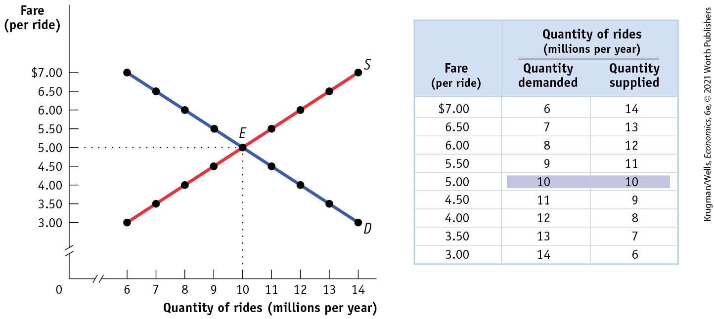
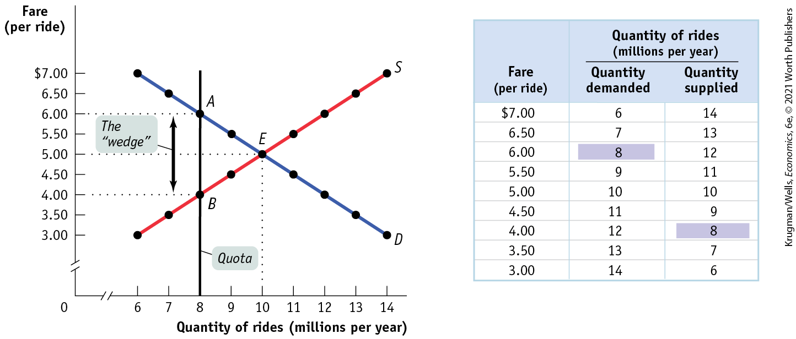
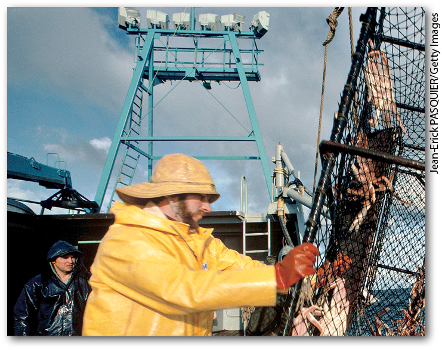
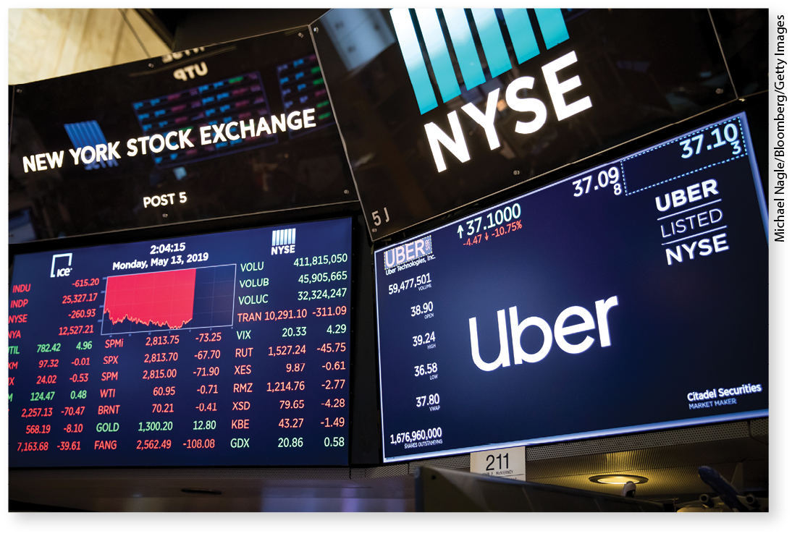

### The Anatomy of Quantity Controls

Before the arrival of Uber and Lyft, a New York taxi medallion was worth a lot of money — averaging several hundred thousand dollars. To understand why a New York taxi medallion was worth so much money in those days, we consider a simplified version of the market for taxi rides, shown in <a href="#kru_9781319245269_ch04_05.xhtml#pau_9781319320164_WGuvxdqpDH" id="kru_9781319245269_ch04_05.xhtml#pau_9781319320164_32WpENHDkA" class="crossref">Figure 4-7</a>. Just as we assumed in the analysis of rent control that all apartments are the same, we now suppose that all taxi rides are the same — ignoring the real-world complication that some taxi rides are longer, and so more expensive, than others.

<figure id="pau_9781319320164_WGuvxdqpDH" class="figure lm_img_lightbox num c4 center">

<figcaption>
FIGURE 4-7 The Market for Taxi Rides in the Absence of Government Controls

Without government intervention, the market reaches equilibrium with 10 million rides taken per year at a fare of $5 per ride.
</figcaption>
</figure>

<aside class="hidden" id="pau_9781319320164_jB9t9B2DfB" title="hidden">

The horizontal axis is truncated and labeled quantity of rides (millions per year) and ranges from 6 to 14 millions per year, in increments of 1 million per year. The vertical axis is truncated and labeled fare (per ride) and ranges from 3.00 to 7.00 dollars, in increments of 0.50 dollars. The graph shows two curves labeled S (supply) and D (Demand), each passing through nine coordinate points. The supply curve has a positive slope as it passes through points (6, 3.00), (7, 3.50), (8, 4.00), (9, 4.50), (10, 5.00), (11, 5.50), (12, 6.00), (13, 6.50), and (14, 7.00). The demand curve has a negative slope as it passes through points (6, 7.00), (7, 6.50), (8, 6.00), (9, 5.50), (10, 5.00), (11, 4.50), (12, 4.00), (13, 3.50), and (14, 3.00). Both the curves intersect at (10, 5.00) labeled E. The table has 9 rows and 3 columns. The column headers, from left to right, are as follows, Fare (per ride), Quantity of rides demanded (millions per year), and Quantity of rides supplied (millions per year). The data from the table are as follows, Row 1. Fare, 7.00 dollars; Quantity of rides demanded, 6 millions; Quantity of rides Supplied, 14 million. Row 2. Fare, 6.50 dollars; Quantity of rides demanded, 7 millions; Quantity of rides Supplied, 13 million. Row 3. Fare, 6.00 dollars; Quantity of rides demanded, 8 millions; Quantity of rides Supplied, 12 million. Row 4. Fare, 5.50 dollars; Quantity of rides demanded, 9 millions; Quantity of rides Supplied, 11 million. Row 5. Fare, 5.00 dollars; Quantity of rides demanded, 10 millions; Quantity of rides Supplied, 10 million. In this row, the quantity demanded and supplied values, 10 million, are highlighted. Row 6. Fare, 4.50 dollars; Quantity of rides demanded, 11 millions; Quantity of rides Supplied, 9 million. Row 7. Fare, 4.00 dollars; Quantity of rides demanded, 12 millions; Quantity of rides Supplied, 8 million. Row 8. Fare, 3.50 dollars; Quantity of rides demanded, 13 millions; Quantity of rides Supplied, 7 million. Row 9. Fare, 3.00 dollars; Quantity of rides demanded, 14 millions; Quantity of rides Supplied, 6 million.

</aside>

The table in the figure shows supply and demand schedules. The equilibrium — indicated by point *E* in the figure and by the shaded entries in the table — is a fare of \$5 per ride, with 10 million rides taken per year. (You’ll see in a minute why we present the equilibrium this way.)

In this example, the New York medallion system limits the number of taxis, but each taxi driver can offer as many rides as they can manage. To simplify our analysis, however, we will assume that a medallion system limits the number of taxi rides that can legally be given to 8 million per year.

Until now, we have derived the demand curve by answering questions of the form: “How many taxi rides will passengers want to take if the price is \$5 per ride?” But it is possible to reverse the question and ask instead: “At what price will consumers want to buy 10 million rides per year?” The price at which consumers want to buy a given quantity — in this case, 10 million rides at \$5 per ride — is the <a href="#kru_9781319245269_EM_glossary.xhtml#pau_9781319320164_dtipqjignX" id="kru_9781319245269_ch04_05.xhtml#pau_9781319320164_4VryuBfZy6" class="glossref" role="doc-glossref">demand price</a> of that quantity. You can see from the demand schedule in <a href="#kru_9781319245269_ch04_05.xhtml#pau_9781319320164_WGuvxdqpDH" id="kru_9781319245269_ch04_05.xhtml#pau_9781319320164_UPUOi7Q7Sb" class="crossref">Figure 4-7</a> that the demand price of 6 million rides is \$7 per ride, the demand price of 7 million rides is \$6.50 per ride, and so on.

<aside aria-label="title 3" class="glossary c3 main-flow v1" epub:type="glossary" id="pau_9781319320164_8UhKZmFtNr">

**demand price**  
The **demand price** of a given quantity is the price at which consumers will demand that quantity.

</aside>

Similarly, the supply curve represents the answer to questions of the form: “How many taxi rides would taxi drivers supply at a price of \$5 each?” But we can also reverse this question to ask: “At what price will suppliers be willing to supply 10 million rides per year?” The price at which suppliers will supply a given quantity — in this case, 10 million rides at \$5 per ride — is the <a href="#kru_9781319245269_EM_glossary.xhtml#pau_9781319320164_yRxnq1DzJx" id="kru_9781319245269_ch04_05.xhtml#pau_9781319320164_HSHI0jkM0p" class="glossref" role="doc-glossref">supply price</a> of that quantity. We can see from the supply schedule in <a href="#kru_9781319245269_ch04_05.xhtml#pau_9781319320164_WGuvxdqpDH" id="kru_9781319245269_ch04_05.xhtml#pau_9781319320164_1WGwT2Qs07" class="crossref">Figure 4-7</a> that the supply price of 6 million rides is \$3 per ride, the supply price of 7 million rides is \$3.50 per ride, and so on.

<aside aria-label="title 4" class="glossary c3 main-flow v1" epub:type="glossary" id="pau_9781319320164_PsfdE2Uq0z">

**supply price**  
The **supply price** of a given quantity is the price at which producers will supply that quantity.

</aside>

Now we are ready to analyze a quota. We have assumed that the city government limits the quantity of taxi rides to 8 million per year. Medallions, each of which carries the right to provide a certain number of taxi rides per year, are made available to selected people in such a way that a total of 8 million rides will be provided. Medallion-holders may then either drive their own taxis or rent their medallions to others for a fee.

<a href="#kru_9781319245269_ch04_05.xhtml#pau_9781319320164_oWc69cPDkr" id="kru_9781319245269_ch04_05.xhtml#pau_9781319320164_HpUyczv1sc" class="crossref">Figure 4-8</a> shows the resulting market for taxi rides, with the black vertical line at 8 million rides per year representing the quota limit. Because the quantity of rides is limited to 8 million, consumers must be at point *A* on the demand curve, corresponding to the shaded entry in the demand schedule: the demand price of 8 million rides is \$6 per ride. Meanwhile, taxi drivers must be at point *B* on the supply curve, corresponding to the shaded entry in the supply schedule: the supply price of 8 million rides is \$4 per ride.

<figure id="pau_9781319320164_oWc69cPDkr" class="figure lm_img_lightbox num c4 center">

<figcaption>
FIGURE 4-8 Effect of a Quota on the Market for Taxi Rides

The table shows the demand price and the supply price corresponding to each quantity: the price at which that quantity would be demanded and supplied, respectively. The city government imposes a quota of 8 million rides by selling licenses for only 8 million rides, represented by the black vertical line. The price paid by consumers rises to $6 per ride, the demand price of 8 million rides, shown by point <em>A.</em> The supply price of 8 million rides is only $4 per ride, shown by point <em>B.</em> The difference between these two prices is the quota rent per ride, the earnings that accrue to the owner of a license. The quota rent drives a wedge between the demand price and the supply price and discourages mutually beneficial transactions.
</figcaption>
</figure>

<aside class="hidden" id="pau_9781319320164_u5cMEBwmPI" title="hidden">

The vertical axis is truncated and labeled fare (per ride) and ranges from 3.00 to 7.00 dollars, in increments of 0.50 dollars. The horizontal axis is truncated and labeled quantity of rides (millions per year) and ranges from 6 to 14 million per year, in increments of 1 million per year. The graph shows two curves labeled S (supply) and D (Demand), each passing through nine coordinate points. The supply curve has a positive slope as it passes through points (6, 3.00), (7, 3.50), (8, 4.00), (9, 4.50), (10, 5.00), (11, 5.50), (12, 6.00), (13, 6.50), and (14, 7.00). The demand curve has a negative slope as it passes through points (6, 7.00), (7, 6.50), (8, 6.00), (9, 5.50), (10, 5.00), (11, 4.50), (12, 4.00), (13, 3.50), and (14, 3.00). Both the curves intersect at (10, 5.00) labeled E. A perpendicular line labeled quota corresponds to Quantity 8 millions per year cuts the supply curve at (8, 4.00) labeled B, and cuts the demand curve at (8, 6.00) labeled A. The fare between points A and B is labeled, The ‘wedge’. The table has 9 rows and 3 columns. The column headers, from left to right, are as follows, Fare (per ride), Quantity of rides demanded (millions per year), and Quantity of rides supplied (millions per year). The data from the table are as follows, Row 1. Fare, 7.00 dollars; Quantity of rides demanded, 6 millions; Quantity of rides Supplied, 14 million. Row 2. Fare, 6.50 dollars; Quantity of rides demanded, 7 millions; Quantity of rides Supplied, 13 million. Row 3. Fare, 6.00 dollars; Quantity of rides demanded, 8 millions (highlighted); Quantity of rides Supplied, 12 million. Row 4. Fare, 5.50 dollars; Quantity of rides demanded, 9 millions; Quantity of rides Supplied, 11 million. Row 5. Fare, 5.00 dollars; Quantity of rides demanded, 10 millions; Quantity of rides Supplied, 10 million. Row 6. Fare, 4.50 dollars; Quantity of rides demanded, 11 millions; Quantity of rides Supplied, 9 million. Row 7. Fare, 4.00 dollars; Quantity of rides demanded, 12 millions; Quantity of rides Supplied, 8 million (highlighted). Row 8. Fare, 3.50 dollars; Quantity of rides demanded, 13 millions; Quantity of rides Supplied, 7 million. Row 9. Fare, 3.00 dollars; Quantity of rides demanded, 14 millions; Quantity of rides Supplied, 6 million.

</aside>

But how can the price received by taxi drivers be \$4 when the price paid by taxi riders is \$6? The answer is that in addition to the market in taxi rides, there is also a market in medallions. Medallion-holders may not always want to drive their taxis: they may be ill or on vacation. Those who do not want to drive their own taxis will sell the right to use the medallion to someone else.

So we need to consider two sets of transactions here, and so two prices: (1) the transactions in taxi rides and the price at which these will occur, and (2) the transactions in medallions and the price at which these will occur. It turns out that since we are looking at two markets, the \$4 and \$6 prices will both be right.

To see how this all works, consider two imaginary New York taxi drivers, Ali and Jean. Ali has a medallion but can’t use it because he’s recovering from a severely sprained wrist. So he’s looking to rent his medallion out to someone else. Jean doesn’t have a medallion but would like to rent one. Furthermore, at any point in time there are many other people like Jean who would like to rent a medallion. Suppose Ali agrees to rent his medallion to Jean. To make things simple, assume that any driver can give only one ride per day and that Ali is renting his medallion to Jean for one day. What rental price will they agree on?

To answer this question, we need to look at the transactions from the viewpoints of both drivers. Once she has the medallion, Jean knows she can make \$6 per day — the demand price of a ride under the quota. And she is willing to rent the medallion only if she makes at least \$4 per day — the supply price of a ride under the quota. So Ali cannot demand a rent of more than \$2 — the difference between \$6 and \$4. And if Jean offered Ali less than \$2 — say, \$1.50 — there would be other eager drivers willing to offer him more, up to \$2. So, in order to get the medallion, Jean must offer Ali at least \$2. Since the rent can be no more than \$2 and no less than \$2, it must be exactly \$2.

It is no coincidence that \$2 is exactly the difference between \$6, the demand price of 8 million rides, and \$4, the supply price of 8 million rides. In every case in which the supply of a good is legally restricted, there is a <a href="#kru_9781319245269_EM_glossary.xhtml#pau_9781319320164_ojVTbSjypQ" id="kru_9781319245269_ch04_05.xhtml#pau_9781319320164_akUGNDHy81" class="glossref" role="doc-glossref">wedge</a> between the demand price of the quantity transacted and the supply price of the quantity transacted.

<aside aria-label="title 5" class="glossary c3 main-flow v1" epub:type="glossary" id="pau_9781319320164_XhIomPRUxy">

**wedge**  
A quantity control, or quota, drives a **wedge** between the demand price and the supply price of a good; that is, the price paid by buyers ends up being higher than that received by sellers.

</aside>

This wedge, illustrated by the double-headed arrow in <a href="#kru_9781319245269_ch04_05.xhtml#pau_9781319320164_oWc69cPDkr" id="kru_9781319245269_ch04_05.xhtml#pau_9781319320164_HBU8z1vF2y" class="crossref">Figure 4-8</a>, has a special name: the <a href="#kru_9781319245269_EM_glossary.xhtml#pau_9781319320164_PB4c4epPrg" id="kru_9781319245269_ch04_05.xhtml#pau_9781319320164_0516VbWlLX" class="glossref" role="doc-glossref">quota rent</a>. It is the earnings that accrue to the license-holder from ownership of a valuable commodity, the license. In the case of Ali and Jean, the quota rent of \$2 goes to Ali because he owns the license, and the remaining \$4 from the total fare of \$6 goes to Jean.

<aside aria-label="title 6" class="glossary c3 main-flow v1" epub:type="glossary" id="pau_9781319320164_xCtr6EAYjR">

**quota rent**  
The difference between the demand and supply price at the quota limit is the **quota rent**, the earnings that accrue to the license-holder from ownership of the right to sell the good. It is equal to the market price of the license when the licenses are traded.

</aside>

<a href="#kru_9781319245269_ch04_05.xhtml#pau_9781319320164_oWc69cPDkr" id="kru_9781319245269_ch04_05.xhtml#pau_9781319320164_JqtdDu6VhG" class="crossref">Figure 4-8</a> also illustrates the quota rent in the market for New York taxi rides. The quota limits the quantity of rides to 8 million per year, a quantity at which the demand price of \$6 exceeds the supply price of \$4. The wedge between these two prices, \$2, is the quota rent that results from the restrictions placed on the quantity of taxi rides in this market.

But wait a second. What if Ali doesn’t rent out his medallion? What if he uses it himself? Doesn’t this mean that he gets a price of \$6? No, not really. Even if Ali doesn’t rent out his medallion, he could have rented it out, which means that the medallion has an *opportunity cost* of \$2: if Ali decides to use his own medallion and drive his own taxi rather than renting his medallion to Jean, the \$2 represents his opportunity cost of not renting out his medallion. That is, the \$2 quota rent is now the rental income he forgoes by driving his own taxi.

In effect, Ali is in two businesses — the taxi-driving business and the medallion-renting business. He makes \$4 per ride from driving his taxi and \$2 per ride from renting out his medallion. It doesn’t make any difference that in this particular case he has rented his medallion to himself! So under quantity controls, the medallion is a valuable asset regardless of whether the medallion owner uses it or rents it out to others. In 2010, before the rise of Uber and Lyft effectively eliminated the quantity controls, New York taxi medallions were trading for around \$500,000. Notice, by the way, that quotas — like price ceilings and price floors — don’t always have a real effect. If the quota were set at 12 million rides — that is, above the equilibrium quantity in an unregulated market — it would have no effect because it would not be binding.

### The Costs of Quantity Controls

Like price controls, quantity controls can have some predictable and undesirable side effects. The first is the by-now-familiar problem of inefficiency due to missed opportunities: quantity controls prevent mutually beneficial transactions from occurring, transactions that would benefit both buyers and sellers.

Looking back at <a href="#kru_9781319245269_ch04_05.xhtml#pau_9781319320164_oWc69cPDkr" id="kru_9781319245269_ch04_05.xhtml#pau_9781319320164_qF7oBAntJt" class="crossref">Figure 4-8</a>, you can see that starting at the quota limit of 8 million rides, New Yorkers would be willing to pay at least \$5.50 per ride when 9 million rides are offered, 1 million more than the quota, and that taxi drivers would be willing to provide those rides as long as they got at least \$4.50 per ride. These are rides that would have taken place if there were no quota limit.

The same is true for the next 1 million rides: New Yorkers would be willing to pay at least \$5 per ride when the quantity of rides is increased from 9 to 10 million, and taxi drivers would be willing to provide those rides as long as they got at least \$5 per ride. Again, these rides would have occurred without the quota limit.

Only when the market has reached the unregulated market equilibrium quantity of 10 million rides are there no “missed-opportunity rides.” The quota limit of 8 million rides has caused 2 million “missed-opportunity rides.”

Generally, *as long as the demand price of a given quantity exceeds the supply price, there is a missed opportunity.* A buyer would be willing to buy the good at a price that the seller would be willing to accept, but such a transaction does not occur because it is forbidden by the quota.

And because there are transactions that people would like to make but are not allowed to, quantity controls generate an incentive to circumvent them. In the days before Uber and Lyft, a substantial number of unlicensed taxis simply defied the law and picked up passengers without a medallion. These unregulated, unlicensed taxis contributed to a disproportionately large share of accidents.

However, Uber and Lyft cars legally circumvent the restriction that a car without a medallion can’t be hailed from the street. By 2018, Uber had over 78,000 cars in New York City, significantly more than the 13,587 licensed taxicabs.

Clearly, the quantity restriction on New York City taxicabs has been substantially undermined. In effect, the quota line in <a href="#kru_9781319245269_ch04_05.xhtml#pau_9781319320164_oWc69cPDkr" id="kru_9781319245269_ch04_05.xhtml#pau_9781319320164_GTdVTxqoTE" class="crossref">Figure 4-8</a> has shifted rightward, closer to the equilibrium quantity, with the entry of Uber and Lyft.

In the past few years, as quota rents to owners of a taxi medallion have fallen, the prices of taxi medallions have fallen significantly as well. In 2018 and 2019, prices for New York City taxi medallions ranged from \$185,000 to \$130,000, a steep fall from the \$500,000 pricetag in 2010. In sum, quantity controls typically create the following undesirable side effects:

- Inefficiencies, or missed opportunities, in the form of mutually beneficial transactions that don’t occur
- Incentives for illegal activities

### ECONOMICS \>\> *in Action*

Crabbing, Quotas, and Saving Lives in Alaska

Alaskan king and snow crabs are considered delicacies worldwide. And crab fishing is one of the most important industries in the Alaskan economy. So many were justifiably concerned when, in 1983, the annual crab catch fell by 90% due to overfishing. In response, marine biologists set a *total allowable catch quota system,* which limited the amount of crab that could be harvested annually in order to allow the crab population to return to a healthy, sustainable level.

Notice, by the way, that the Alaskan crab quota is an example of a quota that was justified by broader economic and environmental considerations — unlike the New York City taxicab quota, which has long since lost any economic rationale. Another important difference is that, unlike New York City taxicab medallions, owners of Alaskan crab boats did not have the ability to buy or sell individual quotas. So although depleted crab stocks eventually recovered with the total catch quota system in place, there was another, unintended and deadly consequence.

The Alaskan crabbing season is fairly short, running roughly from October to January, and it can be further shortened by bad weather. By the 1990s, Alaskan crab fishermen were engaging in “fishing derbies.” To stay within the quota limit when the crabbing season began, boat crews rushed to fish for crab in dangerous, icy, rough water, straining to harvest in a few days a haul that could be worth several hundred thousand dollars. As a result, boats often became overloaded and capsized, making Alaskan crab fishing one of the most dangerous jobs, with an average of 7.3 deaths a year, about 80 times the fatality rate for an average worker. And after the brief harvest, the market for crab was flooded with supply, lowering the prices fishermen received.

<figure id="pau_9781319320164_kPkTPRjNPE" class="figure lm_img_lightbox unnum c2 right">

<figcaption>
The quota-share system protects Alaska’s crab population and saves the lives of crabbers.
</figcaption>
</figure>

In 2006 fishery regulators instituted another quota system called *quota share* — aimed at protecting Alaska’s crabbers and crabs. Under individual quota share, each boat received a quota to fill during the three-month season. Moreover, the individual quotas could be sold or leased. These changes transformed the industry as owners of bigger boats bought the individual quotas of smaller boats, shrinking the number of crabbing boats dramatically. Bigger boats are much less likely to capsize, improving crew safety.

In addition, by extending the fishing season, the quota-share system boosted the crab population and crab prices. With more time to fish, fishermen could make sure that juvenile and female crabs were returned to the sea rather than harvested. And with a longer fishing season, the catch comes to market more gradually, eliminating the downward plunge in prices when supply hits the market. Predictably, an Alaskan crab fisherman earns more money under the quota-share system than under the total catch quota system.

### *\>\> Quick Review*

- **Quantity controls**, or **quotas**, are government-imposed limits on how much of a good may be bought or sold. The quantity allowed for sale is the **quota limit.** The government then issues a **license** — the right to sell a given quantity of a good under the quota.
- When the quota limit is smaller than the equilibrium quantity in an unregulated market, the **demand price** is higher than the **supply price** — there is a **wedge** between them at the quota limit.
- This wedge is the **quota rent**, the earnings that accrue to the license-holder from ownership of the right to sell the good — whether by actually supplying the good or by renting the license to someone else. The market price of a license equals the quota rent.
- Like price controls, quantity controls create inefficiencies and encourage illegal activity.

### *\>\> Check Your Understanding* 4-3

1.  Suppose that the supply and demand for taxi rides is given by <a href="#kru_9781319245269_ch04_05.xhtml#pau_9781319320164_WGuvxdqpDH" id="kru_9781319245269_ch04_05.xhtml#pau_9781319320164_90fKNgkYsm" class="crossref">Figure 4-7</a> but the quota is set at 6 million rides instead of 8 million. Find the following and indicate them on <a href="#kru_9781319245269_ch04_05.xhtml#pau_9781319320164_WGuvxdqpDH" id="kru_9781319245269_ch04_05.xhtml#pau_9781319320164_RbpFbe2j0t" class="crossref">Figure 4-7</a>.
    1.  The price of a ride
    2.  The quota rent
    3.  Suppose the quota limit on taxi rides is increased to 9 million. What happens to the quota rent?
2.  Assume that the quota limit is 8 million rides. Suppose demand decreases due to a decline in tourism. What is the smallest parallel leftward shift in demand that would result in the quota no longer having an effect on the market? Illustrate your answer using <a href="#kru_9781319245269_ch04_05.xhtml#pau_9781319320164_WGuvxdqpDH" id="kru_9781319245269_ch04_05.xhtml#pau_9781319320164_nmOAeVktZm" class="crossref">Figure 4-7</a>.

## Business case 

A Market Disruptor Gets Disrupted by the Market

<figure id="pau_9781319320164_l2bfWk963h" class="figure lm_img_lightbox unnum c2 right">

</figure>

August 8, 2019, was a grim day at the San Francisco headquarters of Uber, the global leader in ride-hailing companies. That day it announced a staggering loss of \$5.2 *billion* in just the previous 3 months. This was in addition to the loss of more than \$1 billion in the first quarter of the year. Equally ominous was news of a significant drop in the annual growth rate in the number of rides provided. These results led some observers to question the company’s long-term viability.

For a company that had been the darling of the high-tech business world, this day was a spectacular humbling. Investors had believed that only one company — namely Uber — would come to dominate the ride-hailing industry, ultimately making it very profitable. What had gone so wrong?

Uber was the brainchild of two friends, Travis Kalanick and Garret Camp, conceived after a difficult search for a taxi in Paris. When it launched in 2010 in San Francisco, Uber was the first company to enable ride hailing via a smartphone app. It provided easy access to lower-priced cab rides. Uber expanded rapidly, eventually extending its reach to over 600 cities worldwide. The company focused, in particular, on expansion in cities where the existing taxi market was highly regulated and restricted. Ridership grew explosively, so that by 2019 Uber was completing nearly 14 million rides each day.

But Uber’s success did not go unnoticed. Seeing the opportunity to make money, some people wanted to become Uber drivers while others wanted to start up rival companies. In 2012, for example, Lyft launched a competing service. In Latin America, China, and India, home-grown challengers emerged. Uber responded by rolling out costly initiatives. For example, to keep its ridership high, Uber began subsidizing rides — that is, it provided discount codes and coupons that lowered the price of rides below the actual cost of providing them.

Whether Uber can get back on track — turning its losses around, recapturing its high growth rates of the past, and fulfilling its early promise — remains to be seen.

<aside class="assessments c3 main-flow v1" epub:type="assessments" id="pau_9781319320164_ECbTBD8SgR">

### Questions for thought

1.  How did quantity controls for taxi rides contribute to Uber’s high rates of growth in its early years?
2.  Based on what you’ve learned in the chapter, explain whether Uber’s recent difficulties were predictable or the result of bad luck.
3.  How likely is it that Uber can regain its past high rates of growth?
4.  How has the allocation of surplus changed in this market over time? Who benefitted when Uber began competing with existing taxi companies? Who benefited when rival ride-hailing companies began competing with Uber?

</aside>

### Summary

1.  Even when a market is efficient, governments often intervene to pursue greater fairness or to please a powerful interest group. Interventions can take the form of **price controls** or quantity controls, both of which generate predictable and undesirable side effects consisting of various forms of inefficiency and illegal activity.
2.  A **price ceiling**, a maximum market price below the equilibrium price, benefits successful buyers but creates persistent shortages. Because the price is maintained below the equilibrium price, the quantity demanded is increased and the quantity supplied is decreased compared to the equilibrium quantity. This leads to predictable problems: inefficiently low quantity transacted, **inefficient allocation to consumers, wasted resources**, and **inefficiently low quality.** It also encourages illegal activity as people turn to **black markets** to get the good. Because of these problems, price ceilings have generally lost favor as an economic policy tool. However, price ceilings can be justified when the market is inefficient or when a natural disaster leads to shortages that, if left to a free market, would greatly diminish equity and social welfare.
3.  A **price floor**, a minimum market price above the equilibrium price, benefits successful sellers but creates persistent surplus. Because the price is maintained above the equilibrium price, the quantity demanded is decreased and the quantity supplied is increased compared to the equilibrium quantity. This leads to predictable problems: inefficiently low quantity transacted, **inefficient allocation of sales among sellers**, wasted resources, and **inefficiently high quality.** It also encourages illegal activity and black markets. The most well-known kind of price floor is the **minimum wage**, but price floors are also commonly applied to agricultural products.
4.  **Quantity controls**, or **quotas**, limit the quantity of a good that can be bought or sold. The quantity allowed for sale is the **quota limit.** The government issues **licenses** to individuals, the right to sell a given quantity of the good. The owner of a license earns a **quota rent**, earnings that accrue from ownership of the right to sell the good. It is equal to the difference between the **demand price** at the quota limit, what consumers are willing to pay for that quantity, and the **supply price** at the quota limit, what suppliers are willing to accept for that quantity. Economists say that a quota drives a **wedge** between the demand price and the supply price; this wedge is equal to the quota rent. Quantity controls lead to inefficiencies in the form of mutually beneficial transactions that do not occur; they also encourage illegal activity.

### Key Terms

- <a href="#kru_9781319245269_ch04_02.xhtml#pau_9781319320164_i9cQxv0mqO" id="kru_9781319245269_ch04_07.xhtml#pau_9781319320164_dMcEdZecJf" class="crossref">Price controls</a>
- <a href="#kru_9781319245269_ch04_02.xhtml#pau_9781319320164_JslHtcDcg2" id="kru_9781319245269_ch04_07.xhtml#pau_9781319320164_eM5hOPIesB" class="crossref">Price ceiling</a>
- <a href="#kru_9781319245269_ch04_02.xhtml#pau_9781319320164_A9jN6vfAA1" id="kru_9781319245269_ch04_07.xhtml#pau_9781319320164_z9OPvyckgL" class="crossref">Price floor</a>
- <a href="#kru_9781319245269_ch04_03.xhtml#pau_9781319320164_nLG88hQ4SQ" id="kru_9781319245269_ch04_07.xhtml#pau_9781319320164_QAkHH29hM4" class="crossref">Inefficient allocation to consumers</a>
- <a href="#kru_9781319245269_ch04_03.xhtml#pau_9781319320164_smYkx9329q" id="kru_9781319245269_ch04_07.xhtml#pau_9781319320164_dYyh9EP4Sk" class="crossref">Wasted resources</a>
- <a href="#kru_9781319245269_ch04_03.xhtml#pau_9781319320164_r9cBxqPaig" id="kru_9781319245269_ch04_07.xhtml#pau_9781319320164_Zu8L0cZcfY" class="crossref">Inefficiently low quality</a>
- <a href="#kru_9781319245269_ch04_03.xhtml#pau_9781319320164_zOKcunMjo3" id="kru_9781319245269_ch04_07.xhtml#pau_9781319320164_NFY25hMjwd" class="crossref">Black market</a>
- <a href="#kru_9781319245269_ch04_04.xhtml#pau_9781319320164_qc095d73Fe" id="kru_9781319245269_ch04_07.xhtml#pau_9781319320164_ecouQ8uC9o" class="crossref">Minimum wage</a>
- <a href="#kru_9781319245269_ch04_04.xhtml#pau_9781319320164_MgJld9Xf0L" id="kru_9781319245269_ch04_07.xhtml#pau_9781319320164_0ggBIcRplC" class="crossref">Inefficient allocation of sales among sellers</a>
- <a href="#kru_9781319245269_ch04_04.xhtml#pau_9781319320164_e3uq9yX5Gf" id="kru_9781319245269_ch04_07.xhtml#pau_9781319320164_mJKIf3TED5" class="crossref">Inefficiently high quality</a>
- <a href="#kru_9781319245269_ch04_05.xhtml#pau_9781319320164_gU0SCQxgb9" id="kru_9781319245269_ch04_07.xhtml#pau_9781319320164_RER6mkAwff" class="crossref">Quantity control</a>
- <a href="#kru_9781319245269_ch04_05.xhtml#pau_9781319320164_AqgqLs4UgO" id="kru_9781319245269_ch04_07.xhtml#pau_9781319320164_SNlPqRGNF0" class="crossref">Quota</a>
- <a href="#kru_9781319245269_ch04_05.xhtml#pau_9781319320164_EwzPusFGUn" id="kru_9781319245269_ch04_07.xhtml#pau_9781319320164_2XYY1KqXbQ" class="crossref">Quota limit</a>
- <a href="#kru_9781319245269_ch04_05.xhtml#pau_9781319320164_mdAWGGPMtA" id="kru_9781319245269_ch04_07.xhtml#pau_9781319320164_dnrOBbUVEN" class="crossref">License</a>
- <a href="#kru_9781319245269_ch04_05.xhtml#pau_9781319320164_P0Gak2cfvP" id="kru_9781319245269_ch04_07.xhtml#pau_9781319320164_1jbozPBaMb" class="crossref">Demand price</a>
- <a href="#kru_9781319245269_ch04_05.xhtml#pau_9781319320164_VOrL8h0ydY" id="kru_9781319245269_ch04_07.xhtml#pau_9781319320164_p4SYs9MAuZ" class="crossref">Supply price</a>
- <a href="#kru_9781319245269_ch04_05.xhtml#pau_9781319320164_ICyfx7eNlK" id="kru_9781319245269_ch04_07.xhtml#pau_9781319320164_9jJ3o6tTJ7" class="crossref">Wedge</a>
- <a href="#kru_9781319245269_ch04_05.xhtml#pau_9781319320164_1iWOcuW6Eb" id="kru_9781319245269_ch04_07.xhtml#pau_9781319320164_CAfnX3ezoX" class="crossref">Quota rent</a>

### Practice questions

1.  Oregon recently became the first state to adopt legislation capping housing rents statewide. Explain how Oregon’s policy will affect landlords, renters, and the quality of rental units available.
2.  In your state the minimum wage is \$12 per hour. Yet, you notice that many fast-food restaurants have posted help wanted signs for jobs paying \$15 per hour. What does this tell you about the minimum wage and the availability of restaurant work in your town?
3.  Many Washington State residents and politicians are concerned about the declining salmon population, a primary food source for local wildlife, including the endangered orca whale. To protect the salmon population from overfishing, politicians are considering two policies. The first is a binding price ceiling in the market for salmon. The second policy is a quota: permits would be sold to those who fish commercially in order to restrict their salmon catch. As events have unfolded, it’s become clear that politicians tend to favor the quota system while those who catch fish for a living prefer a price ceiling. Why do you think this is the case?
