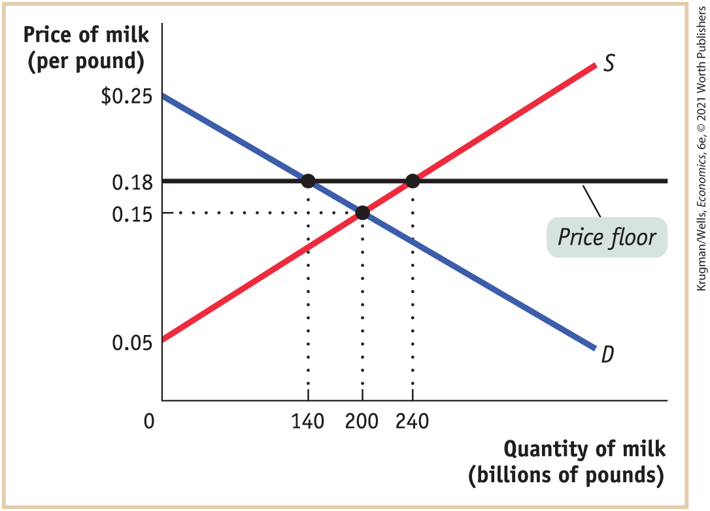
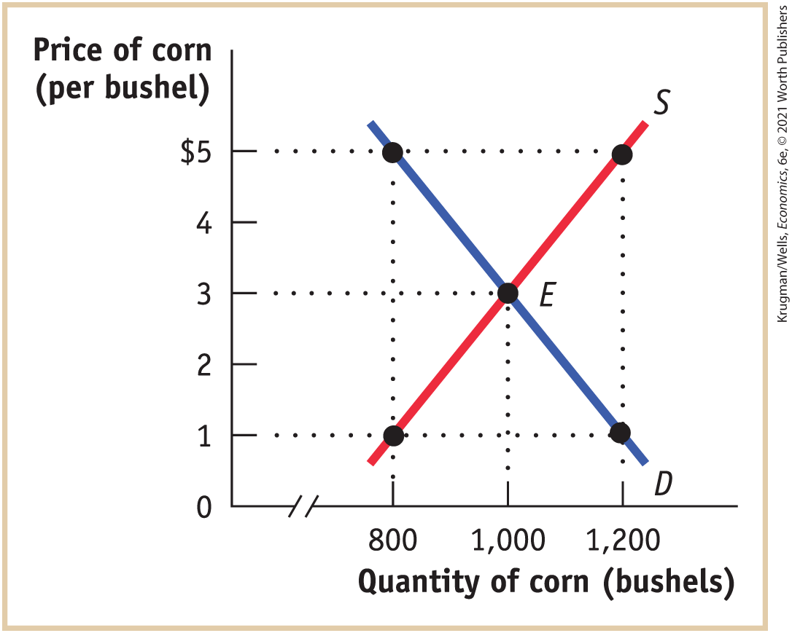
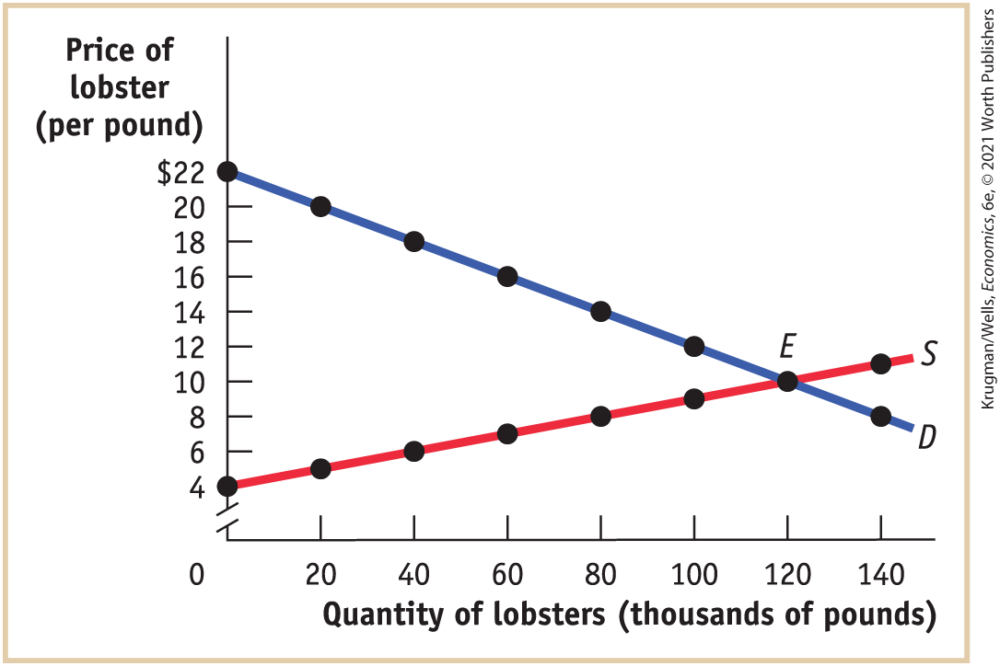
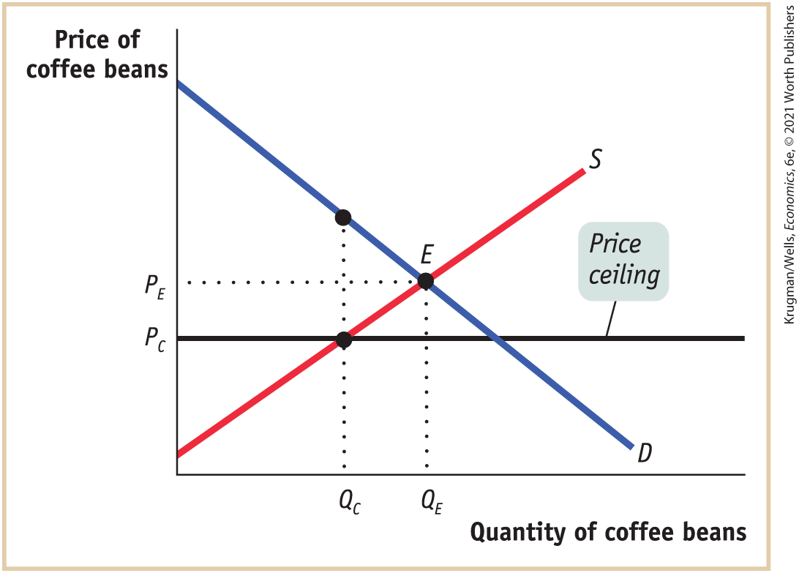
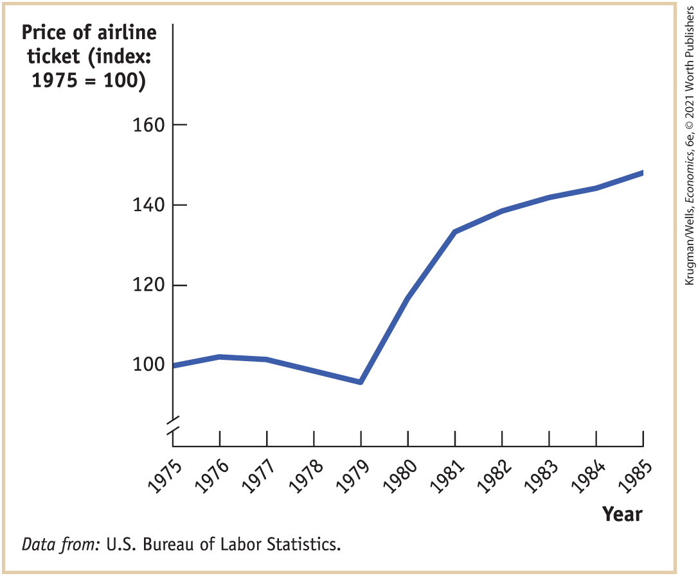

### Problems

1.  In order to appeal to voters, the mayor of Gotham City decides to lower the price of taxi rides. Assume, for simplicity, that all taxi rides are the same distance and therefore cost the same. The accompanying table shows the demand and supply schedules for taxi rides.
    |                 |                                       |                   |
    |-----------------|---------------------------------------|-------------------|
    |                 | Quantity of rides (millions per year) |                   |
    | Fare (per ride) | Quantity demanded                     | Quantity supplied |
    | \$7.00          | 10                                    | 12                |
    | 6.50            | 11                                    | 11                |
    | 6.00            | 12                                    | 10                |
    | 5.50            | 13                                    | 9                 |
    | 5.00            | 14                                    | 8                 |
    | 4.50            | 15                                    | 7                 |

    1.  Assume that there are no restrictions on the number of taxi rides that can be supplied (there is no medallion system). Find the equilibrium price and quantity.
    2.  Suppose that the mayor sets a price ceiling at \$5.50. How large is the shortage of rides? Illustrate with a diagram. Who loses and who benefits from this policy?
    3.  Suppose that the stock market crashes and, as a result, people in Gotham City are poorer. This reduces the quantity of taxi rides demanded by 6 million rides per year at any given price. What effect will the mayor’s new policy have now? Illustrate with a diagram.
    4.  Suppose that the stock market rises and the demand for taxi rides returns to normal (that is, returns to the demand schedule given in the table). The mayor now decides to ingratiate himself with taxi drivers. He announces a policy in which operating licenses are given to existing taxi drivers; the number of licenses is restricted such that only 10 million rides per year can be given. Illustrate the effect of this policy on the market, and indicate the resulting price and quantity transacted. What is the quota rent per ride?

2.  In the late eighteenth century, the price of bread in New York City was controlled, set at a predetermined price above the market price.
    1.  Draw a diagram showing the effect of the policy. Did the policy act as a price ceiling or a price floor?

    2.  What kinds of inefficiencies were likely to have arisen when the controlled price of bread was above the market price? Explain in detail.

        One year during this period, a poor wheat harvest caused a leftward shift in the supply of bread and therefore an increase in its market price. New York bakers found that the controlled price of bread in New York was below the market price.

    3.  Draw a diagram showing the effect of the price control on the market for bread during this one-year period. Did the policy act as a price ceiling or a price floor?

    4.  What kinds of inefficiencies do you think occurred during this period? Explain in detail.

3.  In 2019, the U.S. House of Representatives approved a new farm bill modifying the price supports for dairy farmers. The new program, the Dairy Margin Coverage, supports dairy farmers when the margin between feed costs and milk prices falls below \$0.08 per pound. Suppose that current feed costs are \$0.10 per pound, which means the program creates a price floor for milk at \$0.18 per pound. At that price, in 2019, the quantity of milk supplied is 240 billion pounds, and the quantity demanded is 140 billion pounds. To support the price of milk at the price floor, the U.S. Department of Agriculture (USDA) has to buy up 100 billion pounds of surplus milk. The supply and demand curves in the following diagram illustrate the market for milk.

    <figure id="pau_9781319320164_HdEj9lHb2x" class="figure lm_img_lightbox unnum c5 center">
    
    </figure>

    <aside class="hidden" id="pau_9781319320164_WPpwt0uEpv" title="hidden">

    The vertical axis labeled price of milk has tick marks at 0.05, 0.15, 0.18, and 0.25 dollars. The horizontal axis labeled quantity of milk (billions of pounds) has tick marks at 140, 200, and 240 billions of pounds. A horizontal line labeled price floor corresponds to 0.18 dollar price. The graph shows two curves labeled S (supply) and D (Demand). The supply curve has a positive slope as it passes through the points (0, 0.05), (200, 0.15), and (240, 0.18). The demand curve has a negative slope as it passes through the points (0, 025), (140, 0.18), and (200, 0.15). Both the curves intersect at (200, 0.15).

    </aside>

    1.  In the absence of a price floor, how much consumer surplus is created? How much producer surplus? What is the total surplus (producer surplus plus consumer surplus)?
    2.  With the price floor at \$0.18 per pound of milk, consumers buy 140 billion pounds of milk. How much consumer surplus is created now?
    3.  With the price floor at \$0.18 per pound of milk, producers sell 240 billion pounds of milk (some to consumers and some to the USDA). How much producer surplus is created now?
    4.  How much money does the USDA spend to buy surplus milk?
    5.  Taxes must be collected to pay for the purchases of surplus milk by the USDA. As a result, total surplus is reduced by the amount the USDA spent buying surplus milk. Using your answers from parts b, c, and d, what is the total surplus when there is a price floor? How does this total surplus compare to the total surplus without a price floor from part a?

4.  The accompanying table shows hypothetical demand and supply schedules for milk per year. The U.S. government decides that the incomes of dairy farmers should be maintained at a level that allows the traditional family dairy farm to survive. So it implements a price floor of \$1 per pint by buying surplus milk until the market price is \$1 per pint.
    |                          |                                               |                   |
    |--------------------------|-----------------------------------------------|-------------------|
    |                          | Quantity of milk (millions of pints per year) |                   |
    | Price of milk (per pint) | Quantity demanded                             | Quantity supplied |
    | \$1.20                   | 550                                           | 850               |
    | 1.10                     | 600                                           | 800               |
    | 1.00                     | 650                                           | 750               |
    | 0.90                     | 700                                           | 700               |
    | 0.80                     | 750                                           | 650               |

    1.  How much surplus milk will be produced as a result of this policy?
    2.  What will be the cost to the government of this policy?
    3.  Since milk is an important source of protein and calcium, the government decides to provide the surplus milk it purchases to elementary schools at a price of only \$0.60 per pint. Assume that schools will buy any amount of milk available at this low price. But parents now reduce their purchases of milk at any price by 50 million pints per year because they know their children are getting milk at school. How much will the dairy program now cost the government?
    4.  Explain how inefficiencies in the form of inefficient allocation to sellers and wasted resources arise from this policy.

5.  European governments tend to make greater use of price controls than does the U.S. government. For example, the French government sets minimum starting yearly wages for new hires who have completed *le bac,* a certification roughly equivalent to a high school diploma. The demand schedule for new hires with *le bac* and the supply schedule for similarly credentialed new job seekers are given in the accompanying table. The price here — given in euros, the currency used in France — is the same as the yearly wage.
    | Wage (per year) | Quantity demanded (new job offers per year) | Quantity supplied (new job seekers per year) |
    |-----------------|---------------------------------------------|----------------------------------------------|
    | €45,000         | 200,000                                     | 325,000                                      |
    | 40,000          | 220,000                                     | 320,000                                      |
    | 35,000          | 250,000                                     | 310,000                                      |
    | 30,000          | 290,000                                     | 290,000                                      |
    | 25,000          | 370,000                                     | 200,000                                      |

    1.  In the absence of government interference, what are the equilibrium wage and number of graduates hired per year? Illustrate with a diagram. Will there be anyone seeking a job at the equilibrium wage who is unable to find one — that is, will there be anyone who is involuntarily unemployed?
    2.  Suppose the French government sets a minimum yearly wage of €35,000. Is there any involuntary unemployment at this wage? If so, how much? Illustrate with a diagram. What if the minimum wage is set at €40,000? Also illustrate with a diagram.
    3.  Given your answer to part b and the information in the table, what do you think is the relationship between the level of involuntary unemployment and the level of the minimum wage? Who benefits from such a policy? Who loses? What is the missed opportunity here?

6.  In many European countries high minimum wages have led to high levels of unemployment and under-employment, and a two-tier labor system. In the formal labor market, workers have good jobs that pay at least the minimum wage. In the informal or black market for labor, workers have poor jobs and receive less than the minimum wage.
    1.  Draw a demand and supply diagram showing the effect of the imposition of a minimum wage on the overall market for labor, with wage on the vertical axis and hours of labor on the horizontal axis. Your supply curve should represent the hours of labor offered by workers according to the wage, and the demand curve should represent the hours of labor demanded by employers according to the wage. What type of shortage is created? Illustrate on your diagram the size of the shortage.
    2.  Assume that the imposition of the high minimum wage causes a contraction in the economy so that employers in the formal sector cut their production and their demand for workers. Illustrate the effect of this on the overall market for labor. What happens to the shortage? Illustrate with a diagram.
    3.  Assume that the workers who cannot get a job paying at least the minimum wage move into the informal labor market where there is no minimum wage. What happens to the size of the informal market for labor as a result of the economic contraction? What happens to the equilibrium wage in the informal labor market? Illustrate with a supply and demand diagram for the informal market.

7.  For the last 85 years the U.S. government has used price supports to provide income assistance to American farmers. To implement these price supports, at times the government has used price floors, which it maintains by buying up the surplus farm products. At other times, it has used target prices, a policy by which the government gives the farmer an amount equal to the difference between the market price and the target price for each unit sold. Consider the market for corn depicted in the accompanying diagram.

    <figure id="pau_9781319320164_sBc03V6PQQ" class="figure lm_img_lightbox unnum c5 center">
    
    </figure>

    <aside class="hidden" id="pau_9781319320164_Vyxm6sF21H" title="hidden">

    The horizontal axis is truncated and labeled quantity of corn (bushels), and ranges from 800 to 1200 bushels, in increments of 200 bushels. The vertical axis labeled price of corn (per bushel) ranges from 0 to 5 dollars, in increments of 1 dollar. The graph shows two curves labeled S (supply) and D (Demand) intersecting at E (1000, 3). The supply curve has a positive slope as it extends through the points (800, 1), (1000, 3), and (1200, 5). The demand curve has a negative slope as it passes through the points (800, 5), (1000, 3), and (1200, 1).

    </aside>

    1.  If the government sets a price floor of \$5 per bushel, how many bushels of corn are produced? How many are purchased by consumers? By the government? How much does the program cost the government? How much revenue do corn farmers receive?
    2.  Suppose the government sets a target price of \$5 per bushel for any quantity supplied up to 1,000 bushels. How many bushels of corn are purchased by consumers and at what price? By the government? How much does the program cost the government? How much revenue do corn farmers receive?
    3.  Which of these programs (in parts a and b) costs corn consumers more? Which program costs the government more? Explain.
    4.  Is one of these policies less inefficient than the other? Explain.

8.  The waters off the North Atlantic coast were once teeming with fish. But because of overfishing by the commercial fishing industry, the stocks of fish became seriously depleted. In 1991, the National Marine Fisheries Service of the U.S. government implemented a quota to allow fish stocks to recover. In 2016 the quota limited the amount of swordfish caught per year by all U.S.-licensed fishing boats to 7 million pounds. As soon as the U.S. fishing fleet had met the quota limit, the swordfish catch was closed down for the rest of the year. The accompanying table gives the hypothetical demand and supply schedules for swordfish caught in the United States per year.
    |                                |                                                     |                   |
    |--------------------------------|-----------------------------------------------------|-------------------|
    |                                | Quantity of swordfish (millions of pounds per year) |                   |
    | Price of swordfish (per pound) | Quantity demanded                                   | Quantity supplied |
    | \$20                           | 6                                                   | 15                |
    | 18                             | 7                                                   | 13                |
    | 16                             | 8                                                   | 11                |
    | 14                             | 9                                                   | 9                 |
    | 12                             | 10                                                  | 7                 |

    1.  Use a diagram to show the effect of the quota on the market for swordfish in 1991.
    2.  How do you think fishermen will change how they fish in response to this policy?

9.  In Maine, you must have a license to harvest lobster commercially; these licenses are issued yearly. The state of Maine is concerned about the dwindling supplies of lobsters found off its coast. The state fishery department has decided to place a yearly quota of 80,000 pounds of lobsters harvested in all Maine waters. It has also decided to give licenses this year only to those fishermen who had licenses last year. The accompanying diagram shows the demand and supply curves for Maine lobsters.

    <figure id="pau_9781319320164_eQkdUQVMof" class="figure lm_img_lightbox unnum c5 center">
    
    </figure>

    <aside class="hidden" id="pau_9781319320164_Gj2E5Wx1Af" title="hidden">

    The horizontal axis labeled quantity of lobsters (thousands of pounds) ranges from 0 to 140, in increments of 20. The vertical axis is truncated and labeled price of lobster (per pound), and ranges from 4 to 22, in increments of 2. The graph shows two curves labeled S (supply) and D (Demand) intersecting at a point E. The supply curve has a positive slope as it extends through the points (0, 4), (20, 5), (40, 6), (60, 7), (80, 8), (100, 9), (120, 10), and (140, 11). The demand curve has a negative slope as it passes through the points (0, 22), (20, 20), (40, 18), (60, 16), (80, 14), (100, 12), (120, 10), and (140, 8). Both the curves intersect at (1000, 3) labeled E.

    </aside>

    1.  In the absence of government restrictions, what are the equilibrium price and quantity?
    2.  What is the *demand price* at which consumers wish to purchase 80,000 pounds of lobsters?
    3.  What is the *supply price* at which suppliers are willing to supply 80,000 pounds of lobsters?
    4.  What is the *quota rent* per pound of lobster when 80,000 pounds are sold?
    5.  Explain a transaction that benefits both buyer and seller but is prevented by the quota restriction.

10. The Venezuelan government has imposed a price ceiling on the retail price of roasted coffee beans. The accompanying diagram shows the market for coffee beans. In the absence of price controls, the equilibrium is at point *E,* with an equilibrium price of *PE* and an equilibrium quantity bought and sold of *QE*.

    <figure id="pau_9781319320164_08wjroB8RZ" class="figure lm_img_lightbox unnum c5 center">
    
    </figure>

    <aside class="hidden" id="pau_9781319320164_zGU5mlCu4v" title="hidden">

    The vertical axis labeled price of coffee beans has a tick mark at P subscript C and P subscript E, in that order from bottom to top. A horizontal line labeled price ceiling corresponds to P subscript C price. The horizontal axis labeled quantity of coffee beans has a tick mark at Q subscript C and Q subscript E, in that order from left to right. The graph shows two curves labeled S (supply) and D (Demand) intersecting at point E (Q subscript E, P subscript E). The supply curve and price ceiling line meet a (Q subscript C, P subscript C). A point along the demand curve corresponding to Q subscript C lies above point E.

    </aside>

    1.  Show the consumer and producer surplus before the introduction of the price ceiling.

        After the introduction of the price ceiling, the price falls to *PC* and the quantity bought and sold falls to *Q**C*.

    2.  Show the consumer surplus after the introduction of the price ceiling (assuming that the consumers with the highest willingness to pay get to buy the available coffee beans; that is, assuming that there is no inefficient allocation to consumers).

    3.  Show the producer surplus after the introduction of the price ceiling (assuming that the producers with the lowest cost get to sell their coffee beans; that is, assuming that there is no inefficient allocation of sales among producers).

    4.  Using the diagram, show how much of what was producer surplus before the introduction of the price ceiling has been transferred to consumers as a result of the price ceiling.

11. The accompanying diagram shows data from the U.S. Bureau of Labor Statistics on the average price of an airline ticket in the United States from 1975 until 1985, adjusted to eliminate the effect of *inflation* (the general increase in the prices of all goods over time). In 1978, the U.S. Airline Deregulation Act removed the price floor on airline fares, and it also allowed the airlines greater flexibility to offer new routes.

    <figure id="pau_9781319320164_cGC6HAJEsD" class="figure lm_img_lightbox unnum c5 center">
    
    </figure>

    <aside class="hidden" id="pau_9781319320164_bkFL7KxJIo" title="hidden">

    The vertical axis is truncated and labeled price of airline ticket (index: 1975 equals 100), and ranges from 100 to 160, in increments of 20. The vertical axis labeled years ranges from 1975 to 1985, in increments of 1 year. The graph plots a curve that begins at 100 in 1975, rises to about 101 in 1976, declines slowly to about 98 in 1979, rises sharply to about 139 in 1981, and then rises slowly to about 156 in 1985.

    </aside>

    1.  Looking at the data on airline ticket prices in the diagram, do you think the price floor that existed before 1978 was binding or nonbinding? That is, do you think it was set above or below the equilibrium price? Draw a supply and demand diagram, showing where the price floor that existed before 1978 was in relation to the equilibrium price.
    2.  Most economists agree that the average airline ticket price per mile traveled actually *fell* as a result of the Airline Deregulation Act. How might you reconcile that view with what you see in the diagram?

12. Many college students attempt to land internships before graduation to burnish their resumes, gain experience in a chosen field, or try out possible careers. The hope shared by all of these prospective interns is that they will find internships that pay more than typical summer jobs, such as waiting tables or flipping burgers.
    1.  With wage measured on the vertical axis and number of hours of work on the horizontal axis, draw a supply and demand diagram for the market for interns in which the minimum wage is nonbinding at the market equilibrium.
    2.  Assume that a market downturn reduces the demand for interns by employers. However, many students are willing and eager to work in unpaid internships. As a result, the new market equilibrium wage is equal to zero. Draw another supply and demand diagram to illustrate this new market equilibrium.

 **Work It Out**

13. Suppose it is decided that rent control in New York City will be abolished and that market rents will now prevail. Assume that all rental units are identical and so are offered at the same rent. To address the plight of residents who may be unable to pay the market rent, an income supplement will be paid to all low-income households equal to the difference between the old controlled rent and the new market rent.
    1.  Use a diagram to show the effect on the rental market of the elimination of rent control. What will happen to the quality and quantity of rental housing supplied?
    2.  Use a second diagram to show the additional effect of the income-supplement policy on the market. What effect does it have on the market rent and quantity of rental housing supplied in comparison to your answers to part a?
    3.  Are tenants better or worse off as a result of these policies? Are landlords better or worse off? Is society as a whole better or worse off?
    4.  From a political standpoint, why do you think cities have been more likely to resort to rent control rather than a policy of income supplements to help low-income people pay for housing? 
