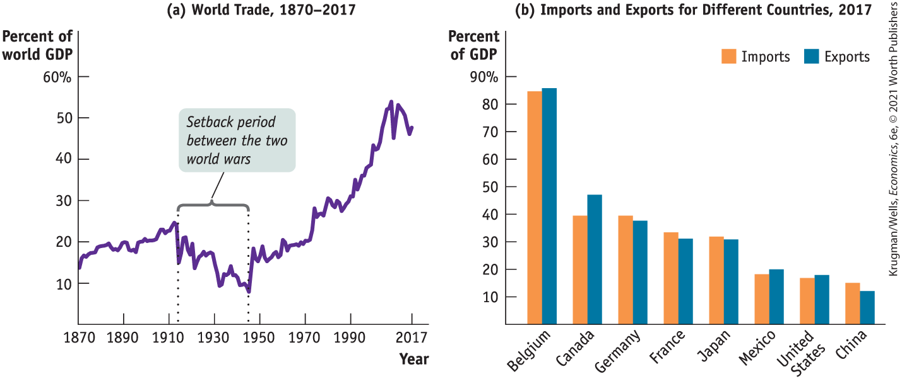
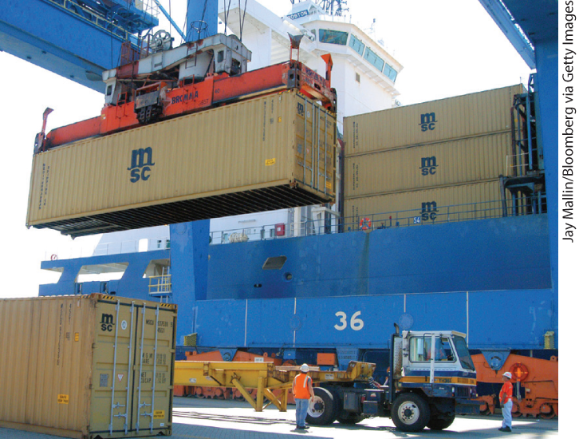
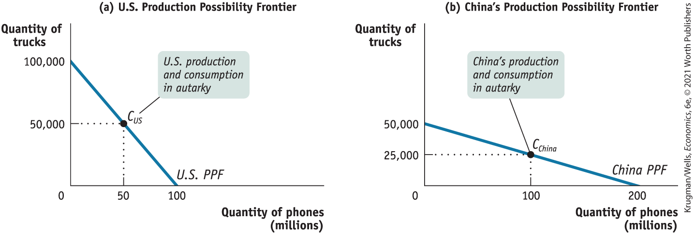
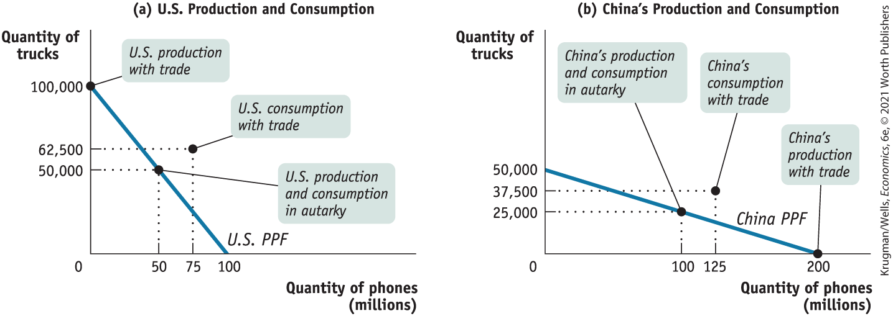
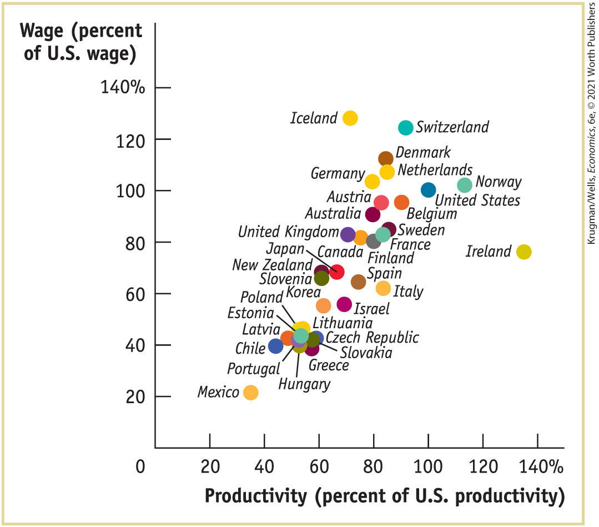

# Chapter 5 International Trade

## The Everywhere Phone

**WHAT DO AMERICANS DO** with their time? The answer is that they largely spend it staring at small screens. In 2018, the average American spent three hours and 43 minutes a day looking at a smartphone (especially an iPhone) or a tablet, slightly more time than they spent watching TV.

<figure id="pau_9781319320164_6Hmx8GFn9N" class="figure lm_img_lightbox unnum c2 right">

<figcaption>
<strong>The production and consumption of smartphones are examples of today’s hyperglobal world with its soaring levels of international trade.</strong>
</figcaption>
</figure>

Where do these small screens come from? Specifically, where does an iPhone come from?

Apple, which sells the iPhone, is an American company. But if you said that iPhones come from America, you’re mostly wrong: Apple develops products, but contracts almost all of the manufacturing of those products to other companies that are mainly located overseas. But it’s not really right to answer “China,” either, even though that’s where iPhones are assembled. Assembly is the last phase of iPhone production, in which the pieces are put together in the familiar metal-and-glass case.

In fact, a study of the iPhone X estimated that of the average wholesale price of about \$800 per phone, less than \$25 stayed in the Chinese economy. A substantially larger amount went to South Korean manufacturers, who supplied the display and memory chips. There were also substantial outlays for raw materials, which are sourced all over the world. And the biggest share of the price — more than half — consisted of Apple’s profit margin, which was largely a reward for research, development, and design.

So where do iPhones come from? Lots of places. And the case of the iPhone isn’t unusual: the car you drive, the clothing you wear, even the food you eat are generally the end products of complex supply chains that span the globe. Large-scale international trade like this isn’t new. It was fairly common by the early twentieth century. In recent decades, however, new technologies for transportation and communication have interacted with pro-trade policies to produce an era of *hyperglobalization* in which international trade has soared thanks to complex chains of production like the one that puts an iPhone in front of your nose.

These global supply chains make the world economy much more productive and, as a result, richer than it would be if each country tried to be self-sufficient. And it isn’t just the world as a whole that benefits from international trade: it’s almost certain that every country benefits, too. But international trade is nonetheless controversial, because it sometimes hurts particular groups *within* countries. For these reasons, we must have a full picture of international trade to understand how national economies work.

This chapter examines the economics of international trade. We start from the model of comparative advantage, which, as we saw in <a href="#kru_9781319245269_ch02_01.xhtml#pau_9781319320164_uuuTxO7RlK" id="kru_9781319245269_ch05_01.xhtml#pau_9781319320164_NI0J5VA8Ju" class="crossref">Chapter 2</a>, explains why there are gains from international trade. We will briefly recap that model here, then turn to a more detailed examination of the causes and consequences of globalization. 

<aside class="learning-objectives c3 main-flow v3" epub:type="learning-objectives" id="pau_9781319320164_fVnUD6z6Fv">

### What you will learn

- What is comparative advantage and why does it lead to international trade?
- What are the sources of comparative advantage?
- Who gains and who loses from international trade?
- Why do **trade protections** like **tariffs** and **import quotas** create inefficiency?
- Why do governments engage in trade protection and how do **international trade agreements** counteract this?

</aside>

## Comparative Advantage and International Trade

The United States buys smartphones — and many other goods and services — from other countries. At the same time, it sells many goods and services to other countries. Goods and services purchased from abroad are <a href="#kru_9781319245269_EM_glossary.xhtml#pau_9781319320164_iZC4MyAy89" id="kru_9781319245269_ch05_02.xhtml#pau_9781319320164_vZd7zBW6Bo" class="glossref" role="doc-glossref">imports</a>**;** goods and services sold abroad are <a href="#kru_9781319245269_EM_glossary.xhtml#pau_9781319320164_hKu1CQdUZ6" id="kru_9781319245269_ch05_02.xhtml#pau_9781319320164_F7h732nzXI" class="glossref" role="doc-glossref">exports</a>.

<aside aria-label="title 1" class="glossary c3 main-flow v1" epub:type="glossary" id="pau_9781319320164_ktmjsXguWg">

**imports, exports**  
Goods and services purchased from other countries are **imports;** goods and services sold to other countries are **exports.**

</aside>

As illustrated by the opening story, international trade plays an increasingly important role in the world economy. Panel (a) of <a href="#kru_9781319245269_ch05_02.xhtml#pau_9781319320164_80lNDuQyvP" id="kru_9781319245269_ch05_02.xhtml#pau_9781319320164_lR9rj7cZFe" class="crossref">Figure 5-1</a> shows the ratio of goods crossing national borders to *world GDP —* the total value of goods and services produced in the world as a whole — since 1870. As you can see, the long-term trend has been upward, although there have been some periods of declining trade — for example, the sharp but brief dip in trade during the global financial crisis of 2008 and its aftermath.

<figure id="pau_9781319320164_80lNDuQyvP" class="figure lm_img_lightbox num c4 center">

<figcaption>
FIGURE 5-1 The Growing Importance of International Trade

Panel (a) shows the long-term history of the ratio of world trade to world production. The trend has been generally upward, thanks to technological progress in transportation and communication, although there was a long setback during the period between the two world wars. Panel (b) demonstrates that international trade is significantly more important to many other countries than it is to the United States.

<em>Data from:</em> [panel (a)] Klasing, M. J., and P. Milionis, “Quantifying the Evolution of World Trade, 1870–1949,” <em>Journal of International Economics</em> (2013); and Feenstra, Robert C., Robert Inklaar, and Marcel P. Timmer, “The Next Generation of the Penn World Table” <em>American Economic Review</em> 105, no. 10 (2015): 3150–3182, available for download at <a href="http://www.ggdc.net/pwt" id="kru_9781319245269_ch05_02.xhtml#pau_9781319320164_LdPKqYWbgs" class="external">www.ggdc.net/pwt</a>; [panel (b)] World Development Indicators.
</figcaption>
</figure>

<aside class="hidden" id="pau_9781319320164_fL1MyAc9AZ" title="hidden">

A line graph on the left is titled “World Trade, 1870 to 2017.” The vertical axis represents “Percent of world G D P,” ranging from 0 to 60 percent, in increments of 10. The horizontal axis represents “Year,” ranging from 1870 to 1990, in increments of 20, and marks the year 2017. The trend begins from slightly below 20, which increases except between 1910 and 1950, marked with dotted lines and labeled “Setback period between the two world wars.” A double-bar graph is titled “Imports and exports for different countries, 2017.” The vertical axis represents “Percent of GDP” ranging from 0 to 90 in increments of 10, while the horizontal axis marks Belgium, Canada, Germany, France, Japan, Mexico, the United States, and China (left to right). The orange bars represent “imports” and blue bars represent “exports.” The trend is decreasing from left to right. The approximate data from the graph are as follows. Belgium: Imports: 85 percent, Export: 86 percent; Canada: Imports: 39 percent, Export: 48 percent; Germany: Imports: 39 percent, Export: 37 percent; France: Imports: 35 percent, Export: 34 percent; Japan: Imports: 33 percent, Export: 32 percent; Mexico: Imports: 19 percent, Export: 20 percent; and the United States: Imports: 18 percent, Export: 19 percent; and China: Imports: 85 percent, Export: 86 percent.

</aside>

Panel (b) illustrates imports and exports as a percentage of GDP for a number of countries. It shows that foreign trade is significantly more important for many other countries than it is for the United States.

Foreign trade isn’t the only way countries interact economically. In the modern world, investors from one country often invest funds in another nation; many companies are multinational, with subsidiaries operating in several countries; and a growing number of people work in a country different from the one in which they were born. The growth of all these forms of economic linkages among countries is often called <a href="#kru_9781319245269_EM_glossary.xhtml#pau_9781319320164_TageZ2vEY6" id="kru_9781319245269_ch05_02.xhtml#pau_9781319320164_RMntG3jhMY" class="glossref" role="doc-glossref">globalization</a>.

<aside aria-label="title 2" class="glossary c3 main-flow v1" epub:type="glossary" id="pau_9781319320164_ORUkM31jdA">

**globalization**  
**Globalization** is the phenomenon of growing economic linkages among countries.

</aside>

Globalization isn’t a new phenomenon. As you can see from panel (a) of <a href="#kru_9781319245269_ch05_02.xhtml#pau_9781319320164_80lNDuQyvP" id="kru_9781319245269_ch05_02.xhtml#pau_9781319320164_NYkHit9x3K" class="crossref">Figure 5-1</a>, there was rapid growth in trade between 1870 and the beginning of World War I, as railroads and steamships effectively made shipping goods long distances faster and cheaper, effectively shrinking the world. This growth of trade was accompanied by large-scale international investment and migration. However, globalization went into reverse for almost 40 years after World War I, as governments imposed limits on trade. And by several measures, globalization didn’t return to 1913 levels until the 1980s.

Since then, however, there has been a further dramatic increase in international linkages, sometimes referred to as <a href="#kru_9781319245269_EM_glossary.xhtml#pau_9781319320164_464KYdbVmp" id="kru_9781319245269_ch05_02.xhtml#pau_9781319320164_rVfhz7NsBa" class="glossref" role="doc-glossref">hyperglobalization</a>. The manufacture of iPhones and other high-tech goods, which often involve supply chains of production that span the globe, are an example of hyperglobalization. Each stage of a good’s production takes place in a different country — all made possible by advances in communication and transportation technology. (For a real-life example, see this chapter’s <a href="#kru_9781319245269_ch05_06.xhtml#pau_9781319320164_Mcicd1BhoC" id="kru_9781319245269_ch05_02.xhtml#pau_9781319320164_Mcicd1BhoA" class="crossref">business case</a>.)

<aside aria-label="title 3" class="glossary c3 main-flow v1" epub:type="glossary" id="pau_9781319320164_wpa9UjjEsg">

**hyperglobalization**  
**Hyperglobalization** is the phenomenon of extremely high levels of international trade.

</aside>

<figure id="pau_9781319320164_UKRkWi1np0" class="figure lm_img_lightbox unnum c2 right">

<figcaption>
Thanks to cheap and fast ways of transporting goods, extremely high levels of international trade are a feature of today’s economy.
</figcaption>
</figure>

One big question in international economics is whether hyperglobalization will continue in the decades ahead. As you can see from looking closely at <a href="#kru_9781319245269_ch05_02.xhtml#pau_9781319320164_80lNDuQyvP" id="kru_9781319245269_ch05_02.xhtml#pau_9781319320164_i9icHBbtBF" class="crossref">Figure 5-1</a>, the big rise in the ratio of exports to world GDP leveled off around 2005. Since then, many reports have appeared about companies deciding that the money they saved by buying goods from suppliers thousands of miles away is more than offset by the disadvantages of long shipping times and other inconveniences. (Even now, it takes around two weeks for a container ship from China to arrive in California, and a month to reach the East Coast.) As a result, there has been some move toward *reshoring,* bringing production closer to markets.

More recently, international disputes over trade have heated up, and governments may once again impose the kind of restrictions on trade that caused globalization to decline after World War I. Although international trade is likely to remain important to world economies, it is possible that hyperglobalization may become less prevalent than it is today.

To understand why international trade occurs and why economists believe it is beneficial to the economy, we will first review the concept of comparative advantage.

### Production Possibilities and Comparative Advantage, Revisited

To produce phones, any country must use resources — land, labor, and capital — that could have been used to produce other things. The opportunity cost of that phone is the potential production of other goods a country must forgo to produce it.

In some cases, it’s easy to see why the opportunity cost of producing a good is especially low in a given country. Consider, for example, shrimp — much of which now comes from seafood farms in Vietnam and Thailand. It’s a lot easier to produce shrimp in Vietnam, where the climate is nearly ideal and there’s plenty of coastal land suitable for shellfish farming, than it is in the United States.

Conversely, other goods are not produced as easily in Vietnam as in the United States. For example, Vietnam doesn’t have the base of skilled workers and technological know-how that makes the United States so good at producing high-technology goods. So the opportunity cost of a ton of shrimp, in terms of other goods such as aircraft, is much less in Vietnam than it is in the United States.

In other cases, the trade-off is less obvious. For example, it is as easy to assemble smartphones in the United States as in China. And Chinese electronics workers are, if anything, less productive than their U.S. counterparts. But Chinese workers are even less productive than U.S. workers in other areas, such as automobile and chemical production. So we say that China has a comparative advantage in producing smartphones. Let’s repeat the definition of comparative advantage from <a href="#kru_9781319245269_ch02_01.xhtml#pau_9781319320164_uuuTxO7RlK" id="kru_9781319245269_ch05_02.xhtml#pau_9781319320164_dULn9MRKrx" class="crossref">Chapter 2</a>: *A country has a comparative advantage in producing a good or service if the opportunity cost of producing the good or service is lower for that country than for other countries.*

Employing a Chinese worker to assemble phones is more productive than employing a U.S. worker to assemble phones because the U.S. worker can be even more productively employed elsewhere. That is, the opportunity cost of smartphone assembly in China is less than it is in the United States.

Notice that we said the opportunity cost of phone *assembly.* As we’ve seen, most of the value of a “Chinese made” phone actually comes from other countries. For the sake of exposition, however, let’s ignore that complication and consider a hypothetical case in which China makes phones from scratch.

<a href="#kru_9781319245269_ch05_02.xhtml#pau_9781319320164_fE6ZD3dfqw" id="kru_9781319245269_ch05_02.xhtml#pau_9781319320164_w13c4pqbjV" class="crossref">Figure 5-2</a> provides a hypothetical numerical example of comparative advantage in international trade. We assume that only two goods are produced and consumed, phones and Caterpillar heavy trucks. (The United States doesn’t export many ordinary trucks, but Caterpillar, which makes earth-moving equipment, is a major exporter.) And we assume that there are only two countries in the world, the United States and China. The figure shows hypothetical production possibility frontiers for the United States and China.

<figure id="pau_9781319320164_fE6ZD3dfqw" class="figure lm_img_lightbox num c4 center">

<figcaption>
FIGURE 5-2 Comparative Advantage and the Production Possibility Frontier

The U.S. opportunity cost of 1 million phones in terms of trucks is 1,000: for every 1 million phones, 1,000 trucks must be forgone. The Chinese opportunity cost of 1 million phones in terms of trucks is 250: for every additional 1 million phones, only 250 trucks must be forgone. As a result, the United States has a comparative advantage in truck production, and China has a comparative advantage in phone production. In autarky, each country is forced to consume only what it produces: 50,000 trucks and 50 million phones for the United States; 25,000 trucks and 100 million phones for China.
</figcaption>
</figure>

<aside class="hidden" id="pau_9781319320164_DBT1TCdHEj" title="hidden">

In graph (a), the vertical axis represents Quantity of trucks and ranges from 0 to 100,000 in increments of 50,000. The horizontal axis represents Quantity of phones (millions) and ranges from 0 to 100 in increments of 50. The data from the graph are as follows. Panel (a) shows a negative sloping line labeled “U. S. P P F" that runs from 100,000 trucks on the vertical axis to 100 million phones on the horizontal axis. The point C U S represents 50 million phones and 50,000 trucks. It is labeled “U. S. production and consumption in autarky." In graph (b), the vertical axis represents Quantity of trucks and ranges from 0 to 50,000 in increments of 25,000. The horizontal axis represents Quantity of phones (millions) and ranges from 0 to 200 in increments of 100. The data from the graph are as follows. Panel (b) shows a negative sloping line labeled “China P P n F" that runs from 50,000 trucks on the vertical axis to 200 million phones on the horizontal axis. The point C China represents 100 million phones and 25,000 trucks. It is labeled “China's production and consumption in autarky."

</aside>

As in <a href="#kru_9781319245269_ch02_01.xhtml#pau_9781319320164_uuuTxO7RlK" id="kru_9781319245269_ch05_02.xhtml#pau_9781319320164_l60FohwhP9" class="crossref">Chapter 2</a>, we simplify the model by assuming that the production possibility frontiers are straight lines, as shown in <a href="#kru_9781319245269_ch02_02.xhtml#pau_9781319320164_bS823lxuHv" id="kru_9781319245269_ch05_02.xhtml#pau_9781319320164_ioDknTKFBe" class="crossref">Figure 2-1</a>, rather than the more realistic bowed-out shape in <a href="#kru_9781319245269_ch02_02.xhtml#pau_9781319320164_moYRS2zebm" id="kru_9781319245269_ch05_02.xhtml#pau_9781319320164_ZzmDlBlNLl" class="crossref">Figure 2-2</a>. The straight-line shape implies that the opportunity cost of a phone in terms of trucks in each country is constant — it does not depend on how many units of each good the country produces. The analysis of international trade under the assumption that opportunity costs are constant, which makes production possibility frontiers straight lines, is known as the <a href="#kru_9781319245269_EM_glossary.xhtml#pau_9781319320164_WIHoET7Nsc" id="kru_9781319245269_ch05_02.xhtml#pau_9781319320164_HI78o2y5Sw" class="glossref" role="doc-glossref">Ricardian model of international trade</a>, named after the English economist David Ricardo, who introduced this analysis in the early nineteenth century.

<aside aria-label="title 4" class="glossary c3 main-flow v1" epub:type="glossary" id="pau_9781319320164_WoQR2ljXTm">

**Ricardian model of international trade**  
The **Ricardian model of international trade** analyzes international trade under the assumption that opportunity costs are constant.

</aside>

In <a href="#kru_9781319245269_ch05_02.xhtml#pau_9781319320164_fE6ZD3dfqw" id="kru_9781319245269_ch05_02.xhtml#pau_9781319320164_dYIo4w8l6C" class="crossref">Figure 5-2</a> we show a situation in which the United States can produce 100,000 trucks if it produces no phones, or 100 million phones if it produces no trucks. Thus, the slope of the U.S. production possibility frontier, or *PPF,* is $- 10,000/100\,\operatorname{=~-1,000.}$ That is, to produce an additional million phones, the United States must forgo the production of 1,000 trucks. Likewise, to produce one more truck, the United States must forgo 1,000 phones (equal to 1 million phones divided by 1,000 trucks).

Similarly, China can produce 50,000 trucks if it produces no phones or 200 million phones if it produces no trucks. Thus, the slope of China’s *PPF* is $- 5,000/200\operatorname{=~-250.}$ That is, to produce an additional million phones, China must forgo the production of 250 trucks. Likewise, to produce one more truck, China must forgo 4,000 phones (1 million phones divided by 250 trucks).

Historically, countries have almost always traded with each other. Yet economists find it helpful as a first step to illustrate the choices a country would make if it were unable to engage in international trade. Economists use the term <a href="#kru_9781319245269_EM_glossary.xhtml#pau_9781319320164_Q5vWF4E6Os" id="kru_9781319245269_ch05_02.xhtml#pau_9781319320164_30ZGRs0gDQ" class="glossref" role="doc-glossref">autarky</a> to refer to a situation in which a country does not trade with other countries. In our example, we assume that in autarky the United States chooses to produce and consume 50 million phones and 50,000 trucks. We also assume that in autarky China produces 100 million phones and 25,000 trucks.

<aside aria-label="title 5" class="glossary c3 main-flow v1" epub:type="glossary" id="pau_9781319320164_3MdFqgM0OQ">

**autarky**  
**Autarky** is a situation in which a country does not trade with other countries.

</aside>

The trade-offs facing the two countries when they don’t trade are summarized in <a href="#kru_9781319245269_ch05_02.xhtml#pau_9781319320164_r5GB1tlYkZ" id="kru_9781319245269_ch05_02.xhtml#pau_9781319320164_gVYYEc50I8" class="crossref">Table 5-1</a>. As you can see, the United States has a comparative advantage in the production of trucks because it has a lower opportunity cost in terms of phones than China has: producing a truck costs the United States only 1,000 phones, while it costs China 4,000 phones. Correspondingly, China has a comparative advantage in phone production: 1 million phones costs only 250 trucks, while it costs the United States 1,000 trucks.

|                      |                       |     |                          |
|----------------------|-----------------------|-----|--------------------------|
|                      | U.S. Opportunity Cost |     | Chinese Opportunity Cost |
| **1 million phones** | 1,000 trucks          | \>  | 250 trucks               |
| **1 truck**          | 1,000 phones          | \<  | 4,000 phones             |

TABLE 5-1 U.S. and Chinese Opportunity Costs of Phones and Trucks

As we learned in <a href="#kru_9781319245269_ch02_01.xhtml#pau_9781319320164_uuuTxO7RlK" id="kru_9781319245269_ch05_02.xhtml#pau_9781319320164_a4q0ReeHNH" class="crossref">Chapter 2</a>, each country can do better by engaging in trade than it could by not trading. A country can accomplish this by specializing in the production of the good in which it has a comparative advantage and exporting that good, while importing the good in which it has a comparative disadvantage.

Let’s see how this works.

### The Gains from International Trade

<a href="#kru_9781319245269_ch05_02.xhtml#pau_9781319320164_FiLVVSJw9Q" id="kru_9781319245269_ch05_02.xhtml#pau_9781319320164_da9FyLhobm" class="crossref">Figure 5-3</a> illustrates how both countries can gain from specialization and trade, by showing a hypothetical rearrangement of production and consumption that allows *each* country to consume more of *both* goods. Again, panel (a) represents the United States and panel (b) represents China. In each panel we indicate again the autarky production and consumption assumed in <a href="#kru_9781319245269_ch05_02.xhtml#pau_9781319320164_fE6ZD3dfqw" id="kru_9781319245269_ch05_02.xhtml#pau_9781319320164_vcUyG4CDGb" class="crossref">Figure 5-2</a>.

<figure id="pau_9781319320164_FiLVVSJw9Q" class="figure lm_img_lightbox num c4 center">

<figcaption>
FIGURE 5-3 The Gains from International Trade

Trade increases world production of both goods, allowing both countries to consume more. Here, each country specializes its production as a result of trade: the United States concentrates on producing trucks, and China concentrates on producing phones. Total world production of both goods rises, which means that it is possible for both countries to consume more of both goods.
</figcaption>
</figure>

<aside class="hidden" id="pau_9781319320164_TsESf3WZF9" title="hidden">

In graph (a), the vertical axis represents Quantity of trucks and shows following markings: 0, 50,000, 62,500, and 100,000. The horizontal axis represents Quantity of phones in millions and ranges from 0 to 100 in increments of 25. The data from the graph are as follows. In panel (a), the point at 50 million phones and 50,000 trucks is labeled “U. S. production and consumption in autarky” and the point on the vertical axis for 100,000 trucks is labeled “U. S. production with trade." A third point, for 75 million phones and 62,500 trucks is labeled “U. S. consumption with trade." In graph (b), the vertical axis represents Quantity of trucks and shows following markings: 0, 25,000, 37,500, and 50,000. The horizontal axis represents Quantity of phones in millions shows the following markings: 0, 100, 125, and 200. The data from the graph are as follows. In panel (b), the point at 100 million phones and 25,000 trucks is labeled “China's production and consumption in autarky” and the point on the horizontal axis for 200 million phones is labeled “China's production with trade." A third point, for 125 million phones and 37,500 trucks is labeled “China's consumption with trade."

</aside>

Once trade becomes possible, however, everything changes. With trade, each country can move to producing only the good in which it has a comparative advantage — trucks for the United States and phones for China. Because the world production of both goods is now higher than in autarky, trade makes it possible for each country to consume more of both goods.

<a href="#kru_9781319245269_ch05_02.xhtml#pau_9781319320164_Gjlp7uFsxp" id="kru_9781319245269_ch05_02.xhtml#pau_9781319320164_muQqc0vBhu" class="crossref">Table 5-2</a> sums up the changes as a result of trade and shows why both countries can gain. The left part of the table shows the autarky situation, before trade, in which each country must produce the goods it consumes. The right part of the table shows what happens as a result of trade. After trade, the United States specializes in the production of trucks, producing 100,000 trucks and no phones; China specializes in the production of phones, producing 200 million phones and no trucks.

|                   |                    |            |             |            |             |                                                                                                                                           |
|-------------------|--------------------|------------|-------------|------------|-------------|-------------------------------------------------------------------------------------------------------------------------------------------|
|                   |                    | In Autarky |             | With Trade |             |                                                                                                                                           |
|                   |                    | Production | Consumption | Production | Consumption | Gains from trade                                                                                                                          |
| **United States** | **Million phones** | 50         | 50          | 0          | 75          | $\operatorname{+25}$     |
|                   | **Trucks**         | 50,000     | 50,000      | 100,000    | 62,500      | $\operatorname{+12,500}$ |
| **China**         | **Million phones** | 100        | 100         | 200        | 125         | $\operatorname{+25}$     |
|                   | **Trucks**         | 25,000     | 25,000      | 0          | 37,500      | $\operatorname{+12,500}$ |

TABLE 5-2 How the United States and China Gain from Trade

The result is a rise in total world production of both goods. As you can see in the table, there are gains from trade to both countries:

- The United States can consume both more trucks (12,500 more) and phones (25 million more) than before, even though it no longer produces phones, because it can import phones from China.
- China can also consume more of both goods (12,500 more trucks and 25 million more phones), even though it no longer produces trucks, because it can import trucks from the United States.

The key to this mutual gain is the fact that trade liberates both countries from self-sufficiency — from the need to produce the same mixes of goods they consume. Because each country can concentrate on producing the good in which it has a comparative advantage, total world production rises, making a higher standard of living possible in both nations.

In this example we have simply assumed the post-trade consumption bundles of the two countries. In fact, the consumption choices of a country reflect both the preferences of its residents and the *relative prices* — the prices of one good in terms of another in international markets. Although we have not explicitly given the price of trucks in terms of phones, that price is implicit in our example: China sells the United States the 75 million phones the United States consumes in return for the 37,500 trucks China consumes, so 1 million phones are traded for 500 trucks. This tells us that the price of a truck on world markets must be equal to the price of 2,000 phones.

One requirement that the relative price must satisfy is that no country pays a relative price greater than its opportunity cost of obtaining the good in autarky. That is, the United States won’t pay more than 1,000 trucks for 1 million phones from China, and China won’t pay more than 4,000 phones for each truck from the United States. Once this requirement is satisfied, the actual relative price in international trade is determined by supply and demand — and we’ll turn to supply and demand in international trade in the next section. However, first let’s look more deeply into the nature of the gains from trade.

### Comparative Advantage versus Absolute Advantage

It’s easy to accept the idea that Vietnam and Thailand have a comparative advantage in shrimp production: they have a tropical climate that’s better suited to shrimp farming than the climate of the United States, and they have a lot of usable coastal area. So the United States imports shrimp from Vietnam and Thailand. But as we have seen in the case of cell phone assembly, the gains from trade often depend on *comparative advantage,* rather than on absolute advantage. It would take less labor to assemble a phone in the United States than in China. That is, the productivity of Chinese electronics workers is less than that of their U.S. counterparts. But what determines comparative advantage is not the amount of resources used to produce a good but the opportunity cost of that good — in this case, the quantity of other goods forgone in order to produce a phone. And the opportunity cost of phones is lower in China than in the United States.

<figure id="pau_9781319320164_BihkxNJzNp" class="figure lm_img_lightbox unnum c2 right">

<figcaption>
The tropical climates of Vietnam and Thailand give them a comparative advantage in shrimp production.
</figcaption>
</figure>

Here’s how it works: Chinese workers have low productivity compared with U.S. workers in the electronics industry. But Chinese workers have even lower productivity compared with U.S. workers in other industries. Because Chinese labor productivity in industries other than electronics is relatively very low, producing a phone in China, even though it takes a lot of labor, does not require forgoing the production of large quantities of other goods.

In the United States, the opposite is true: very high productivity in other industries (such as automobiles) means that assembling electronic products in the United States, even though it doesn’t require much labor, requires sacrificing lots of other goods. So the opportunity cost of producing electronics is less in China than in the United States. Despite its lower labor productivity, China has a comparative advantage in the production of many consumer electronics, although the United States has an absolute advantage.

The source of China’s comparative advantage in consumer electronics is reflected in global markets by the wages Chinese workers are paid. That’s because a country’s wage rates, in general, reflect its labor productivity. In countries where labor is highly productive in many industries, employers are willing to pay high wages to attract workers, so competition among employers leads to an overall high wage rate. In countries where labor is less productive, competition for workers is less intense and wage rates are correspondingly lower.

As the Global Comparison shows, there is indeed a strong relationship between overall levels of productivity and wage rates around the world. Because China has generally low productivity, it has a relatively low wage rate. Low wages, in turn, give China a cost advantage in producing goods where its productivity is only moderately low, like consumer electronics. As a result, it’s cheaper to produce these goods in China than in the United States.

### Popular Misconceptions Arising from Misunderstanding Comparative Advantage

The kind of trade that takes place between low-wage, low-productivity economies like China and high-wage, high-productivity economies like the United States gives rise to two common misperceptions:

- The *pauper labor fallacy* is the belief that when a country with high wages imports goods produced by workers who are paid low wages, it must hurt the standard of living of workers in the importing country.
- The *sweatshop labor fallacy* is the belief that trade must be bad for workers in poor exporting countries because those workers are paid very low wages by our standards.

Both fallacies miss the nature of gains from trade: it’s to the advantage of both countries if the poorer, lower-wage country exports goods in which it has a comparative advantage, even if its cost advantage in these goods depends on low wages. That is, both countries are able to achieve a higher standard of living through trade.

It’s particularly important to understand that buying a good made by someone who is paid much lower wages than most U.S. workers doesn’t necessarily imply that you’re taking advantage of that person. It depends on the alternatives. Because workers in poor countries have low productivity across the board, they are offered low wages whether they produce goods exported to the United States or goods sold in local markets. A job that looks terrible by rich-country standards can be a step up for someone in a poor country.

International trade that depends on low-wage exports can nonetheless raise the exporting country’s standard of living. This is especially true of very-low-wage nations. For example, Bangladesh and similar countries would be much poorer than they are — their citizens might even be starving — if they weren’t able to export goods such as clothing based on their low wage rates.

<aside class="case-study c3 main-flow v5" epub:type="case-study" id="pau_9781319320164_KOwpqc9Eub" title="GLOBAL COMPARISON PRODUCTIVITY AND WAGES AROUND THE WORLD">

#### \>\> Global comparison

PRODUCTIVITY AND WAGES AROUND THE WORLD

Is it true that both the pauper labor argument and the sweatshop labor argument are fallacies? Yes, it is. The real explanation for low wages in poor countries is low overall productivity.

The graph shows estimates of labor productivity, measured by the value of output (GDP) per worker, and wages, measured by the hourly compensation of the average worker, for several countries in 2018. Both productivity and wages are expressed as percentages of U.S. productivity and wages; for example, productivity and wages in Japan were 66% and 68%, respectively, of their U.S. levels. You can see the strong positive relationship between productivity and wages. The relationship isn’t perfect. For example, Norway has higher wages than its productivity might lead you to expect. But simple comparisons of wages give a misleading sense of labor costs in poor countries: their low wage advantage is mostly offset by low productivity.

<figure id="pau_9781319320164_nHFm49p7sw" class="figure lm_img_lightbox unnum c5 center">

<figcaption>
<em>Data from:</em> The OECD and the World Bank, World Development Indicators.
</figcaption>
</figure>

<aside class="hidden" id="pau_9781319320164_wbWVMwtivH" title="hidden">

The vertical axis represents Wage (percent of U. S. wage) from 0 to 140 percent, in increments of 20. The horizontal axis represents Productivity (percent of U. S. productivity) from 0 to 140 percent, in increments of 20. The approximate data from the graph are as follows. The data points begin at coordinate (40, 20), concentration is more at coordinate (60, 40), and least at coordinates (140, 80) and (125, 70). The countries, Mexico, Portugal, Greece, Hungary, Chile, Slovakia, Latvia, the Czech Republic, Estonia, Poland, and Lithuania, range between the coordinates (40, 20) and (60, 50). The countries, Israel, Slovenia, New Zealand, Japan, Spain, Italy, are between the points (60, 60) and (80, 70). The United Kingdom, Canada, Finland, France, Sweden, Australia, Austria, Belgium, Germany, the United States, the Netherlands, Norway, Denmark, and Switzerland range between (60, 80) and (100, 120). Ireland is at (135, 80), while Iceland is at (65, 130).

</aside>
</aside>
