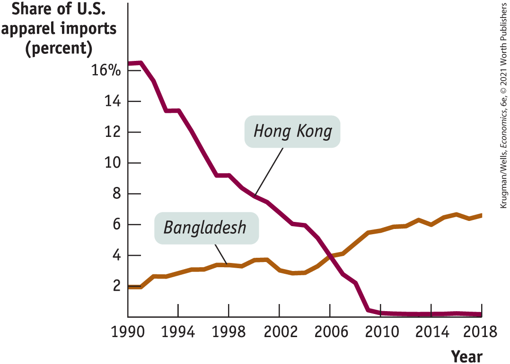
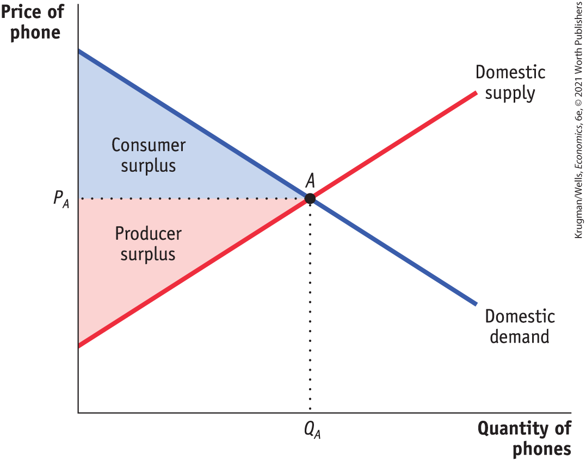
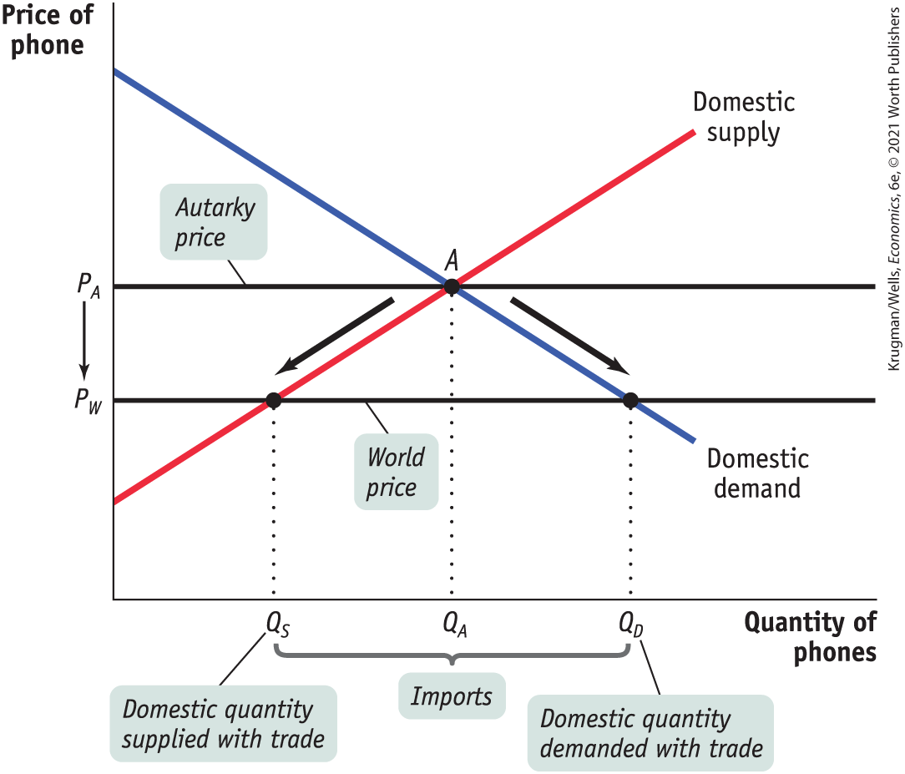
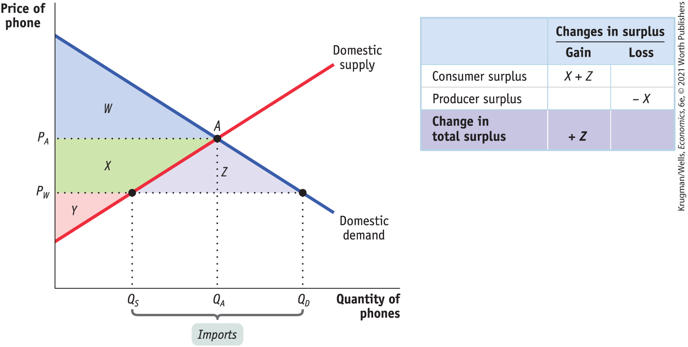
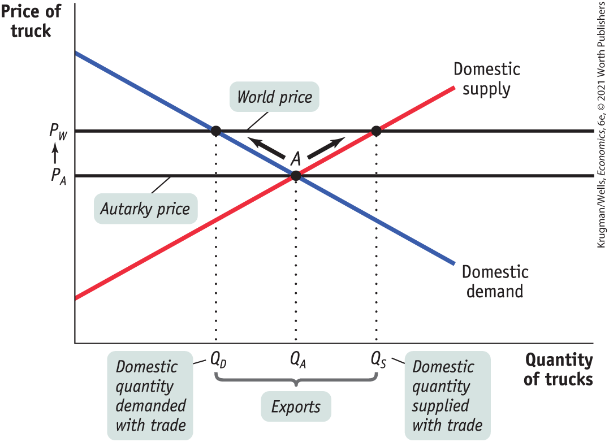
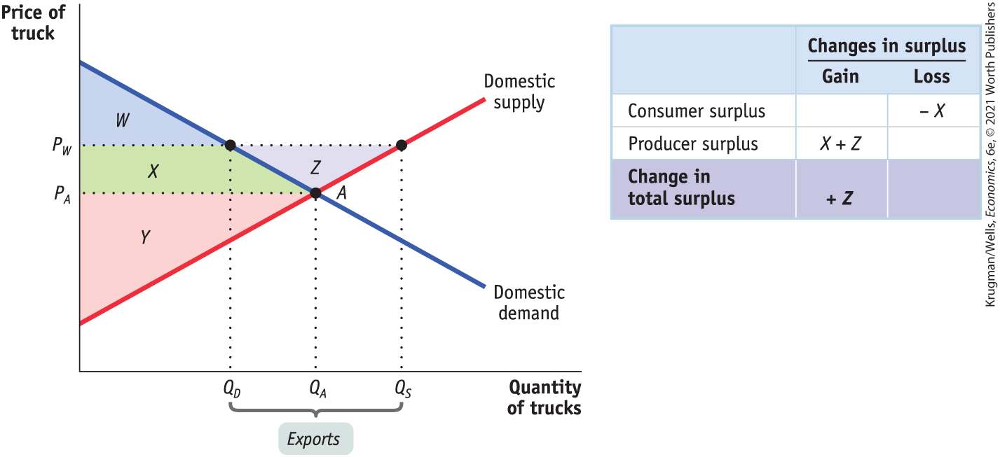

### Sources of Comparative Advantage

International trade is driven by comparative advantage, but where does comparative advantage come from? Economists who study international trade have found three main sources of comparative advantage: international differences in *climate,* international differences in *factor endowments,* and international differences in *technology.*

#### Differences in Climate

One key reason the opportunity cost of producing shrimp in Vietnam and Thailand is less than in the United States is that shrimp need warm water — Vietnam has plenty of that, but the United States doesn’t. In general, differences in climate play a significant role in international trade. Tropical countries export tropical products like coffee, sugar, bananas, and shrimp. Countries in the temperate zones export crops like wheat and corn. Some trade is even driven by the difference in seasons between the northern and southern hemispheres: winter deliveries of Chilean grapes have become commonplace in U.S. and European supermarkets.

#### Differences in Factor Endowments

<figure id="pau_9781319320164_t7lecO0pBW" class="figure lm_img_lightbox unnum c2 right">

<figcaption>
A greater endowment of forestland gives Canada a comparative advantage in forest products.
</figcaption>
</figure>

The United States does more trade with Canada than with any other country (China comes in second). Among other things, Canada sells us a lot of forest products — lumber and products derived from lumber, like pulp and paper. These exports don’t reflect the special skill of Canadian lumberjacks. Canada has a comparative advantage in forest products because its forested area is much greater compared to the size of its labor force than the ratio of forestland to the labor force in the United States.

Forestland, like labor and capital, is a *factor of production:* an input used to produce goods and services. (Recall from <a href="#kru_9781319245269_ch02_01.xhtml#pau_9781319320164_uuuTxO7RlK" id="kru_9781319245269_ch05_02.xhtml#pau_9781319320164_nkwsT12hQV" class="crossref">Chapter 2</a> that the factors of production are land, labor, physical capital, and human capital.) Due to history and geography, the mix of available factors of production differs among countries, providing an important source of comparative advantage. The relationship between comparative advantage and factor availability is described in an influential model of international trade, the *Heckscher–Ohlin model,* developed by two Swedish economists in the first half of the twentieth century.

Two key concepts in the model are *factor abundance* and *factor intensity.* Factor abundance refers to how large a country’s supply of a factor is relative to its supply of other factors. <a href="#kru_9781319245269_EM_glossary.xhtml#pau_9781319320164_GAlXCQmluQ" id="kru_9781319245269_ch05_02.xhtml#pau_9781319320164_wsET7F6xZJ" class="glossref" role="doc-glossref">Factor intensity</a> refers to the ranking of goods according to which factor is used in relatively greater quantities in production compared to other factors. So oil refining is a capital-intensive good because it tends to use a high ratio of capital to labor, but phone production is a labor-intensive good because it tends to use a high ratio of labor to capital.

<aside aria-label="title 6" class="glossary c3 main-flow v1" epub:type="glossary" id="pau_9781319320164_oQdY53uyhu">

**factor intensity**  
The **factor intensity** of a good is a measure of which factor is used in relatively greater quantities than other factors in production.

</aside>

According to the <a href="#kru_9781319245269_EM_glossary.xhtml#pau_9781319320164_Hd9Tz2yB88" id="kru_9781319245269_ch05_02.xhtml#pau_9781319320164_jGt1OjRld9" class="glossref" role="doc-glossref">Heckscher–Ohlin model</a>, *a country that has an abundant supply of a factor of production will have a comparative advantage in goods whose production is intensive in that factor.* So a country that has a relative abundance of capital will have a comparative advantage in capital-intensive industries such as oil refining, but a country that has a relative abundance of labor will have a comparative advantage in labor-intensive industries such as phone production.

<aside aria-label="title 7" class="glossary c3 main-flow v1" epub:type="glossary" id="pau_9781319320164_XFee01PxYK">

**Heckscher–Ohlin model**  
According to the **Heckscher–Ohlin model**, a country has a comparative advantage in a good whose production is intensive in the factors that are abundantly available in that country.

</aside>

The basic intuition behind this result is simple and based on opportunity cost.

- The opportunity cost of a given factor — the value that the factor would generate in alternative uses — is low for a country when it is relatively abundant in that factor.
- Relative to the United States, China has an abundance of low-skilled labor.
- As a result, the opportunity cost of the production of low-skilled, labor-intensive goods is lower in China than in the United States.

World trade in clothing is the most dramatic example of the validity of the Heckscher–Ohlin model in practice. Clothing production is a labor-intensive activity: it doesn’t take much physical capital, nor does it require a lot of human capital in the form of highly educated workers. So you would expect labor-abundant countries such as China and Bangladesh to have a comparative advantage in clothing production. And they do.

The fact that international trade is the result of differences in factor endowments helps explain another fact: international specialization of production is often *incomplete.* That is, a country often maintains some domestic production of a good that it imports. A good example is British trade in oil. Britain imports most of the petroleum it consumes, mainly from Norway, which has huge offshore reserves. But Britain has some offshore reserves of its own, mostly off the coast of Scotland, so it’s a significant oil producer itself.

In our supply and demand analysis in the next section, we’ll consider incomplete specialization by a country to be the norm. We should emphasize, however, that the fact that countries often incompletely specialize does not in any way change the conclusion that there are gains from trade.

<aside class="case-study c3 main-flow v1" epub:type="case-study" id="pau_9781319320164_y6My8xROGi" title="For Inquiring Minds">

##### For inquiring minds 

How Scale Effects Drive International Trade

Most analyses of international trade focus on how differences between countries — differences in climate, factor endowments, and technology — create national comparative advantage. While comparative advantage is the single most significant cause of international trade, economists have also pointed out another reason for international trade: the role of *increasing returns to scale.*

Production of a good is characterized by increasing returns to scale if the productivity of labor and other resources used in production rise with the quantity of output. For example, in an industry characterized by increasing returns to scale, increasing output by 10% might require only 8% more labor and 9% more raw materials.

One example of how increasing returns drive international trade is the large passenger aircraft sector. Producing large passenger airplanes efficiently requires enormous factories — for example, Boeing’s wide-bodied passenger jets are assembled in a factory in Everett, Washington, that covers almost 100 acres. Developing a new aircraft also requires huge, one-time investments in research and development. As a result, a small number of companies with large-scale factories dominate world aircraft production. In fact, wide-bodied passenger aircraft are mainly produced in only two places in the world — near Seattle, Washington, and in Toulouse, France. As a result of increasing returns in large passenger aircraft manufacture, there is a great deal of international trade in those aircraft.

The financial services industry is another example of international trade generated by increasing returns. The industry is dominated by a relatively small number of very large banks. These banks also find it advantageous to cluster in the same location in order to facilitate face-to-face interaction on deals, as well as to have access to a large pool of skilled workers. As a result, the world financial industry is dominated by banks located in two cities — New York and London.

Increasing returns also explain the large amount of trade that takes place between countries that have similar natural endowments of resources. Forestland aside, the United States and Canada don’t look very different in terms of technology or resources. Yet they export huge quantities of manufactured goods to each other. The reason is that increasing returns lead each country to specialize in producing a limited range of products and to import the goods it doesn’t produce. Increasing returns to scale probably play an especially large role in the trade in manufactured goods between advanced countries, which is about 25% of the total value of world trade.

</aside>

#### Differences in Technology

In the 1970s and 1980s, Japan became by far the world’s largest exporter of automobiles, selling large numbers to the United States and the rest of the world. Japan’s comparative advantage in automobiles wasn’t the result of climate. Nor can it easily be attributed to differences in factor endowments: aside from a scarcity of land, Japan’s mix of available factors is quite similar to that in other advanced countries. Instead, Japan’s comparative advantage in automobiles was based on the superior production techniques developed by its manufacturers, which allowed them to produce more cars with a given amount of labor and capital than their American or European counterparts.

Japan’s comparative advantage in automobiles was a case of comparative advantage caused by differences in technology — the techniques used in production.

The causes of differences in technology are somewhat mysterious. Sometimes they seem to be based on knowledge accumulated through experience — for example, Switzerland’s comparative advantage in watches reflects a long tradition of watchmaking. Sometimes they are the result of a set of innovations that for some reason occur in one country but not in others.

Technological advantage, however, is often transitory. By adopting *lean production* (techniques designed to improve manufacturing productivity through increased efficiency), American auto manufacturers closed much of the gap in productivity with their Japanese competitors. Similarly, Europe’s aircraft industry eventually closed a comparable gap with the U.S. aircraft industry. At any given point in time, however, differences in technology are a major source of comparative advantage.

### ECONOMICS \>\> *in Action*

How Hong Kong Lost Its Shirts

The rise of Hong Kong was one of the most improbable-sounding economic success stories of the twentieth century. When a communist regime took over China in 1949, Hong Kong — which was at that time still a British colony — became in effect a city without a hinterland, largely cut off from economic relations with the territory just over the border. Until that point the people of Hong Kong had made a living largely by serving as a point of entry into China. However, after the city became cut off from China, it did not languish. Instead, Hong Kong prospered to such an extent that today the city — now returned to China, but governed as a special autonomous region — has a GDP per capita comparable to that of the United States.

Much of Hong Kong’s ascent was the result of its clothing industry. In 1980 Hong Kong’s garment and textile sectors employed almost 450,000 workers, close to 20% of total employment on the island. These workers overwhelmingly made apparel — shirts, trousers, dresses, and more — for export, especially to the United States.

More recently, the Hong Kong clothing industry has fallen sharply — in fact, it has almost disappeared and along with it, Hong Kong’s apparel exports. <a href="#kru_9781319245269_ch05_02.xhtml#pau_9781319320164_0bWGV5a9ni" id="kru_9781319245269_ch05_02.xhtml#pau_9781319320164_VwlL0mNobq" class="crossref">Figure 5-4</a> shows Hong Kong’s share of U.S. apparel imports since 1989, along with the share of a relative newcomer to the industry, Bangladesh. As you can see, Hong Kong has more or less dropped off the chart, while Bangladesh’s share has risen significantly.

<figure id="pau_9781319320164_0bWGV5a9ni" class="figure lm_img_lightbox num c3 center">

<figcaption>
FIGURE 5-4 Education, Skill Intensity, and Trade

<em>Data from:</em> U.S. International Trade Administration.
</figcaption>
</figure>

<aside class="hidden" id="pau_9781319320164_A2ZccetECz" title="hidden">

The line graph plots the share of U. S. apparel imports in percent versus years. The vertical axis represents “Share of U. S. apparel imports (percent)" from 0 to 16, in increments of 2. The horizontal axis represents “Year" from 1990 to 2018 in increments of 4. The curve for Hong Kong begins from slightly above 16, constantly decreases from 1990 to 2010, and stays close to the horizontal axis between 2010 and 2018. The curve for Bangladesh begins at 2, fluctuates and increases slightly between 1990 and 2006, increases to 6 percent shares by 2010, and terminates at nearly 7 percent in 2018. Both the curves intersect each other at around 4 percent, 2006.

</aside>

Why did Hong Kong lose its comparative advantage in making clothing? It wasn’t because the city’s garment workers became less productive. Instead, it was because the city got better at other things. Apparel production is a labor-intensive, relatively low-tech industry; comparative advantage in that industry has historically always rested with poor, labor-abundant economies. Hong Kong no longer fits that description; Bangladesh does. Hong Kong’s garment industry was a victim of the city’s success.

### *\>\> Quick Review*

- **Imports** and **exports** account for a growing share of the U.S. economy and the economies of many other countries.
- The growth of international trade and other international linkages is known as **globalization.** Extremely high levels of international trade are known as **hyperglobalization.**
- International trade is driven by comparative advantage. **The Ricardian model of international trade** shows that trade between two countries makes both countries better off than they would be in **autarky** — that is, there are gains from international trade.
- The main sources of comparative advantage are international differences in climate, factor endowments, and technology.
- The **Heckscher–Ohlin model** shows how comparative advantage can arise from differences in factor endowments: goods differ in their **factor intensity**, and countries tend to export goods that are intensive in the factors they have in abundance.

### *\>\> Check Your Understanding* 5-1

1.  In the United States, the opportunity cost of 1 ton of corn is 50 bicycles. In China, the opportunity cost of 1 bicycle is 0.01 ton of corn.
    1.  Determine the pattern of comparative advantage.
    2.  In autarky, the United States can produce 200,000 bicycles if no corn is produced, and China can produce 3,000 tons of corn if no bicycles are produced. Draw each country’s production possibility frontier assuming constant opportunity cost, with tons of corn on the vertical axis and bicycles on the horizontal axis.
    3.  With trade, each country specializes its production. The United States consumes 1,000 tons of corn and 200,000 bicycles; China consumes 3,000 tons of corn and 100,000 bicycles. Indicate the production and consumption points on your diagrams, and use them to explain the gains from trade.
2.  Explain the following patterns of trade using the Heckscher–Ohlin model.
    1.  France exports wine to the United States, and the United States exports movies to France.
    2.  Brazil exports shoes to the United States, and the United States exports shoe-making machinery to Brazil.

## Supply, Demand, and International Trade

Simple models of comparative advantage are helpful for understanding the fundamental causes of international trade. However, to analyze the effects of international trade at a more detailed level and to understand trade policy, it helps to return to the supply and demand model. We’ll start by looking at the effects of imports on domestic producers and consumers, then turn to the effects of exports.

### The Effects of Imports

<a href="#kru_9781319245269_ch05_03.xhtml#pau_9781319320164_qkWuOHfZ9j" id="kru_9781319245269_ch05_03.xhtml#pau_9781319320164_8dj50tbsX6" class="crossref">Figure 5-5</a> shows the U.S. market for phones, ignoring international trade for a moment. It introduces a few new concepts: the *domestic demand curve,* the *domestic supply curve,* and the domestic or autarky price.

<figure id="pau_9781319320164_qkWuOHfZ9j" class="figure lm_img_lightbox num c3 main-flow">

<figcaption>
FIGURE 5-5 Consumer and Producer Surplus in Autarky

In the absence of trade, the domestic price is <em>P</em><em>A</em><em>,</em> the autarky price at which the domestic supply curve and the domestic demand curve intersect. The quantity produced and consumed domestically is <em>Q</em><em>A</em><em>.</em> Consumer surplus is represented by the blue-shaded area, and producer surplus is represented by the red-shaded area.
</figcaption>
</figure>

<aside class="hidden" id="pau_9781319320164_vzXB8KHzNj" title="hidden">

The vertical axis represents Quantity of phones and shows a marking Q A. The horizontal axis represents price of phone and shows a marking P A. Two curves labeled “Domestic supply” and “Domestic demand” cross at the autarky point A, which represents quantity Q A and price P A. A horizontal dotted line is drawn at P A. The triangular area above that line and below the negative demand curve is shaded blue and labeled “Consumer surplus.” The triangular area below the horizontal line and above the positive supply curve is shaded red and labeled “Producer surplus.”

</aside>

The <a href="#kru_9781319245269_EM_glossary.xhtml#pau_9781319320164_7xoR6KReGY" id="kru_9781319245269_ch05_03.xhtml#pau_9781319320164_K0IVtmps4h" class="glossref" role="doc-glossref">domestic demand curve</a> shows how the quantity of a good demanded by residents of a country depends on the price of that good. Why “domestic”? Because people living in other countries may demand the good, too. Once we introduce international trade, we need to distinguish between purchases of a good by domestic consumers and purchases by foreign consumers. So the domestic demand curve reflects only the demand of residents of our own country.

<aside aria-label="title 1" class="glossary c3 main-flow v1" epub:type="glossary" id="pau_9781319320164_oIURDWfSBK">

**domestic demand curve**  
The **domestic demand curve** shows how the quantity of a good demanded by domestic consumers depends on the price of that good.

</aside>

Similarly, the <a href="#kru_9781319245269_EM_glossary.xhtml#pau_9781319320164_BYH9fWG494" id="kru_9781319245269_ch05_03.xhtml#pau_9781319320164_4dT1QueGam" class="glossref" role="doc-glossref">domestic supply curve</a> shows how the quantity of a good supplied by producers inside our own country depends on the price of that good. Once we introduce international trade, we need to distinguish between the supply of domestic producers and foreign supply — supply brought in from abroad.

<aside aria-label="title 2" class="glossary c3 main-flow v1" epub:type="glossary" id="pau_9781319320164_sIRRaKDquJ">

**domestic supply curve**  
The **domestic supply curve** shows how the quantity of a good supplied by domestic producers depends on the price of that good.

</aside>

In autarky, with no international trade in phones, the equilibrium in this market would be determined by the intersection of the domestic demand and domestic supply curves, point *A.* The equilibrium price of phones would be $P_{A}$*,* and the equilibrium quantity of phones produced and consumed would be $Q_{A}$. As always, both consumers and producers gain from the existence of the domestic market. In autarky, consumer surplus would be equal to the area of the blue-shaded triangle in <a href="#kru_9781319245269_ch05_03.xhtml#pau_9781319320164_qkWuOHfZ9j" id="kru_9781319245269_ch05_03.xhtml#pau_9781319320164_Wp6doUzKNH" class="crossref">Figure 5-5</a>. Producer surplus would be equal to the area of the red-shaded triangle. And total surplus would be equal to the sum of these two shaded triangles.

Now let’s imagine opening up this market to imports. To do this, we must make an assumption about the supply of imports. The simplest assumption, which we will adopt here, is that unlimited quantities of phones can be purchased from abroad at a fixed price. The price at which a good can be bought or sold abroad is known as the <a href="#kru_9781319245269_EM_glossary.xhtml#pau_9781319320164_JO8c1b7Buh" id="kru_9781319245269_ch05_03.xhtml#pau_9781319320164_f126qJ8IDy" class="glossref" role="doc-glossref">world price</a>. <a href="#kru_9781319245269_ch05_03.xhtml#pau_9781319320164_WyWLIGyVwl" id="kru_9781319245269_ch05_03.xhtml#pau_9781319320164_0DApim8iM4" class="crossref">Figure 5-6</a> shows a situation in which the world price of a phone, $P_{W}$*,* is lower than the price of a phone that would prevail in the domestic market in autarky, $P_{A}$*.*

<aside aria-label="title 3" class="glossary c3 main-flow v1" epub:type="glossary" id="pau_9781319320164_W18UqWuBRb">

**world price**  
The **world price** of a good is the price at which that good can be bought or sold abroad.

</aside>

<figure id="pau_9781319320164_WyWLIGyVwl" class="figure lm_img_lightbox num c3 main-flow">

<figcaption>
FIGURE 5-6 The Domestic Market with Imports

Here the world price of phones, <em>P</em><em>W</em><em>,</em> is below the autarky price, <em>P</em><em>A</em><em>.</em> When the economy is opened to international trade, imports enter the domestic market, and the domestic price falls from the autarky price, <em>P</em><em>A</em><em>,</em> to the world price, <em>P</em><em>W</em><em>.</em> As the price falls, the domestic quantity demanded rises from <em>Q</em><em>A</em> to <em>Q</em><em>D</em> and the domestic quantity supplied falls from <em>Q</em><em>A</em> to <em>Q</em><em>S</em><em>.</em> The difference between domestic quantity demanded and domestic quantity supplied at <em>P</em><em>W</em><em>,</em> the quantity <em>Q</em><em>D</em> − <em>Q</em><em>S</em><em>,</em> is filled by imports.
</figcaption>
</figure>

<aside class="hidden" id="pau_9781319320164_oGwS6MadTe" title="hidden">

The vertical axis represents Quantity of phones and shows following marking Q S (Domestic quantity supplied with trade), Q A (Imports), Q D (Domestic quantity demanded with trade). The horizontal axis represents Price of phone and shows two markings P A and P W. The graph shows two intersecting curves for domestic supply and domestic demand. The curves intersect at a point labeled A. A horizontal line at price P A passes through point A. A horizontal line at price P W, below P A, intersects the supply and demand curves. The intersection point on the supply curve corresponds to a quantity of Q S, and the intersection point on the demand curve corresponds to a quantity of Q D.

</aside>

Given that the world price is below the domestic price of a phone, it is profitable for importers to buy phones abroad and resell them domestically. The imported phones increase the supply of phones in the domestic market, driving down the domestic market price. Phones will continue to be imported until the domestic price falls to a level equal to the world price.

The result is shown in <a href="#kru_9781319245269_ch05_03.xhtml#pau_9781319320164_WyWLIGyVwl" id="kru_9781319245269_ch05_03.xhtml#pau_9781319320164_xvEUvdc75o" class="crossref">Figure 5-6</a>. Because of imports, the domestic price of a phone falls from $P_{A}$ to $P_{W}$*.* The quantity of phones demanded by domestic consumers rises from $Q_{A}$ to $Q_{D}$*,* and the quantity supplied by domestic producers falls from $Q_{A}$ to $Q_{S}$*.* The difference between the domestic quantity demanded and the domestic quantity supplied, $Q_{D} - Q_{S}$*,* is filled by imports.

Now let’s turn to the effects of imports on consumer surplus and producer surplus. Because imports of phones lead to a fall in their domestic price, consumer surplus rises and producer surplus falls. <a href="#kru_9781319245269_ch05_03.xhtml#pau_9781319320164_K7r9YLVQfE" id="kru_9781319245269_ch05_03.xhtml#pau_9781319320164_GgZ3CUF6fN" class="crossref">Figure 5-7</a> shows how this works. We label four areas: *W, X, Y,* and *Z.* The autarky consumer surplus we identified in <a href="#kru_9781319245269_ch05_03.xhtml#pau_9781319320164_qkWuOHfZ9j" id="kru_9781319245269_ch05_03.xhtml#pau_9781319320164_JYVYZYr6w3" class="crossref">Figure 5-5</a> corresponds to *W,* and the autarky producer surplus corresponds to the sum of *X* and *Y.* The fall in the domestic price to the world price leads to an increase in consumer surplus; it increases by *X* and *Z,* so consumer surplus now equals the sum of *W, X,* and *Z.* At the same time, producers lose *X* in surplus, so producer surplus now equals only *Y.*

<figure id="pau_9781319320164_K7r9YLVQfE" class="figure lm_img_lightbox num c4 center">

<figcaption>
FIGURE 5-7 The Effects of Imports on Surplus

When the domestic price falls to <em>P</em><em>W</em> as a result of international trade, consumers gain additional surplus (areas <em>X</em> + <em>Z</em>) and producers lose surplus (area <em>X</em>). Because the gains to consumers outweigh the losses to producers, there is an increase in the total surplus in the economy as a whole (area <em>Z</em>).
</figcaption>
</figure>

<aside class="hidden" id="pau_9781319320164_T38hhgaX4s" title="hidden">

The vertical axis represents Price of phone and shows two markings P A and P W. The horizontal axis represents Quantity of phones and shows following markings: Q S, Q A, Q D. The distance between Q S and Q D is labeled Imports. It shows a single supply curve intersecting a single demand curve. The equilibrium point A (Q A, P A) is marked, as well as two other points, (Q S, P W) and (Q D, P W). The area above the horizontal dotted line from P A and below the demand curve is shaded and labeled W. The area below W and above the horizontal dotted line from P W, bound by the supply curve, is shaded and labeled X. The area below X and above the supply curve is shaded and labeled Y. The area between point A and the two other points on the curves is shaded and labeled Z. The graph includes a table with three rows and two columns. The column headers are as follows. Change in surplus: Gain, Change in surplus: loss. The row entries are as follows. Row 1. Consumer surplus, X plus Z, blank Row 2. Producer surplus, blank, negative X Row 3. Change in total surplus, positive Z, blank

</aside>

The table in <a href="#kru_9781319245269_ch05_03.xhtml#pau_9781319320164_K7r9YLVQfE" id="kru_9781319245269_ch05_03.xhtml#pau_9781319320164_76pH8F6DWg" class="crossref">Figure 5-7</a> summarizes the changes in consumer and producer surplus when the phone market is opened to imports. Consumers gain surplus equal to the areas $X + Z$*.* Producers lose surplus equal to *X.* So the sum of producer and consumer surplus — the total surplus generated in the phone market — increases by *Z.* As a result of trade, consumers gain and producers lose, but the gain to consumers exceeds the loss to producers.

This is an important result. We have just shown that opening up a market to imports leads to a net gain in total surplus, which is what we should have expected given the proposition that there are gains from international trade.

However, we have also learned that although the country as a whole gains, some groups — in this case, domestic producers of phones — lose as a result of international trade. As we’ll see shortly, the fact that international trade creates losers as well as winners is crucial for understanding the politics of trade policy.

We turn next to the case in which a country exports a good.

### The Effects of Exports

<a href="#kru_9781319245269_ch05_03.xhtml#pau_9781319320164_s4hj8Wiwis" id="kru_9781319245269_ch05_03.xhtml#pau_9781319320164_ni6P8N4ry8" class="crossref">Figure 5-8</a> shows the effects on a country when it exports a good, in this case trucks. For this example, we assume that unlimited quantities of trucks can be sold abroad at a given world price, $P_{W}$*,* which is higher than the price that would prevail in the domestic market in autarky, $P_{A}$*.*

<figure id="pau_9781319320164_s4hj8Wiwis" class="figure lm_img_lightbox num c3 main-flow">

<figcaption>
FIGURE 5-8 The Domestic Market with Exports

Here the world price, <em>P</em><em>W</em><em>,</em> is greater than the autarky price, <em>P</em><em>A</em><em>.</em> When the economy is opened to international trade, some of the domestic supply is now exported. The domestic price rises from the autarky price, <em>P</em><em>A</em><em>,</em> to the world price, <em>P</em><em>W</em><em>.</em> As the price rises, the domestic quantity demanded falls from <em>Q</em><em>A</em> to <em>Q</em><em>D</em> and the domestic quantity supplied rises from <em>Q</em><em>A</em> to <em>Q</em><em>S</em><em>.</em> The portion of domestic production that is not consumed domestically, <em>Q</em><em>S</em> − <em>Q</em><em>D</em><em>,</em> is exported.
</figcaption>
</figure>

<aside class="hidden" id="pau_9781319320164_pEytC3juzx" title="hidden">

The vertical axis represents Price of Truck and shows two markings P A and P W. The horizontal axis represents Quantity of Trucks and shows following markings: Export: Q D (Domestic quantity demanded with trade), Q A, Q S (Domestic quantity supplied with trade). The graph shows intersecting straight supply and demand lines. The lines intersect at the point labeled A, The horizontal line at price P A passes through point A. A horizontal line at price P W, above P A, passes through points on the supply and demand lines. The point on the supply curve corresponds to a quantity of Q S, and the point on the demand curve corresponds to a quantity of Q D.

</aside>

The higher world price makes it profitable for exporters to buy trucks domestically and sell them overseas. The purchases of domestic trucks drive the domestic price up until it is equal to the world price. As a result, the quantity demanded by domestic consumers falls from $Q_{A}$ to $Q_{D}$ and the quantity supplied by domestic producers rises from $Q_{A}$ to $Q_{S}$. This difference between domestic production and domestic consumption, $Q_{S} - Q_{D}$*,* is exported.

Like imports, exports lead to an overall gain in total surplus for the exporting country but also create losers as well as winners. <a href="#kru_9781319245269_ch05_03.xhtml#pau_9781319320164_lBcmv3dESf" id="kru_9781319245269_ch05_03.xhtml#pau_9781319320164_Uwkka9R2yp" class="crossref">Figure 5-9</a> shows the effects of truck exports on producer and consumer surplus. In the absence of trade, the price of each truck would be $P_{A}$*.* Consumer surplus in the absence of trade is the sum of areas *W* and *X,* and producer surplus is area *Y.* As a result of trade, price rises from $P_{A}$ to $P_{W}$*,* consumer surplus falls to *W,* and producer surplus rises to $Y + X + Z$*.* So producers gain $X + Z$*,* consumers lose *X,* and, as shown in the table accompanying the figure, the economy as a whole gains total surplus in the amount of *Z.*

<figure id="pau_9781319320164_lBcmv3dESf" class="figure lm_img_lightbox num c4 center">

<figcaption>
FIGURE 5-9 The Effects of Exports on Surplus

When the domestic price rises to <em>P</em><em>W</em> as a result of trade, producers gain additional surplus (area <em>X</em> + <em>Z</em>) but consumers lose surplus (area <em>X</em>). Because the gains to producers outweigh the losses to consumers, there is an increase in the total surplus in the economy as a whole (area <em>Z</em>).
</figcaption>
</figure>

<aside class="hidden" id="pau_9781319320164_ERBYn73klL" title="hidden">

The vertical axis represents Price of trucks and shows two markings P A and P W. The horizontal axis represents Quantity of Trucks and shows following markings: Q S, Q A, Q D. The distance between Q D and Q S is labeled Exports. It shows a single supply line intersecting a single demand line. The equilibrium point A (Q A, P A) is marked, as well as two other points, (Q D, P W) and (Q S, P W). The area above the horizontal dotted line from P W and below the demand curve is shaded and labeled W. The area below W and above the horizontal dotted line from P A, bound by the demand curve, is shaded and labeled X. The area below X and above the supply curve is shaded and labeled Y. The area between point A and the two other points on the curves is shaded and labeled Z. The graph includes a table with three rows and two columns. The column headers are as follows. Change in surplus: Gain, Change in surplus: loss. The row entries are as follows. Row 1. Consumer surplus, Blank, negative X Row 2. Producer surplus, X plus Z, blank Row 3. Change in total surplus, positive Z, blank

</aside>

We have learned, then, that imports of a particular good hurt domestic producers of that good but help domestic consumers, whereas exports of a particular good hurt domestic consumers of that good but help domestic producers. In each case, the gains are larger than the losses.
