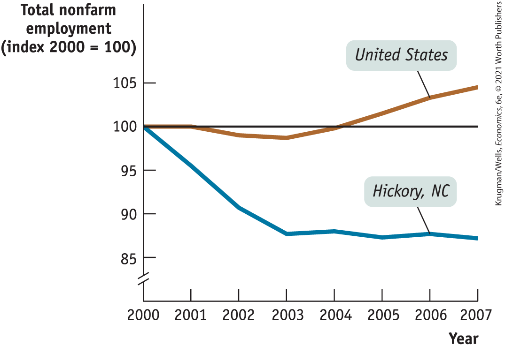
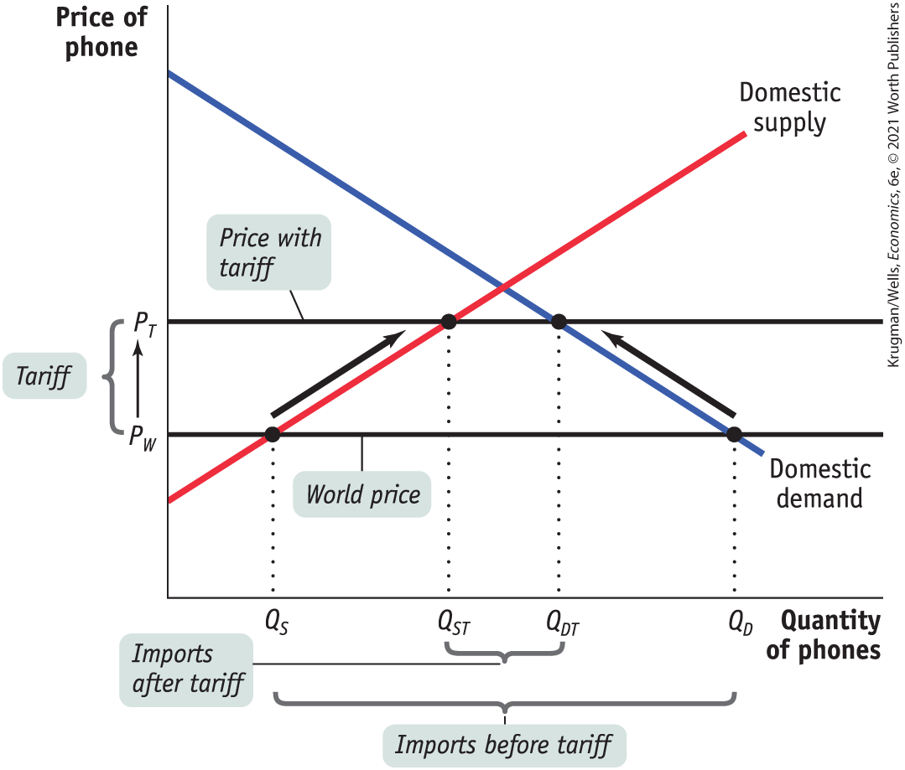
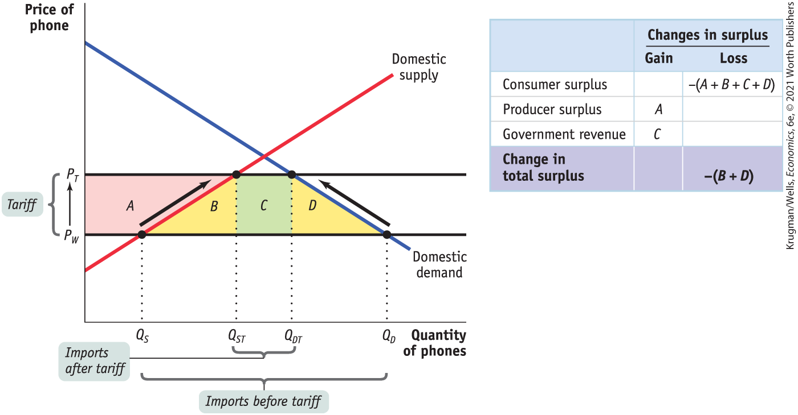
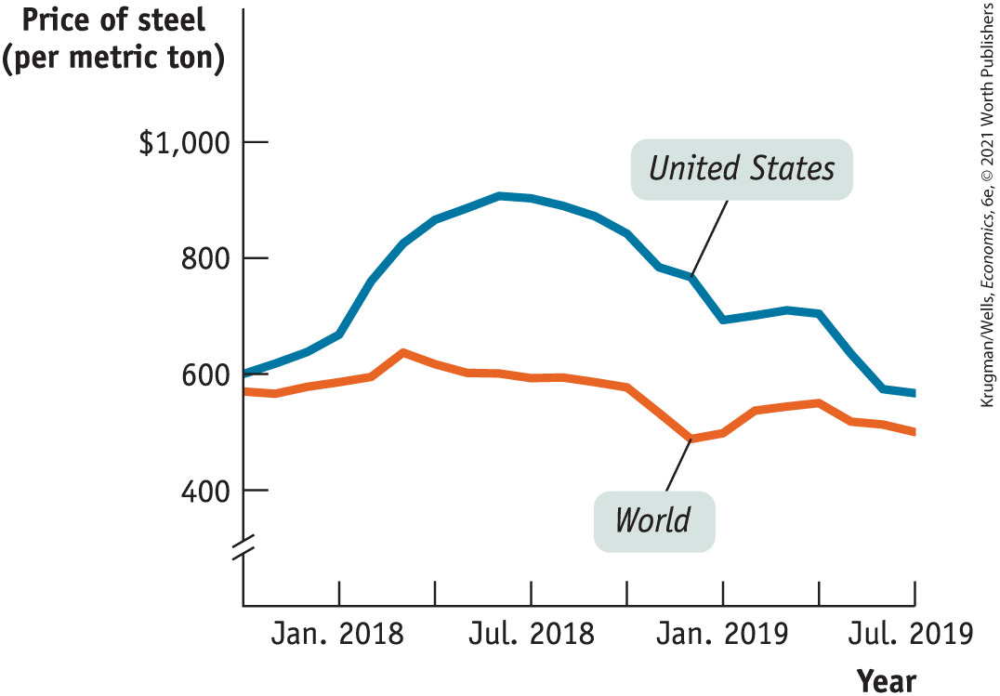

### International Trade and Wages

So far we have focused on the effects of international trade on producers and consumers in a particular industry. For many purposes this is a very helpful approach. However, producers and consumers are not the only parts of society affected by trade; the owners of factors of production are also affected. In particular, the owners of labor, land, and capital employed in producing goods that are exported, or goods that compete with imported goods, can be deeply affected by trade.

Moreover, the effects of trade aren’t limited to just those industries that export or compete with imports because *factors of production can often move between industries.* So now we turn our attention to the long-run effects of international trade on income distribution — how a country’s total income is allocated among its various factors of production.

To begin our analysis, consider the position of Mia, who is initially employed as an accountant in an industry that is shrinking as a result of growing international trade. Suppose, for example, that she works in the U.S. apparel (clothing) industry, which formerly employed millions of people but has largely been displaced by imports from low-wage countries. Mia is likely to find a new job in another industry, such as health care, which has been expanding rapidly over time. How will the move affect her earnings?

The answer is, there probably won’t be much effect. According to the U.S. Bureau of Labor Statistics, accountants earn roughly the same amount in health care that they do in what’s left of the apparel industry — about \$65,000 a year. So we shouldn’t think of Mia as a producer of apparel who is hurt by competition from imports. Instead, we should think of her as a worker with particular skills who is affected by imports — mainly by the extent to which those imports change the wages of accountants in the economy as a whole.

The wage rate of accountants is a *factor price —* the price employers have to pay for the services of a factor of production. One key question about international trade is how it affects factor prices — not just narrowly defined factors of production like accountants, but broadly defined factors such as capital, unskilled labor, and college-educated labor.

Earlier in this chapter we described the Heckscher–Ohlin model of trade, which states that comparative advantage is determined by a country’s factor endowment. This model also suggests how international trade affects factor prices in a country: compared to autarky, international trade tends to raise the prices of factors that are abundantly available and reduce the prices of factors that are scarce.

We won’t work this out in detail, but the idea is simple. The prices of factors of production, like the prices of goods and services, are determined by supply and demand. If international trade increases the demand for a factor of production, that factor’s price will rise; if international trade reduces the demand for a factor of production, that factor’s price will fall.

Now think of a country’s industries as consisting of both <a href="#kru_9781319245269_EM_glossary.xhtml#pau_9781319320164_7eVQ96py71" id="kru_9781319245269_ch05_03.xhtml#pau_9781319320164_v7otubNX6q" class="glossref" role="doc-glossref">exporting industries</a>, which produce goods and services that are sold abroad, and <a href="#kru_9781319245269_EM_glossary.xhtml#pau_9781319320164_HhXBJvcKBV" id="kru_9781319245269_ch05_03.xhtml#pau_9781319320164_gjvjFPIWSt" class="glossref" role="doc-glossref">import-competing industries</a>, which produce goods and services that compete with goods and services that are imported from abroad. Compared with autarky, international trade leads to higher production in exporting industries and lower production in import-competing industries. This indirectly increases the demand for factors used by exporting industries and decreases the demand for factors used by import-competing industries.

<aside aria-label="title 4" class="glossary c3 main-flow v1" epub:type="glossary" id="pau_9781319320164_uJJgpzpWWZ">

**exporting industries**  
**Exporting industries** produce goods and services that are sold abroad.

</aside>
<aside aria-label="title 5" class="glossary c3 main-flow v1" epub:type="glossary" id="pau_9781319320164_Tdusc0t3Kw">

**import-competing industries**  
**Import-competing industries** produce goods and services that are also imported.

</aside>

In addition, the Heckscher–Ohlin model shows that a country tends to export goods that are intensive in factors that are abundant in that country and to import goods that are intensive in factors that are scarce. *So international trade tends to increase the demand for factors that are more abundant in a country compared with other countries, and to decrease the demand for factors that are more scarce in a country compared with other countries. As international trade grows, the prices of abundant factors tend to rise, and the prices of scarce factors tend to fall.*

In other words, international trade tends to redistribute income toward a country’s abundant factors and away from its less abundant factors.

U.S. exports tend to be human-capital-intensive (such as high-tech design and Hollywood movies) while U.S. imports tend to be unskilled-labor-intensive (such as phone assembly and clothing production). This suggests that the effect of international trade on the U.S. factor markets is to raise the wage rate of highly educated American workers and reduce the wage rate of unskilled American workers.

This effect has been a source of much concern in recent years. Wage inequality — the gap between the wages of high-paid and low-paid workers — has increased substantially over the last 40 years. Some economists believe that growing international trade is an important factor in that trend. If international trade has the effects predicted by the Heckscher–Ohlin model, its growth raises the wages of highly educated American workers, who already have relatively high wages, and lowers the wages of less educated American workers, who already have relatively low wages.

But keep in mind another phenomenon: trade reduces the income inequality between countries as poor countries improve their standard of living by exporting to rich countries.

The effects of trade on wages in the United States have generated considerable controversy in recent years. Most economists who have studied the issue agree that growing imports of labor-intensive products from newly industrializing economies, and the export of high-technology goods in return, have helped cause a widening wage gap between highly educated and less educated workers in the United States. However, most economists believe that it is only one of several forces explaining the growth in American wage inequality.

### ECONOMICS \>\> *in Action*

The China Shock

If you go into a Walmart or other large store and look at the labels on the products, it can seem as if everything is made in China these days. That’s not really true, but we do buy a lot from China, which supplies almost a quarter of U.S. imported goods.

This is a fairly recent phenomenon. Imports from China, though growing, were small until the late 1990s when they took a great leap upward. In 2000, imports from China were less than 1% of U.S. national income and by 2007 they were more than 2%, after which they began to level off. The surge in Chinese imports corresponded to a change in the structure of the global economy — in particular, a transfer of production and transportation technology from advanced countries to China. China’s admittance to the World Trade Organization, a global institution for regulating international trade, also contributed to the surge, known as the *China Shock.*

We have seen that international trade often creates losers as well as winners. In this case, the surge in imports from China was good for U.S. consumers, who paid less for many goods. The price of clothing, in particular, fell about 10% during the China Shock, even as overall consumer prices rose about 25%. It was, however, hard on some U.S. industries. Producers of clothing, furniture, and some electronic goods, suddenly faced greatly increased competition. The losers were American companies that produced those goods, many of which were forced to close plants and their laid-off workers.

Several estimates of the effects of the China Shock indicate that as many as a million manufacturing jobs may have been lost to imports from China from 2000 to 2007. These job losses were offset by job gains elsewhere: overall U.S. employment rose by 5 million over the period. But the communities experiencing job gains weren’t the same as those experiencing job losses, and some communities were hard hit as shown in <a href="#kru_9781319245269_ch05_03.xhtml#pau_9781319320164_5hGm3b3Qpy" id="kru_9781319245269_ch05_03.xhtml#pau_9781319320164_5U2da8oYrZ" class="crossref">Figure 5-10</a>.

For example, increased imports from China were probably the main reason the U.S. furniture industry lost around 150,000 jobs between 2000 and 2007, even as overall U.S. employment rose. For the overall U.S. economy, this wasn’t that big a deal: almost 2 million U.S. workers are laid off every month, even in good times. But for communities like Hickory, North Carolina, where 1 in 6 workers were employed in the furniture industry, the consequences were devastating. Not only were furniture workers laid off, but additional jobs were lost as these workers stopped spending in the local economy. As <a href="#kru_9781319245269_ch05_03.xhtml#pau_9781319320164_5hGm3b3Qpy" id="kru_9781319245269_ch05_03.xhtml#pau_9781319320164_kwegh79EJp" class="crossref">Figure 5-10</a> shows, overall employment fell sharply and stagnated in the Hickory area even as it rose in the nation as a whole.

<figure id="pau_9781319320164_5hGm3b3Qpy" class="figure lm_img_lightbox num c3 center">

<figcaption>
FIGURE 5-10 The Effect of Chinese Imports on Employment in the American Furniture Industry

<em>Data from:</em> U.S. Census and the Federal Reserve Bank of St. Louis.
</figcaption>
</figure>

<aside class="hidden" id="pau_9781319320164_i7MbRXhYJk" title="hidden">

The line graph plots Total nonfarm employment (index 2000 equals 100) along the vertical axis versus years along the horizontal axis. The years range from 2000 to 2007 in increments of 1 year. Total nonfarm employment ranges from 85 to 105 in increments of 5. A line parallel to the horizontal axis is drawn at 100. Two curves start from 100. The curve labeled United States forms a slightly concave up and then goes above the horizontal line, passing through coordinates (2003, 99) and (2006, 103). The curve labeled Hickory, N C, also forms a slightly concave up curve, below the horizontal line, passing through coordinates (2001, 98) and (2003, 88).

</aside>

### *\>\> Quick Review*

- The intersection of the **domestic demand curve** and the **domestic supply curve** determines the domestic price of a good. When a market is opened to international trade, the domestic price is driven to equal the **world price.**
- If the world price is lower than the autarky price, trade leads to imports and the domestic price falls to the world price. There are overall gains from international trade because the gain in consumer surplus exceeds the loss in producer surplus.
- If the world price is higher than the autarky price, trade leads to exports and the domestic price rises to the world price. There are overall gains from international trade because the gain in producer surplus exceeds the loss in consumer surplus.
- Trade leads to an expansion of **exporting industries**, which increases demand for a country’s abundant factors, and a contraction of **import-competing industries**, which decreases demand for its scarce factors.

### *\>\> Check Your Understanding* 5-2

1.  Due to a strike by truckers, trade in food between the United States and Mexico is halted. In autarky, the price of Mexican grapes is lower than that of U.S. grapes. Using a diagram of the U.S. domestic demand curve and the U.S. domestic supply curve for grapes, explain the effect of the strike on the following.
    1.  U.S. grape consumers’ surplus
    2.  U.S. grape producers’ surplus
    3.  U.S. total surplus
2.  What effect do you think the strike will have on Mexican grape producers? Mexican grape pickers? Mexican grape consumers? U.S. grape pickers?

## The Effects of Trade Protection

Ever since David Ricardo laid out the principle of comparative advantage in the early nineteenth century, most economists have advocated <a href="#kru_9781319245269_EM_glossary.xhtml#pau_9781319320164_zajinzyCu3" id="kru_9781319245269_ch05_04.xhtml#pau_9781319320164_Z6j3QjLO30" class="glossref" role="doc-glossref">free trade</a>. That is, they have argued that government policy should not attempt either to reduce or to increase the levels of exports and imports that occur naturally as a result of supply and demand.

<aside aria-label="title 1" class="glossary c3 main-flow v1" epub:type="glossary" id="pau_9781319320164_9fadJIkbUA">

**free trade**  
An economy has **free trade** when the government does not attempt either to reduce or to increase the levels of exports and imports that occur naturally as a result of supply and demand.

</aside>

Despite the free-trade arguments of economists, however, many governments use taxes and other restrictions to limit imports. Less frequently, governments offer subsidies to encourage exports. Policies that limit imports, usually with the goal of protecting domestic producers in import-competing industries from foreign competition, are known as <a href="#kru_9781319245269_EM_glossary.xhtml#pau_9781319320164_EE3sex6FQz" id="kru_9781319245269_ch05_04.xhtml#pau_9781319320164_tEqQQ9r8B5" class="glossref" role="doc-glossref">trade protection</a> or simply as <a href="#kru_9781319245269_EM_glossary.xhtml#pau_9781319320164_JbXLNEWAsy" id="kru_9781319245269_ch05_04.xhtml#pau_9781319320164_GQqykkatKt" class="glossref" role="doc-glossref">protection</a>.

<aside aria-label="title 2" class="glossary c3 main-flow v1" epub:type="glossary" id="pau_9781319320164_UrsFFwZPFd">

**trade protection**, **protection**  
Policies that limit imports are known as **trade protection** or simply as **protection.**

</aside>

Let’s look at the two most common protectionist policies, *tariffs* and *import quotas,* then turn to the reasons governments follow these policies.

### The Effects of a Tariff

A <a href="#kru_9781319245269_EM_glossary.xhtml#pau_9781319320164_JLstK5mmu8" id="kru_9781319245269_ch05_04.xhtml#pau_9781319320164_Xp7fJsf6XG" class="glossref" role="doc-glossref">tariff</a> is a form of excise tax, levied only on sales of imported goods. For example, the U.S. government could declare that anyone bringing phones for sale into the country must pay a tariff of \$100 per unit. In the distant past, tariffs were an important source of government revenue because they were relatively easy to collect. But in the modern world, tariffs are usually intended to discourage imports and protect import-competing domestic producers, and not levied as a source of government revenue.

<aside aria-label="title 3" class="glossary c3 main-flow v1" epub:type="glossary" id="pau_9781319320164_PV6vm8K37q">

**tariff**  
A **tariff** is a tax levied on imports.

</aside>

A tariff raises both the price received by domestic producers and the price paid by domestic consumers. Suppose, for example, that our country imports phones, and a phone costs \$200 on the world market. As we saw earlier, under free trade the domestic price would also be \$200. But if a tariff of \$100 per unit is imposed, the domestic price will rise to \$300, because it won’t be profitable to import phones unless the price in the domestic market is high enough to compensate importers for the cost of paying the tariff.

<a href="#kru_9781319245269_ch05_04.xhtml#pau_9781319320164_MDS3ya7Ihu" id="kru_9781319245269_ch05_04.xhtml#pau_9781319320164_3rkGqZ846k" class="crossref">Figure 5-11</a> illustrates the effects of a tariff on imports of phones. As before, we assume that $P_{W}$ is the world price of a phone. Before the tariff is imposed, imports have driven the domestic price down to $P_{W}$*,* so that pre-tariff domestic production is $Q_{S}$*,* pre-tariff domestic consumption is $Q_{D}$*,* and pre-tariff imports are $Q_{D} - Q_{S}$*.*

<figure id="pau_9781319320164_MDS3ya7Ihu" class="figure lm_img_lightbox num c3 main-flow">

<figcaption>
FIGURE 5-11 The Effect of a Tariff

A tariff raises the domestic price of the good from <em>P</em><em>W</em> to <em>P</em><em>T</em><em>.</em> The domestic quantity demanded shrinks from <em>Q</em><em>D</em> to <em>Q</em><em>D</em><em>T</em><em>,</em> and the domestic quantity supplied increases from <em>Q</em><em>S</em> to <em>Q</em><em>S</em><em>T</em><em>.</em> As a result, imports — which had been <em>Q</em><em>D</em> − <em>Q</em><em>S</em> before the tariff was imposed — shrink to <em>Q</em><em>D</em><em>T</em> − <em>Q</em><em>S</em><em>T</em> after the tariff is imposed.
</figcaption>
</figure>

<aside class="hidden" id="pau_9781319320164_YZVSEctqpa" title="hidden">

The vertical axis represents Price of phone and shows two markings, P T and P W. The horizontal axis represents Quantity of phones and shows following markings: Imports before tariff: Q S, Imports after tariff: Q S T; Q D T; Q D (Imports). The increase from P W to P T is labeled Tariff. The graph plots a negative demand curve and a positive supply curve that intersect each other. Horizontal, parallel lines representing P W and P T cross the demand and supply curves below their point of intersection. As discussed in the text, the distance between those two pairs of intersection points decreases for the greater price P T.

</aside>

Now suppose that the government imposes a tariff on each phone imported. As a consequence, it is no longer profitable to import phones unless the domestic price received by the importer is greater than or equal to the world price plus the tariff. So the domestic price rises to $P_{T}$*,* which is equal to the world price, $P_{W}$*,* plus the tariff. Domestic production rises to $Q_{ST}$*,* domestic consumption falls to $Q_{DT}$*,* and imports fall to $Q_{DT} - Q_{ST}$*.*

A tariff, then, raises domestic prices, leading to increased domestic production and reduced domestic consumption compared to the situation under free trade. <a href="#kru_9781319245269_ch05_04.xhtml#pau_9781319320164_pdtPnaAytj" id="kru_9781319245269_ch05_04.xhtml#pau_9781319320164_s6Rl68LGAC" class="crossref">Figure 5-12</a> shows three effects:

<figure id="pau_9781319320164_pdtPnaAytj" class="figure lm_img_lightbox num c4 center">

<figcaption>
FIGURE 5-12 A Tariff Reduces Total Surplus

When the domestic price rises as a result of a tariff, producers gain additional surplus (area <em>A</em>), the government gains revenue (area <em>C</em>), and consumers lose surplus (areas <em>A</em> + <em>B</em> + <em>C</em> + <em>D</em>). Because the losses to consumers outweigh the gains to producers and the government, the economy as a whole loses surplus (areas <em>B</em> and <em>D</em>).
</figcaption>
</figure>

<aside class="hidden" id="pau_9781319320164_An1QQZQCyE" title="hidden">

The vertical axis represents Price of phone and shows two markings, P T and P W. The horizontal axis represents Quantity of phones and shows following markings: Imports before tariff: Q S, Imports after tariff: Q S T; Q D T; Q D (Imports). Two dotted lines are drawn parallel to the horizontal axis and four dotted lines are plotted vertically. The straight lines and dotted lines form four sections labeled A (area between P T, P W, and supply curve), B (area between supply curve, Q S, and Q S T), C (area between Q S T and Q D T), and D (area between Q D T, Q D, and demand curve). The negative sloping demand curve and the positive sloping supply curve intersect each other above area C. The graph includes a table with three rows and two columns. The column headers are as follows. Change in surplus: Gain, Change in surplus: Loss. The row entries are as follows. Row 1. Consumer surplus, Blank, negative (A plus B plus C plus D) Row 2. Producer surplus, A, blank Row 3. Government revenue C, Blank Row 4. Change in total surplus, blank, negative (B plus D).

</aside>

1.  The higher domestic price increases producer surplus, a gain equal to area *A.*
2.  The higher domestic price reduces consumer surplus, a reduction equal to the sum of areas *A, B, C,* and *D.*
3.  The tariff yields revenue to the government. How much revenue? The government collects the tariff — which, remember, is equal to the difference between $P_{T}$ and $P_{W}$ on each of the $Q_{DT} - Q_{ST}$ units imported. So total revenue is $(P_{T} - P_{W}) \times (Q_{DT} - Q_{ST})$. This is equal to area *C.*

The welfare effects of a tariff are summarized in the table in <a href="#kru_9781319245269_ch05_04.xhtml#pau_9781319320164_pdtPnaAytj" id="kru_9781319245269_ch05_04.xhtml#pau_9781319320164_dLSihANmvA" class="crossref">Figure 5-12</a>. Producers gain, consumers lose, and the government gains. But consumer losses are greater than the sum of producer and government gains, leading to a net reduction in total surplus equal to areas $B + D$*.*

An excise tax creates inefficiency, or deadweight loss, because it prevents mutually beneficial trades from occurring. In the case of a tariff, the deadweight loss imposed on society is equal to the loss in total surplus represented by areas $B + D$*.*

Tariffs generate deadweight losses because they create inefficiencies in two ways:

1.  Some mutually beneficial trades go unexploited: some consumers who are willing to pay more than the world price, $P_{W}$*,* do not purchase the good, even though $P_{W}$ is the true cost of a unit of the good to the economy. The cost of this inefficiency is represented in <a href="#kru_9781319245269_ch05_04.xhtml#pau_9781319320164_pdtPnaAytj" id="kru_9781319245269_ch05_04.xhtml#pau_9781319320164_VbTgixzzRQ" class="crossref">Figure 5-12</a> by area *D*.
2.  The economy’s resources are wasted on inefficient production: some producers whose cost exceeds $P_{W}$ produce the good, even though an additional unit of the good can be purchased abroad for $P_{W}$*.* The cost of this inefficiency is represented in <a href="#kru_9781319245269_ch05_04.xhtml#pau_9781319320164_pdtPnaAytj" id="kru_9781319245269_ch05_04.xhtml#pau_9781319320164_MUoJnGm2Bk" class="crossref">Figure 5-12</a> by area *B*.

### The Effects of an Import Quota

An <a href="#kru_9781319245269_EM_glossary.xhtml#pau_9781319320164_2nTsSlWa4S" id="kru_9781319245269_ch05_04.xhtml#pau_9781319320164_9g7IWyob2A" class="glossref" role="doc-glossref">import quota</a>, another form of trade protection, is a legal limit on the quantity of a good that can be imported. For example, a U.S. import quota on Chinese phones might limit the quantity imported each year to 50 million units. Import quotas are usually administered through licenses: a number of licenses are issued, each giving the license-holder the right to import a limited quantity of the good each year.

<aside aria-label="title 4" class="glossary c3 main-flow v1" epub:type="glossary" id="pau_9781319320164_aaKomoMG7t">

**import quota**  
An **import quota** is a legal limit on the quantity of a good that can be imported.

</aside>

A quota on sales has the same effect as an excise tax, with one difference: the money that would otherwise have accrued to the government as tax revenue under an excise tax becomes license-holders’ revenue under a quota — also known as quota rents. (*Quota rent* is defined in <a href="#kru_9781319245269_ch04_01.xhtml#pau_9781319320164_7o0pKMH9vx" id="kru_9781319245269_ch05_04.xhtml#pau_9781319320164_mH0ymHKdXC" class="crossref">Chapter 4</a>.) Similarly, an import quota has the same effect as a tariff, with one difference: the money that would otherwise have been government revenue becomes quota rents to license-holders.

Look again at <a href="#kru_9781319245269_ch05_04.xhtml#pau_9781319320164_pdtPnaAytj" id="kru_9781319245269_ch05_04.xhtml#pau_9781319320164_mfTlFC8lOG" class="crossref">Figure 5-12</a>. An import quota that limits imports to $Q_{DT} - Q_{ST}$ will raise the domestic price of phones by the same amount as the tariff we considered previously. That is, it will raise the domestic price from $P_{W}$ to $P_{T}$*.* However, area *C* will now represent quota rents rather than government revenue.

Who receives import licenses and so collects the quota rents? In the case of U.S. import protection, the answer may surprise you: the most important import licenses — mainly for clothing, and to a lesser extent for sugar — are granted to foreign governments.

Because the quota rents for most U.S. import quotas go to foreigners, the cost to the nation of such quotas is larger than that of a comparable tariff (a tariff that leads to the same level of imports). In <a href="#kru_9781319245269_ch05_04.xhtml#pau_9781319320164_pdtPnaAytj" id="kru_9781319245269_ch05_04.xhtml#pau_9781319320164_0R81QYgZ2n" class="crossref">Figure 5-12</a> the net loss to the United States from such an import quota would be equal to areas $B + C + D$*,* the difference between consumer losses and producer gains.

### ECONOMICS \>\> *in Action*

The Steel Tariffs of 2018–2019

U.S. law grants the president authority to impose tariffs unilaterally, without going to Congress, under certain circumstances. This authority was intended to allow prompt responses to trade challenges without opening up a political process that, history shows, tends to be rife with special-interest politics. In general, presidents have used this authority sparingly. However, in 2018 President Donald Trump moved to impose high tariffs on multiple countries and multiple products, with the most dramatic move being a 25% tariff on steel imports from all major suppliers, of which Canada was the most important.

Some of the president’s statements seemed to imply that he believed foreign exporters, not American consumers, would be paying these tariffs. Market data, however, showed a sharp rise in U.S. steel prices as the tariffs went into effect, while world prices were mostly flat. <a href="#kru_9781319245269_ch05_04.xhtml#pau_9781319320164_QgUU1wP2XB" id="kru_9781319245269_ch05_04.xhtml#pau_9781319320164_JZyyrzz1Mt" class="crossref">Figure 5-13</a> shows one example, the price of hot rolled band — a form of steel that is sold to manufacturers of products that use steel. The figure includes data from late 2017 until July 2019. The tariffs were phased in over the course of 2018, then removed in 2019 after the United States, Canada, and Mexico reached a new trade agreement.

<figure id="pau_9781319320164_QgUU1wP2XB" class="figure lm_img_lightbox num c3 center">

<figcaption>
FIGURE 5-13 Tariffs and Steel Prices, United States and the World

<em>Data from:</em> <a href="http://SteelBenchmarker.com" id="kru_9781319245269_ch05_04.xhtml#pau_9781319320164_Sn1PGY5WEj" class="external">SteelBenchmarker.com</a>.
</figcaption>
</figure>

<aside class="hidden" id="pau_9781319320164_q77kd6KDtw" title="hidden">

The vertical axis represents Price of steel (per metric ton) ranging from 400 to 1,000 dollars in increments of 200. The horizontal axis represents years and shows following markings January 2018, July 2018, January 2019, July 2019. The approximate data from the graph are as follows. The concave down curve labeled “United States” starts at 600, peaks at 900 in July 2018, and ends at 600 in July 2019. The curve labeled “World” starts from 590, peaks at 600 in April 2018, and ends at 580 in July 2019.

</aside>

As you can see, after the tariffs took effect, the U.S. price soared above the world price; then U.S. prices fell sharply when the tariffs were removed.

Who gained and who lost from the steel tariffs? U.S. steel companies clearly benefited, as higher prices raised their profits. They also responded to the higher prices by reopening some closed production facilities and planning some expansion of their capacity.

At least initially, however, steel workers didn’t seem to be sharing much of the benefit: their wages weren’t rising much more than those of workers in other industries.

On the other side, higher steel prices hurt steel users. Ordinary Americans, of course, don’t buy steel directly. The metal is used, instead, to make a variety of manufactured goods, such as cars — and U.S. companies that buy steel complained bitterly about higher costs, assigning the tariff partial responsibility for some plant closings and layoffs. They also passed at least some of the tariff on to their customers in the form of higher prices.

The steel tariffs of 2018, then, played out pretty much the way standard analysis would have predicted. Producers of import-competing goods — U.S. steel companies — gained. Consumers — manufacturers who use steel, and, ultimately, the buyers of these manufacturers’ goods — were hurt.

### *\>\> Quick Review*

- Most economists advocate **free trade**, although many governments engage in **trade protection** of import-competing industries. The two most common protectionist policies are tariffs and import quotas. In rare instances, governments subsidize exporting industries.
- A **tariff** is a tax on imports. It raises the domestic price above the world price, leading to a fall in trade and domestic consumption and a rise in domestic production. Domestic producers and the government gain, but domestic consumer losses more than offset this gain, leading to deadweight loss.
- An **import quota** is a legal quantity limit on imports. Its effect is like that of a tariff, except that revenues — the quota rents — accrue to the license holder, not to the domestic government.

### *\>\> Check Your Understanding* 5-3

1.  Suppose the world price of butter is \$0.50 per pound and the domestic price in autarky is \$1.00 per pound. Use a diagram similar to <a href="#kru_9781319245269_ch05_03.xhtml#pau_9781319320164_5hGm3b3Qpy" id="kru_9781319245269_ch05_04.xhtml#pau_9781319320164_djLd1EKvka" class="crossref">Figure 5-10</a> to show the following.
    1.  If there is free trade, domestic butter producers want the government to impose a tariff of no less than \$0.50 per pound. Compare the outcome with a tariff of \$0.25 per pound.
    2.  What happens if a tariff greater than \$0.50 per pound is imposed?
2.  Suppose the government imposes an import quota rather than a tariff on butter. What quota limit would generate the same quantity of imports as a tariff of \$0.50 per pound?

## The Political Economy of Trade Protection

We have seen that international trade produces mutual benefits to the countries that engage in it. We have also seen that tariffs and import quotas, although they produce winners as well as losers, reduce total surplus. Yet many countries continue to impose tariffs and import quotas as well as to enact other protectionist measures.

To understand why trade protection takes place, we will first look at some common justifications for protection. Then we will look at the politics of trade protection. Finally, we will look at an important feature of trade protection in today’s world: tariffs and import quotas are the subject of international negotiation and are policed by international organizations.

### Arguments for Trade Protection

Advocates for tariffs and import quotas offer three common arguments:

1.  The *national security* argument is based on the proposition that overseas sources of goods are vulnerable to disruption in times of international conflict. A country should protect domestic suppliers of crucial goods with the aim to be self-sufficient in the production of those goods. For example, during the coronavirus pandemic of 2020, 90% of medical masks used in the United States were produced overseas. As a result, masks were in extremely short supply and rose sharply in price as countries scrambled for supplies of this critical good.

2.  The *job creation* argument points to the additional jobs created in import-competing industries as a result of trade protection. Economists argue that these jobs are offset by the jobs lost elsewhere, such as industries that use imported inputs and now face higher input costs. But noneconomists don’t always find this argument persuasive.

3.  The *infant industry* argument, often raised in newly industrializing countries, holds that new industries require a temporary period of trade protection to get established. For example, in the 1950s many countries in Latin America imposed tariffs and import quotas on manufactured goods, in an effort to switch from their traditional role as exporters of raw materials to a new status as industrial countries.

    In theory, the argument for infant industry protection can be compelling, particularly in high-tech industries that increase a country’s overall skill level. Reality, however, is more complicated: it is most often industries that are politically influential that gain protection. In addition, governments tend to be poor predictors of the best emerging technologies. Finally, it is often very difficult to wean an industry from protection when it should be mature enough to stand on its own.

### The Politics of Trade Protection

In reality, much trade protection has little to do with the arguments just described. Instead, it reflects the political influence of import-competing producers.

We’ve seen that a tariff or import quota leads to gains for import-competing producers and losses for consumers. Producers, however, usually have much more influence over trade policy decisions. The producers who compete with imports of a particular good are usually a smaller, more cohesive group than the consumers of that good.

For example, in 2018, the U.S. government imposed a 30% tariff on imports of solar panels, many of which come from China. While it helped U.S. producers, who employed about 2,000 workers, it hurt a much larger group, including tens of thousands of solar panel installers, whose business was hurt when panels became more expensive, leading to a decline in new installations. However, the voices of panel producers were heard much more clearly in Washington than the voices of concern from those who buy panels or install them.

It would be nice to say that the main reason trade protection isn’t more extensive is that economists have convinced governments of the virtues of free trade. A more important reason, however, is the role of *international trade agreements.*
