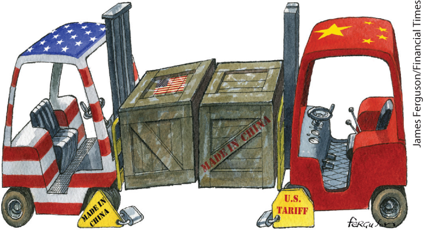
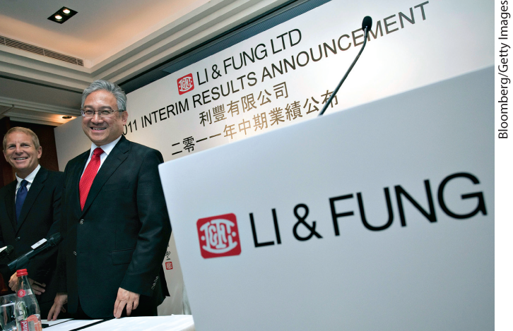

### International Trade Agreements and the World Trade Organization

When a country engages in trade protection, it hurts two groups. We’ve already addressed the adverse effect on domestic consumers, but protection also hurts foreign export industries. This means that countries care about one anothers’ trade policies: the Canadian lumber industry, for example, has a strong interest in keeping U.S. tariffs on forest products low.

Because countries care about one anothers’ trade policies, they enter into <a href="#kru_9781319245269_EM_glossary.xhtml#pau_9781319320164_cxL5FMLuaJ" id="kru_9781319245269_ch05_05.xhtml#pau_9781319320164_npt5EWUIuv" class="glossref" role="doc-glossref">international trade agreements</a>: treaties in which a country promises to engage in less trade protection against the exports of another country in return for a promise by the other country to do the same for its own exports. International trade agreements are especially important as a way to head off potential <a href="#kru_9781319245269_EM_glossary.xhtml#pau_9781319320164_PcVErGTqfV" id="kru_9781319245269_ch05_05.xhtml#pau_9781319320164_h6wTMPsk5Z" class="glossref" role="doc-glossref">trade wars</a>, in which countries impose tariffs and other protectionist measures against other countries’ products in an attempt to force them to make policy concessions. Most world trade is now governed by such agreements.

<aside aria-label="title 1" class="glossary c3 main-flow v1" epub:type="glossary" id="pau_9781319320164_j4DLjM3hWl">

**international trade agreements**  
**International trade agreements** are treaties in which a country promises to engage in less trade protection against the exports of other countries in return for a promise by other countries to do the same for its own exports.

</aside>
<aside aria-label="title 2" class="glossary c3 main-flow v1" epub:type="glossary" id="pau_9781319320164_nJzTCULtTJ">

**trade war**  
In a **trade war**, countries deliberately try to impose pain on their trading partners, as a way to extract policy concessions.

</aside>

Some international trade agreements involve just two countries or a small group of countries. For example, in 1993 the United States, Canada, and Mexico joined together in the <a href="#kru_9781319245269_EM_glossary.xhtml#pau_9781319320164_tKg5Exmelu" id="kru_9781319245269_ch05_05.xhtml#pau_9781319320164_vxQPcoQOOd" class="glossref" role="doc-glossref">North American Free Trade Agreement</a>, or <a href="#kru_9781319245269_EM_glossary.xhtml#pau_9781319320164_tKg5Exmelu" id="kru_9781319245269_ch05_05.xhtml#pau_9781319320164_NS0UTm42bW" class="glossref" role="doc-glossref">NAFTA</a>. By 2008 NAFTA had removed most barriers to trade among the three nations. In 2018 the countries negotiated a revised agreement, the United States-Mexico-Canada Agreement or USMCA, which made some changes but kept the main structure of NAFTA intact. For accuracy’s sake, we will refer to the current trade agreement as <a href="#kru_9781319245269_EM_glossary.xhtml#pau_9781319320164_vjiI3ZAhsX" id="kru_9781319245269_ch05_05.xhtml#pau_9781319320164_I12gg55PC2" class="glossref" role="doc-glossref">NAFTA-USMCA</a>.

<aside aria-label="title 3" class="glossary c3 main-flow v1" epub:type="glossary" id="pau_9781319320164_FJegOd6wwq">

**North American Free Trade Agreement**, or **NAFTA**, **NAFTA-USMCA**  
The **North American Free Trade Agreement**, or **NAFTA**, is a trade agreement among the United States, Canada, and Mexico. The current version of the agreement is **NAFTA-USMCA.**

</aside>

Most European countries are part of an even more comprehensive agreement, the <a href="#kru_9781319245269_EM_glossary.xhtml#pau_9781319320164_3TPfE6L1A5" id="kru_9781319245269_ch05_05.xhtml#pau_9781319320164_E1EO19SGEl" class="glossref" role="doc-glossref">European Union</a>, or <a href="#kru_9781319245269_EM_glossary.xhtml#pau_9781319320164_3TPfE6L1A5" id="kru_9781319245269_ch05_05.xhtml#pau_9781319320164_VGjyTRqHRx" class="glossref" role="doc-glossref">EU</a>. Unlike members of NAFTA-USMCA, the 27 members of the EU agree to charge the same tariffs on goods imported from non-EU countries. The EU also sets rules on policies other than trade, most notably requiring that each member nation freely accept migrants from any other member, while collecting fees from member nations to pay for things like agricultural subsidies. These rules and fees are often unpopular and controversial. In June 2016, Britain held a referendum on whether to leave the EU — a proposal popularly known as *Brexit* (short for “British exit”), which was approved by a narrow majority of voters. Negotiations over the details of Britain’s exit from the EU, and its future relationship with it, were still in progress as this book went to press.

<aside aria-label="title 4" class="glossary c3 main-flow v1" epub:type="glossary" id="pau_9781319320164_RFR6O3bMAR">

**European Union**, or **EU**  
The **European Union**, or **EU**, is a customs union among 27 European nations.

</aside>

There are also global trade agreements covering most of the world. Such global agreements are overseen by the <a href="#kru_9781319245269_EM_glossary.xhtml#pau_9781319320164_S2oWIXxFBq" id="kru_9781319245269_ch05_05.xhtml#pau_9781319320164_D2LjhrsZUZ" class="glossref" role="doc-glossref">World Trade Organization</a>, or <a href="#kru_9781319245269_EM_glossary.xhtml#pau_9781319320164_S2oWIXxFBq" id="kru_9781319245269_ch05_05.xhtml#pau_9781319320164_D2LjhrsZUA" class="glossref" role="doc-glossref">WTO</a>, an international organization composed of member countries — 164 of them currently, accounting for the bulk of world trade. The WTO plays two roles:

<aside aria-label="title 5" class="glossary c3 main-flow v1" epub:type="glossary" id="pau_9781319320164_6Mdnt3AGL7">

**World Trade Organization**, or **WTO**  
The **World Trade Organization**, or **WTO**, oversees international trade agreements and rules on disputes between countries over those agreements.

</aside>

1.  It provides the framework for the massively complex negotiations involved in a major international trade agreement (the full text of the last major agreement, approved in 1994, was 24,000 pages long).
2.  The WTO resolves disputes between its members that typically arise when one country claims that another country’s policies violate its previous agreements.

An example of the WTO at work is the dispute between the United States and Brazil over American subsidies to its cotton farmers. These subsidies, in the amount of \$3 billion to \$4 billion a year, are illegal under WTO rules. Brazil argued that they artificially reduced the price of American cotton on world markets and hurt Brazilian cotton farmers. In 2005 the WTO ruled against the United States and in favor of Brazil, and the United States responded by cutting some export subsidies on cotton. However, in 2007 the WTO ruled that the United States had not done enough to fully comply, such as eliminating government loans to cotton farmers. In 2010, after Brazil threatened, in turn, to impose import tariffs on U.S.-manufactured goods, the two sides agreed to a framework for the solution to the cotton dispute.

The WTO rules do allow trade protection under certain circumstances. One such circumstance occurs when the foreign competition is “unfair” under certain technical criteria. Trade protection is also allowed as a temporary measure when a sudden surge of imports threatens to disrupt a domestic industry. For example, although both Vietnam and Thailand are members of the WTO, the United States has, on and off, imposed tariffs on shrimp imports from these countries.

The WTO is sometimes, with great exaggeration, described as a world government. In fact, it has no army, no police, and no direct enforcement power. The grain of truth in that description is that when a country joins the WTO, it agrees to accept the organization’s judgments — and these judgments apply not only to tariffs and import quotas but also to domestic policies that the organization considers trade protection disguised under another name. So in joining the WTO a country does give up some of its sovereignty.

### Challenges to Globalization

The forward march of globalization over the past century is generally considered a major political and economic success because it has brought rising living standards to hundreds of millions of people. But it is also true that many people, including some economists and policy makers, are having second thoughts about globalization. These second thoughts arise largely from the decline of manufacturing in richer countries and *offshore outsourcing* that jeopardizes the jobs of non-manufacturing workers, once considered immune from foreign competition.

#### The Decline of Manufacturing

We have seen that international trade has an effect on factor prices, particularly wages. Forty years ago, U.S. imports from poorer countries consisted mostly of raw materials and goods that depended upon the climate, like bananas and coffee beans. So U.S. wages were relatively unaffected by international trade. But that is no longer the case. Today many of the manufactured goods consumed in the United States are imported from poorer countries. As a result, international trade now has a much larger effect on income inequality in the United States.

Trade with Asia has raised the greatest concerns among those who study the effect of international trade on wage levels in rich countries. China, despite its rapid economic growth and rising wages in recent years, is still a very low-wage country compared with the United States. Its hourly compensation in manufacturing is approximately 10% of the U.S. level. Other manufacturing exporters, such as India, Bangladesh, and Vietnam, have wage levels less than half of China’s. As we discussed earlier in the chapter, it’s clear that imports from these countries have placed downward pressure on the wages of less skilled U.S. workers and possibly contributed to income inequality.

#### Outsourcing

Chinese exports to the United States overwhelmingly consist of labor-intensive manufactured goods. However, some U.S. workers have also found themselves facing a new form of international competition. *Outsourcing,* in which a company hires another company to perform a task, such as running the corporate computer system, is a long-standing business practice. Until recently, however, outsourcing was normally done locally, with a company hiring another company in the same city or country.

Now, modern telecommunications increasingly make it possible to engage in <a href="#kru_9781319245269_EM_glossary.xhtml#pau_9781319320164_VMuO83LTZP" id="kru_9781319245269_ch05_05.xhtml#pau_9781319320164_7ucqZzHP8D" class="glossref" role="doc-glossref">offshore outsourcing</a>, in which businesses hire people in another country to perform various tasks. The classic example is call centers: the person answering the phone when you call a company’s help line may well be in India, which has taken the lead in attracting offshore outsourcing. Offshore outsourcing has also spread to fields such as software design and even health care: the radiologist examining your X-rays, like the person giving you computer help, may be on another continent.

<aside aria-label="title 6" class="glossary c3 main-flow v1" epub:type="glossary" id="pau_9781319320164_S6NX1yr8uE">

**offshore outsourcing**  
**Offshore outsourcing** takes place when businesses hire people in another country to perform various tasks.

</aside>

<figure id="pau_9781319320164_tGQIuuaAlA" class="figure lm_img_lightbox unnum c2 right">

<figcaption>
Offshore outsourcing has the potential to disrupt the job prospects of millions of U.S. workers.
</figcaption>
</figure>

The threat of offshore outsourcing differs from the threat posed by large-scale imports of manufactured goods from poorer countries. By and large, offshore outsourcing hits higher-skilled U.S. workers who imagined their jobs were safe from foreign competition. An example is U.S. computer programmers, many of whom have their jobs outsourced to India or Eastern Europe. Although offshore outsourcing still accounts for a relatively small portion of international trade, some economists have warned that millions or even tens of millions of workers in rich countries may face unpleasant surprises in the not-too-distant future — workers such as bookkeepers, claims adjusters, and mortgage processors.

Do these challenges of globalization undermine the argument that international trade is a good thing? The great majority of economists would argue that the gains from trade protection still exceed the losses. However, as international trade has grown and job losses in vulnerable sectors have mounted, the politics of international trade has become increasingly difficult and has led to calls for protectionist trade policies. In this debate it’s important to understand that government programs, such as unemployment benefits, easily accessible health care, and retraining projects, can reduce the opposition to free trade by helping cushion the losses of those hurt by trade.

### ECONOMICS \>\> *in Action*

Trade War, What Is It Good For?

There are, as we’ve seen, a number of reasons countries sometimes impose tariffs and other restrictions on imports, and these measures often hurt other countries as well as domestic consumers. However, we generally only use the term *trade war* when hurting foreigners isn’t a side effect of tariffs, but their purpose — that is, when tariffs are imposed to inflict damage on another country in an attempt to force it to make concessions of some kind.

A classic example is the “chicken war” that broke out between the United States and Europe more than half a century ago. In 1964 the U.S. imposed a 25% tariff on imports of light trucks — a category that today includes most pickups and SUVs. The purpose of the tariff was to put pressure on the European community to eliminate a tariff it had placed on U.S. exports of frozen chicken, which surged with the rise of factory farming. Incredibly, this dispute was never resolved: that 25% tariff remains in place.

Historically, however, trade wars in which countries try to inflict pain have been fairly rare. Before the 1930s, the United States and other countries generally ignored the effects of their trade policies on other countries; since World War II trade wars have mostly been prevented by international trade agreements.

That may, however, be changing. Since 2017 the U.S. government has imposed tariffs on a wide variety of goods and trading partners, with the explicit aim of forcing other countries to change their policies, and some of the countries have responded with tariffs of their own that are explicitly meant to cause pain here.

We have already discussed the steel tariffs recently imposed on Canada and Mexico, at least partly intended to force our neighbors into agreeing to revise the North American Free Trade Agreement. Those tariffs, however, pale in significance compared with the 25% tariff the U.S. government imposed on \$250 billion worth of Chinese exports in 2019 — almost half of what China sells to the United States — with a threat to expand the tariffs to the rest of China’s exports unless China meets policy demands that include protecting U.S. intellectual property and reducing China’s trade surplus with the United States.

<figure id="pau_9781319320164_2eSsa4VGgH" class="figure lm_img_lightbox unnum c2 right">

<figcaption>
In 2019, the United States and China engaged in a classic trade war by levying tariffs on each other’s exports.
</figcaption>
</figure>

<aside class="hidden" id="pau_9781319320164_fV6LX1flpF" title="hidden">

The illustration shows two driver’s section of forklifts locking heads, with wooden boxes in between. The wooden box next to the truck of the U. S. bears a flag of the United States, while the other box has the text, Made in China. The sign, labeled Made in China, with a lock is next to the U. S. truck, and another sign, labeled U. S. Tariff, with a lock is next to the Chinese truck.

</aside>

China has, in turn, retaliated by imposing tariffs on U.S. products, especially agricultural goods, in a clear attempt to raise the political costs of current U.S. policy, for example by hurting U.S. farmers.

What we’re experiencing now, in other words, really is a trade war in the classic sense. At the time of writing it was unclear when or how this trade war might be resolved. And the case of the “chicken war” of 1964 suggests that the effects of the current trade conflict might last for a very long time.

### *\>\> Quick Review*

- The three major justifications for trade protection are national security, job creation, and the infant industry argument.
- Despite the deadweight losses, import protections are often imposed because groups representing import-competing industries are more influential than groups of consumers.
- To further trade liberalization, countries engage in **international trade agreements.** An important purpose of these agreements is to head off the possibility of **trade wars.** Some agreements are among a small number of countries, such as the **North American Free Trade Agreement (NAFTA)** and the **European Union (EU).** The current version of NAFTA is known as **NAFTA-USMCA.** The **World Trade Organization (WTO)** oversees global trade agreements and referees trade disputes between members.
- Resistance to globalization has emerged in response to a surge in imports of manufacturing goods from poorer countries and the threat of **offshore outsourcing** many jobs that were once considered safe from foreign competition.

### *\>\> Check Your Understanding* 5-4

1.  In 2017, the United States imposed a tariff on steel imports from a number of countries. Steel is an input in a large number and variety of U.S. industries. Explain why political lobbying to eliminate these tariffs is more likely to be effective than political lobbying to eliminate tariffs on consumer goods such as sugar or clothing.
2.  Over the years, the WTO has increasingly found itself adjudicating trade disputes that involve not just tariffs or quota restrictions but also restrictions based on quality, health, and environmental considerations. Why do you think this has occurred? What method would you, as a WTO official, use to decide whether a quality, health, or environmental restriction is in violation of a free-trade agreement?

## Business case 

Li & Fung: From Guangzhou to You

<figure id="pau_9781319320164_S0uGCTZbzf" class="figure lm_img_lightbox unnum c2 right">

</figure>

It’s a very good bet that as you read this, you’re wearing something manufactured in Asia. And if you are, it’s also a good bet that the Hong Kong company Li & Fung was involved in getting your garment designed, produced, and shipped to your local store. From Levi’s to Walmart, Li & Fung is a critical conduit from factories around the world to the shopping mall nearest you.

The company was founded in 1906 in Guangzhou, China. According to Victor Fung, the company’s chairman, his grandfather’s “value added” was that he spoke English, which allowed him to serve as an interpreter in business deals between Chinese and foreigners. When Mao’s Communist Party seized control in mainland China, the company moved to Hong Kong. As Hong Kong’s market economy took off during the 1960s and 1970s, Li & Fung grew as an export broker, bringing together Hong Kong manufacturers and foreign buyers.

However, the real transformation of the company came as Asian economies grew and changed. Hong Kong’s rapid growth led to rising wages, making Li & Fung increasingly uncompetitive in garments, its main business. So the company reinvented itself: rather than being a simple broker, it became a “supply chain manager.” It would not only allocate production of a good to a manufacturer, it would break the allocations of inputs down according to steps in the production process and then allocate final assembly of the good among its 12,000+ suppliers around the globe. Sometimes production would be done in sophisticated economies like those of Hong Kong or even Japan, where high wages reflect high quality and productivity. Sometimes production would be done in less advanced economies such as that of mainland China or Thailand, where labor is less productive but also cheaper.

For example, suppose you own a U.S. retail chain and want to sell garment-washed blue jeans. Rather than simply arrange for production of the jeans, Li & Fung will work with you on design, providing you with the latest production and style information such as what materials and colors are trendy. After the design has been finalized, Li & Fung will arrange for the creation of a prototype, find the most cost-effective way to manufacture it, and then place an order on your behalf. Li & Fung might secure fabric made in Korea and dyed in Taiwan, and then have the jeans assembled in Thailand or mainland China. And because production takes place in so many locations, Li & Fung provides transport logistics as well as quality control.

Li & Fung has been enormously successful. In 2019, the company had a market value of \$13.2 billion, with offices and distribution centers in more than 50 countries.

You might ask, by the way, how Li & Fung has been affected by the U.S.-China trade war. The answer is that U.S. tariffs on Chinese exports hurt one important aspect of the company’s business, but also opened other opportunities. Li & Fung has been helping U.S. customers shift to alternative sources, such as Vietnam and Bangladesh; it has also been helping customers in Europe and other locations take advantage of the low prices offered by Chinese suppliers shut out of U.S. markets.

<aside class="assessments c3 main-flow v1" epub:type="assessments" id="pau_9781319320164_4kGQnKwEXg">

### Questions for thought

1.  Why do you think it was profitable for Li & Fung to go beyond brokering exports to becoming a supply chain manager, breaking down the production process and sourcing the inputs from various suppliers across many countries?
2.  What principle do you think underlies Li & Fung’s decisions on how to allocate production of a good’s inputs and its final assembly among various countries?
3.  Why do you think a retailer prefers to have Li & Fung arrange international production of its jeans rather than purchase them directly from a jeans manufacturer in mainland China?
4.  What is the source of Li & Fung’s success? Is it based on human capital, on ownership of a natural resource, or on ownership of capital?

</aside>

### Summary

1.  International trade is of growing importance to the United States and of even greater importance to most other countries. International trade, like trade among individuals, arises from comparative advantage: the opportunity cost of producing an additional unit of a good is lower in some countries than in others. Goods and services purchased from abroad are **imports;** those sold abroad are **exports.** Foreign trade, like other economic linkages between countries, has been growing rapidly, a phenomenon called **globalization. Hyperglobalization**, the phenomenon of extremely high levels of international trade, has occurred as advances in communication and transportation technology have allowed supply chains of production to span the globe.
2.  The **Ricardian model of international trade** assumes that opportunity costs are constant. It shows that there are gains from trade: two countries are better off with trade than in **autarky.**
3.  In practice, comparative advantage reflects differences between countries in climate, factor endowments, and technology. The **Heckscher–Ohlin model** shows how differences in factor endowments determine comparative advantage: goods differ in **factor intensity**, and countries tend to export goods that are intensive in the factors they have in abundance.
4.  The **domestic demand curve** and the **domestic supply curve** determine the price of a good in autarky. When international trade occurs, the domestic price is driven to equality with the **world price**, the price at which the good is bought and sold abroad.
5.  If the world price is below the autarky price, a good is imported. This leads to an increase in consumer surplus, a fall in producer surplus, and a gain in total surplus. If the world price is above the autarky price, a good is exported. This leads to an increase in producer surplus, a fall in consumer surplus, and a gain in total surplus.
6.  International trade leads to expansion in **exporting industries** and contraction in **import-competing industries.** This raises the domestic demand for abundant factors of production, reduces the demand for scarce factors, and so affects factor prices, such as wages.
7.  Most economists advocate **free trade**, but in practice many governments engage in **trade protection.** The two most common forms of **protection** are tariffs and quotas. In rare occasions, export industries are subsidized.
8.  A **tariff** is a tax levied on imports. It raises the domestic price above the world price, hurting consumers, benefiting domestic producers, and generating government revenue. As a result, total surplus falls. An **import quota** is a legal limit on the quantity of a good that can be imported. It has the same effects as a tariff, except that the revenue goes not to the government but to those who receive import licenses.
9.  Although several popular arguments have been made in favor of trade protection, in practice the main reason for protection is probably political: import-competing industries are well organized and well informed about how they gain from trade protection, while consumers are unaware of the costs they pay. Still, U.S. trade is fairly free, mainly because of the role of **international trade agreements**, in which countries agree to reduce trade protection against one another’s exports. Trade agreements also help prevent **trade wars.** The **North American Free Trade Agreement (NAFTA), NAFTA-USMCA**, and the **European Union (EU)** cover a small number of countries. In contrast, the **World Trade Organization (WTO)** covers a much larger number of countries, accounting for the bulk of world trade. It oversees trade negotiations and adjudicates disputes among its members.
10. In the past few years, many concerns have been raised about the effects of globalization. One issue is the increase in income inequality due to the surge in manufacturing imports from poorer countries over the past 20 years particularly countries in Asia. Another concern is the increase in **offshore outsourcing**, as many jobs that were once considered safe from foreign competition have been moved abroad.

### Key Terms

- <a href="#kru_9781319245269_ch05_02.xhtml#pau_9781319320164_wd6kxKHP6T" id="kru_9781319245269_ch05_07.xhtml#pau_9781319320164_ZgUfGNT8gX" class="crossref">Imports</a>
- <a href="#kru_9781319245269_ch05_02.xhtml#pau_9781319320164_wSNzc242Y8" id="kru_9781319245269_ch05_07.xhtml#pau_9781319320164_ohXZ3T25tI" class="crossref">Exports</a>
- <a href="#kru_9781319245269_ch05_02.xhtml#pau_9781319320164_cRtUPXFQvC" id="kru_9781319245269_ch05_07.xhtml#pau_9781319320164_UmoZljQD3L" class="crossref">Globalization</a>
- <a href="#kru_9781319245269_ch05_02.xhtml#pau_9781319320164_IjYtDCc5vj" id="kru_9781319245269_ch05_07.xhtml#pau_9781319320164_loe71pPdje" class="crossref">Hyperglobalization</a>
- <a href="#kru_9781319245269_ch05_02.xhtml#pau_9781319320164_IVLMxeFK44" id="kru_9781319245269_ch05_07.xhtml#pau_9781319320164_DYCiQGfz9I" class="crossref">Ricardian model of international trade</a>
- <a href="#kru_9781319245269_ch05_02.xhtml#pau_9781319320164_DRUNn8atvM" id="kru_9781319245269_ch05_07.xhtml#pau_9781319320164_4dUp3irowq" class="crossref">Autarky</a>
- <a href="#kru_9781319245269_ch05_02.xhtml#pau_9781319320164_6xS3kRXcKl" id="kru_9781319245269_ch05_07.xhtml#pau_9781319320164_JPDbyDZhck" class="crossref">Factor intensity</a>
- <a href="#kru_9781319245269_ch05_02.xhtml#pau_9781319320164_GaXKk2eWgx" id="kru_9781319245269_ch05_07.xhtml#pau_9781319320164_OrDjUUXQ8k" class="crossref">Heckscher–Ohlin model</a>
- <a href="#kru_9781319245269_ch05_03.xhtml#pau_9781319320164_LJK49REvWh" id="kru_9781319245269_ch05_07.xhtml#pau_9781319320164_TKLMwLT9NT" class="crossref">Domestic demand curve</a>
- <a href="#kru_9781319245269_ch05_03.xhtml#pau_9781319320164_LDLrLT1uio" id="kru_9781319245269_ch05_07.xhtml#pau_9781319320164_fIJsAhbYvA" class="crossref">Domestic supply curve</a>
- <a href="#kru_9781319245269_ch05_03.xhtml#pau_9781319320164_X9Qo0TAC1k" id="kru_9781319245269_ch05_07.xhtml#pau_9781319320164_AoCO2K4R53" class="crossref">World price</a>
- <a href="#kru_9781319245269_ch05_03.xhtml#pau_9781319320164_UbQCQRFLFK" id="kru_9781319245269_ch05_07.xhtml#pau_9781319320164_9vdN3xNs4C" class="crossref">Exporting industries</a>
- <a href="#kru_9781319245269_ch05_03.xhtml#pau_9781319320164_oFpaFObm8L" id="kru_9781319245269_ch05_07.xhtml#pau_9781319320164_NUt1xatKEC" class="crossref">Import-competing industries</a>
- <a href="#kru_9781319245269_ch05_04.xhtml#pau_9781319320164_jvlDLmQwcL" id="kru_9781319245269_ch05_07.xhtml#pau_9781319320164_xbm2qihS8t" class="crossref">Free trade</a>
- <a href="#kru_9781319245269_ch05_04.xhtml#pau_9781319320164_tCrttfDbHZ" id="kru_9781319245269_ch05_07.xhtml#pau_9781319320164_ECo1ARfAa8" class="crossref">Trade protection</a>
- <a href="#kru_9781319245269_ch05_04.xhtml#pau_9781319320164_cco1uGP3Co" id="kru_9781319245269_ch05_07.xhtml#pau_9781319320164_tabLxv3T6S" class="crossref">Protection</a>
- <a href="#kru_9781319245269_ch05_04.xhtml#pau_9781319320164_4xIUuLjx5g" id="kru_9781319245269_ch05_07.xhtml#pau_9781319320164_ChizNpxx2Y" class="crossref">Tariff</a>
- <a href="#kru_9781319245269_ch05_04.xhtml#pau_9781319320164_Jju7NT429J" id="kru_9781319245269_ch05_07.xhtml#pau_9781319320164_nV3R5gfR6y" class="crossref">Import quota</a>
- <a href="#kru_9781319245269_ch05_05.xhtml#pau_9781319320164_VdxWTNLVF6" id="kru_9781319245269_ch05_07.xhtml#pau_9781319320164_y5rH92Zbtu" class="crossref">International trade agreements</a>
- <a href="#kru_9781319245269_ch05_05.xhtml#pau_9781319320164_9JJQA7zRDI" id="kru_9781319245269_ch05_07.xhtml#pau_9781319320164_Kg03a6c6mm" class="crossref">Trade wars</a>
- <a href="#kru_9781319245269_ch05_05.xhtml#pau_9781319320164_1NeNZqKd61" id="kru_9781319245269_ch05_07.xhtml#pau_9781319320164_RDXb5eUaR6" class="crossref">North American Free Trade Agreement (NAFTA)</a>
- <a href="#kru_9781319245269_ch05_05.xhtml#pau_9781319320164_FlXxEqgGY4" id="kru_9781319245269_ch05_07.xhtml#pau_9781319320164_pspGRe54S3" class="crossref">NAFTA-USMCA</a>
- <a href="#kru_9781319245269_ch05_05.xhtml#pau_9781319320164_le5pOuJjR4" id="kru_9781319245269_ch05_07.xhtml#pau_9781319320164_MCOPoLhOZm" class="crossref">European Union (EU)</a>
- <a href="#kru_9781319245269_ch05_05.xhtml#pau_9781319320164_joCI4Uua5I" id="kru_9781319245269_ch05_07.xhtml#pau_9781319320164_IpRoTHjeLq" class="crossref">World Trade Organization (WTO)</a>
- <a href="#kru_9781319245269_ch05_05.xhtml#pau_9781319320164_VFayg1qcsX" id="kru_9781319245269_ch05_07.xhtml#pau_9781319320164_wQF5QFCDOr" class="crossref">Offshore outsourcing</a>

### Practice questions

1.  Evaluate the following statement: is it true, false, or uncertain? “The United States can produce more tomatoes and avocados compared to Mexico, therefore there is no need for the United to trade with Mexico for these goods.”
2.  In the context of supply and demand under international trade, when will a country decide to export a particular good? Import a good? Who gains and loses under each decision?
3.  In 2018 the United States announced 25% tariffs on avocados imported from Mexico and that the higher price of avocados would be paid entirely by Mexico. Supporters of the tariff claimed that the increased price would be paid Mexico. Evaluate the validity of this claim. (*Hint:* Use a figure in the chapter to support your conclusion.)
