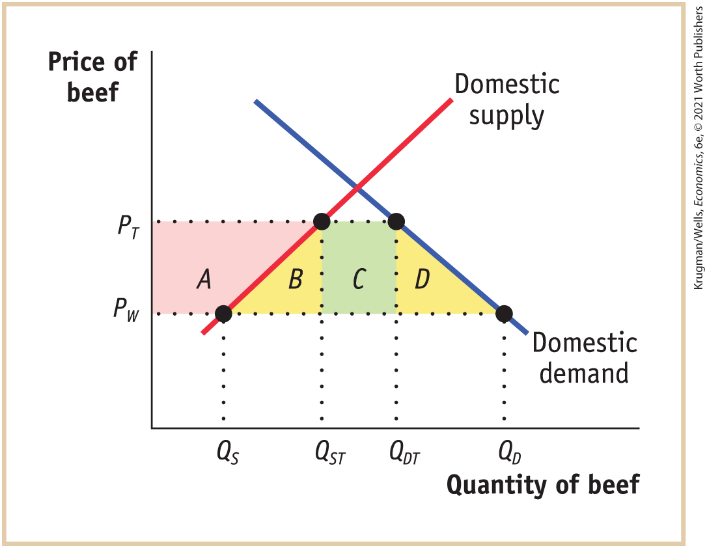
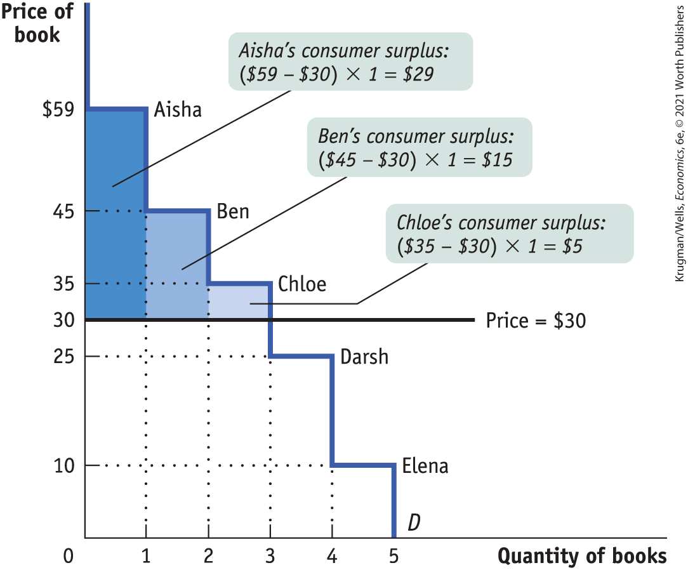
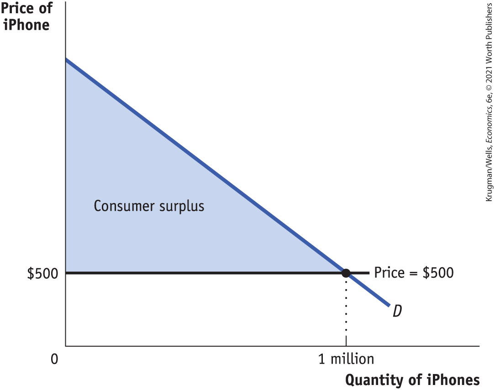

### Problems

1.  Both Canada and the United States produce lumber and footballs with constant opportunity costs. The United States can produce either 10 tons of lumber and no footballs, or 1,000 footballs and no lumber, or any combination in between. Canada can produce either 8 tons of lumber and no footballs, or 400 footballs and no lumber, or any combination in between.

    1.  Draw the U.S. and Canadian production possibility frontiers in two separate diagrams, with footballs on the horizontal axis and lumber on the vertical axis.
    2.  In autarky, if the United States wants to consume 500 footballs, how much lumber can it consume? Label this point *A* in your diagram. Similarly, if Canada wants to consume 1 ton of lumber, how many footballs can it consume in autarky? Label this point *C* in your diagram.
    3.  Which country has the absolute advantage in lumber production?
    4.  Which country has the comparative advantage in lumber production?

    Suppose each country specializes in the good in which it has the comparative advantage, and there is trade.

    5.  How many footballs does the United States produce? How much lumber does Canada produce?
    6.  Is it possible for the United States to consume 500 footballs and 7 tons of lumber? Label this point *B* in your diagram. Is it possible for Canada at the same time to consume 500 footballs and 1 ton of lumber? Label this point *D* in your diagram.

2.  For each of the following trade relationships, explain the likely source of the comparative advantage of each of the exporting countries.
    1.  The United States exports software to Venezuela, and Venezuela exports oil to the United States.
    2.  The United States exports airplanes to China, and China exports clothing to the United States.
    3.  The United States exports wheat to Colombia, and Colombia exports coffee to the United States.

3.  According to data from the U.S. Census Bureau, since 2000, the value of U.S. imports of men’s and boy’s shirts from China has more than tripled from a relatively small \$244 million in 2000 to \$753 million in 2017. What prediction does the Heckscher–Ohlin model make about the wages received by labor in China?

4.  Shoes are labor-intensive and satellites are capital-intensive to produce. The United States has abundant capital. China has abundant labor. According to the Heckscher–Ohlin model, which good will China export? Which good will the United States export? In the United States, what will happen to the price of labor (the wage) and to the price of capital?

5.  Before the North American Free Trade Agreement (NAFTA) gradually eliminated import tariffs on goods, the autarky price of tomatoes in Mexico was below the world price and in the United States was above the world price. Similarly, the autarky price of poultry in Mexico was above the world price and in the United States was below the world price. Draw diagrams with domestic supply and demand curves for each country and each of the two goods. (You will need to draw four diagrams, total.) As a result of NAFTA, the United States now imports tomatoes from Mexico and the United States now exports poultry to Mexico. How would you expect the following groups to be affected?
    1.  Mexican and U.S. consumers of tomatoes. Illustrate the effect on consumer surplus in your diagram.
    2.  Mexican and U.S. producers of tomatoes. Illustrate the effect on producer surplus in your diagram.
    3.  Mexican and U.S. tomato workers.
    4.  Mexican and U.S. consumers of poultry. Illustrate the effect on consumer surplus in your diagram.
    5.  Mexican and U.S. producers of poultry. Illustrate the effect on producer surplus in your diagram.
    6.  Mexican and U.S. poultry workers.

6.  The accompanying table indicates the U.S. domestic demand schedule and domestic supply schedule for commercial jet airplanes. Suppose that the world price of a commercial jet airplane is \$100 million.
    | Price of jet (millions) | Quantity of jets demanded | Quantity of jets supplied |
    |-------------------------|---------------------------|---------------------------|
    | \$120                   | 100                       | 1,000                     |
    | 110                     | 150                       | 900                       |
    | 100                     | 200                       | 800                       |
    | 90                      | 250                       | 700                       |
    | 80                      | 300                       | 600                       |
    | 70                      | 350                       | 500                       |
    | 60                      | 400                       | 400                       |
    | 50                      | 450                       | 300                       |
    | 40                      | 500                       | 200                       |

    1.  In autarky, how many commercial jet airplanes does the United States produce, and at what price are they bought and sold?
    2.  With trade, what will the price for commercial jet airplanes be? Will the United States import or export airplanes? How many?

7.  The accompanying table shows the U.S. domestic demand schedule and domestic supply schedule for oranges. Suppose that the world price of oranges is \$0.30 per orange.

    | Price of orange | Quantity of oranges demanded (thousands) | Quantity of oranges supplied (thousands) |
    |-----------------|------------------------------------------|------------------------------------------|
    | \$1.00          | 2                                        | 11                                       |
    | 0.90            | 4                                        | 10                                       |
    | 0.80            | 6                                        | 9                                        |
    | 0.70            | 8                                        | 8                                        |
    | 0.60            | 10                                       | 7                                        |
    | 0.50            | 12                                       | 6                                        |
    | 0.40            | 14                                       | 5                                        |
    | 0.30            | 16                                       | 4                                        |
    | 0.20            | 18                                       | 3                                        |

    1.  Draw the U.S. domestic supply curve and domestic demand curve.
    2.  With free trade, how many oranges will the United States import or export?

    Suppose that the U.S. government imposes a tariff on oranges of \$0.20 per orange.

    3.  How many oranges will the United States import or export after introduction of the tariff?
    4.  In your diagram, shade the gain or loss to the economy as a whole from the introduction of this tariff.

8.  The U.S. domestic demand schedule and domestic supply schedule for oranges was given in <a href="#kru_9781319245269_ch05_07.xhtml#pau_9781319320164_tIBGx0MWuX" id="kru_9781319245269_ch05_07.xhtml#pau_9781319320164_tIBGx0MWuA" class="crossref">Problem 7</a>. Suppose that the world price of oranges is \$0.30. The United States introduces an import quota of 3,000 oranges and assigns the quota rents to foreign orange exporters.
    1.  Draw the domestic demand and supply curves.
    2.  What will the domestic price of oranges be after introduction of the quota?
    3.  Illustrate the area representing the quota rent on your graph. What is the value of the quota rents that foreign exporters of oranges receive?

9.  The Observatory of Economic Complexity (OEC) is a data visualization that models international trade data among countries. Go to the website at <a href="http://atlas.media.mit.edu" id="kru_9781319245269_ch05_07.xhtml#pau_9781319320164_Mo0OuosQq8" class="external">atlas.media.mit.edu</a> to answer the following questions.
    1.  Start by selecting “Countries” and enter “United States” in the search bar. In 2017, what was the largest exported good (in dollars) for the United States? What was the value of exports for “Planes, Helicopters, and/or Spacecraft”? What was the largest imported good for the United States?
    2.  Repeat the steps above for Brazil. In 2017, what was the largest exported good for Brazil? What was the value of exports for, “Planes, Helicopters, and/or Spacecraft”? What was the largest imported good for the Brazil?
    3.  On the left sidebar click on the link “Explore on Visualization Page.” On the new page, in the left sidebar select “Exports,” under “Country” select “Brazil,” under “Partner” select “United States,” and then “Build Visualization.” What is the total value of Brazilian exports to the United States? What is Brazil’s largest exported good (in dollars) compared to the United States? What type of goods does Brazil generally export to the United States? What is the value of exports related to “Planes, Helicopters, and/or Spacecraft”?
    4.  Now repeat the steps from part c for exports from the United States to Brazil. Change “Country” to “United States,” change “Partner” to “Brazil,” and select “Build Visualization.” What is the total value of exports from the United States to Brazil? What is the United States’ largest export (in dollars) to Brazil? What types of goods does the United States export to Brazil? What is the value of exports related to “Planes, Helicopters, and/or Spacecraft”?

10. Comparative advantage creates an opportunity for less productive economies like Bangladesh to trade with more productive economies like the United States. Using the OEC website from <a href="#kru_9781319245269_ch05_07.xhtml#pau_9781319320164_TIM6viB4g6" id="kru_9781319245269_ch05_07.xhtml#pau_9781319320164_tIBGx0MWuB" class="crossref">Problem 9</a>, how much did Bangladesh export to the United States? What was its largest export to the United States? In general, what type of goods did Bangladesh export to the United States?

11. Once again, using the OEC website from <a href="#kru_9781319245269_ch05_07.xhtml#pau_9781319320164_TIM6viB4g6" id="kru_9781319245269_ch05_07.xhtml#pau_9781319320164_tIBGx0MWuC" class="crossref">Problems 9</a> and <a href="#kru_9781319245269_ch05_07.xhtml#pau_9781319320164_I2yGVeWLQI" id="kru_9781319245269_ch05_07.xhtml#pau_9781319320164_tIBGx0MWuD" class="crossref">10</a>, identify which country has a comparative advantage for each of the following goods. For each good, include the country’s share of global exports and the total dollar value of that share.
    1.  Computers
    2.  Maple syrup
    3.  Soybeans
    4.  Cocoa beans
    5.  Beer

12. Over the past five years the United States has become the world’s largest producer of natural gas. But gas producers have struggled to find methods to liquefy natural gas so that it can be exported across the Atlantic. Enter Cheniere Energy, a Houston-based natural gas company that has developed a natural gas export terminal located on the Sabine Pass leading into the Gulf of Mexico. The terminal will give U.S. companies access to markets all over the world.
    1.  Explain how the development of a natural gas export terminal will affect the market for natural gas in the United States.
    2.  Assuming natural gas prices are \$3.00 per BTU, illustrate the effect of an export terminal on the demand for natural gas in the United States. Explain your findings.
    3.  Assuming natural gas prices in Europe are \$6.00 per BTU, draw a diagram to illustrate how the development of a natural gas terminal in the United States will affect supply and demand in the natural gas market for Europe. Explain your findings.
    4.  How will the exporting of natural gas from the United States to Europe affect consumers and producers in both places?

13.  Access the Discovering Data exercise for Chapter 5 Problem 13 online to answer the following questions.
    1.  Rank the states in order of exports to China. Rank in order of most to fewest exports.
    2.  Calculate the growth in exports from 2002 to 2015 for each state.
    3.  As a percent of total exports, rank the states in order of most to fewest exports to China.
    4.  Explain the pattern of trade with China.

14. The accompanying diagram illustrates the U.S. domestic demand curve and domestic supply curve for beef.

    <figure id="pau_9781319320164_Uy0Vzd1zDl" class="figure lm_img_lightbox unnum c5 center">
    
    </figure>

    <aside class="hidden" id="pau_9781319320164_oqGV8NJ1lJ" title="hidden">

    The vertical axis represents Price of beef and shows two markings, P T and P W. The horizontal axis represents Quantity of beef and shows following markings: Q S, Q S T, Q D T, and Q D. The graph shows positive sloping supply curve and negative sloping demand curve that intersect each other. Two dotted lines are drawn parallel to the horizontal axis and four dotted lines are plotted vertically. The straight lines and dotted lines form four sections labeled A (area between P T, P W, and supply curve), B (area between supply curve, Q S, and Q S T), C (area between Q S T and Q D T), and D (area between Q D T, Q D, and demand curve). Four points on the graph are marked at (Q S, P W), (Q S T, P T), (Q D T, P T), and (Q D, P W).

    </aside>

    The world price of beef is $P_{W}$*.* The United States currently imposes an import tariff on beef, so the price of beef is $P_{T}$*.* Congress decides to eliminate the tariff. In terms of the areas marked in the diagram, answer the following questions.

    1.  With the elimination of the tariff what is the gain/loss in consumer surplus?
    2.  With the elimination of the tariff what is the gain/loss in producer surplus?
    3.  With the elimination of the tariff what is the gain/loss to the government?
    4.  With the elimination of the tariff what is the gain/loss to the economy as a whole?

15. As the United States has opened up to trade, it has lost many of its low-skill manufacturing jobs, but it has gained jobs in high-skill industries, such as the software industry. Explain whether the United States as a whole has been made better off by trade.

16. The United States is highly protective of its agricultural (food) industry, imposing import tariffs, and sometimes quotas, on imports of agricultural goods. This chapter presented three arguments for trade protection. For each argument, discuss whether it is a valid justification for trade protection of U.S. agricultural products.

17. In World Trade Organization (WTO) negotiations, if a country agrees to reduce trade barriers (tariffs or quotas), it usually refers to this as a *concession* to other countries. Do you think that this terminology is appropriate?

18. Producers in import-competing industries often make the following argument: “Other countries have an advantage in production of certain goods purely because workers abroad are paid lower wages. In fact, American workers are much more productive than foreign workers. So import-competing industries need to be protected.” Is this a valid argument? Explain your answer.

 **Work It Out**

19. Assume Saudi Arabia and the United States face the production possibilities for oil and cars shown in the accompanying table.
    | Saudi Arabia                          |                             | United States                         |                             |
    |---------------------------------------|-----------------------------|---------------------------------------|-----------------------------|
    | Quantity of oil (millions of barrels) | Quantity of cars (millions) | Quantity of oil (millions of barrels) | Quantity of cars (millions) |
    | 0                                     | 4                           | 0                                     | 10.0                        |
    | 200                                   | 3                           | 100                                   | 7.5                         |
    | 400                                   | 2                           | 200                                   | 5.0                         |
    | 600                                   | 1                           | 300                                   | 2.5                         |
    | 800                                   | 0                           | 400                                   | 0                           |

    1.  What is the opportunity cost of producing a car in Saudi Arabia? In the United States? What is the opportunity cost of producing a barrel of oil in Saudi Arabia? In the United States?

    2.  Which country has the comparative advantage in producing oil? In producing cars?

    3.  Suppose that in autarky, Saudi Arabia produces 200 million barrels of oil and 3 million cars; and suppose that the United States produces 300 million barrels of oil and 2.5 million cars. Without trade, can Saudi Arabia produce more oil *and* more cars? Without trade, can the United States produce more oil *and* more cars?

        Suppose now that each country specializes in the good in which it has the comparative advantage, and the two countries trade. Also assume that for each country the value of imports must equal the value of exports.

    4.  What is the total quantity of oil produced? What is the total quantity of cars produced?

    5.  Is it possible for Saudi Arabia to consume 400 million barrels of oil and 5 million cars and for the United States to consume 400 million barrels of oil and 5 million cars?

    6.  Suppose that, in fact, Saudi Arabia consumes 300 million barrels of oil and 4 million cars and the United States consumes 500 million barrels of oil and 6 million cars. How many barrels of oil does the United States import? How many cars does the United States export? Suppose a car costs \$10,000 on the world market. How much, then, does a barrel of oil cost on the world market? 

## Chapter 5 Appendix Consumer and Producer Surplus

The concepts of *consumer surplus* and *producer surplus* are extremely useful for analyzing a wide variety of economic issues. They let us calculate how much benefit producers and consumers receive from the existence of a market. They also allow us to calculate how the welfare of consumers and producers is affected by changes in market prices. Such calculations play a crucial role in evaluating economic policies, and they are especially useful in understanding the effects of trade.

All we need in order to calculate consumer surplus are the demand and supply curves for a good. That is, the supply and demand model isn’t just a model of how a competitive market works — it’s also a model of how much consumers and producers gain from participating in that market. Our starting point is the market in used textbooks, a big business in terms of dollars and cents — several billion dollars each year. More importantly for us, it is useful for developing the concepts of consumer and producer surplus.

### Consumer Surplus and the Demand Curve

Let’s look at the market for used textbooks, starting with the buyers. The key point, as we’ll see in a minute, is that the demand curve is derived from their tastes or preferences — and that those same preferences also determine how much they gain from the opportunity to buy used books.

#### Willingness to Pay and the Demand Curve

A used book is not as good as a new book — it will be battered and coffee-stained, may include someone else’s highlighting, and may not be completely up to date. How much this bothers you depends on your preferences. Some potential buyers would prefer to buy the used book even if it is only slightly cheaper than a new one; others would buy the used book only if it is considerably cheaper.

Let’s define a potential buyer’s <a href="#kru_9781319245269_EM_glossary.xhtml#pau_9781319320164_DCCQZNp8Yw" id="kru_9781319245269_ch05_app.xhtml#pau_9781319320164_lYf98GY4Ek" class="glossref" role="doc-glossref">willingness to pay</a> as the maximum price at which they would buy a good, in this case a used textbook. An individual won’t buy the book if it costs more than this amount but is eager to do so if it costs less. If the price is just equal to an individual’s willingness to pay, they are indifferent between buying and not buying.

<aside aria-label="title 1" class="glossary c3 main-flow v1" epub:type="glossary" id="pau_9781319320164_A816HkMgrl">

**willingness to pay**  
A consumer’s **willingness to pay** for a good is the maximum price at which they would buy that good.

</aside>

<a href="#kru_9781319245269_ch05_app.xhtml#pau_9781319320164_8tNH0Y988w" id="kru_9781319245269_ch05_app.xhtml#pau_9781319320164_0OkMvTbrC7" class="crossref">Table 5A-1</a> shows five potential buyers of a used book that costs \$100 new, listed in order of their willingness to pay. At one extreme is Aisha, who will buy a second-hand book even if the price is as high as \$59. Ben is less willing to have a used book and will buy one only if the price is \$45 or less. Chloe is willing to pay only \$35 and Darsh, only \$25. And Elena, who really doesn’t like the idea of a used book, will buy one only if it costs no more than \$10.

| Potential buyer | Willingness to pay | Price paid | Individual consumer surplus = Willingness to pay − Price paid |
|-----------------|--------------------|------------|---------------------------------------------------------------|
| Aisha           | \$59               | \$30       | \$29                                                          |
| Ben             | 45                 | 30         | 15                                                            |
| Chloe           | 35                 | 30         | 5                                                             |
| Darsh           | 25                 |  —         |  —                                                            |
| Elena           | 10                 |  —         |  —                                                            |
| **All buyers**  |                    |            | **Total consumer surplus = \$49**                             |

TABLE 5A-1 Consumer Surplus If the Price of a Used Textbook = \$30

How many of these five students will actually buy a used book? It depends on the price. If the price of a used book is \$55, only Aisha buys one; if the price is \$40, Aisha and Ben both buy used books, and so on. So the information in the table on willingness to pay also defines the *demand schedule* for used textbooks.

#### Willingness to Pay and Consumer Surplus

Suppose that the campus bookstore makes used textbooks available at a price of \$30. In that case Aisha, Ben, and Chloe will buy books. Do they gain from their purchases, and if so, how much?

The answer, shown in <a href="#kru_9781319245269_ch05_app.xhtml#pau_9781319320164_8tNH0Y988w" id="kru_9781319245269_ch05_app.xhtml#pau_9781319320164_6K3IC153BS" class="crossref">Table 5A-1</a>, is that each student who purchases a book does achieve a net gain but that the amount of the gain differs among students.

Aisha would have been willing to pay \$59, so her net gain is \$59 – \$30 = \$29. Ben would have been willing to pay \$45, so his net gain is \$45 – \$30 = \$15. Chloe would have been willing to pay \$35, so her net gain is \$35 – \$30 = \$5. Darsh and Elena, however, won’t be willing to buy a used book at a price of \$30, so they neither gain nor lose.

The net gain that a buyer achieves from the purchase of a good is called that buyer’s <a href="#kru_9781319245269_EM_glossary.xhtml#pau_9781319320164_UfefEN5G5c" id="kru_9781319245269_ch05_app.xhtml#pau_9781319320164_mNaTXk1uDH" class="glossref" role="doc-glossref">individual consumer surplus</a>. What we learn from this example is that whenever a buyer pays a price less than their willingness to pay, the buyer achieves some individual consumer surplus.

<aside aria-label="title 2" class="glossary c3 main-flow v1" epub:type="glossary" id="pau_9781319320164_ZfR6lFNch4">

**individual consumer surplus**  
**Individual consumer surplus** is the net gain to an individual buyer from the purchase of a good. It is equal to the difference between the buyer’s willingness to pay and the price paid.

</aside>

The sum of the individual consumer surpluses achieved by all the buyers of a good is known as the <a href="#kru_9781319245269_EM_glossary.xhtml#pau_9781319320164_OczDVVmIdr" id="kru_9781319245269_ch05_app.xhtml#pau_9781319320164_LIljJPhMPk" class="glossref" role="doc-glossref">total consumer surplus</a> achieved in the market. In <a href="#kru_9781319245269_ch05_app.xhtml#pau_9781319320164_8tNH0Y988w" id="kru_9781319245269_ch05_app.xhtml#pau_9781319320164_dPuilZ9tsi" class="crossref">Table 5A-1</a>, the total consumer surplus is the sum of the individual consumer surpluses achieved by Aisha, Ben, and Chloe: \$29 + \$15 + \$5 = \$49.

<aside aria-label="title 3" class="glossary c3 main-flow v1" epub:type="glossary" id="pau_9781319320164_jCWR4pph32">

**total consumer surplus**  
**Total consumer surplus** is the sum of the individual consumer surpluses of all the buyers of a good in a market.

</aside>

Economists often use the term <a href="#kru_9781319245269_EM_glossary.xhtml#pau_9781319320164_0s1sOd1rGj" id="kru_9781319245269_ch05_app.xhtml#pau_9781319320164_qMYvxcyXen" class="glossref" role="doc-glossref">consumer surplus</a> to refer to both individual and total consumer surplus. We will follow this practice; it will always be clear in context whether we are referring to the consumer surplus achieved by an individual or by all buyers.

<aside aria-label="title 4" class="glossary c3 main-flow v1" epub:type="glossary" id="pau_9781319320164_WvJqQwCtZ9">

**consumer surplus**  
The term **consumer surplus** is often used to refer both to individual and to total consumer surplus.

</aside>

Total consumer surplus can be represented graphically. As explained in <a href="#kru_9781319245269_ch03_01.xhtml#pau_9781319320164_ECGi4IZqUE" id="kru_9781319245269_ch05_app.xhtml#pau_9781319320164_DzjDidWUxA" class="crossref">Chapter 3</a>, we can use the demand schedule to derive the market demand curve shown in <a href="#kru_9781319245269_ch05_app.xhtml#pau_9781319320164_PrKwaX08wa" id="kru_9781319245269_ch05_app.xhtml#pau_9781319320164_1ZcKmchJBm" class="crossref">Figure 5A-1</a>. Because we are considering only a small number of consumers, this curve doesn’t look like the smooth demand curves of <a href="#kru_9781319245269_ch03_01.xhtml#pau_9781319320164_ECGi4IZqUE" id="kru_9781319245269_ch05_app.xhtml#pau_9781319320164_DzjDidWUxB" class="crossref">Chapter 3</a>, where markets contained hundreds or thousands of consumers. Instead, this demand curve is stepped, with alternating horizontal and vertical segments.

Each horizontal segment or step corresponds to one potential buyer’s willingness to pay. Each step in that demand curve is one book wide and represents one consumer. For example, the height of Aisha’s step is \$59, her willingness to pay. This step forms the top of a rectangle, with \$30 — the price she actually pays for a book — forming the bottom. The area of Aisha’s rectangle, (\$59 – \$30) × 1 = \$29, is her consumer surplus from purchasing one book at \$30. So the individual consumer surplus Aisha gains is the *area of the dark blue rectangle* shown in <a href="#kru_9781319245269_ch05_app.xhtml#pau_9781319320164_PrKwaX08wa" id="kru_9781319245269_ch05_app.xhtml#pau_9781319320164_BBbTf0gpjV" class="crossref">Figure 5A-1</a>.

<figure id="pau_9781319320164_PrKwaX08wa" class="figure lm_img_lightbox num c3 main-flow">

<figcaption>
FIGURE 5A-1 Consumer Surplus in the Used-Textbook Market

At a price of $30, Aisha, Ben, and Chloe each buy a book but Darsh and Elena do not. Aisha, Ben, and Chloe receive individual consumer surpluses equal to the difference between their willingness to pay and the price, illustrated by the areas of the shaded rectangles. Both Darsh and Elena have a willingness to pay less than $30, so they are unwilling to buy a book in this market; they receive zero consumer surplus. The total consumer surplus is given by the entire shaded area — the sum of the individual consumer surpluses of Aisha, Ben, and Chloe — equal to $29 + $15 + $5 = $49.
</figcaption>
</figure>

<aside class="hidden" id="pau_9781319320164_SYAP7fbeUE" title="hidden">

The vertical axis, labeled Price of books ranges from 0 to 59 dollars with marks at 10, 25, 30, 35, 45, and 59 dollars. The horizontal axis, labeled Quantity of books ranges from 0 to 5 in increments of 1. The demand curve shows five steps at five different prices, descending from left to right through (1, 59), (2, 45), (3, 35), (4, 25), and (5, 10). Aisha’s willingness to pay is 59 dollars; Ben’s, 45 dollars; and Chloe’s, 35 dollars. These are above the horizontal price line that corresponds to 30 dollars. Below this line, Darsh’s willingness to pay, 25 dollars, and Elena’s willingness to pay, 10 dollars. The rectangular area formed by the demand curve and price line between the quantities 0 and 1 is shaded and labeled, “Aisha’s consumer surplus is 59 dollars minus 30 dollars times 1 equals 29 dollars.” The rectangular area formed by the demand curve and price line between the quantities 1 and 2 is shaded and labeled, “Ben’s consumer surplus is 45 dollar minus 30 dollar times 1 equals 15.” The rectangular area formed by the demand curve and price line between the quantities 2 and 3 is shaded and labeled, “Chloe’s consumer surplus is 35 dollars minus 30 dollars times 1 equals 5.”

</aside>

In addition to Aisha, Ben, and Chloe will also each buy a book when the price is \$30. Like Aisha, they benefit from their purchases, though not as much, because they each have a lower willingness to pay. <a href="#kru_9781319245269_ch05_app.xhtml#pau_9781319320164_PrKwaX08wa" id="kru_9781319245269_ch05_app.xhtml#pau_9781319320164_5rSjeeHTuT" class="crossref">Figure 5A-1</a> also shows the consumer surplus gained by Ben and Chloe; again, this can be measured by the areas of the appropriate rectangles. Darsh and Elena, because they do not buy books at a price of \$30, receive no consumer surplus.

The total consumer surplus achieved in this market is just the sum of the individual consumer surpluses received by Aisha, Ben, and Chloe. So total consumer surplus is equal to the combined area of the three rectangles — the entire shaded area in <a href="#kru_9781319245269_ch05_app.xhtml#pau_9781319320164_PrKwaX08wa" id="kru_9781319245269_ch05_app.xhtml#pau_9781319320164_y21PQqcFDB" class="crossref">Figure 5A-1</a>. Another way to say this: total consumer surplus is equal to the area below the demand curve but above the price.

This illustrates the following general principle: *The total consumer surplus generated by purchases of a good at a given price is equal to the area below the demand curve but above that price.* The same principle applies regardless of the number of consumers.

For large markets, such as the market for smartphones that was used in the chapter, this graphical representation of consumer surplus becomes extremely helpful. Consider, for example, the sales of iPhones to millions of potential buyers. Each potential buyer has a maximum price that they are willing to pay. With so many potential buyers, the demand curve will be smooth, like the one shown in <a href="#kru_9781319245269_ch05_app.xhtml#pau_9781319320164_vb77DcuCh3" id="kru_9781319245269_ch05_app.xhtml#pau_9781319320164_BBPtDvmE5B" class="crossref">Figure 5A-2</a>.

<figure id="pau_9781319320164_vb77DcuCh3" class="figure lm_img_lightbox num c3 main-flow">

<figcaption>
FIGURE 5A-2 Consumer Surplus

The demand curve for iPhones is smooth because there are many potential buyers. At a price of $500, 1 million iPhones are demanded. The consumer surplus at this price is equal to the shaded area: the area below the demand curve but above the price. This is the total net gain to consumers generated from buying and consuming iPhones when the price is $500.
</figcaption>
</figure>

<aside class="hidden" id="pau_9781319320164_USxVdUWKZU" title="hidden">

The graph plots price of iPhone along the vertical axis against quantity of iPhones along the horizontal axis. A horizontal line, labeled Price corresponds to 500 dollars along the vertical axis. A negative sloping demand curve D intersects the price line at a quantity of 1 million. The area enclosed by the demand curve, price line, and the vertical axis is shaded and labeled, “Consumer surplus.”

</aside>

Suppose that at a price of \$500, a total of 1 million iPhones are purchased. How much do consumers gain from being able to buy those 1 million iPhones? We could answer that question by calculating the consumer surplus of each individual buyer and then adding these numbers up to arrive at a total. But it is much easier just to look at <a href="#kru_9781319245269_ch05_app.xhtml#pau_9781319320164_vb77DcuCh3" id="kru_9781319245269_ch05_app.xhtml#pau_9781319320164_DXgETNSW1I" class="crossref">Figure 5A-2</a> and use the fact that total consumer surplus is equal to the shaded area. As in our original example, consumer surplus is equal to the area below the demand curve but above the price. (To refresh your memory on how to calculate the area of a right triangle, see the <a href="#kru_9781319245269_ch02_app.xhtml#pau_9781319320164_ijzynakgVM" id="kru_9781319245269_ch05_app.xhtml#pau_9781319320164_ijzynakgVA" class="crossref">appendix to Chapter 2</a>.)

### Producer Surplus and the Supply Curve

Just as some buyers of a good would have been willing to pay more for their purchase than the price they actually pay, some sellers of a good would have been willing to sell it for less than the price they actually receive. So just as there are consumers who receive consumer surplus from buying in a market, there are producers who receive producer surplus from selling in a market.
