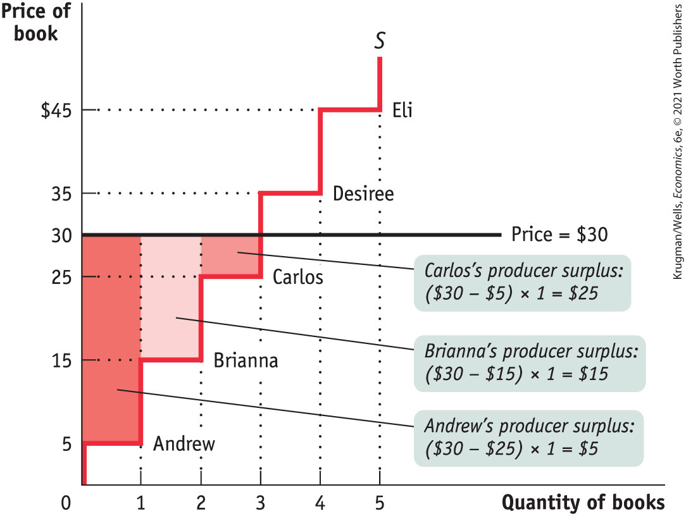
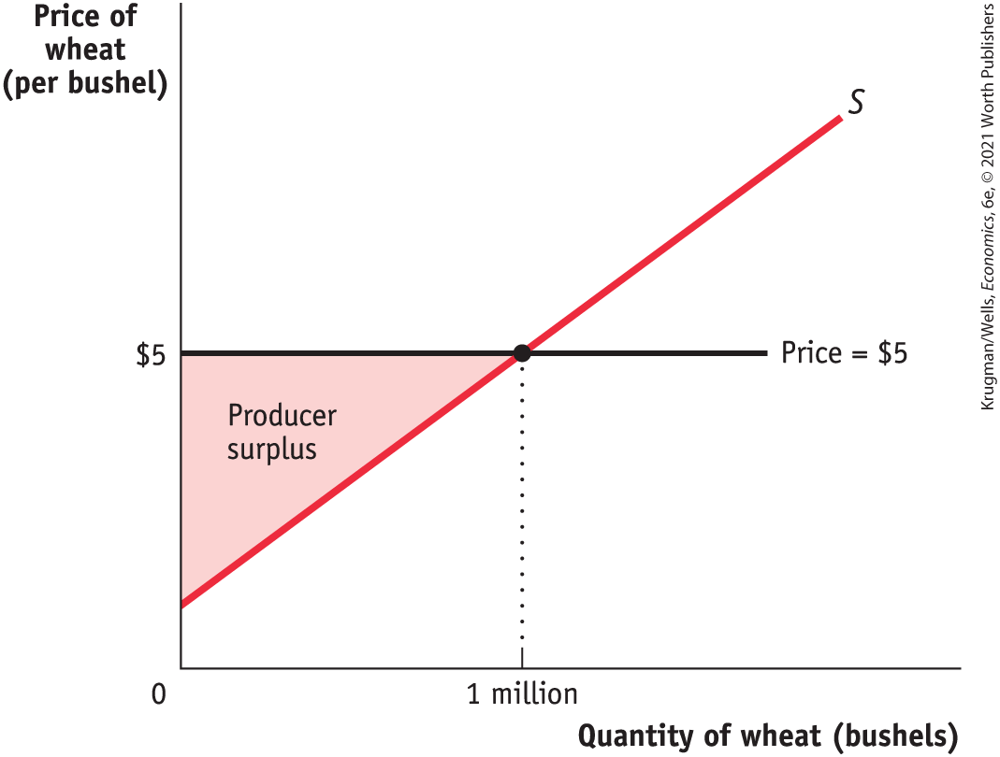
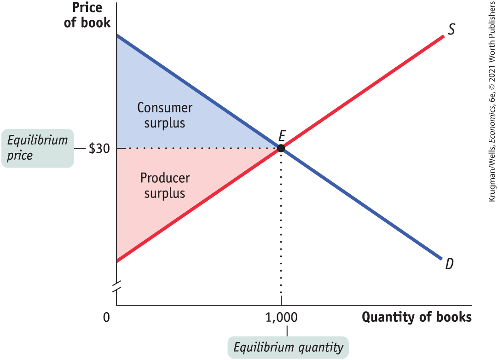
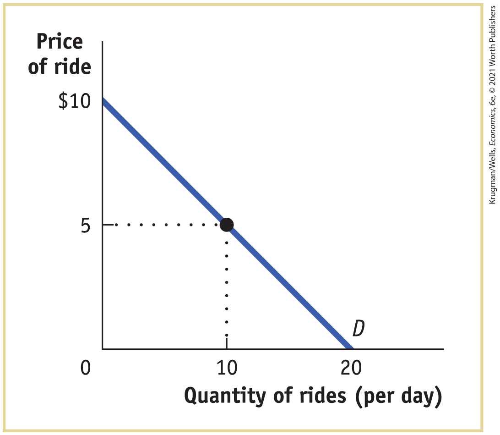
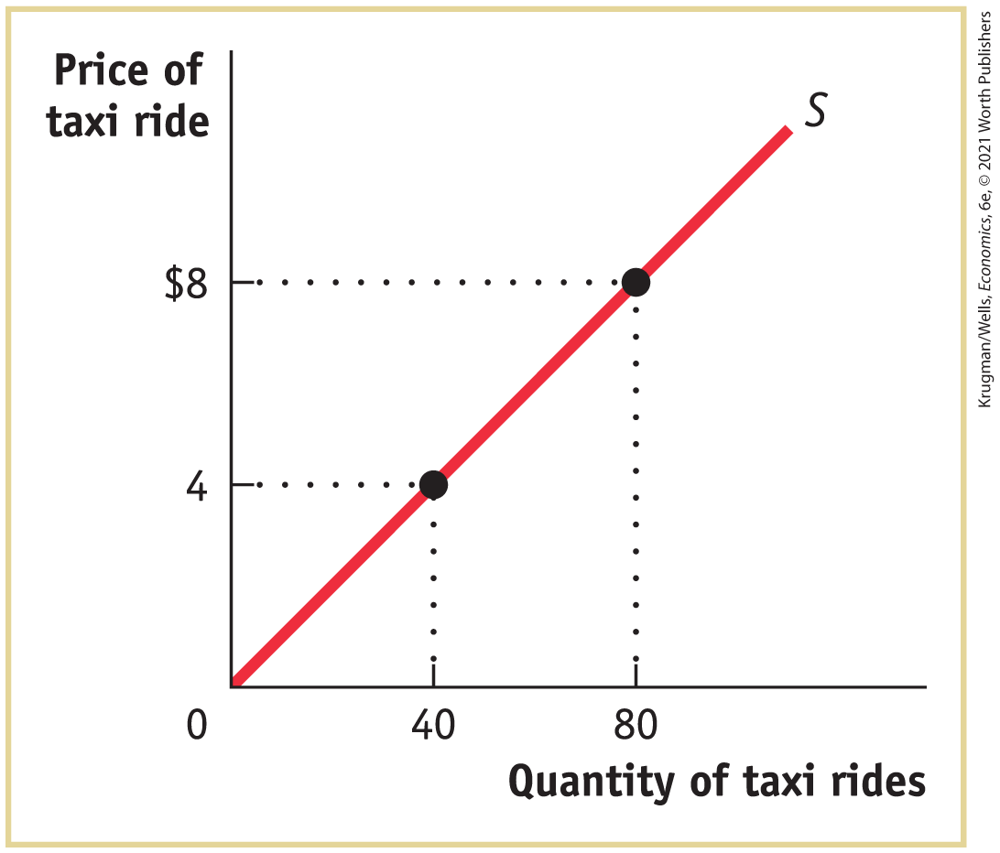

#### Cost and Producer Surplus

Consider a group of students who are potential sellers of used textbooks. Because they have different preferences, the various potential sellers differ in the price at which they are willing to sell their books. <a href="#kru_9781319245269_ch05_app.xhtml#pau_9781319320164_eBSKM8GaN6" id="kru_9781319245269_ch05_app.xhtml#pau_9781319320164_apVUd7gG37" class="crossref">Table 5A-2</a> shows the prices at which several different students would be willing to sell. Andrew is willing to sell the book as long as he can get at least \$5; Brianna won’t sell unless she can get at least \$15; Carlos, unless he can get \$25; Desiree, unless she can get \$35; Eli, unless he can get \$45.

| Potential seller | Cost | Price received | Individual producer surplus = Price received − Cost |
|------------------|------|----------------|-----------------------------------------------------|
| Andrew           | \$5  | \$30           | \$25                                                |
| Brianna          | 15   | 30             | 15                                                  |
| Carlos           | 25   | 30             | 5                                                   |
| Desiree          | 35   |  —             |  —                                                  |
| Eli              | 45   |  —             |  —                                                  |
| **All sellers**  |      |                | **Total producer surplus = \$45**                   |

TABLE 5A-2 Producer Surplus When the Price of a Used Textbook = \$30

The lowest price at which a potential seller is willing to sell has a special name in economics: it is called the seller’s <a href="#kru_9781319245269_EM_glossary.xhtml#pau_9781319320164_B2xfBm763U" id="kru_9781319245269_ch05_app.xhtml#pau_9781319320164_XsGJmYh36W" class="glossref" role="doc-glossref">cost</a>. So Andrew’s cost is \$5, Brianna’s is \$15, and so on.

<aside aria-label="title 5" class="glossary c3 main-flow v1" epub:type="glossary" id="pau_9781319320164_kdsbvQ3mqz">

**cost**  
A seller’s **cost** is the lowest price at which they are willing to sell a good.

</aside>

Using the term *cost*, which people normally associate with the monetary cost of producing a good, may sound a little strange when applied to sellers of used textbooks. The students don’t have to manufacture the books, so it doesn’t cost the student who sells a used textbook anything to make that book available for sale, does it?

Yes, it does. A student who sells a book won’t have it later, as part of their personal collection. So there is an *opportunity* cost to selling a textbook, even if the owner has completed the course for which it was required. And remember that one of the basic principles of economics is that the true measure of the cost of doing something is always its opportunity cost. That is, the real cost of something is what you must give up to get it.

So it is good economics to talk of the minimum price at which someone will sell a good as the “cost” of selling that good, even if they doesn’t spend any money to make the good available for sale. Of course, in most real-world markets the sellers are also those who produce the good and therefore *do* spend money to make it available for sale. In this case, the cost of making the good available for sale includes monetary costs, but it may also include other opportunity costs.

Getting back to the example, suppose that Andrew sells his book for \$30. Clearly he has gained from the transaction: he would have been willing to sell for only \$5, so he has gained \$25. This net gain, the difference between the price he actually gets and his cost — the minimum price at which he would have been willing to sell — is known as his <a href="#kru_9781319245269_EM_glossary.xhtml#pau_9781319320164_oEeleWfmHM" id="kru_9781319245269_ch05_app.xhtml#pau_9781319320164_5EykM17XZz" class="glossref" role="doc-glossref">individual producer surplus</a>.

<aside aria-label="title 6" class="glossary c3 main-flow v1" epub:type="glossary" id="pau_9781319320164_2wSuMvmBiU">

**individual producer surplus**  
**Individual producer surplus** is the net gain to an individual seller from selling a good. It is equal to the difference between the price received and the seller’s cost.

</aside>

As in the case of consumer surplus, we can add the individual producer surpluses of sellers to calculate the <a href="#kru_9781319245269_EM_glossary.xhtml#pau_9781319320164_wvw5zuSkPE" id="kru_9781319245269_ch05_app.xhtml#pau_9781319320164_IoGTrF7LYO" class="glossref" role="doc-glossref">total producer surplus</a>, the total net gain to all sellers in the market. Economists use the term <a href="#kru_9781319245269_EM_glossary.xhtml#pau_9781319320164_Viboi0Ng7P" id="kru_9781319245269_ch05_app.xhtml#pau_9781319320164_0MJGH7VpbP" class="glossref" role="doc-glossref">producer surplus</a> to refer to either individual or total producer surplus. <a href="#kru_9781319245269_ch05_app.xhtml#pau_9781319320164_eBSKM8GaN6" id="kru_9781319245269_ch05_app.xhtml#pau_9781319320164_2CG0myWgvP" class="crossref">Table 5A-2</a> shows the net gain to each of the students who would sell a used book at a price of \$30: \$25 for Andrew, \$15 for Brianna and \$5 for Carlos. The total producer surplus is \$25 + \$15 + \$5 = \$45.

<aside aria-label="title 7" class="glossary c3 main-flow v1" epub:type="glossary" id="pau_9781319320164_pwWBpgmyeX">

**total producer surplus**  
**Total producer surplus** is the sum of the individual producer surpluses of all the sellers of a good in a market.

</aside>
<aside aria-label="title 8" class="glossary c3 main-flow v1" epub:type="glossary" id="pau_9781319320164_F7jm9W7Vay">

**producer surplus**  
Economists use the term **producer surplus** to refer both to individual and to total producer surplus.

</aside>

As with consumer surplus, the producer surplus gained by those who sell books can be represented graphically. Just as we derived the demand curve from the willingness to pay of different consumers, we derive the supply curve from the cost of different producers. The step-shaped curve in <a href="#kru_9781319245269_ch05_app.xhtml#pau_9781319320164_3E3MRJwZU7" id="kru_9781319245269_ch05_app.xhtml#pau_9781319320164_0khqOwpR8T" class="crossref">Figure 5A-3</a> shows the supply curve implied by the cost shown in <a href="#kru_9781319245269_ch05_app.xhtml#pau_9781319320164_eBSKM8GaN6" id="kru_9781319245269_ch05_app.xhtml#pau_9781319320164_FGFUOvlEoU" class="crossref">Table 5A-2</a>. Each step in that supply curve is one book wide and represents one seller. The height of Andrew’s step is \$5, his cost. This forms the bottom of a rectangle, with \$30, the price he actually receives for his book, forming the top. The area of this rectangle, (\$30 – \$5) × 1 = \$25, is his producer surplus. So the producer surplus Andrew gains from selling his book is the *area of the red rectangle* shown in the figure.

<figure id="pau_9781319320164_3E3MRJwZU7" class="figure lm_img_lightbox num c3 main-flow">

<figcaption>
FIGURE 5A-3 Producer Surplus in the Used-Textbook Market

At a price of $30, Andrew, Brianna, and Carlos each sell a book but Desiree and Eli do not. Andrew, Brianna, and Carlos get individual producer surpluses equal to the difference between the price and their cost, illustrated here by the shaded rectangles. Desiree and Eli each have a cost that is greater than the price of $30, so they are unwilling to sell a book and so receive zero producer surplus. The total producer surplus is given by the entire shaded area, the sum of the individual producer surpluses of Andrew, Brianna, and Carlos, equal to $25 + $15 + $5 = $45.
</figcaption>
</figure>

<aside class="hidden" id="pau_9781319320164_4UGD77w8RR" title="hidden">

The vertical axis, labeled Price of book ranges from 0 to 45 dollars with marks at 10, 25, 30, 35, and 45. The horizontal axis, labeled Quantity of books ranges from 0 to 5, in increments of 1. The supply curve shows five steps at different prices, extending through (1, 5), (2, 15), (3, 25), (4, 35), and (5, 45). A horizontal line labeled price runs parallel to the horizontal axis, from (0, 30) to the right. Andrew sells a book at 5 dollars; Brianna, 15 dollars; Carlos, 25 dollars; Desiree, 35 dollars; and Eli, 45 dollars. The rectangular area formed by the supply curve and price line between the quantities 0 and 1 is shaded and labeled, “Andrew’s producer surplus is 30 dollars minus 25 dollars times 1 equals 5 dollars.” The rectangular area formed by the supply curve and price line between the quantities 1 and 2 is shaded and labeled, “Brianna’s producer surplus is 30 dollars minus 15 dollars times 1 equals 15 dollars.” The rectangular area formed by the supply curve and price line between the quantities 2 and 3 is shaded and labeled, “Carlos’s producer surplus is 30 dollars minus 25 dollars times 1 equals 25 dollars.”

</aside>

Let’s assume that the campus bookstore is willing to buy all the used copies of this book that students are willing to sell at a price of \$30. Then, in addition to Andrew, Brianna and Carlos will also sell their books. They will also benefit from their sales, though not as much as Andrew, because they have higher costs. Andrew, as we have seen, gains \$25. Brianna gains a smaller amount: since her cost is \$15, she gains only \$15. Carlos gains even less, only \$5.

Again, as with consumer surplus, we have a general rule for determining the total producer surplus from sales of a good: *The total producer surplus from sales of a good at a given price is the area above the supply curve but below that price.*

This rule applies both to examples like the one shown in <a href="#kru_9781319245269_ch05_app.xhtml#pau_9781319320164_3E3MRJwZU7" id="kru_9781319245269_ch05_app.xhtml#pau_9781319320164_TwQStw4FxE" class="crossref">Figure 5A-3</a>, where there are a small number of producers and a step-shaped supply curve, and to more realistic examples, where there are many producers and the supply curve is smooth.

Consider, for example, the supply of wheat. <a href="#kru_9781319245269_ch05_app.xhtml#pau_9781319320164_r2ihcu9HG5" id="kru_9781319245269_ch05_app.xhtml#pau_9781319320164_JLKjnEE3dG" class="crossref">Figure 5A-4</a> shows how producer surplus depends on the price per bushel. Suppose that, as shown in the figure, the price is \$5 per bushel and farmers supply 1 million bushels. What is the benefit to the farmers from selling their wheat at a price of \$5? Their producer surplus is equal to the shaded area in the figure — the area above the supply curve but below the price of \$5 per bushel.

<figure id="pau_9781319320164_r2ihcu9HG5" class="figure lm_img_lightbox num c3 main-flow">

<figcaption>
FIGURE 5A-4 Producer Surplus

Here is the supply curve for wheat. At a price of $5 per bushel, farmers supply 1 million bushels. The producer surplus at this price is equal to the shaded area: the area above the supply curve but below the price. This is the total gain to producers — farmers in this case — from supplying their product when the price is $5.
</figcaption>
</figure>

<aside class="hidden" id="pau_9781319320164_BY9cbdmYDw" title="hidden">

The vertical axis is labeled Price of wheat (per bushel), and the horizontal axis is labeled Quantity of wheat (in bushels). The supply curve S is a positive sloping line that rises to the right from a price below 5 dollars on the vertical axis. A horizontal line runs parallel to the horizontal axis from 5 dollars of price, and intersects the positive sloping supply curve S at a quantity of 1 million. The area of the shaded triangle below the price line and above the supply curve gives the producer surplus.

</aside>

### The Gains from Trade

Let’s return to the market for used textbooks, but now consider a much bigger market — say, one at a large state university. There are many potential buyers and sellers, so the market is competitive. Let’s line up incoming students who are potential buyers of a book in order of their willingness to pay, so that the entering student with the highest willingness to pay is potential buyer number 1, the student with the next highest willingness to pay is number 2, and so on. Then we can use their willingness to pay to derive a demand curve like the one in <a href="#kru_9781319245269_ch05_app.xhtml#pau_9781319320164_uJnuk8gM6R" id="kru_9781319245269_ch05_app.xhtml#pau_9781319320164_yE4m664XTq" class="crossref">Figure 5A-5</a>.

<figure id="pau_9781319320164_uJnuk8gM6R" class="figure lm_img_lightbox num c3 main-flow">

<figcaption>
FIGURE 5A-5 Total Surplus

In the market for used textbooks, the equilibrium price is $30 and the equilibrium quantity is 1,000 books. Consumer surplus is given by the blue area, the area below the demand curve but above the price. Producer surplus is given by the red area, the area above the supply curve but below the price. The sum of the blue and the red areas is total surplus, the total benefit to society from the production and consumption of the good.
</figcaption>
</figure>

<aside class="hidden" id="pau_9781319320164_Du3bmKQ4YZ" title="hidden">

The graph has the price of book in dollars along the vertical axis and the quantity of books along the horizontal axis. A positive sloping supply curve S and a negative sloping demand curve D intersect each other at point E (1000, 30). 30 dollars is the equilibrium price, and 1000 is the equilibrium quantity. The triangular area bound by the vertical axis and the demand curve, above the equilibrium price line, is labeled Consumer surplus. The triangular area bound by the vertical axis and the supply curve, below the equilibrium price line, is labeled Producer surplus.

</aside>

Similarly, we can line up outgoing students, who are potential sellers of the book, in order of their cost — starting with the student with the lowest cost, then the student with the next lowest cost, and so on — to derive a supply curve like the one shown in the same figure.

As we have drawn the curves, the market reaches equilibrium at a price of \$30 per book, and 1,000 books are bought and sold at that price. The two shaded triangles show the consumer surplus (blue) and the producer surplus (red) generated by this market. The sum of consumer and producer surplus is known as the <a href="#kru_9781319245269_EM_glossary.xhtml#pau_9781319320164_XH5zwAuA1J" id="kru_9781319245269_ch05_app.xhtml#pau_9781319320164_a0qCG6lNdi" class="glossref" role="doc-glossref">total surplus</a> generated in a market.

<aside aria-label="title 9" class="glossary c3 main-flow v1" epub:type="glossary" id="pau_9781319320164_3pT8rslSM2">

**total surplus**  
The **total surplus** generated in a market is the total net gain to consumers and producers from trading in the market. It is the sum of the producer and the consumer surplus.

</aside>

The striking thing about this picture is that both consumers and producers gain — that is, both consumers and producers are better off because there is a market in this good. But this should come as no surprise — it illustrates another core principle of economics that you learned about in earlier chapters: *There are gains from trade.* These gains from trade are the reason everyone is better off participating in a market economy than they would be if each individual tried to be self-sufficient.

### Problems

1.  Determine the amount of consumer surplus generated in each of the following situations.
    1.  Bo goes to the clothing store to buy a new T-shirt, for which he is willing to pay up to \$10. He picks out one he likes with a price tag of exactly \$10. When he is paying for it, he learns that the T-shirt has been discounted by 50%.
    2.  Alberto goes to the music store hoping to find a used copy of Nirvana’s *Nevermind* for up to \$30. The store has one copy of the record selling for \$30, which he purchases.
    3.  After soccer practice, Stephany is willing to pay \$2 for a bottle of mineral water. The 7-Eleven sells mineral water for \$2.25 per bottle, so she declines to purchase it.

2.  Determine the amount of producer surplus generated in each of the following situations.
    1.  Conner lists his old Lionel electric trains on eBay. He sets a minimum acceptable price, known as his reserve price, of \$75. After five days of bidding, the final high bid is exactly \$75. He accepts the bid.
    2.  So-Hee advertises her car for sale in the used-car section of the student newspaper for \$2,000, but she is willing to sell the car for any price higher than \$1,500. The best offer she gets is \$1,200, which she declines.
    3.  Sanjay likes his job so much that he would be willing to do it for free. However, his annual salary is \$80,000.

3.  You are the manager of Fun World, a small amusement park. The accompanying diagram shows the demand curve of a typical customer at Fun World.

    <figure id="pau_9781319320164_49CkRN1ICU" class="figure lm_img_lightbox unnum c4 center">
    
    </figure>

    <aside class="hidden" id="pau_9781319320164_cpsn9xuwRI" title="hidden">

    The vertical axis is labeled Price of taxi ride with marks at 4 and 8 dollars. The horizontal axis is labeled Quantity of taxi rides with marks at 40 and 80. A positive sloping supply curve starts from the origin and passes through points (40, 4) and (80, 8). Dotted straight lines from points (40, 4) and (80, 8) meet the axes.

    </aside>

    1.  Suppose that the price of each ride is \$5. At that price, how much consumer surplus does an individual consumer get? (Recall that the area of a right triangle is $\frac{1}{2}$ × the height of the triangle × the base of the triangle.)
    2.  Suppose that Fun World considers charging an admission fee, even though it maintains the price of each ride at \$5. What is the maximum admission fee it could charge? (Assume that all potential customers have enough money to pay the fee.)
    3.  Suppose that Fun World lowered the price of each ride to zero. How much consumer surplus does an individual consumer get? What is the maximum admission fee Fun World could charge?

4.  The accompanying diagram illustrates a taxi driver’s individual supply curve (assume that each taxi ride is the same distance).

    <figure id="pau_9781319320164_IQkxB7ZeE1" class="figure lm_img_lightbox unnum c4 center">
    
    </figure>

    <aside class="hidden" id="pau_9781319320164_kJtlGEBG6B" title="hidden">

    The vertical axis is labeled Price of ride with marks at 5 and 10 dollars. The horizontal axis is labeled Quantity of rides with marks at 10 and 20. A negative sloping demand curve D extends between (0, 10) and (20, 0). Dotted straight lines from point (10, 5) on the demand curve meet the axes.

    </aside>

    1.  Suppose the city sets the price of taxi rides at \$4 per ride, and at \$4 the taxi driver is able to sell as many taxi rides as they desire. What is this taxi driver’s producer surplus? (Recall that the area of a right triangle is $\frac{1}{2}$ × the height of the triangle × the base of the triangle.)
    2.  Suppose that the city keeps the price of a taxi ride set at \$4, but it decides to charge taxi drivers a “licensing fee.” What is the maximum licensing fee the city could extract from this taxi driver?
    3.  Suppose that the city allowed the price of taxi rides to increase to \$8 per ride. Again assume that, at this price, the taxi driver sells as many rides as they are willing to offer. How much producer surplus does an individual taxi driver now get? What is the maximum licensing fee the city could charge this taxi driver?
