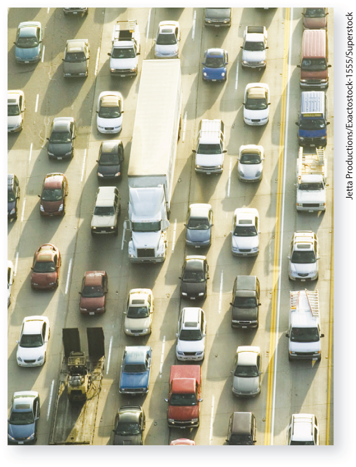
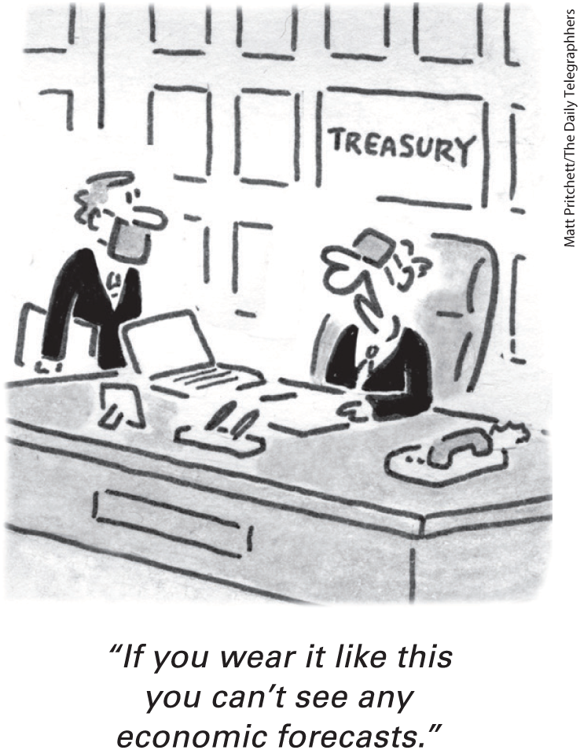
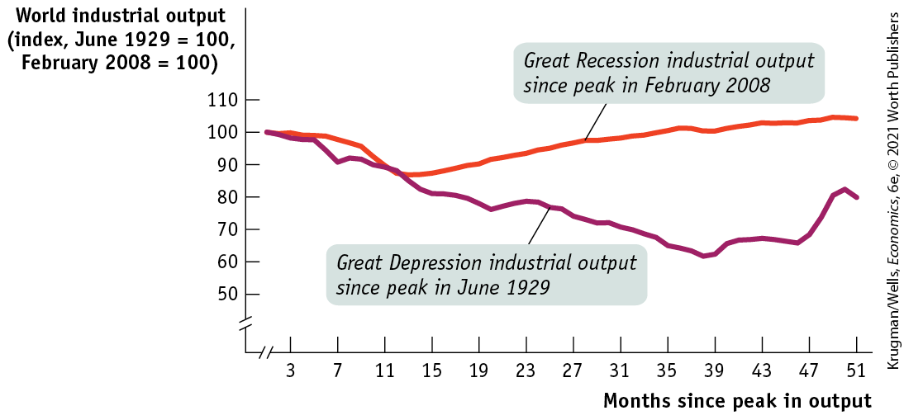
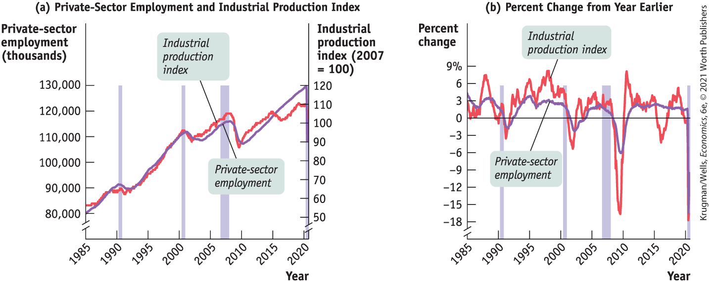

# Chapter 6 Macroeconomics: The Big Picture

## Greek Tragedies

<figure id="pau_9781319320164_WzXa3XFE9x" class="figure lm_img_lightbox unnum c2 right">

<figcaption>
<strong>Greeks in Germany, where the jobs are.</strong>
</figcaption>
</figure>

**CONSTANTINE KAKOYIANNIS**, An Engineer, grew up in Greece. But these days he lives in Dusseldorf, Germany. He’s one of many Greeks who have settled there since 2010, so many that Dusseldorf has become known as a “mini-Athens.”

Why did he and so many others leave home? Because there were no jobs. In 2016, when Kakoyiannis left, Greece’s *unemployment rate* — the percentage of those looking for work who couldn’t find it — was 24%. As of December 2019, unemployment in Greece had fallen but was still 16.5%. For the sake of comparison, in the United States the unemployment rate was only 3.5% although it shot up to 14.7% a few months later when the economy was locked down in an attempt to limit the spread of COVID-19.

Yet Greece hasn’t always had sky-high unemployment. In 2007 the unemployment rate was only about 8%. Greece was still poorer than northern European countries like Germany, but it had been doing relatively well, and Greeks were feeling optimistic about their prospects.

Then Greece plunged into a severe economic downturn — a *recession* — which led to a collapse in employment. Many businesses went bust and people suffered economic hardship. And Greece wasn’t alone. After 2007, much of the world, including the United States, plunged into a deep recession, which came to be known as the *Great Recession*. By 2019 the United States had mostly recovered, but some parts of Europe, Greece in particular, had not.

Yet, as bad as things were during the Great Recession, the global economy had seen much worse. Beginning in 1929, a severe global economic slump known as the *Great Depression* hit and lasted over a decade, until the start of World War II in 1940. The Great Recession was less severe than the Great Depression for many reasons. But one significant factor was that economists had learned something about what to do from the earlier catastrophe. As the Great Depression began in 1929, political leaders and their economic advisers had no idea what policies might help or hinder recovery.

*Microeconomics,* which is concerned with the consumption and production decisions of individual consumers and producers and with the allocation of scarce resources among industries, was already a well-developed branch of economics. But *macroeconomics,* which focuses on the behavior of the economy as a whole, was still in its infancy. In contrast, by 2007 macroeconomics had advanced enough that economists knew what needed to be done when the Great Recession hit.

In normal economic times, when there is no recession or depression, workers who lose their jobs are able to find employment somewhere else. However, the Great Depression was no normal time: in the United States the unemployment rate hit 23% and the value of the economy’s output (GDP) fell by 26%. Economists realized that they needed to understand the nature of the catastrophe that had overtaken the United States and much of the rest of the world in order to extricate themselves, as well as to learn how to avoid such economic disasters in the future. To this day, the effort to understand economic slumps and find ways to prevent them is at the core of macroeconomics. Over time, however, macroeconomics has broadened its reach to encompass a number of other subjects, such as long-run economic growth, inflation, and international macroeconomics.

This chapter offers an overview of macroeconomics. We start with a general description of the difference between macroeconomics and microeconomics, then briefly describe some of the field’s major concerns. 

<aside class="learning-objectives c3 main-flow v3" epub:type="learning-objectives" id="pau_9781319320164_z2t4CcFQ1y">

### What you will learn

- What is the difference between macroeconomics and microeconomics?
- What are **business cycles** and why do policy makers try to diminish their severity?
- How does **long-run economic growth** determine a country’s standard of living?
- What are **inflation** and **deflation**, and why is **price stability** preferred?
- Why does **international macroeconomics** matter, and how do economies interact through **trade deficits** and **trade surpluses?**

</aside>

## The Nature of Macroeconomics

Macroeconomics differs from microeconomics by focusing on the behavior of the economy as a whole.

### Macroeconomic Questions

<a href="#kru_9781319245269_ch06_02.xhtml#pau_9781319320164_l4aq7Hr2nf" id="kru_9781319245269_ch06_02.xhtml#pau_9781319320164_cCtntj6F7D" class="crossref">Table 6-1</a> lists some typical economic questions from the perspectives of microeconomists in the left column, and macroeconomists in the right column. By comparing the questions, you can begin to get a sense of the difference between microeconomics and macroeconomics.

| Microeconomic Questions                                                                                 | Macroeconomic Questions                                                                                                         |
|---------------------------------------------------------------------------------------------------------|---------------------------------------------------------------------------------------------------------------------------------|
| Should I go to business school or take a job right now?                                                 | How many people are employed in the economy as a whole this year?                                                               |
| What determines the salary Google offers to Cherie Camajo, a new MBA?                                   | What determines the overall salary levels paid to workers in a given year?                                                      |
| What determines the cost to a university or college of offering a new course?                           | What determines the overall level of prices in the economy as a whole?                                                          |
| What government policies should be adopted to make it easier for low-income students to attend college? | What government policies should be adopted to promote employment and growth in the economy as a whole?                          |
| What determines whether Citibank opens a new office in Shanghai?                                        | What determines the overall trade in goods, services, and financial assets between the United States and the rest of the world? |
| Why was there a shortage of toilet paper during the coronavirus pandemic?                               | How did a fall in consumer spending during the pandemic affect overall employment?                                              |

TABLE 6-1 Microeconomic versus Macroeconomic Questions

As these questions illustrate, microeconomics focuses on how decisions are made by individuals and firms and the consequences of those decisions. For example, we use microeconomics to determine how much it would cost a university or college to offer a new course, including the instructor’s salary, the cost of class materials, and so on. The school can then decide whether to offer the course by weighing the costs and benefits.

Macroeconomics, in contrast, examines the *overall* behavior of the economy — how the actions of all the individuals and firms in the economy interact to produce a particular economy-wide level of economic performance. For example, macroeconomics is concerned with the general level of prices in the economy and how high or how low that level is relative to the general level of prices last year, rather than with the price of one particular good or service.

You might imagine that macroeconomic questions can be answered simply by adding up microeconomic answers. For example, the model of supply and demand introduced in <a href="#kru_9781319245269_ch03_01.xhtml#pau_9781319320164_ECGi4IZqUE" id="kru_9781319245269_ch06_02.xhtml#pau_9781319320164_DzjDidWUxd" class="crossref">Chapter 3</a> tells us how the equilibrium price of an individual good or service is determined in a competitive market. So you might think that applying supply and demand analysis to every good and service in the economy, then summing the results, is the way to understand the overall level of prices in the economy as a whole.

But that is incorrect: although basic concepts such as supply and demand are essential to macroeconomics, answering macroeconomic questions requires an additional set of tools and an expanded frame of reference.

### Macroeconomics: The Whole Is Greater Than the Sum of Its Parts

<figure id="pau_9781319320164_0dcvIZTJOR" class="figure lm_img_lightbox unnum c2 right">

<figcaption>
Just as individual actions on the road can unintentionally lead to a traffic jam, individual actions in the economy can produce an unintended macroeconomic effect.
</figcaption>
</figure>

If you drive on a highway, you probably know what a rubbernecking traffic jam is and why it is so annoying. Someone pulls over to the side of the road, perhaps to fix a flat tire, and, pretty soon, a long traffic jam occurs as drivers slow down to take a look.

What makes it so annoying is that the length of the traffic jam is greatly out of proportion to the minor event that precipitated it. Because some drivers hit their brakes to rubberneck, the drivers behind them must also hit their brakes, those behind them must do the same, and so on. The accumulation of all the individual hitting of brakes eventually leads to a long, wasteful traffic jam as each driver slows down a little bit more than the driver ahead. In other words, each person’s response leads to an amplified response by the next person.

Understanding rubbernecking gives us some insight into one very important way in which macroeconomics differs from microeconomics: many thousands or millions of individual actions compound upon one another to produce an outcome that isn’t simply the sum of those individual actions.

Consider, for example, what macroeconomists call the *paradox of thrift:* when families and businesses are worried about the possibility of economic hard times, they prepare by cutting their spending. This reduction in spending depresses the economy as consumers spend less and businesses react by laying off workers. As a result, families and businesses may end up worse off than if they hadn’t tried to act responsibly by cutting their spending.

This is a paradox because seemingly virtuous behavior — preparing for hard times by saving more — ends up harming everyone. The flip-side to this story is that when families and businesses are feeling optimistic about the future, they spend more today. This stimulates the economy, leading businesses to hire more workers, which further expands the economy. Seemingly profligate behavior leads to good times for all.

A key insight of macroeconomics, then, is that the combined effect of individual decisions can have results that are very different from what any one individual intended, results that are sometimes perverse. The behavior of the macroeconomy is, indeed, greater than the sum of individual actions and market outcomes.

### Macroeconomics: Theory and Policy

<figure id="pau_9781319320164_ZzvdE4Fnv5" class="figure lm_img_lightbox unnum c2 right">

</figure>

To a much greater extent than microeconomists, macroeconomists are concerned with questions about *policy,* about what the government can do to make macroeconomic performance better. This policy focus was strongly shaped by history, in particular by the Great Depression of the 1930s.

Before the 1930s, economists tended to regard the economy as <a href="#kru_9781319245269_EM_glossary.xhtml#pau_9781319320164_tFMVnFhrDD" id="kru_9781319245269_ch06_02.xhtml#pau_9781319320164_bZrGWFD99V" class="glossref" role="doc-glossref">self-regulating</a>: they believed that problems such as unemployment would be corrected through the working of the “invisible hand” and that government attempts to improve the economy’s performance would be ineffective at best — and would probably make things worse.

<aside aria-label="title 1" class="glossary c3 main-flow v1" epub:type="glossary" id="pau_9781319320164_kP8P9FLDjQ">

**self-regulating economy**  
In a **self-regulating economy**, problems such as unemployment are resolved without government intervention, through the working of the invisible hand.

</aside>

The Great Depression changed all that. The sheer scale of the catastrophe, which left a quarter of the U.S. workforce without jobs and threatened the political stability of many countries, created a demand for action. It also led to a major effort on the part of economists to understand economic slumps and find ways to prevent them.

In 1936 the British economist John Maynard Keynes (pronounced “canes”) published *The General Theory of Employment, Interest, and Money*, a book that transformed macroeconomics. According to <a href="#kru_9781319245269_EM_glossary.xhtml#pau_9781319320164_kf4AmDsrin" id="kru_9781319245269_ch06_02.xhtml#pau_9781319320164_PD2cjzgACA" class="glossref" role="doc-glossref">Keynesian economics</a>, a depressed economy is the result of inadequate spending. In addition, Keynes argued that government intervention can help a depressed economy through *monetary policy* and *fiscal policy.* <a href="#kru_9781319245269_EM_glossary.xhtml#pau_9781319320164_6jEQeNkEog" id="kru_9781319245269_ch06_02.xhtml#pau_9781319320164_D2aj4F1nL0" class="glossref" role="doc-glossref">Monetary policy</a> uses changes in the quantity of money to alter interest rates, which in turn affect the level of overall spending. <a href="#kru_9781319245269_EM_glossary.xhtml#pau_9781319320164_3NcWsJYOD5" id="kru_9781319245269_ch06_02.xhtml#pau_9781319320164_uYsI6kMQ39" class="glossref" role="doc-glossref">Fiscal policy</a> uses changes in taxes and government spending to affect overall spending.

<aside aria-label="title 2" class="glossary c3 main-flow v1" epub:type="glossary" id="pau_9781319320164_AM5t9s7DI3">

**Keynesian economics**  
According to **Keynesian economics**, economic slumps are caused by inadequate spending, and they can be mitigated by government intervention.

</aside>
<aside aria-label="title 3" class="glossary c3 main-flow v1" epub:type="glossary" id="pau_9781319320164_hOqspxEVE7">

**monetary policy**  
**Monetary policy** uses changes in the quantity of money to alter interest rates and affect overall spending.

</aside>
<aside aria-label="title 4" class="glossary c3 main-flow v1" epub:type="glossary" id="pau_9781319320164_fDxjBk6oWf">

**fiscal policy**  
**Fiscal policy** uses changes in government spending and taxes to affect overall spending.

</aside>

In general, Keynes established the idea that managing the economy is a government responsibility. Keynesian ideas continue to have a strong influence on both economic theory and public policy: in 2008 and 2009, Congress, the White House, and the Federal Reserve (a quasi-governmental agency that manages U.S. monetary policy) took steps to fend off an economic slump that were clearly Keynesian in spirit, as described in the following Economics in Action.

### ECONOMICS \>\> *in Action*

Fending Off Depression

In 2008 the world economy experienced a severe financial crisis reminiscent of the early days of the Great Depression. Major banks teetered on the edge of collapse and world trade slumped. In reviewing the 2009 data, economic historians Barry Eichengreen and Kevin O’Rourke pointed out that “globally we are tracking or even doing worse than the Great Depression.”

But the worst did not, in the end, come to pass. <a href="#kru_9781319245269_ch06_02.xhtml#pau_9781319320164_mQ0Z1X0t9T" id="kru_9781319245269_ch06_02.xhtml#pau_9781319320164_j6VwNkjZVy" class="crossref">Figure 6-1</a> shows one of Eichengreen and O’Rourke’s measures of economic activity, world industrial production, during the Great Depression (the bottom line) and during the Great Recession (the top line). During the first year the two crises were indeed comparable. But fortunately, 11 months into the Great Recession, world production leveled off and turned around. In contrast, three years into the Great Depression world production continued to fall. Why the difference?

<figure id="pau_9781319320164_mQ0Z1X0t9T" class="figure lm_img_lightbox num c3 main-flow">

<figcaption>
FIGURE 6-1 World Industrial Output in Two Slumps

<em>Data from:</em> Barry Eichengreen and Kevin O’Rourke (2009), “A Tale of Two Depressions.” © <a href="http://VoxEU.org" id="kru_9781319245269_ch06_02.xhtml#pau_9781319320164_oSO7mjSAxx" class="external">VoxEU.org</a>; CPB Netherlands Bureau for Economic Policy Analysis World Trade Monitor.
</figcaption>
</figure>

<aside class="hidden" id="pau_9781319320164_Y8vh7whzBw" title="hidden">

The horizontal axis labeled Months since peak in output is truncated and ranges from 3 to 51, in increments of 4. The vertical axis labeled World industrial output (index, June 1929 equals 100, February 2008 equals 100) is truncated and ranges from 50 to 110, in increments of 10. The graph shows two curves. The curve labeled Great Depression industrial output since peak in June 1929 slopes downward from (1, 100), continues to slope downward until (39, 60), and then be-gins to rise and end at (51, 80). The curve labeled Great Recession industrial output since peak in February 2008 slopes downward from approximately (1, 100), continues to gradually slope downward until (13, 87), and then on gradually rises to end at (51, 100).

</aside>

At least part of the answer is that policy makers responded very differently. During the Great Depression, it was widely argued that the slump should be allowed to run its course. Any attempt to mitigate the ongoing catastrophe, declared Joseph Schumpeter — the Austrian-born Harvard economist now famed for his work on innovation — would “leave the work of depression undone.” In the early 1930s, some countries’ monetary authorities actually raised interest rates in the face of the slump, while governments cut spending and raised taxes — actions that deepened the recession.

In the aftermath of the 2008 crisis, by contrast, interest rates were slashed, and a number of countries, the United States included, used temporary increases in spending and reductions in taxes in an attempt to sustain spending. Governments also moved to shore up their banks with loans, aid, and guarantees.

Many of these measures were controversial, to say the least. But most economists believe that by responding actively to the Great Recession — and doing so using the knowledge gained from the study of macroeconomics — governments helped avoid a global economic catastrophe.

### *\>\> Quick Review*

- Microeconomics focuses on decision making by individuals and firms and the consequences of the decisions made. Macroeconomics focuses on the overall behavior of the economy.
- The combined effect of individual actions can have unintended consequences and lead to worse or better macroeconomic outcomes for everyone.
- Before the 1930s, economists tended to regard the economy as **self-regulating.** After the Great Depression, **Keynesian economics** provided the rationale for government intervention through **monetary policy** and **fiscal policy** to help a depressed economy.

### *\>\> Check Your Understanding* 6-1

1.  Which of the following questions involve microeconomics, and which involve macroeconomics? In each case, explain your answer.
    1.  Why did consumers switch to smaller cars in 2008?
    2.  Why did overall consumer spending slow down in 2008?
    3.  Why did the standard of living rise more rapidly in the first generation after World War II than in the second?
    4.  Why have starting salaries for students with economics degrees risen sharply as of late?
    5.  What determines the choice between rail and road transportation?
    6.  Why did laptops get much cheaper between 2000 and 2017?
    7.  Why did inflation fall in the 2010s?
2.  In 2008, problems in the financial sector led to a drying up of credit around the country: home-buyers were unable to get mortgages, students were unable to get student loans, car-buyers were unable to get car loans, and so on.
    1.  Explain how the drying up of credit can lead to compounding effects throughout the economy and result in an economic slump.
    2.  If you believe the economy is self-regulating, what would you advocate that policy makers do?
    3.  If you believe in Keynesian economics, what would you advocate that policy makers do?

## The Business Cycle

The Great Depression was by far the worst economic crisis in U.S. history. Although the economy managed to avoid catastrophe in the decades that followed, it has experienced many ups and downs.

It’s true that the ups have consistently been bigger than the downs: a chart of any of the major numbers used to track the U.S. economy shows a strong upward trend over time. For example, panel (a) of <a href="#kru_9781319245269_ch06_03.xhtml#pau_9781319320164_lXhhADe5CT" id="kru_9781319245269_ch06_03.xhtml#pau_9781319320164_bXF9IiIn7t" class="crossref">Figure 6-2</a> shows total U.S. private-sector employment (the total number of jobs offered by private businesses) measured along the left vertical axis, with the data from 1985 to 2020 given by the purple line. The graph also shows the index of industrial production (a measure of the total output of U.S. factories) measured along the right vertical axis, with the data from 1985 to 2020 given by the red line. Both private-sector employment and industrial production were much higher at the end of this period than at the beginning, and in most years both measures rose.

<figure id="pau_9781319320164_lXhhADe5CT" class="figure lm_img_lightbox num c4 center">

<figcaption>
FIGURE 6-2 U.S. Growth, Interrupted, 1985–2020

Panel (a) shows two important economic numbers, the industrial production index and total private-sector employment. Both numbers grew substantially from 1985 to 2020, but they didn’t grow steadily. Instead, both suffered from downturns associated with recessions, which are indicated by the shaded areas in the figure. Panel (b) emphasizes those downturns by showing the annual rate of change of industrial production and employment, that is, the percentage increase over the past year. The simultaneous downturns in both numbers during the recessions are clear.

<em>Data from:</em> Federal Reserve Bank of St. Louis.
</figcaption>
</figure>

<aside class="hidden" id="pau_9781319320164_ZLxBhcvWPh" title="hidden">

Graph (a) plots Private-sector employment (thousands) versus Year. The horizontal axis plots Years from 1985 to 2020, in increments of 5 years. The vertical axis labeled Private-sector employment (thousands) on the left is truncated and ranges from 80,000 to 130,000, in increments of 10,000. The vertical axis labeled Industrial production index (2007 equals 100) on the right is truncated and ranges from 50 to 120, in increments of 10. The graph has shaded vertical areas at 1991, 2001, between 2006 to 2007, and 2020.The graph shows two curves labeled Industrial production index and Private-sector employment. The curve representing Industrial production index has a positive slope as it extends through the approximated points (1985, 52), (1991, 66), (2001, 95), (2006 to 2007, 108), (2008, 85), (2015, 109), and (2020, 110). The curve labeled Private-sector employment has a positive slope as it extends through the approximated points (1985, 80,000), (1991, 91,000), (2001, 111,000), (2006 to 2007, 115,000), (2010, 108,000), and (2020, 130,000). The curve then falls vertically down to 110,000 during early months of 2020. Graph (b) plots Percent Change versus Year. The horizontal axis plots Year from 1985 to 2020, in increments of 5 years. The vertical axis labeled percent change is truncated and ranges from negative 18 percent to 9 percent, in increments of 3 percent. The graph has shaded vertical areas at 1991, 2001, between 2006 to 2007, and 2020. The graph shows two curves labeled Industrial production index and Private-sector employment. The curve representing Industrial production index curve mostly ranges between negative 5 and 8 percent along. The lowest points are approximated at (1992, negative 4), (2002, negative 6), and (2009, negative 17). The highest points are approximated at (1987, 7.5), (1997, 8), and (2011, 8). The curve then falls vertically down to negative 18, during early months of 2020. The curve representing Private-sector employment mostly ranges between negative 5 percent and 5 percent. The lowest points are approximated at (1992, negative 2), (2002, negative 3), and (2009, negative 6). The highest points are approximated at (1987, 3.5), (1994, 4), and (2011, 3). The curve then falls vertically down to negative 16, during early months of 2020.

</aside>

But they didn’t rise steadily. As you can see from the figure, there were four periods — in the early 1990s, in the early 2000s, beginning in late 2007, and again in 2020 — when both employment and industrial output stumbled. Panel (b) emphasizes these stumbles by showing the *rate of change* of employment and industrial production over the previous year. For example, the percent change in employment for October 2009 was −0.6 because employment in October 2009 was 0.6% lower than it had been in October 2008. The big downturns stand out clearly. What’s more, a detailed look at the data makes it clear that in each period the stumble wasn’t confined to only a few industries: in each downturn, just about every sector of the U.S. economy cut back on production and on the number of people employed.

The economy’s forward march, in other words, isn’t smooth. And the uneven pace of the economy’s progress, its ups and downs, is one of the main preoccupations of macroeconomics.
