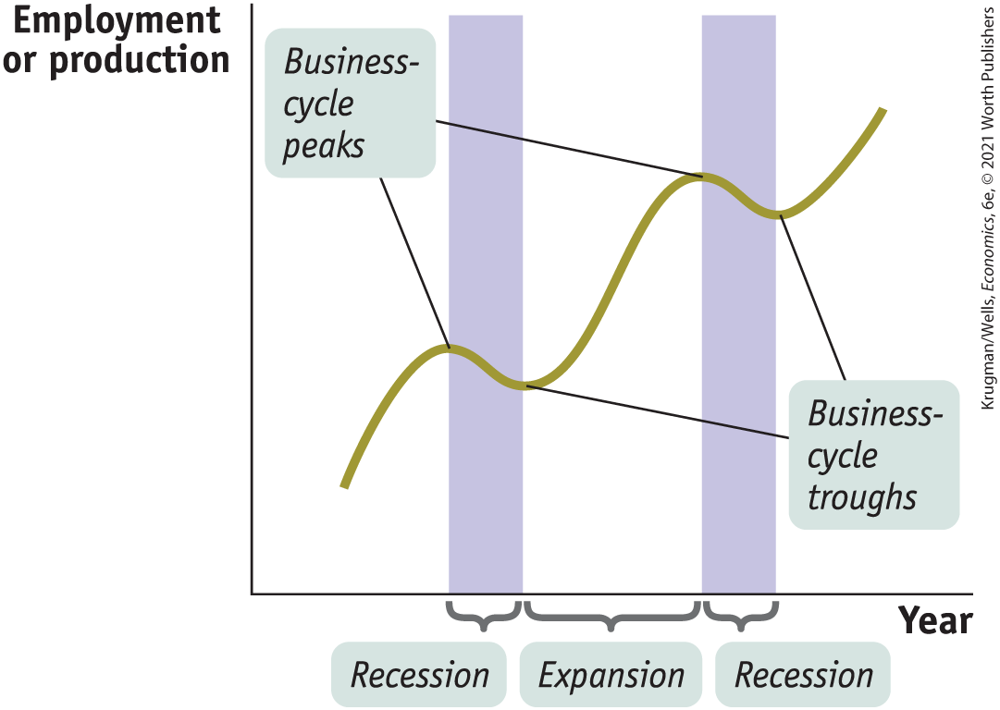
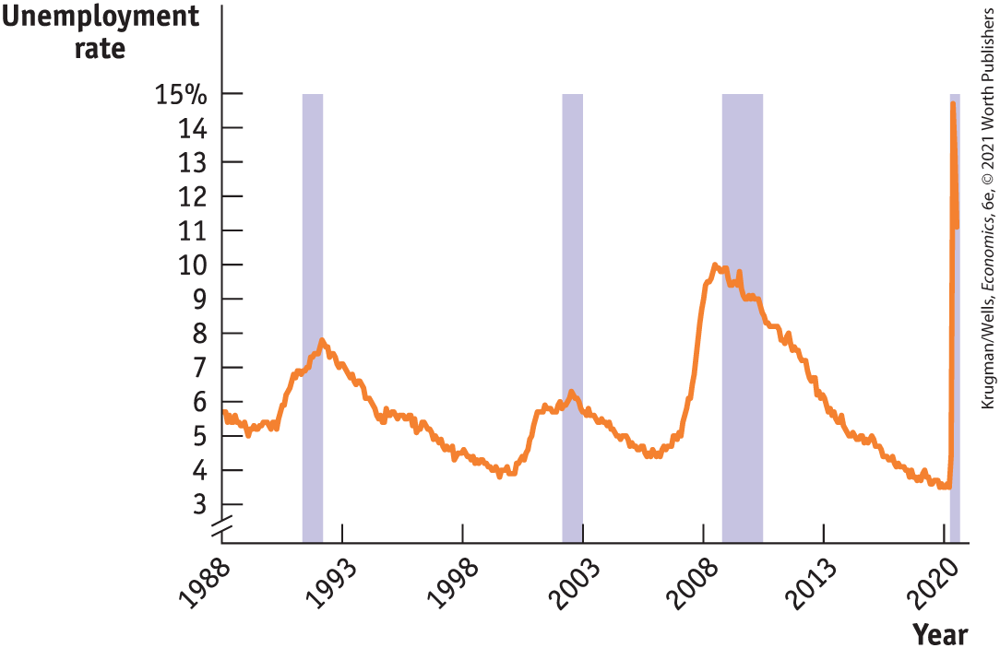
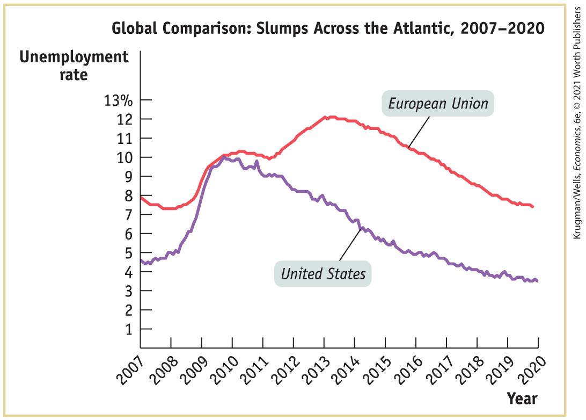
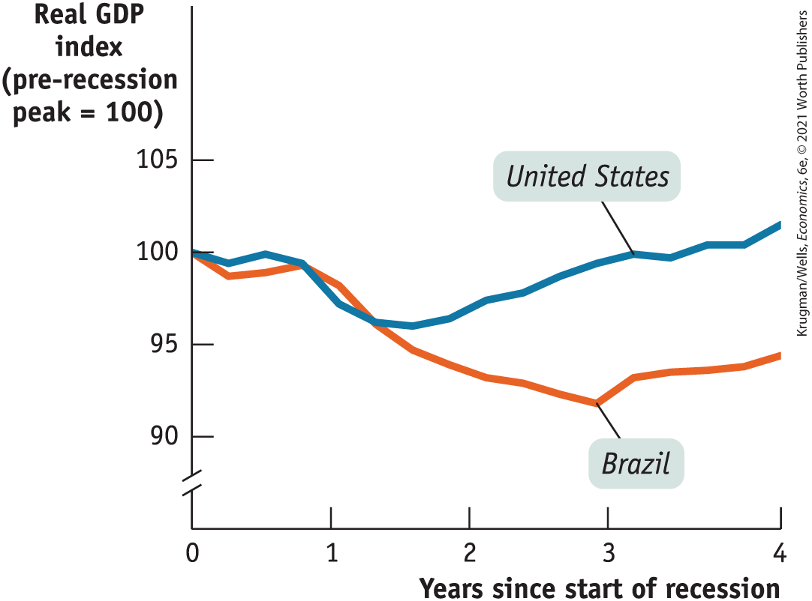
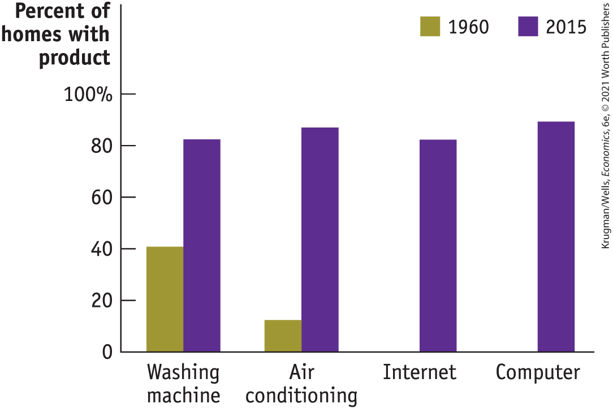
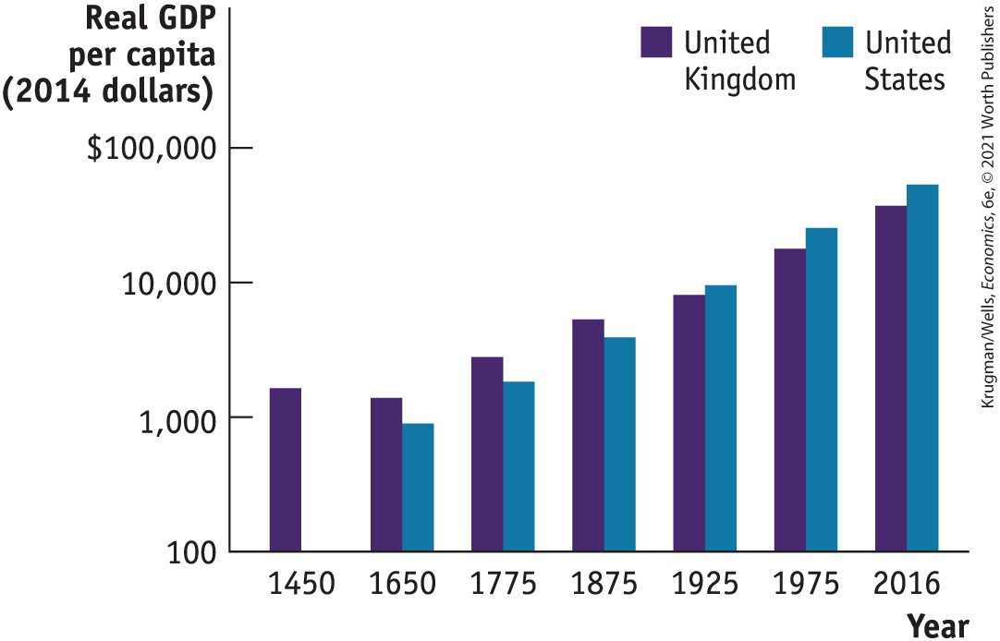

### Charting the Business Cycle

<a href="#kru_9781319245269_ch06_03.xhtml#pau_9781319320164_pnYezSZoBm" id="kru_9781319245269_ch06_03.xhtml#pau_9781319320164_Pqi8wkuC81" class="crossref">Figure 6-3</a> shows a stylized representation of the way the economy evolves over time. The vertical axis shows either employment or an indicator of how much the economy is producing, such as industrial production or *real gross domestic product (real GDP),* a measure of the economy’s overall output that we’ll learn about in <a href="#kru_9781319245269_ch07_01.xhtml#pau_9781319320164_J4fyDEWkvv" id="kru_9781319245269_ch06_03.xhtml#pau_9781319320164_kFPU00unRx" class="crossref">Chapter 7</a>. As the data in <a href="#kru_9781319245269_ch06_03.xhtml#pau_9781319320164_lXhhADe5CT" id="kru_9781319245269_ch06_03.xhtml#pau_9781319320164_MPI1QJz0fk" class="crossref">Figure 6-2</a> suggest, these two measures tend to move together. Their common movement is the starting point for a major theme of macroeconomics: the economy’s alternation between short-run downturns and upturns.

<figure id="pau_9781319320164_pnYezSZoBm" class="figure lm_img_lightbox num c3 main-flow">

<figcaption>
FIGURE 6-3 The Business Cycle

This is a stylized picture of the business cycle. The vertical axis measures either employment or total output in the economy. Periods when these two variables turn down are <em>recessions;</em> periods when they turn up are <em>expansions.</em> The point at which the economy turns down is a <em>business-cycle peak;</em> the point at which it turns up again is a <em>business-cycle trough.</em>
</figcaption>
</figure>

<aside class="hidden" id="pau_9781319320164_83lICalt2t" title="hidden">

The graph plots Employment or production versus Year. The horizontal axis is labeled Year, and the vertical axis is labeled Employment or production. The graph shows a curve, with two peaks and two troughs, with a positive slope. The peaks are labeled “Business cycle peaks” and the troughs are labeled “business cycle troughs.” The portion of the curve from the first peak to the first trough is labeled Recession. The portion of the curve from the first peak to the second peak is labeled expansion. The portion of the curve from the second peak to the immediate trough is labeled Recession.

</aside>

A widespread downturn, in which output and employment in many industries fall, is called a <a href="#kru_9781319245269_EM_glossary.xhtml#pau_9781319320164_IYJxsxSf0C" id="kru_9781319245269_ch06_03.xhtml#pau_9781319320164_qepl0rJ4qa" class="glossref" role="doc-glossref">recession</a> (sometimes referred to as a *contraction*). Recessions are officially declared by the National Bureau of Economic Research, or NBER (discussed in the upcoming For Inquiring Minds), and are indicated by the shaded areas in <a href="#kru_9781319245269_ch06_03.xhtml#pau_9781319320164_lXhhADe5CT" id="kru_9781319245269_ch06_03.xhtml#pau_9781319320164_cUiWRUX66i" class="crossref">Figure 6-2</a>. When the economy isn’t in a recession, when most economic numbers are following their normal upward trend, the economy is said to be in an <a href="#kru_9781319245269_EM_glossary.xhtml#pau_9781319320164_Y5LrxIYMMD" id="kru_9781319245269_ch06_03.xhtml#pau_9781319320164_y2aaH5o0Tl" class="glossref" role="doc-glossref">expansion</a> (sometimes referred to as a *recovery*).

<aside aria-label="title 1" class="glossary c3 main-flow v1" epub:type="glossary" id="pau_9781319320164_4dyHRBlkle">

**recessions**  
**Recessions**, or contractions, are periods of economic downturn when output and employment are falling.

</aside>
<aside aria-label="title 2" class="glossary c3 main-flow v1" epub:type="glossary" id="pau_9781319320164_fQoJC2R76Q">

**expansions**  
**Expansions**, or recoveries, are periods of economic upturn when output and employment are rising.

</aside>

The alternation between recessions and expansions is known as the <a href="#kru_9781319245269_EM_glossary.xhtml#pau_9781319320164_v7gHo5Gss8" id="kru_9781319245269_ch06_03.xhtml#pau_9781319320164_kYHVYV7AOK" class="glossref" role="doc-glossref">business cycle</a>. The point in time at which the economy shifts from expansion to recession is known as a <a href="#kru_9781319245269_EM_glossary.xhtml#pau_9781319320164_jwlEv9tXiD" id="kru_9781319245269_ch06_03.xhtml#pau_9781319320164_pwsKeLHMXv" class="glossref" role="doc-glossref">business-cycle peak</a>**;** the point at which the economy shifts from recession to expansion is known as a <a href="#kru_9781319245269_EM_glossary.xhtml#pau_9781319320164_ekWwjYP9LB" id="kru_9781319245269_ch06_03.xhtml#pau_9781319320164_XlqnYo6whM" class="glossref" role="doc-glossref">business-cycle trough</a>.

<aside aria-label="title 3" class="glossary c3 main-flow v1" epub:type="glossary" id="pau_9781319320164_OVcSblbWwi">

**business cycle**  
The **business cycle** is the short-run alternation between recessions and expansions.

</aside>
<aside aria-label="title 4" class="glossary c3 main-flow v1" epub:type="glossary" id="pau_9781319320164_TDX2EmQDB6">

**business-cycle peak**  
The point at which the economy turns from expansion to recession is a **business-cycle peak.**

</aside>
<aside aria-label="title 5" class="glossary c3 main-flow v1" epub:type="glossary" id="pau_9781319320164_ZMrAyDJTOO">

**business-cycle trough**  
The point at which the economy turns from recession to expansion is a **business-cycle trough.**

</aside>

The business cycle is an enduring feature of the economy. <a href="#kru_9781319245269_ch06_03.xhtml#pau_9781319320164_mhEbOWWBQz" id="kru_9781319245269_ch06_03.xhtml#pau_9781319320164_FnAeKyPO3o" class="crossref">Table 6-2</a> shows the official list of business-cycle peaks and troughs. As you can see, there have been recessions and expansions for at least the past 160 years. Whenever there is a prolonged expansion, as there was in the 1960s and again in the 1990s, books and articles come out proclaiming the end of the business cycle. Such proclamations have always been proved wrong: the cycle always comes back.

<table id="pau_9781319320164_mhEbOWWBQz" class="table sectioned c2 center">
<caption>
TABLE 6-2 The History of the Business Cycle
</caption>
<colgroup>
<col style="width: 50%" />
<col style="width: 50%" />
</colgroup>
<thead>
<tr id="pau_9781319320164_bKPw3wENXd" class="header">
<th id="pau_9781319320164_6Yjyn5Ucny" class="left v3 rule-r" scope="col">Business-cycle peak</th>
<th id="pau_9781319320164_nOZuOcUuX9" class="left v3" scope="col">Business-cycle trough</th>
</tr>
</thead>
<tbody>
<tr id="pau_9781319320164_yIdi1KXyVh" class="odd">
<td id="pau_9781319320164_hSIIVgKO6K" class="left v4 rule-r"><ul>
<li><em>no prior data available</em></li>
<li>June 1857</li>
<li>October 1860</li>
<li>April 1865</li>
<li>June 1869</li>
<li>October 1873</li>
</ul></td>
<td id="pau_9781319320164_CmnacSX5I7" class="left v4"><ul>
<li>December 1854</li>
<li>December 1858</li>
<li>June 1861</li>
<li>December 1867</li>
<li>December 1870</li>
<li>March 1879</li>
</ul></td>
</tr>
<tr id="pau_9781319320164_BYgXMkuRtS" class="even">
<td id="pau_9781319320164_9B3q8DYXEC" class="left v3 rule-r"><ul>
<li>March 1882</li>
<li>March 1887</li>
<li>July 1890</li>
<li>January 1893</li>
<li>December 1895</li>
</ul></td>
<td id="pau_9781319320164_GjQeVGvIaT" class="left v3"><ul>
<li>May 1885</li>
<li>April 1888</li>
<li>May 1891</li>
<li>June 1894</li>
<li>June 1897</li>
</ul></td>
</tr>
<tr id="pau_9781319320164_QipdTEvjSx" class="odd">
<td id="pau_9781319320164_V2djwktfvk" class="left v4 rule-r"><ul>
<li>June 1899</li>
<li>September 1902</li>
<li>May 1907</li>
<li>January 1910</li>
<li>January 1913</li>
</ul></td>
<td id="pau_9781319320164_WifKqak8U8" class="left v4"><ul>
<li>December 1900</li>
<li>August 1904</li>
<li>June 1908</li>
<li>January 1912</li>
<li>December 1914</li>
</ul></td>
</tr>
<tr id="pau_9781319320164_oYrS6ddbEc" class="even">
<td id="pau_9781319320164_m61iG4d8Bf" class="left v3 rule-r"><ul>
<li>August 1918</li>
<li>January 1920</li>
<li>May 1923</li>
<li>October 1926</li>
<li>August 1929</li>
</ul></td>
<td id="pau_9781319320164_lOKBdekKmy" class="left v3"><ul>
<li>March 1919</li>
<li>July 1921</li>
<li>July 1924</li>
<li>November 1927</li>
<li>March 1933</li>
</ul></td>
</tr>
<tr id="pau_9781319320164_DsB2OKNedn" class="odd">
<td id="pau_9781319320164_UbfxVsdMG1" class="left v4 rule-r"><ul>
<li>May 1937</li>
<li>February 1945</li>
<li>November 1948</li>
<li>July 1953</li>
<li>August 1957</li>
</ul></td>
<td id="pau_9781319320164_sspbXJAJdD" class="left v4"><ul>
<li>June 1938</li>
<li>October 1945</li>
<li>October 1949</li>
<li>May 1954</li>
<li>April 1958</li>
</ul></td>
</tr>
<tr id="pau_9781319320164_PyjuLGXLjW" class="even">
<td id="pau_9781319320164_4tniMMv6DI" class="left v3 rule-r"><ul>
<li>April 1960</li>
<li>December 1969</li>
<li>November 1973</li>
<li>January 1980</li>
<li>July 1981</li>
</ul></td>
<td id="pau_9781319320164_aCnyRgtDV0" class="left v3"><ul>
<li>February 1961</li>
<li>November 1970</li>
<li>March 1975</li>
<li>July 1980</li>
<li>November 1982</li>
</ul></td>
</tr>
<tr id="pau_9781319320164_ku8yJ6FzCO" class="odd">
<td id="pau_9781319320164_RKFQh1N3Tq" class="left v4 rule-r"><ul>
<li>July 1990</li>
<li>March 2001</li>
<li>December 2007</li>
<li>February 2020</li>
</ul></td>
<td id="pau_9781319320164_TTtFf326np" class="left v4"><ul>
<li>March 1991</li>
<li>November 2001</li>
<li>June 2009</li>
<li> </li>
</ul></td>
</tr>
<tr id="pau_9781319320164_f2Rei0FkIh" class="even">
<td colspan="2" id="pau_9781319320164_NLkQjHCCM5" class="left">
<em>Data from:</em> National Bureau of Economic Research. Economy is currently in a recession at time of publication.
</td>
</tr>
</tbody>
</table>

TABLE 6-2 The History of the Business Cycle

### The Pain of Recession

Not many people complain about the business cycle when the economy is expanding. Recessions, however, create a great deal of pain.

The most important effect of a recession is its effect on the ability of workers to find and hold jobs. The most widely used indicator of conditions in the labor market is the *unemployment rate.* We’ll explain how that rate is calculated in <a href="#kru_9781319245269_ch08_01.xhtml#pau_9781319320164_6AH2l2uZnD" id="kru_9781319245269_ch06_03.xhtml#pau_9781319320164_EhFIj63t4f" class="crossref">Chapter 8</a>, but for now it’s enough to say that a high unemployment rate tells us that jobs are scarce and a low unemployment rate tells us that jobs are easy to find.

<a href="#kru_9781319245269_ch06_03.xhtml#pau_9781319320164_koMBHSoRwp" id="kru_9781319245269_ch06_03.xhtml#pau_9781319320164_IZN9cuc2wB" class="crossref">Figure 6-4</a> shows the unemployment rate from 1988 to 2020. As you can see, the U.S. unemployment rate surged during and after each recession but eventually fell during periods of expansion. The rising unemployment rate in April 2020 due to the COVID-19 economic shutdown was a sign that a new recession might be under way, which was later confirmed by the NBER to have begun in February 2020.

<figure id="pau_9781319320164_koMBHSoRwp" class="figure lm_img_lightbox num c3 main-flow">

<figcaption>
FIGURE 6-4 The U.S. Unemployment Rate, 1988–2020

The unemployment rate, a measure of joblessness, rises sharply during recessions and usually falls during expansions.

<em>Data from:</em> Bureau of Labor Statistics.
</figcaption>
</figure>

<aside class="hidden" id="pau_9781319320164_yeAHT0Pgod" title="hidden">

The graph plots Unemployment Rate versus Year. The horizontal axis plots Years from 1988 to 2020. The vertical axis labeled Unemployment rate is truncated and ranges from 3 to 11 percent, in increment of 1 percent. The graph has vertical shaded areas at 1992, 2002, 2009, and 2020. The graph shows a curve with three peaks and three troughs beginning at (1988, 5.8) and ending at (2020, 3.5); with the peaks highlighted at (1992, 7.8), (2002, 6.2) (2009, 9.8). The curve then rises to a maximum of 15 percent unemployment rate during early months of 2020.

</aside>

Because recessions cause many people to lose their jobs and make it hard to find new ones, they reduce the standard of living of households across the country. Recessions are usually associated with a rise in the number of people living below the poverty line, an increase in the number of people who lose their homes because they can’t afford the mortgage payments, and a fall in the percentage of Americans with health insurance coverage. But workers are not the only group that suffers during a recession. Recessions are also bad for firms: profits fall during recessions, and many small businesses fail.

All in all, then, recessions are bad for almost everyone. Can anything be done to reduce their frequency and severity?

<aside class="case-study c3 main-flow v1" epub:type="case-study" id="pau_9781319320164_GVP2Pz8YvR" title="For Inquiring Minds">

#### For inquiring minds 

Defining Recessions and Expansions

You may be wondering exactly how recessions and expansions are defined. The truth is that there are no exact definitions!

In many countries, economists adopt the rule that a recession is a period of at least two consecutive quarters (a quarter is three months) during which the total output of the economy shrinks. The two-consecutive-quarters requirement is designed to avoid classifying brief hiccups in the economy’s performance, with no lasting significance, as recessions.

Sometimes, however, this seems too strict. For example, three months of sharply declining output, then three months of slightly positive growth, then another three months of rapid decline, should surely be considered a recession.

In the United States, the task of determining when a recession begins and ends is assigned to an independent panel of experts at the National Bureau of Economic Research (NBER). This panel looks at a variety of economic indicators, then makes a judgment call.

Sometimes this judgment is controversial. In fact, there is lingering controversy over the 2001 recession. According to the NBER, that recession began in March 2001 and ended in November 2001 when output began rising. Some critics argued that the recession began several months earlier, when industrial production began falling. Other critics argue that the recession didn’t end in 2001 because employment continued to fall and the job market remained weak for another year and a half.

</aside>

### Taming the Business Cycle

Modern macroeconomics largely came into being as a response to the worst recession in history — the 43-month downturn that began in 1929 and continued into 1933, ushering in the Great Depression. The havoc wreaked by the 1929–1933 recession spurred economists to search both for understanding and for solutions: they wanted to know how such things could happen and how to prevent them.

<figure id="pau_9781319320164_p9ngPpKES2" class="figure lm_img_lightbox unnum c2 right">

</figure>

As explained earlier, the work of John Maynard Keynes suggested that monetary and fiscal policies could be used to mitigate the effects of recessions, and to this day governments turn to Keynesian policies when recession strikes. Later work, notably that of another great macroeconomist, Milton Friedman, led to a consensus that it’s important to rein in booms as well as to fight slumps. So modern policy makers try to “smooth out” the business cycle. They haven’t been completely successful, as a look back at <a href="#kru_9781319245269_ch06_03.xhtml#pau_9781319320164_lXhhADe5CT" id="kru_9781319245269_ch06_03.xhtml#pau_9781319320164_yXtX572pYc" class="crossref">Figure 6-2</a> makes clear. It’s widely believed, however, that policy guided by macroeconomic analysis has helped make the economy more stable.

Although the business cycle has historically played a crucial role in fostering development of the field, macroeconomists are also concerned with other issues such as long-run growth, inflation and deflation, and international imbalances, which we examine next.

<aside class="case-study c3 main-flow v5" epub:type="case-study" id="pau_9781319320164_ZCZ9Zq8aaE" title="GLOBAL COMPARISON RECESSIONS, HERE AND THERE">

#### \>\> Global comparison

RECESSIONS, HERE AND THERE

This figure shows unemployment from 2007 to 2020 in two of the world’s biggest economies: the United States and the euro area, the group of European countries that share a common currency, the euro. As you can see, both economies saw unemployment surge in 2008–2009.

More or less simultaneous recessions in different countries are, in fact, quite common. But that doesn’t mean that economies always or even usually move in lockstep. As you can see from the figure, unemployment in the United States began steadily falling from 2010 onward, although more slowly than most would have liked. But the euro area experienced a second surge in unemployment from 2011 to late 2012, widely attributed by economists to a wrong turn in economic policy. It was only after 2013 that Europe began to see steadily falling unemployment.

What we learn, then, is that the business cycle is to some extent an international phenomenon. But individual countries can diverge from each other for a variety of reasons, including differences in policy and in the underlying structure of their economies.

<figure id="pau_9781319320164_PdcpFsgKEH" class="figure lm_img_lightbox unnum c4 center">

<figcaption>
<em>Data from:</em> Federal Reserve Bank of St. Louis.
</figcaption>
</figure>

<aside class="hidden" id="pau_9781319320164_owWLnvFbjh" title="hidden">

The graph plots Unemployment rate versus Year. The horizontal axis plots years from 2007 to 2020, in increments of 1 year. The vertical axis labeled Unemployment rate ranges from 1 to 13 percent, in increments of 1 percent. The graph shows two curves labeled United States and Euro-pean Union. The curve representing United States employment rate rises from (2007, 4.5), peaks at (2009, 10), and begins to gradually decrease in the following years and ends at (2020, 3.5). The curve representing European Union employment slopes downward from (2007, 8) to (2008, 7), then slopes upwards to (2010, 10), peaks at (2013, 12), and then begins to gradually decrease in the following years to end at (2020, 7).

</aside>
</aside>

### ECONOMICS \>\> *in Action*

Bad Times in Brazil

The Great Recession afflicted almost all the world’s economies, although some suffered more than others. Sometimes, however, individual countries have their own macroeconomic troubles. Five years after the U.S. recession ended, Brazil — the economic powerhouse of Latin America, often hailed as a country on the rise — entered a recession far worse than anything the United States had experienced in the last half century.

<a href="#kru_9781319245269_ch06_03.xhtml#pau_9781319320164_gCJb5lWoJY" id="kru_9781319245269_ch06_03.xhtml#pau_9781319320164_3wWfmblPUY" class="crossref">Figure 6-5</a> compares real GDP, a measure of the economy’s total output, in the U.S. Great Recession and Brazil’s later slump. In each case we measure output as a percentage of the maximum output just before recession struck. As you can see, Brazil’s slump was much deeper and lasted much longer.

<figure id="pau_9781319320164_gCJb5lWoJY" class="figure lm_img_lightbox num c3 main-flow">

<figcaption>
FIGURE 6-5 The Tale of Two Recoveries

<em>Data from:</em> Federal Reserve Bank of St. Louis and OECD, “Main Economic Indicators—complete database.”
</figcaption>
</figure>

<aside class="hidden" id="pau_9781319320164_lsoVlToPRZ" title="hidden">

The graph plots Real G D P Index (pre-recession peak equals 100) versus Years since start of re-cession. The horizontal axis labeled years since start of recession ranges from 0 to 4, in increments of 1. The vertical axis labeled G D P Index (pre-recession peak equals 100) is truncated and ranges from 90 to 105, in increments of 5. The graph shows two curves labeled United States and Brazil. The curve representing United States G D P decreases from (0, 100) to (1.3, 96), and from there on it increases gradually to reach (4, 102). The curve representing Brazil G D P decreases from (0, 100) to (3, 93), and from there on it increases to reach (4, 95).

</aside>

What caused Brazil’s slump? It seems to have been a combination of a fall in the prices of some goods, like soybeans, that Brazil sells on world markets, and a pullback by Brazilian consumers, who had run up too much debt.

But why was the slump so severe? A large part of the answer is that Brazil, unlike the United States in 2007 and after, didn’t take policy steps to minimize the downturn. Instead of cutting interest rates and increasing government spending, Brazil did the opposite. Brazil had reasons for these policies, largely political ones, but nonetheless the policies still had the effect of causing a much deeper downturn than experienced in the United States.

### *\>\> Quick Review*

- The **business cycle**, the short-run alternation between **recessions** and **expansions**, is a major concern of modern macroeconomics.
- The point at which expansion shifts to recession is a **business-cycle peak.** The point at which recession shifts to expansion is a **business-cycle trough.**

### *\>\> Check Your Understanding* 6-2

1.  Why do we talk about business cycles for the economy as a whole, rather than just talking about the ups and downs of particular industries?
2.  Describe who gets hurt in a recession, and how.

## Long-Run Economic Growth

In 1960, most Americans believed, rightly, that they were better off than the citizens of any other nation, past or present. Yet they were quite poor by today’s standards. <a href="#kru_9781319245269_ch06_04.xhtml#pau_9781319320164_E37BIpYqcr" id="kru_9781319245269_ch06_04.xhtml#pau_9781319320164_kwluseVTIr" class="crossref">Figure 6-6</a> shows the percentage of U.S. homes equipped with selected appliances in 1960 and 2015. In 1960, only a minority of households had a washing machine, very few had air conditioning, and of course nobody had smartphones or computers. And if we turn the clock back to, say, 1900, we find that life for many Americans was startlingly primitive by today’s standards.

<figure id="pau_9781319320164_E37BIpYqcr" class="figure lm_img_lightbox num c3 main-flow">

<figcaption>
FIGURE 6-6 The Fruits of Long-Run Growth in the United States

Americans have become able to afford many more material goods over time thanks to long-run economic growth.

<em>Data from:</em> U.S. Census.
</figcaption>
</figure>

<aside class="hidden" id="pau_9781319320164_wG2GG4wE6P" title="hidden">

The data from the graph are as follows, Washing machine: 1960, 40 percent; 2015, 80 percent. Air conditioning: 1960, 10 percent; 2015, 82 percent Internet: 1960, 0 percent; 2015, 80 percent Computer: 1960, 0 percent; 2015, 82 percent

</aside>

Why are the vast majority of Americans today able to afford conveniences that many Americans lacked in 1960? The answer is <a href="#kru_9781319245269_EM_glossary.xhtml#pau_9781319320164_Flr6xebCB5" id="kru_9781319245269_ch06_04.xhtml#pau_9781319320164_D8w0ekKwAz" class="glossref" role="doc-glossref">long-run economic growth</a>, the sustained rise in the quantity of goods and services the economy produces. This sustained rise, in turn, reflects one of our basic principles of economics: Increases in the economy’s potential lead to economic growth over time. <a href="#kru_9781319245269_ch06_04.xhtml#pau_9781319320164_zfVMpObfhG" id="kru_9781319245269_ch06_04.xhtml#pau_9781319320164_oB8xvC64d3" class="crossref">Figure 6-7</a> shows estimates of real GDP per capita, a measure of total output per person, for two countries — the United States and Britain — for selected years going back to the Middle Ages. Both countries have experienced an enormous long-run rise in production per person, dwarfing the ups and downs of the business cycle.

<aside aria-label="title 1" class="glossary c3 main-flow v1" epub:type="glossary" id="pau_9781319320164_Wzsec7qvXi">

**long-run economic growth**  
**Long-run economic growth** is the sustained upward trend in the economy’s output over time.

</aside>

<figure id="pau_9781319320164_zfVMpObfhG" class="figure lm_img_lightbox num c3 main-flow">

<figcaption>
FIGURE 6-7 Economic Growth, the Long View

Over the long run, real GDP per capita has increased in both Britain and the United States. For about 300 years, real GDP per capita was greater in Britain. But early in the twentieth century, the United States surpassed Britain, becoming the richer country.

<em>Data from:</em> Maddison Data Project, revision 2018.
</figcaption>
</figure>

<aside class="hidden" id="pau_9781319320164_voyKdOrhmt" title="hidden">

The graph plots Real G D P per capita (2014 dollars) versus Year. The horizontal axis plots the following years from left to right, 1450, 1650, 1775, 1875, 1925, 1975, and 2016. The vertical axis labeled real G D P per capita (2014 dollars) ranges from 100 to 100,000 dollars, with mark-ings at 1000 dollars and 10,000 dollars. The data from the graph are as follows, 1450: United Kingdom, 3000: United States, 100. 1650: United Kingdom, 2000: United States, 900. 1775: United Kingdom, 5000: United States, 3000. 1875: United Kingdom, 7000: United States, 6000. 1925: United Kingdom, 8000: United States, 8500. 1975: United Kingdom, 13,000: United States, 20,000. 2016: United Kingdom, 30,000: United States, 50,000.

</aside>

Two points are, however, worth noting:

1.  Long-run economic growth is a modern invention: Britain wasn’t any richer in 1650 than it was two centuries earlier, and overall world incomes didn’t start rising until around 1890.
2.  Countries don’t necessarily grow at the same rate. Britain was once substantially richer than the United States, but it was overtaken by the rapidly growing new nation after 1875.

Long-run economic growth is fundamental to many of the most pressing economic questions today. Responses to key policy questions, such as the country’s ability to bear the future costs of government programs such as Social Security and Medicare, depend in part on how fast the U.S. economy grows over the next few decades.

More broadly, the public’s sense that the country is making progress depends crucially on success in achieving long-run growth. When growth slows, as it did in the 1970s, it can generate a national mood of pessimism. In particular, *long-run growth per capita* — a sustained upward trend in output per person — is the key to higher wages and a rising standard of living. A major concern of macroeconomics — and the theme of <a href="#kru_9781319245269_ch09_01.xhtml#pau_9781319320164_iTpnzadcyz" id="kru_9781319245269_ch06_04.xhtml#pau_9781319320164_RSg8mIgNfR" class="crossref">Chapter 9</a> — is trying to understand the forces behind long-run growth.

Long-run growth is an even more urgent concern in poorer, less developed countries. In these countries, which would like to achieve a higher standard of living, the question of how to accelerate long-run growth is the central concern of economic policy.

As we’ll see, macroeconomists don’t use the same models to think about long-run growth that they use to think about the business cycle. It’s important to keep both sets of models in mind, because what is good in the long run can be bad in the short run, and vice versa. For example, we’ve already mentioned the paradox of thrift: an attempt by households to increase their savings can cause a recession. But a higher level of savings, as we’ll see in <a href="#kru_9781319245269_ch10_01.xhtml#pau_9781319320164_GbPAtnS6LO" id="kru_9781319245269_ch06_04.xhtml#pau_9781319320164_RTfxsNR7XV" class="crossref">Chapter 10</a>, plays a crucial role in encouraging long-run economic growth.

### ECONOMICS \>\> *in Action*

A Tale of Two Countries

Many countries have experienced long-run growth, but not all have done equally well. One of the most informative contrasts is between Canada and Argentina, two countries that, at the beginning of the twentieth century, seemed to be in a good economic position.

From today’s vantage point, it’s surprising to realize that Canada and Argentina looked rather similar before World War I. Both were major exporters of agricultural products; both attracted large numbers of European immigrants; both also attracted large amounts of European investment, especially in the railroads that opened up their agricultural hinterlands. Economic historians believe that the average level of per capita income was comparable in the two countries as late as the 1930s.

After World War II, however, Argentina’s economy performed poorly, largely due to political instability and bad macroeconomic policies. Argentina experienced several periods of extremely high inflation, during which the cost of living soared. Meanwhile, Canada made steady progress. Thanks to the fact that Canada has achieved sustained long-run growth since 1930, but Argentina has not, Canada’s standard of living today is almost as high as that of the United States — and is about two and a half times as high as Argentina’s.

### *\>\> Quick Review*

- Because the U.S. economy has achieved **long-run economic growth**, Americans live much better than they did a half-century or more ago.
- Long-run economic growth is crucial for many economic concerns, such as a higher standard of living or financing government programs. It’s especially crucial for poorer countries.

### *\>\> Check Your Understanding* 6-3

1.  Many poor countries have high rates of population growth. What does this imply about the long-run growth rates of overall output that they must achieve in order to generate a higher standard of living per person?
2.  Argentina used to be as rich as Canada; now it’s much poorer. Does this mean that Argentina is poorer than it was in the past? Explain.
