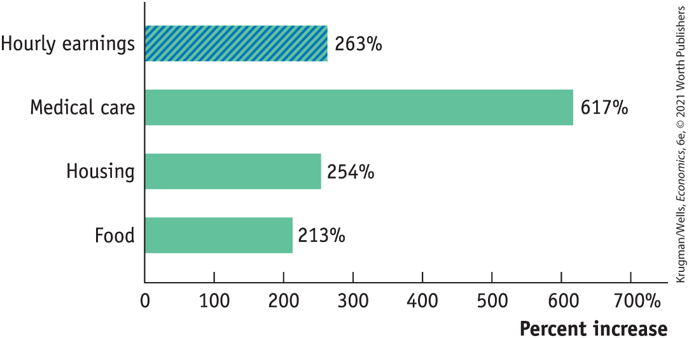
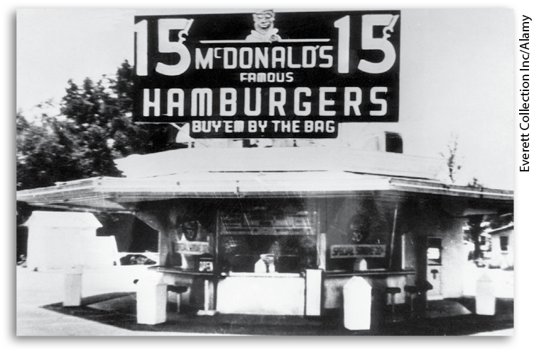
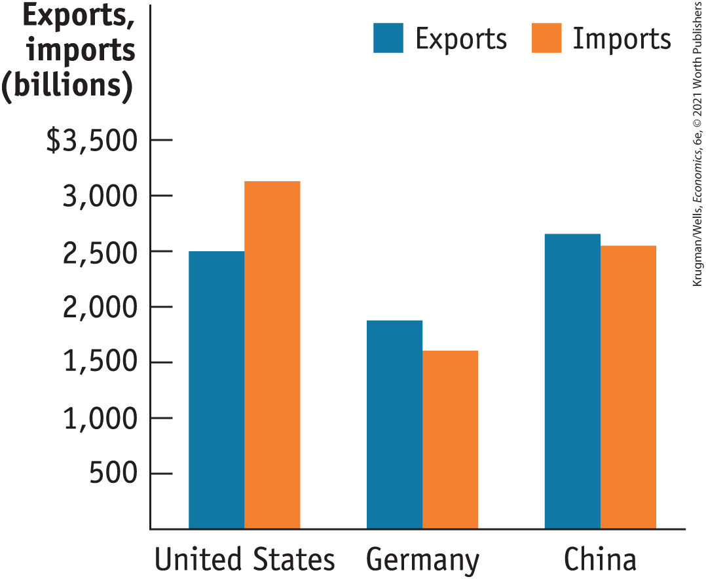
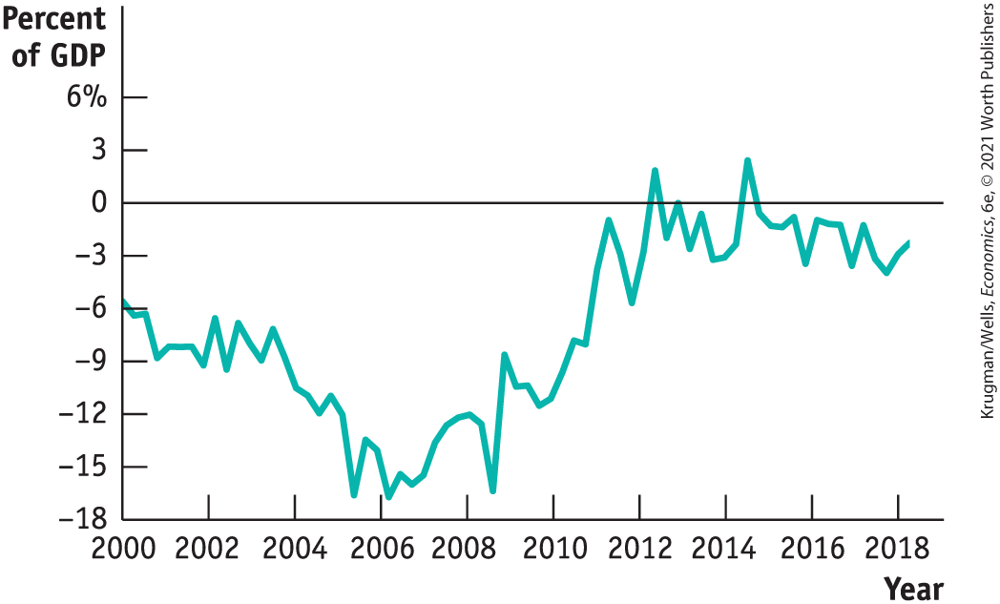
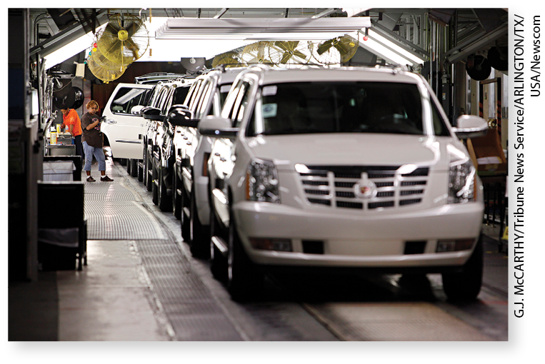
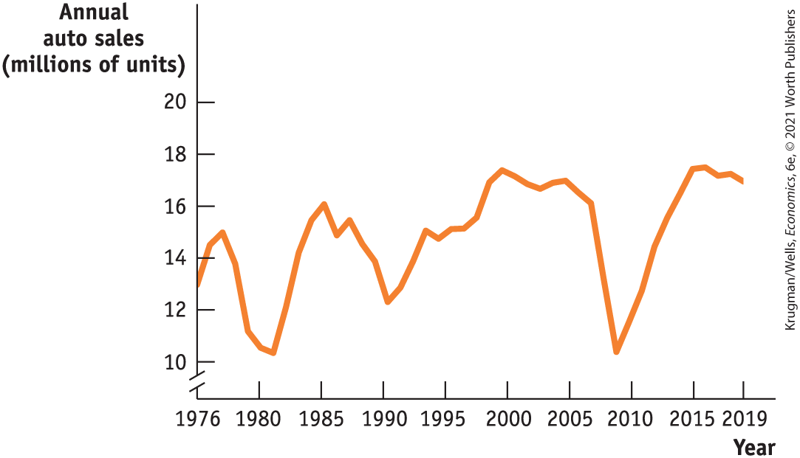
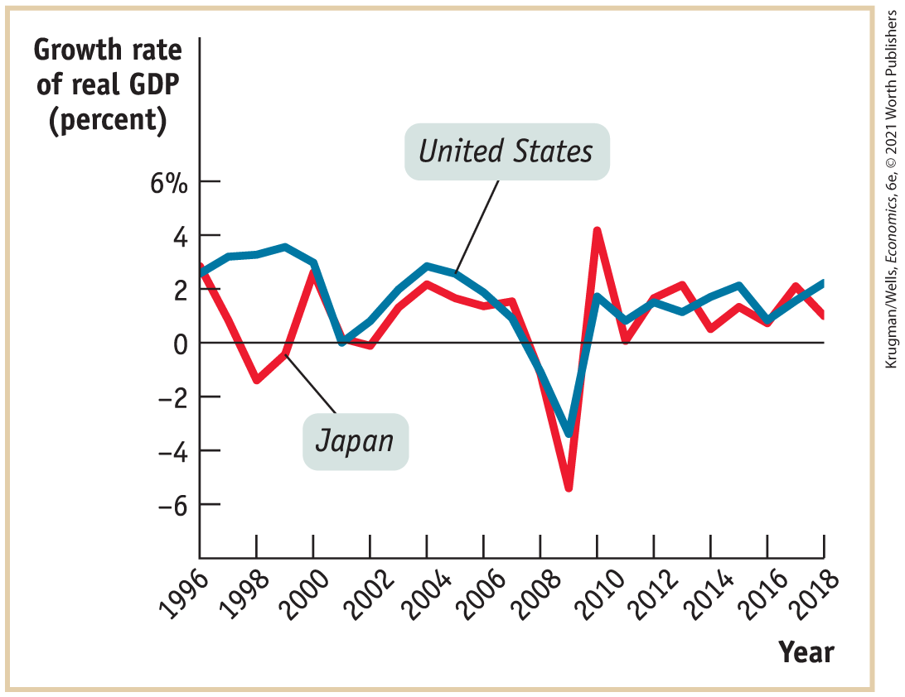
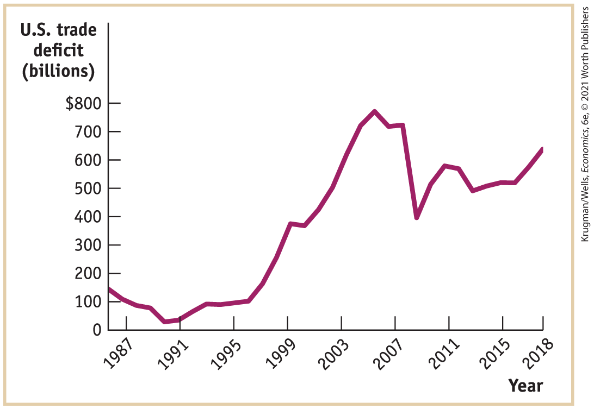

## Inflation and Deflation

In January 1980, the average production worker in the United States was paid \$6.57 an hour. By January 2020, the average hourly earnings for such a worker had risen to \$23.88 an hour. Three cheers for economic progress!

But wait. U.S. workers were paid much more in 2020 than they had been in 1980, but they also faced a much higher cost of living. <a href="#kru_9781319245269_ch06_05.xhtml#pau_9781319320164_noNkShjqDz" id="kru_9781319245269_ch06_05.xhtml#pau_9781319320164_GAuOFhw76s" class="crossref">Figure 6-8</a> compares the percentage increase in hourly earnings between 1980 and 2020 with the increases in the cost of some major types of consumer spending. As you can see, the average worker’s paycheck went farther in terms of some goods, but less far in terms of others. Overall, the cost of living from 1980 to 2020 rose by 232%, which wiped out almost all of the wage gains of the typical U.S. worker during that period. In other words, once inflation is taken into account, the living standard of the typical U.S. worker barely rose from 1980 to the present.

<figure id="pau_9781319320164_noNkShjqDz" class="figure lm_img_lightbox num c3 main-flow">

<figcaption>
FIGURE 6-8 Rising Prices

Between 1980 and 2020, American workers’ hourly earnings rose by 263%. But the cost of some major types of consumer spending also rose, some by more. Overall, the rising cost of living offset most of the rise in the average U.S. worker’s wage.

<em>Data from:</em> Bureau of Labor Statistics.
</figcaption>
</figure>

<aside class="hidden" id="pau_9781319320164_wqo3GYxEtD" title="hidden">

The vertical axis of the graph represents the names of five products, from top to bottom, Hourly earnings, Medical care, Housing, and Food. The horizontal axis labeled Percent increase ranges from 0 to 700 percent, in increments of 100 percent. The percent increase in the products are as follows, Hourly earnings, 263 percent; Medical care, 617 percent; Housing, 254 percent; and Food, 213 percent.

</aside>

The point is that between 1980 and 2020 the economy experienced substantial <a href="#kru_9781319245269_EM_glossary.xhtml#pau_9781319320164_Ffcxjw3wQx" id="kru_9781319245269_ch06_05.xhtml#pau_9781319320164_HnYuFwJSmq" class="glossref" role="doc-glossref">inflation</a>**:** a rise in the overall level of prices. Understanding the causes of inflation and its opposite, <a href="#kru_9781319245269_EM_glossary.xhtml#pau_9781319320164_kvIQ1Rg2ZR" id="kru_9781319245269_ch06_05.xhtml#pau_9781319320164_Qhj5l508Kg" class="glossref" role="doc-glossref">deflation</a> — a fall in the overall level of prices — is another main concern of macroeconomics.

<aside aria-label="title 1" class="glossary c3 main-flow v1" epub:type="glossary" id="pau_9781319320164_8Ya4WvpKOp">

**inflation**  
A rising overall level of prices is **inflation.**

</aside>
<aside aria-label="title 2" class="glossary c3 main-flow v1" epub:type="glossary" id="pau_9781319320164_6pKXxHL284">

**deflation**  
A falling overall level of prices is **deflation.**

</aside>

### The Causes of Inflation and Deflation

You might think that changes in the overall level of prices are just a matter of supply and demand. For example, higher gasoline prices reflect the higher price of crude oil, and higher crude oil prices reflect such factors as the exhaustion of major oil fields, growing demand from China and other emerging economies as more people grow rich enough to buy cars, and so on. Can’t we just add up what happens in each of these markets to find out what happens to the overall level of prices?

No, because supply and demand can only explain why a particular good or service becomes more expensive *relative to other goods and services.* It can’t explain why, for example, the price of chicken has risen over time in spite of the fact that chicken production has become more efficient and chicken has become substantially cheaper compared to other goods.

What causes the overall level of prices to rise or fall? As we’ll learn in <a href="#kru_9781319245269_ch08_01.xhtml#pau_9781319320164_6AH2l2uZnD" id="kru_9781319245269_ch06_05.xhtml#pau_9781319320164_haB922fjtP" class="crossref">Chapter 8</a>, in the short run, movements in inflation are closely related to the business cycle. When the economy is depressed and jobs are hard to find, inflation tends to fall; when the economy is booming, inflation tends to rise. For example, prices of most goods and services fell sharply during the Great Depression.

In the long run, by contrast, the overall level of prices is mainly determined by changes in the money supply, the total quantity of assets that can be readily used to make purchases. As we’ll see in <a href="#kru_9781319245269_ch16_01.xhtml#pau_9781319320164_Upw2yOhAsg" id="kru_9781319245269_ch06_05.xhtml#pau_9781319320164_F0QZlUwEEb" class="crossref">Chapter 16</a>, hyperinflation, in which prices rise by thousands or hundreds of thousands of percent, invariably occurs when governments print money to pay a large part of their bills.

### The Pain of Inflation and Deflation

Both inflation and deflation can pose problems for the economy. Let’s look at two examples.

First, inflation discourages people from holding onto cash, because cash loses value over time if the overall price level is rising. That is, the amount of goods and services you can buy with a given amount of cash falls. In extreme cases, people stop holding cash altogether and turn to barter.

Second, deflation can cause the reverse problem. If the price level is falling, cash gains value over time. In other words, the amount of goods and services you can buy with a given amount of cash increases. So holding on to cash becomes more attractive than investing in new factories and other productive assets. This can deepen a recession.

We’ll describe other costs of inflation and deflation in <a href="#kru_9781319245269_ch08_01.xhtml#pau_9781319320164_6AH2l2uZnD" id="kru_9781319245269_ch06_05.xhtml#pau_9781319320164_vTZyD1AbY7" class="crossref">Chapters 8</a> and <a href="#kru_9781319245269_ch16_01.xhtml#pau_9781319320164_Upw2yOhAsg" id="kru_9781319245269_ch06_05.xhtml#pau_9781319320164_jlpGhSppgf" class="crossref">16</a>. For now, let’s just note that, in general, economists regard <a href="#kru_9781319245269_EM_glossary.xhtml#pau_9781319320164_gBDSxsZ31I" id="kru_9781319245269_ch06_05.xhtml#pau_9781319320164_fyr7mGnmlJ" class="glossref" role="doc-glossref">price stability</a> — in which the overall level of prices is changing only slowly — as a desirable goal. Price stability is a goal that seemed far out of reach for much of the U.S. economy during the post–World War II period. However, from the 1990s to the present, it has been achieved to the satisfaction of most macroeconomists.

<aside aria-label="title 3" class="glossary c3 main-flow v1" epub:type="glossary" id="pau_9781319320164_UteqaG45gL">

**price stability**  
The economy has **price stability** when the overall level of prices changes slowly or not at all.

</aside>

### ECONOMICS \>\> *in Action*

A Fast (Food) Measure of Inflation

<figure id="pau_9781319320164_oq5wesvRjT" class="figure lm_img_lightbox unnum c2 right">

<figcaption>
Even though a burger costs six times more than it did when McDonald’s first opened, it’s still a good bargain compared to other consumer goods.
</figcaption>
</figure>

The original McDonald’s opened in 1948. It offered fast service — it was, indeed, the original fast-food restaurant. And it was also very inexpensive: hamburgers cost \$0.15, \$0.25 with fries. By 2020, a hamburger at a typical McDonald’s cost more than six times as much, about \$1.00. Has McDonald’s lost touch with its fast-food roots? Have burgers become luxury cuisine?

No — in fact, compared with other consumer goods, a burger is a better bargain today than it was in 1948. Burger prices were about 6.5 times as high in 2020 as they were in 1948. But the consumer price index, the most widely used measure of the cost of living, was about 11 times as high in 2020 as it was in 1948.

### *\>\> Quick Review*

- A dollar today doesn’t buy what it did in 1980, because the prices of most goods have risen. This rise in the overall price level has wiped out most if not all of the wage increases received by the typical American worker over the past 40 years.
- One area of macroeconomic study is in the overall level of prices. Because either **inflation** or **deflation** can cause problems for the economy, economists typically advocate maintaining **price stability.**

### *\>\> Check Your Understanding* 6-4

1.  Which of these sound like inflation, which sound like deflation, and which are ambiguous?
    1.  Gasoline prices are up 10%, food prices are down 20%, and the prices of most services are up 1–2%.
    2.  Gas prices have doubled, food prices are up 50%, and most services seem to be up 5% or 10%.
    3.  Gas prices haven’t changed, food prices are way down, and services have gotten cheaper, too.

## International Imbalances

The United States is an <a href="#kru_9781319245269_EM_glossary.xhtml#pau_9781319320164_V2trrrmhjo" id="kru_9781319245269_ch06_06.xhtml#pau_9781319320164_Ls0rGLszvE" class="glossref" role="doc-glossref">open economy</a>**:** an economy that trades goods and services with other countries. There have been times when that trade was more or less balanced — when the United States sold about as much to the rest of the world as it bought. But this isn’t one of those times.

<aside aria-label="title 1" class="glossary c3 main-flow v1" epub:type="glossary" id="pau_9781319320164_axBuq8FcGI">

**open economy**  
An **open economy** is an economy that trades goods and services with other countries.

</aside>

In 2018, the United States ran a big <a href="#kru_9781319245269_EM_glossary.xhtml#pau_9781319320164_jgoDskBl96" id="kru_9781319245269_ch06_06.xhtml#pau_9781319320164_iMFflVlNly" class="glossref" role="doc-glossref">trade deficit</a> — that is, the value of the goods and services U.S. residents bought from the rest of the world was a lot larger than the value of the goods and services U.S. producers sold to customers abroad. Meanwhile, some other countries were in the opposite position, selling much more to foreigners than they bought.

<a href="#kru_9781319245269_ch06_06.xhtml#pau_9781319320164_rzi1dsWiyK" id="kru_9781319245269_ch06_06.xhtml#pau_9781319320164_6pqXgaRowt" class="crossref">Figure 6-9</a> shows the exports and imports of goods for three important economies in 2018. As you can see, the United States imported much more than it exported, but Germany and China did the reverse: they each ran a <a href="#kru_9781319245269_EM_glossary.xhtml#pau_9781319320164_2CxfuWiSxc" id="kru_9781319245269_ch06_06.xhtml#pau_9781319320164_QXuoeSjJe6" class="glossref" role="doc-glossref">trade surplus</a>. A country runs a trade surplus when the value of the goods and services it buys from the rest of the world is smaller than the value of the goods and services it sells abroad.

<figure id="pau_9781319320164_rzi1dsWiyK" class="figure lm_img_lightbox num c3 main-flow">

<figcaption>
FIGURE 6-9 Unbalanced Trade

In 2018, the goods and services the United States bought from other countries were worth considerably more than the goods and services we sold abroad. Germany and China were in the reverse position. Trade deficits and trade surpluses reflect macroeconomic forces, especially differences in savings and investment spending.

<em>Data from:</em> International Monetary Fund, International Financial Statistics.
</figcaption>
</figure>

<aside class="hidden" id="pau_9781319320164_62Jx2FWFyh" title="hidden">

The vertical axis, labeled Exports, imports, in billions ranges from 0 to 2,500 dollars, in increments of 500 dollars. The horizontal axis represents the countries, United States, Germany, and China, from left to right. The approximated exports and imports for each country are as follows, United States: Exports, 2,500 dollars; Imports, 3100 dollars. Germany: Exports, 1,800 dollars; Imports, 1,500 dollars. China: Exports, 2,600 dollars; Imports, 2,500 dollars.

</aside>
<aside aria-label="title 2" class="glossary c3 main-flow v1" epub:type="glossary" id="pau_9781319320164_ZcelCmeYLu">

**trade deficit**, **trade surplus**  
A country runs a **trade deficit** when the value of goods and services bought from foreigners is more than the value of goods and services it sells to them. It runs a **trade surplus** when the value of goods and services bought from foreigners is less than the value of the goods and services it sells to them.

</aside>

Was the U.S. trade deficit a sign that something was wrong with our economy — that we weren’t able to make things that people in other countries wanted to buy? No, not really. Trade deficits and their opposite, trade surpluses, are macroeconomic phenomena. They’re the result of situations in which the whole is very different from the sum of its parts. You might think that countries with highly productive workers or widely desired products and services to sell run trade surpluses and countries with unproductive workers or poor-quality products and services to sell run trade deficits. But the reality is that there’s no simple relationship between the success of an economy and whether it runs trade surpluses or trade deficits.

In <a href="#kru_9781319245269_ch02_01.xhtml#pau_9781319320164_uuuTxO7RlK" id="kru_9781319245269_ch06_06.xhtml#pau_9781319320164_HbT0PjkddN" class="crossref">Chapter 2</a> we learned that international trade is the result of comparative advantage: countries export goods they’re relatively good at producing and import goods they’re not as good at producing. That’s why the United States exports wheat and imports coffee. What the concept of comparative advantage doesn’t explain, however, is why the value of a country’s imports is sometimes much larger than the value of its exports, or vice versa.

So what does determine whether a country runs a trade surplus or a trade deficit? Later on we’ll learn the surprising answer: the determinants of the overall balance between exports and imports lie in decisions about savings and investment spending — spending on goods like machinery and factories that are in turn used to produce goods and services for consumers. Countries with high investment spending relative to savings run trade deficits; countries with low investment spending relative to savings run trade surpluses.

### ECONOMICS \>\> *in Action*

Greece’s Costly Surplus

In 1999, Greece took a momentous step: it gave up its national currency, the drachma, in order to adopt the euro, a shared currency intended to promote closer economic and political union among the nations of Europe. How did this affect Greece’s international trade?

<a href="#kru_9781319245269_ch06_06.xhtml#pau_9781319320164_T8Z01BBDQi" id="kru_9781319245269_ch06_06.xhtml#pau_9781319320164_nXqCL2VWCa" class="crossref">Figure 6-10</a> shows Greece’s current account balance — a broad definition of its trade balance — from 2000 to 2018. A negative current account balance, as shown here, means the country is running a trade deficit. As you can see, after Greece switched to the euro it began running large trade deficits, which at their peak equaled almost 16% of the total value of goods and services Greece produced. After 2008, however, the trade deficit began shrinking rapidly, and by 2013 Greece was nearly running a surplus.

<figure id="pau_9781319320164_T8Z01BBDQi" class="figure lm_img_lightbox num c3 main-flow">

<figcaption>
FIGURE 6-10 Greece’s Current Account Balance, 1999–2018

<em>Data from:</em> OECD, Main Economic Indicators.
</figcaption>
</figure>

<aside class="hidden" id="pau_9781319320164_TVnTdTJHlO" title="hidden">

The graph plots Percent of G D P versus Year. The vertical axis labeled Percent of G D P ranges from negative 18 to 6 percent, in increments of 3 percent. The horizontal axis labeled year ranges from 2000 to 2018, in increments of 2 years. The approximated percent of G D P for the years are as follows, 2000, negative 6; 2001, negative 9; 2002, negative 9; 2004, negative 10; 2005, negative 17; 2008, negative 12; 2009, negative 9; 2010, negative 11; 2011, negative 1; 2012, negative 6; 2013, 2; 2014, negative 3; 2016, negative 3; and 2018, negative 4. The graph also shows a straight line running parallel to the horizontal axis, starting at point 0 on the vertical axis.

</aside>

Did this mean that Greece’s economy was doing badly in the mid-2000s, and better thereafter? Just the opposite. When Greece adopted the euro, foreign investors became highly optimistic about its prospects, and money poured into the country, fueling rapid economic expansion. Unfortunately, this optimism eventually evaporated, and the inflows of foreign capital dried up. One consequence was that Greece could no longer run large trade deficits, and by 2013 was forced into nearly running a surplus. Another consequence was a severe recession, leading to a scarcity of jobs — the scarcity that led Constantine Kakoyiannis, the engineer we mentioned at the start of this chapter, to give up and move to Germany.

### *\>\> Quick Review*

- Comparative advantage can explain why an **open economy** exports some goods and services and imports others, but it can’t explain why a country imports more than it exports, or vice versa.
- **Trade deficits** and **trade surpluses** are macroeconomic phenomena, determined by decisions about investment spending and savings.

### *\>\> Check Your Understanding* 6-5

1.  Which of the following reflect comparative advantage, and which reflect macroeconomic forces?
    1.  Thanks to the development of huge oil sands in the province of Alberta, Canada has become an exporter of oil and an importer of manufactured goods.
    2.  Like many consumer goods, the Apple iPad is assembled in China, although many of the components are made in other countries.
    3.  Since 2002, Germany has been running huge trade surpluses, exporting much more than it imports.
    4.  The United States, which had roughly balanced trade in the early 1990s, began running large trade deficits later in the decade, as the technology boom took off.

## Business case 

GM Survives

<figure id="pau_9781319320164_1nshPM2AcL" class="figure lm_img_lightbox unnum c2 right">

</figure>

Once upon a time, General Motors (GM) was widely regarded as the world’s greatest corporation. It was the largest employer in the United States; its success was so bound up with that of the nation as a whole that in 1953 its CEO declared that “what was good for our country was good for General Motors, and vice versa. The difference did not exist.”

By 2008, however, GM was not the company it had been. It no longer dominated the U.S. car market, thanks in part to rising competition from foreign automakers. It had high “legacy” costs resulting from contracts to pay pensions and health benefits to retired workers. And the company was bleeding cash, losing more than \$30 billion in 2008. It seemed possible that GM would not just declare formal bankruptcy, failing to pay its debts, but that it would go into actual liquidation, shutting down as a business.

GM executives appealed to the government for help and got it: the federal government provided almost \$50 billion in cash, receiving in return majority ownership of the company.

There was intense negative reaction to this bailout, with many critics predicting that the company would be unable to come back, and that the aid provided to GM would be money down the drain. In the end, however, GM did stage a comeback, returning to profitability. By 2010, it repaid its federal loans, and eventually the U.S. government sold all the stock it had acquired, although the price it got for that stock left taxpayers with a \$10 billion overall loss.

Why was GM able to survive and become profitable again? The company did undertake a number of cost-cutting measures. But the main secret of its turnaround was that 2008 was an exceptionally bad year for the auto industry, and that things improved dramatically in the years that followed.

The key point is that car sales are very sensitive to the state of the economy. When the economy as a whole stumbles, and workers have either lost their jobs or are worried about future job loss, they tend to postpone buying a new car. <a href="#kru_9781319245269_ch06_07.xhtml#pau_9781319320164_3ucsVmmMni" id="kru_9781319245269_ch06_07.xhtml#pau_9781319320164_ErZ2wTu0It" class="crossref">Figure 6-11</a> shows total U.S. sales of light vehicles (which includes both passenger cars and SUVs) over the past several decades. As you can see, sales plunged dramatically — around 40% — during the Great Recession, far more than the economy as a whole. It was predictable, however, that sales would surge again if and when the economy recovered.

<figure id="pau_9781319320164_3ucsVmmMni" class="figure lm_img_lightbox num c3 main-flow">

<figcaption>
FIGURE 6-11 Automobile and Light Truck Sales, 1976–2019

<em>Data from:</em> Federal Reserve Bank of St. Louis and Bureau of Economic Analysis.
</figcaption>
</figure>

<aside class="hidden" id="pau_9781319320164_NvXkop5qvT" title="hidden">

The graph plots Annual Auto Sales (Millions of units) versus Year. The horizontal axis plots years from 1976 to 2019, with markings at 1980, 1985, 1990, 1995, 2000, 2005, 2010, and 2015. The vertical axis labeled Annual auto sales (millions of units) is truncated and ranges from 10 to 20, in increments of 2. The graph shows a curve that begins at (1976, 13) and ends at (2019, 16). The curve ranges mostly between 10 million and 17 million of units. Two major dips are at (1980, 10) and (2009, 10). The highest sales is at (2000, 17).

</aside>

The prospect of rapid growth in sales if the economy recovered is what made bailing out GM in 2009 a better bet than looking at the company’s losses might have suggested. Despite its comeback, the company is nothing like the colossus it once was. But it has survived.

<aside class="assessments c3 main-flow v1" epub:type="assessments" id="pau_9781319320164_MKea09AR7U">

### Questions for thought

1.  While sales of many goods fell during the Great Recession, cars took a much bigger hit than groceries. Why?
2.  Looking at <a href="#kru_9781319245269_ch06_07.xhtml#pau_9781319320164_3ucsVmmMni" id="kru_9781319245269_ch06_07.xhtml#pau_9781319320164_QqU1HEoBqF" class="crossref">Figure 6-11</a>, you can see that car sales fell much less during the previous two recessions than they did during the Great Recession. What might explain the difference?
3.  General Motors, somewhat unusually for U.S. firms outside the banking industry, has consistently employed a highly regarded economist, who among other things helps the economy make forecasts. (As of 2019 the position was held by Elaine Buckberg, a former student of one of the authors.) Why do you think GM might place a higher priority on economic analysis than, say, Walmart would?

</aside>

### Summary

1.  Macroeconomics is the study of the behavior of the economy as a whole, which can be different from the sum of its parts. Macroeconomics differs from microeconomics in the type of questions it tries to answer. Macroeconomics also has a strong policy focus: **Keynesian economics**, which emerged during the Great Depression, advocates the use of **monetary policy** and **fiscal policy** to fight economic slumps. Prior to the Great Depression, the economy was thought to be **self-regulating.**
2.  One key concern of macroeconomics is the **business cycle**, the short-run alternation between **recessions**, periods of falling employment and output, and **expansions**, periods of rising employment and output. The point at which expansion turns to recession is a **business-cycle peak.** The point at which recession turns to expansion is a **business-cycle trough.**
3.  Another key area of macroeconomic study is **long-run economic growth**, the sustained upward trend in the economy’s output over time. Long-run economic growth is the force behind long-term increases in living standards and is important for financing some economic programs. It is especially important for poorer countries.
4.  When the prices of most goods and services are rising, so that the overall level of prices is going up, the economy experiences **inflation.** When the overall level of prices is going down, the economy is experiencing **deflation.** In the short run, inflation and deflation are closely related to the business cycle. In the long run, prices tend to reflect changes in the overall quantity of money. Because both inflation and deflation can cause problems, economists and policy makers generally aim for **price stability.**
5.  Although comparative advantage explains why **open economies** export some things and import others, macroeconomic analysis is needed to explain why countries run **trade surpluses** or **trade deficits.** The determinants of the overall balance between exports and imports lie in decisions about savings and investment spending.

### Key Terms

- <a href="#kru_9781319245269_ch06_02.xhtml#pau_9781319320164_T6ZYyDhgY3" id="kru_9781319245269_ch06_08.xhtml#pau_9781319320164_HiyLv5qNnu" class="crossref">Self-regulating economy</a>
- <a href="#kru_9781319245269_ch06_02.xhtml#pau_9781319320164_XNkKCWraBF" id="kru_9781319245269_ch06_08.xhtml#pau_9781319320164_EyVk4B9VeT" class="crossref">Keynesian economics</a>
- <a href="#kru_9781319245269_ch06_02.xhtml#pau_9781319320164_48E53ZbyNF" id="kru_9781319245269_ch06_08.xhtml#pau_9781319320164_EAhhuDga3v" class="crossref">Monetary policy</a>
- <a href="#kru_9781319245269_ch06_02.xhtml#pau_9781319320164_LIbYkGQpDo" id="kru_9781319245269_ch06_08.xhtml#pau_9781319320164_w494uhtKyu" class="crossref">Fiscal policy</a>
- <a href="#kru_9781319245269_ch06_03.xhtml#pau_9781319320164_c0LFtNE66D" id="kru_9781319245269_ch06_08.xhtml#pau_9781319320164_Vysjnc0Ux1" class="crossref">Recession</a>
- <a href="#kru_9781319245269_ch06_03.xhtml#pau_9781319320164_TxVrzHaBY9" id="kru_9781319245269_ch06_08.xhtml#pau_9781319320164_K5c9gO9Bbg" class="crossref">Expansion</a>
- <a href="#kru_9781319245269_ch06_03.xhtml#pau_9781319320164_g7mHT6jF0N" id="kru_9781319245269_ch06_08.xhtml#pau_9781319320164_R9N643Wg0T" class="crossref">Business cycle</a>
- <a href="#kru_9781319245269_ch06_03.xhtml#pau_9781319320164_7FfYgfIyOd" id="kru_9781319245269_ch06_08.xhtml#pau_9781319320164_CYjR9gXe9J" class="crossref">Business-cycle peak</a>
- <a href="#kru_9781319245269_ch06_03.xhtml#pau_9781319320164_49a7OasY0e" id="kru_9781319245269_ch06_08.xhtml#pau_9781319320164_stbREnsjzh" class="crossref">Business-cycle trough</a>
- <a href="#kru_9781319245269_ch06_04.xhtml#pau_9781319320164_do7Ek5brG2" id="kru_9781319245269_ch06_08.xhtml#pau_9781319320164_GiHQVB8Whg" class="crossref">Long-run economic growth</a>
- <a href="#kru_9781319245269_ch06_05.xhtml#pau_9781319320164_UYaTx1ktca" id="kru_9781319245269_ch06_08.xhtml#pau_9781319320164_odfs9emXOC" class="crossref">Inflation</a>
- <a href="#kru_9781319245269_ch06_05.xhtml#pau_9781319320164_hajnjz4GUe" id="kru_9781319245269_ch06_08.xhtml#pau_9781319320164_P5BTISFz1G" class="crossref">Deflation</a>
- <a href="#kru_9781319245269_ch06_05.xhtml#pau_9781319320164_sGNB1qw6DA" id="kru_9781319245269_ch06_08.xhtml#pau_9781319320164_OKIfvLJxh6" class="crossref">Price stability</a>
- <a href="#kru_9781319245269_ch06_06.xhtml#pau_9781319320164_8kEwLrOZPq" id="kru_9781319245269_ch06_08.xhtml#pau_9781319320164_9nvHxWdwQd" class="crossref">Open economy</a>
- <a href="#kru_9781319245269_ch06_06.xhtml#pau_9781319320164_fL2fjHV6bJ" id="kru_9781319245269_ch06_08.xhtml#pau_9781319320164_IHRvjcr9fi" class="crossref">Trade deficit</a>
- <a href="#kru_9781319245269_ch06_06.xhtml#pau_9781319320164_O6rytPZD1C" id="kru_9781319245269_ch06_08.xhtml#pau_9781319320164_8NhDZppSV1" class="crossref">Trade surplus</a>

### Practice questions

1.  The U.S. Department of Labor reports statistics on employment and earnings that are used as key indicators by many economists to gauge the health of the economy. <a href="#kru_9781319245269_ch06_03.xhtml#pau_9781319320164_koMBHSoRwp" id="kru_9781319245269_ch06_08.xhtml#pau_9781319320164_meMyb68KYL" class="crossref">Figure 6-4</a> plots historical data on the unemployment rate each month. Noticeably, the numbers were high during the recessions in the early 1990s, in 2001, and in the aftermath of the Great Recession, 2007–2009.
    1.  Locate the latest data on the national unemployment rate. (*Hint:* Go to the Bureau of Labor Statistics at <a href="http://www.bls.gov" id="kru_9781319245269_ch06_08.xhtml#pau_9781319320164_E7THfflKoI" class="external">www.bls.gov</a>, in the search bar enter “Employment Situation Summary,” and select the subsequent page.)
    2.  Compare the current numbers with those during the early 1990s, 2001, and following the Great Recession, as well as with the periods of relatively high economic growth just before the recessions. Are the current numbers indicative of a recessionary trend?

2.  In the 1990s, there were some dramatic economic events that came to be known as the *Asian financial crisis.* A decade later similar events came to be known as the *global financial crisis.* The accompanying figure shows the growth rate of real GDP in the United States and Japan from 1996 to 2018. Using the graph, explain why the two sets of events are referred to this way.

    <figure id="pau_9781319320164_W8ha4oGowt" class="figure lm_img_lightbox unnum c5 center">
    
    <figcaption>
<em>Data from:</em> Federal Reserve Bank of St. Louis.
</figcaption>
    </figure>

    <aside class="hidden" id="pau_9781319320164_CQ8tznNMX6" title="hidden">

    The graph plots Growth rate of real G D P (percent) versus Year. The vertical axis labeled “Growth rate of real G D P, in percentage,” ranges from negative 6 to 6 percent, in increments of 2 percent. The horizontal axis plots years from 1996 to 2018, in increments of 2 years. The graph shows two curves labeled United States and Japan. The curve representing United States shows the following approximated growth rate over the years as follows, 1996, 3; 2000, 3.5; 2001, 0; 2004, 3; 2009, negative 4; 2010, 2; and 2018, 2. The curve representing Japan shows the following approximated growth rate over the years as follows, 1996, 3; 1998, negative 1; 2000, 3; 2001, 0; 2004, 2; 2009, negative 5.7; 2010, 4; 2011, 0; and 2018, 1.7.

    </aside>

3.  The accompanying figure illustrates the trade deficit of the United States since 1987. The United States has been consistently and, on the whole, increasingly importing more goods than it has been exporting. One of the countries it runs a trade deficit with is China. Which of the following statements are valid possible explanations of this fact? Explain.
    1.  Many products, such as televisions, that were formerly manufactured in the United States are now manufactured in China.

    2.  The wages of the average Chinese worker are far lower than the wages of the average American worker.

    3.  Investment spending in the United States is high relative to its level of savings.

        <figure id="pau_9781319320164_aSXh5uBTyQ" class="figure lm_img_lightbox unnum c5 center">
        
        <figcaption>
<em>Data from:</em> Federal Reserve Bank of St. Louis.
</figcaption>
        </figure>

        <aside class="hidden" id="pau_9781319320164_LAnDRUnosi" title="hidden">

        The graph plots U.S. trade deficit (billions) versus Year. The vertical axis labeled “U.S. trade deficit, in billions of dollars” ranges from 0 to 800 billion dollars, in increments of 100 billion dollars. The horizontal axis plots years from 1987 to 2015, in increments of 4 years, with a marking at 2018. The approximated trade deficits for the given years are as follows, 1985, 150; 1987, 100; 1991, 50; 1995, 100; 1999, 400; 2003, 500; 2005, 800; 2007, 730; 2008, 400; 2011, 580; 2015, 550; and 2018, 620.

        </aside>
