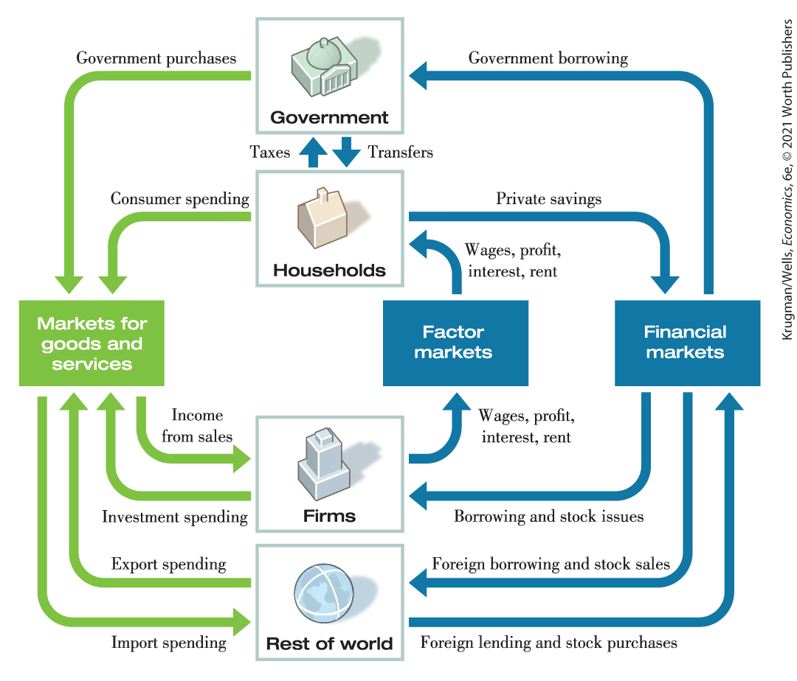
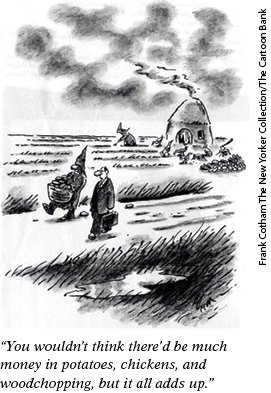
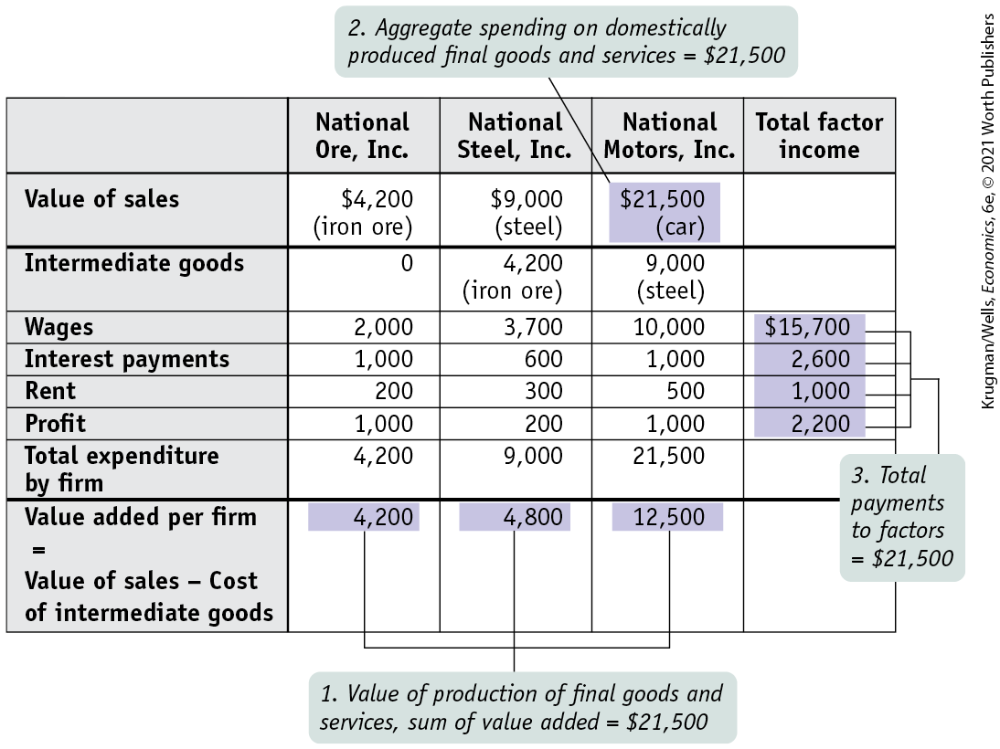
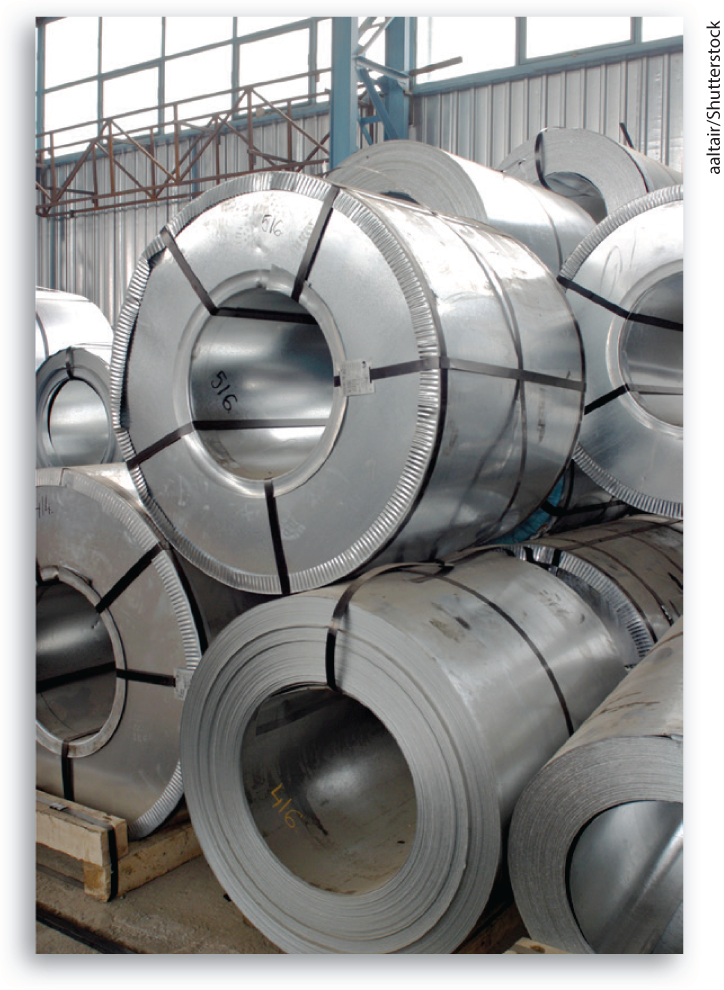

# Chapter 7 GDP and the CPI: Tracking the Macroeconomy

## China Hits the Big Time

<figure id="pau_9781319320164_EYsuzW54CB" class="figure lm_img_lightbox unnum c2 right">

<figcaption>
<strong>China has become an economic superpower, surpassing Japan.</strong>
</figcaption>
</figure>

**WE OPENED THIS BOOK** with a portrait of the Pearl River Delta, the huge urban complex in southeastern China that, taken as a whole, is now the world’s biggest city. The world’s biggest city also has a very big economy, larger than that of many nations. And China as a whole, by some measures, now has the world’s largest economy. Other measures show that the U.S. economy is still larger.

But what does it mean to have the largest economy in the world? If you compare China with the United States, you find that they do quite different things. China, for example, produces much of the world’s clothing, while the U.S. clothing industry has largely disappeared. On the other hand, America produces around half of the world’s passenger jets, while China is just getting into the aircraft industry. So you might think that trying to compare the sizes of the two economies would be a matter of comparing apples and oranges — well, pajamas and Boeings, but you get the idea.

In fact, however, economists routinely do compare the sizes of economies across both space and time — for example, they compare the size of the U.S. economy with that of China, and they also compare the size of the U.S. economy today with its size in the past. They do this using a measure known as *gross domestic product,* or *GDP*, the total value of goods and services produced in a country, and a closely related measure, *real GDP,* which corrects GDP for price changes. When number-crunchers say that one country’s economy has overtaken the other’s, they mean that China’s real GDP has surpassed that of the United States (or that the United States’ real GDP has surpassed that of China).

GDP and real GDP are two of the most important measures used to track the macroeconomy — that is, to quantify movements in the overall level of output and prices. Measures like GDP and *price indexes* play an important role in formulating economic policy, since policy makers need to know what’s going on, and anecdotes are no substitute for hard data. Measures are also important for business decisions — to such an extent that, as the Business Case at the end of the chapter illustrates, corporations and other players seek independent estimates when they don’t trust official numbers.

In this chapter, we explain how macroeconomists measure key aspects of the economy. We first explore ways to measure the economy’s total output and total income. We then turn to the problem of how to measure the level of prices and the change in prices in the economy. 

<aside class="learning-objectives c3 main-flow v3" epub:type="learning-objectives" id="pau_9781319320164_unhxy8i3uW">

### What you will learn

- How do economists use aggregate measures to track the performance of the economy?
- What is **gross domestic product**, or **GDP**, and how is it calculated?
- What is the difference between **real GDP** and **nominal GDP**, and why is real GDP the appropriate measure of real economic activity?
- What is a **price index**, and how is it used to calculate the **inflation rate?**

</aside>

## The National Accounts

Almost all countries calculate a set of numbers known as the *national income and product accounts.* In fact, the accuracy of a country’s accounts is a remarkably reliable indicator of its state of economic development — in general, the more reliable the accounts, the more economically advanced the country. When international economic agencies seek to help a less developed country, typically the first order of business is to send a team of experts to audit and improve the country’s accounts.

In the United States, these numbers are calculated by the Bureau of Economic Analysis, a division of the U.S. government’s Department of Commerce. The <a href="#kru_9781319245269_EM_glossary.xhtml#pau_9781319320164_EXcVMKDSTE" id="kru_9781319245269_ch07_02.xhtml#pau_9781319320164_Vfy4VQc0ET" class="glossref" role="doc-glossref">national income and product accounts</a>, often referred to simply as the <a href="#kru_9781319245269_EM_glossary.xhtml#pau_9781319320164_EXcVMKDSTE" id="kru_9781319245269_ch07_02.xhtml#pau_9781319320164_5LIexs07gf" class="glossref" role="doc-glossref">national accounts</a>, keep track of the spending of consumers, the sales of producers, business investment spending, government purchases, and a variety of other flows of money between different sectors of the economy. Let’s see how they work.

<aside aria-label="title 1" class="glossary c3 main-flow v1" epub:type="glossary" id="pau_9781319320164_nOjAJMgbuU">

**national income and product accounts**, **national accounts**  
The **national income and product accounts**, or **national accounts**, keep track of the flows of money between different sectors of the economy.

</aside>

### Following the Money: The Expanded Circular-Flow Diagram

To understand the principles behind the national accounts, it helps to look at <a href="#kru_9781319245269_ch07_02.xhtml#pau_9781319320164_TafrofvMlE" id="kru_9781319245269_ch07_02.xhtml#pau_9781319320164_fd86GNf6AQ" class="crossref">Figure 7-1</a>, which is an expanded version of the circular-flow diagram we introduced in <a href="#kru_9781319245269_ch02_01.xhtml#pau_9781319320164_uuuTxO7RlK" id="kru_9781319245269_ch07_02.xhtml#pau_9781319320164_3elWztCggj" class="crossref">Chapter 2</a> (see <a href="#kru_9781319245269_ch02_04.xhtml#pau_9781319320164_ln2EnDdDio" id="kru_9781319245269_ch07_02.xhtml#pau_9781319320164_tzhWkB47FP" class="crossref">Figure 2-6</a>). <a href="#kru_9781319245269_ch07_02.xhtml#pau_9781319320164_TafrofvMlE" id="kru_9781319245269_ch07_02.xhtml#pau_9781319320164_WGyFTgUXtK" class="crossref">Figure 7-1</a> shows the flows of money through the economy. For the purposes of this chapter, however, we will focus only on the left side of the diagram, where green arrows represent the “real” economy — flows of money associated with the production and sales of goods and services. We’ll turn to the “financial” economy, represented by the blue arrows, in <a href="#kru_9781319245269_ch10_01.xhtml#pau_9781319320164_GbPAtnS6LO" id="kru_9781319245269_ch07_02.xhtml#pau_9781319320164_SS0RFul55D" class="crossref">Chapter 10</a> — borrowing, lending, and other money flows — that are crucial but have only an indirect effect on production.

<figure id="pau_9781319320164_TafrofvMlE" class="figure lm_img_lightbox num c3 main-flow">

<figcaption>
FIGURE 7-1 An Expanded Circular-Flow Diagram: The Flows of Money Through the Economy

A circular flow of money connects the four sectors of the economy: government, households, firms, and the rest of the world, via three types of markets: markets for goods and services, factor markets, and financial markets. Money flows from firms to households in the form of wages, profit, interest, and rent through the factor markets. Households use that money to pay taxes to the government, to save it in the form of private savings that flows to the financial markets, or to pay for consumer spending on goods and services from firms or imports from the rest of the world. The government uses tax revenue to purchase goods and services from firms or the rest of the world. It can also use tax revenue to transfer money to households in the form of subsidies or the social safety net (Social Security or unemployment insurance payments, for example). Firms use the money they receive from the financial markets via borrowing or issuing stocks or bonds to pay for investment spending, which involves spending on goods and services such as machinery and building construction, which will increase their production in the future. Finally, the rest of the world purchases the economy’s exports. To understand national income accounting, we focus on the flows to and from the markets for goods and services, which represent the “real” economy, shown on the left side of the diagram, in green. The right side of the diagram, in blue, represents the “financial” economy, which we will examine in <a href="#kru_9781319245269_ch10_01.xhtml#pau_9781319320164_GbPAtnS6LO" id="kru_9781319245269_ch07_02.xhtml#pau_9781319320164_ksD8cK7p7R" class="crossref">Chapter 10</a>.
</figcaption>
</figure>

<aside class="hidden" id="pau_9781319320164_xRgE6OMgAg" title="hidden">

There are four components in the chart, two on the top labeled “Government” and “Household” and two at the bottom labeled “Firms” and “rest of the world.” Three other components, placed horizontally, are labeled “Market for goods and services,” “Factor markets,” and “financial markets.” Two arrows, one labeled “Government purchases” begins from government, and the other labeled “Consumer spending” begins from household, both lead to Market for goods and services. An arrow labeled “Income for sales” flows from market for goods and services to Firms. An arrow from Firms, flows back to Markets for goods and services, and it is labeled “Investment spending.” Another arrow labeled “Import spending” flows from Markets for goods and services to Rest of world. An arrow labeled “Export spending” flows back from Rest of the word to Market for goods and services. An arrow labeled “Foreign lending and stock purchases” flows from Rest of world to Financial markets from which an arrow labeled “Foreign borrowing and stock sales” flows back to Rest of world. Another arrow from Financial markets flows to Firms; it is labeled “Borrowing and stock issues.” An arrow labeled “Wages, profit, interest, rent” flows from Firms and through Factor market it reaches household. Private saving from household flows to Financial market from which Government borrowing flows to government. Household pays taxes to government, and Government transfers tax revenue to household.

</aside>

As <a href="#kru_9781319245269_ch07_02.xhtml#pau_9781319320164_TafrofvMlE" id="kru_9781319245269_ch07_02.xhtml#pau_9781319320164_NQr7LftVtT" class="crossref">Figure 7-1</a> shows, spending on goods and services — flows of money *into* the markets for goods and services — comes from four distinct kinds of buyers:

1.  Governments at the local, state, and federal level spend tax revenue in two broad areas: <a href="#kru_9781319245269_EM_glossary.xhtml#pau_9781319320164_31tG6IR3Dt" id="kru_9781319245269_ch07_02.xhtml#pau_9781319320164_Lb8VJhFWqE" class="glossref" role="doc-glossref">government purchases of goods and services</a> like education or defense, where the government buys things for its own use, and *transfer payments* like Social Security, where the government gives money to households. For now, in this chapter, we will focus only on government purchases.
2.  Households — that’s your family, ours, and tens of millions of others. Households engage in <a href="#kru_9781319245269_EM_glossary.xhtml#pau_9781319320164_SMjtqud320" id="kru_9781319245269_ch07_02.xhtml#pau_9781319320164_iN3xcYb6n1" class="glossref" role="doc-glossref">consumer spending</a> by purchasing goods and services through the markets for goods and services from firms or imports from the rest of the world.
3.  Firms — firms buy goods and services from each other when they engage in <a href="#kru_9781319245269_EM_glossary.xhtml#pau_9781319320164_Y6pYzMT1Nk" id="kru_9781319245269_ch07_02.xhtml#pau_9781319320164_FwWHe5PqEn" class="glossref" role="doc-glossref">investment spending</a>, spending on productive capital, such as machinery and construction of buildings.
4.  Rest of the world — a fourth source of spending comes from <a href="#kru_9781319245269_EM_glossary.xhtml#pau_9781319320164_hKu1CQdUZ6" id="kru_9781319245269_ch07_02.xhtml#pau_9781319320164_8TC3VUyewv" class="glossref" role="doc-glossref">exports</a>, goods and services sold to residents of other countries.

<aside aria-label="title 2" class="glossary c3 main-flow v1" epub:type="glossary" id="pau_9781319320164_NvmV41K2PB">

**government purchases of goods and services**  
**Government purchases of goods and services** are total expenditures on goods and services by federal, state, and local governments.

</aside>
<aside aria-label="title 3" class="glossary c3 main-flow v1" epub:type="glossary" id="pau_9781319320164_C62cpvXjyb">

**consumer spending**  
**Consumer spending** is household spending on goods and services.

</aside>
<aside aria-label="title 4" class="glossary c3 main-flow v1" epub:type="glossary" id="pau_9781319320164_ifOIkurwXZ">

**investment spending**  
**Investment spending** is spending on productive physical capital — such as machinery and construction of buildings — and on changes to inventories.

</aside>
<aside aria-label="title 5" class="glossary c3 main-flow v1" epub:type="glossary" id="pau_9781319320164_4q0nx4gXBN">

**exports, imports**  
Goods and services sold to other countries are **exports.** Goods and services purchased from other countries are **imports.**

</aside>

All four of these money flows involve spending on goods and services. However, some of the goods and services purchased by a country’s residents are produced abroad. For example, many consumer goods sold in the United States are made in China. Goods and services that are purchased by households, governments, or firms, but produced by residents of another country, are known as <a href="#kru_9781319245269_EM_glossary.xhtml#pau_9781319320164_iZC4MyAy89" id="kru_9781319245269_ch07_02.xhtml#pau_9781319320164_BaWRGQkTFv" class="glossref" role="doc-glossref">imports</a>. The purchase of imports leads to a flow of money *out* of the market for goods and services and *out* of the economy.

Suppose we add up consumer spending on goods and services, investment spending, government purchases of goods and services, and the value of exports, then subtract the value of imports. This gives us a measure of the overall market value of the goods and services the economy produces. That measure has a name: it’s a country’s *gross domestic product.* But before we can formally define gross domestic product, or GDP, we have to examine an important distinction between classes of goods and services: the difference between *final goods and services,* on one side, and *intermediate goods and services* on the other.

### Gross Domestic Product

A consumer’s purchase of a new car from a dealer is one example of a sale of <a href="#kru_9781319245269_EM_glossary.xhtml#pau_9781319320164_m3YMBWRD1Z" id="kru_9781319245269_ch07_02.xhtml#pau_9781319320164_Zif0Sx1uon" class="glossref" role="doc-glossref">final goods and services</a>: goods and services sold to the final, or end, user. But an automobile manufacturer’s purchase of steel from a steel foundry or glass from a glassmaker is an example of purchasing <a href="#kru_9781319245269_EM_glossary.xhtml#pau_9781319320164_97Bgr5oHw3" id="kru_9781319245269_ch07_02.xhtml#pau_9781319320164_LnHV2ERr6g" class="glossref" role="doc-glossref">intermediate goods and services</a>: goods and services that are inputs for production of final goods and services. In the case of intermediate goods and services, the purchaser — another firm — is *not* the final user.

<aside aria-label="title 6" class="glossary c3 main-flow v1" epub:type="glossary" id="pau_9781319320164_qATAiGZrtR">

**final goods and services**  
**Final goods and services** are goods and services sold to the final, or end, user.

</aside>
<aside aria-label="title 7" class="glossary c3 main-flow v1" epub:type="glossary" id="pau_9781319320164_G4hb8QcIKG">

**intermediate goods and services**  
**Intermediate goods and services** are goods and services — bought from one firm by another firm — that are inputs for production of final goods and services.

</aside>

<a href="#kru_9781319245269_EM_glossary.xhtml#pau_9781319320164_knSnC86ipq" id="kru_9781319245269_ch07_02.xhtml#pau_9781319320164_1d0TAkbIYg" class="glossref" role="doc-glossref">Gross domestic product</a>, or <a href="#kru_9781319245269_EM_glossary.xhtml#pau_9781319320164_knSnC86ipq" id="kru_9781319245269_ch07_02.xhtml#pau_9781319320164_4j5QUAf7Ix" class="glossref" role="doc-glossref">GDP</a>, is the total value of all *final goods and services* produced in an economy during a given period, usually a year. In 2019 the GDP of the United States was \$21,428 billion, or about \$65,223 per person. If you are an economist trying to construct a country’s national accounts, *one way to calculate GDP is to calculate it directly: survey firms and add up the total value of their production of final goods and services.* We’ll soon explain why intermediate goods, and some other types of goods as well, are not included in the calculation of GDP.

<aside aria-label="title 8" class="glossary c3 main-flow v1" epub:type="glossary" id="pau_9781319320164_h3kMkiHJzA">

**gross domestic product**, or **GDP**  
**Gross domestic product**, or **GDP**, is the total value of all final goods and services produced in the economy during a given year.

</aside>

But adding up the total value of final goods and services produced isn’t the only way of calculating GDP. There are two other ways. One way is based on total spending on final goods and services. Since GDP is equal to the total value of final goods and services produced in the economy, it must also equal the flow of funds received by firms from sales in the goods and services market.

If you look again at the circular-flow diagram in <a href="#kru_9781319245269_ch07_02.xhtml#pau_9781319320164_TafrofvMlE" id="kru_9781319245269_ch07_02.xhtml#pau_9781319320164_uXqMNKBSxz" class="crossref">Figure 7-1</a>, you will see the arrow going from markets for goods and services to firms. The flow of funds out of the markets for goods and services to firms is equal to the total flow of funds into the markets for goods and services from other sectors. And as you can see from <a href="#kru_9781319245269_ch07_02.xhtml#pau_9781319320164_TafrofvMlE" id="kru_9781319245269_ch07_02.xhtml#pau_9781319320164_0AnaBh99N9" class="crossref">Figure 7-1</a>, the total flow of funds into the markets for goods and services is total or <a href="#kru_9781319245269_EM_glossary.xhtml#pau_9781319320164_Xrrt7ycaf9" id="kru_9781319245269_ch07_02.xhtml#pau_9781319320164_NhEOgAUWAU" class="glossref" role="doc-glossref">aggregate spending</a> on domestically produced final goods and services — the sum of consumer spending, investment spending, government purchases of goods and services, and exports minus imports. *So a second way of calculating GDP is to add up aggregate spending on domestically produced final goods and services in the economy.*

<aside aria-label="title 9" class="glossary c3 main-flow v1" epub:type="glossary" id="pau_9781319320164_gWRl7NvEwM">

**aggregate spending**  
**Aggregate spending**, the sum of consumer spending, investment spending, government purchases of goods and services, and exports minus imports, is the total spending on domestically produced final goods and services in the economy.

</aside>

<figure id="pau_9781319320164_RdrZxFnjTc" class="figure lm_img_lightbox unnum c2 right">

</figure>

<aside class="hidden" id="pau_9781319320164_DDlTrsKjOg" title="hidden">

In the background, there are chickens, a thatched hut, and a woodpile with an ax. The medieval man says, “You wouldn’t think there’d be much money in potatoes, chickens, and woodchopping, but it all adds up.”

</aside>

The third way of calculating GDP is based on total income earned in the economy. Firms, and the factors of production that they employ, are owned by households. So firms must ultimately pay out what they earn to households. The flow from firms to the factor markets is the factor income paid out by firms to households in the form of wages, profit, interest, and rent. Since all the income earned by firms belongs to someone — if it doesn’t go to workers or bondholders, it counts as profits that accrue to shareholders — the value of the flow of factor income from firms to households must be equal to the flow of money into firms from the markets for goods and services. And this last value, we know, is the total value of production in the economy — GDP.

Why is GDP equal to the total value of factor income paid by firms in the economy to households? Because each sale in the economy must accrue to someone as income — either as wages, profit, interest, or rent. *So a third way of calculating GDP is to sum the total factor income earned by households from firms in the economy.*

### Calculating GDP

We’ve just explained the three methods for calculating GDP:

1.  Survey and add up total value of all final goods and services produced.
2.  Add up aggregate spending on all domestically produced goods and services in the economy.
3.  Add up the total factor income earned by households from firms in the economy.

Government statisticians use all three methods. To illustrate how these three methods work, we will consider a simplified hypothetical economy, shown in <a href="#kru_9781319245269_ch07_02.xhtml#pau_9781319320164_EY5e1hPPOd" id="kru_9781319245269_ch07_02.xhtml#pau_9781319320164_kI6q2ifSjf" class="crossref">Figure 7-2</a>. This economy consists of three firms — National Motors, Inc., which produces one car per year; National Steel, Inc., which produces the steel that goes into the car; and National Ore, Inc., which mines the iron ore that goes into the steel. So GDP is \$21,500, the value of the one car per year the economy produces. Let’s look at how the three different methods of calculating GDP yield the same result.

<figure id="pau_9781319320164_EY5e1hPPOd" class="figure lm_img_lightbox num c3 main-flow">

<figcaption>
FIGURE 7-2 Calculating GDP

In this simplified hypothetical economy consisting of three firms, GDP can be calculated in three different ways: (1) measuring GDP as the value of production of final goods and services, by summing each firm’s value added; (2) measuring GDP as aggregate spending on domestically produced final goods and services; and (3) measuring GDP as factor income earned by households from firms in the economy.
</figcaption>
</figure>

<aside class="hidden" id="pau_9781319320164_4BhSfHzrsM" title="hidden">

The table has 8 rows and 4 columns. The column headers from left to right are as follows, National Ore I n c, National Steel I n c, National Motors I n c, and total factor income. The row headers from top to bottom are as follows, value of sales, intermediate goods, wages, Interest payments, rent, profit, total expenditure by firm, and value added per firm equals value of sales minus cost of intermediate goods. The row values are as follows, Row 1, value of sales: 4,200 dollars (iron ore), 9,000 dollars (steel), 21,500 dollars (car), and blank. Row 2, intermediate goods: 0, 4,200 dollars, 9,000 dollars, and blank. Row 3, Wages: 2,000 dollars, 3,700 dollars, 10,000 dollars, and 15,700 dollars. Row 4, Interest payments: 1000 dollars, 600 dollars, 1000 dollars, and 2600 dollars. Row 5, Rent: 200 dollars, 300 dollars, 500 dollars, and 1000 dollars. Row 6, Profit: 1,000 dollars, 200 dollars, 1,000 dollars, and 2200 dollars. Row 7, Total expenditure: 4,200 dollars, 9,000 dollars, 21,500 dollars, and blank. Row 8, value added per firm: 4,200 dollars, 4,800 dollars, 12,500 dollars, and blank. The value added per firm in row 8 is labeled, “1, value of production of final goods and services, sum of value added equals 21,500 dollars.” The value of sales, 21,500 dollars, under the column National motors, I n c, is labeled, “Aggregate spending on domestically produced final goods and services equals 21,500 dollars.” The entries under the column total factor income is labeled, “The total payments to factors equals 21,500 dollars.”

</aside>

#### Measuring GDP as the Value of Production of Final Goods and Services

The first method for calculating GDP is to add up the value of all the final goods and services produced in the economy — a calculation that excludes the value of intermediate goods and services. Why are intermediate goods and services excluded? After all, don’t they represent a very large and valuable portion of the economy?

To understand why only final goods and services are included in GDP, look at the simplified economy described in <a href="#kru_9781319245269_ch07_02.xhtml#pau_9781319320164_EY5e1hPPOd" id="kru_9781319245269_ch07_02.xhtml#pau_9781319320164_yVhakoBSn0" class="crossref">Figure 7-2</a>. Should we measure the GDP of this economy by adding up the total sales of the iron ore producer, the steel producer, and the auto producer? If we did, we would in effect be counting the value of the steel twice — once when it is sold by the steel plant to the auto plant, and again when the steel auto body is sold to a consumer as a finished car. And we would be counting the value of the iron ore *three* times — once when it is mined and sold to the steel company, a second time when it is made into steel and sold to the auto producer, and a third time when the steel is made into a car and sold to the consumer.

<figure id="pau_9781319320164_1e56TkeW51" class="figure lm_img_lightbox unnum c2 right">

<figcaption>
Steel is an intermediate good because it is sold to other product manufacturers, such as automakers, and rarely to final buyers, such as consumers.
</figcaption>
</figure>

So counting the full value of each producer’s sales would cause us to count the same items several times and artificially inflate the calculation of GDP. For example, in <a href="#kru_9781319245269_ch07_02.xhtml#pau_9781319320164_EY5e1hPPOd" id="kru_9781319245269_ch07_02.xhtml#pau_9781319320164_ohxufxPXUx" class="crossref">Figure 7-2</a>, the total value of all sales, intermediate and final, is \$34,700: \$21,500 from the sale of the car, plus \$9,000 from the sale of the steel, plus \$4,200 from the sale of the iron ore. Yet we know that GDP is only \$21,500. The way we avoid double-counting is to count only each producer’s <a href="#kru_9781319245269_EM_glossary.xhtml#pau_9781319320164_pG5KGySTqy" id="kru_9781319245269_ch07_02.xhtml#pau_9781319320164_51tQiNhDlb" class="glossref" role="doc-glossref">value added</a> in the calculation of GDP: the difference between the value of its sales and the value of the intermediate goods and services it purchases from other businesses.

<aside aria-label="title 10" class="glossary c3 main-flow v1" epub:type="glossary" id="pau_9781319320164_jVO5LfF9Xx">

**value added**  
The **value added** of a producer is the value of its sales minus the value of its purchases of intermediate goods and services.

</aside>

That is, we subtract the cost of inputs — the intermediate goods — at each stage of the production process. In this case, the value added of the auto producer is the dollar value of the cars it manufactures *minus* the cost of the steel it buys, or \$12,500. The value added of the steel producer is the dollar value of the steel it produces *minus* the cost of the ore it buys, or \$4,800. Only the ore producer, which we have assumed doesn’t buy any inputs, has value added equal to its total sales, \$4,200. The sum of the three producers’ value added is \$21,500, equal to GDP.

#### Measuring GDP as Spending on Domestically Produced Final Goods and Services

Another way to calculate GDP is by adding up aggregate spending on domestically produced final goods and services. That is, GDP can be measured by the flow of funds into firms. Like the method that estimates GDP as the value of domestic production of final goods and services, this measurement must be carried out in a way that avoids double-counting.

In terms of our steel and auto example, we don’t want to count both consumer spending on a car (represented in <a href="#kru_9781319245269_ch07_02.xhtml#pau_9781319320164_EY5e1hPPOd" id="kru_9781319245269_ch07_02.xhtml#pau_9781319320164_5z2Fw1yxSg" class="crossref">Figure 7-2</a> by \$21,500, the sales price of the car) and the auto producer’s spending on steel (represented in <a href="#kru_9781319245269_ch07_02.xhtml#pau_9781319320164_EY5e1hPPOd" id="kru_9781319245269_ch07_02.xhtml#pau_9781319320164_tQN41qZ3T2" class="crossref">Figure 7-2</a> by \$9,000, the price of a car’s worth of steel). If we counted both, we would be counting the steel embodied in the car twice.

We solve this problem by counting only the value of sales to *final buyers,* such as consumers, firms that purchase investment goods, the government, or foreign buyers. In other words, to avoid double-counting of spending, we omit sales of inputs from one business to another when estimating GDP using spending data. You can see from <a href="#kru_9781319245269_ch07_02.xhtml#pau_9781319320164_EY5e1hPPOd" id="kru_9781319245269_ch07_02.xhtml#pau_9781319320164_qSqoA88POg" class="crossref">Figure 7-2</a> that aggregate spending on final goods and services — the finished car — is \$21,500.

As we’ve already pointed out, the national accounts *do* include investment spending by firms as a part of final spending. That is, an auto company’s purchase of steel to make a car isn’t considered a part of final spending, but the company’s purchase of new machinery for its factory *is* considered a part of final spending. What’s the difference? Steel is an input that is used up in production; machinery will last for a number of years. Since purchases of capital goods that will last for a considerable time aren’t closely tied to current production, the national accounts consider such purchases a form of final sales.

In later chapters, we will make use of the proposition that GDP is equal to aggregate spending on domestically produced goods and services by final buyers. We will also develop models of how final buyers decide how much to spend. With that in mind, we’ll now examine the types of spending that make up GDP.

<aside class="case-study c3 main-flow v1" epub:type="case-study" id="pau_9781319320164_WLJwmtcs7a" title="For inquiring minds">

##### For inquiring minds

Our Imputed Lives

An old line says that when a person marries the household cook, GDP falls. And it’s true: when someone provides services for pay, those services are counted as a part of GDP. But the services family members provide to each other are not. Some economists have produced alternative measures that try to “impute” the value of household work — that is, assign an estimate of what the market value of that work would have been if it had been paid for. But the standard measure of GDP doesn’t contain that imputation.

GDP estimates do, however, include an imputation for the value of owner-occupied housing. That is, if you buy the home you were formerly renting, GDP does not go down. It’s true that because you no longer pay rent to your landlord, the landlord no longer sells a service to you — namely, use of the house or apartment. But the statisticians make an estimate of what you would have paid if you rented your dwelling, whether it’s an apartment or a house. For the purposes of the statistics, it’s as if you were renting from yourself.

If you think about it, this makes a lot of sense. In a country like the United States, the pleasure we derive from owning a home is an important part of the standard of living. So to be accurate, estimates of GDP must take into account the value of housing that is occupied by owners as well as the value of rental housing.

<figure id="pau_9781319320164_mhFH6NU9kj" class="figure lm_img_lightbox unnum c5 center">

<figcaption>
The value of the services that family members provide to each other is not counted as part of GDP.
</figcaption>
</figure>

</aside>

Look again at the markets for goods and services in the circular-flow diagram in <a href="#kru_9781319245269_ch07_02.xhtml#pau_9781319320164_TafrofvMlE" id="kru_9781319245269_ch07_02.xhtml#pau_9781319320164_toiVdWLbK1" class="crossref">Figure 7-1</a>, and you will see that one component of sales by firms is consumer spending. Let’s denote consumer spending with the symbol *C.* <a href="#kru_9781319245269_ch07_02.xhtml#pau_9781319320164_TafrofvMlE" id="kru_9781319245269_ch07_02.xhtml#pau_9781319320164_ILuAFg3Wdk" class="crossref">Figure 7-1</a> also shows three other components of sales: sales of investment goods to other businesses, or investment spending, which we will denote by *I;* government purchases of goods and services, which we will denote by *G;* and sales to foreigners — that is, exports — which we will denote by *X.*

In reality, not all of this final spending goes toward domestically produced goods and services. We must take account of spending on imports, which we will denote by *IM.* Income spent on imports is income not spent on domestic goods and services — it is income that has “leaked” across national borders. So to accurately value domestic production using spending data, we must subtract out spending on imports to arrive at spending on domestically produced goods and services. Putting this all together gives us the following equation, which breaks GDP down by the four sources of aggregate spending:

$$GDP = C + I + C + X - IM$$

**(7-1)**

We’ll be seeing a lot of <a href="#kru_9781319245269_ch07_02.xhtml#pau_9781319320164_vovnD2gdpq" id="kru_9781319245269_ch07_02.xhtml#pau_9781319320164_efCA3brxxI" class="crossref">Equation 7-1</a> in later chapters.

#### Measuring GDP as Factor Income Earned from Firms in the Economy

A final way to calculate GDP is to add up all the income earned by factors of production from firms in the economy — the wages earned by labor; the interest paid to those who lend their savings to firms and the government; the rent earned by those who lease their land or structures to firms; and dividends, the profits paid to the shareholders, the owners of the firms’ physical capital.

<a href="#kru_9781319245269_ch07_02.xhtml#pau_9781319320164_EY5e1hPPOd" id="kru_9781319245269_ch07_02.xhtml#pau_9781319320164_JNVGwWXxgC" class="crossref">Figure 7-2</a> shows how this calculation works for our simplified economy. The numbers shaded in the column at far right show the total wages, interest, and rent paid by all these firms as well as their total profit. Summing up all of these items yields total factor income of \$21,500 — again, equal to GDP.

<aside class="case-study c3 main-flow v5" epub:type="case-study" id="pau_9781319320164_7PariXexEy" title="Pitfalls">
