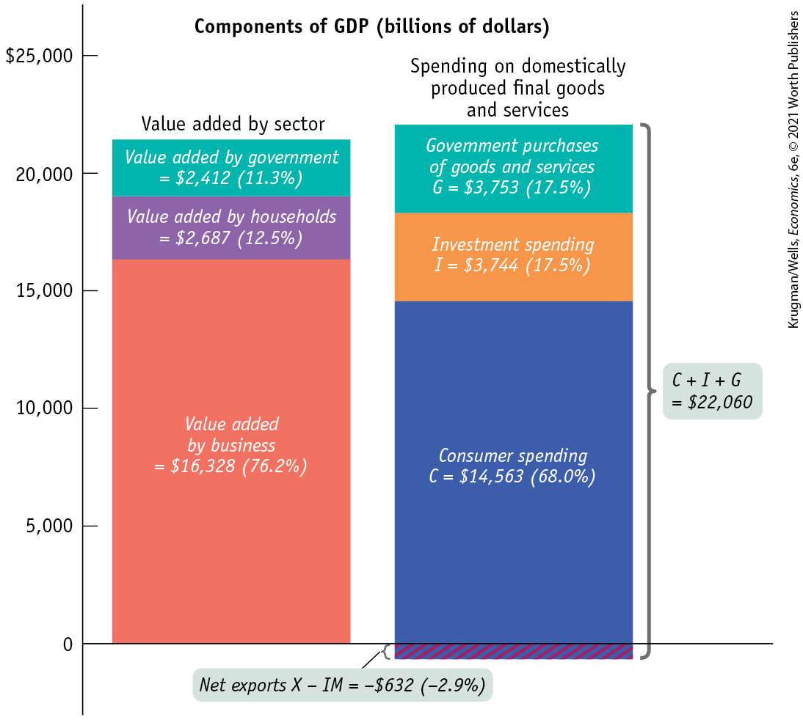
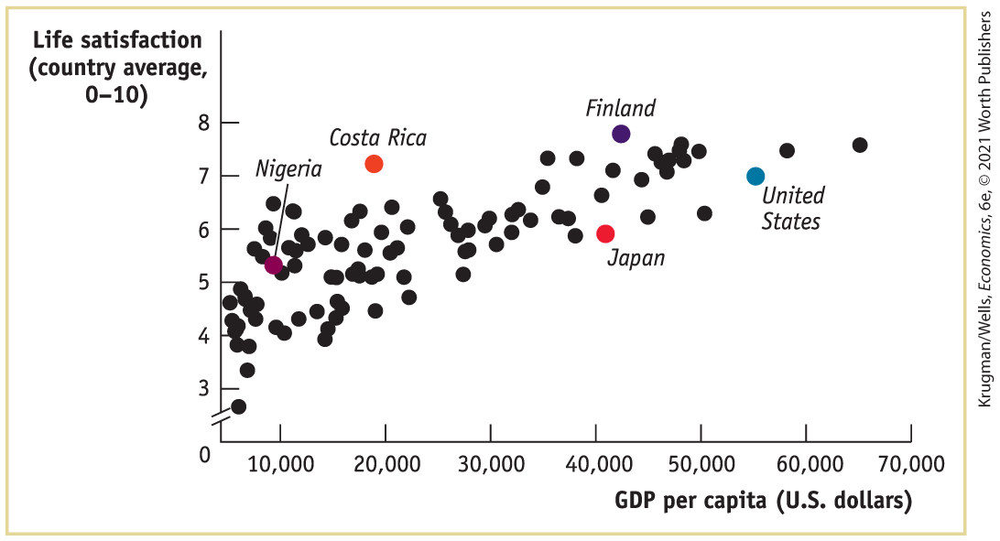

##### *PITFALLS*

GDP: WHAT’S IN AND WHAT’S OUT

It’s easy to confuse what is included in and excluded from GDP. For example, investment spending — spending on productive physical capital (including construction of residential and commercial structures), and changes to inventories (goods and raw materials held to facilitate business operations) — is included in GDP. But spending on intermediate goods and services, like the steel used to make cars, is not. Why?

The answer is that we only include items that are newly produced (unlike, say, used cars), and aren’t used up in production (like the steel in new cars). Here’s a table summarizing what’s in or out.

<table id="pau_9781319320164_P5V2PH4Ri5" class="table border c5 main-flow">
<colgroup>
<col style="width: 50%" />
<col style="width: 50%" />
</colgroup>
<thead>
<tr id="pau_9781319320164_iXGJhkNhJ8" class="header">
<th id="pau_9781319320164_m7M9de5Zq1" class="center v3" scope="col">
IN
</th>
<th id="pau_9781319320164_V9vamKsIG6" class="center v3" scope="col">
OUT
</th>
</tr>
</thead>
<tbody>
<tr id="pau_9781319320164_cF0Q9dZ1sd" class="odd">
<td id="pau_9781319320164_IVJIMMcbn3" class="left v4">
<strong>Investment spending</strong>

Spending on productive physical capital (including construction of residential and commercial structures) and changes to inventories

<strong>Capital spending</strong>

Considered part of investment spending

<strong>Domestically produced final goods and services</strong>

Includes capital goods and new construction of structures produced by firms (also includes owner-occupied home-based businesses like child care provided by households, and educational and other such services provided by the government)
</td>
<td id="pau_9781319320164_IxJj8JEToo" class="left v4">
<strong>Spending on intermediate goods and services</strong>

Inputs for production of final goods and services

<strong>Used goods</strong>

To include them would be to double-count: counting them once when sold as new and again when sold as used

<strong>Financial assets like stocks and bonds</strong>

They don’t represent either the production or the sale of final goods and services: a <em>bond</em> represents a promise to repay with interest; a <em>stock</em> represents a proof of ownership

<strong>Import Spending</strong>

Spending on goods and services produced outside the country are not part of domestic production and are excluded
</td>
</tr>
</tbody>
</table>

</aside>

We won’t emphasize factor income as much as the other two methods of calculating GDP. It’s important to keep in mind, however, that all the money spent on domestically produced goods and services generates factor income to households.

#### The Components of GDP

Now that we know how GDP is calculated in principle, let’s see what it looks like in practice.

<a href="#kru_9781319245269_ch07_02.xhtml#pau_9781319320164_LAUde9kuuG" id="kru_9781319245269_ch07_02.xhtml#pau_9781319320164_rqW51xCpNt" class="crossref">Figure 7-3</a> shows the first two methods of calculating GDP side by side. The height of each bar above the horizontal axis represents the GDP of the U.S. economy in 2019: \$21,428 billion. Each bar is divided to show the breakdown of that total in terms of where the value was added and how the money was spent.

<figure id="pau_9781319320164_LAUde9kuuG" class="figure lm_img_lightbox num c3 main-flow">

<figcaption>
FIGURE 7-3 U.S. GDP in 2019: Two Methods of Calculating GDP

The two bars show two equivalent ways of calculating GDP. The height of each bar above the horizontal axis represents $22,060 billion, U.S. GDP in 2019. The left bar shows the breakdown of GDP according to the value added of each sector of the economy: government, households, and firms. The right bar shows the breakdown of GDP according to the four types of aggregate spending: <em>C</em> + <em>I</em> + <em>G</em> + <em>X</em> − <em>I</em><em>M</em>. The right bar has a total length of $22, 060 billion + $632 billion = $21, 428 billion. The $632 billion, shown as the area extending below the horizontal axis, is the amount of total spending absorbed by net exports, which were negative in 2019. (Numbers may not add due to rounding.)

<em>Data from:</em> Bureau of Economic Analysis.
</figcaption>
</figure>

<aside class="hidden" id="pau_9781319320164_1UOwBiqaZu" title="hidden">

The graph is titled “Components of G D P (billions of dollars).” The vertical axis of the graph represents the values ranging from 0 to 25,000 dollars, in increments of 5,000 dollars. The graph has two bars. Each bar is segregated into three portions. The left bar shows the breakdown of G D P according to the value added by sectors, from bottom to top, as follows, Value added by business equals 16,328 dollars (76.2 percent), marked approximately between 0 and 15,680; Value added by households equals 2,687 dollars (12.5 percent), marked approximately between 15,681 and 18,250; and value added by Government equals 2,412 dollars (11.3 percent), marked approximately between 18,250 and 20,580. The right bar shows the breakdown of G D P according to Spending on domestically produced final goods and services, from bottom to top, as follows, Consumer spending, C equals 14,563 dollars (68.0 percent), marked approximately between 0 and 14,000; Investment spending, I equals 3,744 dollars (17.6 percent), marked approximately between 14,000 and 17,600; and Government purchases of goods and services, G equals 3,753 dollars (17.5 percent), marked approximately between 17,600 and 21,100. This bar extends below the horizontal axis for Net export, X minus I times M equals negative 632 dollars (negative 2.9 percent). A callout corresponding to the whole bar reads, C plus I plus G equals 22,060 dollars.

</aside>

In the left bar in <a href="#kru_9781319245269_ch07_02.xhtml#pau_9781319320164_LAUde9kuuG" id="kru_9781319245269_ch07_02.xhtml#pau_9781319320164_JAZazj91aw" class="crossref">Figure 7-3</a>, we see the breakdown of GDP by value added according to sector, the first method of calculating GDP. Of the \$21,428 billion, \$16,328 billion consisted of value added by businesses. Another \$2,687 billion of value added was added by households and institutions; a large part of that was the imputed services of owner-occupied housing, described in the For Inquiring Minds “Our Imputed Lives.” Finally, \$2,412 billion consisted of value added by government, in the form of military, education, and other government services.

The right bar in <a href="#kru_9781319245269_ch07_02.xhtml#pau_9781319320164_LAUde9kuuG" id="kru_9781319245269_ch07_02.xhtml#pau_9781319320164_LcClV76c9u" class="crossref">Figure 7-3</a> corresponds to the second method of calculating GDP, showing the breakdown by the four types of aggregate spending. The total length of the right bar is longer than the total length of the left bar, a difference of \$632 billion (which, as you can see, is the amount by which the right bar extends below the horizontal axis). That’s because the total length of the right bar represents total spending in the economy, spending on both domestically produced and foreign-produced final goods and services. Within the bar, consumer spending (*C*), which is 68.0% of GDP, dominates overall spending.

But some of that spending was absorbed by foreign-produced goods and services. In 2019, <a href="#kru_9781319245269_EM_glossary.xhtml#pau_9781319320164_eSKzWUjJ4H" id="kru_9781319245269_ch07_02.xhtml#pau_9781319320164_Mwrgkjecme" class="glossref" role="doc-glossref">net exports</a>, the difference between the value of exports and the value of imports (*X – IM* in <a href="#kru_9781319245269_ch07_02.xhtml#pau_9781319320164_vovnD2gdpq" id="kru_9781319245269_ch07_02.xhtml#pau_9781319320164_uQW7dmM3HM" class="crossref">Equation 7-1</a>) was negative — the United States was a net importer of foreign goods and services. The 2019 value of $X - IM$ was $- \text{\$}632\,\text{billion}$, or $- 2.9\%$ of GDP. Thus, a portion of the right bar extends below the horizontal axis by \$632 billion to represent the amount of total spending that was absorbed by net imports and so did not lead to higher U.S. GDP. Investment spending (*I*) constituted 17.5% of GDP; government purchases of goods and services (*G*) constituted 17.5% of GDP.

<aside aria-label="title 11" class="glossary c3 main-flow v1" epub:type="glossary" id="pau_9781319320164_1PWQloBaEc">

**net exports**  
**Net exports** are the difference between the value of exports and the value of imports.

</aside>

### What GDP Tells Us

We’ve now seen the various ways that gross domestic product is calculated. But what does the measurement of GDP tell us?

The most important use of GDP is as a measure of the size of the economy. For example, suppose you want to compare the economies of different nations. A natural approach is to compare their GDPs. In 2019, as we’ve seen, U.S. GDP was \$21,428 billion, China’s GDP was \$14,140 billion, and the combined GDP of the 28 countries that make up the European Union was \$18,292 billion.

But wait — didn’t we open this chapter by stating that by some measures, China has the world’s largest economy, while other measures show that the U.S. economy is still larger? Well, it turns out that one must be careful when using GDP numbers in comparing countries, and especially when making comparisons over time. That’s because part of the increase in the value of GDP over time represents increases in the *prices* of goods and services rather than an increase in output. For example, U.S. GDP was \$8,578 billion in 1997 and had more than doubled to \$21,428 billion by 2019. But the U.S. economy didn’t actually double in size over that period. To measure actual changes in aggregate output, we need a modified version of GDP that is adjusted for price changes, known as *real GDP.*

A similar issue arises when comparing the United States and China, because many goods and services sold inside China are much cheaper than they are in the United States, and estimates that take this into account find that China’s real GDP is bigger than the unadjusted number suggests. We’ll see next how real GDP is calculated.

### *\>\> Quick Review*

- A country’s **national income and product accounts**, or **national accounts**, track flows of money among economic sectors.
- There are four flows of money into the markets for goods and services: **consumer spending, government purchases of goods and services, exports**, and **investment spending.**
- Part of spending on goods and services flows out of the country via **imports.** The rest becomes sales by domestic producers.
- **Gross domestic product**, or **GDP**, can be calculated in three different ways: add up the **value added** by all firms; add up all spending on domestically produced **final goods and services**, an amount equal to **aggregate spending;** or add up all factor income paid by firms. **Intermediate goods and services** are not included in the calculation of GDP.

### *\>\> Check Your Understanding* 7-1

1.  Explain why the three methods of calculating GDP produce the same estimate of GDP.
2.  What are the various sectors to which firms make sales? What are the various ways in which households are linked with other sectors of the economy?
3.  Consider the first row of <a href="#kru_9781319245269_ch07_02.xhtml#pau_9781319320164_EY5e1hPPOd" id="kru_9781319245269_ch07_02.xhtml#pau_9781319320164_QTztFZVK7m" class="crossref">Figure 7-2</a> and suppose you mistakenly believed that total value added was \$30,500, the sum of the sales price of a car and a car’s worth of steel. What items would you be counting twice?

## Real GDP: A Measure of Aggregate Output

The U.S. economy had a pretty good year in 2019: the nation gained 2.1 million jobs, while the unemployment rate fell from 4.0% to 3.5%. It was certainly a better year than 1982, when a severe recession reduced employment by 2 million and sent unemployment soaring. Strange to say, however, gross domestic product rose slightly faster in 1982 (4.2%) than it did in 2019 (4.1%). How is that possible? The answer is that back in 1982 GDP was rising for a bad reason — inflation, which raised the prices of the goods and services America produced — not because the economy was actually growing. Inflation was much lower in 2019 so the rise in GDP really did correspond to economic progress.

In order to accurately measure the economy’s growth, we need a measure of <a href="#kru_9781319245269_EM_glossary.xhtml#pau_9781319320164_MluFOUovpR" id="kru_9781319245269_ch07_03.xhtml#pau_9781319320164_nSonXWh7YH" class="glossref" role="doc-glossref">aggregate output</a>: the total quantity of final goods and services the economy produces. The measure that is used for this purpose is known as *real GDP.* By tracking real GDP over time, we avoid the problem of changes in prices distorting the value of changes in production of goods and services over time. Let’s look first at how real GDP is calculated, then at what it means.

<aside aria-label="title 1" class="glossary c3 main-flow v1" epub:type="glossary" id="pau_9781319320164_uI4fS8QkyF">

**aggregate output**  
**Aggregate output** is the economy’s total quantity of output of final goods and services.

</aside>

### Calculating Real GDP

To understand how real GDP is calculated, imagine an economy in which only two goods, apples and oranges, are produced and in which both goods are sold only to final consumers. The outputs and prices of the two fruits for two consecutive years are shown in <a href="#kru_9781319245269_ch07_03.xhtml#pau_9781319320164_AMJVoJf2w2" id="kru_9781319245269_ch07_03.xhtml#pau_9781319320164_6iFP50NB26" class="crossref">Table 7-1</a>.

|                                       |         |         |
|---------------------------------------|---------|---------|
|                                       | Year 1  | Year 2  |
| Quantity of apples (billions)         | 2,000   | 2,200   |
| Price of apple                        | \$0.25  | \$0.30  |
| Quantity of oranges (billions)        | 1,000   | 1,200   |
| Price of orange                       | \$0.50  | \$0.70  |
| GDP (billions of dollars)             | \$1,000 | \$1,500 |
| Real GDP (billions of year 1 dollars) | \$1,000 | \$1,150 |

TABLE 7-1 Calculating GDP and Real GDP in a Simple Economy

The first thing we can say about these data is that the value of sales increased from year 1 to year 2. In the first year, the total value of sales was $(2,000\,\text{billion} \times \text{\$}0.25) + (1,000\,\text{billion} \times \text{\$}0.50) = \text{\$}1,000\,\text{billion}$; in the second it was $(2,200\,\text{billion} \times \text{\$}0.30) + (1,200\,\text{billion} \times \text{\$}0.70) = \text{\$}1,500\,\text{billion}$, which is 50% larger. But it is also clear from the table that this increase in the dollar value of GDP overstates the real growth in the economy. Although the quantities of both apples and oranges increased, the prices of both apples and oranges also rose. So part of the 50% increase in the dollar value of GDP from year 1 to year 2 simply reflects higher prices, not higher production of output.

To estimate the true increase in aggregate output produced, we have to ask: how much would GDP have gone up if prices had *not* changed? To answer this question, we need to find the value of output in year 2 expressed in year 1 prices. In year 1 the price of apples was \$0.25 each and the price of oranges \$0.50 each. So year 2 output *at year 1 prices* is $(2,200\,\text{billion} \times \text{\$}0.25) + (1,200\,\text{billion} \times \text{\$}0.50) = \text{\$}1,150\,\text{billion}$. And output in year 1 at year 1 prices was \$1,000 billion. So in this example GDP measured in year 1 prices rose 15% — from \$1,000 billion to \$1,150 billion.

Now we can define <a href="#kru_9781319245269_EM_glossary.xhtml#pau_9781319320164_Jr916hHf7g" id="kru_9781319245269_ch07_03.xhtml#pau_9781319320164_rer2BxPnwA" class="glossref" role="doc-glossref">real GDP</a>: it is the total value of final goods and services produced in the economy during a year, calculated as if prices had stayed constant at the level of some given base year. A real GDP number always comes with information about what the base year is.

<aside aria-label="title 2" class="glossary c3 main-flow v1" epub:type="glossary" id="pau_9781319320164_cDsRxMdkF0">

**real GDP**  
**Real GDP** is the total value of all final goods and services produced in the economy during a given year, calculated using the prices of a selected base year.

</aside>

A GDP number that has not been adjusted for changes in prices is calculated using the prices in the year in which the output is produced. Economists call this measure <a href="#kru_9781319245269_EM_glossary.xhtml#pau_9781319320164_VxI5e7Ys6i" id="kru_9781319245269_ch07_03.xhtml#pau_9781319320164_XSJDJDmAlQ" class="glossref" role="doc-glossref">nominal GDP</a>, GDP at current prices. If we had used nominal GDP to measure the true change in output from year 1 to year 2 in our apples and oranges example, we would have overstated the true growth in output: we would have claimed it to be 50%, when in fact it was only 15%. By comparing output in the two years using a common set of prices — the year 1 prices in this example — we are able to focus solely on changes in the quantity of output by eliminating the influence of changes in prices.

<aside aria-label="title 3" class="glossary c3 main-flow v1" epub:type="glossary" id="pau_9781319320164_IocottNfEB">

**nominal GDP**  
**Nominal GDP** is the value of all final goods and services produced in the economy during a given year, calculated using the prices current in the year in which the output is produced.

</aside>

<a href="#kru_9781319245269_ch07_03.xhtml#pau_9781319320164_nKj4kcE2Ik" id="kru_9781319245269_ch07_03.xhtml#pau_9781319320164_SfMBd73Dwf" class="crossref">Table 7-2</a> shows a real-life version of our apples and oranges example. The second column shows nominal GDP in 2005, 2012, and 2019. The third column shows real GDP for each year in 2012 dollars. For 2012 the two numbers are the same. But real GDP in 2005 expressed in 2012 dollars was higher than nominal GDP in 2005, reflecting the fact that prices were in general higher in 2012 than in 2005. Real GDP in 2019 expressed in 2012 dollars, however, was less than nominal GDP in 2019 because prices in 2012 were lower than in 2019.

|      |                                           |                                     |
|------|-------------------------------------------|-------------------------------------|
|      | Nominal GDP (billions of current dollars) | Real GDP (billions of 2012 dollars) |
| 2005 | \$13,037                                  | \$14,913                            |
| 2012 | 16,197                                    | 16,197                              |
| 2019 | \$21,428                                  | \$19.073                            |

TABLE 7-2 Nominal versus Real GDP in 2005, 2012, and 2019

You might have noticed that there is an alternative way to calculate real GDP using the data in <a href="#kru_9781319245269_ch07_03.xhtml#pau_9781319320164_AMJVoJf2w2" id="kru_9781319245269_ch07_03.xhtml#pau_9781319320164_CDkFH2Ihsq" class="crossref">Table 7-1</a>. Why not measure it using the prices of year 2 rather than year 1 as the base-year prices? This procedure seems equally valid. According to that calculation, real GDP in year 1 at year 2 prices is $(2,000\,\text{billion} \times \text{\$}0.30) + (1,000\,\text{billion} \times \text{\$}0.70) = \text{\$}1,300\,\text{billion}$; real GDP in year 2 at year 2 prices is \$1,500 billion, the same as nominal GDP in year 2. So using year 2 prices as the base year, the growth rate of real GDP is equal to $(\text{\$}1,500\,\text{billion} - \text{\$}1,300\,\text{billion})/\$ 1,300\,\text{billion} = 0.154,\,\text{or}\, 15.4\%$. This is slightly higher than the figure we got from the previous calculation, in which year 1 prices were the base-year prices. In that calculation, we found that real GDP increased by 15%. Neither answer, 15.4% versus 15%, is more “correct” than the other.

In reality, the government economists who put together the U.S. national accounts have adopted a method known as chain-linking to measure the change in real GDP; they use the average between the GDP growth rate calculated using an early base year and the GDP growth rate calculated using a late base year. As a result, U.S. statistics on real GDP are always expressed in <a href="#kru_9781319245269_EM_glossary.xhtml#pau_9781319320164_4YPNj79uIn" id="kru_9781319245269_ch07_03.xhtml#pau_9781319320164_FioLSpopoZ" class="glossref" role="doc-glossref">chained dollars</a>.

<aside aria-label="title 4" class="glossary c3 main-flow v1" epub:type="glossary" id="pau_9781319320164_42TCsk8bie">

**chained dollars**  
**Chained dollars** is the method of calculating changes in real GDP using the average between the growth rate calculated using an early base year and the growth rate calculated using a late base year.

</aside>

### What Real GDP Doesn’t Measure

GDP, nominal or real, is a measure of a country’s aggregate output. Other things equal, a country with a larger population will have higher GDP simply because there are more people working. So if we want to compare GDP across countries but want to eliminate the effect of differences in population size, we use the measure <a href="#kru_9781319245269_EM_glossary.xhtml#pau_9781319320164_vMcZRZSeKY" id="kru_9781319245269_ch07_03.xhtml#pau_9781319320164_A1qTIqRm6Z" class="glossref" role="doc-glossref">GDP per capita</a> — GDP divided by the size of the population, equivalent to the average GDP per person.

<aside aria-label="title 5" class="glossary c3 main-flow v1" epub:type="glossary" id="pau_9781319320164_29yQ3Ubrn8">

**GDP per capita**  
**GDP per capita** is GDP divided by the size of the population; it is equivalent to the average GDP per person.

</aside>

Real GDP per capita can be a useful measure in some circumstances, such as in a comparison of labor productivity between countries. However, despite the fact that it is a rough measure of the average real output per person, real GDP per capita has well-known limitations as a measure of a country’s living standards. Every once in a while economists are accused of believing that growth in real GDP per capita is the only thing that matters — that is, thinking that increasing real GDP per capita is a goal in itself. In fact, economists rarely make that mistake; the idea that economists care only about real GDP per capita is a sort of urban legend.

Let’s take a moment to be clear about why a country’s real GDP per capita is not a sufficient measure of human welfare in that country and why growth in real GDP per capita is not an appropriate policy goal in itself.

One way to think about this is to say that an increase in real GDP means an expansion in the economy’s production possibility frontier. Because the economy has increased its productive capacity, society can achieve more things. But whether society actually makes good use of that increased potential to improve living standards is another matter. To put it in a slightly different way, your income may be higher this year than last year, but whether you use that higher income to improve your quality of life is your choice.

Real GDP per capita, then, is a measure of an economy’s average aggregate output per person. A country with a high GDP can afford for its citizens to be healthy, to be well educated, and in general, to have a good quality of life. But there is not a one-to-one match between GDP and the quality of life.

<aside class="case-study c3 main-flow v5" epub:type="case-study" id="pau_9781319320164_6ZJpsuXoCR" title="GLOBAL COMPARISON GDP AND THE MEANING OF LIFE">

#### \>\> Global comparison

GDP AND THE MEANING OF LIFE

“I’ve been rich and I’ve been poor,” the actress Mae West famously declared. “Believe me, rich is better.” But is the same true for countries?

This figure shows two pieces of information for a number of countries: how rich they are, as measured by GDP per capita, and how people assess their well-being. Well-being was measured by a Gallup world survey that asked people to rate how satisfied they were with their lives on a scale of 0 to 10. The figure seems to tell us three things:

1.  *Rich is better.* Richer countries on average have a higher well-being than poor countries.
2.  *Money matters less as you grow richer.* As GDP rises, the average gain in life satisfaction per extra dollar gets smaller and smaller. Going from per capita GDP of \$20,000 to \$40,000 seems to produce no more gain than going from \$10,000 to \$20,000.
3.  *Money isn’t everything.* Costa Ricans, whose nation is only middle-income, seem more satisfied with their lives than citizens of much richer countries, like Japan.

These results are consistent with the observation that high GDP per capita makes it easier to achieve a good life but that countries aren’t equally successful in taking advantage of that possibility.

<figure id="pau_9781319320164_GYeTz8G1pL" class="figure lm_img_lightbox unnum c5 center">

<figcaption>
<em>Data from:</em> World Happiness Report (2019); World Bank.
</figcaption>
</figure>

<aside class="hidden" id="pau_9781319320164_7BrTp8xMtB" title="hidden">

The vertical axis is truncated and labeled “life satisfaction (country average 0 to 10)” and ranges from 3 to 8 in increments of 1. The horizontal axis is truncated and labeled G D P per capita, in US dollars, and ranges from 10,000 dollars to 70,000 dollars, in increments of 10,000 dollars. Data from the graph are as follows. Nigeria (10000, 5.3), Costa Rica (20000, 7.2), Japan (41000, 5.6), Finland (42000, 8), and United states (55000, 7). The scatter plot has unlabeled dots, clustered around Nigeria and scattered around other four points.

</aside>
</aside>

### ECONOMICS \>\> *in Action*

Argentina’s Peso Perplex

The South American nation of Argentina has had a troubled economic history, to the point where it has almost become a byword for economic crisis. In 2018 Argentina was in trouble again, suffering from a sudden loss of investor confidence. The country’s unemployment rate shot up from 7.2% in late 2017 to 9.1% in late 2018.

But how could this be? After all, Argentina’s GDP was rising rapidly, growing 43% from the last quarter of 2017 to the last quarter of 2018.

The answer was that this was the growth in *nominal* GDP, and one of Argentina’s problems was high inflation. *Real* GDP fell by more than 6% in 2018.

Argentina’s woes therefore offer a good example of why it’s important to distinguish between nominal and real GDP. They also demonstrate the importance of measuring inflation carefully — something that, as we explain in this chapter’s Business Case, Argentina’s government hasn’t always done.

### *\>\> Quick Review*

- To determine the actual growth in **aggregate output**, we calculate **real GDP** using prices from some given base year. In contrast, **nominal GDP** is the value of aggregate output calculated with current prices. U.S. statistics on real GDP are always expressed in **chained dollars.**
- Real **GDP per capita** is a measure of the average aggregate output per person. But it is not a sufficient measure of human welfare, nor is it an appropriate goal in itself, because it does not reflect important aspects of living standards within an economy.

### *\>\> Check Your Understanding* 7-2

1.  Assume there are only two goods in the economy, french fries and onion rings. In 2019, 1,000,000 servings of french fries were sold at \$0.40 each and 800,000 servings of onion rings at \$0.60 each. From 2019 to 2020 the price of french fries rose by 25% and the servings sold fell by 10%; the price of onion rings fell by 15% and the servings sold rose by 5%.
    1.  Calculate nominal GDP in 2019 and 2020. Calculate real GDP in 2020 using 2019 prices.
    2.  Why would an assessment of growth using nominal GDP be misguided?
2.  From 2016 to 2020, the price of electronic equipment fell dramatically and the price of housing rose dramatically. What are the implications of this in deciding whether to use 2016 or 2020 as the base year in calculating 2018 real GDP?

## Price Indexes and the Aggregate Price Level

In early 2020, drivers had something to celebrate: gasoline prices had tumbled to an average of \$1.77 per gallon, down 40% from their peak, a year earlier. But while driving was getting cheaper, having someplace to live when you arrived was getting more expensive: by the end of 2019, average rents were 3.7% higher than they had been when gas was its most expensive. So was the cost of living going up or down?

Clearly, there was a need for a single number summarizing what was happening to consumer prices. Just as macroeconomists find it useful to have a single number representing the overall level of output, they also find it useful to have a single number representing the overall level of prices: the <a href="#kru_9781319245269_EM_glossary.xhtml#pau_9781319320164_tLQecGawvf" id="kru_9781319245269_ch07_04.xhtml#pau_9781319320164_pgOSXIsLDo" class="glossref" role="doc-glossref">aggregate price level</a>. Yet a huge variety of goods and services are produced and consumed in the economy. How can we summarize the prices of all these goods and services with a single number? The answer lies in the concept of a *price index* — a concept best introduced with an example.

<aside aria-label="title 1" class="glossary c3 main-flow v1" epub:type="glossary" id="pau_9781319320164_xwTGtZuSjk">

**aggregate price level**  
The **aggregate price level** is a measure of the overall level of prices in the economy.

</aside>
