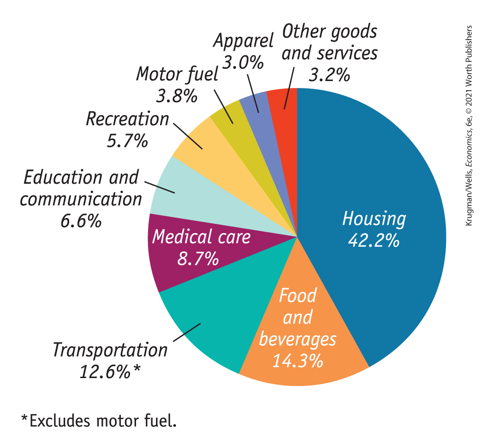
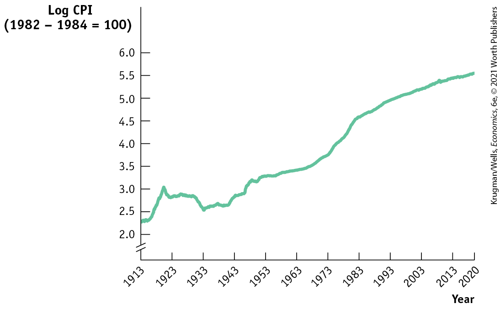
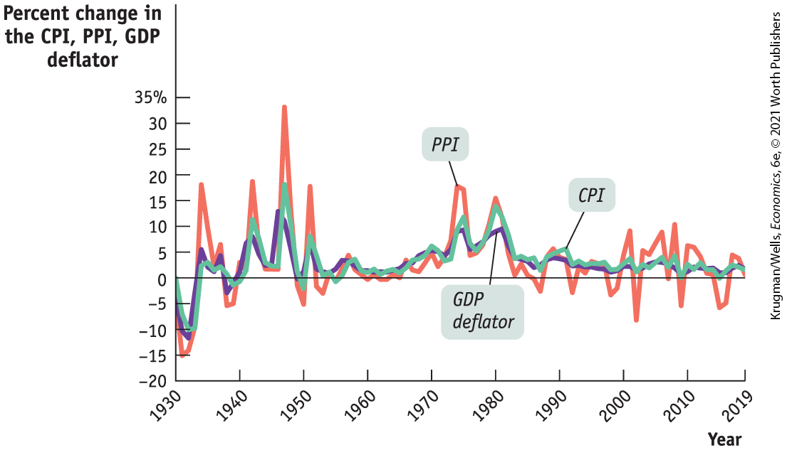
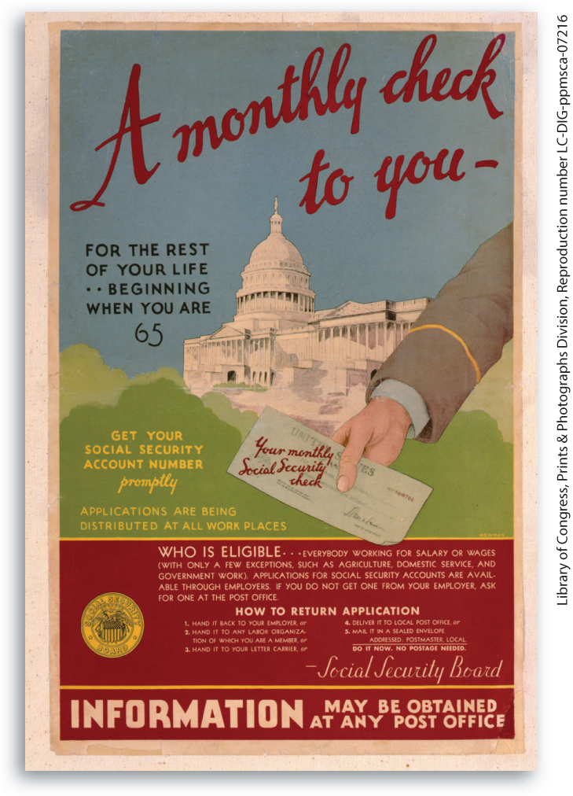

### Market Baskets and Price Indexes

Suppose that a frost in Florida destroys most of the citrus harvest. As a result, the price of an orange rises from \$0.20 to \$0.40, the price of a grapefruit rises from \$0.60 to \$1.00, and the price of a lemon rises from \$0.25 to \$0.45. How much has the price of citrus fruit increased?

One way to answer that question is to state three numbers — the changes in prices for oranges, grapefruit, and lemons. But this is a very cumbersome method. Rather than having to recite three numbers in an effort to track changes in the prices of citrus fruit, we would prefer to have some kind of overall measure of the *average* price change.

To measure average price changes for consumer goods and services, economists track changes in the cost of a typical consumer’s *consumption bundle* — the typical basket of goods and services purchased before the price changes. A hypothetical consumption bundle, used to measure changes in the overall price level, is known as a <a href="#kru_9781319245269_EM_glossary.xhtml#pau_9781319320164_rmHnVeYsdO" id="kru_9781319245269_ch07_04.xhtml#pau_9781319320164_KZqy85GN3H" class="glossref" role="doc-glossref">market basket</a>. Suppose that before the frost a typical consumer bought 200 oranges, 50 grapefruit, and 100 lemons over the course of a year, our market basket for this example.

<aside aria-label="title 2" class="glossary c3 main-flow v1" epub:type="glossary" id="pau_9781319320164_mRDdscbcW3">

**market basket**  
A **market basket** is a hypothetical set of consumer purchases of goods and services.

</aside>

<a href="#kru_9781319245269_ch07_04.xhtml#pau_9781319320164_oalmahTbLx" id="kru_9781319245269_ch07_04.xhtml#pau_9781319320164_WZTYRIAbwQ" class="crossref">Table 7-3</a> shows the pre-frost and post-frost cost of this market basket. Before the frost, it cost \$95; after the frost, the same bundle of goods cost \$175. Since $\text{\$}175\text{/}\text{\$}95 = 1.842$, the post-frost basket costs 1.842 times the cost of the pre-frost basket, a cost increase of 84.2%. In this example, the average price of citrus fruit has increased 84.2% since the base year as a result of the frost, where the base year is the initial year used in the measurement of the price change.

|                                                                |                                                                                                                                                                                                                                                                                                                                                                                                                                                               |                                                                                                                                                                                                                                                                                                                                                                                                                                                                |
|----------------------------------------------------------------|---------------------------------------------------------------------------------------------------------------------------------------------------------------------------------------------------------------------------------------------------------------------------------------------------------------------------------------------------------------------------------------------------------------------------------------------------------------|----------------------------------------------------------------------------------------------------------------------------------------------------------------------------------------------------------------------------------------------------------------------------------------------------------------------------------------------------------------------------------------------------------------------------------------------------------------|
|                                                                | Pre-frost                                                                                                                                                                                                                                                                                                                                                                                                                                                     | Post-frost                                                                                                                                                                                                                                                                                                                                                                                                                                                     |
| Price of orange                                                | \$0.20                                                                                                                                                                                                                                                                                                                                                                                                                                                        | \$0.40                                                                                                                                                                                                                                                                                                                                                                                                                                                         |
| Price of grapefruit                                            | 0.60                                                                                                                                                                                                                                                                                                                                                                                                                                                          | 1.00                                                                                                                                                                                                                                                                                                                                                                                                                                                           |
| Price of lemon                                                 | 0.25                                                                                                                                                                                                                                                                                                                                                                                                                                                          | 0.45                                                                                                                                                                                                                                                                                                                                                                                                                                                           |
| Cost of market basket (200 oranges, 50 grapefruit, 100 lemons) | $(200 \times \text{\$}0.20) +$ $(50 \times \text{\$}0.60) +$ $(100 \times \text{\$}0.25) = \text{\$}95.00$ | $(200 \times \text{\$}0.40) +$ $(50 \times \text{\$}1.00) +$ $(100 \times \text{\$}0.45) = \text{\$}175.00$ |

TABLE 7-3 Calculating the Cost of a Market Basket

Economists use the same method to measure changes in the overall price level over time. For example, to measure the change in the overall price level from 2010 (the base year) to 2020, they compare the cost of purchasing the market basket in 2010 to the cost in 2020. So they *normalize* the measure of the aggregate price level, meaning that they set the cost of the market basket equal to 100 in the chosen base year. Working with a market basket and a base year, and after normalizing, we arrive at a <a href="#kru_9781319245269_EM_glossary.xhtml#pau_9781319320164_986Avqg9WI" id="kru_9781319245269_ch07_04.xhtml#pau_9781319320164_RrgbkRXeW3" class="glossref" role="doc-glossref">price index</a>, a normalized measure of the overall price level. It is always cited along with the year for which the aggregate price level is being measured and the base year. A price index can be calculated using the following formula:

$$\text{Price}\,\text{index}\,\text{in}\,\text{a}\,\text{given}\,\text{year} = \frac{\text{Cost}\,\text{of}\,\text{market}\,\text{basket}\,\text{in}\,\text{a}\,\text{given}\,\text{year}}{\text{Cost}\,\text{of}\,\text{market}\,\text{basket}\,\text{in}\,\text{base}\,\text{year}} \times 100$$

**(7-2)**

<aside aria-label="title 3" class="glossary c3 main-flow v1" epub:type="glossary" id="pau_9781319320164_9DkuMDZtPd">

**price index**  
A **price index** measures the cost of purchasing a given market basket in a given year, where that cost is normalized so that it is equal to 100 in the selected base year.

</aside>

In our example, the citrus fruit market basket cost \$95 in the base year, the year before the frost. So by <a href="#kru_9781319245269_ch07_04.xhtml#pau_9781319320164_uMbaLRimal" id="kru_9781319245269_ch07_04.xhtml#pau_9781319320164_IcpwybXoBc" class="crossref">Equation 7-2</a> we define the price index for citrus fruit as $(\text{cost}\,\text{of}\,\text{market}\,\text{basket}\,\text{in}\,\text{a}\,\text{given}\,\text{year/}\text{\$}95) \times 100$, yielding an index of 100 for the period before the frost and 184.2 after the frost. You should note that the price index for the base year always results in a price index equal to 100. This is because the price index in the base year is equal to: $(\text{cost}\,\text{of}\,\text{market}\,\text{basket}\,\text{in}\,\text{base}\,\text{year/cost}\,\text{of}\,\text{market~}$$\text{basket}\,\text{in}\,\text{base}\,\text{year}) \times 100 = 100$.

Thus, the price index makes it clear that the average price of citrus has risen 84.2% as a consequence of the frost. Because of its simplicity and intuitive appeal, the method we’ve just described is used to calculate a variety of price indexes to track average price changes among a variety of different groups of goods and services. For example, the *consumer price index,* which we’ll discuss shortly, is the most widely used measure of the aggregate price level, the overall price level of final consumer goods and services across the economy.

Price indexes are also the basis for measuring inflation. The <a href="#kru_9781319245269_EM_glossary.xhtml#pau_9781319320164_KqqZ3CzpGs" id="kru_9781319245269_ch07_04.xhtml#pau_9781319320164_B00lJcagTj" class="glossref" role="doc-glossref">inflation rate</a> is the annual percent change in an official price index. The inflation rate from year 1 to year 2 is calculated using the following formula, where we assume that year 1 and year 2 are consecutive years:

$$\text{Inflation}\,\text{rate} = \frac{\text{Price}\,\text{index}\,\text{in}\,\text{year}\, 2 - \text{Price}\,\text{index}\,\text{in}\,\text{year}\, 1}{\text{Price}\,\text{index}\,\text{in}\,\text{year}\, 1} \times 100$$

**(7-3)**

<aside aria-label="title 4" class="glossary c3 main-flow v1" epub:type="glossary" id="pau_9781319320164_3ohUr1nZ7p">

**inflation rate**  
The **inflation rate** is the percent change per year in a price index — typically the consumer price index.

</aside>

Typically, a news report that cites “the inflation rate” is referring to the annual percent change in the consumer price index.

### The Consumer Price Index

The most widely used measure of prices in the United States is the <a href="#kru_9781319245269_EM_glossary.xhtml#pau_9781319320164_NDrP8biyu4" id="kru_9781319245269_ch07_04.xhtml#pau_9781319320164_tZP95Ju2yu" class="glossref" role="doc-glossref">consumer price index</a> (often referred to simply as the **<a href="#kru_9781319245269_EM_glossary.xhtml#pau_9781319320164_NDrP8biyu4" id="kru_9781319245269_ch07_04.xhtml#pau_9781319320164_fyYvarexBu" class="glossref" role="doc-glossref">CPI</a>**), which is intended to show how the cost of all purchases by a typical urban family has changed over time. It is calculated by surveying market prices for a market basket that is constructed to represent the consumption of a typical family of four living in a typical American city. The base period for the index is currently 1982–1984; that is, the index is calculated so that the average of consumer prices in 1982–1984 is 100.

<aside aria-label="title 5" class="glossary c3 main-flow v1" epub:type="glossary" id="pau_9781319320164_3WFb8uaiy8">

**consumer price index, or CPI**  
The **consumer price index**, or **CPI**, measures the cost of the market basket of a typical urban American family.

</aside>

The market basket used to calculate the CPI is far more complex than the three-fruit market basket we just described. In fact, to calculate the CPI, the Bureau of Labor Statistics sends its employees out to survey supermarkets, gas stations, hardware stores, and so on — some 23,000 retail outlets in 87 cities. Every month it tabulates about 80,000 prices, on everything from romaine lettuce to a medical check-up.

<a href="#kru_9781319245269_ch07_04.xhtml#pau_9781319320164_bUWeyKfXv3" id="kru_9781319245269_ch07_04.xhtml#pau_9781319320164_eLatknGRlX" class="crossref">Figure 7-4</a> shows the weight of major categories in the consumer price index as of December 2018. For example, motor fuel, mainly gasoline, accounted for 3.8% of the CPI. On the other hand, housing accounted for more than 42% of the CPI. So that 30% plunge in gasoline prices would have reduced the CPI by roughly $1.1\%~(0.30 \times 3.8\%)$, while the much smaller percentage rise in housing costs of 3.5% actually had a bigger positive effect on the overall price index of $1.5\%~(0.035 \times 42.2\%)$.

<figure id="pau_9781319320164_bUWeyKfXv3" class="figure lm_img_lightbox num c3 main-flow">

<figcaption>
FIGURE 7-4 The Makeup of the Consumer Price Index in 2018

This chart shows the percentage shares of major types of spending in the CPI as of December 2018. Housing, food, transportation, and motor fuel made up about 73% of the CPI market basket. (Numbers don’t add to 100% due to rounding.)

<em>Data from:</em> Bureau of Labor Statistics.
</figcaption>
</figure>

<aside class="hidden" id="pau_9781319320164_ZA5N6iEtvi" title="hidden">

The data from the pie chart are as follows, Housing, 42. 2 percent; Food and beverages, 14.3 percent; Transportation, 12.6 percent; Medical care, 8.7 percent; Education and Communication, 6.6 percent; Recreation, 5.7 percent; Motor fuel, 3.8 percent; Apparel, 3 percent; Other goods and services, 3.2 percent.

</aside>

<a href="#kru_9781319245269_ch07_04.xhtml#pau_9781319320164_T0dEysIqgg" id="kru_9781319245269_ch07_04.xhtml#pau_9781319320164_Bs1puetPex" class="crossref">Figure 7-5</a> shows how the CPI has changed since measurement began in 1913. Since 1940, the CPI has risen steadily, although its annual percent increases in recent years have been much smaller than those of the 1970s and early 1980s. (A logarithmic scale is used so that equal percent changes in the CPI have the same slope.)

<figure id="pau_9781319320164_T0dEysIqgg" class="figure lm_img_lightbox num c3 main-flow">

<figcaption>
FIGURE 7-5 The CPI, 1913–2020

Since 1940, the CPI has risen steadily. But the annual percentage increases in recent years have been much smaller than those of the 1970s and early 1980s. (The vertical axis is measured on a logarithmic scale so that equal percent changes in the CPI have the same slope.)

<em>Data from:</em> Bureau of Labor Statistics.
</figcaption>
</figure>

<aside class="hidden" id="pau_9781319320164_zaOFv9Bp0F" title="hidden">

The vertical axis is truncated and labeled “Log C P I, 1982 minus 1984 equals 100” and ranges from 2.0 to 6.0, in increments of 0.5. The horizontal axis, labeled “Year” plots years from 1913 to 2013, in increments of 10 years, and has a mark at 2020. Data from the graph are as follows. (1913, 2.3), (1923, 2.7), (1933, 2.5), (1943, 2.6), (1953, 3.3), (1963, 3.4), (1973, 3.6), (1983, 4.5), (1993, 5.0), (2003, 5.3) (2013, 5.4), and (2020, 5.5)

</aside>

The United States is not the only country that calculates a consumer price index. In fact, nearly every country has one. As you might expect, the market baskets that make up these indexes differ quite a lot from country to country. In poor countries, where people must spend a high proportion of their income just to feed themselves, food makes up a large share of the price index. Among high-income countries, differences in consumption patterns lead to differences in the price indexes: the Japanese price index puts a larger weight on raw fish and a smaller weight on beef than ours does, and the French price index puts a larger weight on wine.

### Other Price Measures

There are two other price measures that are also widely used to track economy-wide price changes. One is the <a href="#kru_9781319245269_EM_glossary.xhtml#pau_9781319320164_7hr0sAxoNV" id="kru_9781319245269_ch07_04.xhtml#pau_9781319320164_VIqXFZZ79B" class="glossref" role="doc-glossref">producer price index</a> (or <a href="#kru_9781319245269_EM_glossary.xhtml#pau_9781319320164_7hr0sAxoNV" id="kru_9781319245269_ch07_04.xhtml#pau_9781319320164_VIqXFZZ79A" class="glossref" role="doc-glossref">PPI</a>, which used to be known as the *wholesale price index*). As its name suggests, the PPI measures the cost of a typical basket of goods and services — containing raw commodities such as steel, electricity, coal, and so on — purchased by producers. Because commodity producers are relatively quick to change prices when they perceive a change in overall demand for their goods, the PPI often responds to inflationary or deflationary pressures more quickly than the CPI. As a result, a change in the PPI is often regarded as an early warning signal of changes in the inflation rate.

<aside aria-label="glossary" class="glossary c3 main-flow v1" epub:type="glossary" id="pau_9781319320164_wAL7o90q9C">

**producer price index**, or **PPI**  
The **producer price index**, or **PPI**, measures changes in the prices of goods purchased by producers.

</aside>

The other widely used price measure is the *GDP deflator;* it isn’t exactly a price index, although it serves the same purpose. Recall in our discussion of <a href="#kru_9781319245269_ch07_03.xhtml#pau_9781319320164_nKj4kcE2Ik" id="kru_9781319245269_ch07_04.xhtml#pau_9781319320164_nhVnZvSJxT" class="crossref">Table 7-2</a> we distinguished between *nominal GDP* (GDP in current prices) and *real GDP* (GDP calculated using the prices of a base year). The <a href="#kru_9781319245269_EM_glossary.xhtml#pau_9781319320164_s1HSt0ZGCG" id="kru_9781319245269_ch07_04.xhtml#pau_9781319320164_B0wkxIzfTK" class="glossref" role="doc-glossref">GDP deflator</a> for a given year is equal to 100 times the ratio of nominal GDP for that year to real GDP for that year. Since real GDP is currently expressed in 2012 dollars, the GDP deflator for 2012 is equal to 100. If nominal GDP doubles but real GDP does not change, the GDP deflator indicates that the aggregate price level doubled.

<aside aria-label="title 6" class="glossary c3 main-flow v1" epub:type="glossary" id="pau_9781319320164_fW4ZrHrNoF">

**GDP deflator**  
The **GDP deflator** for a given year is 100 times the ratio of nominal GDP to real GDP in that year.

</aside>

Perhaps the most important point about the different inflation rates generated by these three measures of prices is that they usually move closely together (although the PPI tends to fluctuate more than either of the other two measures). <a href="#kru_9781319245269_ch07_04.xhtml#pau_9781319320164_ALT4HZCqPS" id="kru_9781319245269_ch07_04.xhtml#pau_9781319320164_GucwcwWYB3" class="crossref">Figure 7-6</a> shows the annual percent changes in the three indexes since 1930. By all three measures, the U.S. economy experienced deflation during the early years of the Great Depression, inflation during World War II, accelerating inflation during the 1970s, and a return to relative price stability in the 1990s. Notice, by the way, the dramatic ups and downs in producer prices from 2000 to 2019 on the graph; this reflects large swings in energy and food prices, which play a much bigger role in the PPI than they do in either the CPI or the GDP deflator.

<figure id="pau_9781319320164_ALT4HZCqPS" class="figure lm_img_lightbox num c3 main-flow">

<figcaption>
FIGURE 7-6 The CPI, the PPI, and the GDP Deflator

As the figure shows, the three different measures of inflation, the PPI (orange), the CPI (green), and the GDP deflator (purple), usually move closely together. Each reveals a drastic acceleration of inflation during the 1970s and a return to relative price stability in the 1990s. With the exception of a brief period of deflation in 2009, prices have remained stable from 2000 to 2019.

<em>Data from:</em> Bureau of Labor Statistics; Bureau of Economic Analysis.
</figcaption>
</figure>

<aside class="hidden" id="pau_9781319320164_9v8jNsgqu5" title="hidden">

The vertical axis, labeled “Percent change in the C P I, P P I, G D P deflator” ranges from negative 20 to 35 percent, in increments of 5 percent. The horizontal axis, labeled “Year” plots years from 1930 to 2010, in increments of 10 years, and has a tick mark at 2019. The graph shows three different measures of inflation: the P P I, denoted in orange; the C P I, denoted in green; and the G D P deflator, denoted in purple. These three curves run closely together. The trend, representing P P I, has more fluctuation than the trends representing G D P deflator and C P I. In the years from 1930 to 1950, the P P I trend ranges from negative 15 percent to 34 percent, and between 1950 and 2019, the percent change ranges from negative 7 to 17 percent. The trend representing G D P deflator, for the most part, ranges between 0 and 13 percent, except from 1930 to 1934, where it runs in negative. The trend representing C P I ranges from 0 to 14 percent.

</aside>

### ECONOMICS \>\> *in Action*

Indexing to the CPI

Although GDP is a very important number for shaping economic policy, official statistics on GDP don’t have a direct effect on people’s lives. The CPI, by contrast, has a direct and immediate impact on millions of Americans.

The reason is that many payments are tied, or *indexed,* to the CPI — the amount paid rises or falls when the CPI rises or falls.

The practice of indexing payments to consumer prices goes back to the dawn of the United States as a nation. In 1780 the Massachusetts State Legislature recognized that the pay of its soldiers fighting the British needed to be increased because of inflation that occurred during the Revolutionary War. The legislature adopted a formula that made a soldier’s pay proportional to the cost of a market basket that consisted of 5 bushels of corn, $68\frac{4}{7}$ pounds of beef, 10 pounds of sheep’s wool, and 16 pounds of shoe leather.

Today, 63 million people receive payments from Social Security, a national retirement program that accounts for almost a quarter of current total federal spending — more than the defense budget. The amount of an individual’s Social Security payment is determined by a formula that reflects each person’s previous payments into the system and other factors. In addition, all Social Security payments are adjusted each year to offset any increase in consumer prices over the previous year. The CPI is used to calculate the official estimate of the inflation rate used to adjust these payments yearly. So every percentage point added to the official estimate of the rate of inflation adds 1% to the checks received by tens of millions of individuals.

<figure id="pau_9781319320164_IFtZKgpJzQ" class="figure lm_img_lightbox unnum c2 right">

<figcaption>
A small change in the CPI has large consequences for those dependent on Social Security payments.
</figcaption>
</figure>

<aside class="hidden" id="pau_9781319320164_taf3yCUnSh" title="hidden">

An illustration on the leaflet shows the U S Congress building accompanied by a hand holding out a check with text on it that reads, your monthly social security check.

</aside>

Other government payments, such as disability benefits, are also indexed to the CPI. In addition, income tax brackets, the bands of income levels that determine a taxpayer’s income tax rate, are indexed to the CPI. (Individuals in a higher income bracket pay a higher income tax rate in a progressive tax system like ours.) Indexing also extends to the private sector, where some private contracts, including some wage settlements, contain cost-of-living allowances (called COLAs) that adjust payments in proportion to changes in the CPI.

Because the CPI plays such an important and direct role in people’s lives, it’s a politically sensitive number. The Bureau of Labor Statistics, which calculates the CPI, takes great care in collecting and interpreting price and consumption data. It uses a complex method in which households are surveyed to determine what they buy and where they shop, and a carefully selected sample of stores are surveyed to get representative prices.

### *\>\> Quick Review*

- Changes in the **aggregate price level** are measured by the cost of buying a particular **market basket** during different years. A **price index** for a given year is the cost of the market basket in that year normalized so that the price index equals 100 in a selected base year.
- The **inflation rate** is calculated as the percent change in a price index. The most commonly used price index is the **consumer price index**, or **CPI**, which tracks the cost of a basket of consumer goods and services. The **producer price index**, or **PPI**, does the same for goods and services used as inputs by firms. The **GDP deflator** measures the aggregate price level as the ratio of nominal to real GDP times 100. These three measures normally behave quite similarly.

### *Check Your Understanding* 7-3

1.  Consider <a href="#kru_9781319245269_ch07_04.xhtml#pau_9781319320164_oalmahTbLx" id="kru_9781319245269_ch07_04.xhtml#pau_9781319320164_USicn76Whs" class="crossref">Table 7-3</a> but suppose that the market basket is composed of 100 oranges, 50 grapefruit, and 200 lemons. How does this change the pre-frost and post-frost price indexes? Explain. Generalize your explanation to how the construction of the market basket affects the price index.
2.  For each of the following events, how would an economist using a 10-year-old market basket create a bias in measuring the change in the cost of living today?
    1.  A typical family owns more cars than it would have a decade ago. Over that time, the average price of a car has increased more than the average prices of other goods.
    2.  Virtually no households had broadband internet access 20 years ago. Now many households have it, and the price has regularly fallen each year.
3.  The consumer price index in the United States (base period 1982–1984) was 254.943 in 2019 and 255.902 in 2020. Calculate the inflation rate from 2019 to 2020.

## Business case 

Paying for a Heads-Up on Inflation

<figure id="pau_9781319320164_9mUISViu2m" class="figure lm_img_lightbox unnum c2 right">

</figure>

Normally we rely on governments to produce key economic statistics. But what if you can’t trust the government’s numbers? That’s what happened in Argentina from 2007 to 2016, where it was common knowledge that the government was manipulating the data to make inflation look lower than it really was. In response, researchers at MIT and Harvard created what they called The Billion Prices Project, using online prices to create their own measures of inflation, first for Argentina, then for a number of other countries, including the United States. The researchers found that by the middle of 2015 inflation in Argentina had risen to nearly 27.18%, but official measures showed an annual inflation rate of 14.85%. The story was a bit different for the United States. While official inflation measures reported an inflation rate of 0.17%, the project reported an annual inflation rate of −0.60%.

The Billion Prices Project played a surprisingly important role in the U.S. economic debate around 2011–2012. At the time a number of prominent commentators were claiming that official U.S. measures of consumer prices were understating the true rate of inflation. One way to see whether this was really happening was to compare the official inflation rate with the independently calculated Billion Prices measure. As it happened, there was very little difference between the two measures; the U.S. government was, in fact, reporting the numbers honestly.

But if the government numbers are okay, who needs an independent private inflation measure? The answer is that the Billion Prices measure, which is based on online data, can track inflation more or less in real time, unlike the CPI, which is only released once a month.

And there is, it turns out, a market for early reads on the inflation rate. PriceStats, a company owned by State Street Bank, uses Billion Prices data to produce real-time inflation estimates, which are made available to customers — mainly businesses — who pay a subscription fee. PriceStats data give you a heads-up on inflation trends, a few weeks before everyone else has the official data. And people are willing to pay for that heads-up.

<aside class="assessments c3 main-flow v1" epub:type="assessments" id="pau_9781319320164_xB8iGAbHec">

### Questions for thought

1.  Why do you think the government of Argentina might have wanted to pretend that inflation was lower than it really was?
2.  If researchers can produce a pretty good inflation measure just using online data, why do we need the elaborate process used to create the CPI?
3.  Elaborating on <a href="#kru_9781319245269_ch07_05.xhtml#pau_9781319320164_2awj2SVptA" id="kru_9781319245269_ch07_05.xhtml#pau_9781319320164_t2TEntaTsF" class="crossref">Question 2</a>, what things might the Billion Prices index miss? Think about what we said about the weights of various goods in the CPI.

</aside>

### Summary

1.  Economists keep track of the flows of money between sectors with the **national income and product accounts**, or **national accounts.** Demand for goods and services comes from **consumer spending, investment spending**, and **government purchases of goods and services. Exports** generate an inflow of funds into the country from the rest of the world, but **imports** lead to an outflow of funds to the rest of the world.
2.  **Gross domestic product**, or **GDP**, measures the value of all **final goods and services** produced in the economy. It does not include the value of **intermediate goods and services**, but it does include **net exports** $\left( \mathit{X} - \mathit{IM} \right)$. It can be calculated in three ways: add up the **value added** by all producers; add up all spending on domestically produced final goods and services, leading to the equation $\text{GDP} = C + I + G + X - IM$, also known as **aggregate spending;** or add up all the income paid by domestic firms to factors of production. These three methods are equivalent because in the economy as a whole, total income paid by domestic firms to factors of production must equal total spending on domestically produced final goods and services.
3.  **Real GDP** is the value of the final goods and services produced calculated using the prices of a selected base year. Except in the base year, real GDP is not the same as **nominal GDP**, the value of **aggregate output** calculated using current prices. Analysis of the growth rate of aggregate output must use real GDP because doing so eliminates any change in the value of aggregate output due solely to price changes. Real **GDP per capita** is a measure of average aggregate output per person but is not in itself an appropriate policy goal. U.S. statistics on real GDP are always expressed in **chained dollars.**
4.  To measure the **aggregate price level**, economists calculate the cost of purchasing a **market basket.** A **price index** is the ratio of the current cost of that market basket to the cost in a selected base year, multiplied by 100.
5.  The **inflation rate** is the yearly percent change in a price index, typically based on the **consumer price index**, or **CPI**, the most common measure of the aggregate price level. A similar index for goods and services purchased by firms is the **producer price index**, or **PPI.** Finally, economists also use the **GDP deflator**, which measures the price level by calculating the ratio of nominal GDP to real GDP times 100.

### Key Terms

- <a href="#kru_9781319245269_ch07_02.xhtml#pau_9781319320164_4gjQOhMcyp" id="kru_9781319245269_ch07_06.xhtml#pau_9781319320164_cNAGdRv5OP" class="crossref">National income and product accounts (national accounts)</a>
- <a href="#kru_9781319245269_ch07_02.xhtml#pau_9781319320164_lVHUpPugzJ" id="kru_9781319245269_ch07_06.xhtml#pau_9781319320164_yg9BhaduH6" class="crossref">Government purchases of goods and services</a>
- <a href="#kru_9781319245269_ch07_02.xhtml#pau_9781319320164_L571GMRCNm" id="kru_9781319245269_ch07_06.xhtml#pau_9781319320164_15OJqYL5OE" class="crossref">Consumer spending</a>
- <a href="#kru_9781319245269_ch07_02.xhtml#pau_9781319320164_TNgZsxqS4U" id="kru_9781319245269_ch07_06.xhtml#pau_9781319320164_eAXhY6Mha6" class="crossref">Investment spending</a>
- <a href="#kru_9781319245269_ch07_02.xhtml#pau_9781319320164_Z0sM346DEf" id="kru_9781319245269_ch07_06.xhtml#pau_9781319320164_YHfDWHGtf8" class="crossref">Exports</a>
- <a href="#kru_9781319245269_ch07_02.xhtml#pau_9781319320164_R4K5zxOaKh" id="kru_9781319245269_ch07_06.xhtml#pau_9781319320164_L3vi20OSKs" class="crossref">Imports</a>
- <a href="#kru_9781319245269_ch07_02.xhtml#pau_9781319320164_Du0zLdzTxM" id="kru_9781319245269_ch07_06.xhtml#pau_9781319320164_ZTCBG0YVZp" class="crossref">Final goods and services</a>
- <a href="#kru_9781319245269_ch07_02.xhtml#pau_9781319320164_ax58FuuEt3" id="kru_9781319245269_ch07_06.xhtml#pau_9781319320164_sninELXP4y" class="crossref">Intermediate goods and services</a>
- <a href="#kru_9781319245269_ch07_02.xhtml#pau_9781319320164_DvPVkEQaZP" id="kru_9781319245269_ch07_06.xhtml#pau_9781319320164_BttV789yxj" class="crossref">Gross domestic product (GDP)</a>
- <a href="#kru_9781319245269_ch07_02.xhtml#pau_9781319320164_Yg1mQA0TYC" id="kru_9781319245269_ch07_06.xhtml#pau_9781319320164_CJr1j8lJwR" class="crossref">Aggregate spending</a>
- <a href="#kru_9781319245269_ch07_02.xhtml#pau_9781319320164_lnL5DAMQLw" id="kru_9781319245269_ch07_06.xhtml#pau_9781319320164_bZRkfiEkGR" class="crossref">Value added</a>
- <a href="#kru_9781319245269_ch07_02.xhtml#pau_9781319320164_RYRk87xeO2" id="kru_9781319245269_ch07_06.xhtml#pau_9781319320164_m0BgQBAJ6Z" class="crossref">Net exports</a>
- <a href="#kru_9781319245269_ch07_03.xhtml#pau_9781319320164_RM6KSj4Jl0" id="kru_9781319245269_ch07_06.xhtml#pau_9781319320164_3ADeBQVg9B" class="crossref">Aggregate output</a>
- <a href="#kru_9781319245269_ch07_03.xhtml#pau_9781319320164_fCqhjmmaTF" id="kru_9781319245269_ch07_06.xhtml#pau_9781319320164_hvOhaAO7VW" class="crossref">Real GDP</a>
- <a href="#kru_9781319245269_ch07_03.xhtml#pau_9781319320164_CTNG21RmBm" id="kru_9781319245269_ch07_06.xhtml#pau_9781319320164_fT942O4hgI" class="crossref">Nominal GDP</a>
- <a href="#kru_9781319245269_ch07_03.xhtml#pau_9781319320164_G6kcRD9yI9" id="kru_9781319245269_ch07_06.xhtml#pau_9781319320164_BoVNBBmJlx" class="crossref">Chained dollars</a>
- <a href="#kru_9781319245269_ch07_03.xhtml#pau_9781319320164_lrYcbI90tW" id="kru_9781319245269_ch07_06.xhtml#pau_9781319320164_57qMGiT8Rw" class="crossref">GDP per capita</a>
- <a href="#kru_9781319245269_ch07_04.xhtml#pau_9781319320164_9RAz3aChw8" id="kru_9781319245269_ch07_06.xhtml#pau_9781319320164_2VviUPUJJv" class="crossref">Aggregate price level</a>
- <a href="#kru_9781319245269_ch07_04.xhtml#pau_9781319320164_09HUd7GaO9" id="kru_9781319245269_ch07_06.xhtml#pau_9781319320164_hOspymgS4H" class="crossref">Market basket</a>
- <a href="#kru_9781319245269_ch07_04.xhtml#pau_9781319320164_d0QH6SqUfC" id="kru_9781319245269_ch07_06.xhtml#pau_9781319320164_XKYWjvubI4" class="crossref">Price index</a>
- <a href="#kru_9781319245269_ch07_04.xhtml#pau_9781319320164_CrkzmRKsuj" id="kru_9781319245269_ch07_06.xhtml#pau_9781319320164_9CeB5NmTpU" class="crossref">Inflation rate</a>
- <a href="#kru_9781319245269_ch07_04.xhtml#pau_9781319320164_CFwFCVbX5j" id="kru_9781319245269_ch07_06.xhtml#pau_9781319320164_sEKzN9jHEf" class="crossref">Consumer price index (CPI)</a>
- <a href="#kru_9781319245269_ch07_04.xhtml#pau_9781319320164_0qYDPpSEzl" id="kru_9781319245269_ch07_06.xhtml#pau_9781319320164_JblncD9ANM" class="crossref">Producer price index (PPI)</a>
- <a href="#kru_9781319245269_ch07_04.xhtml#pau_9781319320164_BFBjdCUdEf" id="kru_9781319245269_ch07_06.xhtml#pau_9781319320164_4fPKdW1wya" class="crossref">GDP deflator</a>
