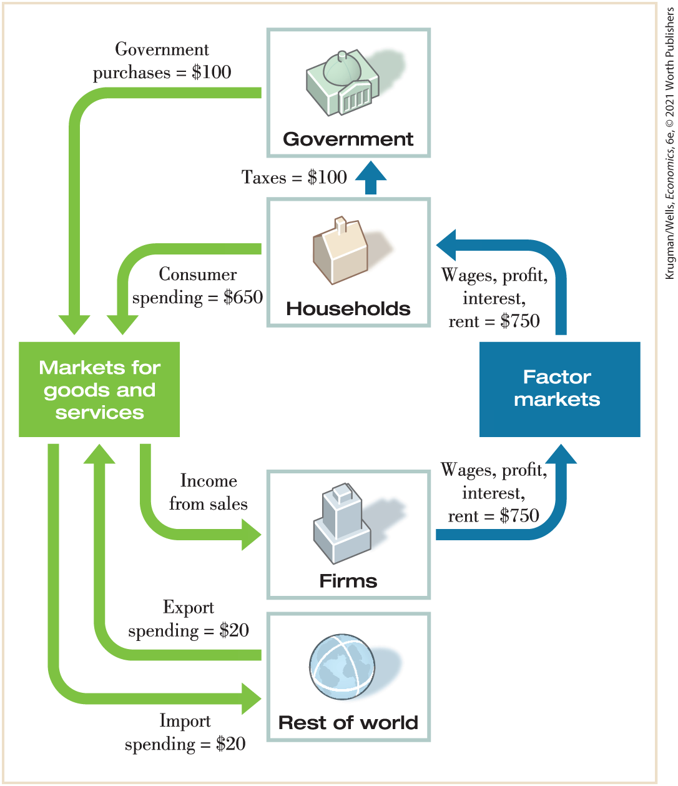
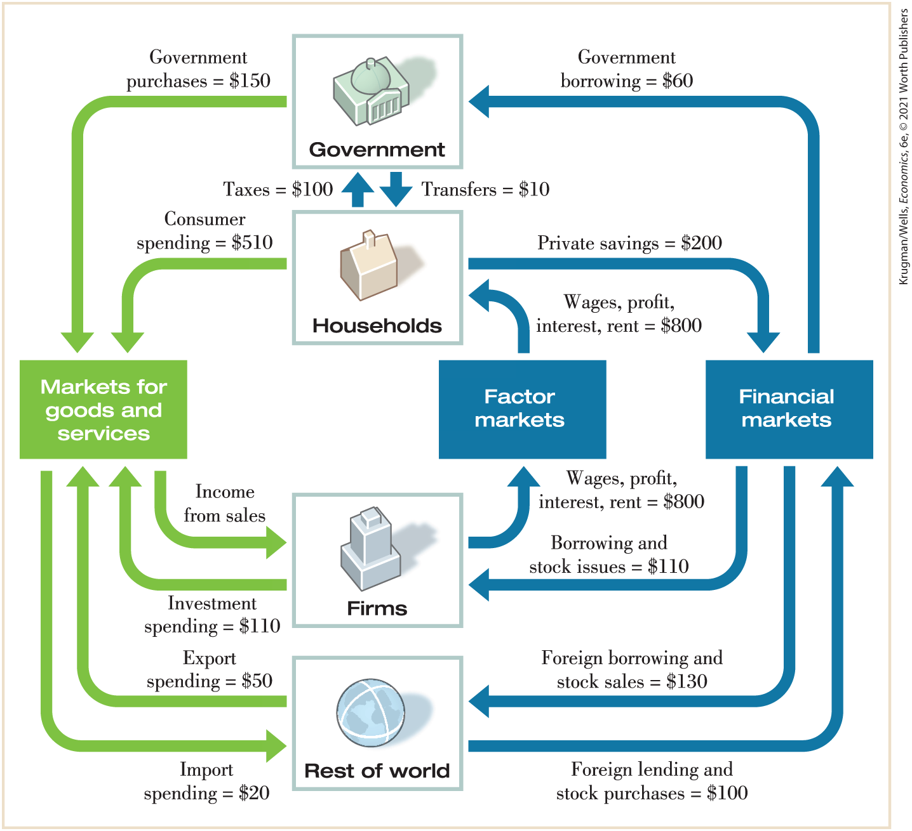

### Practice questions

1.  Go to the Bureau of Labor Statistics home page at <a href="http://www.bls.gov" id="kru_9781319245269_ch07_06.xhtml#pau_9781319320164_qjTMGKti9Z" class="external">www.bls.gov</a>. Click on the “Economic Releases” tab and then click on “Major Economic Indicators” in the drop-down menu that appears. Once on the “Major Economic Indicators” page, click on “Consumer Price Index.” On that page, under “Table of Contents,” click on “Table 1: Consumer Price Index for All Urban Consumers.” Using the “unadjusted” figures, determine what the CPI was for the previous month. How did it change from the previous month? How does the CPI compare to the same month one year ago?
2.  Explain the difference between intermediate and investment goods. Are intermediate and investment goods included in GDP? Explain.
3.  Analyze the following statement: “GDP has increased by 2% from last year. This is a good indicator of economic well-being as it represents an average increase in incomes.”
4.  Using <a href="#kru_9781319245269_ch07_04.xhtml#pau_9781319320164_bUWeyKfXv3" id="kru_9781319245269_ch07_06.xhtml#pau_9781319320164_CaqX55QKF7" class="crossref">Figure 7-4</a>, explain how the current weighting of the CPI index could lead to either over or understating the actual inflation rate for your household.

### PROBLEMS

1.  At right is a simplified circular-flow diagram for the economy of Micronia. (Note that there is no investment spending and no transfers in Micronia.)

    1.  What is the value of GDP in Micronia?
    2.  What is the value of net exports?
    3.  What is the value of disposable income?
    4.  Does the total flow of money out of households — the sum of taxes paid and consumer spending — equal the total flow of money into households?
    5.  How does the government of Micronia finance its purchases of goods and services?

    <figure id="pau_9781319320164_95jFem2MAy" class="figure lm_img_lightbox unnum c5 center">
    
    </figure>

    <aside class="hidden" id="pau_9781319320164_yyRFPWSiNp" title="hidden">

    There are four components in the chart, two on the top labeled Government and Household and two at the bottom labeled Firms and rest of the world. Two other components, placed horizontally, are labeled Market for goods and services, and Factor markets. Two arrows, one labeled “Government purchases equals 100 dollars” begins from government, and the other labeled “Consumer spending equals 650 dollars” begins from household, both lead to Market for goods and services. An arrow labeled Income for sales flows from market for goods and services to Firms. Another arrow labeled Import spending equals 20 dollars flows from Markets for goods and services to Rest of world. An arrow labeled Export spending equals 20 dollars flows back from Rest of the word to Market for goods and services. An arrow labeled Wages, profit, interest, rent equals 750 dollars flows from Firms and through Factor market it reaches household. Households pay Taxes equals 100 dollars to the government.

    </aside>

2.  A more complex circular-flow diagram for the economy of Macronia is shown at right.

    1.  What is the value of GDP in Macronia?
    2.  What is the value of net exports?
    3.  What is the value of disposable income?
    4.  Does the total flow of money out of households — the sum of taxes paid, consumer spending, and private savings — equal the total flow of money into households?

    <figure id="pau_9781319320164_G04hmbgFSW" class="figure lm_img_lightbox unnum c5 center">
    
    </figure>

    <aside class="hidden" id="pau_9781319320164_m1OwctNO9F" title="hidden">

    There are four components in the chart, two on the top labeled Government and Household and two at the bottom labeled Firms and rest of the world. Three other components, placed horizontally, are labeled Market for goods and services, Factor markets, and financial markets respectively. Two arrows, one labeled “Government purchases equals 150 dollars” begins from government, and the other labeled “Consumer spending equals 510 dollars” begins from household, both lead to Market for goods and services. An arrow labeled Income for sales flows from market for goods and services to Firms. An arrow from Firms, flows back to Markets for goods and services, and it is labeled Investment spending equals 110 dollars. Another arrow labeled Export spending equals 50 dollars flows from Rest of world Markets for goods and services. An arrow labeled Import spending equals 20 dollars flows back from Market for goods and services to Rest of the word. An arrow labeled Foreign lending and stock purchases equals 100 dollars flows from Rest of world to Financial markets from which an arrow labeled Foreign borrowing and stock sales equals 130 dollars flows back to Rest of world. An arrow from Financial markets flows to Firms; it is labeled Borrowing and stock issues equals 110 dollars. An arrow labeled Wages, profit, interest, rent equals 800 dollars flows from Firms and through Factor market it reaches household. Private saving equals flows from household to Financial market from which Government borrowing equals 60 dollars flows to government. Household pays taxes equals 100 dollars to government, and Government transfers tax revenue of 10 dollars to household.

    </aside>

3.  The components of GDP in the accompanying table were produced by the Bureau of Economic Analysis.
    | Category                                                               | Components of GDP in 2018 (billions of dollars) |
    |------------------------------------------------------------------------|-------------------------------------------------|
    | **Consumer spending**                                                  |                                                 |
    |     Durable goods                                                      | \$1,475.1                                       |
    |     Nondurable goods                                                   |   2,889.2                                       |
    |     Services                                                           |   9,633.9                                       |
    | **Private investment spending**                                        |                                                 |
    |     Fixed investment spending                                          | 3,573.6                                         |
    |       Nonresidential                                                   | 2,786.9                                         |
    |          Structures                                                    |     633.2                                       |
    |          Equipment and intellectual property products                  |     931.1                                       |
    |       Residential                                                      |     786.7                                       |
    |     Change in private inventories                                      |       54.7                                      |
    | **Net exports**                                                        |                                                 |
    |     Exports                                                            | 2,510.3                                         |
    |     Imports                                                            | 3,148.5                                         |
    | **Government purchases of goods and services and investment spending** |                                                 |
    |     Federal                                                            | 1,347.3                                         |
    |       National defense                                                 |     793.6                                       |
    |       Nondefense                                                       |     553.7                                       |
    |     State and local                                                    | 2,244.2                                         |

    1.  Calculate 2018 consumer spending.
    2.  Calculate 2018 private investment spending.
    3.  Calculate 2018 net exports.
    4.  Calculate 2018 government purchases of goods and services and government investment spending.
    5.  Calculate 2018 gross domestic product.
    6.  Calculate 2018 consumer spending on services as a percentage of total consumer spending.
    7.  Calculate 2018 exports as a percentage of imports.
    8.  Calculate 2018 government purchases on national defense as a percentage of federal government purchases of goods and services.

4.  The small economy of Pizzania produces three goods (bread, cheese, and pizza), each produced by a separate company. The bread and cheese companies produce all the inputs they need to make bread and cheese, respectively. The pizza company uses the bread and cheese from the other companies to make its pizzas. All three companies employ labor to help produce their goods, and the difference between the value of goods sold and the sum of labor and input costs is the firm’s profit. The accompanying table summarizes the activities of the three companies when all the bread and cheese produced are sold to the pizza company as inputs in the production of pizzas.
    |                 |               |                |                          |
    |-----------------|---------------|----------------|--------------------------|
    |                 | Bread company | Cheese company | Pizza company            |
    | Cost of inputs  | \$0           | \$0            | \$50 (bread) 35 (cheese) |
    | Wages           | 15            | 20             |   75                     |
    | Value of output | 50            | 35             | 200                      |

    1.  Calculate GDP as the value added in production.
    2.  Calculate GDP as spending on final goods and services.
    3.  Calculate GDP as factor income.

5.  In the economy of Pizzania (from <a href="#kru_9781319245269_ch07_06.xhtml#pau_9781319320164_tkyL78iTyH" id="kru_9781319245269_ch07_06.xhtml#pau_9781319320164_tIBGx0MWuW" class="crossref">Problem 4</a>), bread and cheese produced are sold both to the pizza company for inputs in the production of pizzas and to consumers as final goods. The accompanying table summarizes the activities of the three companies.
    |                 |               |                |                          |
    |-----------------|---------------|----------------|--------------------------|
    |                 | Bread company | Cheese company | Pizza company            |
    | Cost of inputs  | \$0           | \$0            | \$50 (bread) 35 (cheese) |
    | Wages           | 25            | 30             | 75                       |
    | Value of output | 100           | 60             | 200                      |

    1.  Calculate GDP as the value added in production.
    2.  Calculate GDP as spending on final goods and services.
    3.  Calculate GDP as factor income.

6.  Which of the following transactions will be included in GDP for the United States?
    1.  Coca-Cola builds a new bottling plant in the United States.
    2.  Delta sells one of its existing airplanes to Korean Air.
    3.  Ms. Moneybags buys an existing share of Disney stock.
    4.  A California winery produces a bottle of Chardonnay and sells it to a customer in Montreal, Canada.
    5.  An American buys a bottle of French perfume in Tulsa.
    6.  A book publisher produces too many copies of a new book; the books don’t sell this year, so the publisher adds the surplus books to inventories.

7.   Access the Discovering Data exercise for <!--<a class="crossref" href="kru_9781319245269_ch07_01.xhtml#ch7_sec_1" id="ch07-ext4a">-->Chapter 7<!--</a>-->, Problem 7 online to answer the following questions.
    1.  What was GDP for the United States last year?
    2.  Calculate the absolute change in U.S. GDP between last year and the year before.
    3.  Which component of GDP was the largest last year? Which was the smallest? What is the most recent year in which net exports were positive?
    4.  What happened to the size of government spending during the 1940s? What factors likely caused the shift?
    5.  How has each of the four components, as a percent of GDP, changed since the 1940s?

8.  The accompanying table shows data on nominal GDP (in billions of dollars), real GDP (in billions of 2012 dollars), and population (in thousands) of the United States in 1968, 1978, 1988, 1998, 2008, and 2018. The U.S. price level rose consistently over the period 1965–2018.
    | Year | Nominal GDP (billions of dollars) | Real GDP (billions of 2012 dollars) | Population (thousands) |
    |------|-----------------------------------|-------------------------------------|------------------------|
    | 1968 |   \$941                           | \$4,792                             | 200,745                |
    | 1978 |   2,352                           |   6,569                             | 222,629                |
    | 1988 |   5,236                           |   8,866                             | 245,061                |
    | 1998 |   9,063                           | 12,038                              | 276,154                |
    | 2008 | 14,713                            | 15,605                              | 304,543                |
    | 2018 | 20,580                            | 18,638                              | 327,436                |

    1.  Why is real GDP greater than nominal GDP for all years until 2008 and lower for 2018?
    2.  Calculate the percent change in real GDP from 1968 to 1978, 1978 to 1988, 1988 to 1998, 1998 to 2008, and 2008 to 2018. Which period had the highest growth rate?
    3.  Calculate real GDP per capita for each of the years in the table.
    4.  Calculate the percent change in real GDP per capita from 1968 to 1978, 1978 to 1988, 1988 to 1998, 1998 to 2008, and 2008 to 2018. Which period had the highest growth rate?
    5.  How do the percent change in real GDP and the percent change in real GDP per capita compare? Which is larger? Do we expect them to have this relationship?

9.  Eastland College is concerned about the rising price of textbooks that students must purchase. To better identify the increase in the price of textbooks, the dean asks you, the Economics Department’s star student, to create an index of textbook prices. The average student purchases three English, two math, and four economics textbooks per year. The prices of these books are given in the accompanying table.
    |                    |       |       |       |
    |--------------------|-------|-------|-------|
    |                    | 2018  | 2019  | 2020  |
    | English textbook   | \$100 | \$110 | \$114 |
    | Math textbook      |   140 |   144 |   148 |
    | Economics textbook |   160 |   180 |   200 |

    1.  What is the percent change in the price of an English textbook from 2018 to 2020?
    2.  What is the percent change in the price of a math textbook from 2018 to 2020?
    3.  What is the percent change in the price of an economics textbook from 2018 to 2020?
    4.  Using 2019 as a base year, create a price index for these books for all years.
    5.  What is the percent change in the price index from 2018 to 2020?

10. The consumer price index, or CPI, measures the cost of living for a typical urban household by multiplying the price for each category of expenditure (housing, food, and so on) times a measure of the importance of that expenditure in the average consumer’s market basket and summing over all categories. However, using data from the CPI, we can see that changes in the cost of living for different types of consumers can vary a great deal. Let’s compare the cost of living for a hypothetical retired person and a hypothetical college student. Let’s assume that the market basket of a retired person is allocated in the following way: 10% on housing, 15% on food, 5% on transportation, 60% on medical care, 0% on education, and 10% on recreation. The college student’s market basket is allocated as follows: 5% on housing, 15% on food, 20% on transportation, 0% on medical care, 40% on education, and 20% on recreation. The accompanying table shows the August 2019 CPI for each of the relevant categories.

    |                |                 |
    |----------------|-----------------|
    |                | CPI August 2019 |
    | Housing        | 169.5           |
    | Food           | 162.2           |
    | Transportation | 146.4           |
    | Medical care   | 210.8           |
    | Education      | 266.8           |
    | Recreation     | 120.4           |

    Calculate the overall CPI for the retired person and for the college student by multiplying the CPI for each of the categories by the relative importance of that category to the individual and then summing each of the categories. The CPI for all items in August 2019 was 158.4. How do your calculations for a CPI for the retired person and the college student compare to the overall CPI?

11. The accompanying table provides the annual real GDP (in billions of 2012 dollars) and nominal GDP (in billions of dollars) for the United States.
    1.  Calculate the GDP deflator for each year.
    2.  Use the GDP deflator to calculate the inflation rate for all years except 2012.

        |                                     |        |        |        |        |        |        |        |
        |-------------------------------------|--------|--------|--------|--------|--------|--------|--------|
        |                                     | 2012   | 2013   | 2014   | 2015   | 2016   | 2017   | 2018   |
        | Real GDP (billions of 2012 dollars) | 16,197 | 16,495 | 16,912 | 17,404 | 17,689 | 18,108 | 18,638 |
        | Nominal GDP (billions of dollars)   | 16,197 | 16,785 | 17,527 | 18,225 | 18,715 | 19,519 | 20,580 |

12. The accompanying table contains two price indexes for the years 2016, 2017, and 2018: the GDP deflator and the CPI. For each price index, calculate the inflation rate from 2016 to 2017 and from 2017 to 2018.
    | Year | GDP deflator | CPI     |
    |------|--------------|---------|
    | 2016 | 106.551      | 241.432 |
    | 2017 | 108.713      | 246.524 |
    | 2018 | 111.256      | 251.233 |

13.  Access the Discovering Data exercise for <!--<a class="crossref" href="kru_9781319245269_ch07_01.xhtml#ch7_sec_1" id="ch07-ext7b">-->Chapter 7<!--</a>-->, Problem 13 online to answer the following questions.
    1.  What was the CPI for the United States last year?
    2.  What was the inflation rate, the percent change in the CPI, from 2018 to 2019? From 1989 to 1990?
    3.  Which component of CPI grew the fastest from 1983 through 2019? The slowest?
    4.  CPI measured by the BLS is most likely to be overstated for which group of people? Understated?
    5.  Calculate your personal CPI index.

 **Work It Out**

14. The economy of Britannica produces three goods: computers, pens, and pizza. The accompanying table shows the prices and output of the three goods for the years 2018, 2019, and 2020.
    1.  What is the percent change in production of each of the goods from 2018 to 2019 and from 2019 to 2020?

    2.  What is the percent change in prices of each of the goods from 2018 to 2019 and from 2019 to 2020?

    3.  Calculate nominal GDP in Britannica for each of the three years. What is the percent change in nominal GDP from 2018 to 2019 and from 2019 to 2020?

    4.  Calculate real GDP in Britannica using 2018 prices for each of the three years. What is the percent change in real GDP from 2018 to 2019 and from 2019 to 2020?

        |      |           |          |        |          |        |          |
        |------|-----------|----------|--------|----------|--------|----------|
        |      | Computers |          | Pens   |          | Pizza  |          |
        | Year | Price     | Quantity | Price  | Quantity | Price  | Quantity |
        | 2018 | \$900     | 10       | \$10   | 100      | \$15   | 2        |
        | 2019 | 1,000     |     10.5 | 12     | 105      | 16     | 2        |
        | 2020 | 1,050     | 12       | 14     | 110      | 17     | 3        |

        
