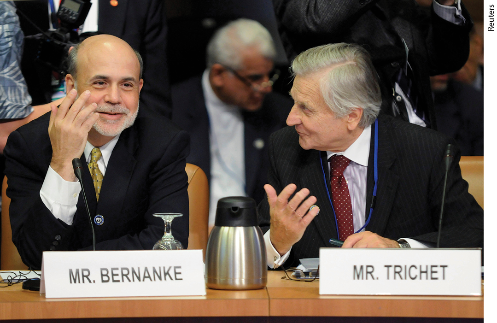
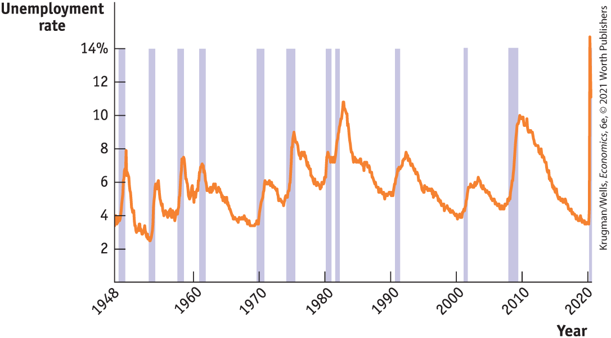
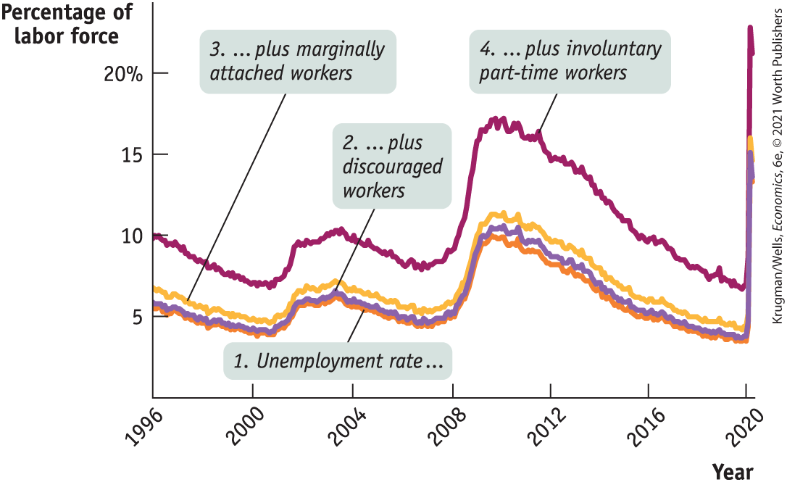
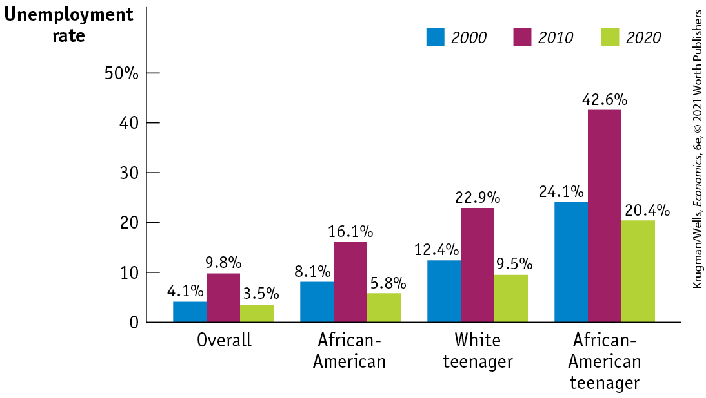
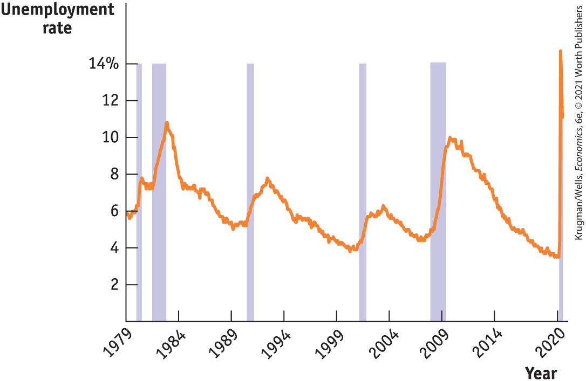
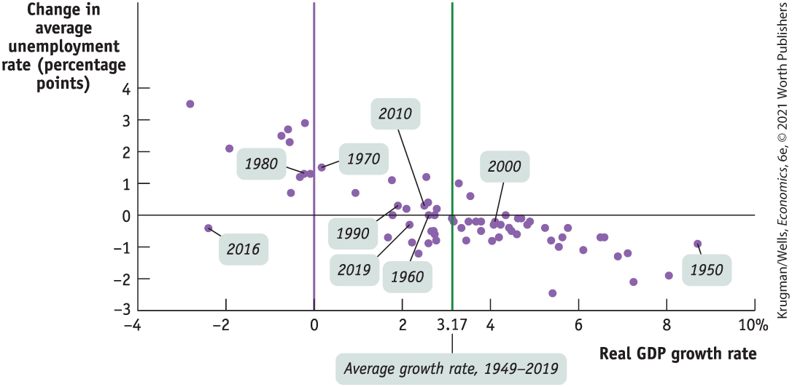
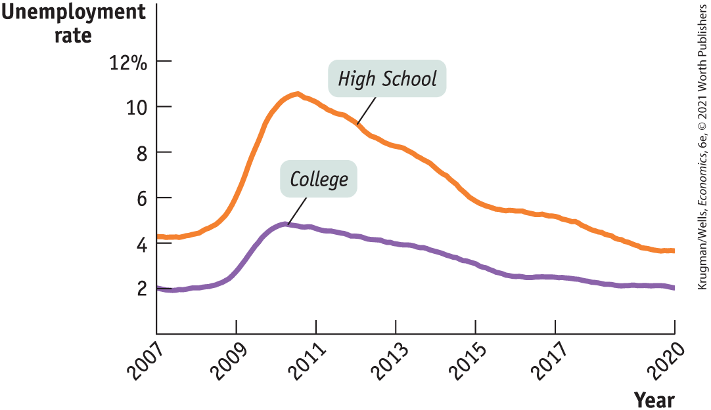

# Chapter 8 Unemployment and Inflation

## THE GREAT MISTAKE OF 2011

<figure id="pau_9781319320164_BWtjJ5PuEX" class="figure lm_img_lightbox unnum c2 right">

<figcaption>
<strong>The chair of the Federal Reserve balances the goals of low unemployment and price stability when deciding whether to give the economy more gas or hit the brakes. Bernanke chose wisely in 2011; Trichet did not.</strong>
</figcaption>
</figure>

<aside class="hidden" id="pau_9781319320164_7PrjXVhBTK" title="hidden">

Both men sit beside each other at a desk on which lie their respective name plates. The name plate identifying the man on the left reads “Mr. Bernanke.” The name plate identifying the man on the right reads “Mr. Trichet.”

</aside>

**THE EURO, A CURRENCY SHARED BY 19 EUROPEAN COUNTRIES,** was introduced in 1999. Like all modern currencies, the euro is managed by a *central bank* — an institution that has the power to create or destroy money. Along with this power comes the ability to determine certain crucial interest rates, like the rates at which private banks lend to each other, and the rate they are paid on money they deposit with the central bank. Decisions about the quantity of money and key interest rates are called *monetary policy,* and are a central part of overall macroeconomic policy. In the United States, monetary policy is set by the Federal Reserve, commonly referred to as the Fed. In Europe, monetary policy is run by the rather boringly named European Central Bank or ECB.

In 2011 the ECB made a big mistake. Like the Fed, it had cut interest rates sharply in the face of the 2008 financial crisis. But in 2011 it raised rates again, even though Europe had barely begun to recover from the aftereffects of that crisis.

Why did the ECB raise rates? Macroeconomic policy usually focuses mainly on trying to mitigate the two great evils of macroeconomics, high unemployment and high inflation. High unemployment incurs human and economic waste because willing workers can’t find jobs. High inflation undermines the monetary system through rapidly rising prices. So the two principal goals of macroeconomic policy are low unemployment and price stability, usually defined as a low but positive rate of inflation.

Sometimes, unfortunately, these twin goals can be in conflict. At those times, macroeconomic policy makers must make a trade-off based on judgment and guesswork. And the goals did indeed seem to be in conflict in Europe in 2011: unemployment was still high in the aftermath of the 2008 financial crisis, but inflation had also accelerated sharply. The ECB, led at the time by France’s Jean-Claude Trichet, decided that inflation was the greater threat, and raised rates despite high unemployment.

As it turned out, this was the wrong call. (By contrast, Ben Bernanke, the leader of the Fed, and his colleagues, facing a similar situation, got it right.) The rise in inflation reflected temporary factors, like a surge in world oil prices, that soon went away, while unemployment continued to rise. By the end of 2011 the ECB had reversed its rate hikes.

In this chapter, we’ll explore the dynamics of unemployment and inflation in the economy. We’ll learn how they are measured and why accurate measurement is a critical function of government. From there we will go on to understand why low unemployment and price stability are the main goals of macroeconomic policy. Yet, as we just noted, sometimes those goals are in conflict. 

<aside class="learning-objectives c3 main-flow v3" epub:type="learning-objectives" id="pau_9781319320164_Tm1b5XUo4z">

### What you will learn

- How is **unemployment** measured and how is the **unemployment rate** calculated?
- What is the significance of the unemployment rate for the economy?
- What is the relationship between the unemployment rate and economic growth?
- What factors determine the **natural rate of unemployment?**
- What are the economic costs of inflation?
- How do inflation and deflation create winners and losers?
- Why do policy makers try to maintain a stable rate of inflation?

</aside>

## The Unemployment Rate

<a href="#kru_9781319245269_ch08_02.xhtml#pau_9781319320164_3eneRfbk7h" id="kru_9781319245269_ch08_02.xhtml#pau_9781319320164_fsgVIQg06P" class="crossref">Figure 8-1</a> shows the U.S. unemployment rate from 1948 to 2020; as you can see, unemployment soared during the Great Recession of 2007–2009 and fell only gradually in the years that followed, and spiked again in spring 2020 as a result of the COVID-19 crisis. What did the elevated unemployment rate mean, and why was it such a big factor in people’s lives? To understand why policy makers pay so much attention to employment and unemployment, we need to understand how they are both defined and measured.

<figure id="pau_9781319320164_3eneRfbk7h" class="figure lm_img_lightbox num c3 main-flow">

<figcaption>
FIGURE 8-1 The U.S. Unemployment Rate, 1948–2020

The unemployment rate has fluctuated widely over time. It always rises during recessions, which are shown by the shaded bars. It usually, but not always, falls during periods of economic expansion.

<em>Data from:</em> Bureau of Labor Statistics; National Bureau of Economic Research.
</figcaption>
</figure>

<aside class="hidden" id="pau_9781319320164_ZkB8rMsVnE" title="hidden">

The vertical axis labeled “Unemployment rate” ranges from 0 to 14 percent, in increments of 2 percent. The horizontal axis plots Year from 1948 to 2020. The unemployment rates over the years are marked as follows. 1948, 3.7 percent; 1960, 5 percent; 1970, 4 percent; 1980, 6 percent; 1990, 5.8 percent; 2000, 4.2 percent; 2010, 10 percent; 2020, 4 percent. The unemployment rate rises to 14 percent, during early months of 2020. The shaded vertical bars are approximately at the following years: 1950, 1955, 1959, 1962, 1970, 1974, 1980, 1981, 1992, 2002, 2008, and 2020.

</aside>

### Defining and Measuring Unemployment

It’s easy to define employment: you’re employed if and only if you have a job. <a href="#kru_9781319245269_EM_glossary.xhtml#pau_9781319320164_uXrlcJb1ab" id="kru_9781319245269_ch08_02.xhtml#pau_9781319320164_0n4JXzfBPX" class="glossref" role="doc-glossref">Employment</a> is the total number of people currently employed, either full time or part time.

<aside aria-label="title 1" class="glossary c3 main-flow v1" epub:type="glossary" id="pau_9781319320164_GdJNqSXHPI">

**employment**  
**Employment** is the number of people currently employed in the economy, either full time or part time.

</aside>

Unemployment, however, is a more subtle concept. Just because a person isn’t working doesn’t mean that we consider that person unemployed. For example, as of February 2020, there were 49.8 million retired workers in the United States receiving Social Security checks. Most of them were probably happy that they were no longer working, so we wouldn’t consider someone who has settled into a comfortable, well-earned retirement to be unemployed. There were also 13.4 million disabled, under the age of 65, U.S. workers receiving benefits because they were unable to work. Again, although they weren’t working, we don’t consider them to be unemployed.

The U.S. Census Bureau, the federal agency tasked with collecting data on unemployment, considers the unemployed only to be those who are “jobless, looking for jobs, and available for work.” Retired people don’t count because they aren’t looking for jobs; the disabled don’t count because they aren’t available for work. More specifically, an individual is considered unemployed if they don’t currently have a job and have been actively seeking a job during the past four weeks. So <a href="#kru_9781319245269_EM_glossary.xhtml#pau_9781319320164_LHukpZlUrM" id="kru_9781319245269_ch08_02.xhtml#pau_9781319320164_4TZqd7h8oJ" class="glossref" role="doc-glossref">unemployment</a> is defined as the total number of people who are actively looking for work but aren’t currently employed.

<aside aria-label="title 2" class="glossary c3 main-flow v1" epub:type="glossary" id="pau_9781319320164_BPZCp58rek">

**unemployment**  
**Unemployment** is the number of people who are actively looking for work but aren’t currently employed.

</aside>

A country’s <a href="#kru_9781319245269_EM_glossary.xhtml#pau_9781319320164_ZgmGbiyX61" id="kru_9781319245269_ch08_02.xhtml#pau_9781319320164_heUw3Xvxuf" class="glossref" role="doc-glossref">labor force</a> is the sum of employment and unemployment — that is, of people who are currently working and people who are currently looking for work, respectively. The <a href="#kru_9781319245269_EM_glossary.xhtml#pau_9781319320164_U2Wr4OSwju" id="kru_9781319245269_ch08_02.xhtml#pau_9781319320164_rARoNLZD5f" class="glossref" role="doc-glossref">labor force participation rate</a>, defined as the percentage of the working-age population that is in the labor force, is calculated as follows:

<aside aria-label="title 3" class="glossary c3 main-flow v1" epub:type="glossary" id="pau_9781319320164_jkQChxxBID">

**labor force**  
The **labor force** is equal to the sum of employment and unemployment.

</aside>
<aside aria-label="title 4" class="glossary c3 main-flow v1" epub:type="glossary" id="pau_9781319320164_otaNDobsgP">

**labor force participation rate**  
The **labor force participation rate** is the percentage of the population aged 16 or older that is in the labor force.

</aside>

$$\text{Labor}\,\text{force}\,\text{participation}\,\text{rate} = \frac{\text{Labor}\,\text{force}}{\text{Population}\,\text{age}\, 16\,\text{and}\,\text{older}} \times \, 100$$

**(8-1)**

The <a href="#kru_9781319245269_EM_glossary.xhtml#pau_9781319320164_3lw2Tj9j17" id="kru_9781319245269_ch08_02.xhtml#pau_9781319320164_wH4WSs8M7I" class="glossref" role="doc-glossref">unemployment rate</a>, defined as the percentage of the total number of people in the labor force who are unemployed, is calculated as follows:

$$\text{Unemployment}\,\text{rate} = \frac{\text{Number}\,\text{of}\,\text{unemployed}\,\text{workers}}{\text{Labor}\,\text{force}} \times 100$$

**(8-2)**

<aside aria-label="title 5" class="glossary c3 main-flow v1" epub:type="glossary" id="pau_9781319320164_jFglDsvn1T">

**unemployment rate**  
The **unemployment rate** is the percentage of the total number of people in the labor force who are unemployed.

</aside>

To estimate the numbers that go into calculating the unemployment rate, the U.S. Census Bureau carries out a monthly survey called the Current Population Survey, which involves interviewing a random sample of approximately 60,000 American households. People are asked whether they are currently employed. If they are not employed, they are asked whether they have been looking for a job during the past four weeks. The results are then scaled up, using estimates of the total population, to estimate the total number of employed and unemployed Americans.

### The Significance of the Unemployment Rate

In general, the unemployment rate is a good although imperfect indicator of how easy or difficult it is to find a job given the current state of the economy. You can see this by the strong correlation between the unemployment rate and other indicators of job market conditions, like the *quit rate* — the fraction of workers voluntarily leaving their jobs in any given month. In 2009, with the unemployment rate close to 10%, very few workers were quitting, because someone who left a job had little assurance of finding another. By early 2020, with unemployment below 4%, the quit rate had doubled. In the spring of 2020, as unemployment soared in the face of COVID-19, quits plunged.

Although the unemployment rate is a good indicator of current labor market conditions, it’s not a literal measure of the percentage of people who want a job but can’t find one. That’s because in some ways the unemployment rate exaggerates the difficulty people have in finding jobs. But in other ways, the opposite is true — a low unemployment rate can conceal deep frustration over the lack of job opportunities.

#### How the Unemployment Rate Can Overstate the True Level of Unemployment

If you are searching for work, it’s normal to take at least a few weeks to find a suitable job. Yet a worker who is quite confident of finding a job, but has not yet accepted a position, is counted as unemployed. As a consequence, the unemployment rate never falls to zero, even in boom times when jobs are plentiful. Even in the buoyant labor market of February 2020, when it was easy to find work, the unemployment rate was still 3.4%. Later in this chapter, we’ll discuss in greater depth the reasons that measured unemployment persists even when jobs are abundant.

#### How the Unemployment Rate Can Understate the True Level of Unemployment

Frequently, people who would like to work but aren’t working still don’t get counted as unemployed. In particular, an individual who has given up looking for a job for the time being because there are no jobs available — say, a laid-off steelworker in a deeply depressed steel town — isn’t counted as unemployed because he or she has not been searching for a job during the previous four weeks. Individuals who want to work but have told government researchers that they aren’t currently searching because they see little prospect of finding a job given the state of the job market are called <a href="#kru_9781319245269_EM_glossary.xhtml#pau_9781319320164_iJ4VsUeyiX" id="kru_9781319245269_ch08_02.xhtml#pau_9781319320164_z7p4h2S6LL" class="glossref" role="doc-glossref">discouraged workers</a>. Because it does not count discouraged workers, the measured unemployment rate may understate the percentage of people who want to work but are unable to find jobs.

<aside aria-label="title 6" class="glossary c3 main-flow v1" epub:type="glossary" id="pau_9781319320164_Ur0VZ1oLVh">

**discouraged workers**  
**Discouraged workers** are nonworking people who are capable of working but have given up looking for a job given the state of the job market.

</aside>

Discouraged workers are part of a larger group — <a href="#kru_9781319245269_EM_glossary.xhtml#pau_9781319320164_b4x7RaGUyW" id="kru_9781319245269_ch08_02.xhtml#pau_9781319320164_d60XTndcP1" class="glossref" role="doc-glossref">marginally attached workers</a>. These are people who say they would like to have a job and have looked for work in the recent past but are not currently looking for work. They are also not included when calculating the unemployment rate. Finally, another category of workers who are frustrated in their ability to find work but aren’t counted as unemployed are the <a href="#kru_9781319245269_EM_glossary.xhtml#pau_9781319320164_6v5JdKaLwv" id="kru_9781319245269_ch08_02.xhtml#pau_9781319320164_74pH4e7H0t" class="glossref" role="doc-glossref">underemployed</a>**:** workers who would like to find full-time jobs but are currently working part time “for economic reasons” — that is, they can’t find a full-time job. Again, they aren’t counted in the unemployment rate.

<aside aria-label="title 7" class="glossary c3 main-flow v1" epub:type="glossary" id="pau_9781319320164_9XJNfqRxHF">

**marginally attached workers**  
**Marginally attached workers** would like to be employed and have looked for a job in the recent past but are not currently looking for work.

</aside>
<aside aria-label="title 8" class="glossary c3 main-flow v1" epub:type="glossary" id="pau_9781319320164_mDqOSg6p45">

**underemployment**  
**Underemployment** is the number of people who work part time because they cannot find full-time jobs.

</aside>

The *Bureau of Labor Statistics* is the federal agency that calculates the official unemployment rate. It also calculates broader “measures of labor underutilization” that include the three categories of frustrated workers. <a href="#kru_9781319245269_ch08_02.xhtml#pau_9781319320164_AOrktwosFV" id="kru_9781319245269_ch08_02.xhtml#pau_9781319320164_K2bsA8JuTB" class="crossref">Figure 8-2</a> shows what happens to the measured unemployment rate once discouraged workers, other marginally attached workers, and the underemployed are counted. The broadest measure of unemployment and underemployment, known as *U-6,* is the sum of these three measures plus the unemployed. It is substantially higher than the rate usually quoted by the news media. But U-6 and the unemployment rate move very much in parallel, so changes in the unemployment rate remain a good guide to what’s happening in the overall labor market, including frustrated workers.

<figure id="pau_9781319320164_AOrktwosFV" class="figure lm_img_lightbox num c3 main-flow">

<figcaption>
FIGURE 8-2 Alternative Measures of Unemployment, 1996–2020

The unemployment number usually quoted in the news media counts someone as unemployed only if that person has been looking for work during the past four weeks. Broader measures also count discouraged workers, marginally attached workers, and the underemployed. These broader measures show a higher unemployment rate, but they move closely in parallel with the standard rate.

<em>Data from:</em> Bureau of Labor Statistics.
</figcaption>
</figure>

<aside class="hidden" id="pau_9781319320164_N34JQBLiWV" title="hidden">

The vertical axis labeled “Percentage of labor force” ranges from 0 to 20 percent, increments of 5 percent. The horizontal axis plots Year from 1996 to 2020, in increments of 4 years. It shows four curves denoting unemployment rate, unemployment rate plus discouraged workers, unemployment rate plus marginally attached workers, and unemployment rate plus involuntary workers. The approximate data from the graph are as follows, Unemployment rate: 1996, 6 percent; 2000, 4 percent; 2004, 7 percent; 2008, 5 percent; 2010, 10 percent; 2012, 7 percent; 2016, 5 percent; 2020, 3 percent. The curve rises to 23 percent during early months of 2020. Unemployment rate plus discouraged workers: 1996, 6.5 percent; 2000, 4.5 percent; 2004, 7.5 percent; 2008, 5.5 percent; 2010, 11 percent; 2012, 7.5 percent; 2016, 5.5 percent; 2020, 3.5 percent. The curve rises to 16 percent during early months of 2020. Unemployment rate plus marginally attached workers: 1996, 7 percent; 2000, 5 percent; 2004, 8 percent; 2008, 6 percent; 2010, 12 percent; 2012, 8.5 percent; 2016, 6 percent; 2020, 4 percent. The curve rises to 15 percent during early months of 2020. Unemployment rate plus involuntary part-time workers: 1996, 10 percent; 2000, 7 percent; 2004, 10 percent; 2008, 8 percent; 2010, 17 percent; 2012, 15 percent; 2016, 10 percent; 2020, 7 percent. The curve rises to 14 percent during early months of 2020.

</aside>

Finally, it’s important to realize that the unemployment rate varies greatly among demographic groups. Other things equal, jobs are generally easier to find for more experienced workers and for workers during their prime working years, that is, from ages 25 to 54. For younger workers, as well as workers nearing retirement age, jobs are typically harder to find, other things equal.

<a href="#kru_9781319245269_ch08_02.xhtml#pau_9781319320164_hyOcrCM2nc" id="kru_9781319245269_ch08_02.xhtml#pau_9781319320164_uvwQ21ksd5" class="crossref">Figure 8-3</a> shows unemployment rates for different groups in 2000, when the overall unemployment rate was low by historical standards, in 2010, when the rate was high in the aftermath of the Great Recession, and in February 2020, when it had come down to pre-crisis levels before the pandemic. As you can see, the unemployment rate for African-American workers is consistently much higher than the national average; the unemployment rate for White teenagers (ages 16–19) is normally even higher; and the unemployment rate for African-American teenagers is higher still. (Bear in mind that a teenager isn’t considered unemployed, even if they aren’t working, unless that teenager is looking for work but can’t find it.) So even at times when the overall unemployment rate is relatively low, jobs are hard to find for some groups.

<figure id="pau_9781319320164_hyOcrCM2nc" class="figure lm_img_lightbox num c3 main-flow">

<figcaption>
FIGURE 8-3 Unemployment Rates of Different Groups in 2000, 2010, and 2020

Unemployment rates vary greatly among different demographic groups. For example, although the overall unemployment rate in February 2020 was 3.5%, the unemployment rate among African-American teenagers was 20.4%. As a result, even during periods of low overall unemployment, unemployment remains a serious problem for some groups.

<em>Data from:</em> Bureau of Labor Statistics.
</figcaption>
</figure>

<aside class="hidden" id="pau_9781319320164_2hqcc2BSi5" title="hidden">

The vertical axis labeled “Unemployment rate” ranges from 0 to 50 percent, in increments of 10 percent. The horizontal axis of the graph represents different groups. The unemployment rate for various groups in 2000 are as follows, Overall, 4.1 percent; African-American, 8.1 percent; White teenager, 12.4 percent; African-American teenager, 24.1 percent. The unemployment rates in 2010 are as follows, Overall, 9.8 percent; African-American, 16.1 percent; White teenager, 22.9 percent; African-American teenager, 42.6 percent. The unemployment rate for various groups in 2020 are as follows, Overall, 3.5 percent; African-American, 5.8 percent; White teenager, 9.5 percent; African-American teenager, 20.4 percent.

</aside>

So you should interpret the unemployment rate as an indicator of overall labor market conditions, not as an exact measure of the percentage of people unable to find jobs. The unemployment rate is, however, a very good indicator: its ups and downs closely reflect economic changes that have a significant impact on people’s lives. Let’s turn now to the causes of these fluctuations.

### Growth and Unemployment

Compared to <a href="#kru_9781319245269_ch08_02.xhtml#pau_9781319320164_3eneRfbk7h" id="kru_9781319245269_ch08_02.xhtml#pau_9781319320164_JVZsTvwuv1" class="crossref">Figure 8-1</a>, <a href="#kru_9781319245269_ch08_02.xhtml#pau_9781319320164_hkG2pYsKM0" id="kru_9781319245269_ch08_02.xhtml#pau_9781319320164_ZnJN3EPxph" class="crossref">Figure 8-4</a> shows the U.S. unemployment rate over a somewhat shorter period, from 1979 through 2020. The shaded bars represent periods of recession. As you can see, during every recession, without exception, the unemployment rate rose. The severe recession of 2007–2009, like the earlier one of 1981–1982, led to a large rise in unemployment. The 2020 pandemic led to both a recession and an even larger spike in unemployment.

<figure id="pau_9781319320164_hkG2pYsKM0" class="figure lm_img_lightbox num c3 main-flow">

<figcaption>
FIGURE 8-4 Unemployment and Recessions, 1979–2020

This figure shows a close-up of the unemployment rate for the past three decades, with the shaded bars indicating recessions. It’s clear that unemployment always rises during recessions and <em>usually</em> falls during expansions. But in both the early 1990s and the early 2000s, unemployment continued to rise for some time after the recession was officially declared over.

<em>Data from:</em> Bureau of Labor Statistics; National Bureau of Economic Research.
</figcaption>
</figure>

<aside class="hidden" id="pau_9781319320164_xAk1zBTzTJ" title="hidden">

The vertical axis labeled “Unemployment rate” ranges from 0 to 14 percent, in increments of 2 percent. The horizontal axis plots years from 1979 to 2014, in increments of 5 years, and has a tick mark at 2020. The approximate unemployment rates over the years are marked as follows, 1979, 6 percent; 1982, 11 percent; 1984, 7.5 percent; 1989, 5.5 percent; 1992, 8 percent; 1994, 5.6 percent; 1999, 4 percent; 2004, 6.5 percent; 2009, 6 percent; 2010, 10 percent; 2014, 5 percent, 2020, 4 percent. The unemployment rate rises to a maximum of 14 percent during early months of 2020. The graph reflects the unemployment rate, a measure of joblessness, rises sharply during recessions and usually falls during expansions. The shaded vertical bars are approximately at the following years, 1981, 1983, 1991, 2002, 2009, and 2020.

</aside>

Correspondingly, during periods of economic expansion the unemployment rate usually falls. The long economic expansion of the 1990s and the recovery from the Great Recession eventually brought the unemployment rate down below 4.0%. However, it’s important to recognize that *economic expansions aren’t always periods of falling unemployment.* Look at the periods immediately following the recessions of 1990–1991 and 2001 in <a href="#kru_9781319245269_ch08_02.xhtml#pau_9781319320164_hkG2pYsKM0" id="kru_9781319245269_ch08_02.xhtml#pau_9781319320164_5zjZzM8ROC" class="crossref">Figure 8-4</a>. In each case the unemployment rate continued to rise for more than a year after the recession was officially over. The explanation in both cases is that although the economy was growing, it was not growing fast enough to reduce the unemployment rate.

<a href="#kru_9781319245269_ch08_02.xhtml#pau_9781319320164_phVVJWz0cj" id="kru_9781319245269_ch08_02.xhtml#pau_9781319320164_LIzTmQl9N2" class="crossref">Figure 8-5</a> is a scatter diagram showing U.S. data for the period from 1949 to 2019. The horizontal axis measures the annual rate of growth in real GDP — the percent by which each year’s real GDP changed compared to the previous year’s real GDP. (Notice that there were 10 years in which growth was negative — that is, real GDP shrank.) The vertical axis measures the *change* in the average unemployment rate over the previous year in percentage points — last year’s unemployment rate minus this year’s unemployment rate. Each dot represents the observed growth rate of real GDP and change in the unemployment rate for a given year. For example, in 2000 the average unemployment rate fell to 4.0% from 4.2% in 1999; this is shown as a value of $- 0.2$ along the vertical axis for the year 2000. Over the same period, real GDP grew by 4.1%; this is the value shown along the horizontal axis for the year 2000.

<figure id="pau_9781319320164_phVVJWz0cj" class="figure lm_img_lightbox num c3 main-flow">

<figcaption>
FIGURE 8-5 Growth and Changes in Unemployment, 1949–2019

Each dot shows the growth rate of the economy and the change in the unemployment rate for a specific year between 1949 and 2019. For example, in 2000 the economy grew 4.1% and the unemployment rate fell 0.2 percentage points, from 4.2% to 4.0%. In general, the unemployment rate fell when growth was above its average rate of 3.17% a year and rose when growth was below average. Unemployment always rose when real GDP fell.

<em>Data from:</em> Bureau of Labor Statistics; Bureau of Economic Analysis.
</figcaption>
</figure>

<aside class="hidden" id="pau_9781319320164_kbHcYHwkpw" title="hidden">

The vertical axis labeled “Change in average unemployment rate (percentage points)” ranges from negative 3 to 4, in increments of 1. The horizontal axis labeled “Real G D P growth rate” ranges from negative 4 to 10 percent, in increments of 2 percent. Two perpendiculars correspond to 0 and 3.17 G D P growth rates along the horizontal axis. The marking, 3.17, along the horizontal axis is labeled, “ Average growth rate, 1949 to 2019.” The graph shows several points scattered between negative 2.5 percent and 3.5 percent along the vertical axis, out of which 8 points are highlighted. The data from the graph are as follows, 1950, (8.8, negative 1); 1960, (2.5, 0); 1970, (0.1, 1.6); 1980, (negative 0.1, 1.2); 1990, (2, 0.2); 2000, (4.1, negative 0.2); 2010, (2.5, 0.2); 2016, (negative 2.5, negative 0.4); and 2019, (2.2, negative 0.2).

</aside>

The downward trend of the scatter diagram in <a href="#kru_9781319245269_ch08_02.xhtml#pau_9781319320164_phVVJWz0cj" id="kru_9781319245269_ch08_02.xhtml#pau_9781319320164_ANRTlwZEIv" class="crossref">Figure 8-5</a> shows that there is a generally strong negative relationship between growth in the economy and the rate of unemployment. Years of high growth in real GDP were also years in which the unemployment rate fell, and years of low or negative growth in real GDP were years in which the unemployment rate rose.

The green vertical line in <a href="#kru_9781319245269_ch08_02.xhtml#pau_9781319320164_phVVJWz0cj" id="kru_9781319245269_ch08_02.xhtml#pau_9781319320164_AJfDioRN2Y" class="crossref">Figure 8-5</a> at the value of 3.17% indicates the average growth rate of real GDP over the period from 1949 to 2019. Points lying to the right of the vertical line are years of above-average growth. In these years, the value on the vertical axis is usually negative, meaning that the unemployment rate fell. That is, years of above-average growth were usually years in which the unemployment rate was falling. Conversely, points lying to the left of the green vertical line were years of below-average growth. In these years, the value on the vertical axis is usually positive, meaning that the unemployment rate rose. That is, years of below-average growth were usually years in which the unemployment rate was rising.

A period in which real GDP is growing at a below-average rate and unemployment is rising is called a <a href="#kru_9781319245269_EM_glossary.xhtml#pau_9781319320164_Ys4SlR9EbJ" id="kru_9781319245269_ch08_02.xhtml#pau_9781319320164_O94cBr8Naw" class="glossref" role="doc-glossref">jobless recovery</a> or a *growth recession.* Since 1990, there have been three recessions, each of which was followed by a period of jobless recovery. But true recessions, periods when real GDP falls, are especially painful for workers. As illustrated by the points to the left of the purple vertical line in <a href="#kru_9781319245269_ch08_02.xhtml#pau_9781319320164_phVVJWz0cj" id="kru_9781319245269_ch08_02.xhtml#pau_9781319320164_ui8CcF98iD" class="crossref">Figure 8-5</a> (representing years in which the real GDP growth rate is negative), falling real GDP is always associated with a rising rate of unemployment, causing a great deal of hardship for families.

<aside aria-label="title 9" class="glossary c3 main-flow v1" epub:type="glossary" id="pau_9781319320164_6tCMJ8jzlE">

**jobless recovery**  
A **jobless recovery** is a period in which the real GDP growth rate is positive but the unemployment rate is still rising.

</aside>

### ECONOMICS \>\> *in Action*

Opportunity Knocks

Do you need a college degree to get a well-paying job? It definitely helps. But sometimes opportunity knocks even for those without a BA. A 2019 article in the *Wall Street Journal* highlighted the good fortune of Cassandra Eaton, a 23-year-old high school graduate in Biloxi, Mississippi. After leaving school, Ms. Eaton was employed by a day-care center that paid \$8.25 an hour. But by early 2019 she was making \$18.90 an hour as an apprentice welder at a nearby shipyard.

No doubt Ms. Eaton did much to earn her new position, but there were a lot of stories like hers in 2019: many employers were willing to hire and train workers they might not have been interested in a few years earlier. Why? Because the job market was very good, and employers couldn’t afford to be choosy. That *Wall Street Journal* article was titled “Inside the hottest job market of the past half century.”

<a href="#kru_9781319245269_ch08_02.xhtml#pau_9781319320164_FUlltpvcQF" id="kru_9781319245269_ch08_02.xhtml#pau_9781319320164_WYhshj52LV" class="crossref">Figure 8-6</a> illustrates the point, showing unemployment rates for adults over age 25 with high school and college degrees respectively over the period from 2007 to 2020. Adults without a college degree always have somewhat higher unemployment than their more credentialed peers, but the gap depends a lot on the overall state of employment. In the terrible job market of 2010, with overall unemployment near 10%, the gap was huge. In fact, some commentators warned that America was suffering from a “skills gap,” with many workers lacking the qualifications the modern economy requires.

<figure id="pau_9781319320164_FUlltpvcQF" class="figure lm_img_lightbox num c3 main-flow">

<figcaption>
FIGURE 8-6 Unemployment Rate for College and High School Graduates, 2007–2020

<em>Data from:</em> Bureau of Labor Statistics.
</figcaption>
</figure>

<aside class="hidden" id="pau_9781319320164_aodzMDO4nG" title="hidden">

The vertical axis labeled Unemployment rate ranges from 0 to 12 percent, in increments of 2 percent. The horizontal axis plots years from 2007 to 2020, in increments of 2 years. The graph shows two trends labeled High school and College, respectively. The data from the graph are as follows, High school: 2007, 4.1 percent; 2009, 5.5 percent; 2011, 10.5 percent; 2013, 8 percent; 2015, 6 percent; 2017, 5 percent, 2020, 4 percent. College: 2007, 2 percent; 2009, 2.5 percent; 2011, 4.5 percent; 2013, 4 percent; 2015, 3 percent; 2017, 2.5 percent, 2020, 2 percent.

</aside>

By 2019, however, overall unemployment was below 4%, and unemployment among workers who only had a high school degree was only modestly higher than for the college-educated. To the extent that there was still a skills gap, employers themselves were trying to close it by giving workers the training they needed.

The moral of the story is that the state of the labor market, which the unemployment rate helps us track, makes a huge difference in peoples’ lives, even those who stay employed.

### *\>\> Quick Review*

- The **labor force**, equal to **employment** plus **unemployment**, does not include discouraged workers. Nor do labor statistics contain data on **underemployment.** The **labor force participation rate** is the percentage of the population age 16 and over in the labor force.
- The **unemployment rate** is an indicator of the state of the labor market, not an exact measure of the percentage of workers who can’t find jobs. It can overstate the true level of unemployment because workers often spend time searching for a job even when jobs are plentiful. But it can also understate the true level of unemployment because it excludes **discouraged workers, marginally attached workers**, and **underemployed** workers.
- There is a strong negative relationship between growth in real GDP and changes in the unemployment rate. When growth is above average, the unemployment rate generally falls. When growth is below average, the unemployment rate generally rises — a period called a **jobless recovery** that typically follows a deep recession.
