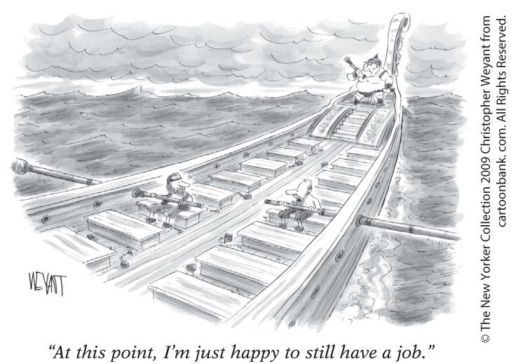
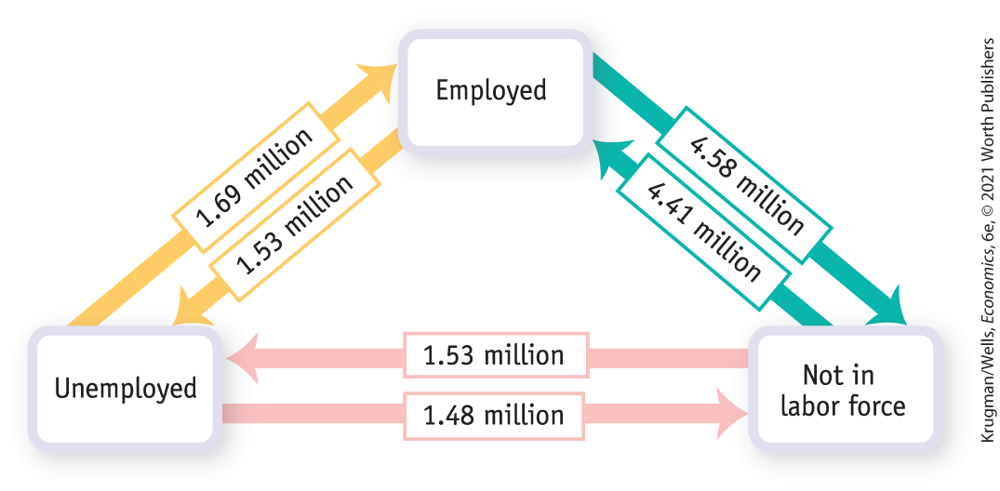
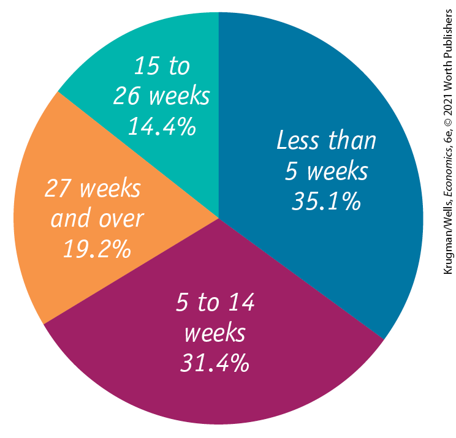
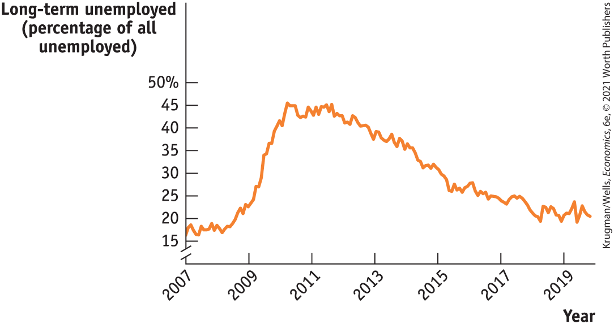
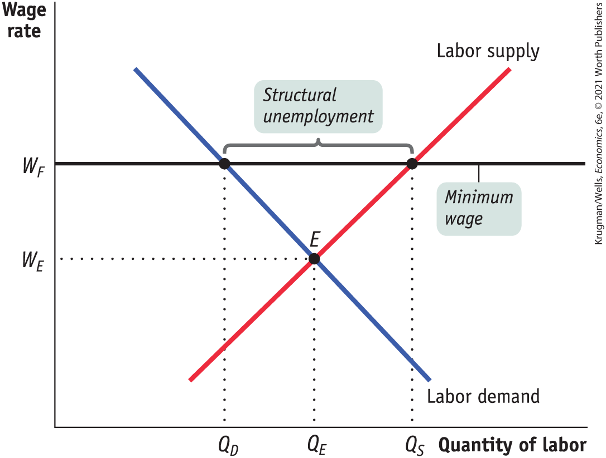
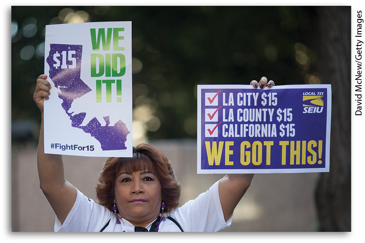
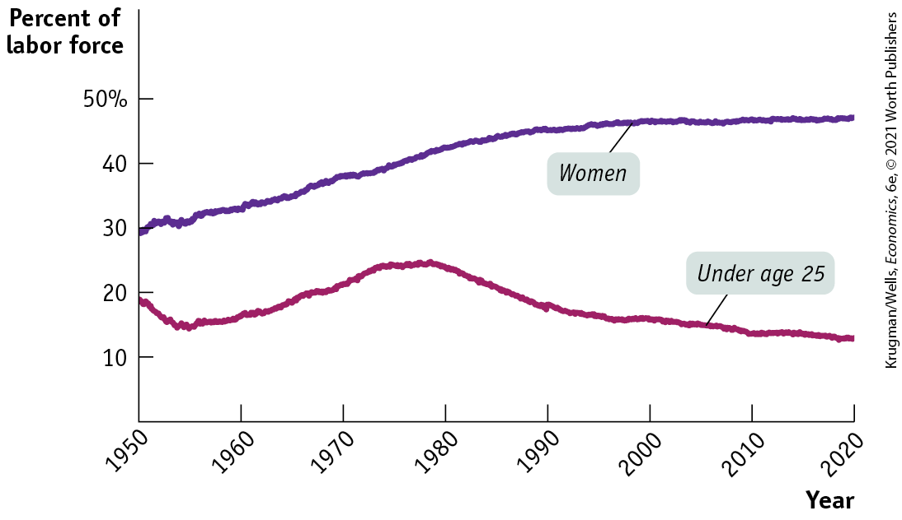
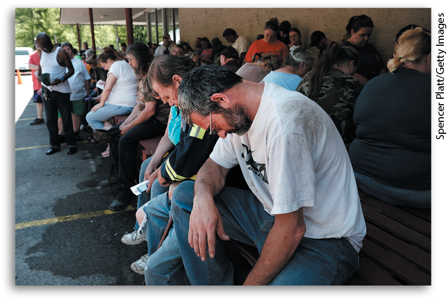

### *Check Your Understanding* 8-1

1.  Suppose employment websites develop new software that enables job-seekers to find suitable jobs more quickly and employers to better screen potential employees. What effect will this have on the unemployment rate over time? Also suppose that these websites encourage job-seekers who had given up their searches to begin looking again. What effect will this have on the unemployment rate?
2.  In which of the following cases is a worker counted as unemployed? Explain.
    1.  Rosa, an older worker who has been laid off and who gave up looking for work months ago
    2.  Anthony, a schoolteacher who is not working during his three-month summer break
    3.  Kanako, an investment banker who has been laid off and is currently searching for another position
    4.  Sergio, a classically trained musician who can only find work playing for local parties
    5.  Natasha, a graduate student who went back to school because jobs were scarce
3.  Which of the following are consistent with the observed relationship between growth in real GDP and changes in the unemployment rate as shown in <a href="#kru_9781319245269_ch08_02.xhtml#pau_9781319320164_phVVJWz0cj" id="kru_9781319245269_ch08_02.xhtml#pau_9781319320164_403eLPrtvv" class="crossref">Figure 8-5</a>? Which are not?
    1.  A rise in the unemployment rate accompanies a fall in real GDP.
    2.  An exceptionally strong business recovery is associated with a greater percentage of the labor force being employed.
    3.  Negative real GDP growth is associated with a fall in the unemployment rate.

## The Natural Rate of Unemployment

Fast economic growth tends to reduce the unemployment rate. So how low can the unemployment rate go? You might be tempted to say zero, but that isn’t feasible. Over the past half-century, the national unemployment rate has never dropped below 2.9%.

During boom times, how can there be so much unemployment even when many employees are actively searching for work? To answer this question, we need to examine the nature of labor markets and why they normally lead to substantial measured unemployment even when jobs are plentiful. Our starting point is the observation that even in the best of times, jobs are constantly being created and destroyed.

### Job Creation and Job Destruction

Even during good times, most Americans know someone who has lost a job. In December 2019, the U.S. unemployment rate was only 3.5%, very low by historical standards. Yet in that month there were 5.7 million *job separations* — terminations of employment that occur because a worker is either fired or quits voluntarily.

There are many reasons for such job loss. One is structural change in the economy: industries rise and fall as new technologies emerge and consumers’ tastes change. For example, employment in coal mining has declined to a small fraction of its one-time high due to both automation and a switch to other sources of energy. However, structural change also brings the creation of new jobs: employment in solar power surged after 2010 as a combination of rapidly improving technology and tax incentives led to a rapid growth in the use of solar panels.

<figure id="pau_9781319320164_165FZxEmNT" class="figure lm_img_lightbox unnum c2 right">

</figure>

Poor management performance or bad luck at individual companies also leads to job loss for employees. For example, in early 2018, J.C. Penney announced the closure of 140 stores and offered early retirement to 6,000 workers. In the same year, Toys “R” Us closed 735 stores, causing 31,000 layoffs. Meanwhile, online retailers like Amazon continued to expand, building distribution centers all over the country.

Continual job creation and destruction are features of modern economies, making a naturally occurring amount of unemployment inevitable. Within this naturally occurring amount, there are two types of unemployment — *frictional* and *structural.*

### Frictional Unemployment

When a worker loses a job involuntarily due to job destruction, that worker often doesn’t take the first new job offered. For example, suppose a skilled programmer, laid off because their software company’s product line was unsuccessful, sees an online job posting for a receptionist. The programmer might apply and get the receptionist job — but that would be foolish. Instead, they should take the time to look for a job that takes advantage of their skills and pays accordingly. In addition, individual workers are constantly leaving jobs voluntarily, typically for personal reasons — family moves, dissatisfaction, and better job prospects elsewhere.

Economists say that workers who spend time looking for employment are engaged in <a href="#kru_9781319245269_EM_glossary.xhtml#pau_9781319320164_wjZdpY4SHa" id="kru_9781319245269_ch08_03.xhtml#pau_9781319320164_F8AtQYOpHZ" class="glossref" role="doc-glossref">job search</a>. If all workers and all jobs were alike, job search wouldn’t be necessary; if information about jobs and workers was perfect, job search would be very quick. In practice, however, it’s normal for a worker who loses a job, or a young worker seeking a first job, to spend at least a few weeks searching.

<aside aria-label="title 1" class="glossary c3 main-flow v1" epub:type="glossary" id="pau_9781319320164_uX0wJlNNqZ">

**job search**  
Workers who spend time looking for employment are engaged in **job search.**

</aside>

<a href="#kru_9781319245269_EM_glossary.xhtml#pau_9781319320164_CbiHgxij2E" id="kru_9781319245269_ch08_03.xhtml#pau_9781319320164_w2c5kMufdh" class="glossref" role="doc-glossref">Frictional unemployment</a> is unemployment due to the time workers spend in job search. A certain amount of frictional unemployment is inevitable due to the constant process of economic change. As we just mentioned, during the low-unemployment month of December 2019 there were nonetheless more than 5 million job separations, in which workers left or lost their jobs. Total employment grew because these separations were more than offset by an even larger number of hires. Inevitably, some of the workers who left or lost their jobs spent at least some time unemployed, as did some of the workers newly entering the labor force.

<aside aria-label="title 2" class="glossary c3 main-flow v1" epub:type="glossary" id="pau_9781319320164_HufQspKPqG">

**frictional unemployment**  
**Frictional unemployment** is unemployment due to the time workers spend in job search.

</aside>

<a href="#kru_9781319245269_ch08_03.xhtml#pau_9781319320164_VhkHIGc3uz" id="kru_9781319245269_ch08_03.xhtml#pau_9781319320164_hOfJXpHPuE" class="crossref">Figure 8-7</a> shows the average monthly flows of workers among three states: employed, unemployed, and not in the labor force during December 2019. What the figure suggests is how much churning is constantly taking place in the labor market. An inevitable consequence of that churning is a significant number of workers who haven’t yet found their next job — that is, frictional unemployment.

<figure id="pau_9781319320164_VhkHIGc3uz" class="figure lm_img_lightbox num c3 main-flow">

<figcaption>
FIGURE 8-7 Labor Market Flows in December 2019

Even in December 2019, a low-unemployment month, large numbers of workers moved into and out of both employment and unemployment.

<em>Data from:</em> Bureau of Labor Statistics.
</figcaption>
</figure>

<aside class="hidden" id="pau_9781319320164_c477jlqDGE" title="hidden">

There are three components labeled Employed (top), Unemployed (bottom-left), and Not in labor force (bottom right). The data from the graph are as follows, The number of employed that turned unemployed is 1.53 million, and the vice versa is 1.69 million. The number of individuals that turned from unemployed to not in labor force is 1.48 million, and the vice versa is 1.53 million. The number of employed that turned from not in labor force to employed is 4.41 million, and the vice versa is 4.58 million.

</aside>

A limited amount of frictional unemployment is relatively harmless and may even be a good thing. The economy is more productive if workers take the time to find jobs that are well matched to their skills, and workers who are unemployed for a brief period while searching for the right job don’t experience great hardship. In fact, when there is a low unemployment rate, periods of unemployment tend to be quite short, suggesting that much of the unemployment is frictional.

<a href="#kru_9781319245269_ch08_03.xhtml#pau_9781319320164_93z1U67OLT" id="kru_9781319245269_ch08_03.xhtml#pau_9781319320164_ynl0hTsBQk" class="crossref">Figure 8-8</a> shows the composition of unemployment in February 2020. Approximately 35% of the unemployed had been unemployed for less than 5 weeks, and only 34% had been unemployed for 15 or more weeks. Only about one in five unemployed workers were considered to be *long-term unemployed —* those unemployed for 27 or more weeks.

<figure id="pau_9781319320164_93z1U67OLT" class="figure lm_img_lightbox num c2 center">

<figcaption>
FIGURE 8-8 Distribution of the Unemployed by Duration of Unemployment, February 2020

When the unemployment rate is low, most unemployed workers are unemployed for only a short period. In February 2020, 35.1% of the unemployed had been unemployed for less than 5 weeks and 66% for less than 15 weeks. The short duration of unemployment for most workers suggests that much of the unemployment was frictional. (Total may not add up to 100 due to rounding.)

<em>Data from:</em> Bureau of Labor Statistics.
</figcaption>
</figure>

<aside class="hidden" id="pau_9781319320164_Y5YpIiveSd" title="hidden">

The data from the chart are as follows, Less than 5 weeks, 35.1 percent; 5 to 14 weeks, 31.4 percent; 27 weeks and over, 19.2 percent; and 15 to 26 weeks, 14.4 percent.

</aside>

In periods of higher unemployment, however, workers tend to be jobless for longer periods of time, suggesting that the amount of frictional unemployment is small relative to the amount of unemployment arising from the downturn in the business cycle. <a href="#kru_9781319245269_ch08_03.xhtml#pau_9781319320164_VxowasJdCe" id="kru_9781319245269_ch08_03.xhtml#pau_9781319320164_1ZrYdvilVB" class="crossref">Figure 8-9</a> shows the fraction of the unemployed who had been out of work for 6 months or more from 2007 to 2020. It jumped to 45% after the Great Recession, but came gradually down as the economy recovered.

<figure id="pau_9781319320164_VxowasJdCe" class="figure lm_img_lightbox num c3 main-flow">

<figcaption>
FIGURE 8-9 Percentage of Unemployed U.S. Workers Who Had Been Unemployed for Six Months or Longer, 2007–2019

Before the Great Recession, relatively few U.S. workers had been unemployed for long periods. However, the percentage of long-term unemployed shot up after 2007, and came down only gradually.

<em>Data from:</em> Bureau of Labor Statistics.
</figcaption>
</figure>

<aside class="hidden" id="pau_9781319320164_iAHyEozYjt" title="hidden">

The vertical axis labeled “Long-term unemployed (percentage of all unemployed)” is truncated, and ranges from 15 to 50 percent, in increments of 5 percent. The horizontal axis plots years from 2007 to 2019, in increments of 2 years. The approximate long-term unemployment rates for the years are as follows, 2007, 17; 2009, 22.5; 2011, 42.5; 2013, 37.5; 2015, 30; 2017, 25; and 2019, 20 percent.

</aside>

### Structural Unemployment

Frictional unemployment exists even when the number of people seeking jobs is equal to the number of jobs being offered — that is, the existence of frictional unemployment doesn’t mean that there is a surplus of labor. Sometimes, however, there is a *persistent surplus* of job-seekers in a particular labor market, even when the economy is at the peak of the business cycle. There may be more workers with a particular skill than there are jobs available using that skill, or there may be more workers in a particular geographic region than there are jobs available in that region. <a href="#kru_9781319245269_EM_glossary.xhtml#pau_9781319320164_Aw1TJj1l50" id="kru_9781319245269_ch08_03.xhtml#pau_9781319320164_cPUEZMBpu9" class="glossref" role="doc-glossref">Structural unemployment</a> is unemployment that results when there are more people seeking jobs in a particular labor market than there are jobs available at the current wage rate. Economists try to gauge the level of structural unemployment in an economy by looking at the level of unemployment at the peak of the business cycle.

<aside aria-label="title 3" class="glossary c3 main-flow v1" epub:type="glossary" id="pau_9781319320164_DnZI6WWJYR">

**structural unemployment**  
In **structural unemployment**, more people are seeking jobs in a particular labor market than there are jobs available at the current wage rate, even when the economy is at the peak of the business cycle.

</aside>

The supply and demand model tells us that the price of a good, service, or factor of production tends to move toward an equilibrium level that matches the quantity supplied with the quantity demanded. This is equally true, in general, of labor markets. <a href="#kru_9781319245269_ch08_03.xhtml#pau_9781319320164_xJeGeeMsrd" id="kru_9781319245269_ch08_03.xhtml#pau_9781319320164_HE2baHrJKx" class="crossref">Figure 8-10</a> shows a typical market for labor. The downward-sloping labor demand curve indicates that when the price of labor — the wage rate — increases, employers demand less labor. The upward-sloping labor supply curve indicates that when the price of labor increases, more workers are willing to supply labor at the prevailing wage rate. These two forces coincide to lead to an equilibrium wage rate for any given type of labor in a particular location. That equilibrium wage rate is shown as $W_{E}$*.*

<figure id="pau_9781319320164_xJeGeeMsrd" class="figure lm_img_lightbox num c3 main-flow">

<figcaption>
FIGURE 8-10 The Effect of a Minimum Wage on a Labor Market

When the government sets a minimum wage, <em>W</em><em>F</em>, that exceeds the market equilibrium wage rate in that market, <em><em>W</em><em>E</em>,</em> the number of workers who would like to work at that minimum wage, <em>Q</em><em>S</em><em>,</em> is greater than the number of workers demanded at that wage rate, <em>Q</em><em>D</em><em>.</em> This surplus of labor is structural unemployment.
</figcaption>
</figure>

<aside class="hidden" id="pau_9781319320164_6tAJdOBwTL" title="hidden">

The vertical axis is labeled wage rate, and the horizontal axis is labeled Quantity of labor. Two wage rates, W subscript F and W subscript E, are marked along the vertical axis in that order from top to bottom. A horizontal line labeled “Minimum wage” corresponds to W subscript F. Three quantities, Q subscript D, Q subscript E, and Q subscript F, are marked along the horizontal axis, in that order from left to right. The graph shows two lines labeled Labor supply and Labor demand, respectively. The labor supply line has a positive slope as it passes through the points E (Q subscript E, W subscript E) and (Q subscript S, W subscript F). The labor demand line has a negative slope as it passes through the points (Q subscript D, W subscript F) and E (W subscript E, W subscript E). Both the lines intersect at E (W subscript E, W subscript E). The distance between the points (Q subscript D, W subscript F) and (Q subscript S, W subscript F) is labeled Structural employment.

</aside>

Even at the equilibrium wage rate $W_{E}$*,* there will still be some frictional unemployment. That’s because there will always be some workers engaged in job search even when the number of jobs available is equal to the number of workers seeking jobs. But there wouldn’t be any structural unemployment in this labor market. *Structural unemployment occurs when the wage rate is, for some reason, persistently above* $W_{\mathit{E.}}$ Several factors can lead to a wage rate in excess of $W_{\mathit{E}}$*,* the most important being *minimum wages, unions, efficiency wages,* the side effects of government policies, and mismatches between employees and employers.

#### Minimum Wages

A <a href="#kru_9781319245269_EM_glossary.xhtml#pau_9781319320164_t3niezc4vW" id="kru_9781319245269_ch08_03.xhtml#pau_9781319320164_ePIQ2hinnd" class="glossref" role="doc-glossref">minimum wage</a> is a government-mandated floor on the wage rate. In the United States, the federally mandated minimum wage in early 2020 was \$7.25 an hour. A number of state and local governments also determine the minimum wage within their jurisdictions, typically for the purpose of setting it higher than the federal level. For example, the city of Seattle has set a minimum wage at \$15 an hour. For many American workers, the minimum wage is irrelevant; the market equilibrium wage for these workers is well above the national price floor. But for less-skilled workers, the minimum wage can be binding — that is, it raises their wage above the equilibrium level. As a result, it can lead to structural unemployment.

<aside aria-label="title 4" class="glossary c3 main-flow v1" epub:type="glossary" id="pau_9781319320164_8PorDmurrk">

**minimum wage**  
A **minimum wage** is a government-mandated floor on the wage rate.

</aside>

<figure id="pau_9781319320164_pzJ1SoUCjw" class="figure lm_img_lightbox unnum c3 main-flow">

<figcaption>
California’s minimum wage will be raised incrementally to $15 by 2022.
</figcaption>
</figure>

<a href="#kru_9781319245269_ch08_03.xhtml#pau_9781319320164_xJeGeeMsrd" id="kru_9781319245269_ch08_03.xhtml#pau_9781319320164_0W3wyTBv9s" class="crossref">Figure 8-10</a> shows the effect of a binding minimum wage. In this market, the minimum wage is $W_{F}$*,* which is above the equilibrium wage rate, $W_{E}$*.* This leads to a persistent surplus in the labor market: the quantity of labor supplied, $Q_{S}$*,* is larger than the quantity demanded, $Q_{D}$*.* In other words, more people want to work than can find jobs at the minimum wage, leading to structural unemployment.

Given that minimum wages — that is, binding minimum wages — can lead to structural unemployment, you might wonder why governments impose them. The rationale is to help ensure that people who work can earn enough income to afford at least a minimally adequate standard of living.

Furthermore, although economists broadly agree that a high minimum wage has the employment-reducing effects shown in <a href="#kru_9781319245269_ch08_03.xhtml#pau_9781319320164_xJeGeeMsrd" id="kru_9781319245269_ch08_03.xhtml#pau_9781319320164_acq38bLrp1" class="crossref">Figure 8-10</a>, there is widespread, although not universal, agreement that this isn’t a good description of how the U.S. minimum wage actually works. The minimum wage in the United States is quite low compared with that in other wealthy countries, and as already noted, it isn’t binding for the vast majority of workers.

In addition, research suggests that minimum wage increases do not seem to be associated with employment declines and may actually lead to higher employment when, as was the case in the United States at one time, the minimum wage is low compared to average wages. They argue that firms employing a large percentage of workers in a particular market can keep wages low by restricting their hiring. Under these conditions, a moderate rise in the minimum wage will not lead to a loss of jobs. Most economists, however, agree that a sufficiently high minimum wage *does* lead to structural unemployment.

#### Unions

The actions of <a href="#kru_9781319245269_EM_glossary.xhtml#pau_9781319320164_ZpJXJrUus8" id="kru_9781319245269_ch08_03.xhtml#pau_9781319320164_4iV5f3TeOK" class="glossref" role="doc-glossref">unions</a>, organizations of workers that bargain collectively with employers to raise wages and improve living standards of their members, can have effects similar to those of minimum wages, leading to structural unemployment. By bargaining collectively for all of a firm’s workers, unions can often win higher wages from employers than workers would have obtained by bargaining individually. This process, known as *collective bargaining,* is intended to tip the scales of bargaining power more toward workers and away from employers. Labor unions exercise bargaining power by threatening firms with a *labor strike,* a collective refusal to work. The threat of a strike can have serious consequences for firms. In such cases, workers acting collectively can exercise more power than they could if acting individually.

<aside aria-label="title 5" class="glossary c3 main-flow v1" epub:type="glossary" id="pau_9781319320164_jkuNavFrOA">

**union**  
A **union** is an organization of workers that bargains collectively with employers to raise wages and improve working conditions.

</aside>

Employers have acted to counter the bargaining power of unions by threatening and enforcing *lockouts* — periods in which union workers are locked out and rendered unemployed — while hiring replacement workers.

When workers have increased bargaining power, they tend to demand and receive higher wages. Unions also bargain over benefits, such as health care and pensions, which we can think of as additional wages. Indeed, economists who study the effects of unions on wages find that unionized workers earn higher wages and more generous benefits than non-union workers with similar skills. The result of these increased wages can be the same as the result of a minimum wage: labor unions push the wage that workers receive above the equilibrium wage. Like a binding minimum wage, this leads to structural unemployment. In the United States, however, due to a low level of unionization, the amount of unemployment generated by union demands is likely to be very small. And in countries such as Germany and Japan, unions and management collaborate on devising more efficient work practices that support higher equilibrium wages.

#### Efficiency Wages

Actions by firms can contribute to structural unemployment. Firms may choose to pay <a href="#kru_9781319245269_EM_glossary.xhtml#pau_9781319320164_tWxKlTCL2t" id="kru_9781319245269_ch08_03.xhtml#pau_9781319320164_MojhLwlrKL" class="glossref" role="doc-glossref">efficiency wages</a> — wages that employers set above the equilibrium wage rate as an incentive for their workers to perform better.

<aside aria-label="glossary" class="glossary c3 main-flow v1" epub:type="glossary" id="pau_9781319320164_wLhJn8RoEG">

**efficiency wages**  
**Efficiency wages** are wages that employers set above the equilibrium wage rate as an incentive for better employee performance.

</aside>

Employers may feel the need for such incentives for several reasons. For example, employers often have difficulty observing directly how hard an employee works. They can, however, elicit more work effort by paying above-market wages: employees receiving these higher wages are more likely to work harder to ensure that they aren’t fired, which would cause them to lose their higher wages.

For example, in 2018, the average hourly worker at Costco made over \$22 per hour, while the average worker at Walmart made only \$14 per hour. As a result, Costco’s employees were reported to be more satisfied with their jobs, more productive, and less likely to search for better opportunities elsewhere.

When many firms pay efficiency wages, the result is a pool of workers who want jobs but can’t find them. With Costco paying efficiency wages, a lot of workers are willing to work at Costco but not Walmart. So the use of efficiency wages by firms may lead to structural unemployment.

#### Side Effects of Government Policies

In addition, government policies designed to help workers who lose their jobs can lead to structural unemployment as an unintended side effect. Most economically advanced countries provide benefits to laid-off workers as a way to tide them over until they find a new job. In the United States, these benefits typically replace only about 45% of a worker’s income and expire after 26 weeks. (Benefits were extended in some cases to 99 weeks during the period of high unemployment in 2009–2011). In other countries, particularly in Europe, benefits are more generous and last longer. The drawback to this generosity is that it reduces a worker’s incentive to quickly find a new job. During the 1980s, it was often argued that unemployment benefits in some European countries were one of the causes of *Eurosclerosis,* persistently high unemployment that afflicted a number of European economies.

#### Mismatches Between Employees and Employers

It takes time for workers and firms to adjust to shifts in the economy. The result can be a mismatch between what employees have to offer and what employers are looking for. A skills mismatch is one form; for example, in the aftermath of the housing bust of 2009, there were more construction workers looking for jobs than there were jobs available. Another form is geographic, as is the case in the “eastern heartland” regions that, as described in Economics in Action, have been left behind by economic change. Until the mismatch is resolved through a big enough fall in wages of the surplus workers to induce retraining or relocation, there will be structural unemployment.

### The Natural Rate of Unemployment

Because some frictional unemployment is inevitable and because many economies also suffer from structural unemployment, a certain amount of unemployment is normal, or “natural.” Actual unemployment fluctuates around this normal level. The <a href="#kru_9781319245269_EM_glossary.xhtml#pau_9781319320164_rOsZj9E2iK" id="kru_9781319245269_ch08_03.xhtml#pau_9781319320164_AUj1bOP6Yj" class="glossref" role="doc-glossref">natural rate of unemployment</a> is the normal unemployment rate around which the actual unemployment rate fluctuates. It is the rate of unemployment that arises from the effects of frictional plus structural unemployment.

<aside aria-label="title 6" class="glossary c3 main-flow v1" epub:type="glossary" id="pau_9781319320164_8oK8WL6bpy">

**natural rate of unemployment**  
The **natural rate of unemployment** is the unemployment rate that arises from the effects of frictional plus structural unemployment.

</aside>

<a href="#kru_9781319245269_EM_glossary.xhtml#pau_9781319320164_7uiqpzok4z" id="kru_9781319245269_ch08_03.xhtml#pau_9781319320164_VGwqU26fsT" class="glossref" role="doc-glossref">Cyclical unemployment</a> is the deviation of the actual rate of unemployment from the natural rate; that is, it is the difference between the actual and natural rates of unemployment. As the name suggests, cyclical unemployment is the share of unemployment that arises from the downturns of the business cycle.

<aside aria-label="title 7" class="glossary c3 main-flow v1" epub:type="glossary" id="pau_9781319320164_QtxUlWQjRi">

**cyclical unemployment**  
**Cyclical unemployment** is the deviation of the actual rate of unemployment from the natural rate due to downturns in the business cycle.

</aside>

We’ll see in <a href="#kru_9781319245269_ch16_01.xhtml#pau_9781319320164_Upw2yOhAsg" id="kru_9781319245269_ch08_03.xhtml#pau_9781319320164_Iv7wxe45tK" class="crossref">Chapter 16</a> that an economy’s natural rate of unemployment is a critical policy variable because a government cannot keep the unemployment rate persistently below the natural rate without leading to accelerating inflation.

We can summarize the relationships between the various types of unemployment as follows:

$$\text{Natural}\,\text{unemployment}\  = \ \text{Frictional unemployment + Structural unemployment}$$

**(8-3)**

$$\text{Actual}\,\text{unemployment~} = \text{~Natural}\,\text{unemployment} + \text{Cyclical}\,\text{unemployment}$$

**(8-4)**

Perhaps because of its name, people often imagine that the natural rate of unemployment is a constant that doesn’t change over time and can’t be affected by government policy. Neither proposition is true. Let’s take a moment to stress two facts:

1.  The natural rate of unemployment changes over time.
2.  It can be affected by government policies.

### Changes in the Natural Rate of Unemployment

Private-sector economists and government agencies need estimates of the natural rate of unemployment both to make forecasts and to conduct policy analyses. Almost all these estimates show that the U.S. natural rate rises and falls over time. For example, the Congressional Budget Office, the independent agency that conducts budget and economic analyses for Congress, believes that the U.S. natural rate of unemployment was 5.3% in 1950, rose to 6.3% by the end of the 1970s, but fell to 4.4% by 2020. In June 2020, the Federal Reserve, which makes projections about the future natural rate, left its projection unchanged at between 4.0% and 4.3% despite the COVID-19 crisis. European countries have experienced even larger swings in their natural rates of unemployment.

What causes the natural rate of unemployment to change? The most important factors are changes in labor force characteristics, changes in labor market institutions, and changes in government policies. Let’s look briefly at each factor.

#### Changes in Labor Force Characteristics

In February 2020, before COVID-19, the rate of unemployment in the United States was 3.5%. Young workers, however, had much higher unemployment rates: 11.0% for teenagers and 6.4% for workers aged 20 to 24. Workers aged 25 to 54 had an unemployment rate of only 3.0%.

In general, unemployment rates tend to be lower for experienced than for inexperienced workers. Because experienced workers tend to stay in a given job longer than do inexperienced ones, they have lower frictional unemployment. Also, because older workers are more likely than young workers to be family breadwinners, they have a stronger incentive to find and keep jobs. One reason the natural rate of unemployment rose during the 1970s was a large rise in the number of new workers — children of the post–World War II baby boom, as well as a rising percentage of women, entered the labor force. As <a href="#kru_9781319245269_ch08_03.xhtml#pau_9781319320164_NFB78Oirbt" id="kru_9781319245269_ch08_03.xhtml#pau_9781319320164_10t4KTiWHf" class="crossref">Figure 8-11</a> shows, both the percentage of the labor force less than 25 years old and the percentage of women in the labor force grew rapidly in the 1970s. By the end of the 1990s, however, the share of women in the labor force had leveled off, and the percentage of workers under 25 had fallen sharply. As a result, the labor force as a whole is more experienced today than it was in the 1970s, one likely reason that the natural rate of unemployment is lower today than in the 1970s.

<figure id="pau_9781319320164_NFB78Oirbt" class="figure lm_img_lightbox num c3 main-flow">

<figcaption>
FIGURE 8-11 The Changing Makeup of the U.S. Labor Force, 1950–2020

In the 1970s the percentage of women in the labor force rose rapidly, as did the percentage of those under age 25. These changes reflected the entry of large numbers of women into the paid labor force for the first time and the fact that baby boomers were reaching working age. The natural rate of unemployment may have risen because many of these workers were relatively inexperienced. Today, the labor force is much more experienced, which is one possible reason the natural rate has fallen since the 1970s.

<em>Data from:</em> Bureau of Labor Statistics.
</figcaption>
</figure>

<aside class="hidden" id="pau_9781319320164_OjDMKcHqoI" title="hidden">

The vertical axis labeled “Percent of labor force” ranges from 0 to 50 percent, in increments of 10 percent. The horizontal axis plots years from 1950 to 2020, in increments of 10 years. The percent of labor force of women over the years is marked as follows, 1950, 30 percent; 1960, 32 percent; 1970, 38 percent; 1980, 43 percent; 1990, 47 percent; 2000, 48 percent; 2010, 48 percent; 2020, 48 percent. The percent of labor force of people under 25 years of age over the years is marked as follows, 1950, 19 percent; 1960, 17 percent; 1970, 22 percent; 1980, 24 percent; 1990, 19 percent; 2000, 18 percent; 2010, 16 percent; 2020, 15 percent. All values are estimated.

</aside>

#### Changes in Labor Market Institutions

As we pointed out earlier, unions that negotiate wages above the equilibrium level can be a source of structural unemployment. Some economists believe that the high natural rate of unemployment in Europe is caused, in part, by strong labor unions. In the United States, a sharp fall in union membership after 1980 may have been one reason the natural rate of unemployment fell between the 1970s and the 1990s.

Other institutional changes may also be at work. For example, some labor economists believe that temporary employment agencies have reduced frictional unemployment by helping match workers to jobs. Likewise, the proliferation of gig economy companies like Uber and TaskRabbit has reduced frictional and structural unemployment by making it easier for workers to earn money quickly and accept wages below a minimum wage, if it is binding.

Technological change, coupled with labor market institutions, can also affect the natural rate of unemployment. Technological change tends to increase the demand for skilled workers who are familiar with the relevant technology and reduce the demand for unskilled workers. Economic theory predicts that wages should increase for skilled workers and decrease for unskilled workers as technology advances. But if wages for unskilled workers cannot go down — say, due to a binding minimum wage — increased structural unemployment, and therefore a higher natural rate of unemployment, will result during periods of faster technological change.

#### Changes in Government Policies

A high minimum wage can cause structural unemployment. Generous unemployment benefits can increase both structural and frictional unemployment as workers feel less pressured financially to immediately accept a job. So government policies intended to help workers can have the undesirable side effect of raising the natural rate of unemployment.

Some government policies, however, may reduce the natural rate. Two examples are job training and employment subsidies*. Job-training programs* are supposed to provide unemployed workers with skills that widen the range of jobs they can perform. *Employment subsidies* are payments either to workers or to employers that provide a financial incentive to accept or offer jobs.

### ECONOMICS \>\> *in Action*

Men Not Working

<figure id="pau_9781319320164_BJz7WiV9sk" class="figure lm_img_lightbox unnum c2 right">

<figcaption>
The decline in employment in traditionally male-dominated sectors hit some regions harder than others, and has contributed to a surge in social problems.
</figcaption>
</figure>

The United States is a vast country: California is as far from Maine as France is from Siberia. Yet we often talk as if the whole country constituted a single labor market. And to be fair, American workers often move to wherever the jobs are.

But not all workers are able or willing to move. This creates problems for workers who find themselves stuck in a region in which the demand for labor has declined, for whatever reason. Such “stranded” workers are especially likely to suffer from structural unemployment.

Economists who study this issue generally prefer *not* to look at the standard unemployment rate, because people are only counted as unemployed if they’re actively seeking work, which may not happen in places that persistently lack employment opportunities. Instead, recent research tends to focus on a different indicator: the percentage of men in what are usually the prime working years, ages 25 to 54, who aren’t working.

Why men specifically, rather than adults in general? Despite changing cultural norms, U.S. men remain less likely than women to choose voluntarily to be stay-at-home parents, caregivers, or homemakers. So when you see large numbers of prime-aged men not working, it suggests a troubled labor market.

So where do we see large numbers of men not working? Mainly in a region the economists Benjamin Austin, Edward Glaeser, and Lawrence Summers call the “eastern heartland” — an arc that runs from western Pennsylvania down to Alabama and Mississippi.

A few decades ago, many of this region’s residents were still employed in traditional sectors like farming, coal mining, and industries like steel that were closely linked to coal. Since the 1970s, however, those traditional sources of employment have declined, while employers in rising “knowledge-based” industries tend to prefer large metropolitan areas with highly educated workforces.

The result appears to be persistent high structural unemployment in the troubled region. In West Virginia, for example, only 75 percent of prime-aged men are working, compared with almost 90 percent in growing states like New Jersey and Texas.

Sadly, the lack of job opportunities in the eastern heartland appears to be contributing to a variety of social problems, including opioid addiction. Most grimly, the region has seen a surge in mortality, via what the economists Anne Case and Angus Deaton call “deaths of despair” — deaths from suicide, alcohol, and drugs. This demonstrates another reason the state of the job market matters: job opportunities aren’t just about money, they’re about dignity.

### *\>\> Quick Review*

- Because of job creation and job destruction, as well as voluntary job separations, some level of unemployment is natural.
- **Frictional unemployment** occurs because unemployed workers engage in **job search**, making some amount of unemployment inevitable.
- A variety of factors — **minimum wages, unions, efficiency wages**, the side effects of government policies such as unemployment benefits, and mismatches between employees and employers — lead to **structural unemployment** by raising wages above their market equilibrium level.
- Frictional plus structural unemployment equals natural unemployment, yielding a **natural rate of unemployment.** In contrast, **cyclical unemployment** changes with the business cycle. Actual unemployment is equal to the sum of natural unemployment and cyclical unemployment.
- The natural rate of unemployment can shift over time, due to changes in labor force characteristics, changes in institutions, and changes in government policies. Government policies designed to help workers are believed to be one reason for high natural rates of unemployment in Europe.
