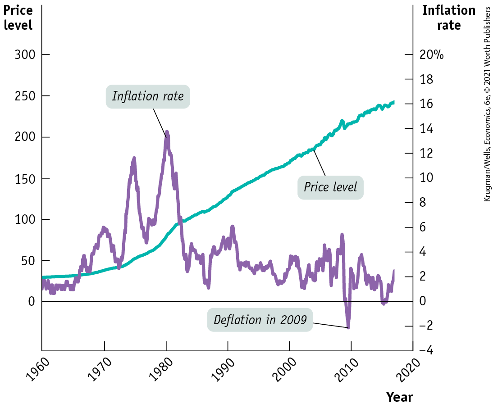
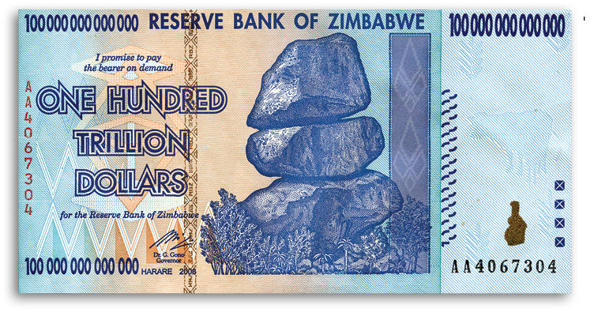
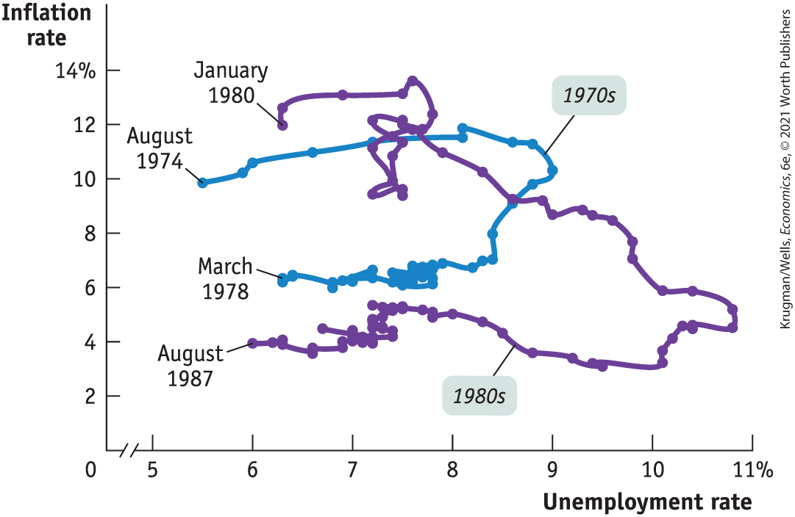

### *\>\> Check Your Understanding* 8-2

1.  Explain the following statements.
    1.  Frictional unemployment is higher when the pace of technological advance quickens.
    2.  Structural unemployment is higher when the pace of technological advance quickens.
    3.  Frictional unemployment accounts for a larger share of total unemployment when the unemployment rate is low.
2.  Why does collective bargaining have the same general effect on unemployment as a minimum wage? Illustrate your answer with a diagram.
3.  Suppose that at the peak of the business cycle the United States dramatically increases benefits for unemployed workers. Explain what will happen to the natural rate of unemployment.

## Inflation and Deflation

As we mentioned in the opening story, macroeconomic policy makers are usually focused on two big evils, unemployment and inflation. It’s easy to see why high unemployment is a problem. But why is inflation something to worry about? The answer is that inflation can impose costs on the economy — but not in the way most people think.

### The Level of Prices Doesn’t Matter …

The most common complaint about *inflation,* which is an increase in the price level, is that it makes everyone poorer — after all, a given amount of money buys less. But inflation does not make everyone poorer. To see why, it’s helpful to imagine what would happen if the United States did something other countries have done from time to time — replacing the dollar with a new currency.

An example of this kind of currency conversion happened in 2002, when France, like a number of other European countries, replaced its national currency, the franc, with the new pan-European currency, the euro. People turned in their franc coins and notes, and received euro coins and notes in exchange, at a rate of precisely 6.55957 francs per euro. At the same time, all contracts were restated in euros at the same rate of exchange. For example, if a French citizen had a home mortgage debt of 500,000 francs, this became a debt of $500,000/6.55957 = 76,224.51\,\text{euros}$. If a worker’s contract specified that they should be paid 100 francs per hour, it became a contract specifying a wage of $100/6.55957 = 15.2449\,\text{euros}$ per hour, and so on.

You could imagine doing the same thing in the case of the dollar, replacing the dollar with a “new dollar” at a rate of exchange of, say, 7 to 1. If you owed \$140,000 on your home, that would become a debt of 20,000 new dollars. If you had a wage rate of \$14 an hour, it would become 2 new dollars an hour, and so on. This would bring the overall U.S. price level back to about what it was in 1962, when John F. Kennedy was president.

So would everyone be richer as a result because prices would be only one-seventh as high? Of course not. Prices would be lower, but so would wages and incomes in general. If you cut a worker’s wage to one-seventh of its previous value, but also cut all prices to one-seventh of their previous level, the worker’s <a href="#kru_9781319245269_EM_glossary.xhtml#pau_9781319320164_uRRUVpe2Va" id="kru_9781319245269_ch08_04.xhtml#pau_9781319320164_Va0jk0m9kg" class="glossref" role="doc-glossref">real wage</a> — the wage rate divided by the price level — hasn’t changed. In fact, bringing the overall price level back to what it was during the Kennedy administration would have no effect on overall purchasing power because doing so would reduce income exactly as much as it reduced prices.

<aside aria-label="title 1" class="glossary c3 main-flow v1" epub:type="glossary" id="pau_9781319320164_pHp1FWr3Vw">

**real wage**  
The **real wage** is the wage rate divided by the price level.

</aside>

Conversely, the rise in prices that has actually taken place since the early 1960s hasn’t made the United States poorer because it has also raised incomes by the same amount: <a href="#kru_9781319245269_EM_glossary.xhtml#pau_9781319320164_KG5WKR5URK" id="kru_9781319245269_ch08_04.xhtml#pau_9781319320164_WD76RMLrow" class="glossref" role="doc-glossref">real incomes</a> — incomes divided by the price level — haven’t been affected by the rise in overall prices.

<aside aria-label="title 2" class="glossary c3 main-flow v1" epub:type="glossary" id="pau_9781319320164_akC0c5Tx69">

**real income**  
**Real income** is income divided by the price level.

</aside>

The moral of this story is that the *level* of prices doesn’t matter: the rise in prices in the U.S. economy over the past 50 years hasn’t made us any poorer.

### … But the Rate of Change of Prices Does

The conclusion that the level of prices doesn’t matter might seem to imply that the inflation rate doesn’t matter either. But that’s not true.

To see why, it’s crucial to distinguish between the *level of prices* and the *inflation rate:* the percent increase in the overall level of prices per year. Recall from <a href="#kru_9781319245269_ch07_01.xhtml#pau_9781319320164_J4fyDEWkvv" id="kru_9781319245269_ch08_04.xhtml#pau_9781319320164_jOVp1s3XeR" class="crossref">Chapter 7</a> that the inflation rate is defined as follows:

$$\text{Inflation}\,\text{rate} = \frac{\text{Price}\,\text{index}\,\text{in}\,\text{year}\, 2 - \text{Price}\,\text{index}\,\text{in}\,\text{year}\, 1}{\text{Price}\,\text{index}\,\text{in}\,\text{year}\, 1} \times 100$$

<a href="#kru_9781319245269_ch08_04.xhtml#pau_9781319320164_n5LiPdf98A" id="kru_9781319245269_ch08_04.xhtml#pau_9781319320164_YAnEkv76aD" class="crossref">Figure 8-12</a> highlights the difference between the price level and the inflation rate in the United States over the last half-century, with the price level measured along the left vertical axis and the inflation rate measured along the right vertical axis. In the 2000s, the overall level of prices in the United States was much higher than it had been in 1960 — but that, as we’ve learned, didn’t matter. The inflation rate in the 2000s, however, was much lower than in the 1970s — and that almost certainly made the economy richer than it would have been if high inflation had continued.

<figure id="pau_9781319320164_n5LiPdf98A" class="figure lm_img_lightbox num c3 main-flow">

<figcaption>
FIGURE 8-12 The Price Level versus the Inflation Rate, 1960–2020

With the exception of 2009, over the past half-century the price level has continuously increased. But the <em>inflation rate</em> — the rate at which prices are rising — has had both ups and downs. And in 2009, the inflation rate briefly turned negative, a phenomenon called <em>deflation.</em>

<em>Data from:</em> Bureau of Labor Statistics.
</figcaption>
</figure>

<aside class="hidden" id="pau_9781319320164_begTSLJe9Y" title="hidden">

The left vertical axis labeled “Price level” ranges from 0 to 300 percent, in increments of 50 percent. The horizontal axis plots years from 1960 to 2020, in increments of 10 years. The right vertical axis labeled “Inflation rate” ranges from negative 4 to negative 20 percent, in increments of 2 percent. The approximated inflation rates for the given years are marked as follows, 1960, 2; 1970, 6; 1980, 14; 1990, 6; 2000, 4; 2010, negative 2; and 2017, 2. The approximated price levels for the given years are marked as follows, 1960, 30; 1970, 40; 1980, 80; 1990, 130; 2000, 180; 2010, 220; and 2017, 240. The deflation in 2009 is marked at negative 2.

</aside>

Economists believe that high rates of inflation impose significant economic costs as resources are wasted. The most important of these costs are *shoe-leather costs, menu costs,* and *unit-of-account costs.* We’ll discuss each in turn.

#### Shoe-Leather Costs

People hold money — cash in their wallets and bank deposits — for convenience in making transactions. A high inflation rate, however, discourages people from holding money because the purchasing power of the cash in your wallet and the funds in your bank account steadily erode as the overall level of prices rises. This leads people to move funds into assets they believe will hold value and to reduce the amount of money they hold, often at considerable economic cost. For example, when Venezuelan inflation hit around 1 million percent in 2018, meaning that prices more than doubled every month, people began holding cigarettes and electronic currency (like Bitcoin) instead of Venezuelan currency.

During the most famous of all inflations, the German *hyperinflation* of 1921–1923, merchants employed runners to take their cash to the bank many times a day to convert it into something that would hold its value, such as a stable foreign currency. Hyperinflation occurs when prices rise by 50% or more per month, making an annual inflation rate of around 13,000%. In such cases, to avoid having the purchasing power of their money eroded, people use up valuable resources, such as the labor of the German runners, that could be used productively elsewhere. During the German hyperinflation, so many banking transactions were taking place that the number of employees at German banks nearly quadrupled — from around 100,000 in 1913 to 375,000 in 1923.

More recently, Brazil experienced hyperinflation during the early 1990s; during that episode, the Brazilian banking sector grew so large that it accounted for 15% of GDP, more than twice the size of the financial sector in the United States measured as a share of GDP. The large increase in the Brazilian banking sector needed to cope with the consequences of inflation, which represented a loss of real resources to its society.

Increased costs of transactions caused by inflation are known as <a href="#kru_9781319245269_EM_glossary.xhtml#pau_9781319320164_VFJeZpvQ6R" id="kru_9781319245269_ch08_04.xhtml#pau_9781319320164_TA2xtEb7p0" class="glossref" role="doc-glossref">shoe-leather costs</a>, an allusion to the wear and tear caused by the extra running around that takes place when people are trying to avoid holding money. Shoe-leather costs are substantial in economies with very high inflation, as anyone who has lived in such an economy — say, one suffering inflation of 100% or more per year — can attest. Most estimates suggest, however, that the shoe-leather costs of inflation at the rates seen in the United States — which in peacetime has never had inflation above 15% — are quite small.

<aside aria-label="title 3" class="glossary c3 main-flow v1" epub:type="glossary" id="pau_9781319320164_98WAoVnx8L">

**shoe-leather costs**  
**Shoe-leather costs** are the increased costs of transactions caused by inflation.

</aside>

#### Menu Costs

In a modern economy, most of the things we buy have a listed price. There’s a price listed under each item on a supermarket shelf, a price listed for goods sold on any online retailer’s website, such as Amazon or Zappos, and a price listed for each dish on a restaurant’s menu. Changing a listed price has a real cost, called a <a href="#kru_9781319245269_EM_glossary.xhtml#pau_9781319320164_ki9qZ8VrhD" id="kru_9781319245269_ch08_04.xhtml#pau_9781319320164_NXdUOomXIY" class="glossref" role="doc-glossref">menu cost</a>. Although the potential burden imposed by menu costs have diminished in advanced economies as more sales have shifted online and prices can be changed electronically, they still exist. For example, to change prices in a supermarket or a clothing store requires sending clerks to change the listed price with each item. In the face of inflation, of course, firms are forced to change prices more often than they would if the aggregate price level was more or less stable. This means higher costs for the economy as a whole.

<aside aria-label="title 4" class="glossary c3 main-flow v1" epub:type="glossary" id="pau_9781319320164_v9P3gQNDyb">

**menu cost**  
The **menu cost** is the real cost of changing a listed price.

</aside>

<figure id="pau_9781319320164_TaGwPw9hIn" class="figure lm_img_lightbox unnum c2 right">

<figcaption>
When one hundred trillion dollar bills are in circulation as they were in Zimbabwe, menu costs are substantial.
</figcaption>
</figure>

In times of very high inflation, menu costs can be substantial. During the Brazilian inflation of the early 1990s, for instance, supermarket workers reportedly spent half of their time replacing old price stickers with new ones. When inflation is high, merchants may decide to stop listing prices in terms of the local currency and use either an artificial unit — in effect, measuring prices relative to one another — or a more stable currency, such as the U.S. dollar. This is exactly what the Israeli real estate market began doing in the mid-1980s: prices were quoted in U.S. dollars, even though payment was made in Israeli shekels. And this is also what happened in Zimbabwe when, in May 2008, official estimates of the inflation rate reached 1,694,000%. By 2009, the government had suspended the Zimbabwean dollar, allowing Zimbabweans to buy and sell goods using foreign currencies.

Menu costs are also present in low-inflation economies, but they are not severe. In low-inflation economies, businesses might update their prices only sporadically — not daily or even more frequently, as is the case in high-inflation or hyperinflation economies.

#### Unit-of-Account Costs

In the Middle Ages, contracts were often specified “in kind”: tenants might, for example, be obliged to provide their landlord with a certain number of cattle each year (the phrase *in kind* actually comes from an ancient word for *cattle*). This may have made sense at the time, but it would be an awkward way to conduct modern business. Instead, we state contracts in monetary terms: renters owe a certain number of dollars per month, a company that issues a bond promises to pay the bondholder the dollar value of the bond when it comes due, and so on. We also tend to make our economic calculations in dollars: a family planning its budget, or a small business owner trying to figure out how well the business is doing, makes estimates of the amount of money coming in and going out.

This role of the dollar as a basis for contracts and calculation is called the *unit-of-account* role of money. It’s an important aspect of the modern economy. Yet it’s a role that can be degraded by inflation, which causes the purchasing power of a dollar to change over time — a dollar next year is worth less than a dollar this year. The effect, many economists argue, is to reduce the quality of economic decisions: the economy as a whole makes less efficient use of its resources because of the uncertainty caused by changes in the unit of account, the dollar. The <a href="#kru_9781319245269_EM_glossary.xhtml#pau_9781319320164_PHzKXa2dCO" id="kru_9781319245269_ch08_04.xhtml#pau_9781319320164_sgJslEnEYD" class="glossref" role="doc-glossref">unit-of-account costs</a> of inflation are the costs arising from the way inflation makes money a less reliable unit of measurement.

<aside aria-label="title 5" class="glossary c3 main-flow v1" epub:type="glossary" id="pau_9781319320164_884D6xbaCd">

**unit-of-account costs**  
The **unit-of-account costs** of inflation are the costs arising from the way inflation makes money a less reliable unit of measurement.

</aside>

Unit-of-account costs may be particularly important in the tax system because inflation can distort the measures of income on which taxes are collected. Here’s an example: assume that the inflation rate is 10%, so the overall level of prices rises 10% each year. Suppose that a business buys an asset, such as a piece of land, for \$100,000, then resells it a year later for \$110,000. In a fundamental sense, the business didn’t make a profit on the deal: in real terms, it got no more for the land than it paid for it. But U.S. tax law would say that the business made a capital gain of \$10,000, and it would have to pay taxes on that phantom gain.

During the 1970s, when the United States had relatively high inflation, the distorting effects of inflation on the tax system were a serious problem. Some businesses were discouraged from productive investment spending because they found themselves paying taxes on phantom gains. Meanwhile, some unproductive investments became attractive because they led to phantom losses that reduced tax bills. When inflation fell in the 1980s — and tax rates were reduced — these problems became much less important.

### Winners and Losers from Inflation

As we’ve just learned, a high inflation rate imposes costs on the economy through a waste of resources. In addition, inflation can produce winners and losers within the economy. The main reason inflation sometimes helps some people while hurting others is that economic transactions often involve contracts that extend over a period of time, such as loans, and these contracts are normally specified in nominal — that is, in dollar — terms.

In the case of a loan, the borrower receives a certain amount of funds at the beginning, and the loan contract specifies the *interest rate* on the loan and when it must be paid off. The <a href="#kru_9781319245269_EM_glossary.xhtml#pau_9781319320164_qJPN0DjPwh" id="kru_9781319245269_ch08_04.xhtml#pau_9781319320164_Gbank3jLg8" class="glossref" role="doc-glossref">interest rate</a> is the return a lender receives for allowing borrowers the use of their savings for one year, calculated as a percentage of the amount borrowed.

<aside aria-label="title 6" class="glossary c3 main-flow v1" epub:type="glossary" id="pau_9781319320164_CD2klBIWUM">

**interest rate**  
The **interest rate** on a loan is the price, calculated as a percentage of the amount borrowed, that lenders charge borrowers the use of their savings for one year.

</aside>

But what that dollar is worth in real terms — that is, in terms of purchasing power — depends greatly on the rate of inflation over the intervening years of the loan. Economists summarize the effect of inflation on borrowers and lenders by distinguishing between the *nominal* interest rate and the *real* interest rate. The <a href="#kru_9781319245269_EM_glossary.xhtml#pau_9781319320164_NTvSpOKx28" id="kru_9781319245269_ch08_04.xhtml#pau_9781319320164_NKz1HV55z9" class="glossref" role="doc-glossref">nominal interest rate</a> is the interest rate in dollar terms — for example, the interest rate on a student loan. The <a href="#kru_9781319245269_EM_glossary.xhtml#pau_9781319320164_HEDxJog7qH" id="kru_9781319245269_ch08_04.xhtml#pau_9781319320164_O6ysqBxY28" class="glossref" role="doc-glossref">real interest rate</a> is the nominal interest rate minus the rate of inflation. For example, if a loan carries an interest rate of 8%, but there is 5% inflation, the real interest rate is $8\%\operatorname{-~}5\% = 3\%$.

<aside aria-label="title 7" class="glossary c3 main-flow v1" epub:type="glossary" id="pau_9781319320164_L9J3nVBcMM">

**nominal interest rate**  
The **nominal interest rate** is the interest rate expressed in dollar terms.

</aside>
<aside aria-label="title 8" class="glossary c3 main-flow v1" epub:type="glossary" id="pau_9781319320164_TgCGFEvmX7">

**real interest rate**  
The **real interest rate** is the nominal interest rate minus the rate of inflation.

</aside>

When a borrower and a lender enter into a loan contract, the contract is normally written in dollar terms — that is, the interest rate it specifies is a nominal interest rate. But each party to a loan contract has an expectation about the future rate of inflation and therefore an expectation about the real interest rate on the loan. If the actual inflation rate is *higher* than expected, borrowers gain at the expense of lenders: borrowers will repay their loans with funds that have a lower real value than had been expected. Conversely, if the inflation rate is *lower* than expected, lenders will gain at the expense of borrowers: borrowers must repay their loans with funds that have a higher real value than had been expected.

In the modern United States, home mortgages are the most important source of gains and losses from inflation. While some mortgage interest rates are linked to the inflation rate, the vast majority are not, creating big winners and losers when inflation rates have changed unexpectedly. Americans who took out mortgages in the early 1970s quickly found the real cost of their payments reduced by higher-than-expected inflation. In contrast, those who took out mortgages in the early 1990s lost. The inflation rate fell to lower-than-expected levels in the following years and raised the cost of their payments.

Because gains for some and losses for others result from inflation that is either higher or lower than expected, yet another problem arises: uncertainty about the future inflation rate discourages people from entering into any form of long-term contract. This is an additional cost of high inflation, because high rates of inflation are usually unpredictable. In countries with high and uncertain inflation, long-term loans are rare, which makes it difficult in many cases to make long-term investments.

One last point: unexpected *deflation* — a surprise fall in the price level — creates winners and losers, too. Between 1929 and 1933, as the U.S. economy plunged into the Great Depression, the consumer price index fell by 35%. This meant that debtors, including many farmers and homeowners, saw a sharp rise in the real value of their debts, which led to widespread bankruptcy and helped create a banking crisis, as lenders found their customers unable to pay back their loans. And as you can see in <a href="#kru_9781319245269_ch08_04.xhtml#pau_9781319320164_n5LiPdf98A" id="kru_9781319245269_ch08_04.xhtml#pau_9781319320164_vfb9XMJMVs" class="crossref">Figure 8-12</a>, deflation occurred again in 2009, when the inflation rate fell to $- 2\%$ at the trough of a deep recession. Like the Great Depression (but to a much lesser extent), the unexpected deflation of 2009 imposed heavy costs on debtors. We will discuss the effects of deflation in more detail in <a href="#kru_9781319245269_ch16_01.xhtml#pau_9781319320164_Upw2yOhAsg" id="kru_9781319245269_ch08_04.xhtml#pau_9781319320164_ycRCYgG0JX" class="crossref">Chapter 16</a>.

### Inflation Is Easy. Disinflation Is Hard.

There is not much evidence that a rise in the inflation rate from 2% to 5% would do a great deal of harm to the economy. Still, policy makers generally move forcefully to bring inflation back down when it creeps above 2% or 3%. Why? Because experience shows that bringing the inflation rate down — a process called <a href="#kru_9781319245269_EM_glossary.xhtml#pau_9781319320164_WO8bgk9xhR" id="kru_9781319245269_ch08_04.xhtml#pau_9781319320164_nnS3OeMSPK" class="glossref" role="doc-glossref">disinflation</a> — is very difficult and costly once a higher rate of inflation has become well established in the economy.

<aside aria-label="title 9" class="glossary c3 main-flow v1" epub:type="glossary" id="pau_9781319320164_BgDgfcWSo1">

**disinflation**  
**Disinflation** is the process of bringing the inflation rate down.

</aside>

<a href="#kru_9781319245269_ch08_04.xhtml#pau_9781319320164_0yvRMMc4vR" id="kru_9781319245269_ch08_04.xhtml#pau_9781319320164_3x4s6zo3wZ" class="crossref">Figure 8-13</a> shows what happened during two major episodes of disinflation in the United States, in the mid-1970s and in the early 1980s. The horizontal axis shows the unemployment rate. The vertical axis shows *core inflation* over the previous year, a measure that excludes volatile food and energy prices and is widely considered a better measure of underlying inflation than overall consumer prices. Each marker represents the inflation rate and the unemployment rate for one month. In each episode, unemployment and inflation followed a sort of clockwise spiral, with high inflation gradually falling in the face of an extended period of very high unemployment.

<figure id="pau_9781319320164_0yvRMMc4vR" class="figure lm_img_lightbox num c3 main-flow">

<figcaption>
FIGURE 8-13 The Cost of Disinflation

There were two major periods of disinflation in modern U.S. history, in the mid-1970s and the early 1980s. This figure shows the track of the unemployment rate and the core inflation rate, which excludes food and energy, during these two episodes. In each case bringing inflation down required a temporary but very large increase in the unemployment rate, demonstrating the high cost of disinflation.

<em>Data from:</em> Bureau of Labor Statistics.
</figcaption>
</figure>

<aside class="hidden" id="pau_9781319320164_7su6ySYSjP" title="hidden">

The vertical axis labeled Inflation rate ranges from 0 to 14 percent, in increments of 2 percent. The horizontal axis labeled Unemployment rate is truncated and ranges from 5 to 11 percent, in increments of 1 percent. The curve for the 1970s begins at approximately (5.5, 10) labeled August 1974, passes through the approximate points (6, 10.3), (6.6, 11), (7.2, 11.5), (8.2, 12), (9, 10), (8.4, 8), (8.4, 7), (8, 7), and (7.5, 6.5), and ends at approximately (6.4, 6.3) labeled March, 1978. The curve for 1980’s shows the similar pattern. The curve begins at approximately (6.4, 12) labeled January 1980, passes through the approximate points (7.5, 13), (7.7, 12), (7.5, 11), (7.2, 10.5),(7.6, 9), (7.2, 9), (7.5, 11.2), (7.2, 12), (8.5, 9.5), (9.7, 8), (10, 6), (10.8, 5), (10.3, 5), (10.2, 3.5), (9.5, 3.5), and (7.8, 3), forms a cluster at unemployment rate 7.2 percent and inflation rate 4 percent, and ends at approximately (6, 4) labeled August, 1987.

</aside>

According to many economists, these periods of high unemployment that temporarily depressed the economy were necessary to reduce inflation that had become deeply embedded in the economy. The best way to avoid having to put the economy through a wringer to reduce inflation, however, is to avoid having a serious inflation problem in the first place. So, as a form of preventive medicine for the economy, policy makers respond forcefully to signs that inflation may be accelerating.

### ECONOMICS \>\> *in Action*

Israel’s Experience with Inflation

<figure id="pau_9781319320164_qQqyFtpFkD" class="figure lm_img_lightbox unnum c2 right">

<figcaption>
During a period of high inflation in the mid-1980s, Israelis held very little cash, forcing them to make repeated trips to banks.
</figcaption>
</figure>

It’s frequently hard to see the costs of inflation clearly because serious inflation problems are often associated with other problems that disrupt economic life, notably war or political instability (or both). In the mid-1980s, however, Israel experienced a “clean” inflation: there was no war, the government was stable, and there was order in the streets. Yet a series of policy errors led to very high inflation, with prices often rising more than 10% a month.

As it happens, one of the authors spent a month visiting at Tel Aviv University at the height of the inflation, so we can give a first-hand account of the effects.

First, the shoe-leather costs of inflation were substantial. At the time, debit cards had not yet been introduced. So Israelis spent a lot of time in lines at the bank, moving money in and out of accounts that provided high enough interest rates to offset inflation. People walked around with very little cash in their wallets; they had to go to the bank whenever they needed to make even a moderately large cash payment. Banks responded by opening a lot of branches, a costly business expense.

Second, although menu costs weren’t that visible to a visitor, what you could see were the efforts businesses made to minimize them. For example, restaurant menus often didn’t list prices. Instead, they listed numbers that you had to multiply by another number, written on a chalkboard and changed every day, to figure out the price of a dish.

Finally, it was hard to make decisions because prices changed so much and so often. It was a common experience to walk out of a store because prices were 25% higher than at one’s usual shopping destination, only to discover that prices had just been increased 25% there, too.

### *\>\> Quick Review*

- The **real wage** and **real income** are unaffected by the level of prices.
- Inflation, like unemployment, is a major concern of policy makers — so much so that in the past they have accepted high unemployment as the price of reducing inflation.
- While the overall level of prices is irrelevant, high rates of inflation impose real costs on the economy: **shoe-leather costs, menu costs**, and **unit-of-account costs.**
- The **interest rate** is the return a lender receives for use of their funds for a year. The **real interest rate** is equal to the **nominal interest rate** minus the inflation rate. As a result, unexpectedly high inflation helps borrowers and hurts lenders. With high and uncertain inflation, people will often avoid long-term investments.
- **Disinflation** is very costly, so policy makers try to avoid getting into situations of high inflation in the first place.

### *\>\> Check Your Understanding* 8-3

1.  The widespread use of technology has revolutionized the banking industry, making it much easier for customers to access and manage their assets. Does this mean that the shoe-leather costs of inflation are higher or lower than they used to be?
2.  Most people in the United States have grown accustomed to a modest inflation rate of around 2% to 3%. Who would gain and who would lose if inflation unexpectedly came to a complete stop over the next 15 or 20 years?

## Business case 

TaskRabbit

<figure id="pau_9781319320164_4Bthmv3060" class="figure lm_img_lightbox unnum c2 right">

</figure>

“Moving is the worst. Yard work is the worst. Building IKEA furniture is the worst.” So began a 2015 report on TaskRabbit, a company founded in 2008 (under the name RunMyErrand), that helps people hire others to do their chores. As of 2019 there were about 140,000 of these freelancers, whom the company calls Taskers, and TaskRabbit operated in 53 U.S. cities, Great Britain, and Canada.

Why would becoming a Tasker seem appealing to some workers? The great majority of Taskers are part-time workers, who want flexibility in their employment; the company’s pitch to potential Taskers contains the slogan “Earn money your way,” and features testimonials from workers who combined employment with parenting, careers in the arts, and so on.

Working part time for a variety of clients isn’t a new phenomenon. On urban street corners across the United States, workers still line up early each morning in the hope of getting day jobs in industries like construction, where the need for workers fluctuates, sometimes unpredictably. For more skilled workers, there are numerous online resources as well as temporary staffing agencies, like Allegis Group, that provide workers on a subcontracting basis, from a few days to months at a time. And some people still find temporary jobs by calling numbers listed in classified ads, or even going door to door.

But TaskRabbit — founded the year after Apple introduced its first iPhone — tries to use the ubiquity of smartphones to simplify the process. Originally it was set up as a kind of auction market, in which potential employers and workers placed bids, but since 2014 it has relied on a streamlined system that is very similar to the way car services like Uber or Lyft match riders with willing drivers. TaskRabbit’s app let those seeking help make their needs known simply by tapping on one of a few common chores; potential workers can then offer to do jobs that match the locations and skills they have put in their profiles, again simply by tapping on jobs that appear on their smartphones. (They have already specified their hourly rate.) The process takes a lot less time and effort than standing on street corners, pounding the pavement, or performing online job searches.

How big a deal are enterprises like TaskRabbit? Some observers suggest that we’re seeing the rise of a *gig economy,* in which large numbers of people freelance, moving from job to job rather than being formal employees of a large firm. There’s probably some hype in these pronouncements, but real change does seem to be happening. So far, however, there isn’t a lot of evidence for a major shift in the nature of employment.

<aside class="assessments c3 main-flow v1" epub:type="assessments" id="pau_9781319320164_1DZCaC1BGC">

### Questions for thought

1.  How is the matching of job-seekers and employers through services like TaskRabbit likely to affect frictional unemployment?
2.  What is the likely effect of such services on the number of people considered to be in the labor force?
3.  Some analysts suggest that most freelancers have other jobs, and only do gig economy work on the side. How does that statement help explain the lack of clear evidence for a growing gig economy?

</aside>

### Summary

1.  The two principal objectives of macroeconomic policy are price stability (a low, but positive, level of inflation) and low unemployment.
2.  **Employment** is the number of people employed; **unemployment** is the number of people unemployed and actively looking for work. Their sum is equal to the **labor force**, and the **labor force participation rate** is the percentage of the population age 16 or older that is in the labor force.
3.  The **unemployment rate**, the percentage of the labor force that is unemployed and actively looking for work, can both overstate and understate the true level of unemployment. It can overstate because it counts as unemployed those who are continuing to search for a job despite having been offered one. It can understate because it ignores frustrated workers, such as **discouraged workers, marginally attached workers**, and the **underemployed.** In addition, the unemployment rate varies greatly among different groups in the population; it is typically higher for younger workers and for workers near retirement age than for workers in their prime working years.
4.  There is a negative relationship between the growth rate of GDP and the change in unemployment. During a recession, when the GDP growth rate is less than zero, unemployment rises; the deeper the recession, the greater the rise in unemployment. During a strong expansion, when the GDP growth rate is above average, unemployment falls; the stronger the expansion, the greater the fall in unemployment. A **jobless recovery** occurs when the GDP growth rate is positive but below average, resulting in rising unemployment.
5.  Job creation and destruction, as well as voluntary job separations, lead to natural unemployment, composed of **frictional unemployment** and **structural unemployment. Job search** leads to frictional unemployment. Structural unemployment arises when the prevailing wage rate is above the equilibrium wage rate, resulting in persistent unemployment. It is due to a number of factors, such as **minimum wages, unions, efficiency wages**, government policies, and mismatch between employers and employees. As a result, the **natural rate of unemployment**, the sum of frictional and structural unemployment, is well above zero, even when jobs are plentiful.
6.  The actual unemployment rate is equal to the natural rate of unemployment, the share of unemployment that is independent of the business cycle, plus **cyclical unemployment**, the share of unemployment that depends on fluctuations in the business cycle.
7.  The natural rate of unemployment changes over time, largely in response to changes in labor force characteristics, labor market institutions, and government policies.
8.  Inflation does not, as many assume, make everyone poorer by raising the level of prices. That’s because wages and incomes are adjusted to take into account a rising price level, leaving **real wages** and **real income** unaffected. However, a high inflation rate imposes overall costs on the economy: **shoe-leather costs, menu costs**, and **unit-of-account costs.**
9.  Inflation can produce winners and losers within the economy, because long-term contracts are generally written in dollar terms. The **interest rate** specified in a loan is typically a **nominal interest rate**, which differs from the **real interest rate** due to inflation. A higher-than-expected inflation rate is good for borrowers and bad for lenders. A lower-than-expected inflation rate is good for lenders and bad for borrowers.
10. Many believe policies that depress the economy and produce high unemployment are necessary to reduce embedded inflation. Because **disinflation** is very costly, policy makers try to prevent inflation from becoming excessive in the first place.
