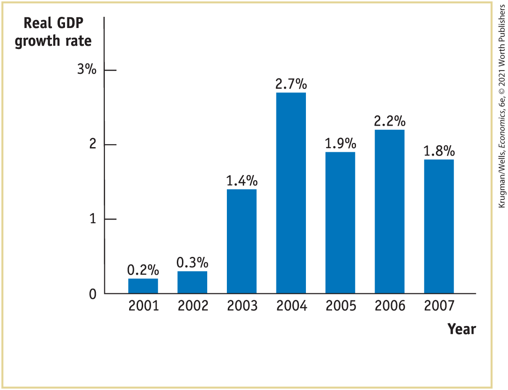
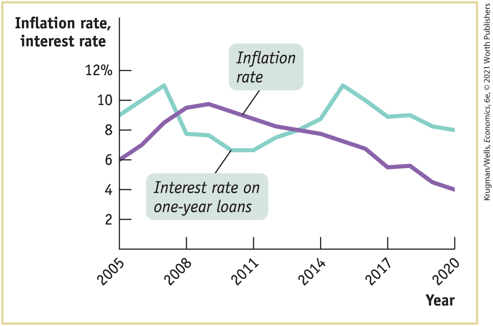
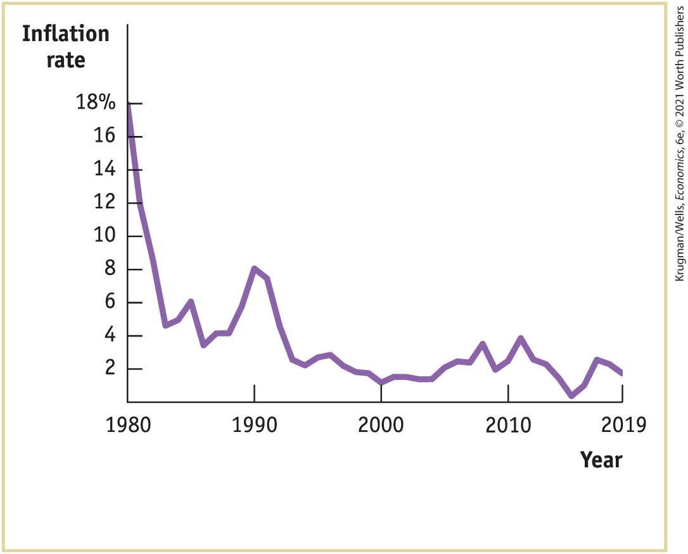
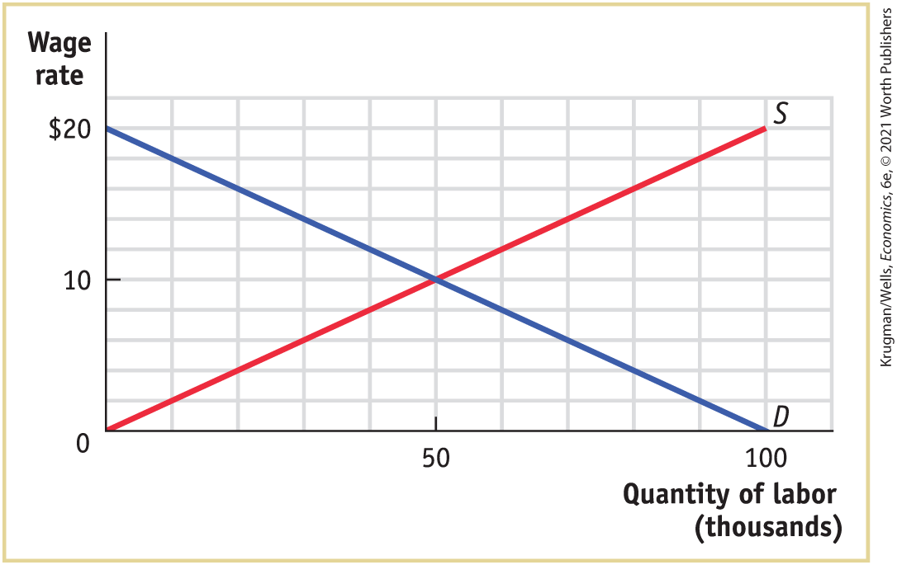

### Key Terms

- <a href="#kru_9781319245269_ch08_02.xhtml#pau_9781319320164_1xJahPQjA8" id="kru_9781319245269_ch08_06.xhtml#pau_9781319320164_mrlk9qYuk1" class="crossref">Employment</a>
- <a href="#kru_9781319245269_ch08_02.xhtml#pau_9781319320164_SsP3hMxgUu" id="kru_9781319245269_ch08_06.xhtml#pau_9781319320164_cicqMO5xsP" class="crossref">Unemployment</a>
- <a href="#kru_9781319245269_ch08_02.xhtml#pau_9781319320164_47sH8zg2ZV" id="kru_9781319245269_ch08_06.xhtml#pau_9781319320164_hrZ8ry6i4U" class="crossref">Labor force</a>
- <a href="#kru_9781319245269_ch08_02.xhtml#pau_9781319320164_ryqzwjGGTI" id="kru_9781319245269_ch08_06.xhtml#pau_9781319320164_V0C5AzgfQr" class="crossref">Labor force participation rate</a>
- <a href="#kru_9781319245269_ch08_02.xhtml#pau_9781319320164_hiwDx3XL12" id="kru_9781319245269_ch08_06.xhtml#pau_9781319320164_hm371d8U10" class="crossref">Unemployment rate</a>
- <a href="#kru_9781319245269_ch08_02.xhtml#pau_9781319320164_X1gQKEDJRK" id="kru_9781319245269_ch08_06.xhtml#pau_9781319320164_Sr2caE0kIf" class="crossref">Discouraged workers</a>
- <a href="#kru_9781319245269_ch08_02.xhtml#pau_9781319320164_yluHl1cifS" id="kru_9781319245269_ch08_06.xhtml#pau_9781319320164_0VNpqkoWLQ" class="crossref">Marginally attached workers</a>
- <a href="#kru_9781319245269_ch08_02.xhtml#pau_9781319320164_II4wzfYIZs" id="kru_9781319245269_ch08_06.xhtml#pau_9781319320164_MoMlfpEaX9" class="crossref">Underemployment</a>
- <a href="#kru_9781319245269_ch08_02.xhtml#pau_9781319320164_uv9GVfSYKQ" id="kru_9781319245269_ch08_06.xhtml#pau_9781319320164_PE9sjVeoYn" class="crossref">Jobless recovery</a>
- <a href="#kru_9781319245269_ch08_03.xhtml#pau_9781319320164_mLrtuKGHWk" id="kru_9781319245269_ch08_06.xhtml#pau_9781319320164_gOybxb8Wgz" class="crossref">Job search</a>
- <a href="#kru_9781319245269_ch08_03.xhtml#pau_9781319320164_k2G7blIMpe" id="kru_9781319245269_ch08_06.xhtml#pau_9781319320164_LPLaVMnJzo" class="crossref">Frictional unemployment</a>
- <a href="#kru_9781319245269_ch08_03.xhtml#pau_9781319320164_ksgNhk7edy" id="kru_9781319245269_ch08_06.xhtml#pau_9781319320164_nRIZa6CZaD" class="crossref">Structural unemployment</a>
- <a href="#kru_9781319245269_ch08_03.xhtml#pau_9781319320164_HJc5Wq9NYg" id="kru_9781319245269_ch08_06.xhtml#pau_9781319320164_oYXrLBQTyF" class="crossref">Minimum wage</a>
- <a href="#kru_9781319245269_ch08_03.xhtml#pau_9781319320164_WJiPWHKpDI" id="kru_9781319245269_ch08_06.xhtml#pau_9781319320164_KY9v1xk9ui" class="crossref">Union</a>
- <a href="#kru_9781319245269_ch08_03.xhtml#pau_9781319320164_jYk0OuM9TL" id="kru_9781319245269_ch08_06.xhtml#pau_9781319320164_Pi04BF05Vw" class="crossref">Efficiency wages</a>
- <a href="#kru_9781319245269_ch08_03.xhtml#pau_9781319320164_P1C54PnH9c" id="kru_9781319245269_ch08_06.xhtml#pau_9781319320164_QgZPHUaObH" class="crossref">Natural rate of unemployment</a>
- <a href="#kru_9781319245269_ch08_03.xhtml#pau_9781319320164_5dFYI9KCCc" id="kru_9781319245269_ch08_06.xhtml#pau_9781319320164_7POxYgSPat" class="crossref">Cyclical unemployment</a>
- <a href="#kru_9781319245269_ch08_04.xhtml#pau_9781319320164_4Ao8X53jhz" id="kru_9781319245269_ch08_06.xhtml#pau_9781319320164_5MuOx3izrI" class="crossref">Real wage</a>
- <a href="#kru_9781319245269_ch08_04.xhtml#pau_9781319320164_1AAaDLpJU2" id="kru_9781319245269_ch08_06.xhtml#pau_9781319320164_CVdh87A8GB" class="crossref">Real income</a>
- <a href="#kru_9781319245269_ch08_04.xhtml#pau_9781319320164_T67mJCGEJw" id="kru_9781319245269_ch08_06.xhtml#pau_9781319320164_ySX12ovkTS" class="crossref">Shoe-leather costs</a>
- <a href="#kru_9781319245269_ch08_04.xhtml#pau_9781319320164_rJff4DGH20" id="kru_9781319245269_ch08_06.xhtml#pau_9781319320164_2KtqBeBSPV" class="crossref">Menu costs</a>
- <a href="#kru_9781319245269_ch08_04.xhtml#pau_9781319320164_lkvrDED9VV" id="kru_9781319245269_ch08_06.xhtml#pau_9781319320164_cPPnvP2nag" class="crossref">Unit-of-account costs</a>
- <a href="#kru_9781319245269_ch08_04.xhtml#pau_9781319320164_PDjopjVnC7" id="kru_9781319245269_ch08_06.xhtml#pau_9781319320164_nc5xbc0X2u" class="crossref">Interest rate</a>
- <a href="#kru_9781319245269_ch08_04.xhtml#pau_9781319320164_HQgAwnj2mv" id="kru_9781319245269_ch08_06.xhtml#pau_9781319320164_LOi999Iq3e" class="crossref">Nominal interest rate</a>
- <a href="#kru_9781319245269_ch08_04.xhtml#pau_9781319320164_8lPDnjQpf2" id="kru_9781319245269_ch08_06.xhtml#pau_9781319320164_oFUf4ZIYnP" class="crossref">Real interest rate</a>
- <a href="#kru_9781319245269_ch08_04.xhtml#pau_9781319320164_RlZkx8VO8B" id="kru_9781319245269_ch08_06.xhtml#pau_9781319320164_4ato9kb7zo" class="crossref">Disinflation</a>

### Practice questions

1.  Each month, usually on the first Friday of the month, the Bureau of Labor Statistics releases the Employment Situation Summary for the previous month. Go to <a href="http://www.bls.gov" id="kru_9781319245269_ch08_06.xhtml#pau_9781319320164_v4hckdkini" class="external">www.bls.gov</a> and find the latest report. On the Bureau of Labor Statistics home page, at the top of the page, select the “Economic Releases” tab, find “Latest Releases,” and select “Employment Situation.” You will find the Employment Situation Summary listed at the top. How does the current unemployment rate compare to the rate one month earlier? How does the current unemployment rate compare to the rate one year earlier?
2.  In 2018, the Bureau of Labor Statistics released the report “Contingent and Alternative Employment Arrangements,” which included independent contractors, those in the gig economy. The report found 16.5 million people working in contingent or independent jobs. Surprisingly, the share of all workers classified as either contingent or independent contractors had declined from 11.5% in 2005 to 10.7% in 2017. The BLS report stated, “The government figures only count workers whose gig arrangements are their main job, and only includes those who’ve worked in that job in the last week.” In what ways did the BLS understate the reported numbers? Who was likely being omitted from these calculations?

### Problems

1.  In general, how do changes in the unemployment rate vary with changes in real GDP? After several quarters of a severe recession, explain why we might observe a decrease in the official unemployment rate. Explain why we could see an increase in the official unemployment rate after several quarters of a strong expansion.

2.  In each of the following situations, what type of unemployment is Melanie facing?
    1.  After completing a complex programming project, Melanie is laid off. Her prospects for a new job requiring similar skills are good, and she has signed up with a programmer placement service. She has passed up offers for low-paying jobs.
    2.  When Melanie and her co-workers refused to accept pay cuts, her employer outsourced their programming tasks to workers in another country. This phenomenon is occurring throughout the programming industry.
    3.  Due to the current slump, Melanie has been laid off from her programming job. Her employer promises to rehire her when business picks up.

3.  Part of the information released in the Employment Situation Summary concerns how long individuals have been unemployed. Go to <a href="http://www.bls.gov" id="kru_9781319245269_ch08_06.xhtml#pau_9781319320164_RLX9Hg1nGn" class="external">www.bls.gov</a> to find the latest report. Use the same technique as in Practice Questions <a href="#kru_9781319245269_ch08_06.xhtml#pau_9781319320164_fHHkAYvY6A" id="kru_9781319245269_ch08_06.xhtml#pau_9781319320164_tIBGx0MWuS" class="crossref">Problem 1</a> to find the Employment Situation Summary. Near the end of the Employment Situation, click on Table A-12, titled “Unemployed persons by duration of unemployment.” Use the seasonally adjusted numbers to answer the following questions.
    1.  How many workers were unemployed less than 5 weeks? What percentage of all unemployed workers do these workers represent? How do these numbers compare to the previous month’s data?
    2.  How many workers were unemployed for 27 or more weeks? What percentage of all unemployed workers do these workers represent? How do these numbers compare to the previous month’s data?
    3.  How long has the average worker been unemployed (average duration, in weeks)? How does this compare to the average for the previous month’s data?
    4.  Comparing the latest month for which there are data with the previous month, has the problem of long-term unemployment improved or deteriorated?

4.  A country’s labor force is the sum of the number of employed and unemployed workers. The accompanying table provides data on the size of the labor force and the number of unemployed workers for different regions of the United States.
    |                                                                                                                                             |                         |               |                        |               |
    |---------------------------------------------------------------------------------------------------------------------------------------------|-------------------------|---------------|------------------------|---------------|
    |                                                                                                                                             | Labor force (thousands) |               | Unemployed (thousands) |               |
    | Region                                                                                                                                      | December 2018           | December 2019 | December 2018          | December 2019 |
    | Northeast                                                                                                                                   | 28,536                  | 28,729        | 1,083                  | 1,080         |
    | South                                                                                                                                       | 60,112                  | 60,909        | 2,183                  | 2,074         |
    | Midwest                                                                                                                                     | 34,971                  | 35,063        | 1,275                  | 1,244         |
    | West                                                                                                                                        | 38,704                  | 39,166        | 1,608                  | 1,489         |
    | *Data from:* Bureau of Labor Statistics. |                         |               |                        |               |

    1.  Calculate the number of workers employed in each of the regions in December 2018 and December 2019. Use your answers to calculate the change in the total number of workers employed between December 2018 and December 2019.
    2.  For each region, calculate the growth in the labor force from December 2018 to December 2019.
    3.  Compute unemployment rates in the different regions of the country in December 2018 and December 2019.
    4.  What can you infer about the fall in unemployment rates over this period? Was it caused by a net gain in the number of jobs or by a large fall in the number of people seeking jobs?

5.   Access the Discovering Data exercise for <!--<a class="crossref" href="kru_9781319245269_ch08_01.xhtml#ch8_sec_1" id="ch08-ext6">-->Chapter 8<!--</a>--> Problem 5 online to answer the following questions.
    1.  What is the current federal minimum wage?
    2.  In what year was the federal minimum wage last increased?
    3.  What is the current value for the real minimum wage?
    4.  In what year was the real minimum wage the highest? The lowest?
    5.  In general, since 1970, how has the purchasing power of the minimum wage changed over time?

6.  In which of the following cases is it more likely for efficiency wages to exist? Why?
    1.  Jane and her boss work as a team selling ice cream.
    2.  Jane sells ice cream without any direct supervision by her boss.
    3.  Jane speaks Korean and sells ice cream in a neighborhood in which Korean is the primary language. It is difficult to find another worker who speaks Korean.

7.  How will the following changes affect the natural rate of unemployment?
    1.  The government reduces the time during which an unemployed worker can receive unemployment benefits.
    2.  More teenagers focus on their studies and do not look for jobs until after college.
    3.  Greater access to the internet leads both potential employers and potential employees to use the internet to list and find jobs.
    4.  Union membership declines.

8.  With its tradition of a job for life for most citizens, Japan once had a much lower unemployment rate than that of the United States; from 1960 to 1995, the unemployment rate in Japan exceeded 3% only once. However, since the crash of its stock market in 1989 and slow economic growth in the 1990s, the job-for-life system has broken down and unemployment rose to more than 5% in 2003.
    1.  Explain the likely effect of the breakdown of the job-for-life system in Japan on the Japanese natural rate of unemployment.

    2.  As the accompanying diagram shows, the rate of growth of real GDP picked up in Japan after 2001 and before the global economic crisis of 2007–2009. Explain the likely effect of this increase in real GDP growth on the unemployment rate. Was the likely cause of the change in the unemployment rate during this period a change in the natural rate of unemployment or a change in the cyclical unemployment rate?

        <figure id="pau_9781319320164_hC7s0DNIs7" class="figure lm_img_lightbox unnum c5 center">
        
        <figcaption>
<em>Data from:</em> OECD.
</figcaption>
        </figure>

        <aside class="hidden" id="pau_9781319320164_g6kFAIkiU9" title="hidden">

        The vertical axis labeled “Real G D P growth rate” ranges from 0 to 3 percent, in increments of 1 percent. The horizontal axis plots years from 2001 to 2007, in increments of 1 year. The real G D P growth rates for each year marked in the graph are as follows, 2001, 0.2 percent; 2002, 0.3 percent; 2003, 1.4 percent; 2004, 2.7 percent; 2005, 1.9 percent; 2006, 2.2 percent; and 2007, 1.8 percent.

        </aside>

9.  In the following examples, is inflation creating winners and losers at no net cost to the economy or is inflation imposing a net cost on the economy? If a net cost is being imposed, which type of cost is involved?
    1.  When inflation is expected to be high, workers get paid more frequently and make more trips to the bank.
    2.  Lanwei is reimbursed by her company for her work-related travel expenses. Sometimes, however, the company takes a long time to reimburse her. So when inflation is high, she is less willing to travel for her job.
    3.  Hector has a mortgage with a fixed nominal interest rate of 6% that he took out five years ago. Over the years, the inflation rate has crept up unexpectedly to its present level of 7%.
    4.  In response to unexpectedly high inflation, the manager of Cozy Cottages of Cape Cod must reprint and resend expensive color brochures correcting the price of rentals this season.

10. The accompanying diagram shows the interest rate on one-year loans and inflation from 2005 to 2020 in the economy of Albernia. When would one-year loans have been especially attractive and why?

    <figure id="pau_9781319320164_g0eTpMqMHO" class="figure lm_img_lightbox unnum c5 center">
    
    </figure>

    <aside class="hidden" id="pau_9781319320164_qmqW4tNhjH" title="hidden">

    The vertical axis labeled “Inflation Rate, interest rate” ranges from 0 to 12 percent, in increments of 2 percent. The horizontal axis plots years from 2005 to 2020, in increments of 3 years. It shows two curves, with the first denoting “Inflation rate” and the second denoting “Interest rate on one-year loans.” The approximate inflation rates for the years are marked as follows, 2005, 9 percent; 2007, 11 percent; 2008, 8 percent; 2011, 6.5 percent; 2014, 9 percent; 2015, 11 percent; 2017, 9 percent; and 2020, 8 percent. The approximate interest rates on one-year loans for the years are marked as follows, 2005, 6 percent; 2008, 9.5 percent; 2011, 9 percent; 2014, 8 percent; 2017, 6 percent; and 2020, 4 percent.

    </aside>

11. The accompanying table provides the inflation rate in the year 2005 and the average inflation rate over the period 2006–2019 for seven different countries.
    | Country           | Inflation rate in 2005 | Average inflation rate in 2006–2019 |
    |-------------------|------------------------|-------------------------------------|
    | Brazil            |      6.87%             |      5.47%                          |
    | China             | 1.77                   | 2.68                                |
    | France            | 1.74                   | 1.23                                |
    | Indonesia         | 10.45                  | 5.83                                |
    | Japan             | −0.28                  | 0.35                                |
    | Turkey            | 8.18                   | 9.53                                |
    | United States     | 3.39                   | 1.95                                |
    | *Data from:* IMF. |                        |                                     |

    1.  Given the expected relationship between average inflation and menu costs, rank the countries in descending order of menu costs using average inflation over the period 2006–2019.
    2.  Rank the countries in order of inflation rates that most favored borrowers with ten-year loans that were taken out in 2005. Assume that the loans were agreed upon with the expectation that the inflation rate for 2006 to 2019 would be the same as the inflation rate in 2005.
    3.  Did borrowers who took out ten-year loans in Japan gain or lose overall versus lenders? Explain.

12.  Access the Discovering Data exercise for <!--<a class="crossref" href="kru_9781319245269_ch08_01.xhtml#ch8_sec_1" id="ch08-ext7">-->Chapter 8<!--</a>--> Problem 12 online to answer the following questions.
    1.  What is the current level of employment for individuals without a high school diploma?
    2.  How much has employment changed for high school graduates from 2007 through 2016?
    3.  Since 2007, which education group has experienced the largest increase in employment?
    4.  Since the end of the Great Recession in 2009, how has employment changed for the different education levels? Calculate the net gain (or loss) of jobs for each category to answer.
    5.  What percent of the employed had a bachelor’s degree in January 1992? What percent has a bachelor’s degree today?
    6.  Calculate the change in the share of employment by education level since 1992.

13. The accompanying diagram shows the inflation rate in the United Kingdom from 1980 to 2019.
    1.  Between 1980 and 1985, policy makers in the United Kingdom worked to lower the inflation rate. What would you predict happened to unemployment between 1980 and 1985?

    2.  Policy makers in the United Kingdom react forcefully when the inflation rate rises above a target rate of 2%. Why would it be harmful if inflation rose from 0.7% (the level in 2019) to, say, a level of 5%?

        <figure id="pau_9781319320164_iG9hxmrwtK" class="figure lm_img_lightbox unnum c5 center">
        
        <figcaption>
<em>Data from:</em> Bank of England.
</figcaption>
        </figure>

        <aside class="hidden" id="pau_9781319320164_CXtCEKUT42" title="hidden">

        The vertical axis labeled “Inflation Rate” ranges from 0 to 18 percent, in increments of 2 percent. The horizontal axis plots years from 1980 to 2010, in increments of 10 years, and has a mark at 2019. The approximate inflation rates for the given years are as follows, 1980, 18 percent; 1985, 4 percent; 1990, 8 percent; 2000, 2 percent; 2010, 3 percent; 2015, 0.5 percent; and 2019, 2 percent.

        </aside>

 **Work It Out**

14. There is only one labor market in Profunctia. All workers have the same skills, and all firms hire workers with these skills. Use the accompanying diagram, which shows the supply of and demand for labor, to answer the following questions. Illustrate each answer with a diagram.

    <figure id="pau_9781319320164_OyAdZWa74U" class="figure lm_img_lightbox unnum c5 center">
    
    </figure>

    <aside class="hidden" id="pau_9781319320164_wRTKxhBf7G" title="hidden">

    The vertical axis labeled Wage rate ranges from 0 to 20 dollars, in increments of 10 dollars. The horizontal axis labeled Quantity of Labor (thousands) ranges from 0 to 100, in increments of 50. The supply line runs from the origin to a point (100, 20). The demand curve runs from a point (0, 20) to a point (100, 0).

    </aside>

    1.  What is the equilibrium wage rate in Profunctia? At this wage rate, what are the level of employment, the size of the labor force, and the unemployment rate?
    2.  If the government of Profunctia sets a minimum wage equal to \$12, what will be the level of employment, the size of the labor force, and the unemployment rate?
    3.  If unions bargain with the firms in Profunctia and set a wage rate equal to \$14, what will be the level of employment, the size of the labor force, and the unemployment rate?
    4.  If the concern for retaining workers and encouraging high-quality work leads firms to set a wage rate equal to \$16, what will be the level of employment, the size of the labor force, and the unemployment rate? 
