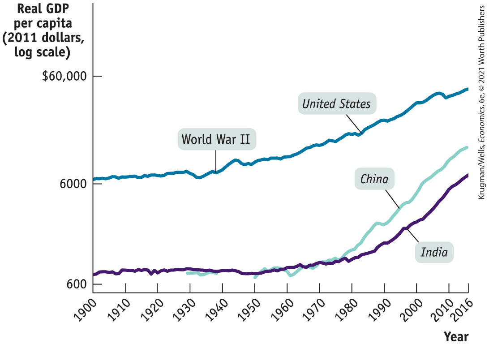
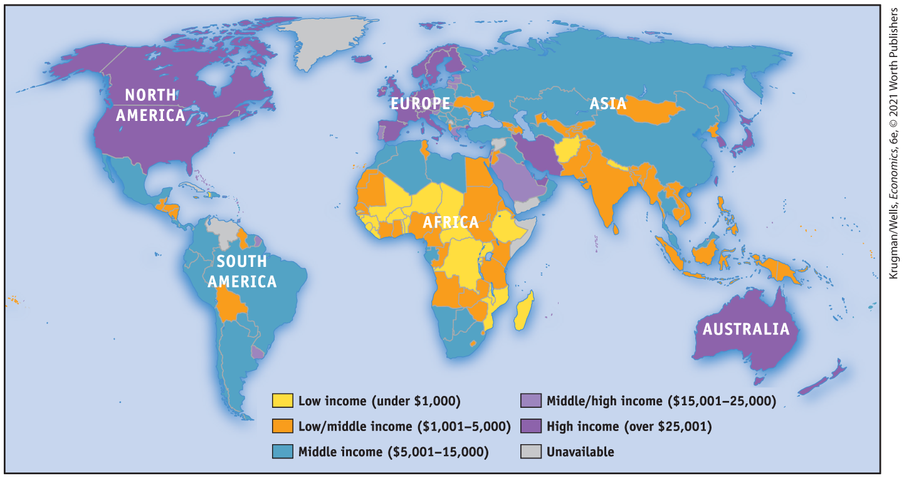
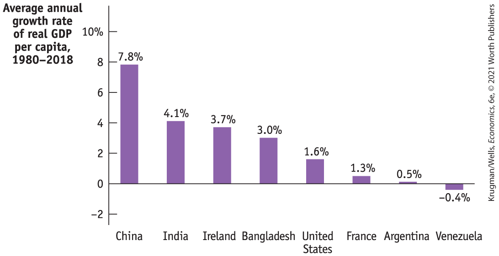

# Chapter 9 Long-Run Economic Growth

## The Smog of Prosperity

<figure id="pau_9781319320164_hvfDSVRQjg" class="figure lm_img_lightbox unnum c2 right">

<figcaption>
<strong>Rapid, uncontrolled economic growth has resulted in much higher living standards in places like Delhi, but at the cost of very high levels of pollution.</strong>
</figcaption>
</figure>

**DELHI, THE CAPITAL OF INDIA,** has terrible air quality — which is a bad thing. But it’s a by-product of a very good thing: the remarkable growth of India’s economy over the past few decades.

Until around 1980, India’s economic story was one of disappointment: living standards weren’t much higher than they had been when the nation won independence in 1947. But after 1980 the economy took off. India is still very poor by U.S. or European standards, but it has a rapidly growing middle class, which can finally afford the things middle-class families tend to want everywhere: bigger houses, household appliances like washing machines and, of course, cars.

As recently as 2001 India had only 53 motor vehicles per 1,000 inhabitants, around a tenth as many as in advanced countries. By 2015, however, that number had more than tripled.

Hence the air quality problem. The streets of Delhi, which has 18 million residents, are now clogged with cars and trucks; the city is also surrounded with factories producing consumer goods and power plants supplying the electricity to run them.

And all these cars, factories, and power plants emit spectacular amounts of pollution. In November 2017, visibility in much of Delhi dropped to a few feet, and health experts said that just being outdoors during the Great Smog of Delhi was the equivalent of smoking 50 cigarettes a day. Nor was this a one-time event. In November 2019 another extended period of severe pollution forced the city to close all its schools.

As we said, however, Delhi’s air quality crisis is a by-product of a very good thing, economic success. And if the experience of other countries is any guide, India will eventually bring its air pollution under control. Beijing, the capital of China, is even bigger than Delhi, with considerably more cars, and it used to have a severe air quality problem, too. But China, which has had even more economic success than India, has begun to put effective pollution controls in place, and this has helped literally clear the air. Meanwhile, China’s living standards have continued to rise.

And despite the pollution, India’s recent history is a hugely impressive example of *long-run economic growth* — a sustained increase in output per capita. True, India is still a relatively poor country; but that’s only because other nations began the process of long-run economic growth many decades ago. In the case of the United States and European countries, long-run economic growth began more than a century and a half ago.

Many economists have argued that long-run economic growth — why it happens and how to achieve it — is the single most important issue in macroeconomics because of its direct effect on living standards.

In this chapter, we present some facts about long-run growth, look at the factors that economists believe determine the pace at which long-run growth takes place, and examine how government policies can help or hinder growth. We will also address questions about the environmental sustainability of long-run growth. 

<aside class="learning-objectives c3 main-flow v3" epub:type="learning-objectives" id="pau_9781319320164_90dWQENvUM">

### What you will learn

- Why is long-run economic growth measured as the increase in real GDP per capita? How has real GDP per capita changed over time in different countries?
- Why is **productivity** the key to long-run economic growth? How is productivity driven by **physical capital, human capital**, and **technological progress?**
- Why do long-run growth rates differ so much among countries?
- How does growth vary among several important regions of the world? Why does the **convergence hypothesis** apply to economically advanced countries?
- How do scarcity of natural resources and environmental degradation pose a challenge to **sustainable long-run economic growth?**

</aside>

## Comparing Economies Across Time and Space

Before we analyze the sources of long-run economic growth, it’s useful to have a sense of just how much the U.S. economy has grown over time and how large the gaps are between wealthy countries like the United States and countries that have yet to achieve comparable growth. So let’s take a look at the numbers.

### Real GDP per Capita

The key statistic used to track economic growth is *real GDP per capita* — real GDP divided by the population size. We focus on GDP because, as we learned in <a href="#kru_9781319245269_ch07_01.xhtml#pau_9781319320164_J4fyDEWkvv" id="kru_9781319245269_ch09_02.xhtml#pau_9781319320164_8WOYduZnR8" class="crossref">Chapter 7</a>, GDP measures the total value of an economy’s production of final goods and services as well as the income earned in that economy in a given year. We use *real* GDP because we want to separate changes in the quantity of goods and services from the effects of a rising price level. We focus on real GDP *per capita* because we want to isolate the effect of changes in the population. For example, other things equal, an increase in the population lowers the standard of living for the average person — there are now more people to share a given amount of real GDP. An increase in real GDP that only matches an increase in population leaves the average standard of living unchanged.

Although we also learned that growth in real GDP per capita should not be a policy goal in and of itself, it does serve as a very useful summary measure of a country’s economic progress over time. <a href="#kru_9781319245269_ch09_02.xhtml#pau_9781319320164_gRfwGuDkw0" id="kru_9781319245269_ch09_02.xhtml#pau_9781319320164_cn6RzUunjZ" class="crossref">Figure 9-1</a> shows real GDP per capita for the United States, India, and China, measured in 2011 dollars, from 1900 to 2016. The vertical axis is drawn on a logarithmic scale so that equal percent changes in real GDP per capita across countries are the same size in the graph.

<figure id="pau_9781319320164_gRfwGuDkw0" class="figure lm_img_lightbox num c3 main-flow">

<figcaption>
FIGURE 9-1 Economic Growth in the United States, India, and China over the Past Century

Real GDP per capita from 1900 to 2016, measured in 2011 dollars, is shown for the United States, India, and China. Equal percent changes in real GDP per capita are drawn the same size. As the steeper slopes of the lines representing China and India show, since 1980 India and China had a much higher growth rate than the United States. The standard of living achieved in the United States in 1900 was attained by China in 2000 and by India in 2016 (approximately for both). Note that the break in China data from 1940 to 1950 is due to war.

<em>Data from:</em> Maddison Project Database, version 2018. Jutta Bolt, Robert Inklaar, Herman de Jong, and Jan Luiten van Zanden (2018), “Rebasing ‘Maddison’: New income comparisons and the shape of long-run economic development,” Maddison Project Working Paper 10.
</figcaption>
</figure>

<aside class="hidden" id="pau_9781319320164_OzIccpAQMv" title="hidden">

The graph plots Real G D P per capita versus year. The vertical axis labeled Real G D P per capita (2011 dollars, log scale) is truncated and shows markings at 600, 6000, and 60,000 dollars from bottom to top. The horizontal axis labeled years is truncated and ranges from 1900 to 2010, with an additional marking at 2016. The graph shows three curves labeled United States, China, and India. The curve representing United States Real G D P increases from (1900, 6500) to (2016, 50,000), passing through (1950, 7000) and (1990, 35000). The curve representing China’s Real G D P increases from (1930, 1000) to (2016, 10,000), passing through (1950, 1000) and (1990, 3000). The curve representing India’s Real G D P increases from (1900, 900) to (2016, 6000), passing through (1950, 1000) and (1990, 2000). A point corresponding to year 1939 on the curve for U S is labeled World War 2 in U S. All values are approximated.

</aside>

To give a sense of how much the U.S. economy grew during the last century, <a href="#kru_9781319245269_ch09_02.xhtml#pau_9781319320164_t0D1FrYFPk" id="kru_9781319245269_ch09_02.xhtml#pau_9781319320164_ubWwEErZzc" class="crossref">Table 9-1</a> shows real GDP per capita at selected years, expressed two ways: as a percentage of the 1900 level and as a percentage of the 2016 level. In 1920, the U.S. economy already produced 136% as much per person as it did in 1900. In 2016, it produced 848% as much per person as it did in 1900, more than an eightfold increase. Alternatively, in 1900 the U.S. economy produced only 12% as much per person as it did in 2016.

| Year                                                                                                                                                                                                                                                                 | Percentage of 1900 real GDP per capita | Percentage of 2016 real GDP per capita |
|----------------------------------------------------------------------------------------------------------------------------------------------------------------------------------------------------------------------------------------------------------------------|----------------------------------------|----------------------------------------|
| 1900                                                                                                                                                                                                                                                                 |    100%                                |    12%                                 |
| 1920                                                                                                                                                                                                                                                                 | 136                                    | 16                                     |
| 1940                                                                                                                                                                                                                                                                 | 181                                    | 21                                     |
| 1980                                                                                                                                                                                                                                                                 | 474                                    | 56                                     |
| 2000                                                                                                                                                                                                                                                                 | 734                                    | 87                                     |
| 2016                                                                                                                                                                                                                                                                 | 848                                    | 100                                    |
| *Data from:* Maddison Project Database, version 2018. Jutta Bolt, Robert Inklaar, Herman de Jong, and Jan Luiten van Zanden (2018), “Rebasing ‘Maddison’: New income comparisons and the shape of long-run economic development,” Maddison Project Working Paper 10. |                                        |                                        |

TABLE 9-1 U.S. Real GDP per Capita

The income of the typical family normally grows more or less in proportion to per capita income. For example, a 1% increase in real GDP per capita corresponds, roughly, to a 1% increase in the income of the median or typical family — a family at the center of the income distribution. In 2016, the median American household had an income of about \$57,500. Since <a href="#kru_9781319245269_ch09_02.xhtml#pau_9781319320164_t0D1FrYFPk" id="kru_9781319245269_ch09_02.xhtml#pau_9781319320164_dHdrAvuUXu" class="crossref">Table 9-1</a> tells us that real GDP per capita in 1900 was only 12% of its 2016 level, a typical family in 1900 probably had a purchasing power only 12% as large as the purchasing power of a typical family in 2016. That’s around \$6,250 in 2016 dollars, representing a standard of living that we would now consider severe poverty. Today’s typical American family, if transported back to the United States of 1900, would feel quite a lot of deprivation.

Many people in the world have a standard of living equal to or lower than that of the average American of many generations ago. That’s the message about China and India in <a href="#kru_9781319245269_ch09_02.xhtml#pau_9781319320164_gRfwGuDkw0" id="kru_9781319245269_ch09_02.xhtml#pau_9781319320164_i7POQ2osdp" class="crossref">Figure 9-1</a>: despite dramatic economic growth in China over the last four decades and the more recent acceleration of economic growth in India, China’s per capita GDP is only about as high as America’s was in 1930, while India is roughly at our level in 1900.

You can get a sense of how poor much of the world remains by looking at <a href="#kru_9781319245269_ch09_02.xhtml#pau_9781319320164_ACKMsGsZa7" id="kru_9781319245269_ch09_02.xhtml#pau_9781319320164_OSlber00mk" class="crossref">Figure 9-2</a>, a map of the world in which countries are classified according to their 2018 levels of GDP per capita, in U.S. dollars. As you can see, in large parts of the world, people have very low incomes. Generally speaking, the countries of Europe and North America, as well as a few in the Pacific, have high incomes. Many Asian countries, including China and India, have experienced rapid economic growth, moving them into the middle-income categories. Africa, however, is dominated by countries with GDP less than \$5,000 per capita. In fact, about 25% of the world’s people live in countries with a lower standard of living than the United States had a century ago.

<figure id="pau_9781319320164_ACKMsGsZa7" class="figure lm_img_lightbox num c4 main-flow">

<figcaption>
FIGURE 9-2 Incomes Around the World, 2018

Although the countries of Europe and North America — along with a few in the Pacific — have high incomes, much of the world is still very poor. Today, about a quarter of the world’s population lives in countries with a lower standard of living than the United States had a century ago.

<em>Data from:</em> World Development Indicators, World Bank.
</figcaption>
</figure>

<aside class="hidden" id="pau_9781319320164_XZNXdlCgWK" title="hidden">

The data from the map are as follows, Low income countries (under 1000 dollars): Afghanistan, Nepal, and most of the African countries; Low/middle income countries (1001 dollars to 5000 dollars): Some of the African countries, South Asian, and South-east Asian countries. Middle income countries (5001 dollars to 15000 dollars): South-American countries, Mexico, North Asia, and East Asian countries. Middle/high income countries (15001 dollars to 25000 dollars): Middle East countries. High income countries (over 25001 dollars): North America, Western Europe, and Pacific.

</aside>

### Growth Rates

How did the United States manage to produce over eight times as much real GDP per person in 2016 than in 1900? A little bit at a time. Long-run economic growth is normally a gradual process in which real GDP per capita grows at most a few percent per year. From 1900 to 2016, real GDP per capita in the United States increased an average of 1.9% each year.

To have a sense of the relationship between the annual growth rate of real GDP per capita and the long-run change in real GDP per capita, it’s helpful to keep in mind the <a href="#kru_9781319245269_EM_glossary.xhtml#pau_9781319320164_CWQj9PshIZ" id="kru_9781319245269_ch09_02.xhtml#pau_9781319320164_5yf2JNUKg4" class="glossref" role="doc-glossref">Rule of 70</a>, a mathematical formula that tells us how long it takes real GDP per capita, or any other variable that grows gradually over time, to double. The approximate answer is:

$$\text{Number}\,\text{of}\,\text{years}\,\text{for}\,\text{variable}\,\text{to}\,\text{double} = \frac{70}{\text{Annual}\,\text{growth}\,\text{rate}\,\text{of}\,\text{variable}}$$

**(9-1)**

<aside aria-label="title" class="glossary c3 main-flow v1" epub:type="glossary" id="pau_9781319320164_qH2xyRY6ZS">

**Rule of 70**  
According to the **Rule of 70**, the time it takes a variable that grows gradually over time to double is approximately 70 divided by that variable’s annual growth rate.

</aside>

(Note that the Rule of 70 can only be applied to a positive growth rate.) So, if real GDP per capita grows at 1% per year, it will take 70 years to double. If it grows at 2% per year, it will take only 35 years to double. In fact, U.S. real GDP per capita rose, on average, 1.9% per year over the last century.

Applying the Rule of 70 to this information implies that it should have taken 37 years for real GDP per capita to double; it would have taken 111 years — three periods of 37 years each — for U.S. real GDP per capita to double three times. That is, the Rule of 70 implies that over the course of 111 years, U.S. real GDP per capita should have increased by a factor of $2 \times 2 \times 2 = 8$. And this does turn out to be a pretty good approximation of reality. Between 1900 and 2016 — a period of 116 years — real GDP per capita rose just over eightfold.

<a href="#kru_9781319245269_ch09_02.xhtml#pau_9781319320164_71eM11nTf1" id="kru_9781319245269_ch09_02.xhtml#pau_9781319320164_rRu2WqllDT" class="crossref">Figure 9-3</a> shows the average annual rate of growth of real GDP per capita for selected countries from 1980 to 2018. Some countries were notable success stories: for example, China, though still quite poor, has made spectacular progress. India, although not matching China’s performance, has also achieved impressive growth. The same is true for Bangladesh, as discussed in the following Economics in Action.

<figure id="pau_9781319320164_71eM11nTf1" class="figure lm_img_lightbox num c3 main-flow">

<figcaption>
FIGURE 9-3 Comparing Recent Growth Rates

The average annual rate of growth of real GDP per capita from 1980 to 2018 is shown here for selected countries. China and, to a lesser extent, India and Ireland achieved impressive growth. The United States and France had moderate growth. Once considered an economically advanced country, Argentina had more sluggish growth. Still others, such as Venezuela, slid backward.

<em>Data from:</em> World Development Indicators.
</figcaption>
</figure>

<aside class="hidden" id="pau_9781319320164_6L9r3maxfS" title="hidden">

The vertical axis labeled Average annual growth rate of real G D P per capita, 1980 to 2018 ranges from negative 2 to 10 percent in increments of 2 percent from bottom to top. The horizontal axis plots the following countries from left to right, China, India, Ireland, Bangladesh, United States, France, Argentina, and Venezuela. The data from the graph are as follows, China, 7.8 percent; India, 4.1 percent; Ireland, 3.7 percent; Bangladesh, 3 percent; United States, 1.6 percent, France, 1.3 percent; Argentina, 0.5 percent, and Venezuela, negative 0.4 percent.

</aside>

Some countries, though, have had very disappointing growth. Argentina was once considered a wealthy nation. In the early years of the twentieth century, it was in the same league as the United States and Canada. But since then it has lagged far behind more dynamic economies. And still others, like Venezuela, have slid backward.

What explains these differences in growth rates? To answer that question, we need to examine the sources of long-run economic growth, which we turn to next.

<aside class="case-study c3 main-flow v5" epub:type="case-study" id="pau_9781319320164_vECC6ScX63" title="Pitfalls">

#### *Pitfalls*

CHANGE IN LEVEL VERSUS RATE OF CHANGE

When studying economic growth, it’s important to understand the difference between a *change in level* and a *rate of change.* When we say that real GDP “grew,” economists mean that the *level* of real GDP increased at a certain point in time. For example, we might say that U.S. real GDP grew during 2019 by \$435 billion.

But statements about economic growth over a period of years almost always refer to changes in the growth rate. For example, if we knew the level of U.S. real GDP in 2018, we could also represent the amount of 2019 growth in terms of a rate of change. For example, if U.S. real GDP in 2018 had been \$18,638 billion, then U.S. real GDP in 2019 would have been $\text{\$}18,638\,{billion} + \text{\$}435\,{billion} = \text{\$}19,073\,{billion}$. We could calculate the rate of change, or the growth rate, of U.S. real GDP during 2019 as: $((\text{\$}19,073\,{billion} - \text{\$}18,638\,{billion})\,/\,\text{\$}18,638\,{billion}) \times 100$ $= (\text{\$}435\,{billion}\,/\,\text{\$}18,638\,{billion}) \times 100 = 2.3\%.$ So when we say that “U.S. growth fell during the 1970s,” we mean that the U.S. growth rate of real GDP was lower in the 1970s compared to the 1960s. When we say that “growth accelerated during the early 1990s,” we mean that the growth rate increased year after year in the early 1990s — for example, going from 3% to 3.5% to 4%.

</aside>

### ECONOMICS \>\> *in Action*

An Economic Breakthrough in Bangladesh

<figure id="pau_9781319320164_afdieDfmnv" class="figure lm_img_lightbox unnum c2 right">

<figcaption>
Although Bangladesh remains a very poor country, a high growth rate has improved living standards over the last 25 years.
</figcaption>
</figure>

Western news media rarely mention Bangladesh: it’s not a political hot spot, it doesn’t have oil, and it’s overshadowed by its immense neighbor, India. Yet it is home to more than 160 million people — and although it is still very poor, it is nonetheless one of the greatest economic success stories of the past generation.

As recently as the 1980s, real GDP per capita in Bangladesh — which achieved independence from Pakistan in 1971, after a brutal war — was barely higher than it had been in 1950, when the country was so poor that it literally lived on the edge of starvation. In the early 1990s, however, the nation began a process of political and economic reform, making the transition from military rule to democracy, freeing up markets, and achieving monetary and fiscal stability. And growth took off, most notably with the rise of Bangladesh as a major exporter of clothing to Western markets. Real GDP per capita tripled over the period from 1990 to 2019. Other measures also showed dramatic improvements in the quality of life: life expectancy rose by a dozen years, child mortality fell by 70%, and school enrollment rose sharply, especially for girls.

Make no mistake, Bangladesh is still incredibly poor by American standards. Wages are very low although rising, while working conditions are often terrible and dangerous — a point highlighted in 2013, when a factory complex collapsed, killing more than a thousand workers. But compared with its own past, Bangladesh has achieved a lot of progress — and demonstrated that economic growth brings real human benefits, too.

### *\>\> Quick Review*

- Economic growth is measured using real GDP per capita.
- In the United States, real GDP per capita increased eightfold since 1900, resulting in a large increase in living standards.
- Many countries have real GDP per capita much lower than that of the United States. About 25% of the world’s population has living standards worse than those existing in the United States in the early 1900s.
- The long-term rise in real GDP per capita is the result of gradual growth. The **Rule of 70** tells us how many years at a given annual rate of growth it takes to double real GDP per capita.
- Growth rates of real GDP per capita differ substantially among nations.

### *\>\> Check Your Understanding* 9-1

1.  Why do economists use real GDP per capita to measure economic progress rather than some other measure, such as nominal GDP per capita or real GDP?
2.  Apply the Rule of 70 to the data in <a href="#kru_9781319245269_ch09_02.xhtml#pau_9781319320164_71eM11nTf1" id="kru_9781319245269_ch09_02.xhtml#pau_9781319320164_zSeun8ZIn2" class="crossref">Figure 9-3</a> to determine how many years it will take each of the countries listed there (except Venezuela) to double its real GDP per capita. Would India’s real GDP per capita exceed that of the United States in the future if growth rates remain as shown in <a href="#kru_9781319245269_ch09_02.xhtml#pau_9781319320164_71eM11nTf1" id="kru_9781319245269_ch09_02.xhtml#pau_9781319320164_vIOOXvaA4R" class="crossref">Figure 9-3</a>? Why or why not?
3.  Although China and India currently have growth rates much higher than the U.S. growth rate, the typical Chinese or Indian household is far poorer than the typical American household. Explain why.

## The Sources of Long-Run Growth

One of our fundamental principles of economics is that *increases in economic potential lead to economic growth over time.* More specifically, long-run economic growth depends almost entirely on one ingredient: rising *productivity.* However, a number of factors affect the growth of productivity. Let’s look first at why productivity is the key ingredient and then examine what affects it.

### The Crucial Importance of Productivity

*Sustained economic growth occurs only when the amount of output produced by the average worker increases steadily.* The term <a href="#kru_9781319245269_EM_glossary.xhtml#pau_9781319320164_cgMMW8nLHe" id="kru_9781319245269_ch09_03.xhtml#pau_9781319320164_RSVfJMbi7j" class="glossref" role="doc-glossref">labor productivity</a>, or <a href="#kru_9781319245269_EM_glossary.xhtml#pau_9781319320164_fkBmoJJLmW" id="kru_9781319245269_ch09_03.xhtml#pau_9781319320164_PQNSfzcXqA" class="glossref" role="doc-glossref">productivity</a> for short, is used to refer either to output per worker or, in some cases, to output per hour. (The number of hours worked by an average worker differs to some extent across countries, although this isn’t an important factor in the difference between living standards in, say, India and the United States.) For the economy as a whole, productivity — output per worker — is simply real GDP divided by the number of people working.

<aside aria-label="title 1" class="glossary c3 main-flow v1" epub:type="glossary" id="pau_9781319320164_DtBRQJRD4l">

**labor productivity**  
**Labor productivity**, often referred to simply as **productivity**, is output per worker.

</aside>

You might wonder why we say that higher productivity is the only source of long-run growth. Can’t an economy also increase its real GDP per capita by putting more of the population to work? The answer is, yes, but …

For short periods of time, an economy can experience a burst of growth in output per capita by putting a higher percentage of the population to work. That happened in the United States during World War II, when millions of women who previously worked only in the home entered the paid workforce. The percentage of adult civilians employed outside the home rose from 50% in 1941 to 58% in 1944, and you can see the resulting bump in real GDP per capita during those years in <a href="#kru_9781319245269_ch09_02.xhtml#pau_9781319320164_gRfwGuDkw0" id="kru_9781319245269_ch09_03.xhtml#pau_9781319320164_RRsr9ki6N3" class="crossref">Figure 9-1</a>.

Over the longer run, however, the rate of employment growth is never very different from the rate of population growth. Over the course of the twentieth century, for example, the population of the United States rose at an average rate of 1.3% per year and employment rose 1.5% per year. Real GDP per capita rose 1.9% per year; of that, 1.7% — that is, almost 90% of the total — was the result of rising productivity. In general, overall real GDP can grow because of population growth, but any large increase in real GDP *per capita* must be the result of increased output *per worker.* That is, it must be due to higher productivity.

So increased productivity is the key to long-run economic growth. But what leads to higher productivity?

### Explaining Growth in Productivity

There are three main reasons why the average U.S. worker today produces far more than their counterpart a century ago. First, the modern worker has far more *physical capital,* such as machinery and office space, to work with. Second, the modern worker is much better educated and so possesses much more *human capital.* Finally, modern firms have the advantage of a century’s *technological progress.*

Let’s look at each of these three sources of productivity growth.

#### Increases in Physical Capital

Economists define <a href="#kru_9781319245269_EM_glossary.xhtml#pau_9781319320164_suUW2aEfMK" id="kru_9781319245269_ch09_03.xhtml#pau_9781319320164_znzFeRZP7r" class="glossref" role="doc-glossref">physical capital</a> as manufactured resources such as buildings and machines. Physical capital makes workers more productive. For example, a worker operating a backhoe can dig a lot more feet of trench per day than one equipped only with a shovel.

<aside aria-label="title 2" class="glossary c3 main-flow v1" epub:type="glossary" id="pau_9781319320164_r0C1s1WZXQ">

**physical capital**  
**Physical capital** consists of human-made resources such as buildings and machines.

</aside>

The average U.S. private-sector worker today is backed up by nearly \$400,000 worth of physical capital — far more than a U.S. worker had 100 years ago and far more than the average worker in most other countries has today.

#### Increase in Human Capital

It’s not enough for a worker to have good equipment — they must also know what to do with it. <a href="#kru_9781319245269_EM_glossary.xhtml#pau_9781319320164_LkDFScKEig" id="kru_9781319245269_ch09_03.xhtml#pau_9781319320164_OTpXXZtxW0" class="glossref" role="doc-glossref">Human capital</a> refers to the improvement in labor created by the education and knowledge embodied in the workforce.

<aside aria-label="title 3" class="glossary c3 main-flow v1" epub:type="glossary" id="pau_9781319320164_LdLQr0dWjG">

**human capital**  
**Human capital** is the improvement in labor created by the education and knowledge embodied in the workforce.

</aside>

The human capital of the United States has increased dramatically over the past century. A century ago, although most Americans were able to read and write, very few had an extensive education. In 1910, only 13.5% of Americans over 25 had graduated from high school and only 3% had four-year college degrees. By 2018, the percentages were 90% and 35%, respectively. It would be impossible to run today’s economy with a population as poorly educated as the American populace a century ago.

Analyses based on *growth accounting,* described later in this chapter, suggest that education — and its effect on productivity — is an even more important determinant of growth than increases in physical capital.

#### Technological Progress

Probably the most important driver of productivity growth is <a href="#kru_9781319245269_EM_glossary.xhtml#pau_9781319320164_QMl2VAQ5zG" id="kru_9781319245269_ch09_03.xhtml#pau_9781319320164_8Sn9GRgzIw" class="glossref" role="doc-glossref">technological progress</a>, which is broadly defined as an advance in the technical means of the production of goods and services. We’ll see shortly how economists measure the impact of technology on growth. Workers today are able to produce more than those in the past, even with the same amount of physical and human capital, because technology has advanced over time. It’s important to realize that economically important technological progress need not be flashy or rely on cutting-edge science.

<aside aria-label="title 4" class="glossary c3 main-flow v1" epub:type="glossary" id="pau_9781319320164_02i8fTJrDV">

**technological progress**  
**Technological progress** is an advance in the technical means of the production of goods and services.

</aside>

Historians have noted that past economic growth has been driven not only by major inventions, such as the railroad or the semiconductor chip, but also by thousands of modest innovations, such as the precut cardboard boxes used to deliver practically everything we order online, which were invented in 1890, and the Post-it® note, introduced in 1980, which has had surprisingly large benefits for office productivity.

Experts attribute much of a productivity surge that took place in the United States from about 1995 to 2005 to new technology adopted by service-producing companies like Walmart rather than to high-technology companies.
