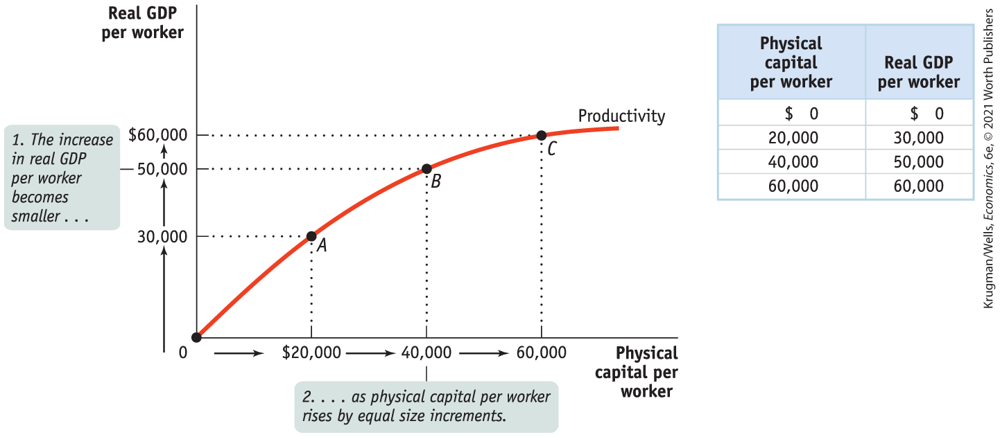
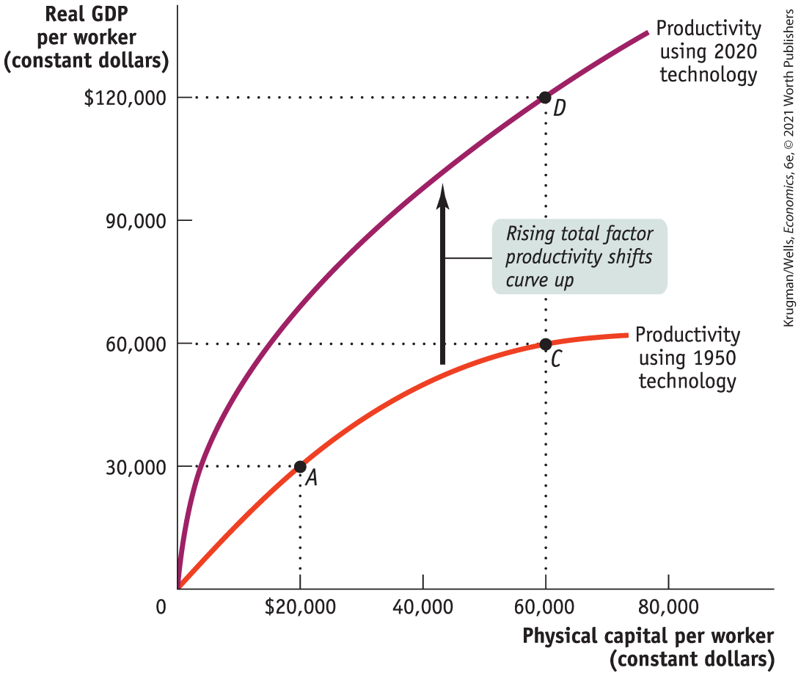
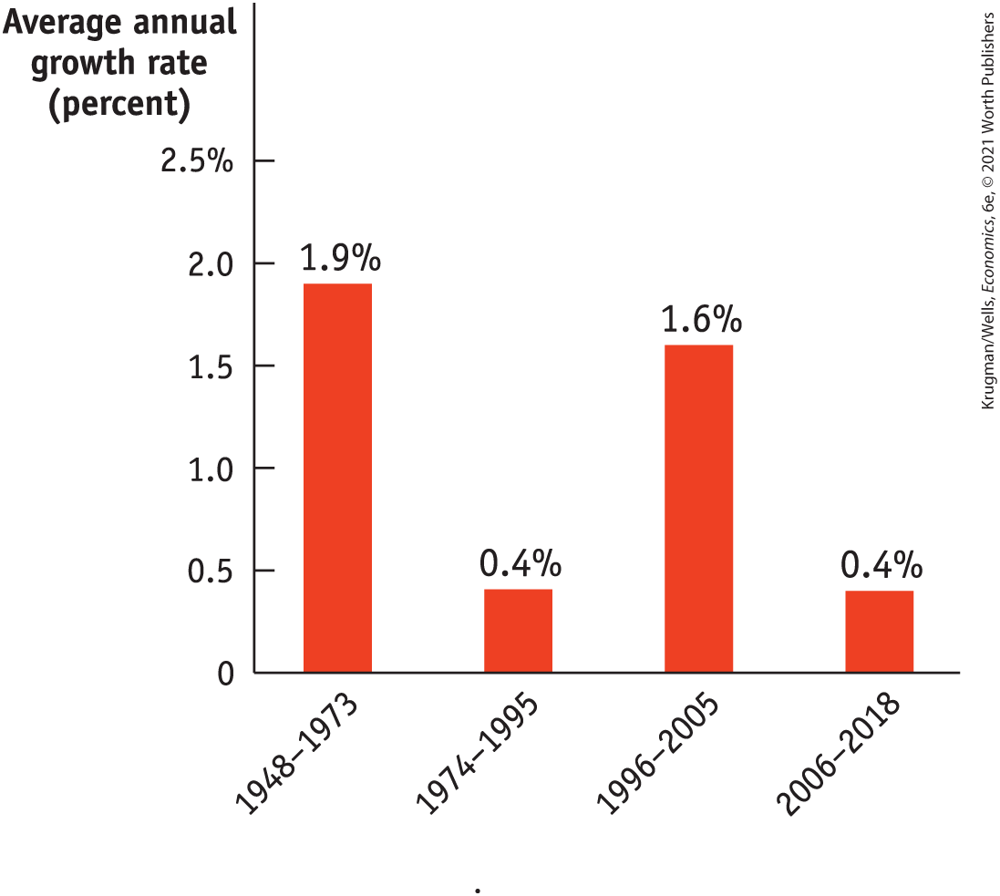
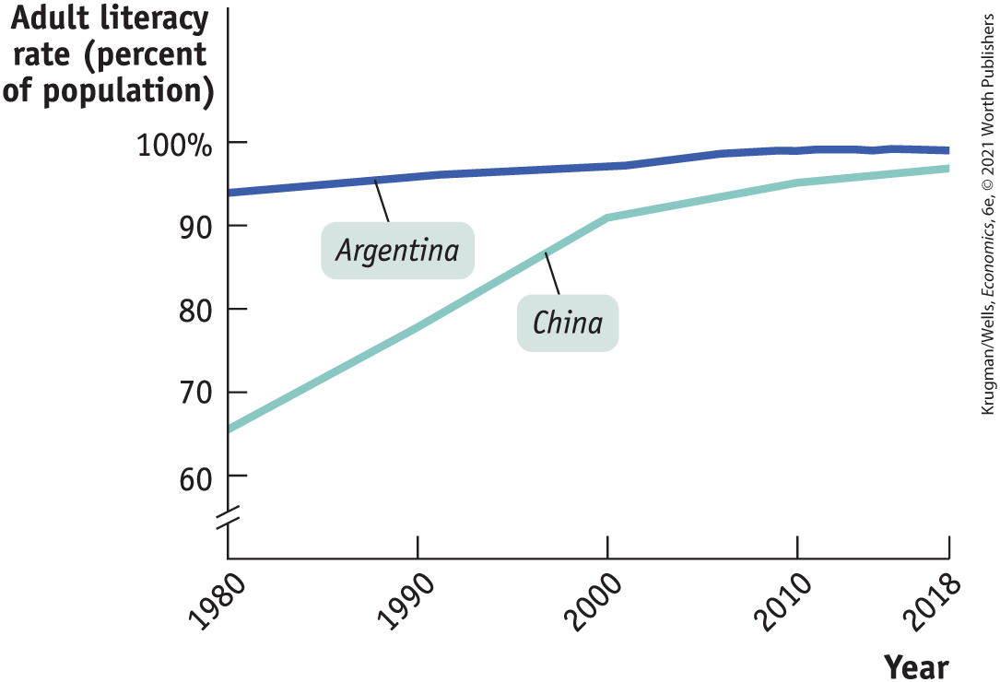

### Accounting for Growth: The Aggregate Production Function

Productivity is higher, other things equal, when workers are equipped with more physical capital, more human capital, better technology, or any combination of the three. But can we put numbers to these effects? To do this, economists make use of estimates of the <a href="#kru_9781319245269_EM_glossary.xhtml#pau_9781319320164_KrifPxfXgF" id="kru_9781319245269_ch09_03.xhtml#pau_9781319320164_nItWOf59IY" class="glossref" role="doc-glossref">aggregate production function</a>, which shows how productivity depends on the quantities of physical capital per worker and human capital per worker as well as the state of technology.

<aside aria-label="title 5" class="glossary c3 main-flow v1" epub:type="glossary" id="pau_9781319320164_htlfZMlq38">

**aggregate production function**  
The **aggregate production function** is a hypothetical function that shows how productivity (real GDP per worker) depends on the quantities of physical capital per worker and human capital per worker as well as the state of technology.

</aside>

In general, all three factors tend to rise over time, as workers are equipped with more machinery, receive more education, and benefit from technological advances. What the aggregate production function does is allow economists to disentangle the effects of these three factors on overall productivity.

An example of an aggregate production function applied to real data comes from a 2015 study by Keting Shen, Jing Wang, and John Whalley comparing growth in the United States, India, and China from 1979 (when China began a major shift toward becoming a market economy) to 2008. One of their production functions took the form:

$$\text{GDP}\,\text{per}\,\text{worker} = T \times {(\text{Physical}\,\text{capital}\,\text{per}\,\text{worker})}^{1/3} \times \,{(\text{Human}\,\text{capital}\,\text{per}\,\text{worker})}^{2/3}$$

where *T* represented an estimate of the level of technology, and they related human capital to years of education. Over this period, China moved well up the scale, from GDP per capita only 5% that of the United States to 17% that of the United States (a number that had risen to around 25% by 2018). Most of this relative growth, they found, was due to an increase in China’s relative *T,* from around 10% that of the United States to 25% that of the United States.

In analyzing historical economic growth, economists have discovered a crucial fact about the estimated aggregate production function: it exhibits <a href="#kru_9781319245269_EM_glossary.xhtml#pau_9781319320164_aiMbg7to5q" id="kru_9781319245269_ch09_03.xhtml#pau_9781319320164_EHLyhY6c2P" class="glossref" role="doc-glossref">diminishing returns to physical capital</a>. That is, when the amount of human capital per worker and the state of technology are held fixed, each successive increase in the amount of physical capital per worker leads to a smaller increase in productivity.

<aside aria-label="title 6" class="glossary c3 main-flow v1" epub:type="glossary" id="pau_9781319320164_aKYtHeTmwM">

**diminishing returns to physical capital**  
An aggregate production function exhibits **diminishing returns to physical capital** when, holding the amount of human capital per worker and the state of technology fixed, each successive increase in the amount of physical capital per worker leads to a smaller increase in productivity.

</aside>

<a href="#kru_9781319245269_ch09_03.xhtml#pau_9781319320164_DUFuLj1Zdu" id="kru_9781319245269_ch09_03.xhtml#pau_9781319320164_xvDBm62oSl" class="crossref">Figure 9-4</a> and the table to its right give a hypothetical example of how the level of physical capital per worker might affect the level of real GDP per worker, holding human capital per worker and the state of technology fixed. In this example, we measure the quantity of physical capital in dollars.

<figure id="pau_9781319320164_DUFuLj1Zdu" class="figure lm_img_lightbox num c4 main-flow">

<figcaption>
FIGURE 9-4 Physical Capital and Productivity

The aggregate production function shows how, in this case, holding human capital per worker and technology fixed, productivity increases as physical capital per worker rises. Other things equal, a greater quantity of physical capital per worker leads to higher real GDP per worker but is subject to diminishing returns: each successive addition to physical capital per worker produces a smaller increase in productivity. Starting at the origin, 0, a $20,000 increase in physical capital per worker leads to an increase in real GDP per worker of $30,000, indicated by point <em>A.</em> Starting from point <em>A,</em> another $20,000 increase in physical capital per worker leads to an increase in real GDP per worker but only of $20,000, indicated by point <em>B.</em> Finally, a third $20,000 increase in physical capital per worker leads to only a $10,000 increase in real GDP per worker, indicated by point <em>C.</em>
</figcaption>
</figure>

<aside class="hidden" id="pau_9781319320164_NE644i6F3r" title="hidden">

The graph plots real G D P per worker versus physical capital per worker. The vertical axis labeled Real G D P per worker shows markings at 0, 30,000, 50,000, and 60,000 dollars. The horizontal axis labeled Physical capital per worker ranges from 0 to 60,000 dollars, in increments of 20,000 dollars. The productivity curve is a concave down increasing curve that starts at (0, 0) and passes through A (20,000, 30,000), B (40,000, 50,000), and C (60,000, 60,000). A textbox corresponding to 50,000 on the vertical axis is labeled “1. The increase in real G D P per worker becomes smaller ellipsis.” A textbox corresponding to 40,000 on the horizontal axis is labeled “2 ellipsis as physical capital per worker rises by equal size increments.” The table beside the graph has two columns and four rows. The column headings are Physical capital per worker and Real G D P per worker. The data from the table are as follows, Physical capital per worker, 0 dollars; Real G D P per worker, 0 dollars; Physical capital per worker, 20,000; Real G D P per worker, 30,000; Physical capital per worker, 40,000; Real G D P per worker, 50,000; Physical capital per worker, 60,000; Real G D P per worker, 60,000.

</aside>

To see why the relationship between physical capital per worker and productivity exhibits diminishing returns, think about how the availability of farm equipment affects the productivity of farmworkers. A little bit of equipment makes a big difference: a worker equipped with a tractor can do much more than a worker without one. And a worker using more expensive equipment will, other things equal, be more productive: a worker with a \$40,000 tractor will normally be able to cultivate more farmland in a given amount of time than a worker with a \$20,000 tractor because the more expensive machine will be more powerful, perform more tasks, or both.

But will a worker with a \$40,000 tractor, holding human capital and technology constant, be twice as productive as a worker with a \$20,000 tractor? Probably not: there’s a huge difference between not having a tractor at all and having even an inexpensive tractor; there’s much less difference between having an inexpensive tractor and having a better tractor. And we can be sure that a worker with a \$200,000 tractor won’t be 10 times as productive: a tractor can be improved only so much. Because the same is true of other kinds of equipment, the aggregate production function shows diminishing returns to physical capital.

Diminishing returns to physical capital imply a relationship between physical capital per worker and output per worker like the one shown in <a href="#kru_9781319245269_ch09_03.xhtml#pau_9781319320164_DUFuLj1Zdu" id="kru_9781319245269_ch09_03.xhtml#pau_9781319320164_tqODgxhyfv" class="crossref">Figure 9-4</a>. As the productivity curve for physical capital and the accompanying table illustrate, more physical capital per worker leads to more output per worker. But each \$20,000 increment in physical capital per worker adds less to productivity.

As you can see from the table, there is a big payoff for the first \$20,000 of physical capital: real GDP per worker rises by \$30,000. The second \$20,000 of physical capital also raises productivity, but not by as much: real GDP per worker goes up by only \$20,000. The third \$20,000 of physical capital raises real GDP per worker by only \$10,000. By comparing points along the curve you can also see that as physical capital per worker rises, output per worker also rises — but at a diminishing rate.

Going from the origin at 0 to point *A,* a \$20,000 increase in physical capital per worker, leads to an increase of \$30,000 in real GDP per worker. Going from point *A* to point *B,* a second \$20,000 increase in physical capital per worker, leads to an increase of only \$20,000 in real GDP per worker. And from point *B* to point *C,* a \$20,000 increase in physical capital per worker, increased real GDP per worker by only \$10,000.

It’s important to realize that diminishing returns to physical capital is an “other things equal” phenomenon: additional amounts of physical capital are less productive *when the amount of human capital per worker and the technology are held fixed.* Diminishing returns may disappear if we increase the amount of human capital per worker, or improve the technology, or both at the same time the amount of physical capital per worker is increased.

For example, a worker with a \$40,000 tractor who has also been trained in the most advanced cultivation techniques may in fact be more than twice as productive as a worker with only a \$20,000 tractor and no additional human capital.

But diminishing returns to any one input — regardless of whether it is physical capital, human capital, or number of workers — is a pervasive characteristic of production. Typical estimates suggest that in practice a 1% increase in the quantity of physical capital per worker increases output per worker by only one-third of 1%, or 0.33%.

In practice, all the factors contributing to higher productivity rise during the course of economic growth: both physical capital and human capital per worker increase, and technology advances as well. To disentangle the effects of these factors, economists use <a href="#kru_9781319245269_EM_glossary.xhtml#pau_9781319320164_6agOLW6CIg" id="kru_9781319245269_ch09_03.xhtml#pau_9781319320164_7frbFau0Zu" class="glossref" role="doc-glossref">growth accounting</a>, which estimates the contribution of each major factor in the aggregate production function to economic growth. For example, suppose the following are true:

<aside aria-label="title 7" class="glossary c3 main-flow v1" epub:type="glossary" id="pau_9781319320164_bQRCfcpnic">

**growth accounting**  
**Growth accounting** estimates the contribution of each major factor in the aggregate production function to economic growth.

</aside>

- The amount of physical capital per worker grows 3% per year.
- According to estimates of the aggregate production function, each 1% rise in physical capital per worker, holding human capital and technology constant, raises output per worker by one-third of 1%, or 0.33%.

<aside class="case-study c3 main-flow v5" epub:type="case-study" id="pau_9781319320164_Wlrhrh7VCa" title="Pitfalls">

#### *Pitfalls*

IT MAY BE DIMINISHED … BUT IT’S STILL POSITIVE!

As we’ve seen, the term *diminishing returns to physical capital* means that when holding the amount of human capital per worker and the technology fixed, each successive increase in the amount of physical capital per worker results in a smaller increase in real GDP per worker.

But avoid falling into a common trap. The term does not mean that real GDP per worker will eventually fall as more and more physical capital is added. What happens instead is that the increase in real GDP per worker will get smaller and smaller, while remaining at or above zero. So an increase in physical capital per worker never reduces productivity.

But due to diminishing returns, at some point, increasing the amount of physical capital per worker will no longer produce an economic payoff. At this point, the increase in output will be so small that it’s not worth the cost of the additional physical capital.

</aside>

In that case, we would estimate that growing physical capital per worker is responsible for $3\% \times 0.33 = 1$ percentage point of productivity growth per year. A similar but more complex procedure is used to estimate the effects of growing human capital. The procedure is more complex because there aren’t simple dollar measures of the quantity of human capital.

Growth accounting allows us to calculate the effects of greater physical and human capital on economic growth. But how can we estimate the effects of technological progress? We do so by estimating what is left over after the effects of physical and human capital have been taken into account. For example, let’s imagine that there was no increase in human capital per worker so that we can focus on changes in physical capital and in technology.

In <a href="#kru_9781319245269_ch09_03.xhtml#pau_9781319320164_WnLih68Uik" id="kru_9781319245269_ch09_03.xhtml#pau_9781319320164_BarsX4pMbr" class="crossref">Figure 9-5</a>, the lower curve shows the same hypothetical relationship between physical capital per worker and output per worker shown in <a href="#kru_9781319245269_ch09_03.xhtml#pau_9781319320164_DUFuLj1Zdu" id="kru_9781319245269_ch09_03.xhtml#pau_9781319320164_KuurRnbRVU" class="crossref">Figure 9-4</a>. Let’s assume that this was the relationship given the technology available in 1950. The upper curve also shows a relationship between physical capital per worker and productivity, but this time given the technology available in 2020. (We’ve chosen a 70-year stretch to allow us to use the Rule of 70.) The 2020 curve is shifted up compared to the 1950 curve because technologies developed over the previous 70 years make it possible to produce more output for a given amount of physical capital per worker than was possible with the technology available in 1950. (Note that the two curves are measured in constant dollars.)

<figure id="pau_9781319320164_WnLih68Uik" class="figure lm_img_lightbox num c3 main-flow">

<figcaption>
FIGURE 9-5 Technological Progress and Productivity Growth

Technological progress raises productivity at any given level of physical capital per worker, and therefore shifts the aggregate production function upward. Here we hold human capital per worker fixed. We assume that the lower curve (the same curve as in <a href="#kru_9781319245269_ch09_03.xhtml#pau_9781319320164_DUFuLj1Zdu" id="kru_9781319245269_ch09_03.xhtml#pau_9781319320164_u5YzBBzPWU" class="crossref">Figure 9-4</a>) reflects technology in 1950 and the upper curve reflects technology in 2020. Holding technology and human capital fixed, tripling physical capital per worker from $20,000 to $60,000 leads to a doubling of real GDP per worker, from $30,000 to $60,000. This is shown by the movement from point <em>A</em> to point <em>C,</em> reflecting an approximately 1% per year rise in real GDP per worker. In reality, technological progress raised productivity at any given level of physical capital — shown here by the upward shift of the curve — and the actual rise in real GDP per worker is shown by the movement from point <em>A</em> to point <em>D.</em> Real GDP per worker grew 2% per year, leading to a quadrupling during the period. The extra 1% in growth of real GDP per worker is due to higher total factor productivity.
</figcaption>
</figure>

<aside class="hidden" id="pau_9781319320164_rofi6pvMHK" title="hidden">

The vertical axis labeled Real G D P per worker (constant dollars) ranges from 0 to 120,000 dollars in increments of 30,000 dollars. The horizontal axis labeled Physical capital per worker (constant dollars) ranges from 0 to 80,000 in increments of 20,000 dollars. The graph shows two concave down increasing curves, the upper curve is labeled “Productivity using 2020 technology,” and the lower curve is labeled “Productivity using 1950 technology.” The lower curve starts at (0, 0), and passes through A (20,000, 30,000) and C (60,000, 60,000). The upper curve starts at (0, 0), and passes through an approximate point (20,000, 65,000) and D (60,000, 120,000). An arrow pointing upward in the gap between the curves is labeled “Rising total factor productivity shifts curve up.”

</aside>

Let’s assume that between 1950 and 2020 the amount of physical capital per worker tripled from \$20,000 to \$60,000. If this increase in physical capital per worker had taken place without any technological progress, the economy would have moved from *A* to *C:* output per worker would have risen, but only from \$30,000 to \$60,000, or 1% per year (using the Rule of 70 tells us that a 1% growth rate over 70 years doubles output). In fact, however, the economy moved from *A* to *D:* output rose from \$30,000 to \$120,000, or 2% per year. There was an increase in both physical capital per worker and technological progress, which shifted the aggregate production function.

In this case, 50% of the annual 2% increase in productivity — that is, 1% in annual productivity growth — is due to higher <a href="#kru_9781319245269_EM_glossary.xhtml#pau_9781319320164_WpccQIxSEN" id="kru_9781319245269_ch09_03.xhtml#pau_9781319320164_J2GUCBkJ2h" class="glossref" role="doc-glossref">total factor productivity</a>, the amount of output that can be produced with a given amount of factor inputs. So when total factor productivity increases, the economy can produce more output with the same quantity of physical capital, human capital, and labor.

<aside aria-label="title 8" class="glossary c3 main-flow v1" epub:type="glossary" id="pau_9781319320164_34ALahbSPJ">

**total factor productivity**  
**Total factor productivity** is the amount of output that can be achieved with a given amount of factor inputs.

</aside>

Increases in total factor productivity are central to a country’s economic growth. And economists believe that technological progress drives increases in total factor productivity. By reducing the limitations imposed on growth by a given amount of physical capital, technological progress is crucial to economic growth. The Bureau of Labor Statistics estimates the growth rate of both labor productivity and total factor productivity for nonfarm businesses in the United States. According to the Bureau’s estimates, over the period from 1948 to 2019 American labor productivity rose 2.1% per year. Less than half of that rise, approximately 49%, is explained by increases in physical and human capital per worker; the rest is explained by rising total factor productivity — that is, by technological progress.

In the United States, labor productivity and total factor productivity have risen continuously for at least two centuries, although the rate of increase has varied a lot over time. For example, productivity growth was very high for a generation after World War II, doubling living standards in a single generation. Since then, productivity growth has been much slower, despite impressive innovations like computers, smartphones, and social media.

### What About Natural Resources?

In our discussion so far, we haven’t mentioned natural resources, which certainly have an effect on productivity. Other things equal, countries that are abundant in valuable natural resources, such as highly fertile land or rich mineral deposits, have higher real GDP per capita than less fortunate countries.

The most obvious modern example is the Middle East, where enormous oil deposits have made a few sparsely populated countries very rich. For example, the United Arab Emirates (UAE) has about the same level of real GDP per capita as Germany, but the UAE’s wealth is based on oil, not manufacturing, the source of Germany’s high output per worker.

But other things are often not equal. In the modern world, natural resources are a much less important determinant of productivity than human or physical capital for the great majority of countries. For example, some nations with very high real GDP per capita, such as Japan, have very few natural resources, while some resource-rich nations, such as Nigeria (which has sizable oil deposits), are very poor.

Historically, natural resources played a much more prominent role in determining productivity. In the nineteenth century, the countries with the highest real GDP per capita were those abundant in rich farmland and mineral deposits: the United States, Canada, Argentina, and Australia. As a consequence, natural resources figured prominently in the development of economic thought.

In a famous book published in 1798, *An Essay on the Principle of Population,* the English economist Thomas Malthus made the fixed quantity of land in the world the basis of a pessimistic prediction about future productivity. As population grew, he pointed out, the amount of land per worker would decline. And this, other things equal, would cause productivity to fall.

His view, in fact, was that improvements in technology or increases in physical capital would lead only to temporary improvements in productivity because they would always be offset by the pressure of rising population and more workers on the supply of land. In the long run, he concluded, the great majority of people were condemned to living on the edge of starvation. Only then would death rates be high enough and birth rates low enough to prevent rapid population growth from outstripping productivity growth.

It hasn’t turned out that way, although many historians believe that Malthus’s prediction of stagnant productivity was valid for much of human history. Population pressure probably did prevent large productivity increases until the eighteenth century. But in the time since Malthus wrote his book, any negative effects on productivity from population growth have been far outweighed by other, positive factors — advances in technology, increases in human and physical capital, and the opening up of enormous amounts of cultivable land in the New World.

It remains true, however, that we live on a finite planet, with limited supplies of resources such as oil and limited ability to absorb environmental damage. We address the concerns these limitations pose for economic growth in the final section of this chapter.

### ECONOMICS \>\> *in Action*

The Rise, Fall, and Return of the Productivity Paradox

We live in an era of revolutionary technological change — or that’s what everyone says. And to be fair, there are good reasons for the excitement. After all, your smartphone is thousands of times faster and can store millions of times more data than the computers available to the astronauts who landed on the moon. But is the dramatic increase in computing power translating into equally dramatic economic growth? Economists have been asking that question for decades — and the answer still isn’t clear.

Modern information technology began in the 1970s, with the introduction of the first microprocessor — in effect, a whole computer taking the form of tiny transistors and circuits etched on a piece of silicon. Spectacular increases in computing power have transformed how we use and disseminate information. The 1980s brought personal computers, replacing hulking machines that had to be programmed with punch cards, and the first cell phones. The 1990s brought the internet. With the twenty-first century came broadband, smartphones (the first iPhone was introduced in 2007), video streaming, and more.

You might have expected these developments to produce an explosion in total factor productivity. In fact, however, as <a href="#kru_9781319245269_ch09_03.xhtml#pau_9781319320164_T0aKfJyOQ4" id="kru_9781319245269_ch09_03.xhtml#pau_9781319320164_bJHGXWI6VO" class="crossref">Figure 9-6</a> shows, total factor productivity grew much more rapidly in the generation that followed World War II than it has since. Economists sometimes refer to this disconnect between what looks like rapid technological progress and actual productivity as the “productivity paradox.”

<figure id="pau_9781319320164_T0aKfJyOQ4" class="figure lm_img_lightbox num c3 center">

<figcaption>
FIGURE 9-6 The Rise and Fall of Total Factor Productivity, 1948–2018

<em>Data from:</em> Bureau of Labor Statistics.
</figcaption>
</figure>

<aside class="hidden" id="pau_9781319320164_iPzDRryw1q" title="hidden">

The vertical axis labeled “Average annual growth rate (percent)” ranges from 0 to 2.5 percent, in increments of 0.5 percent. The horizontal axis representing years shows markings at 1948 to 1973, 1974 to 1995, 1996 to 2005, and 2006 to 2018, from left to right. The average annual growth rate for the given years are as follows, 1948 to 1973, 1.9 percent; 1974 to 1995, 0.4 percent; 1996 to 2005, 1.6 percent; and 2006 to 2018, 0.4 percent.

</aside>

True, there was a decade, from 1996 to 2005, when information technology finally seemed to be paying off, and the paradox seemed to be disappearing. Much of this rise came in the service sector, especially retailing, where stores like Walmart achieved major gains in efficiency by using real-time information from cash registers to manage inventory, ordering, and other seemingly mundane aspects of their business. But progress slowed again and remains sluggish even now.

The truth is that nobody knows why modern technology doesn’t seem to be doing more for the economy. As we noted in the text, however, a lot of real-world progress comes from technologies that aren’t at all flashy, like precut cardboard boxes. Maybe the flip side of this observation is that an era of flashy new technologies isn’t necessarily one of rapid progress across the economy as a whole.

### *\>\> Quick Review*

- Long-run increases in living standards arise almost entirely from growing **labor productivity**, often simply referred to as **productivity.**
- An increase in **physical capital** is one source of higher productivity, but it is subject to **diminishing returns to physical capital.**
- **Human capital** and **technological progress** are also sources of increases in productivity.
- The **aggregate production function** is used to estimate the sources of increases in productivity. **Growth accounting** has shown that rising **total factor productivity**, interpreted as the effect of technological progress, is central to long-run economic growth.
- Natural resources are less important today than physical and human capital as sources of productivity growth in most economies.

### *\>\> Check Your Understanding* 9-2

1.  Predict the effect of each of the following events on the growth rate of productivity.
    1.  The amounts of physical and human capital per worker are unchanged, but there is significant technological progress.
    2.  The amount of physical capital per worker grows at a steady pace, but the level of human capital per worker and technology are unchanged.
2.  Output in the economy of Erewhon has grown 3% per year over the past 30 years. The labor force has grown at 1% per year, and the quantity of physical capital has grown at 4% per year. The average education level hasn’t changed. Estimates by economists say that each 1% increase in physical capital per worker, other things equal, raises productivity by 0.3%. (*Hint:* % change in (*X/Y*) = % change in *X* − % change in *Y*.)
    1.  How fast has productivity in Erewhon grown?
    2.  How fast has physical capital per worker grown?
    3.  How much has growing physical capital per worker contributed to productivity growth? What percentage of productivity growth is that?
    4.  How much has technological progress contributed to productivity growth? What percentage of productivity growth is that?
3.  Multinomics, Inc. is a large company with many offices around the country. It has just adopted a new computer system that will affect virtually every function performed within the company. Why might a period of time pass before employees’ productivity is improved by the new computer system? Why might there be a temporary decrease in employees’ productivity?

## Why Growth Rates Differ

In 1800, according to estimates by the economic historian Angus Maddison, Mexico’s real GDP per capita was 1.5 times greater than Japan. Today, Japan has higher real GDP per capita than most European nations and Mexico is a relatively poor country, though by no means among the poorest. The difference? Over the long run — since 1800 — real GDP per capita grew at 1.7% per year in Japan but at only 1.1% per year in Mexico. Today Japan’s real GDP per capita is 2.5 times greater than Mexico.

As this example illustrates, even small differences in growth rates have large consequences over the long run. So why do growth rates differ across countries and across periods of time?

### Explaining Differences in Growth Rates

As we’ve seen, economies with rapid growth tend to add physical capital, increase their human capital, or experience rapid technological progress. Striking economic success stories, like Japan in the 1950s and 1960s or China more recently, tend to be countries that do all three:

1.  Rapidly add to their physical capital through high savings and investment spending.
2.  Increase their human capital by improving their educational institutions.
3.  Make fast technological progress through research and development.

Evidence also points to the importance of government policies and practices in fostering the sources of growth. We’ll look at the role of government as well.

#### Savings and Investment Spending

One reason for differences in growth rates between countries is that some countries are increasing their stock of physical capital much more rapidly than others, through high rates of investment spending. In the 1960s, Japan was the fastest-growing major economy. It also spent a much higher share of its GDP on investment goods than did other major economies. In recent years, China has been the fastest-growing major economy, and it similarly spends a very large share of its GDP on investment goods. In 2019, investment spending was 43% of China’s GDP, compared with only 21% in the United States.

Where does the money for high investment spending come from? It comes from savings. In the next chapter we’ll analyze how financial markets channel savings into investment spending. For now, however, the key point is that investment spending must be paid for either out of savings from domestic households or by savings from foreign households — that is, an inflow of foreign capital.

Foreign capital has played an important role in the long-run economic growth of some countries, including the United States, which relied heavily on foreign funds during its early industrialization. For the most part, however, countries that invest a large share of their GDP are able to do so because they have high domestic savings. In fact, China in 2019 saved an even higher percentage of its GDP than it invested at home. The extra savings were invested abroad, largely in the United States.

#### Education

Just as countries differ substantially in the rate at which they add to their physical capital, there have been large differences in the rate at which countries add to their human capital through education.

A case in point is the comparison between Argentina and China. In both countries the adult literacy rate has risen steadily over time, but it has risen much faster in China.

<a href="#kru_9781319245269_ch09_04.xhtml#pau_9781319320164_1eEa8KLP5l" id="kru_9781319245269_ch09_04.xhtml#pau_9781319320164_GaK3m4Ai0L" class="crossref">Figure 9-7</a> shows the percentage of people over the age of 15 who can both read and write in China, which we have highlighted as an example of spectacular long-run growth, and in Argentina, a country whose growth has been disappointing. Thirty-five years ago, Argentina had a much more educated population, while many Chinese were still illiterate. Today, the average educational level and adult literacy rate in China is still slightly below that in Argentina — but that’s mainly because there are still many elderly adults in China who never received basic education. In terms of secondary and tertiary education, China has outstripped once-rich Argentina.

<figure id="pau_9781319320164_1eEa8KLP5l" class="figure lm_img_lightbox num c3 main-flow">

<figcaption>
FIGURE 9-7 China’s Students Are Catching Up, 1980–2018

Although China still lags behind Argentina in adult literacy, it is rapidly catching up. China’s success at adding human capital is one key to the spectacular rise in its long-run growth rate in recent decades.

<em>Data from:</em> World Development Indicators, World Bank.
</figcaption>
</figure>

<aside class="hidden" id="pau_9781319320164_PLZR8IDsdL" title="hidden">

The vertical axis labeled Adult literacy rate (percent of population) is truncated and ranges from 60 to 100 percent in increments of 10 percent. The horizontal axis labeled Year shows markings at 1980, 1990, 2000, 2010, and 2018. The curve for China passes through approximate points (1980, 66), (1990, 76), (2000, 90), (2010, 92), and (2018, 93). The curve for Argentina passes through approximate points (1980, 94), (1990, 95), (2000, 96), (2010, 97), and (2018, 96).

</aside>

#### Research and Development

The advance of technology is a key force behind economic growth. What drives technological progress?

Scientific advances make new technologies possible. To take the most spectacular example in today’s world, the semiconductor chip — which is the basis for all modern information technology — could not have been developed without the theory of quantum mechanics in physics.

But science alone is not enough: scientific knowledge must be translated into useful products and processes. And that often requires devoting a lot of resources to <a href="#kru_9781319245269_EM_glossary.xhtml#pau_9781319320164_GAwybZ7i6x" id="kru_9781319245269_ch09_04.xhtml#pau_9781319320164_FfeoAgS2Ph" class="glossref" role="doc-glossref">research and development</a>, or <a href="#kru_9781319245269_EM_glossary.xhtml#pau_9781319320164_GAwybZ7i6x" id="kru_9781319245269_ch09_04.xhtml#pau_9781319320164_FfeoAgS2PA" class="glossref" role="doc-glossref">R&amp;D</a>, spending to create new technologies and apply them to practical use.

<aside aria-label="glossary" class="glossary c3 main-flow v1" epub:type="glossary" id="pau_9781319320164_Rl406SohDU">

**research and development**, or **R&D**  
**Research and development**, or **R&D**, is spending to create and implement new technologies.

</aside>

Although some research and development is conducted by governments, much R&D is paid for by the private sector. The United States became the world’s leading economy in large part because U.S. businesses were among the first to make systematic research and development a part of their operations. In fact, back in 1875 Thomas Edison created the first modern industrial research laboratory.

Developing new technology is one thing; applying it is another. There have often been notable differences in the pace at which different countries take advantage of new technologies. For example, since 2000, Italy has suffered a significant decline in its total factor productivity, while the United States has moved ahead (see the <a href="#kru_9781319245269_ch09_04.xhtml#pau_9781319320164_KZ41NLFpcE" id="kru_9781319245269_ch09_04.xhtml#pau_9781319320164_KZ41NLFpcA" class="crossref">Economics in Action</a> on Italy at the end of this section). The sources of these national differences are the subject of a great deal of economic research.

### The Role of Government in Promoting Economic Growth

Governments can play an important role in promoting — or blocking — all three sources of long-term economic growth: physical capital, human capital, and technological progress. They can either affect growth directly through subsidies to factors that enhance growth or by creating an environment that either fosters or hinders growth.

Government policies can increase the economy’s growth rate through the following six channels.

#### 1. Government Subsidies to Infrastructure

Governments play an important direct role in building <a href="#kru_9781319245269_EM_glossary.xhtml#pau_9781319320164_q7K1RRCXPy" id="kru_9781319245269_ch09_04.xhtml#pau_9781319320164_TyG32ymVn8" class="glossref" role="doc-glossref">infrastructure</a>**:** roads, power lines, ports, information networks, and other large-scale physical capital projects that provide a foundation for economic activity. Although some infrastructure is provided by private companies, much of it is either provided by the government or requires a great deal of government regulation and support.

<aside aria-label="title" class="glossary c3 main-flow v1" epub:type="glossary" id="pau_9781319320164_r5F1IuGoZJ">

**infrastructure**  
Roads, power lines, ports, information networks, and other underpinnings for economic activity are known as **infrastructure.**

</aside>

China offers a spectacular example of a country that uses public spending on infrastructure to promote economic growth. Infrastructure spending on everything from roads to high-speed rail amounts to about 8% of China’s GDP, four times the percentage in the United States. In fact, China spends more on infrastructure than Western Europe and North America combined.

Poor infrastructure, such as a power grid that frequently fails and cuts off electricity, is a major obstacle to economic growth in many countries. To provide good infrastructure, an economy must not only be able to afford it, but it must also have the political discipline to maintain it.

Perhaps the most crucial infrastructure is something we, in an advanced country, rarely think about: basic public health measures in the form of a clean water supply and disease control. Poor health infrastructure is a major obstacle to economic growth in poor countries, especially those in Africa.

#### 2. Government Subsidies to Education

In contrast to physical capital, which is mainly created by private investment spending, much of an economy’s human capital is the result of government spending on education. In the United States, various levels of government fund the bulk of primary and secondary education. Government funding subsidizes a significant share of higher education as well: over 70% of students attend public colleges and universities. In addition, the federal government significantly subsidizes research performed at private colleges and universities.

Differences in the rate at which countries add to their human capital largely reflect government policy. As we saw in <a href="#kru_9781319245269_ch09_04.xhtml#pau_9781319320164_1eEa8KLP5l" id="kru_9781319245269_ch09_04.xhtml#pau_9781319320164_YIgJQBS6Cw" class="crossref">Figure 9-7</a>, the adult literacy rate in China has been increasing more rapidly than in Argentina. This isn’t because China is richer than Argentina; until recently, China was, on average, poorer than Argentina. Instead, it reflects the fact that the Chinese government has made education and raising the literacy rate high priorities.

#### 3. Government Subsidies to R&D

Technological progress is largely the result of private initiative. But in the more advanced countries, important R&D is done by government agencies as well. For example, the internet grew out of a system, the Advanced Research Projects Agency Network (ARPANET), created by the U.S. Department of Defense, then extended to educational institutions by the National Science Foundation.

#### 4. Maintaining a Well-Functioning Financial System

Governments play an important indirect role in making high rates of private investment spending possible. Both the amount of savings and the ability of an economy to direct savings into productive investment spending depend on the economy’s institutions, especially its financial system. A well-regulated and well-functioning financial system is very important for economic growth because in most countries it is the principal way in which savings are channeled into investment spending.

If a country’s citizens trust their banks, they will place their savings in bank deposits, which the banks will then lend to their business customers. But if people distrust their banks, they will hoard gold or foreign currency, keeping their savings in safe deposit boxes or under the mattress, where it cannot be turned into productive investment spending. A well-functioning financial system requires appropriate government regulation to assure depositors that their funds are protected from loss.
