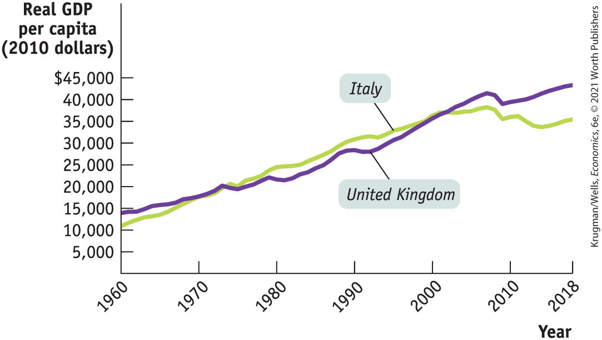
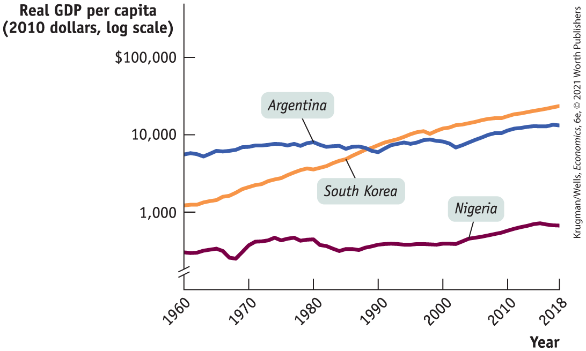
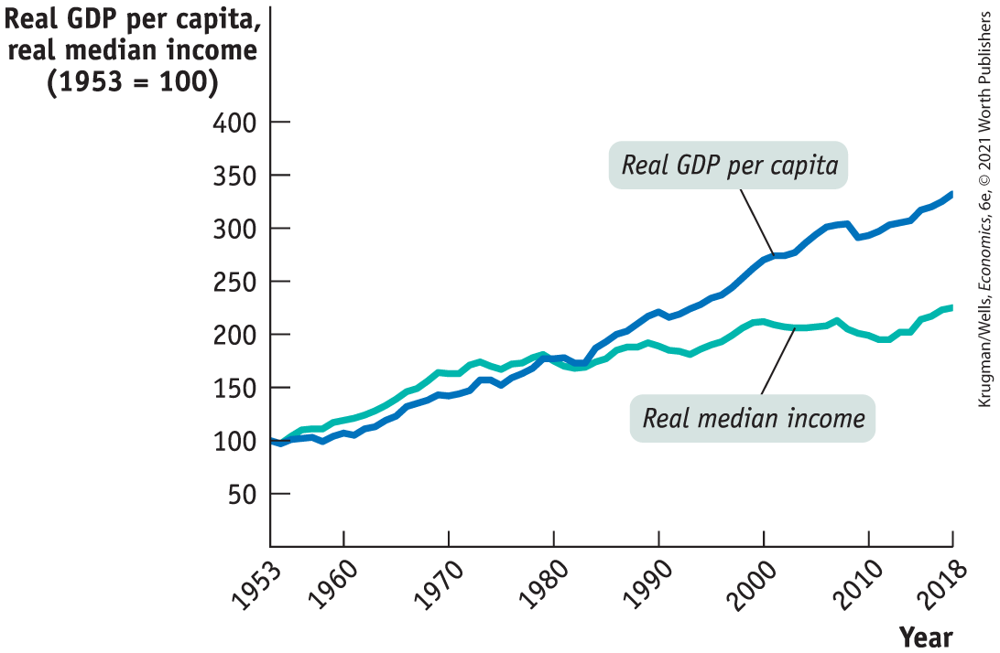
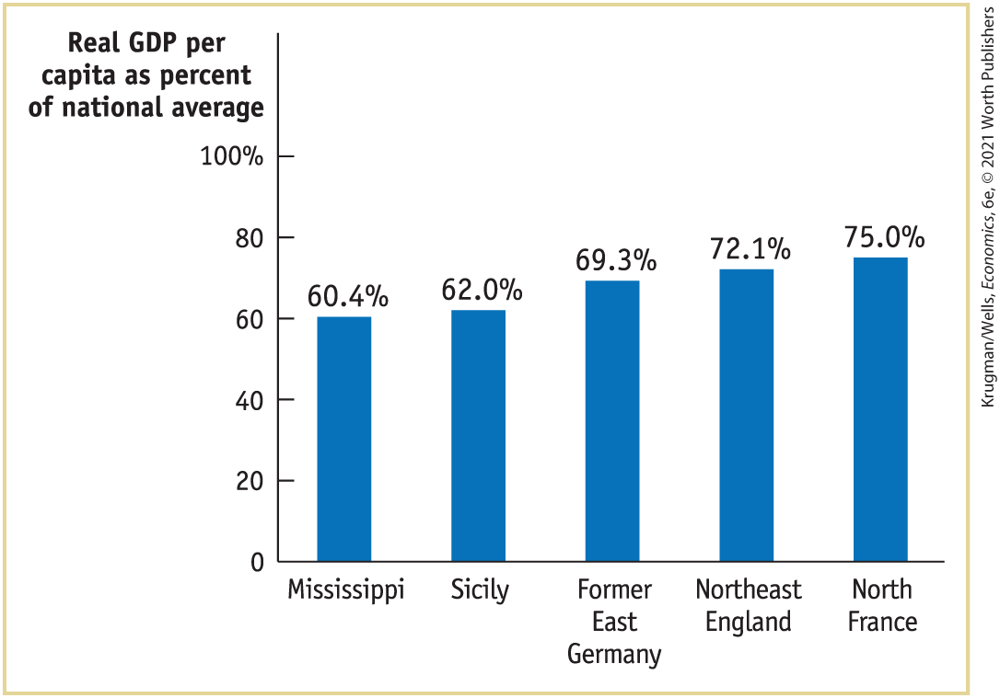
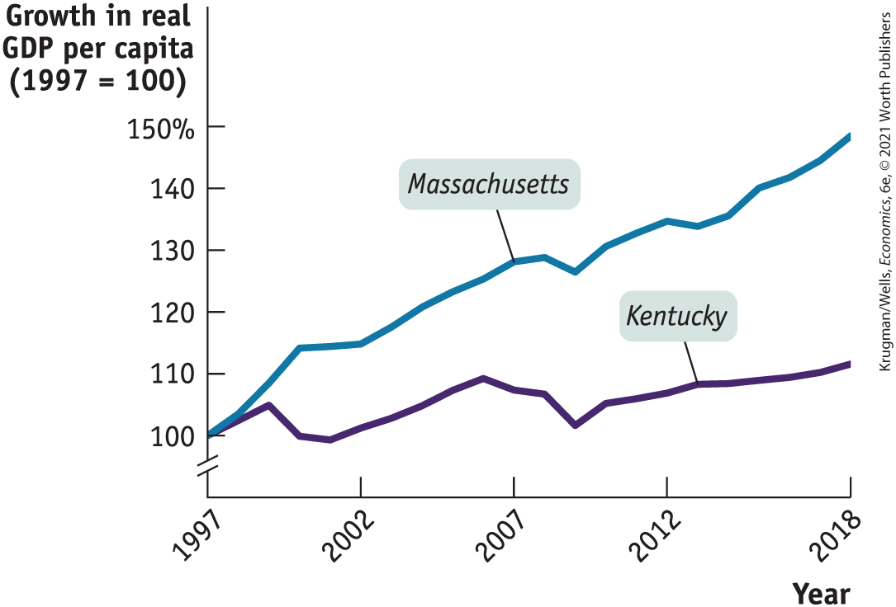

#### 5. Protection of Property Rights

<figure id="pau_9781319320164_f5ROWSqamd" class="figure lm_img_lightbox unnum c2 right">

</figure>

*Property rights* are the legal rights held by owners of valuable items to dispose of those items as they choose. A subset, *intellectual property rights,* are the rights of innovators to accrue the rewards of their innovations. The state of property rights generally, and intellectual property rights in particular, are important factors in explaining differences in growth rates across economies. Why? Because no one would bother to spend the effort and resources required to innovate if someone else could appropriate that innovation and capture the rewards. So, for innovation to flourish, intellectual property rights must receive protection.

Sometimes protecting property rights is accomplished by the nature of the innovation: it may be too difficult or expensive to copy. But, generally, the government has to protect intellectual property rights. A *patent* is a government-created temporary monopoly given to innovators for the use or sale of their innovations. It’s a temporary rather than permanent monopoly because while it’s in society’s interests to give innovators an incentive to invent, it’s also in society’s interest to eventually encourage competition.

#### 6. Political Stability and Good Governance

There’s not much point in investing in a business if rioting mobs are likely to destroy it, or in saving your money if someone with political connections can steal it. Political stability and good governance (including the protection of property rights) are essential ingredients in fostering economic growth in the long run.

Long-run economic growth in successful economies, like that of the United States, has been possible because there are good laws, institutions that enforce those laws, and a stable political system that maintains those institutions. The law must say that your property is really yours so that someone else can’t take it away. The courts and the police must be honest so that they can’t be bribed to ignore the law. And the political system must be stable so that laws don’t change capriciously.

Americans take these preconditions for granted, but they are by no means guaranteed. Aside from the disruption caused by war or revolution, many countries find that their economic growth suffers due to corruption among the government officials who should be enforcing the law. For example, until 1991 the Indian government imposed many bureaucratic restrictions on businesses, which often had to bribe government officials to get approval for even routine activities — a tax on business, in effect. Economists have argued that a reduction in this burden of corruption was one reason India experienced a surge of economic growth after 1990 that continues to this day.

Even when the government isn’t corrupt, excessive government intervention can be a brake on economic growth. If large parts of the economy are supported by wasteful government subsidies, protected from imports, subject to unnecessary monopolization, or otherwise insulated from competition, productivity tends to suffer because of a lack of incentives. As we’ll see in the next section, excessive government intervention is one often-cited explanation for slow growth in Latin America.

### ECONOMICS \>\> *in Action*

What’s the Matter with Italy?

Italy was once considered a remarkable economic success story. A century ago it was still a poor country — so poor that in the late nineteenth and early twentieth century millions of Italians emigrated to the United States and other destinations in search of a better life. After World War II, however, Italy experienced decades of rapid growth, with real GDP per capita quadrupling between 1950 and 1990. By the end of that growth spurt, as you can see from <a href="#kru_9781319245269_ch09_04.xhtml#pau_9781319320164_R5OPhh9kQ4" id="kru_9781319245269_ch09_04.xhtml#pau_9781319320164_OwQlnpALVE" class="crossref">Figure 9-8</a>, Italy was significantly richer than the United Kingdom, the nation that had led the Industrial Revolution.

<figure id="pau_9781319320164_R5OPhh9kQ4" class="figure lm_img_lightbox num c3 main-flow">

<figcaption>
FIGURE 9-8 Real GDP per Capita for Italy and the United Kingdom, 1960–2018

<em>Data from:</em> The World Bank.
</figcaption>
</figure>

<aside class="hidden" id="pau_9781319320164_1QJPBs5K6D" title="hidden">

The vertical axis labeled Real G D P per capita (2010 dollars) ranges from 5,000 to 45,000 dollars in increments of 5,000. The horizontal axis labeled Year shows markings at 1960, 1970, 1980, 1990, 2000, 2010, and 2018 from left to right. The curve for Italy increases through the approximate points (1960, 11000), (1970, 15000), (1980, 25000), (1990, 30000), (2000, 35000), (2010, 35000), and (2018, 30000). The curve for United Kingdom increases through the approximate points (1960, 14000), (1970, 17000), (1980, 20000), (1990, 27000), (2000, 35000), (2010, 37000), and (2018, 40000).

</aside>

But at that point Italian growth stalled. Real GDP per capita was stagnant after the late 1990s, and began falling after 2008, as Italy’s economy suffered a severe downturn as a result of the European debt crisis. What went wrong?

Part of the answer involves slow growth of the factors of production. Italy’s low birth rate has meant a rapidly aging population, with a declining percentage of working-age adults. Italy has also lagged in education, with the lowest college-educated share of the population in the European Union. Italy also seems to be having trouble taking advantage of technological progress. In fact, measured total factor productivity in Italy has declined since 2000. Why?

Some economists suggest that the explanation may lie in its business culture. In particular, Italian management practices have been widely criticized because promotion and financial rewards all too often reflect seniority rather than performance, giving few incentives to adopt new technology and best business practices.

Underlying this low-performance culture may be a lack of effective competition in many markets, which means that even badly run companies can stay in business indefinitely. The absence of competition within the Italian economy points to a government policy failure, perhaps arising from the relationship between established firms and government being too cozy. In an economy dominated by established firms, there’s little incentive to invest or innovate. Italy’s troubles show that even countries with a history of economic success can stumble. Achieving sustained economic growth, it turns out, isn’t easy.

### *\>\> Quick Review*

- Countries differ greatly in their growth rates of real GDP per capita due to differences in the rates at which they accumulate physical capital and human capital as well as differences in technological progress. A prime cause of differences in growth rates is differences in rates of domestic savings and investment spending as well as differences in education levels, and **research and development**, or **R&D**, levels. R&D largely drives technological progress.
- Government actions can promote or hinder the sources of long-term growth.
- Government policies that directly promote growth are subsidies to **infrastructure**, particularly public health infrastructure, subsidies to education, subsidies to R&D, and the maintenance of a well-functioning financial system.
- Governments improve the environment for growth by protecting property rights (particularly intellectual property rights through patents), by providing political stability, and through good governance. Poor governance includes corruption and excessive government intervention.

### *\>\> Check Your Understanding* 9-3

1.  Explain the link between a country’s growth rate, its investment spending as a percent of GDP, and its domestic savings.
2.  U.S. centers of academic biotechnology research have closer connections with private biotechnology companies than do their European counterparts. What effect might this have on the pace of innovation and development of new drugs in the United States versus Europe?
3.  During the 1990s in the former Soviet Union a lot of property was seized and controlled by those in power. How might this have affected the country’s growth rate at that time? Explain.

## Success, Disappointment, and Failure

As <a href="#kru_9781319245269_ch09_02.xhtml#pau_9781319320164_ACKMsGsZa7" id="kru_9781319245269_ch09_05.xhtml#pau_9781319320164_VEl4UeKbBl" class="crossref">Figure 9-2</a> illustrates, rates of long-run economic growth differ quite a lot around the world. We’ll now look at three regions of the world that have had quite different experiences with economic growth over the last several decades. We’ve chosen these three regions — East Asia, Latin America, and Africa — because they illustrate the challenges of sustained productivity growth.

<a href="#kru_9781319245269_ch09_05.xhtml#pau_9781319320164_8ScSfbcMnA" id="kru_9781319245269_ch09_05.xhtml#pau_9781319320164_5dPXtXvPDK" class="crossref">Figure 9-9</a> shows trends since 1960 in real GDP per capita in 2010 dollars for three countries: Argentina, Nigeria, and South Korea. (As in <a href="#kru_9781319245269_ch09_02.xhtml#pau_9781319320164_gRfwGuDkw0" id="kru_9781319245269_ch09_05.xhtml#pau_9781319320164_i9ul3bLC9k" class="crossref">Figure 9-1</a>, the vertical axis is drawn in logarithmic scale.) We have chosen these countries because each is a particularly striking example of what has happened in its region. South Korea’s amazing rise is part of a broad “economic miracle” in East Asia. Argentina’s slow progress, interrupted by repeated setbacks, is more or less typical of the disappointing growth that has characterized Latin America. Like Argentina, Nigeria also had a little growth in real GDP until 2000. Since then both countries have fared better.

<figure id="pau_9781319320164_8ScSfbcMnA" class="figure lm_img_lightbox num c3 main-flow">

<figcaption>
FIGURE 9-9 Success and Disappointment

Real GDP per capita from 1960 to 2018, measured in 2010 dollars, is shown for Argentina, South Korea, and Nigeria, using a logarithmic scale. South Korea and some other East Asian countries have been highly successful at achieving economic growth. Argentina, like much of Latin America, has had several setbacks, slowing its growth. Nigeria’s standard of living in 2018 was only barely higher than it had been in 1960, an experience shared by many African countries. Neither Argentina nor Nigeria exhibited much growth over the 58-year period, although both have had significantly higher growth in recent years.

<em>Data from:</em> World Development Indicators.
</figcaption>
</figure>

<aside class="hidden" id="pau_9781319320164_KQPH415g3i" title="hidden">

The vertical axis labeled Real G D P per capita (2010 dollars, log scale) is truncated and shows markings at 1,000, 10,000, and 100,000, from bottom to top. The horizontal axis labeled Year shows markings at 1960, 1970, 1980, 1990, 2000, 2010, and 2018, from left to right. Nigeria maintains an average of 500 to 700 dollars throughout the years. Argentina maintains an average of 7,000 to 10,000 dollars throughout the years. South Korea shows an upward trend passing through approximate points (1960, 1500), (1990, 8000), and (2018, 30000).

</aside>

### East Asia’s Miracle

In 1960 South Korea was a very poor country. In fact, in 1960 its real GDP per capita was lower than that of India today. But, as you can see from <a href="#kru_9781319245269_ch09_05.xhtml#pau_9781319320164_8ScSfbcMnA" id="kru_9781319245269_ch09_05.xhtml#pau_9781319320164_GKYJE7cA7p" class="crossref">Figure 9-9</a>, beginning in the early 1960s South Korea began an extremely rapid economic ascent: real GDP per capita grew about 7% per year for more than 30 years. Today South Korea, though still somewhat poorer than Europe or the United States, looks very much like an economically advanced country.

South Korea’s economic growth is unprecedented in history: it took the country only 35 years to achieve growth that required centuries elsewhere. Yet South Korea is only part of a broader phenomenon, often referred to as the East Asian economic miracle. High growth rates first appeared in South Korea, Taiwan, Hong Kong, and Singapore but then spread across the region, most notably to China. Since 1975, the whole region has increased real GDP per capita by 6% per year, more than three times America’s historical rate of growth.

How have the Asian countries achieved such high growth rates? The answer is that all of the sources of productivity growth have been firing on all cylinders. Very high savings rates, the percentage of GDP that is saved nationally in any given year, have allowed the countries to significantly increase the amount of physical capital per worker. Very good basic education has permitted a rapid improvement in human capital. And these countries have experienced substantial technological progress.

Why were such high rates of growth unheard of in the past? Most economic analysts think that East Asia’s growth spurt was possible because of its *relative* backwardness. That is, by the time that East Asian economies began to move into the modern world, they could benefit from adopting the technological advances that had been generated in technologically advanced countries such as the United States.

In 1900, the United States could not have moved quickly to a modern level of productivity because much of the technology that powers the modern economy, from jet planes to computers, hadn’t been invented yet. In 1970, South Korea probably still had lower labor productivity than the United States had in 1900, but it could rapidly upgrade its productivity by adopting technology that had been developed in the United States, Europe, and Japan over the previous century. This was aided by a huge investment in human capital through widespread schooling.

The East Asian experience demonstrates that economic growth can be especially fast in countries that are playing catch-up to other countries with higher GDP per capita. On this basis, many economists have suggested a general principle known as the <a href="#kru_9781319245269_EM_glossary.xhtml#pau_9781319320164_5exFVX9JgA" id="kru_9781319245269_ch09_05.xhtml#pau_9781319320164_NV2mK3ozvh" class="glossref" role="doc-glossref">convergence hypothesis</a>. It says that differences in real GDP per capita among countries tend to narrow over time because countries that start with lower real GDP per capita tend to have higher growth rates.

<aside aria-label="title" class="glossary c3 main-flow v1" epub:type="glossary" id="pau_9781319320164_Ho6z8DbNlp">

**convergence hypothesis**  
According to the **convergence hypothesis**, international differences in real GDP per capita tend to narrow over time.

</aside>

However, starting with a relatively low level of real GDP per capita is no guarantee of rapid growth, as the examples of Latin America and Africa both demonstrate.

### Latin America’s Disappointment

In 1900, Latin America was not considered an economically backward region. Natural resources, including both minerals and cultivable land, were abundant. Some countries, notably Argentina, attracted millions of immigrants from Europe in search of a better life. Measures of real GDP per capita in Argentina, Uruguay, and southern Brazil were comparable to those in economically advanced countries.

For the last century, however, growth in Latin America has been disappointing. As <a href="#kru_9781319245269_ch09_05.xhtml#pau_9781319320164_8ScSfbcMnA" id="kru_9781319245269_ch09_05.xhtml#pau_9781319320164_I60vCIAv0d" class="crossref">Figure 9-9</a> shows in the case of Argentina, growth has been disappointing for many decades. The fact that South Korea is now much richer than Argentina would have seemed inconceivable a few generations ago.

Why did Latin America stagnate? Comparisons with East Asian success stories suggest several factors. The rates of savings and investment spending in Latin America have been much lower than in East Asia, partly as a result of irresponsible government policy that has eroded savings through high inflation, bank failures, and other disruptions. Education — especially broad basic education — has been underemphasized: even Latin American nations rich in natural resources often failed to channel that wealth into their educational systems. And political instability, leading to irresponsible economic policies, has taken a toll.

In addition, Latin America has been unable to grow through the adoption of technology developed elsewhere. This has led to chronic disappointment among Latin Americans in their standard of living, which has further fueled political instability.

In the 1980s, many economists came to believe that Latin America was suffering from excessive government intervention in markets. They recommended opening the economies to imports, selling off government-owned companies, and, in general, freeing up individual initiative. The hope was that this would produce an East Asian–type economic surge. So far, however, only one Latin American nation, Chile, has achieved sustained rapid growth.

### Africa’s Troubles and Promise

<figure id="pau_9781319320164_6ZVo3eA5Mi" class="figure lm_img_lightbox unnum c2 right">

<figcaption>
Slow and uneven economic growth in sub-Saharan Africa has led to extreme and ongoing poverty for many of its people.
</figcaption>
</figure>

Africa south of the Sahara is home to more than 1 billion people, more than three times the population of the United States. On average, they are very poor, nowhere close to U.S. living standards 100 or even 200 years ago. In fact, real GDP per capita in sub-Saharan Africa actually fell 13% from 1980 to 1994, although it has recovered since then. However, since 1995, growth rates across most of Africa have been much higher, averaging about 5% a year if the big economies of Nigeria, Angola, and South Africa are excluded. What explains the dramatic turnaround?

First and foremost, many African countries have tackled the problem of political instability. In the years after 1975, large parts of Africa experienced devastating civil wars (often with outside powers backing rival sides) that killed millions of people and made productive investment spending impossible. The threat of war and general anarchy also inhibited other important preconditions for growth, such as education and provision of basic infrastructure.

Property rights are also a major problem. The lack of legal safeguards means that property owners are often subject to extortion because of government corruption, making them averse to owning property or improving it. This is especially damaging in a country that is very poor.

While many economists see political instability and government corruption as the leading causes of underdevelopment in Africa, some — most notably Jeffrey Sachs of Columbia University and the United Nations — believe the opposite. They argue that Africa is politically unstable because it is poor. And Africa’s poverty, they go on to claim, stems from its extremely unfavorable geographic conditions — much of the continent is landlocked, hot, infested with tropical diseases, and cursed with poor soil.

Sachs, along with economists from the World Health Organization, has highlighted the importance of health problems in Africa. In poor countries, worker productivity is often severely hampered by malnutrition and disease. In particular, tropical diseases such as malaria can only be controlled with an effective public health infrastructure, something that is lacking in much of Africa. Economists are studying certain regions of Africa to determine whether modest amounts of aid given directly to residents for the purposes of increasing crop yields, reducing malaria, and increasing school attendance can produce self-sustaining gains in living standards.

Although the example of African countries represents a warning that long-run economic growth cannot be taken for granted, there are some signs of hope. As we saw in <a href="#kru_9781319245269_ch09_05.xhtml#pau_9781319320164_8ScSfbcMnA" id="kru_9781319245269_ch09_05.xhtml#pau_9781319320164_cq7ZsTqrt7" class="crossref">Figure 9-9</a>, Nigeria’s per capita GDP, after decades of stagnation, turned upward after 2000, and it achieved an average annual growth rate of 3.0% from 2008 through 2018.

### Left Behind by Growth?

Historically, rising real GDP per capita has translated into rising real income for the great majority of a nation’s residents. However, there’s no guarantee that this will happen. One of the principles we laid out in <a href="#kru_9781319245269_ch01_01.xhtml#pau_9781319320164_cMQypPwEmS" id="kru_9781319245269_ch09_05.xhtml#pau_9781319320164_FBpGnAnT4G" class="crossref">Chapter 1</a> is that economic change often produces losers as well as winners, and this is true of the changes that come with long-run economic growth. Gains from long-run economic growth may be very unequally distributed, and in some cases significant shares of the population may see their incomes fall even while the overall income of the nation is rising.

This isn’t just a theoretical possibility. In the United States, and to a lesser extent in other wealthy countries, the share of income going to families near the top of the income distribution, and especially to the 1% of families with the highest incomes, has grown substantially since 1980. <a href="#kru_9781319245269_ch09_05.xhtml#pau_9781319320164_1M6O0m9CMZ" id="kru_9781319245269_ch09_05.xhtml#pau_9781319320164_pT1muX5mPC" class="crossref">Figure 9-10</a> shows one consequence of this rise in inequality. The figure compares the growth since 1953 of real per capita GDP in the United States and the real income of the *median family* — the family at the exact middle of the income scale, with half of all families richer and half poorer. Both numbers are shown as indexes, with $1953 = 100$.

<figure id="pau_9781319320164_1M6O0m9CMZ" class="figure lm_img_lightbox num c3 main-flow">

<figcaption>
FIGURE 9-10 The Growing Income Divide, 1953–2018

In the United States, from 1953 through 1980, both real per capita GDP and the real income of the median family grew at nearly identical rates because the distribution of income was quite stable. After 1980, however, the share of national income going to the richest Americans rose significantly. And while real GDP per capita continued to grow, real median income — the income earned by families in the middle of the income distribution — lagged behind. This means that since 1980 many of those families in the middle have been left behind by economic growth.

<em>Data from:</em> U.S. Census; FRED.
</figcaption>
</figure>

<aside class="hidden" id="pau_9781319320164_0WB08TRUed" title="hidden">

The vertical axis labeled Real G D P per capita, real median income (1953 equals 100) ranges from 50 to 400 in increments of 50. The horizontal axis labeled Year shows markings at 1953, 1960, 1970, 1980, 1990, 2000, 2010, and 2018, from left to right. The two curves show an upward trend. The curve labeled real G D P per capita starts at approximately (1953, 100), and ends at approximately (2018, 310). The curve labeled real median income starts at approximately (1953, 100), and ends at approximately (2018, 210). Both the curves intersect at approximately (1980, 175).

</aside>

Until 1980 the two numbers grew at nearly the same rate because the distribution of income was quite stable. After 1980, however, a growing share of income went to a relatively small number of people at the top. As a result, the income of the median family — which arguably reflects the experience of the typical American — rose much more slowly than real GDP per capita. Many U.S. families, in other words, were to some extent left behind by economic growth.

<aside class="case-study c3 main-flow v5" epub:type="case-study" id="pau_9781319320164_JcuxJVyGDt" title="GLOBAL COMPARISON LAGGING REGIONS IN RICH COUNTRIES">

#### \>\> Global comparison

LAGGING REGIONS IN RICH COUNTRIES

Growing regional disparities aren’t a uniquely U.S. problem. On the contrary, similar forces — economic trends that appear to favor large, highly educated metropolitan areas over rural and older industrial areas — are clearly at work in virtually all wealthy nations. In Britain, London’s economy has surged while the old coal-mining and industrial towns of England’s northeast have struggled. France presents a similar contrast between greater Paris and the coal-and-steel belt of the country’s north. Italy has long been divided between a wealthy north and a poor south, especially in Sicily. More than 30 years after the fall of the Berlin Wall, the former East Germany remains poorer than the rest of the country.

Comparing regional disparities across countries is tricky, because we don’t define regions the same way: the United States collects data for states and metropolitan areas, while European data are based on the “Nomenclature des Unités territoriales statistiques” — yes, NUTS. For what it’s worth, however, the figure, which shows real GDP of several countries’ poorest region as a percent of the national average, suggests that regional disparities are similar across the Western world, and if anything slightly bigger in the United States.

<figure id="pau_9781319320164_yHIgNgDrcA" class="figure lm_img_lightbox unnum c5 center">

<figcaption>
<em>Data from:</em> Nomenclature des Unités territoriales statistiques and Bureau of Economic Analysis.
</figcaption>
</figure>

<aside class="hidden" id="pau_9781319320164_IMLi84rNQA" title="hidden">

The vertical axis labeled Real G D P per capita as percent of national average ranges from 0 to 100 percent in increments of 20 percent. The horizontal axis plots the following countries from left to right, Mississippi, Sicily, Former East Germany, Northeast England, and North France. The data from the graph are as follows, Mississippi, 60.4 percent; Sicily, 62 percent; Former East Germany, 69.3 percent; Northeast England, 72.1 percent; and North France, 75 percent.

</aside>
</aside>

Nor was it simply individual families that were left behind by recent growth. Whole regions have been left behind, reversing a historical trend toward convergence. For most of the twentieth century, the poorest U.S. states, mainly in the south, experienced faster growth than the nation as a whole, so that regional income disparities steadily narrowed. In recent decades, however, gaps have been widening again, with high-income metropolitan areas pulling away both from rural areas and smaller cities that used to be hubs of manufacturing.

<a href="#kru_9781319245269_ch09_05.xhtml#pau_9781319320164_HfNztitMEb" id="kru_9781319245269_ch09_05.xhtml#pau_9781319320164_iqhVSQx8DR" class="crossref">Figure 9-11</a> illustrates this point by comparing the growth in real GDP per capita since 1997 in two states: Massachusetts, a rich state thanks to the concentration of technology and finance in and around Boston, and Kentucky, where traditional economic mainstays like coal mining and agriculture have been in decline. Even in 1997 Kentucky was poorer than Massachusetts, with real GDP per capita around 25 percent lower. But the gap between the states has drastically widened since then.

<figure id="pau_9781319320164_HfNztitMEb" class="figure lm_img_lightbox num c3 main-flow">

<figcaption>
FIGURE 9-11 The Income Gap Between Rich and Poor States, 1997–2018

In recent decades high-income states have widened the gap with poorer states. From 1997 through 2018 gross domestic product in Massachusetts has grown by nearly 50% compared with only 10% growth for Kentucky. In 1997, per capita income in Massachusetts was 31% greater than Kentucky, by 2018 the gap had widened to 75%.

<em>Data from:</em> U.S. Census; FRED.
</figcaption>
</figure>

<aside class="hidden" id="pau_9781319320164_q5sSmFb0VL" title="hidden">

The vertical axis labeled Growth in real G D P per capita (1997 equals 100) is truncated and ranges from 100 to 150 percent in increments of 10 percent. The horizontal axis labeled Year shows markings at 1997, 2002, 2007, 2012, and 2018, from left to right. The two curves are labeled “Massachusetts” and “Kentucky.” Both Massachusetts and Kentucky curves start at (1997, 100). The curve for Massachusetts increases through the approximate points (2002, 115), (2007, 127), (2012, 135), and (2018, 145). The curve for Kentucky increases through the approximate points (2002, 100), (2007, 107), (2012, 105), and (2018, 110).

</aside>

The fact that some regions of the United States are lagging even as the national economy as a whole grows is disturbing in itself. What makes it even more disturbing is that lagging regions appear to be suffering from significant social problems that go beyond merely monetary losses. In these regions, a high fraction of adults in their prime working years are without jobs, although they aren’t all counted as unemployed, because some have given up even searching for work. And perhaps as a consequence of the lack of employment opportunities, these regions also suffer disproportionately from what the economists Anne Case and Angus Deaton have called “deaths of despair”: mortality caused by drug overdoses, suicide, and alcohol.

It is important, however, to acknowledge two qualifications to this somewhat downbeat note about growth in the United States. First, in the broad sweep of history it is still true that economic growth raises the standard of living of the great majority of the population. Second, it would be wrong to imagine that global economic growth, even in recent decades, has mainly benefited a well-off minority. On the contrary, as explained in the Economics in Action below, from a worldwide perspective the most conspicuous aspect of recent growth has been the rise of a *global middle class* — rapidly rising incomes among hundreds of millions of previously poor people in China and other emerging economies.

### ECONOMICS \>\> *in Action*

Global Winners and Losers

Within the United States, the gains from economic growth since around 1980 have been unevenly distributed. Incomes at the top have soared, but incomes of most families have grown much more slowly. As a result, inequality has risen.

But is the same true for the world as a whole? No, the global picture is more complicated. In fact, even the question “Is global inequality rising or falling?” turns out to not be very meaningful. Inequality *within* many countries, especially in richer nations, has gone up. But inequality *between* nations has gone down, thanks to rapid growth in China, India, and other countries that used to be very poor.

One helpful way to think about who benefits from global growth is to divide the world’s population into four groups: the untouched, the developing-country middle class, the advanced-country working class, and the global elite.

At the bottom there are still a large number of people, perhaps as many as 2 billion, who have yet to be touched by long-run economic growth. Most of sub-Saharan Africa, and even some parts of both China and India, still have per capita incomes not much higher than they had a century ago.

Above this group, however, is another large group, more than 1 billion strong, of people in China, India, and other rapidly growing economies who were very poor in living memory but now constitute a rapidly rising global middle class.

The story is less happy for the next group, the working class in advanced countries — for example, blue-collar workers in the United States. This group still has above-average incomes compared with the world as a whole, but as we’ve seen, these incomes have grown slowly since around 1980.

Finally, a small group of very well-off people, mostly but not entirely in wealthy nations, has seen big income gains.

Many analysts argue that this uneven pattern of gains is an important source of social and political friction. The rise of the global middle class, while it represents a huge improvement in human welfare, has also eroded the once-dominant position of wealthy nations in the world economic system, helping to explain such developments as the emergence of trade conflict between the United States and China. And the working class in wealthy countries feels left behind, possibly contributing to a populist backlash.

### *\>\> Quick Review*

- East Asia’s spectacular growth was generated by high savings and investment spending rates, an emphasis on education, and adoption of technological advances from other countries.
- Poor education, political instability, and irresponsible government policies are major factors in the slow growth of Latin America.
- In sub-Saharan Africa, severe instability, war, and poor infrastructure — particularly affecting public health — resulted in a catastrophic failure of growth. But economic performance in recent years has been much better than in preceding years.
- While the world economy as a whole has grown rapidly in recent decades, the growth has been uneven.

### *\>\> Check Your Understanding* 9-4

1.  Some economists think the high rates of growth of productivity achieved by many Asian economies cannot be sustained. Why might they be right? What would have to happen for them to be wrong?
2.  Based on <a href="#kru_9781319245269_ch09_05.xhtml#pau_9781319320164_8ScSfbcMnA" id="kru_9781319245269_ch09_05.xhtml#pau_9781319320164_11VKhNVkpb" class="crossref">Figure 9-9</a> and the discussion in this section, which regions would you predict to follow the convergence hypothesis? Why?
3.  Some economists think the best way to help African countries is for wealthier countries to provide more funds for basic infrastructure. Others think this policy will have no long-run effect unless African countries have the financial and political means to maintain this infrastructure. What policies would you suggest?

## Is World Growth Sustainable?

Earlier in the chapter we described the views of Thomas Malthus, the late-eighteenth-century economist who warned that the pressure of population growth would tend to limit the standard of living. Malthus was right about the past: for around 58 centuries, from the origins of civilization until his own time, limited land supplies effectively prevented any large rise in real incomes per capita. Since then, however, technological progress and rapid accumulation of physical and human capital have allowed the world to defy Malthusian pessimism.

But will this always be the case? Some skeptics have expressed doubt about whether <a href="#kru_9781319245269_EM_glossary.xhtml#pau_9781319320164_rMYfrFm9QR" id="kru_9781319245269_ch09_06.xhtml#pau_9781319320164_OXjShDlk0K" class="glossref" role="doc-glossref">sustainable long-run economic growth</a> is possible — that is, growth that can continue in the face of the limited supply of natural resources and, perhaps even more important, given the negative effects of past economic growth on the environment.

<aside aria-label="glossary" class="glossary c3 main-flow v1" epub:type="glossary" id="pau_9781319320164_GYLQnzN47e">

**sustainable long-run economic growth**  
**Sustainable long-run economic growth** is long-run growth that can continue in the face of the limited supply of natural resources and with less negative impact on the environment.

</aside>

### Natural Resources and Growth, Revisited

“Neo-Malthusian” theories — claims that economic growth will be severely limited by lack of resources — have emerged at intervals ever since modern long-run economic growth began. In 1865 the British economist William Stanley Jevons wrote an influential book warning that reserves of coal, which fueled the Industrial Revolution, might soon be exhausted. In 1972 a famous report by a group called the Club of Rome warned that shortages of natural resources in general would lead to collapsing growth. In the early 2000s there were widespread concerns about “peak oil,” a crisis that would supposedly be brought on by the exhaustion of world oil supplies.

So far, however, none of these warnings have proved accurate, largely because technological advances have circumvented previous limits. For example, since 2005 there have been dramatic developments in energy production, with large amounts of previously unreachable oil and gas extracted through fracking and with a huge decline in the cost of electricity generated by wind and solar power.

Most, though not all, economists believe that modern economies can almost always find ways to work around limits on the supply of natural resources. One reason for this optimism is the fact that resource scarcity leads to high resource prices. These high prices, in turn, provide strong incentives to conserve the scarce resource and find alternatives. For example, after the sharp oil price increases of the 1970s, U.S. consumers turned to smaller, more fuel-efficient cars as U.S. industry greatly intensified its efforts to reduce energy bills.

Given such responses to prices, economists generally tend to see resource scarcity as a problem that modern economies handle fairly well and not as a fundamental limit to long-run economic growth. Environmental issues, however, pose a more difficult problem for economies because dealing with them requires effective political action.
