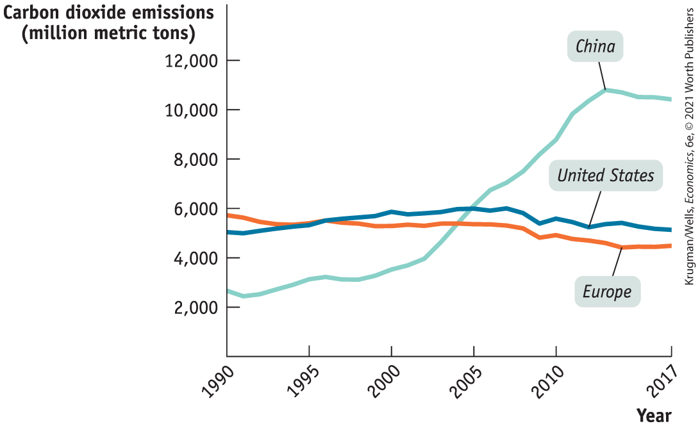

### Economic Growth and the Environment

Economic growth, other things equal, tends to increase the adverse impact of human activity on the environment, including an increase in pollution, the loss of wildlife habitats, the extinction of species, and reduced biodiversity. As we saw in this chapter’s opening story, India’s economic growth has also brought a spectacular increase in air pollution in its cities.

In analyzing economic growth and its environmental impact, it is useful to distinguish between *local* environmental degradation, which affects a geographically limited area, and *global* environmental degradation, which is far-reaching, with worldwide impact. As we’ll see, it has proven to be far more difficult to address global environmental degradation and, in particular, the problem of *climate change.*

In fact, the improved air quality in the cities of today’s advanced economies indicates that local environmental harm can be greatly reduced when there is sufficient political will and resources are devoted to finding a solution. As described in the Economics in Action below, in recent years China has dramatically improved air quality in its major cities while continuing to achieve rapid economic growth.

However, *climate change* — changes in Earth’s climate brought about by human activity, including pollution — has been a much harder problem to solve because policies must be implemented on a global scale, requiring the cooperation of many countries.

There is broad scientific consensus that burning fossil fuels — coal, oil, and natural gas — leads to increasing levels of carbon dioxide in the atmosphere. Carbon dioxide is a type of *greenhouse gas.* Such gases trap the sun’s energy, raising the planet’s temperature, and lead to shifts in weather patterns, which, in turn, impose high human, economic, and environmental costs. These costs include extreme weather, rising sea levels that increase the risk of flooding, the disruption of agriculture, including crop failures, and more. A recent estimate put the cost of unmitigated climate change at 20% of world gross domestic product by 2100. Moreover, these costs tend to fall more heavily on poor countries.

The problem of climate change is linked to economic growth: the larger the economy, the more homes, factories, and vehicles, will have to be powered, typically by burning fossil fuels. At present, world energy consumption is overwhelmingly dependent upon fossil fuels, which account for 85% of total consumption, while clean, renewable sources account for only 11%. Why? Because historically, fossil fuels have been cheaper to use. Most of today’s wealthy countries grew their economies through industrialization and the burning of fossil fuels over the last century. To reduce the global emission of greenhouse gases, developed countries and large rapidly developing countries, such as China and India, will have to undertake a transition from a heavy reliance on fossil fuels to greater use of clean, renewable energy sources such as wind and solar power.

Until recently, effective action against climate change had been stymied by disagreement among countries on how to pay the cost of shifting from fossil fuel to clean energy sources. As <a href="#kru_9781319245269_ch09_06.xhtml#pau_9781319320164_GcvhF1bpJA" id="kru_9781319245269_ch09_06.xhtml#pau_9781319320164_KL9l1WaCPI" class="crossref">Figure 9-12</a> shows, today’s wealthy economies have historically been responsible for most of the carbon dioxide emissions — and carbon dioxide alone accounts for approximately three-quarters of all global greenhouse gas emissions. But newly emerging economies like China and India are responsible for the recent growth. Inevitably, rich countries are reluctant to pay the price of reducing emissions only to have their efforts frustrated by rapidly growing emissions from new players. But relatively poor countries like China and India consider it unfair that they should be expected to bear the burden of protecting an environment threatened by the past actions of rich nations.

<figure id="pau_9781319320164_GcvhF1bpJA" class="figure lm_img_lightbox num c3 main-flow">

<figcaption>
FIGURE 9-12 Climate Change and Growth

Greenhouse gas emissions are positively related to growth. As shown here by the United States and Europe, wealthy countries have historically been responsible for the great bulk of carbon dioxide emissions — which make up more than three-quarters of all greenhouse gas emissions — because of their richer and faster-growing economies. As China and other emerging economies have grown, they began to emit much more carbon dioxide. China has since overtaken the United States and Europe in emissions.

<em>Data from:</em> Energy Information Administration.
</figcaption>
</figure>

<aside class="hidden" id="pau_9781319320164_gkBzVcqcsm" title="hidden">

The vertical axis labeled Carbon dioxide emissions (million metric tons) ranges from 2,000 to 12,000, in increments of 2,000. The horizontal axis labeled Year shows markings at 1990, 1995, 2000, 2005, 2010, and 2017, from left to right. The three curves are labeled United States, Europe, and China. Both United States and Europe maintain an average of 4,000 to 6,000 throughout the years. The curve for China increases gradually from (1990, 2500) to (2000, 3500), then increases steeply to (2015, 10000), and then ends at (2017, 10000). All values are approximated.

</aside>

In acknowledgment of the seriousness of the problem, in 2015, 196 countries came together under the <a href="#kru_9781319245269_EM_glossary.xhtml#pau_9781319320164_uFs31Ifv1a" id="kru_9781319245269_ch09_06.xhtml#pau_9781319320164_AcM07MGU9Z" class="glossref" role="doc-glossref">Paris Agreement</a>, committing to reduce their emissions of greenhouse gases in an effort to limit the rise in Earth’s temperature to no more than 2 degrees Celsius. The linchpin of the agreement was cooperation between China, India, and the United States. China and India agreed to limit their emissions, and the United States, along with other rich countries, committed to develop various forms of public and private financing to help poorer countries pay the cost. Despite originally committing to the Paris Agreement, at the time of writing the Trump administration had announced plans for the United States to withdraw from it in November 2020.

<aside aria-label="title" class="glossary c3 main-flow v1" epub:type="glossary" id="pau_9781319320164_CbS1dYEWhc">

**Paris Agreement**  
Under the **Paris Agreement** of 2015, 196 countries agreed to reduce their greenhouse gas emissions in an effort to limit the rise in Earth’s temperature to no more than 2 degrees Celsius.

</aside>

Is it possible to maintain long-run growth while averting the effects of climate change? The answer, according to most economists who have studied the issue, is yes. While there will be economic costs, those costs have been falling as technological innovation in clean energy sources advances. The best available estimates show that even a large reduction in greenhouse gas emissions over the next few decades would cause only a modest reduction in the long-term rise in real GDP per capita.

To achieve long-run economic growth with environmental protection, governments will need to use regulations and environmental standards, and institute policies that create market incentives to encourage individuals and firms to make the transition to clean energy sources. Finally, governments — both rich and poor — will need to continue to cooperate with one another. Getting political consensus around the necessary policies will be key.

### ECONOMICS \>\> *in Action*

China’s War on Pollution

<figure id="pau_9781319320164_fqJ0RfpbDo" class="figure lm_img_lightbox unnum c2 right">

<figcaption>
As Beijing pivots to electric vehicles, the air is beginning to clear.
</figcaption>
</figure>

Beijing, the capital of China, is even bigger than New Delhi: the metropolitan area is home to 24 million people. And not long ago it was synonymous with air pollution. In 2014, when the city was host to Asia-Pacific Economic Cooperation, a high-profile international forum, the authorities imposed temporary pollution controls that literally cleared the air for a while; this was such a rare occurrence at the time that residents coined the term “APEC blue” for the unusual appearance of natural-colored skies.

In that same year, however, the Chinese government declared a longer-term “war on pollution.” This involved a number of measures, including restrictions on coal burning and the closing of some of the oldest, most polluting plants; restrictions on highly polluting vehicles in major cities; and the introduction of highly subsidized electric buses.

These measures worked: the air got a lot cleaner. Beijing’s air is still much worse than air in, say, greater New York, which has a similar population; pollution hovers between “moderate” and “unhealthy.” But it’s far better than it was.

The striking thing is that China achieved this significant reduction in air pollution while remaining one of the world’s fastest-growing economies. Chinese real GDP grew 38% between 2014 and 2019, or 6.4% a year, even as the air got steadily clearer. In other words, long-term economic growth can go along with an improving environment.

### *\>\> Quick Review*

- Economists generally believe that environmental degradation poses a major challenge to **sustainable long-run economic growth.** They also generally believe that modern economies can find ways to alleviate limits to growth from natural resource scarcity through the price response that promotes conservation and the creation of alternatives.
- Economic growth tends to harm the environment unless actions are taken to protect it. Local environmental degradation can be addressed through political will and resources. Global environmental degradation is harder to address because it requires cooperation across many countries.
- The accumulation of greenhouse gases, a by-product of burning fossil fuels, has led to climate change, the raising of Earth’s temperature. In order to avert the impact of climate change, effective government intervention is required.
- Developed countries and large countries that are rapidly growing need to shift from a heavy reliance on fossil fuels to using clean, energy sources like solar and wind power. This will come at a modest cost to the rise in real GDP per capita, a cost that is falling as technological innovation in clean energy sources advances.
- In the **Paris Agreement** of 2015, 196 countries agreed to reduce their greenhouse gas emissions in an effort to limit the rise in Earth’s temperature.

### *\>\> Check Your Understanding* 9-5

1.  Are economists typically more concerned about the limits to growth imposed by environmental degradation or those imposed by resource scarcity? Explain, noting the role of negative externalities (costs imposed by individuals or firms on others without the requirement to pay compensation), in your answer.
2.  What is the link between greenhouse gas emissions and growth? What is the expected effect on growth from emissions reduction? Why is international burden sharing of greenhouse gas emissions reduction a contentious problem?

## Business case 

Raising the Bar(code)

<figure id="pau_9781319320164_V5xLVMWpCf" class="figure lm_img_lightbox unnum c2 right">

</figure>

When we think about innovation and technological progress, we tend to focus on the dramatic changes: cars replacing horses and buggies, electric light bulbs replacing gaslights, computers replacing adding machines and typewriters. However, much more progress is incremental and almost invisible to most people, yet has huge effects over time. Consider, for example, the simple bar-code scanner.

Bar codes were first used commercially in 1974, when a 10-pack of Wrigley’s chewing gum was rung up with a scanner produced by the National Cash Register Corporation (now NCR Corp). Since then bar codes and their two-dimensional descendants — visual patterns that are meaningless to human eyes but are instantly recognizable by scanners and smartphones — have become ubiquitous, used to identify and route everything from shipping containers to airline passengers.

The benefits from machine-readable labels are enormous, extending well beyond what consumers in the checkout line can see. For example, retailers use them to continuously track sales, telling them when to reorder merchandise and restock shelves, what to keep in their warehouses, how productive individual workers are, and more. Grocery retailing is a labor-intensive industry, and economists estimate that the adoption of bar-code technology reduced labor costs by as much as 40%. Ultimately, bar-code technology helped drive the computerization of the entire retail industry.

And this story isn’t over. A growing number of retailers offer self-checkout, where customers scan items themselves and pay electronically. Some stores offer smartphone apps that offer even more convenience by letting customers scan items as they put them into the shopping cart.

You might think, then, that NCR, which remains a major player in point-of-service technologies like scanners, ATMs, and so forth, made a fortune from its leading role in this technology revolution. But while the company has done well, scanner sales in the early years weren’t enormous: the adoption of bar-code scanners was relatively slow compared with the spread of smartphones a couple of decades later. Only about a third of supermarkets adopted them in the first decade after that historic pack of gum.

Why? To realize the full potential of bar-code technology, both retailers and firms had to spend substantial money up front to buy the scanners and the information-processing systems they served. Equally important, manufacturers had to install the equipment to put bar codes on their products. This created a chicken-and-egg problem, with retailers waiting to have more scanner-readable products available and manufacturers waiting for more scanner-ready stores.

Over time this problem was resolved as retailers and manufacturers made the necessary investments, setting the stage for widespread use of information technology. In fact, during the productivity surge from 1995 to 2005, retailing was one of the leading sources of overall productivity growth in the U.S. economy.

Adoption was slower in Europe. In the United States, big stores were the first to install scanners, and the technology fostered greater concentration of retailing at the expense of small, mom-and-pop stores that couldn’t afford to implement scanner technology. In Europe, however, government policies — especially land-use policy — protected these stores.

Eventually, however, Europe began to follow the trend, too. Bar-code technology has spread from the United States to become almost universal, at least in advanced economies.

<aside class="assessments c3 main-flow v1" epub:type="assessments" id="pau_9781319320164_EEEXbd5bMd">

### Questions for thought

1.  Bar-code technology spurred a lot of investment in retailing. How did it alter the retailing production function? What would a similar amount of investment have accomplished without the new technology?
2.  The spread of bar codes was delayed in the United States because everyone was waiting for someone else to move. What policy could have been adopted to address the delays? Would it have been a good idea?
3.  Use the case to explain why international growth rates vary.
4.  Despite initial barriers, bar codes have spread globally. What does this imply about differences in economic growth across countries?

</aside>

### Summary

1.  Growth is measured as changes in real GDP per capita in order to eliminate the effects of changes in the price level and changes in population size. Levels of real GDP per capita vary greatly around the world: about a quarter of the world’s population lives in countries that are still poorer than the United States was in 1900. GDP per capita in the United States is about eight times as high as it was in 1900.
2.  Growth rates of real GDP per capita also vary widely. According to the **Rule of 70**, the number of years it takes for real GDP per capita to double is equal to 70 divided by the annual growth rate of real GDP per capita.
3.  The key to long-run economic growth is rising **labor productivity**, or just **productivity**, which is output per worker. Increases in productivity arise from increases in **physical capital** per worker and **human capital** per worker as well as **technological progress.** The **aggregate production function** shows how real GDP per worker depends on these three factors. Other things equal, there are **diminishing returns to physical capital:** holding human capital per worker and technology fixed, each successive addition to physical capital per worker yields a smaller increase in productivity than the one before. Equivalently, more physical capital per worker results in a lower, but still positive, increase in productivity. **Growth accounting**, which estimates the contribution of each factor to a country’s economic growth, has shown that rising **total factor productivity**, the amount of output produced from a given amount of factor inputs, is key to long-run growth. It is usually interpreted as the effect of technological progress. In contrast to earlier times, natural resources are a less significant source of productivity growth in most countries today.
4.  The large differences in countries’ growth rates are largely due to differences in their rates of accumulation of physical and human capital as well as differences in technological progress. Although inflows of foreign savings from abroad help, a prime factor is differences in domestic savings and investment spending rates, since most countries that have high investment spending on physical capital finance it by high domestic savings. Technological progress is largely a result of **research and development**, or **R&D.**
5.  Governments can help or hinder growth. Government policies that directly foster growth are subsidies to **infrastructure**, particularly public health infrastructure, subsidies to education and R&D, and maintenance of a well-functioning financial system that channels savings into investment spending, education, and R&D. Governments can enhance the environment for growth by protecting property rights (particularly intellectual property rights through patents), by being politically stable and by providing good governance. Poor governance includes corruption and excessive government intervention.
6.  The world economy contains examples of success and failure in the effort to achieve long-run economic growth. East Asian economies have done many things right and achieved very high growth rates. The low growth rates of Latin American and African economies over many years led economists to believe that the **convergence hypothesis**, the claim that differences in real GDP per capita across countries narrow over time, fits the data only when factors that affect growth, such as education, infrastructure, and favorable government policies and institutions, are held equal across countries. In recent years, there has been an uptick in growth among some Latin American and sub-Saharan African countries, largely due to a boom in commodity exports.
7.  Not only is economic growth uneven across countries, there are many cases where economic growth is uneven within countries. In the United States this is shown by a divergence in mean and median per capita income, highlighted by the growing income divide between rich and poor states.
8.  Economists generally believe that environmental degradation pose a major challenge to **sustainable long-run economic growth.** Addressing the problem will require effective governmental intervention.
9.  Climate change is linked to growth and there is broad consensus that government action is needed to address it. To avert the impact of climate change, countries will need to shift from a heavy reliance on fossil fuel to using clean, renewable energy sources. This will come at a modest cost to the rise in real GDP per capita, a cost that is falling as technological innovation in clean energy sources advances. Countries also need to cooperate with each other to realize the terms of the 2015 **Paris Agreement**, in which 196 signatory countries agreed to reduce their greenhouse gas emissions in an effort to limit the rise in Earth’s temperature.

### Key Terms

- <a href="#kru_9781319245269_ch09_02.xhtml#pau_9781319320164_j4x5bAFurD" id="kru_9781319245269_ch09_08.xhtml#pau_9781319320164_WNuYZ0kkbx" class="crossref">Rule of 70</a>
- <a href="#kru_9781319245269_ch09_03.xhtml#pau_9781319320164_djoaTaAHsV" id="kru_9781319245269_ch09_08.xhtml#pau_9781319320164_yVyduEcqBt" class="crossref">Labor productivity</a>
- <a href="#kru_9781319245269_ch09_03.xhtml#pau_9781319320164_GZpz4GtHQC" id="kru_9781319245269_ch09_08.xhtml#pau_9781319320164_Y7ECtNHvVG" class="crossref">Productivity</a>
- <a href="#kru_9781319245269_ch09_03.xhtml#pau_9781319320164_M79TmAv4dd" id="kru_9781319245269_ch09_08.xhtml#pau_9781319320164_ouihy1vJUL" class="crossref">Physical capital</a>
- <a href="#kru_9781319245269_ch09_03.xhtml#pau_9781319320164_5gXVCPl7KM" id="kru_9781319245269_ch09_08.xhtml#pau_9781319320164_xg4vRR30B8" class="crossref">Human capital</a>
- <a href="#kru_9781319245269_ch09_03.xhtml#pau_9781319320164_536y058SUZ" id="kru_9781319245269_ch09_08.xhtml#pau_9781319320164_SxbJpNJQ2Z" class="crossref">Technological progress</a>
- <a href="#kru_9781319245269_ch09_03.xhtml#pau_9781319320164_YLAyQGdI0V" id="kru_9781319245269_ch09_08.xhtml#pau_9781319320164_x5Hl4mInXa" class="crossref">Aggregate production function</a>
- <a href="#kru_9781319245269_ch09_03.xhtml#pau_9781319320164_NCC3fAkw92" id="kru_9781319245269_ch09_08.xhtml#pau_9781319320164_HNxcpXw3XK" class="crossref">Diminishing returns to physical capital</a>
- <a href="#kru_9781319245269_ch09_03.xhtml#pau_9781319320164_OE1ci4Vuiz" id="kru_9781319245269_ch09_08.xhtml#pau_9781319320164_EVtsmo2QZY" class="crossref">Growth accounting</a>
- <a href="#kru_9781319245269_ch09_03.xhtml#pau_9781319320164_C82Y6UYDTs" id="kru_9781319245269_ch09_08.xhtml#pau_9781319320164_pf0M6az2mb" class="crossref">Total factor productivity</a>
- <a href="#kru_9781319245269_ch09_04.xhtml#pau_9781319320164_i8GTRmOwNP" id="kru_9781319245269_ch09_08.xhtml#pau_9781319320164_ugEzIyU8oj" class="crossref">Research and development (R&amp;D)</a>
- <a href="#kru_9781319245269_ch09_04.xhtml#pau_9781319320164_ArKYGKKQ9U" id="kru_9781319245269_ch09_08.xhtml#pau_9781319320164_pA3nOmZfXm" class="crossref">Infrastructure</a>
- <a href="#kru_9781319245269_ch09_05.xhtml#pau_9781319320164_o0PnQoZtZ1" id="kru_9781319245269_ch09_08.xhtml#pau_9781319320164_Q0eDVoXGn9" class="crossref">Convergence hypothesis</a>
- <a href="#kru_9781319245269_ch09_06.xhtml#pau_9781319320164_2MxQDCz8j2" id="kru_9781319245269_ch09_08.xhtml#pau_9781319320164_9eLCTnfwWE" class="crossref">Sustainable long-run economic growth</a>
- <a href="#kru_9781319245269_ch09_06.xhtml#pau_9781319320164_QIip42Gs30" id="kru_9781319245269_ch09_08.xhtml#pau_9781319320164_YSrnumiCkR" class="crossref">Paris Agreement</a>

### Practice questions

1.  The accompanying table shows data from the World Bank, World Development Indicators, for real GDP per capita in 2010 U.S. dollars for Argentina, Ghana, South Korea, and the United States for 1960, 1980, 2000, and 2018.
    1.  Complete the table by expressing each year’s real GDP per capita as a percentage of its 1960 and 2018 levels.
    2.  How does the growth in living standards from 1960 to 2018 compare across these four nations? What might account for these differences?

        | Year                               | Argentina                |                          |                                    | Ghana                    |                          |                                    | South Korea              |                          |                                    | United States            |                          |     |
        |------------------------------------|--------------------------|--------------------------|------------------------------------|--------------------------|--------------------------|------------------------------------|--------------------------|--------------------------|------------------------------------|--------------------------|--------------------------|-----|
        | Real GDP per capita (2010 dollars) | Percentage of            |                          | Real GDP per capita (2010 dollars) | Percentage of            |                          | Real GDP per capita (2010 dollars) | Percentage of            |                          | Real GDP per capita (2010 dollars) | Percentage of            |                          |     |
        |                                    | 1960 real GDP per capita | 2018 real GDP per capita |                                    | 1960 real GDP per capita | 2018 real GDP per capita |                                    | 1960 real GDP per capita | 2018 real GDP per capita |                                    | 1960 real GDP per capita | 2018 real GDP per capita |     |
        | 1960                               | \$5,643                  | ?                        | ?                                  | \$1,056                  | ?                        | ?                                  |   \$944                  | ?                        | ?                                  | \$17,551                 | ?                        | ?   |
        | 1980                               |   7,908                  | ?                        | ?                                  |        881               | ?                        | ?                                  |  3,700                   | ?                        | ?                                  | 28,590                   | ?                        | ?   |
        | 2000                               |   8,224                  | ?                        | ?                                  |        952               | ?                        | ?                                  | 15,105                   | ?                        | ?                                  | 44,727                   | ?                        | ?   |
        | 2018                               | 10,044                   | ?                        | ?                                  |     1,807                | ?                        | ?                                  | 26,762                   | ?                        | ?                                  | 54,579                   | ?                        | ?   |

2.  The country of Androde is currently using Method 1 for its production function. By chance, scientists stumble onto a technological breakthrough that will enhance Androde’s productivity. This technological breakthrough is reflected in another production function, Method 2. The accompanying table shows combinations of physical capital per worker and output per worker for both methods, assuming that human capital per worker is fixed.
    | Method 1                    |                     | Method 2                    |                     |
    |-----------------------------|---------------------|-----------------------------|---------------------|
    | Physical capital per worker | Real GDP per worker | Physical capital per worker | Real GDP per worker |
    |     0                       |      0.00           |     0                       |     0.00            |
    |   50                        |   35.36             |   50                        |   70.71             |
    | 100                         |   50.00             | 100                         | 100.00              |
    | 150                         |   61.24             | 150                         | 122.47              |
    | 200                         |   70.71             | 200                         | 141.42              |
    | 250                         |   79.06             | 250                         | 158.11              |
    | 300                         |   86.60             | 300                         | 173.21              |
    | 350                         |   93.54             | 350                         | 187.08              |
    | 400                         | 100.00              | 400                         | 200.00              |
    | 450                         | 106.07              | 450                         | 212.13              |
    | 500                         | 111.80              | 500                         | 223.61              |

    1.  Using the data in the accompanying table, draw the two production functions in one diagram. Androde’s current amount of physical capital per worker is 100. In your figure, label that point *A.*
    2.  Starting from point *A,* over a period of 70 years, the amount of physical capital per worker in Androde rises to 400. Assuming Androde still uses Method 1, in your diagram, label the resulting point of production *B.* Using the Rule of 70, calculate by how many percent per year output per worker has grown.
    3.  Now assume that, starting from point *A,* over the same period of 70 years, the amount of physical capital per worker in Androde rises to 400, but that during that time period, Androde switches to Method 2. In your diagram, label the resulting point of production *C.* Using the Rule of 70, calculate by how many percent per year output per worker has grown now.
    4.  As the economy of Androde moves from point *A* to point *C,* what share of the annual productivity growth is due to higher total factor productivity?
3.  The Bureau of Labor Statistics regularly releases the “Productivity and Costs” report for the previous month. Go to <a href="http://www.bls.gov" id="kru_9781319245269_ch09_08.xhtml#pau_9781319320164_ng1D3sxgd3" class="external">www.bls.gov</a> and find the latest report. (On the Bureau of Labor Statistics home page, from the tab “Subjects,” select the link to “Productivity: Labor Productivity & Costs”; then, from the heading “LPC News Releases,” find the most recent “Productivity and Costs” report.) What were the percent changes in business and nonfarm business productivity for the previous quarter? How does the percent change in that quarter’s productivity compare to the percent change from the same quarter a year ago?
4.  Why would you expect real GDP per capita in California and Pennsylvania to exhibit convergence but not in California and Baja California, a state of Mexico that borders the United States? What changes would allow California and Baja California to converge?
5.  According to the U.S. Energy Information Administration, the proven oil reserves existing in the world in 2018 consisted of 1,663 billion barrels. In that year, the U.S. Energy Information Administration reported that the world daily oil production was 82.92 million barrels a day.
    1.  At this rate, for how many years will the proven oil reserves last? Discuss the Malthusian view in the context of the number you just calculated.
    2.  In order to do the calculation in part a, what did you assume about the total quantity of oil reserves over time? About oil prices over time? Are these assumptions consistent with the Malthusian view on resource limits?
    3.  Discuss how market forces may affect the amount of time the proven oil reserves will last, assuming that no new oil reserves are discovered and that the demand curve for oil remains unchanged.
