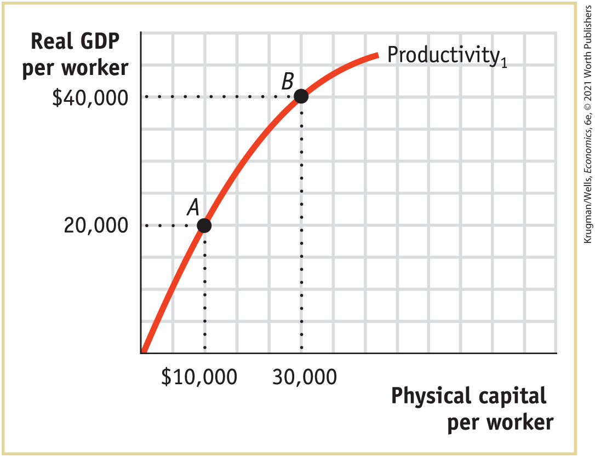

### Problems

1.  The following table shows the average annual growth rate in real GDP per capita for Argentina, Ghana, and South Korea using data from the World Bank, World Development Indicators, for the past few decades.
    | Years     | Average annual growth rate of real GDP per capita |             |            |
    |-----------|---------------------------------------------------|-------------|------------|
    | Argentina | Ghana                                             | South Korea |            |
    | 1968–1978 |    1.21%                                          |   −0.34%    |      9.02% |
    | 1978–1988 | −0.25                                             | −1.64       | 7.47       |
    | 1988–1998 | 2.13                                              |   1.50      | 5.59       |
    | 1998–2008 | 1.52                                              |   2.71      | 5.10       |
    | 2008–2018 | −0.16                                             |   4.12      | 2.55       |

    1.  For each 10-year period and for each country, use the Rule of 70 where possible to calculate how long it would take for that country’s real GDP per capita to double.
    2.  Suppose that the average annual growth rate that each country achieved over the period 2008–2018 continues indefinitely into the future. Starting from 2018, use the Rule of 70 to calculate, where possible, the year in which a country will have doubled its real GDP per capita.
2.  The following table provides approximate statistics on per capita income levels and growth rates for regions defined by income levels. According to the Rule of 70, starting in 2018 the high-income countries are projected to double their per capita GDP in approximately 70 years, in 2088. Throughout this question, assume constant growth rates for each of the regions are equal to their average value between 2000 and 2018.
    | Region                                                                                                                      | Real GDP per capita (2018) | Average annual growth rate of real GDP per capita (2000–2018) |
    |-----------------------------------------------------------------------------------------------------------------------------|----------------------------|---------------------------------------------------------------|
    | High-income countries                                                                                                       | \$43,559                   |   1.0%                                                        |
    | Middle-income countries                                                                                                     |     5,149                  | 3.6                                                           |
    | Low-income countries                                                                                                        |        740                 | 2.1                                                           |
    | *Data from:* World Bank. |                            |                                                               |

    1.  Calculate the ratio of per capita GDP in 2018 of the following:
        1.  Middle-income to high-income countries
        2.  Low-income to high-income countries
        3.  Low-income to middle-income countries
    2.  Calculate the number of years it will take the low-income and middle-income countries to double their per capita GDP.
    3.  Calculate the per capita GDP of each of the regions in 2088. (*Hint:* How many times does their per capita GDP double in 70 years, the number of years from 2018 to 2088?)
    4.  Repeat part a with the projected per capita GDP in 2088.
    5.  Compare your answers to parts a and d. Comment on the change in economic inequality between the regions.
3.  What roles do physical capital, human capital, technology, and natural resources play in influencing long-run economic growth of aggregate output per capita?
4.  How have U.S. policies and institutions influenced the country’s long-run economic growth?
5.  Over the next 100 years, real GDP per capita in Groland is expected to grow at an average annual rate of 2.0%. In Sloland, however, growth is expected to be somewhat slower, at an average annual growth rate of 1.5%. If both countries have a real GDP per capita today of \$20,000, how will their real GDP per capita differ in 100 years? \[*Hint:* A country that has a real GDP today of \$*x* and grows at *y*% per year will achieve a real GDP of $\text{\$}x\, \times \,{(1 + (y\text{/}100))}^{z}$ in *z* years. We assume that $0 \leq y \leq 100.$\]
6.  The accompanying table shows data from the World Bank, World Development Indicators, for real GDP per capita (2010 U.S. dollars) in France, Japan, the United Kingdom, and the United States in 1960 and 2018. Complete the table. Have these countries reduced the income gap with the United States?
    |                |                                    |                                        |                                    |                                        |
    |----------------|------------------------------------|----------------------------------------|------------------------------------|----------------------------------------|
    |                | 1960                               |                                        | 2018                               |                                        |
    |                | Real GDP per capita (2010 dollars) | Percentage of U.S. real GDP per capita | Real GDP per capita (2010 dollars) | Percentage of U.S. real GDP per capita |
    | France         | \$12,744                           | ?                                      | \$43,664                           | ?                                      |
    | Japan          |      8,608                         | ?                                      | 48,920                             | ?                                      |
    | United Kingdom |    13,934                          | ?                                      | 43,325                             | ?                                      |
    | United States  |    17,551                          | ?                                      | 54,579                             | ?                                      |
7.  The accompanying table shows data from the World Bank, World Development Indicators for real GDP per capita (2010 U.S. dollars) for Argentina, Ghana, South Korea, and the United States in 1960 and 2018. Complete the table. Have these countries caught up economically?
    |               |                                    |                                        |                                    |                                        |
    |---------------|------------------------------------|----------------------------------------|------------------------------------|----------------------------------------|
    |               | 1960                               |                                        | 2018                               |                                        |
    |               | Real GDP per capita (2010 dollars) | Percentage of U.S. real GDP per capita | Real GDP per capita (2010 dollars) | Percentage of U.S. real GDP per capita |
    | Argentina     | \$5,643                            | ?                                      | \$10,404                           | ?                                      |
    | Ghana         |   1,056                            | ?                                      |    1,807                           | ?                                      |
    | South Korea   |       944                          | ?                                      | 26,762                             | ?                                      |
    | United States | 17,551                             | ?                                      | 54,579                             | ?                                      |
8.   Access the Discovering Data exercise for <!--<a class="crossref" href="kru_9781319245269_ch09_01.xhtml#ch9_sec_1" id="ch09-ext1a">-->Chapter 9<!--</a>--> online to answer the following questions.
    1.  What was the ratio of Japanese GDP per capita relative to the United States in 1950 and 1991?
    2.  Why has Japan’s GDP caught up to that of the United States?
    3.  Rank the countries in order of richest to poorest (with 1 being the richest) in 1960 and 2010?
    4.  What was the ratio of GDP per capita for Spain relative to the United States in 1960 and 2010?
    5.  Which two countries experienced the fastest rate of convergence from 1960 through 2010?
    6.  Why are lower income countries, like Korea in 1960, able to grow faster than rich countries?
    7.  If countries continue along a similar path, will Japan, Korea, Chile, or Spain be the first country to reach the level of real GDP per capita in the United States?
9.  The accompanying table shows the annual growth rate for the years 2000–2014 in per capita emissions of carbon dioxide $(\text{CO}_{2})$ and the annual growth rate in real GDP per capita for selected countries.
    |                                                                                                                                                                |                                      |                                                                                                                                                              |
    |----------------------------------------------------------------------------------------------------------------------------------------------------------------|--------------------------------------|--------------------------------------------------------------------------------------------------------------------------------------------------------------|
    |                                                                                                                                                                | 2000–2014 Average annual growth rate |                                                                                                                                                              |
    | Country                                                                                                                                                        | Real GDP per capita                  | $\text{C}\text{O}_{2}$ emissions per capita |
    | Argentina                                                                                                                                                      |     1.69%                            |     1.17%                                                                                                                                                    |
    | Bangladesh                                                                                                                                                     | 4.33                                 | 4.47                                                                                                                                                         |
    | Canada                                                                                                                                                         | 0.96                                 | 0.01                                                                                                                                                         |
    | China                                                                                                                                                          | 9.24                                 | 7.48                                                                                                                                                         |
    | Germany                                                                                                                                                        | 1.20                                 | −0.41                                                                                                                                                        |
    | Ireland                                                                                                                                                        | 1.30                                 | −2.56                                                                                                                                                        |
    | Japan                                                                                                                                                          | 0.70                                 | 0.11                                                                                                                                                         |
    | South Korea                                                                                                                                                    | 3.51                                 | 2.32                                                                                                                                                         |
    | Mexico                                                                                                                                                         | 0.67                                 | 0.42                                                                                                                                                         |
    | Nigeria                                                                                                                                                        | 5.03                                 | −1.30                                                                                                                                                        |
    | Russia                                                                                                                                                         | 4.16                                 | 1.35                                                                                                                                                         |
    | South Africa                                                                                                                                                   | 1.64                                 | −0.02                                                                                                                                                        |
    | United Kingdom                                                                                                                                                 | 1.02                                 | −2.20                                                                                                                                                        |
    | United States                                                                                                                                                  | 0.85                                 | −1.27                                                                                                                                                        |
    | *Data from:* Energy Information Administration; World Bank. |                                      |                                                                                                                                                              |

    1.  Rank the countries in terms of their growth in $\text{CO}_{2}$ emissions, from highest to lowest. What five countries have the highest growth rate in emissions? What five countries have the lowest growth rate in emissions?
    2.  Now rank the countries in terms of their growth in real GDP per capita, from highest to lowest. What five countries have the highest growth rate? What five countries have the lowest growth rate?
    3.  Would you infer from your results that $\text{CO}_{2}$ emissions are linked to growth in output per capita?
    4.  Do high growth rates necessarily lead to high $\text{CO}_{2}$ emissions?

 **Work It Out**

10. You are hired as an economic consultant to the countries of Albernia and Brittania. Each country’s current relationship between physical capital per worker and output per worker is given by the curve labeled “Productivity1” in the accompanying diagram. Albernia is at point *A* and Brittania is at point *B*.

    <figure id="pau_9781319320164_cEDXxRO6Wx" class="figure lm_img_lightbox unnum c5 center">
    
    </figure>

    <aside class="hidden" id="pau_9781319320164_QUjdzCw7UN" title="hidden">

    The vertical axis labeled Real G D P per worker ranges from 0 and 40,000 dollars, in increments of 20,000. The horizontal axis labeled Physical capital per worker shows markings at 10,000 dollars and 30,000 dollars, from left to right. The productivity curve rises steeply from the origin to point A at (10,000, 20,000) and then increases as a concave down curve through point B at (30,000, 40,000). The curve is labeled productivity subscript 1.

    </aside>

    1.  In the relationship depicted by the curve Productivity1, what factors are held fixed? Do these countries experience diminishing returns to physical capital per worker?
    2.  Assuming that the amount of human capital per worker and the technology are held fixed in each country, can you recommend a policy to generate a doubling of real GDP per capita in Albernia?
    3.  How would your policy recommendation change if the amount of human capital per worker could be changed? Assume that an increase in human capital doubles the output per worker when physical capital per worker equals \$10,000. Draw a curve on the diagram that represents this policy for Albernia. 
