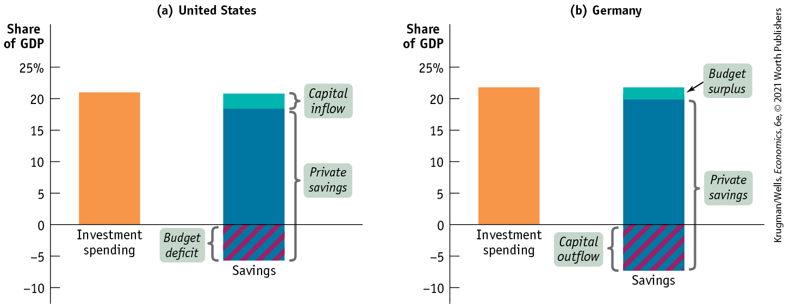
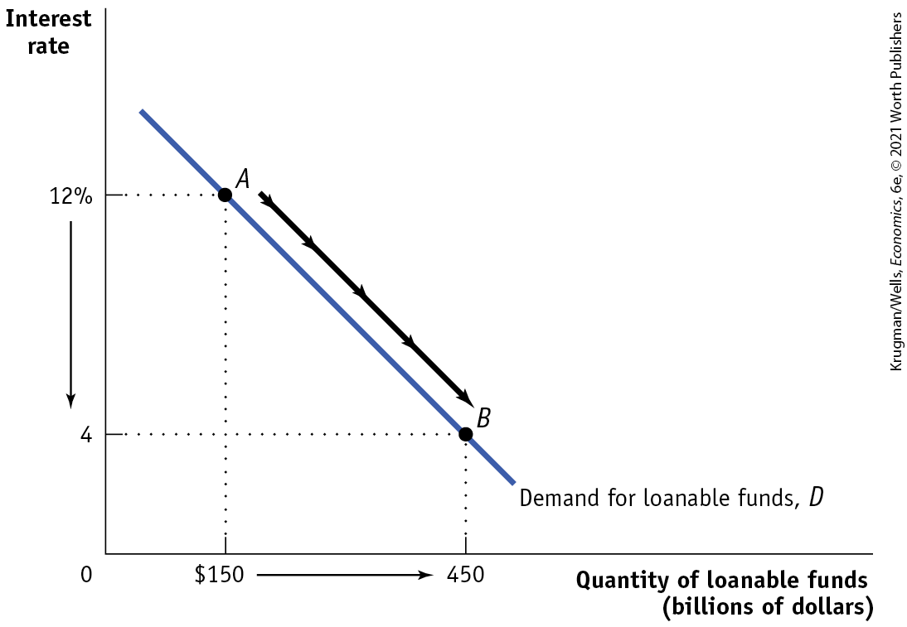

# Chapter 10 Savings, Investment Spending, and the Financial System

## Paying for a Hidden Empire

<figure id="pau_9781319320164_Sr3VBNAxeH" class="figure lm_img_lightbox unnum c2 right">

<figcaption>
<strong>Through the financial system Amazon obtained billions of dollars to finance its expansion, making it the world’s largest online retailer.</strong>
</figcaption>
</figure>

**<a href="http://AMAZON.COM" id="kru_9781319245269_ch10_01.xhtml#pau_9781319320164_xUUDEd2v1M" class="external">AMAZON.COM</a> IS THE WORLD’S LARGEST** and most famous online retailer. Millions of people routinely visit its website to buy everything from books to electronics to pet supplies. You click a mouse or tap your smartphone, and a few days later the item you want shows up at your door, seemingly untouched by human hands.

But the impression one sometimes has of a disembodied organization that summons consumer goods out of thin air is misleading: Amazon is by no means a virtual company. Behind those convenient online interactions and deliveries lies a vast, if mostly hidden, physical empire of server farms handling data and warehouses. In fact, that network of physical facilities is widely regarded as a key factor in Amazon’s success. According to one recent analysis, Amazon has more than 175 warehouses (“fulfillment centers,” in Amazon-speak) that employ 250,000 workers; half the U.S. population lives within 20 miles of one of these centers.

The existence of these warehouses, so close to major markets and containing a huge inventory of popular products, is what allows the firm to offer one- or two-day delivery on many items. And this superiority in distribution — some of you may have bought your textbook from Amazon! — gives the company a big competitive advantage.

We don’t know exactly how much Amazon has spent to build this hidden physical empire, but the cost has surely run to many billions of dollars. Where did that money come from?

Not from reinvestment of the company’s profits: Amazon, founded in 1994, basically earned no profits until 2016. But the company was able to convince outside investors that it would eventually become highly profitable. And the prospect of future profits was enough to bring in large amounts of money from outside investors.

Some of these investors bought equity — essentially shares in those expected future profits. In a move that was unusual for tech companies but was standard practice for many traditional companies, Amazon also, early in its history, sold debt: promises to pay investors a fixed amount each year, whatever happens. Those debt sales were controversial at the time, but are now widely viewed as having given Amazon a crucial advantage over competitors, who weren’t able to make the same kind of investment in physical plant, especially those in warehouses.

Amazon, then, was able to get the money it needed for massive investment spending long before that spending could yield financial results. It was, in a way, a kind of financial miracle. But while Amazon is an exceptional case, the same kind of financial miracle happens all the time in modern economies.

The long-run growth we analyzed in the previous chapter depends crucially on a set of markets and institutions, collectively known as the *financial system,* that channels the funds of savers into productive investment spending. Without this system, businesses like Amazon would not be able to purchase much of the physical capital that is an important source of productivity growth. And savers would be forced to accept a lower return on their funds.

Historically, financial systems channeled funds into investment spending projects such as railroads and factories. Today, financial systems channel funds into new sources of growth such as green technology, social media, and investments in human capital. Without a well-functioning financial system, a country will suffer stunted economic growth.

In this chapter, we begin by focusing on the economy as a whole. We will examine the relationship between savings and investment spending. Next, we go behind this relationship and analyze the financial system, the means by which savings is transformed into investment spending.

We’ll see how the financial system works by creating assets, markets, and institutions that increase the welfare of both savers (those with funds to invest) and borrowers (those with investment spending projects to finance). Finally, we examine the behavior of financial markets and why they often resist economists’ attempts at explanation. 

<aside class="learning-objectives c3 main-flow v3" epub:type="learning-objectives" id="pau_9781319320164_65i6jRTyXV">

### What you will learn

- What is the relationship between savings and investment spending?
- How does the **loanable funds market** match savers with borrowers?
- What are the purposes of the four principal types of **financial assets: loans**, bonds, stocks, and **bank deposits?**
- How do **financial intermediaries** help investors achieve **diversification?**
- What are the competing views about how asset prices are determined and why asset market fluctuations can be a source of macroeconomic instability?

</aside>

## Matching Up Savings and Investment Spending

We learned in the previous chapter that two of the essential ingredients in economic growth are increases in the economy’s levels of *human capital* and *physical capital.* Human capital is largely provided by governments through public education. (In countries with a large private education sector, like the United States, private post-secondary education is also an important source of human capital.) But physical capital, with the exception of infrastructure, is mainly created through private investment spending — that is, spending by firms rather than by the government.

Who pays for private investment spending? In some cases it’s the people or corporations that actually do the spending — for example, a family that owns a business might use its own savings to buy new equipment or a new building, or a corporation might reinvest some of its own profits to build a new factory. In the modern economy, however, individuals and firms that create physical capital often do it with other people’s money — money that they borrow or raise by selling stock.

You may recall <a href="#kru_9781319245269_ch07_02.xhtml#pau_9781319320164_TafrofvMlE" id="kru_9781319245269_ch10_02.xhtml#pau_9781319320164_U7rhWe7Wfa" class="crossref">Figure 7-1</a>, which showed an extended version of the circular flow of funds through the economy. In <a href="#kru_9781319245269_ch07_01.xhtml#pau_9781319320164_J4fyDEWkvv" id="kru_9781319245269_ch10_02.xhtml#pau_9781319320164_Vdor3AhBrD" class="crossref">Chapter 7</a> we focused on the left side of that diagram, the green arrows showing flows of money into and out of the markets for goods and services. In this chapter we focus on the blue arrows on the right side of the diagram, specifically those flowing into and out of the *financial markets,* markets in which the government, firms, and individuals trade not goods but promises to pay in the future.

To understand financial markets and how investment spending is financed, we need to look first at how savings and investment spending are related for the economy as a whole. Then we will examine how savings are allocated among investment spending projects.

### The Savings–Investment Spending Identity

The most basic point to understand about savings and investment spending is that they are always equal. This is not a theory; it’s a fact of accounting called the <a href="#kru_9781319245269_EM_glossary.xhtml#pau_9781319320164_vz0sO3nRTf" id="kru_9781319245269_ch10_02.xhtml#pau_9781319320164_cEKx2un3dn" class="glossref" role="doc-glossref">savings–investment spending identity</a>.

<aside aria-label="title 1" class="glossary c3 main-flow v1" epub:type="glossary" id="pau_9781319320164_WoplIr4pw9">

**savings–investment spending identity**  
According to the **savings–investment spending identity**, savings and investment spending are always equal for the economy as a whole.

</aside>

To see why the savings–investment spending identity must be true, let’s look again at the national income accounting that we learned in <a href="#kru_9781319245269_ch07_01.xhtml#pau_9781319320164_J4fyDEWkvv" id="kru_9781319245269_ch10_02.xhtml#pau_9781319320164_8SkVBcvgm3" class="crossref">Chapter 7</a>. Recall that GDP is equal to total spending on domestically produced final goods and services, and that we can write the following equation (which is the same as <a href="#kru_9781319245269_ch07_02.xhtml#pau_9781319320164_vovnD2gdpq" id="kru_9781319245269_ch10_02.xhtml#pau_9781319320164_DZY2MyGte6" class="crossref">Equation 7-1</a>):

$$\text{GDP} = C + I + G + X - IM$$

**(10-1)**

where *C* is spending by consumers, *I* is investment spending, *G* is government purchases of goods and services, *X* is the value of exports to other countries, and *IM* is spending on imports from other countries.

<aside class="case-study c3 main-flow v5" epub:type="case-study" id="pau_9781319320164_dlac9IU4Hr" title="Pitfalls">

#### *PITFALLS*

INVESTMENT VERSUS INVESTMENT SPENDING

When macroeconomists use the term *investment spending,* they almost always mean “spending on new physical capital.” This can be confusing, because in ordinary life we often say that someone who buys stocks or purchases an existing building is “investing.” The important point to keep in mind is that only spending that adds to the economy’s stock of physical capital is “investment spending.” In contrast, the act of purchasing an asset such as a share of stock or a bond is “making an investment.”

</aside>

#### The Savings–Investment Spending Identity in a Closed Economy

In a closed economy, there are no exports or imports. So $X = 0$ and $IM = 0$, which makes <a href="#kru_9781319245269_ch10_02.xhtml#pau_9781319320164_EsiY4eBIjm" id="kru_9781319245269_ch10_02.xhtml#pau_9781319320164_C3xjmrQu9r" class="crossref">Equation 10-1</a> simpler. As we learned in <a href="#kru_9781319245269_ch07_01.xhtml#pau_9781319320164_J4fyDEWkvv" id="kru_9781319245269_ch10_02.xhtml#pau_9781319320164_fyilq3RATz" class="crossref">Chapter 7</a>, the overall income of this simplified economy would, by definition, equal total spending. Why? Recall one of the basic principles of economics from <a href="#kru_9781319245269_ch01_01.xhtml#pau_9781319320164_cMQypPwEmS" id="kru_9781319245269_ch10_02.xhtml#pau_9781319320164_g72h1osVId" class="crossref">Chapter 1</a>, that one person’s spending is another person’s income: the only way people can earn income is by selling something to someone else, and every dollar spent in the economy creates income for somebody. This is represented by <a href="#kru_9781319245269_ch10_02.xhtml#pau_9781319320164_zulw42kIzW" id="kru_9781319245269_ch10_02.xhtml#pau_9781319320164_XMN9m4PZiJ" class="crossref">Equation 10-2</a>: on the left, GDP represents total income earned in the economy, and on the right, *$C + I + G$* represents total spending in the economy:

$$\begin{array}{rcl}
\text{GDP} & = & {C + I + G} \\
\text{Total income} & = & \text{Total spending}
\end{array}$$

**(10-2)**

Now, what can be done with income? It can either be spent on consumption — consumer spending (*C*) plus government purchases of goods and services (*G*) — or saved (*S*). So it must be true that:

$$\begin{array}{rcl}
\text{GDP} & = & {C + G + S} \\
\text{Total income} & = & {\text{Consumption spending}\operatorname{~+~}\text{Savings}}
\end{array}$$

**(10-3)**

where *S* is savings. Meanwhile, as <a href="#kru_9781319245269_ch10_02.xhtml#pau_9781319320164_zulw42kIzW" id="kru_9781319245269_ch10_02.xhtml#pau_9781319320164_YYLtNg9Say" class="crossref">Equation 10-2</a> tells us, total spending consists of either consumption spending $(C + G)$ or investment spending (*I*):

$$\begin{array}{rcl}
\text{GDP} & = & {C + G + I} \\
\text{Total income} & = & {\text{Consumption spending}\operatorname{~+~}\text{Investment spending}}
\end{array}$$

**(10-4)**

Putting <a href="#kru_9781319245269_ch10_02.xhtml#pau_9781319320164_XUqYAglZ3d" id="kru_9781319245269_ch10_02.xhtml#pau_9781319320164_e4ezv1revL" class="crossref">Equations 10-3</a> and <a href="#kru_9781319245269_ch10_02.xhtml#pau_9781319320164_2VTHnEJLJd" id="kru_9781319245269_ch10_02.xhtml#pau_9781319320164_JGryqz9HZU" class="crossref">10-4</a> together, we get:

$$\begin{array}{rcl}
{C + G + S} & = & {C + G + I} \\
{\text{Consumption spending}\operatorname{~+~}\text{Savings}} & = & {\text{Consumption spending}\operatorname{~+~}\text{Investment spending}}
\end{array}$$

**(10-5)**

Subtract consumption spending $(C + G)$ from both sides, and we get:

$$\begin{array}{rcl}
S & = & I \\
\text{Savings} & = & \text{Investment spending}
\end{array}$$

**(10-6)**

As we said, then, it’s a basic accounting fact that savings equals investment spending for the economy as a whole.

Now, let’s take a closer look at savings. Households are not the only parties that can save in an economy. In any given year, the government can save, too, if it collects more tax revenue than it spends. When this occurs, the difference is called a <a href="#kru_9781319245269_EM_glossary.xhtml#pau_9781319320164_HyQKe9gixE" id="kru_9781319245269_ch10_02.xhtml#pau_9781319320164_TT7exvEqqR" class="glossref" role="doc-glossref">budget surplus</a> and is equivalent to savings by government.

<aside aria-label="title 2" class="glossary c3 main-flow v1" epub:type="glossary" id="pau_9781319320164_89mtO5qcPv">

**budget surplus**  
The **budget surplus** is the difference between tax revenue and government spending when tax revenue exceeds government spending.

</aside>

If, alternatively, government spending exceeds tax revenue, there is a <a href="#kru_9781319245269_EM_glossary.xhtml#pau_9781319320164_t5cy2SZQwc" id="kru_9781319245269_ch10_02.xhtml#pau_9781319320164_rCNNVM5625" class="glossref" role="doc-glossref">budget deficit</a> — a negative budget surplus. In this case, we often say that the government is *dissaving:* by spending more than its tax revenues, the government is engaged in the opposite of savings. One way to finance a budget deficit is by borrowing. <a href="#kru_9781319245269_EM_glossary.xhtml#pau_9781319320164_89DccseI08" id="kru_9781319245269_ch10_02.xhtml#pau_9781319320164_3cAeQJTl56" class="glossref" role="doc-glossref">Government borrowing</a> is the total amount of funds borrowed by federal, state, and local governments in the financial markets.

<aside aria-label="title 3" class="glossary c3 main-flow v1" epub:type="glossary" id="pau_9781319320164_FRaesjHHr3">

**budget deficit**  
The **budget deficit** is the difference between tax revenue and government spending when government spending exceeds tax revenue.

</aside>
<aside aria-label="title 4" class="glossary c3 main-flow v1" epub:type="glossary" id="pau_9781319320164_2d5Py2xe9g">

**government borrowing**  
**Government borrowing** is the total amount of funds borrowed by federal, state, and local governments in the financial markets.

</aside>

We’ll define the term <a href="#kru_9781319245269_EM_glossary.xhtml#pau_9781319320164_lkzRFQAu6v" id="kru_9781319245269_ch10_02.xhtml#pau_9781319320164_csKuRAXqkq" class="glossref" role="doc-glossref">budget balance</a> to refer to both cases, with the understanding that the budget balance can be positive (a budget surplus) or negative (a budget deficit). The budget balance is defined as:

$$S_{Government} = T - G - TR$$

**(10-7)**

<aside aria-label="title 5" class="glossary c3 main-flow v1" epub:type="glossary" id="pau_9781319320164_z5bBJ898ag">

**budget balance**  
The **budget balance** is the difference between tax revenue and government spending.

</aside>

where *T* is the value of tax revenues and *TR* is the value of government transfers. The budget balance is equivalent to savings by government — if it’s positive, the government is saving; if it’s negative, the government is dissaving. <a href="#kru_9781319245269_EM_glossary.xhtml#pau_9781319320164_1bkaR9fmaa" id="kru_9781319245269_ch10_02.xhtml#pau_9781319320164_t40DY6VMWB" class="glossref" role="doc-glossref">National savings</a>, which we just called savings, for short, is equal to the sum of the budget balance and private savings, where private savings is disposable income (income plus government transfers minus taxes) minus consumption. It is given by:

$$S_{National} = S_{Government} + S_{Private}$$

**(10-8)**

<aside aria-label="title 6" class="glossary c3 main-flow v1" epub:type="glossary" id="pau_9781319320164_foBq2Tg6LI">

**national savings**  
**National savings**, the sum of private savings and the budget balance, is the total amount of savings generated within the economy.

</aside>

So <a href="#kru_9781319245269_ch10_02.xhtml#pau_9781319320164_gU680ySMQY" id="kru_9781319245269_ch10_02.xhtml#pau_9781319320164_CxhyGeNcS7" class="crossref">Equations 10-6</a> and <a href="#kru_9781319245269_ch10_02.xhtml#pau_9781319320164_I1mi4dJNH4" id="kru_9781319245269_ch10_02.xhtml#pau_9781319320164_MerUK0OeRS" class="crossref">10-8</a> tell us that, in a closed economy, the savings–investment spending identity has the following form:

$$\begin{array}{rcl}
S_{National} & = & I \\
\text{National savings} & = & \text{Investment spending}
\end{array}$$

**(10-9)**

#### The Savings–Investment Spending Identity in an Open Economy

In an open or international economy, goods and money can flow into and out of the country. This changes the savings–investment spending identity because savings need not be spent on investment spending projects in the same country in which the savings are generated. That’s because the savings of people who live in any one country can be used to finance investment spending that takes place in other countries. So any given country can receive *inflows* of funds — foreign savings that finance investment spending in that country. Any given country can also generate *outflows* of funds — domestic savings that finance investment spending in another country.

<aside class="case-study c3 main-flow v5" epub:type="case-study" id="pau_9781319320164_q1SetenGOd" title="Pitfalls">

##### *PITFALLS*

THE DIFFERENT KINDS OF CAPITAL

It’s important to understand clearly the three different kinds of capital: physical capital, human capital, and financial capital (as explained in the previous chapter):

1.  *Physical capital* consists of manufactured resources such as buildings and machines.
2.  *Human capital* is the improvement in the labor force generated by education and knowledge.
3.  *Financial capital* is funds from savings that are available for investment spending. A country that has a positive net capital inflow is experiencing a flow of funds into the country from abroad that can be used for investment spending.

</aside>

The net effect of international inflows and outflows of funds on the total savings available for investment spending in any given country is known as the <a href="#kru_9781319245269_EM_glossary.xhtml#pau_9781319320164_iPfYEh0YvC" id="kru_9781319245269_ch10_02.xhtml#pau_9781319320164_4vaBEweJkp" class="glossref" role="doc-glossref">net capital inflow</a> into that country, equal to the total inflow of foreign funds minus the total outflow of domestic funds to other countries. Like the budget balance, a net capital inflow can be negative — that is, more capital can flow out of a country than flows into it. In recent years, the United States has experienced a consistent positive net capital inflow from foreigners, who view our economy as an attractive place to put their savings. In 2018, for example, net capital inflows into the United States were \$509.5 billion.

<aside aria-label="title 7" class="glossary c3 main-flow v1" epub:type="glossary" id="pau_9781319320164_vy0Xo9fAlw">

**net capital inflow**  
**Net capital inflow** is the total inflow of funds into a country minus the total outflow of funds out of a country.

</aside>

It’s important to note that, from a national perspective, a dollar generated by national savings and a dollar generated by capital inflow are not equivalent. Yes, they can both finance the same dollar’s worth of investment spending. But any dollar borrowed from a saver must eventually be repaid with interest. A dollar that comes from national savings is repaid with interest to someone domestically — either a private party or the government.

But a dollar that comes as capital inflow must be repaid with interest to a foreigner. So a dollar of investment spending financed by a capital inflow comes at a higher *national* cost — the interest that must eventually be paid to a foreigner — than a dollar of investment spending financed by national savings.

The fact that a net capital inflow represents funds borrowed from foreigners is an important aspect of the savings–investment spending identity in an international economy. Consider an individual who spends more than their income; that person must borrow the difference from others. Similarly, a country that spends more on imports than it earns from exports must borrow the difference from foreigners. And that difference, the amount of funds borrowed from foreigners, is the country’s net capital inflow. As we explain more fully in <a href="#kru_9781319245269_ch18_01.xhtml#pau_9781319320164_L1a5VDcA2j" id="kru_9781319245269_ch10_02.xhtml#pau_9781319320164_c974lGJw0A" class="crossref">Chapter 18</a>, this means the net capital inflow into a country is equal to the difference between imports and exports:

$$\begin{array}{rcl}
{NCI} & = & {IM\  - \ X} \\
\text{Net capital inflow} & = & {\text{Imports}\operatorname{~-~}\text{Exports}}
\end{array}$$

**(10-10)**

Rearranging <a href="#kru_9781319245269_ch10_02.xhtml#pau_9781319320164_EsiY4eBIjm" id="kru_9781319245269_ch10_02.xhtml#pau_9781319320164_6vXkd0IEuA" class="crossref">Equation 10-1</a> we get:

$$I = (GDP - C - G) + (IM - X)$$

**(10-11)**

Using <a href="#kru_9781319245269_ch10_02.xhtml#pau_9781319320164_XUqYAglZ3d" id="kru_9781319245269_ch10_02.xhtml#pau_9781319320164_DIuoJAZten" class="crossref">Equation 10-3</a> we know that $\text{GDP}\operatorname{~-~}C - G$ is equal to national savings, so that:

$$\begin{array}{rcl}
{I = S_{National} + (IM - X)} & = & {S_{National} + NCI} \\
\text{Investment spending} & = & {\text{National savings}\  + \ \text{Net capital inflow}}
\end{array}$$

**(10-12)**

So the application of the savings–investment spending identity to an economy that is open to inflows or outflows of capital means that investment spending is equal to savings, where savings is equal to national savings *plus* net capital inflow. That is, in an economy with a positive net capital inflow, some investment spending is funded by the savings of foreigners. And in an economy with a negative net capital inflow (that is, more capital is flowing out than flowing in), some portion of national savings is funding investment spending in other countries.

U.S. investment spending in 2018 totaled \$4,315.5 billion. Private savings totaled \$4,478.4 billion, and government savings equaled $- \text{\$}683.2\,\text{billion,}$ leading to national savings of \$3,795.2 billion. Net capital inflow was \$509.5 billion. Notice that these numbers don’t quite add up. Because data collection isn’t perfect, there is a statistical discrepancy of \$10.8 billion, the amount that national savings plus net capital inflow exceeded investment spending. We know this is a data error because the savings–investment spending identity must hold.

<a href="#kru_9781319245269_ch10_02.xhtml#pau_9781319320164_dZ0GnTrFFY" id="kru_9781319245269_ch10_02.xhtml#pau_9781319320164_QHO51FVQSQ" class="crossref">Figure 10-1</a> shows what the savings–investment spending identity looked like in 2018 for two of the world’s major economies, those of the United States and Germany. To make the two economies easier to compare, we’ve measured savings and investment spending as percentages of GDP. In each panel the orange bars on the left show total investment spending and the multicolored bars on the right show the components of savings. U.S. investment spending was 21.0% of GDP, financed by a combination of private savings (24.1% of GDP) and positive net capital inflow (2.4% of GDP) and partly offset by a government budget deficit ($- 5.7\%$ of GDP). German investment spending was higher as a percentage of GDP, at 21.8%. It was financed by a higher level of private savings as a percentage of GDP (27.2%), and a government budget surplus (1.9% of GDP), but was offset by a negative capital inflow or capital outflow ($- 7.3\%$ of GDP).

<figure id="pau_9781319320164_dZ0GnTrFFY" class="figure lm_img_lightbox num c4 main-flow">

<figcaption>
FIGURE 10-1 The Savings–Investment Spending Identity in Open Economies: The United States and Germany, 2018

U.S. investment spending in 2018 (equal to 21.0% of GDP) was financed by a combination of private savings (24.1% of GDP) and a capital inflow (2.4% of GDP), which were partially offset by a government budget deficit ( − 5.7% of GDP). German investment spending in 2018 was slightly higher as a percentage of GDP (21.8%). It was financed by a higher level of private savings as a percentage of GDP (27.2%), and a small government budget surplus (1.9% of GDP), but was offset by a capital outflow ( − 7.3% of GDP). Bars may not equal due to statistical discrepancy.

<em>Data from:</em> International Monetary Fund.
</figcaption>
</figure>

<aside class="hidden" id="pau_9781319320164_TumMoV1ORC" title="hidden">

Graph (a) United States: The vertical axis labeled Share of G D P ranges from negative 10 to 25 percent in increments of 5 percent. The horizontal axis shows two markings, Investment spending and Savings. The data from the graph are as follows, Investment spending 21 percent; saving, 20 percent. The saving includes capital inflow of 2 percent and private savings of 18 percent with a budget deficit of negative 5 percent. The capital inflow is shaded from 18 percent to 20 percent in the bar, and the remaining 18 percent and the budget deficit are collectively labeled, private savings. Graph (b) Germany: The vertical axis labeled Share of G D P ranges from negative 10 to 25 percent in increments of 5 percent. The horizontal axis shows two markings, Investment spending and Savings. The data from the graph are as follows: Investment spending 22 percent; saving, 22 percent. The saving includes budget surplus of 2 percent and private savings of 20 percent with a capital outflow of negative 7 percent. The budget surplus is shaded from 20 percent to 22 percent in the bar, and the remaining 20 percent and the capital outflow are collectively labeled, private savings.

</aside>

The economy’s savings finance its investment spending. But how are these funds that are available for investment spending allocated among various projects? That is, what determines which projects get financed (such as Amazon’s fulfillment centers) and which don’t? We’ll see shortly that funds get allocated to investment spending projects using a familiar method: by the market, via supply and demand.

### The Market for Loanable Funds

For the economy as a whole, savings always equals investment spending. In a closed economy, savings is equal to national savings. In an international or open economy, savings is equal to national savings plus capital inflow. At any given time, however, savers, the people with funds to lend, are usually not the same as borrowers, the people who want to borrow to finance their investment spending. How are savers and borrowers brought together?

Savers and borrowers are matched up with one another in much the same way producers and consumers are matched up: through markets governed by supply and demand.

To understand this, it helps to consider a somewhat simplified version of reality. In the actual economy, there are a large number of different financial markets. These include markets for *bonds* and *loans,* which are both promises to pay a fixed amount whatever happens, and for *stocks,* which give investors a share of future profits. However, economists often work with a simplified model in which they assume that there is just one market that brings together those who want to lend money (savers) and those who want to borrow (firms with investment spending projects).

This hypothetical market is known as the <a href="#kru_9781319245269_EM_glossary.xhtml#pau_9781319320164_X2yeorbXUL" id="kru_9781319245269_ch10_02.xhtml#pau_9781319320164_0AbnxDhXjB" class="glossref" role="doc-glossref">loanable funds market</a>. The price that is determined in the loanable funds market is the interest rate, denoted by *r.* As we noted in <a href="#kru_9781319245269_ch08_01.xhtml#pau_9781319320164_6AH2l2uZnD" id="kru_9781319245269_ch10_02.xhtml#pau_9781319320164_LhPHq4LrPj" class="crossref">Chapter 8</a>, loans typically specify a nominal interest rate. So although we call *r* “the interest rate,” it is with the understanding that *r* is a nominal interest rate — an interest rate that is unadjusted for inflation.

<aside aria-label="title 8" class="glossary c3 main-flow v1" epub:type="glossary" id="pau_9781319320164_v8pPfik4x2">

**loanable funds market**  
The **loanable funds market** is a hypothetical market that illustrates the market outcome of the demand for funds generated by borrowers and the supply of funds provided by lenders.

</aside>

We’re not quite done simplifying things. There are, in reality, many different kinds of interest rates, because there are many different kinds of loans — short-term loans, long-term loans, loans made to corporate borrowers, loans made to governments, and so on. In the interest of simplicity, we’ll ignore those differences and assume that there is only one type of loan.

OK, now we’re ready to analyze how savings and investment get matched up.

#### The Demand for Loanable Funds

<a href="#kru_9781319245269_ch10_02.xhtml#pau_9781319320164_JURXHw1Au6" id="kru_9781319245269_ch10_02.xhtml#pau_9781319320164_pklP8DSTUS" class="crossref">Figure 10-2</a> illustrates a hypothetical demand curve for loanable funds, *D,* which slopes downward. On the horizontal axis we show the quantity of loanable funds demanded. On the vertical axis we show the interest rate, which is the “price” of borrowing. But why does the demand curve for loanable funds slope downward?

<figure id="pau_9781319320164_JURXHw1Au6" class="figure lm_img_lightbox num c3 main-flow">

<figcaption>
FIGURE 10-2 The Demand for Loanable Funds

The demand curve for loanable funds slopes downward: the lower the interest rate, the greater the quantity of loanable funds demanded. Here, reducing the interest rate from 12% to 4% increases the quantity of loanable funds demanded from $150 billion to $450 billion.
</figcaption>
</figure>

<aside class="hidden" id="pau_9781319320164_iEaGwsr1wU" title="hidden">

The vertical axis labeled Interest rate shows markings at 0, 4, and 12 percent, from bottom to top. The horizontal axis labeled Quantity of loanable funds (billions of dollars) shows markings at 0, 150 dollars, and 450, from left to right. The graph depicts a negative sloping demand curve for Loanable funds D, passing through two points at A (150, 12) and B (450, 4). An arrow from A is pointing toward B, along the slope of the curve. A downward arrow is from 12 percent to 4 percent on the vertical axis.

</aside>

To answer this question, consider what a firm is doing when it engages in investment spending — say, by buying new equipment. Investment spending means laying out money right now, expecting that this outlay will lead to higher profits at some point in the future. In fact, however, the promise of a dollar five or ten years from now is worth less than an actual dollar right now. So an investment is worth making only if it generates a future return that is *greater* than the monetary cost of making the investment today. How much greater?

To answer that, we need to take into account the present value of the future return the firm expects to get. We examine the concept of *present value* in the accompanying For Inquiring Minds. Then, in the chapter’s appendix, we show how the concept of present value can be applied to dollars earned multiple years in the future. The appendix also addresses how present value is used to calculate the prices of shares of stock and bonds.

<aside class="case-study c3 main-flow v1" epub:type="case-study" id="pau_9781319320164_dIrY4grUEY" title="For Inquiring Minds">
